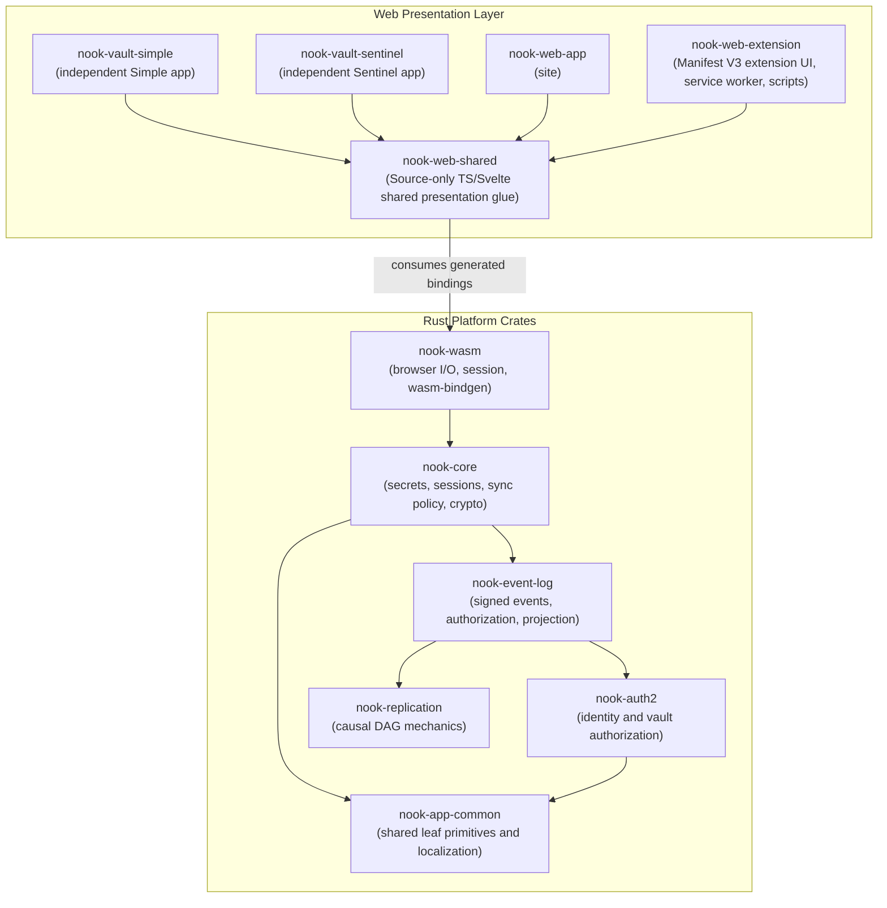
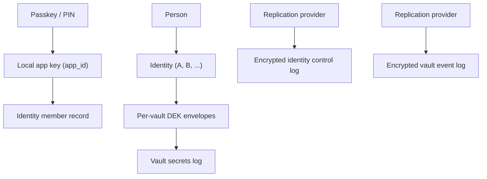

# Nook System Architecture Specification

## Overview

This document provides a comprehensive guide to Nook's architecture, package boundaries, data flows, and development environments. It serves as the primary technical context map for both human developers and autonomous AI coding agents.

---

## 1. Monorepo Structure & Dependency flow

- **Dependency direction:** Nook is a modular monorepo with strict
  uni-directional dependency flow.
- **Application scope:** App code lives under `nook-app/`.
  - It contains the Rust platform crates under `nook-platform/`.
  - It contains the WASM bridge, web app, and browser-extension package.
  - It contains Docker definitions for the split Rust/WASM and web images.
- **Architectural effects:** This layout prevents architectural drift.
  - It keeps concerns separated.
  - It isolates WebAssembly bindings from core domain code.

- **Subsystems at repository root:**
  - `infra`: infrastructure composition root, cluster definitions, persistent services, and deployment operations.
  - `nook-app`: application product code, Rust domain/platform workspace, WASM bridge, and web frontends.
  - `agentic-ai`: agent tooling, deterministic Cortex runner (Loom), CI agent, and isolated worker environments.
  - `preflight`: standalone repository invariant verification tests.
- **Dynamic exploration:** Detailed internal directory structures are dynamic.
  Agents must investigate directory trees directly using exploration tools rather
  than relying on static documentation trees.

### Dependency Enforcements

1. **No Circular Dependencies:** `nook-core` must not depend on `nook-wasm` or `nook-web`. `nook-wasm` must not depend on `nook-web`.
2. **Platform Portability:** `nook-app-common`, `nook-auth2`, `nook-replication`, `nook-event-log`, and `nook-core` compile on native and `wasm32-unknown-unknown`.
- No browser APIs in these crates.
- Simple domain DTOs/enums may carry `wasm-bindgen` annotations so web callers use the same typed core models.

### Security-domain model

Nook separates identity management from encrypted vault storage:

- **Identity:** An identity is a logical account.
  - It possesses passkeys and therefore app keys.
  - It owns each vault DEK.
  - One person may use multiple identities.
- **Installation:** An installation holds one local app private key (`app_id`).
  - Passkeys protect app keys.
  - Identity records replicate app public keys and passkey credential records.
  - Private app keys remain local.
- **Vault:** A vault owns its `store_id`, secret ciphertext, signed event log,
  and projection.
  - It cannot exist without an authorizing identity.
  - It cannot hold a DEK by itself.
  - Passwords are vault content.
- **Provider:** A provider is a caller-supplied replication adapter.
  - It is never an identity or unlock factor.
  - Its credentials stay sealed to a local app key.

The normative model is in
[identity-vault-architecture.md](design-docs/identity-vault-architecture.md).

---

## 2. Package Responsibilities & Layers

Nook is structured into three architectural tiers: portable Rust platform crates, a typed WebAssembly bridge, and isolated web presentation packages.

Detailed package design, module breakdowns, and service boundaries live in
[design-docs/package-responsibilities.md](design-docs/package-responsibilities.md).

### Rust Platform Tier

- **`nook-app-common` (Shared Leaf Primitives):** Owns localization catalogs, translation behavior, and leaf primitives shared across portable crates.
- **`nook-auth2` (Identity & Authorization):** Owns logical identities, app-key derivation, passkey PRF wrapping, and per-vault DEK authorization envelopes.
- **`nook-replication` (Replication Mechanics):** Owns causal DAG index calculations, topological event ordering, and provider-agnostic replica repair.
- **`nook-event-log` (Signed Vault History):** Owns content-addressed event encoding, Ed25519 signatures, authorization graphs, and encrypted projection state.
- **`nook-core` (Application Domain Core):** Owns vault application services, sync reconciliation, crypto operations, search indexing, and domain workflows.

### WebAssembly Bridge Tier

- **`nook-wasm` (The Bridge Layer):** Exposes typed Rust domain services to the browser, manages in-memory sessions, and conducts storage I/O (IndexedDB and HTTP REST) without implementing business logic.

### Web Presentation Tier

- **`nook-vault-simple` (Simple Vault):** Origin-isolated single-user vault application hosted on `simple.nokey.sh` with extension pairing support.
- **`nook-vault-sentinel` (Sentinel Vault):** Origin-isolated multisig/threshold vault application hosted on `sentinel.nokey.sh` with strict protocol isolation.
- **`nook-web-app` (Marketing & Test Site):** Public landing page on `nokey.sh` and local/e2e test harness.
- **`nook-web-shared` (Shared Presentation):** Source-only TypeScript utilities, Svelte 5 UI components, and the shared compiled WASM artifact.
- **`nook-web-extension` (Browser Companion):** Manifest V3 browser companion paired with Simple Vault for in-page credential integration.
- **`nook-web-research` (UI Experiments):** Disposable Svelte 5 catalog for isolated visual experiments without production coupling.

---

## 3. Detailed Data Flow & Execution Model

### Connect (multi-device)

1. Svelte requests WebAuthn passkey options generated by Rust/WASM.
2. WebAuthn `navigator.credentials.get()` retrieves the passkey assertion.
3. `NookVaultManager.unlock_device_identity(prf_output)` derives HKDF-SHA256 and unwraps the AES-256-GCM device identity.
4. `VaultState.loadDb()` initializes the session.
5. `NookVaultManager.connect(mode, pat)` loads the local projection or remote event log.
6. `resolve_secrets_key()` and `resolve_members_key()` extract vault keys from the authorized envelope.
7. `VaultCrypto::new(secrets_key)` decrypts secret values into the in-memory typed `Database` session.

### Add Secret (incremental save)

1. Svelte invokes `add_secret(key, value)`.
2. Rust validates the secret label and payload value.
3. In-memory typed `Database` session is updated.
4. `encrypt_value` encrypts only the modified key to produce armored ciphertext.
5. `serialize_stored` updates the stored YAML projection cache incrementally without full re-encryption.
6. The updated state writes to IndexedDB `vault:{store_id}` and appends provider events.

### Search

1. Svelte calls `prepare_secret_search_js()` on the first non-empty query.
2. WASM loads and decrypts authenticated IndexedDB search buckets (`secret_search_v2:{store_id}:{bucket}`).
3. Search buckets reconcile by ciphertext digest, decrypting only new, changed, or invalid rows.
4. Changed ID-derived search buckets are re-encrypted; legacy plaintext search keys are removed.
5. `nook_core::SecretSearchCatalog::query` executes searches over normalized in-memory text.
6. WASM returns the requested metadata page without record decryption.

---

## 4. Storage & Cryptographic Specs

| Layer | Format | Location |
| --- | --- | --- |
| Session (plaintext user secrets) | Typed `Database` records | WASM memory only |
| On-disk user secrets | YAML `secrets:` list | Values encrypted with `secrets_key` |
| Local search catalog | Age-encrypted `SecretListItem` buckets | IndexedDB `secret_search_v2:{store_id}:{bucket}` |
| Logical secret store | YAML `store_id` | `store_{token}` across replicas |
| Vault revision | Event-log causal heads | Live sync is the event log |
| Active unlock mode | YAML `unlock:` tagged union | Omitted when device keys are the default |
| Vault authorization envelopes | YAML `auth:` list | Per-device encrypted key envelopes |
| Vault member catalog | YAML `members:` list | `members_key`-encrypted relationship data |
| Vault-coupled joins | YAML `joins:` list | Transient device join wire |
| Device identity (X25519 private) | AES-256-GCM wrapped or passkey-derived secret | IndexedDB `device_identity_wrapped` |
| Replication-provider connections | JSON snapshot | IndexedDB `nook_auth` → `providers` |

Search catalog detail:

- Buckets are authenticated.
- Decryption stays in WASM memory only while unlocked.
- Bucket assignment derives from opaque secret ids.

Store identity detail: see [secret-store-identity.md](design-docs/secret-store-identity.md).

Vault revision detail:

- Live sync uses the event log ([vault-event-log.md](design-docs/vault-event-log.md)).
- Legacy YAML `vault_version` is historical/local projection context ([unified-vault.md](design-docs/unified-vault.md)).

Unlock mode detail:

- Password-only vaults use `{type: password, …}`.
- Device-key vaults use `auth:` plus optional `password_entries`.
- See [password-envelope.md](product-specs/password-envelope.md).

Authorization and membership detail:

- Legacy `auth:` rows encode encrypted `secrets_key` and `members_key`.
- Target ownership: identity holds per-vault DEK envelopes to app public keys.
- Legacy `members:` rows use `pk_id` plus `members_key`-encrypted data.
- Identity membership and app public keys live in the identity control log.
- `joins:` remains transient join wire during migration.
- Vault create requires identity + key + identity-generated DEK first.

App key detail:

- Historical name was device identity / device key.
- Deterministic standard mode is compatibility state.
- Target model: fresh random installation-specific app key wrapped locally
  (`app_id`).
- Identity records sync only app public keys and passkey records.

Provider connections detail:

- Credentials are sealed to the local device.
- Targets may mount independently by identity and vault logs.

See [vault-session-and-lock.md](design-docs/vault-session-and-lock.md) for Lock vs persisted data.
See [decentralized-auth.md](product-specs/decentralized-auth.md) for join/approve flows.
See [auth-providers.md](design-docs/auth-providers.md) for login UX and sync-provider credential persistence.
See [vault-event-log.md](design-docs/vault-event-log.md) for provider event-log sync.
See [unified-vault.md](design-docs/unified-vault.md) for local-first vault architecture (scalar sync historical).
See [identity-vault-architecture.md](design-docs/identity-vault-architecture.md) for identity, onboarding, grant, and provider ownership.

YAML payload sections:

- `secrets`: user passwords and payload items encrypted with `secrets_key`.
- `auth`: per-device `secrets_key` and `members_key` envelopes.
- `joins`: transient join requests during migration.
- `members`: `members_key`-encrypted catalog entries.

- **Per-record age armor** for values; labels plaintext in YAML.
- **GitHub:** UTF-8 YAML file, base64 in API payloads (not hex blob).
- **IndexedDB `vault:{store_id}`:** UTF-8 YAML projection cache (not hex).

---

## 5. Boundary Error Propagation Model

- All fallible WASM exports return `Result<T, wasm_bindgen::JsError>`.
- `NookError` maps to JS `Error` with message string.
- Svelte catches in `try/catch` on `VaultState` methods.

---

## 6. Testing Strategy

| Package | Tests |
| --- | --- |
| `preflight` | `task preflight` |
| `nook-app-common` | `task rust:coverage:check` |
| `nook-authenticator-domain` | `task rust:coverage:check` |
| `nook-auth2` | `task rust:coverage:check` |
| `nook-replication` | `task rust:coverage:check` |
| `nook-event-log` | `task rust:coverage:check` |
| `nook-companion-core` | `task rust:coverage:check` |
| `nook-core` | `task rust:coverage:check` |
| `nook-web/nook-web-app` | Playwright e2e |
| `nook-wasm` | Covered via `nook-core` + e2e |
| `nook-web/nook-web-extension` | `task extension:check` + `task extension:test:e2e` |

`preflight` detail:

- Standalone Rust tests for whole-repository invariants.
- Covers Rust/WASM-to-TypeScript boundary mirrors.
- Covers authored TypeScript/Svelte absence semantics.
- Covers no-op forwarding wrappers, unchecked WASM type hints, and raw provider/auth `JsValue` DTO signatures.
- Runs before app setup in PR/main CI.

Portable Rust crate detail:

- `task rust:coverage:check` uses llvm-cov + nextest.
- Line coverage floor lives in `nook-app/nook-platform/nook-core/coverage-floor.json`.
- Fast path: `task rust:test`.

Web e2e detail:

- `task web:test:e2e` — main stub gate and explicit PR validation.
- `task web:test:e2e:pr` — fast manual subset.
- `task web:test:e2e:sync-live` — manual real-provider validation.
- See [workflows/ci-pipeline.md](workflows/ci-pipeline.md).

Extension detail:

- `task extension:check` — type/build validation.
- `task extension:test:e2e` — Chromium smoke from packaged `dist`.

Domain logic changes **must** add or update Rust tests before merge. **Line coverage must stay at or above 90%** (`task rust:coverage:check`).

---

## 7. The Engineering Harness

All development tasks run containerized via `Taskfile`.

### Taskfile layout

- Root `Taskfile.yml` is the repo entrypoint.
- App commands live in `nook-app/Taskfile.yml` and are included into the root surface.
- CI tasks live in `nook-app/ci/Taskfile.yml`.
- Rust tasks live in `nook-app/nook-platform/Taskfile.yml`.
- Docker tasks live beside each package under `docker/Taskfile.yml`.
- Web tasks live in `nook-app/nook-web/Taskfile.yml`.
- Extension tasks live in `nook-web-extension/Taskfile.yml`.
- Wasm tasks live in `nook-platform/nook-wasm/Taskfile.yml`.
- Task namespaces match directories: `docker:*` under `docker/`, `ci:*` under `ci/`.
- `infra/Taskfile.yml` is the infrastructure composition root.
- It flattens domain-owned command modules under `infra/tasks/` into one public surface.
- Every infrastructure Taskfile must be reachable from that root.
- Operation shell bodies stay inside their owning domain Taskfile.
- Orphan Taskfiles and standalone shell scripts under `infra/` are prohibited.
- Preflight rejects orphan infrastructure Taskfiles.

### Preflight and sealed images

- Repository-wide invariant tests run through `task preflight`.
- Preflight bakes through `preflight/docker-bake.hcl`.
- It reuses the shared `rust-base` toolchain target.
- It cooks dependency graphs with cargo-chef.
- It compiles with SeaweedFS sccache secret mounts.
- Workspace source is copied into the `nook-web` image at build time.
- Build definition: `nook-app/nook-web/nook-web-app/Dockerfile`.
- There is no runtime bind mount on the common path.
- The image is self-contained and reproducible.

Local-iteration exceptions:

- `task web:dev` and `task web:dev:fast` — Vite hot-reload over trusted `https://localhost:<port>`.
- TLS material lives under `~/.nook/https/` and is git-ignored.
- `task wasm:build:fast` — mounted no-opt WASM regeneration.

HTTPS setup:

- `task web:https:setup` builds and runs the pinned repository `mkcert` container.
- Only the final CA trust operation runs on the host.
- The browser consumes the host trust store.

Playwright and CI keep isolated loopback-HTTP transport when real passkey, OAuth, or provider ceremonies are not under test.

### PR delivery helpers

PR delivery helpers live in `agentic-ai/ci-agent`.

Commands:

- `task pr:preflight`
- `task pr:review`
- `task pr:review-local`
- `task pr:ready`

Review and audit behavior:

- The local review command runs advisory Codex review against `origin/main`.
- The review command posts an idempotent SHA-bound Codex request.
- If Codex reports a usage limit, the same command posts a SHA-bound Cursor
  Bugbot request instead of retrying Codex.
- Complete validation immediately dispatches repository-owned checks.
- It then requests exact-head review without making it a gate.
- Review results are not required for readiness.
- Audit commands emit machine-readable exact-head state.
- Audit commands do not wait for an external reviewer.
- Audit commands never merge a PR.

Merge policy:

- Nook has no event-driven PR auto-merger.
- Workflows do not merge blindly from check events.
- The task-owning agent runs the readiness audit.
- The agent squash-merges immediately when the audit passes.

Local ci-agent Docker tags are worktree-scoped.

Another checkout cannot replace the audit binary between build and readiness execution.

### Remote execution and validation

- Extension iteration and other heavy agent feedback use the allowlisted GitHub-hosted remote task catalog.
- Required product validation runs on GitHub Actions only.
- Validation starts after the coherent pushed iteration is explicitly selected with a validation label.
- Agents do not run local `task check` or `task ci:pr` gates.

Focused dispatches (`rust:test`, `web:check`, `web:test`, `extension:check`):

- Use narrow source-sealed images.
- Native tests branch from the manifest-keyed Rust dependency image.
- Web checks consume only web dependencies plus the generated WASM package.
- They do not join unrelated coverage, WASM-test, browser, full verification, or production-build stages.

All branch code executes on ephemeral GitHub-hosted runners.

The self-hosted `nook` pool remains maintenance-only.

### Split Rust/WASM and web images

**Rust/WASM lineage**

- `rust-base` plus manifest-only chef cooking exposes a lightweight WASM dependency boundary.
- Native verification extends it with nextest, clippy, and coverage profiles.
- Hosted PR CI runs native coverage independently.
- It verifies WASM once on a dedicated producer.
- Web verification and opt-in browser jobs download that producer's small run-stable artifact.
- They do not rebuild Rust/WASM locally.

PR consumer behavior:

- `Web verification` depends on the WASM build producer through `needs`.
- It downloads the clippy-clean WASM package with `actions/download-artifact`.
- `WASM Node tests` can finish in parallel with web verification.
- The conditional `Headless UI demo` job also starts from the WASM handoff.
- It overlaps web verification on UI-changing pull requests.
- It solves the browser image without writing cache state.
- Playwright must succeed before cache publication starts.
- A dedicated cache-only target publishes the isolated exact-head browser graph.
- `Verify and preview` waits for Native Rust, web verification, and WASM Node tests.
- It also waits for the UI demo job.
- It deploys from the exported host dist handoff.
- Rust coverage reporting is a separate native-dependent job.
- That job downloads the completed handoff directly.
- Preview waits for Native verification.
- Preview still does not wait for native coverage.
- Preview does not poll sibling jobs.
- The overall gate requires the required producer jobs.
- Producer failures are reported explicitly.

Hosted CI cache persistence:

- Persists the toolchain.
- Persists stable native/WASM dependency boundaries.
- Persists separate source-sensitive native/WASM snapshots as private Zot BuildKit refs.
- Every PR job restores Main's complete lineage plus its PR remote-buildcache scope.
- PR jobs and local Task Bake export only isolated remote-buildcache refs.
- Explicit Remote tasks may update only their deterministic branch refs with Main fallback.

SeaweedFS reuse:

- Trusted Main and Remote compiler vertices reuse bucket-scoped SeaweedFS `sccache` objects.
- Reuse happens through stable BuildKit secret mounts.

Local on-demand images:

- Explicit `task rust:*` and `task wasm:*` commands load the source-sealed `nook-rust:local` image on demand.
- Browser-only WASM tests and mounted Vite development use `nook-rust-browser:local`.

**Web lineage**

- `web-base` contains Bun, Node, and Task.
- `web-deps` adds `node_modules`.
- PR unit/preview builds use this browser-free lineage.
- The CI-only web target runs format, lint, check, and tests as a sibling of the production web/extension build.
- It joins both successful branches into the same sealed image.
- Verification is not serialized after the build.
- `web-e2e-base` adds Playwright Chromium for Main, manual e2e, and changed PR demos.
- It uses a separate `:web-e2e-*` cache.
- Browser-free PR web solves never pull the browser layer.
- Neither lineage contains Cargo or `target/`.

**Common task image** (`nook-web:local`):

- Starts from `web-base`.
- Adds `node_modules`, the generated WASM package, coverage artifacts, workspace source, and built web/extension output.
- This is the slim image used by normal Task and CI runtime checks.

### `task setup` solve flow

`task setup` has two solves.

**First solve**

- Builds web dependencies alongside a Rust graph.
- The Rust graph fans out from cached dependencies into native verification and WASM.
- Exports the scratch `web-artifacts` join under `${TMPDIR}/nook-web-artifacts/<full-commit-sha>/<unique-invocation>/`.
- The commit namespace isolates different revisions.
- The invocation namespace prevents concurrent builds of the same revision from racing.
- That directory contains only generated WASM and coverage files.
- It is guarded at 256 MiB.

**Second solve**

- Supplies the artifact directory as a named host context to `nook-web`.
- It never passes either multi-GB Rust branch as a Docker context or parent.
- Only this small final web solve is retried once after the known immediate BuildKit frontend/Dockerfile-load flake.
- The expensive preparation graph is never repeated.
- The final Dockerfile asserts that `/usr/local/cargo` and `nook-app/target` are absent.

### Container limits and host prerequisites

- **Container file descriptors:** Nook runtime containers set
  `nofile=1048576`.
  - `DOCKER_NOFILE_LIMIT` can override that value.
- **Inotify ownership:** Inotify sysctls are kernel-wide.
  - Docker rejects them as per-container `--sysctl` options.
- **Linux prerequisites:** Developers configure the documented host values:

  - At least `fs.inotify.max_user_instances=2500`.
  - At least `fs.inotify.max_user_watches=10485760`.

- **GitHub Actions:** The shared Docker setup raises those values when needed.
  - It does not lower larger runner defaults.

macOS behavior:

- Inotify sysctls live inside Docker Desktop's Linux VM.
- Apply them with the documented short-lived privileged container after Docker Desktop restarts.
- macOS `sudo sysctl` does not configure the VM.

macOS host-wide file-descriptor ceilings:

- `kern.maxfiles`
- `kern.maxfilesperproc`
- launchd's `maxfiles` controls newly launched processes.
- The README documents the current-host 10x values.

### Build export: host artifact boundary + docker driver

- **Old combined image:** The `nook-web` filesystem was about 9 GB.
  - It inherited warm Rust `target/`, the compiler, Cargo registry, web
    dependencies, and Playwright.
- **Split lineages:** Rust and web caches remain in independent BuildKit
  lineages.
  - Only the WASM package and coverage outputs cross from Rust to web.
  - They cross through the commit-scoped, invocation-isolated host directory.
  - The common runtime image contains no Rust toolchain or `target/`.
- **Local export:** The normal **`docker` driver** writes the web result directly
  to the containerd image store.
  - It avoids an extra archive/import cycle.
- **Hosted export:** Delivery validation uses an ephemeral `docker-container`
  builder.
  - It restores the independent lineages from `registry.dev.nokey.sh`.

**Builder selection**

- Normal local `task setup` and optional local `task ci:*` callers use the active Docker-context daemon builder.
- Examples: `desktop-linux` on Docker Desktop or `default` on plain Linux.
- They never share a `nook-pr` docker-container.
- GitHub Actions creates an ephemeral job-scoped `docker-container` builder with `docker/setup-buildx-action`.
- It passes that unique name through the bounded health wrapper before repository preflight and app solve phases begin.
- Warm layers come from authenticated registry cache refs.
- Warm layers do not come from reusing one host BuildKit container across deployments.

**CI parity** (`.github/actions/nook-docker-setup`)

- Raises Linux watcher limits.
- Creates and exports the hosted `docker-container` Buildx builder for wrapped and direct Task callers.
- Logs into `registry.dev.nokey.sh`.
- Enables Bake registry cache refs.
- Trusted Main and same-repository PR/Rust-ecosystem Rust producers receive the SeaweedFS writer identity.
- Explicit Remote compiler vertices receive a read-only identity through stable BuildKit secret IDs.
- Fork, release, arbitrary-ref, dependency-update, and AI-authored jobs remain secret-free.
- Delivery does not depend on the daemon's default image store.
- Delivery never rewrites daemon configuration or restarts Docker.

**BuildKit caching through `registry.dev.nokey.sh`**

- Local Task Bake restores and publishes shared layers by default when remote
  registry credentials exist under the machine cache directory.
- Root `Taskfile.yml` env enables that path.
- `registry-cache:ensure` logs into Zot before Bake.
- Local writes use git-commit refs (`-git-<sha>`) under `nook/remote-buildcache/**`.
- Local publish requires a clean worktree.
- Local writes never update trusted `nook/buildcache/**`.
- Verify bakes keep `GHA_CACHE_WRITE_ENABLED` empty.
- A follow-up publish Bake exports fat scopes from local layers.
- Opt out with `NOOK_REGISTRY_CACHE=0`.
- Hosted CI first stabilizes the shared Rust toolchain parent in `nook-rust-base-v1`.
- It exports native and WASM dependency boundaries to `nook-rust-deps-v3` and the fingerprinted WASM deps ref with `mode=max`.
- The WASM deps fingerprint covers cook-affecting Cargo and lineage Dockerfile inputs only.
- WASM deps restore may fall back to longer `nook-rust-wasm-source-v2` when that fingerprint is empty.
- Preflight owns static Bake cache proofs in `bake_cache_proofs.rs` for the Zot restore graph.
- Source-sensitive native coverage and WASM outputs use separate `nook-rust-native-source-v3` and `nook-rust-wasm-source-v2` refs.
- A workflow-only or web-only push does not recompile unchanged Rust on a fresh hosted runner.
- Same-repository PR jobs restore Main plus the git-commit remote-buildcache scope.
- PR exporters write only those git-commit remote-buildcache refs.
- Web dependencies, browser-free web, and e2e web use distinct refs and `mode=max`.
- Cache export errors on web lineages are non-fatal because cache is an optimization.
- Zot is reached only through Traefik HTTPS at `registry.dev.nokey.sh` with htpasswd auth.
- There is no host `:5000` listener and no `kubectl port-forward`.

**Rust compiler cache**

Rust/WASM compiles are wrapped by pinned `sccache`.

Authorized identities:

- Local builds, Hive, trusted Main, same-repository PR Rust producers, and Rust ecosystem Docker jobs.
- They use authenticated SeaweedFS S3 at `https://sccache.dev.nokey.sh` when scoped writer credentials exist.

Explicit Remote tasks:

- Use a separate read/list-only identity for the same bucket.
- They reuse trusted compiler objects.
- They cannot publish branch-controlled objects.
- New Remote dependency results persist in task-scoped Zot OCI layers.

- **Trusted publishers:** Main, local, and Hive builds publish new compiler
  objects.
- **Network boundary:** Traefik terminates publicly trusted TLS on `:443`.
  - It forwards only to loopback SeaweedFS S3 (`127.0.0.1:8333`).
- **Secret handling:** Runtime Docker commands and compiler vertices mount
  stable secret IDs.
  - Secret values do not participate in BuildKit cache checksums.
- **Untrusted refs:** Fork, release, and other arbitrary-ref jobs receive no S3
  credentials.

**Main cache visibility**

- Main alone refreshes the shared Rust, WASM, web, and e2e refs under `nook/buildcache/**`.
- PR jobs and local Task Bake cannot write that Main repository path.
- They write only isolated refs under `nook/remote-buildcache/**`.
- Explicit Remote tasks also write only under `nook/remote-buildcache/**`.
- Remote uses a separate Zot identity that can read but cannot update Main's repository path.
- Every Remote ref is scoped by both branch and dispatched task.
- Independent tasks run in parallel without replacing another graph.
- Inactive Remote refs expire after seven days.
- Zot deduplicates identical content-addressed layer blobs across both paths.
- Main clients authenticate with `NOOK_REGISTRY_USERNAME` / `NOOK_REGISTRY_PASSWORD`.
- Remote uses `NOOK_REGISTRY_REMOTE_USERNAME` / `NOOK_REGISTRY_REMOTE_PASSWORD` and the read-only SeaweedFS identity.

**Docker bake orchestration**

- App-owned: `nook-app/Taskfile.yml` passes a thin shared
  `nook-app/docker-bake.hcl` plus package-local bake files under
  `nook-app/**/docker-bake.hcl` and `preflight/docker-bake.hcl` to
  `docker buildx bake`.
- Loadable runtime tags live next to their package commons:
  `nook-web*` under `nook-web/nook-web-app`, `nook-rust*` under platform
  core/wasm.
- Root `Taskfile.yml` includes those app commands for repo-root usage.
- The Taskfile passes bake files as absolute paths.
- It grants buildx read access to the repo root.
- It sets every source target context to the repo root so local and hosted-runner buildx versions resolve paths the same way.
- During the host handoff it grants write access only to the current commit/invocation artifact directory.
- It grants read access only to that directory for the web solve.
- The main Docker build context remains the repository root.
- The sealed app image can copy root workflow files (`Taskfile.yml`, `.task/agentic-ai.yml`, docs, and CI helper scripts) as well as `nook-app`.

### Docker cache model

- **Named-volume prohibition:** Nook does not use named volumes for `target/`,
  Cargo registries, or `node_modules`.
  - Those correctness-relevant build inputs stay in normal image layers and
    the selected builder's local content store.
- **Cache-service exception:** SeaweedFS S3-backed `sccache` provides the
  authenticated HTTPS endpoint.
- **Authorized callers:**

- Local runtime builds
- Hive
- Trusted Main
- Same-repository PR Rust producers
- Rust ecosystem Docker jobs
- Explicit Remote tasks

Write vs read identity:

- Main and same-repository PR/Rust-ecosystem Rust producers write with the build identity.
- Remote reads through a separate identity.
- Fork, release, and other arbitrary-ref jobs bypass sccache.

| What | How it is cached |
| --- | --- |
| Rust/web/browser layers | Local builder store; hosted BuildKit registry refs |
| Rust crate dependencies | cargo-chef + Zot refs |
| SeaweedFS S3 compiler cache | See SeaweedFS compiler-cache rules below |
| OCI registry | Zot in k0s |
| Server mesh | Cloudflare Mesh enrollment |
| `nook-app/target/` | Rust lineage only |
| `node_modules` | `web-deps` Dockerfile layer |
| Web wasm pkg + coverage | Host artifact handoff |
| Web dist | Image build time |
| Playwright Chromium | `web-e2e-base` only |
| CI Docker builds | Verified WASM handoff + parallel consumers |

**Rust/web/browser layers**

- Local commands reuse the selected builder's store.
- Hosted CI persists stable Rust dependencies on `registry.dev.nokey.sh`.
- It also persists separate source-sensitive native/WASM snapshots.
- Separate refs cover web-dependency, browser-free-web, and e2e-web layers.
- BuildKit uses `type=registry`.
- Every exporter uses `mode=max`.

**Rust crate dependencies**

- **cargo-chef** release WASM cooks plus a manifest-keyed release test warm-up.
- A source-sensitive `cargo build --tests --release` sibling matches `wasm-pack test`'s unit graph.
- Dev-dependencies differ from `wasm-pack build --lib`.
- Dummy-root warm-ups cover native nextest/clippy/coverage.
- Hosted Main publishes authoritative layers for read-only PR restores.
- Main may additionally reuse compiler objects from Main's SeaweedFS bucket.
- Explicit Remote tasks publish new branch results only to their task-scoped Zot refs.

**OCI registry** (`registry.dev.nokey.sh`)

- Zot in k0s with retained `/var/lib/hive/zot`.
- ClusterIP `10.96.90.10:5000`.
- Traefik HTTPS + htpasswd under `*.dev.nokey.sh`.
- Hosted CI and Hive use it for BuildKit cache and image publish/pull.
- No host `:5000` mapping and no `kubectl port-forward`.

**Server mesh**

- `task infra:mesh:node:add` idempotently enrolls a distinct, non-HA Linux server as a Cloudflare Mesh node.
- It provides direct private-IP connectivity.
- The silent Task obtains the one-time connector token from the existing Wrangler OAuth session.
- It streams the token only to a mode-`0700` root helper over SSH stdin.
- Enrollment refuses active kernel auditing.
- It temporarily hides root process arguments from unprivileged users.
- It restores `/proc`, removes the helper, and never persists or logs the token.
- Subnet routes and HA replicas remain explicit later changes.

**`nook-app/target/`**

- Lives at `/meta-secret/nook/nook-app/target` in the Rust lineage only.
- Hosted CI persists reachable BuildKit layers in private Zot refs.
- It remains absent from `nook-web:local`.

**`nook-app/nook-web/nook-web-app/node_modules`**

- Installed directly in the `web-deps` Dockerfile layer.
- Parallel branch; local immutable layer like `builder-core-deps`.
- No host/daemon cache mount.
- `web:dev` (mounted) runs `bun install` in its command.

**Web wasm pkg + coverage**

- Generated in `builder-wasm`.
- Exported from a scratch target under `${TMPDIR}/nook-web-artifacts/<commit>/<invocation>/`.
- Consumed as a small named context by the web solve.

**Web dist**

- Built at nook-web image build time (`bun run build`, channel URL args).
- Present in every container.
- PR previews deploy the combined internal harness plus three isolated native Pages aliases.
- Main deploys isolated site/Simple/Sentinel artifacts to stable development origins.
- Release publishes extracted production artifacts.

**Playwright Chromium**

- Pre-installed only in `web-e2e-base`.
- Absent from normal PR `web-base` and the Rust lineage.
- `ci:full-e2e` PRs and Main use the e2e base.
- Browser-only WASM tasks use the on-demand Rust browser image.

**CI Docker builds**

- PR CI builds verified WASM once and uploads its small generated package.
- Parallel web, UI-demo, and `ci:full-e2e` consumers download that artifact.
- Independent web and extension e2e consumers each build only the Chromium web image from that artifact.
- They run on separate hosted runners.
- Pull-request browser jobs write only isolated exact-head cache refs.
- Each browser job probes its isolated exact-head ref before solving.
- An available exact browser ref is imported alone.
- A missing exact browser ref falls back to the trusted Main seed.
- The UI-demo lane publishes after a successful ordinary PR demo.
- The web full-e2e lane owns publication on `ci:full-e2e` pull requests.
- Changed PR demo specs and Main's complete demo project retain 90-day Actions artifacts.
- The 10 largest WebMs per run are best-effort published into one private Linear `nook-ui` issue per PR.
- Main serializes native → WASM → web cache-writing lanes.
- Each lane verifies read-only and then exports its already-solved local graph.
- Isolated no-import WASM dependency publication runs separately.
- Parallel Main browser consumers build and test read-only from the verified WASM handoff.
- The successful Main UI-demo lane publishes its warm `nook-web-e2e-v1` graph.
- This is the trusted browser-image seed for later pull requests.
- Deploy waits on web verify + web e2e only.
- Main also publishes commit-keyed Rust coverage.
- A dedicated PR reporting job reuses trusted exact-commit artifacts when available.
- That job never cold-builds the base revision.

SeaweedFS compiler-cache rules:

- `task sccache:ensure` needs readable `~/.nook/cache/sccache-access-key` and
  `sccache-secret-key`.
- It also needs a healthy SeaweedFS head-bucket.
- Missing credentials or an unhealthy backend fail the build.
- The build must not silently cold-compile in those cases.
- Set `SCCACHE_OPTIONAL=1` only for an intentional cold path.
- Local credentials, registry files, and trusted localhost HTTPS material live
  only under `~/.nook/`.
- That home directory is shared across worktrees.
- Never write those materials into a checkout.
- Trusted Main, same-repository PR Rust producers, and Rust ecosystem Docker jobs use the
  authoritative read/write identity.
- Explicit Remote tasks use separate `NOOK_SCCACHE_REMOTE_*` read-only
  credentials for `nook-sccache`.
- Fork, release, and other arbitrary-ref jobs receive neither identity.
- Those jobs set `SCCACHE_OPTIONAL=1` through `nook-cache-connect`.
- `task sccache:stats` reports full object count and byte size.
- `task infra:sccache:check` verifies anonymous denial, Main read/write, and
  Remote read-only access.

Regenerate chef inputs after dependency changes:

- Commit **`nook-app/nook-platform/Cargo.lock`** when dependencies change.
- `recipe.json` is produced during `docker build`.

### Sealed-image consequences

**Write-type tasks emit diffs, not host writes**

- Web formatting runs in `nook-web:local`.
- Rust formatting and coverage updates run in `nook-rust:local`.
- Both source-sealed images print a `git diff` rather than mutating the host tree.

**`task format` always host-applies**

- The agent/developer entrypoint runs sealed format and applies the unified diff to the working tree.
- Use it unconditionally before every push.
- `task format:diff` prints without applying (debug only).
- `task extension:format` formats inside the sealed image and discards the result.
- Never use `task extension:format` alone before push.

**`dist` hand-off**

- PR CI keeps the combined `dist` tree as an internal harness.
- It independently deploys `dist/site`, Simple, and Sentinel to each project's `pr-<number>` branch alias.
- Its GitHub deployment points at the isolated site.
- Main deploys the same artifacts independently.
- The landing and both vault domains target their projects' `development` branch aliases.
- Release extracts production artifacts with `task docker:extract:dist`.

### Build & verify

**Native linking**

- `nook-app/nook-platform/.cargo/config.toml` uses **mold** for
  `x86_64-unknown-linux-gnu` only.
- Mold is installed in `rust-base`.
- wasm32 targets keep the default linker.

**Wasm**

- `builder-wasm` compiles the featureless `nook-wasm` vault bridge and tiny `nook-companion-wasm`.
- Companion provides content heuristics plus host policy.
- `wasm-pack` runs for both packages.
- Vault apps and extension background/popup share `nook-wasm`.
- Content scripts load only the companion package.
- Immutable Rust-owned application configuration and manager capability checks enforce the active realm on the vault package.
- Both packages cross the host artifact boundary.
- Companion nests under the vault handoff.
- Both are seeded into the web image.
- Mounted local-iteration paths regenerate them from the on-demand Rust image.
- `WASM_BUILD_MODE=dev` is the default and skips `wasm-opt`.
- PR/main CI use dev mode.
- Release passes `WASM_BUILD_MODE=prod` explicitly.

**Verify**

- GitHub Actions `pr.yml` and `task check` run fmt, clippy, `task rust:coverage:check`, svelte-check, eslint, vitest, and vite build.
- Default dev/no-opt WASM mode applies unless `WASM_BUILD_MODE=prod` is set.
- Agents require only `task format` locally.
- Product verification runs on Actions.

## 8. Hive isolated agent platform

- **Ownership boundaries:** Agent workflow policy, scheduling, deterministic
  tools, and durable execution remain separate.
  - Cortex Markdown owns semantic delegation contracts.
  - Loom owns deterministic tools and the static agent workflow engine.
  - Hive owns durable task state and isolated execution.
  - One delivery owner integrates results and mutates shared lifecycle state.
- **Compiled topology:** Loom agent workflows are compiled TypeScript
  definitions in `agentic-ai/loom/src/agent-workflow/`.
  - The separate workflow CLI selects one reviewed catalog entry.
  - It does not accept graph topology from YAML.
  - It does not generate topology from prompts or Cortex prose.
  - The first entry is the read-only `cortex-full-garbage-collection` workflow.
- **Current authority:** Local runs use an append-only event journal as their
  run authority.
  - The current static workflow implementation runs locally.
  - It does not materialize Hive tasks.
- **Future authority:** A future Hive adapter will use Neo4j for durable
  lifecycle authority.
  - The local journal must not compete with Neo4j for scheduling authority.
  - The experimental Lace fixture will be deleted after Loom runs the static
    graph.

See
[design-docs/agent-workflow-orchestration.md](design-docs/agent-workflow-orchestration.md)
for the staged architecture.

Hive lives in `agentic-ai/minds/hive` and is deployed only through the
domain-owned Hive commands flattened into the `infra/Taskfile.yml` command
surface for the dedicated k0s host. It is a
stateful platform built from persistent Neo4j coordination and disposable
Kata-backed execution Pods:

- a token-free dispatcher reconciles trusted Main-failure Workbench incidents;
- Neo4j owns the DAG, readiness, claims, leases, attempts, results, and bounded
  Git-patch artifacts;
- a four-replica `kata-dragonball` pool gives every task a separate guest
  kernel and one embedded Codex thread;
- Hive treats its Codex agents as trusted operators and gives Main-repair
  agents a repository-scoped GitHub credential for standard `git` and `gh`
  delivery; custom publication brokers or mailbox protocols must not be added
  solely to hide that credential from the agent;
- the coordinator and authentication services remain only where they provide
  durable coordination or Codex-session lifecycle behavior, not as a general
  distrust boundary around the agent;
- the worker image carries the native Rust, Bun, Node, and Task toolchain, so
  mandatory `task format` runs directly in the Kata guest without any Docker
  daemon or socket; and
- the task is not complete until its normal PR is checked, reviewed,
  squash-merged, its resulting Main state is green, and Workbench is updated.

See
[design-docs/hive-isolated-agent-platform.md](design-docs/hive-isolated-agent-platform.md)
for the complete component model, task lifecycle, trust boundaries, recovery
semantics, cache topology, and deployment command surface.

