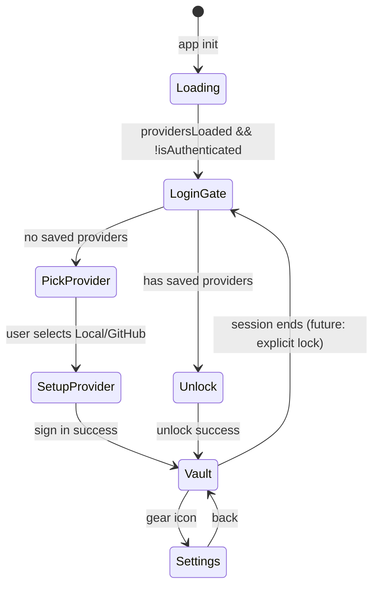
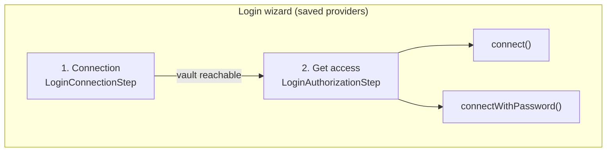

# Auth Providers & Login UX

This document describes how Nook persists storage provider credentials, the login-first UI model, and the roadmap for multi-provider vault replication.

**Related:** [ARCHITECTURE.md](../ARCHITECTURE.md) §4, [password-manager.md](../product-specs/password-manager.md) §2A.

---

## 1. Goals

- **Login-first UX:** Auth/storage is not the main app surface. Users see a login gate when the vault is locked; the secret vault is the primary experience after unlock.
- **Remember credentials:** GitHub PAT and provider choice persist in IndexedDB after first successful sign-in — no repeated token prompts.
- **Multi-provider ready:** Data model supports multiple saved providers per browser; future work adds vault file replication across them with consistency.
- **Separation of concerns:** Provider credentials (PAT) are UI/session config. Vault encryption keys remain in the vault file and device identity in `nook_db`.
- **Two-step unlock UX:** Storage provider (where the vault file lives) and unlock method (how to decrypt it) are independent choices on the login screen — see §3.1.

---

## 2. IndexedDB layout (`nook_auth`)

| Key | Value |
|-----|-------|
| `providers` | `{ providers: StorageProvider[], activeProviderId: string \| null }` |

```typescript
interface StorageProvider {
  id: string
  type: 'local' | 'github'
  label: string
  githubPat?: string   // GitHub only — stored after first sign-in
  githubRepo?: string  // GitHub only — repo name (default `nook`)
  storeId?: string     // Logical secret store (`store_{token}`) — see secret-store-identity.md
  createdAt: string    // ISO timestamp
}
```

**Migration:** On first load, legacy `localStorage` keys (`nook_storage_mode`, `nook_github_pat`) are imported into `nook_auth` and removed from `localStorage`.

**Provider switch:** Changing the active saved provider calls `resetVaultSession` in wasm and clears login password-entry preview state so backup-password lists always reflect the remote vault for that provider — never a prior provider's in-memory session.

---

## 3. UI states



| Component | When shown | Purpose |
|-----------|------------|---------|
| `LoginGate` | Vault locked | Provider picker, two-step unlock (storage + method), one-time GitHub PAT setup |
| `JoinEnrollmentDialog` | Join needed | Send join request or transfer-key enrollment |
| `SecretVault` | Authenticated | Primary app — secrets CRUD |
| `AuthStorage` | Settings panel | Providers, reconnect, devices & access |

### Copy & affordances

- Title (no providers): **Choose where to store secrets**
- Title (saved providers): **Unlock your vault**
- Title (setup): **Connect to {provider}**
- No providers: explain zero-knowledge — nook encrypts locally; user connects and signs in to their storage provider so the encrypted vault lives on their account.
- Has providers: *Two steps — pick storage provider, then unlock method (device keys by default).*
- GitHub setup: *Sign in to GitHub so nook can read/write the encrypted vault file — plaintext secrets never leave this browser.*
- Provider picker uses compact list rows (not large cards) so many providers scale without wasting vertical space.
- Primary action on setup: **Connect** (not “Sign in to nook”).
- **Help** page (`HelpPage`) in header — architecture, multi-device security, join flow, vault file layout. Login gate shows `ProductIntro` callout with link.
- **Settings**: saved provider list, **Add provider**, switch active provider + **Reconnect vault**, **Devices** management, plus vault password management.
- **Devices**: enrolled browser list, encrypted friendly names, pending join approval/denial, technical IDs behind disclosure, and revocation. Revoking the final enrolled device is blocked; revoking the current browser is allowed only when another enrolled device remains and locks the local session.
- **Onboard**: a standalone bottom-nav page with two dropdowns — auth provider and vault password — plus one primary **Onboard Device** action. It generates a QR/link for one-step bootstrap. The QR bundles the selected provider credentials and selected vault password, so the new browser can fetch the vault and self-enroll without a separate approval hop.

### 3.1 Two-step unlock (storage provider × unlock method)

Returning users with saved providers go through a **vertical accordion wizard** on the login gate. Both steps are always visible; only one panel expands at a time.

| Step | UI component | Question | Default | Persistence |
|------|--------------|----------|---------|-------------|
| 1 **Connection** | `LoginConnectionStep` | Where is the encrypted vault file? | Last-used provider | `nook_auth.providers[]` |
| 2 **Get access** | `LoginAuthorizationStep` | How do you decrypt it? | **This device's keys** | Device identity in `nook_db`; backup passwords in vault YAML |

**Step 1 — Connection:** User picks a saved provider, then clicks **Continue**. Nook reaches the vault file on that storage (local IndexedDB or GitHub) and loads password-entry metadata. The vault is **not** decrypted yet.

**Step 2 — Get access:** After a successful connection, the get-access panel expands automatically (connection collapses to a one-line summary). User picks device keys or a labelled backup password, then clicks **Unlock vault**. Click the connection row to expand it again and change provider.

**Unlock methods (get access step)**

- **This device's keys** — uses the browser's X25519 device identity to unwrap the vault's `auth:` row. Default. Calls WASM `connect(storageMode, githubPat, githubRepo)`.
- **Backup password** — shown only after connection, when the remote vault has labelled `password_entries`. User picks an entry (macOS-style account list), enters its password, then unlocks. Calls WASM `connectWithPassword(..., entryId, password)`.

Step 2 is only available after step 1 succeeds: provider credentials reach the vault file; the unlock method only affects decryption.

**UI test ids:** `login-wizard`, `login-wizard-connection-toggle`, `login-wizard-authorization-toggle`, `login-wizard-connection-step`, `login-wizard-authorization-step`, `login-manage-providers-toggle`, `login-manage-providers-panel`, `login-connect-provider-btn`, `login-unlock-method-fieldset`, `login-unlock-method-keys`, `login-unlock-method-password`, `login-password-entry-list`, `login-password-input`, `unlock-vault-btn`, `add-provider-btn`, `remove-provider-{id}` (management panel only).

**Login gate layout**

| Saved providers? | Primary UI | Secondary |
|------------------|------------|-----------|
| None | `LoginProviderManagement` **setup** — pick local or GitHub (`login-provider-setup`) | — |
| One or more | `LoginProviderManagement` **manage** — own block above unlock card, collapsed by default | `LoginWizard` — connection → get access |

First connect (genesis) uses **setup** → provider credentials form → WASM `connect` saves the provider. Return visits use the wizard; management stays below the accordion.

**Provider management:** Add/remove actions live in `LoginProviderManagement` (`manage` variant), not in the connection picker. Genesis and “add another” use the `setup` variant with `ProviderPicker`.

**E2e verification (Taskfile):** `task web:test:e2e:local` runs the local Playwright suite, including `e2e/login-unlock-flow.spec.ts`. Do not invoke Playwright or `bun run test:e2e*` directly — use Taskfile targets so builds run in the Docker toolchain image.

**Auto-unlock:** When exactly one saved provider exists and device keys work, `VaultState` may unlock on load without showing the wizard. The wizard still models connect-then-authorize for manual login, password recovery, and multi-provider setups.

**Enrollment QR** is surfaced through the authenticated bottom-nav **Onboard** item. It is its own page, not a settings section. Users choose an auth provider, choose an existing vault password, re-type that password, then click **Onboard Device** to generate a QR/link that bundles provider credentials *and* that password for one-shot device bootstrap — not the normal wizard pattern.



---

## 4. VaultState integration

`VaultState` loads providers on `init()`, applies `activeProvider` credentials to `storageMode` / `githubPat` before WASM calls, and calls `ensureProviderSaved()` after successful connect/enroll/join.

WASM still receives `(storageMode, githubPat)` per call — no change to the Rust bridge. Provider persistence is entirely a web-layer concern.

---

## 5. Future: multi-provider replication

Planned capabilities (not yet implemented):

1. **Multiple active backends:** User authenticates to several providers (e.g. GitHub + local + future S3/IPFS).
2. **Single logical vault:** One encrypted database identified by **`store_id`** (11-char id in vault YAML and on each `StorageProvider`) — see [secret-store-identity.md](secret-store-identity.md). Writes propagate to all providers enrolled for that `store_id`.
3. **Consistency:** Content-hash or version vector on the vault file; background sync resolves conflicts (last-write-wins initially, then CRDT or explicit merge UI).
4. **Provider-scoped credentials:** Each `StorageProvider` carries its own auth material; unlock may require all providers reachable or a quorum.
5. **Mismatch protection:** Reject connect when on-disk `store_id` ≠ provider's expected `storeId`.

Design constraints for current implementation:

- `providers[]` is an array, not a singleton — adding providers does not replace existing entries.
- `activeProviderId` selects which backend `connect()` uses today; multi-write will extend this to a provider set.
- Periodic `sync_vault_from_storage` already polls the active backend; multi-provider sync will fan out reads and reconcile.

---

## 6. Security notes

- GitHub PAT in IndexedDB is **storage convenience**, not vault encryption. Compromise of browser storage exposes GitHub repo access, not plaintext secrets (still encrypted in vault file).
- Device identity and encrypted vault blob remain in separate IDB database (`nook_db`).
- E2E tests clear both `nook_db` and `nook_auth` on reset.
