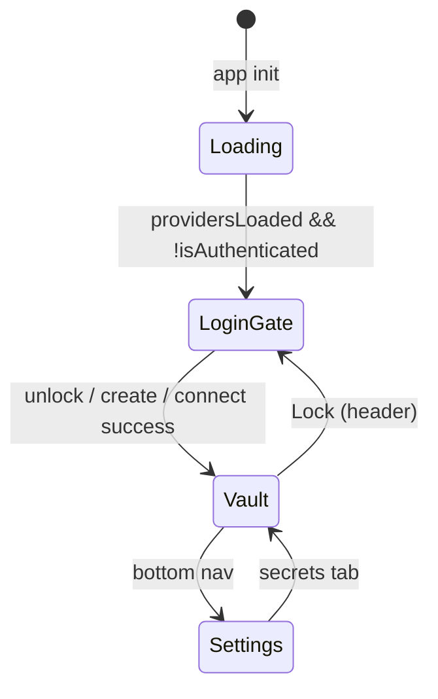

# Auth Providers, Sync, and Login UX

How Nook persists **sync provider** credentials, the **login gate**, and how that relates to **vaults** (not the same thing).

> **Canonical model:** [unified-vault.md](unified-vault.md), [vault-session-and-lock.md](vault-session-and-lock.md). Sync providers are **replica targets** for the active vault (`store_id`), not separate vaults.

**Related:** [ARCHITECTURE.md](../ARCHITECTURE.md) §4, [password-manager.md](../product-specs/password-manager.md) §2A.

---

## 1. Goals

- **Login when locked:** Primary app is the secret vault after unlock; **Lock** clears the session and returns to the login gate.
- **Remember sync credentials:** GitHub PAT and provider labels persist in IndexedDB — no repeated token prompts.
- **Many providers, one vault:** Multiple sync providers replicate the **same** `store_id`; see [vault-session-and-lock.md](vault-session-and-lock.md) §4.
- **Separation of concerns:** Provider tokens are storage convenience. Vault keys live in the encrypted YAML; device identity lives in `nook_db`.

---

## 2. IndexedDB layout (`nook_auth`)

| Key | Value |
|-----|-------|
| `providers` | `{ providers: StorageProvider[], activeProviderId: string \| null }` |

```typescript
interface StorageProvider {
  id: string
  type: 'local' | 'github'
  label: string
  githubPat?: string   // GitHub only — stored after first sign-in
  githubRepo?: string  // GitHub only — repo name (default `nook`)
  storeId?: string     // Logical secret store (`store_{token}`) — see secret-store-identity.md
  createdAt: string    // ISO timestamp
}
```

**Credentials are sealed at rest with the device key.** Secret fields — `githubPat`, `oauthFile.accessToken`, `oauthFile.refreshToken` — are sealed before write (`saveAuthProviders`) and unsealed on read (`loadAuthProviders`). Non-secret fields (labels, repo, timestamps) stay plaintext. Sealing/unsealing runs entirely in Rust/WASM (crypto never lives in TypeScript — see [rules.md §1](../rules.md)): `encryptSnapshot`/`decryptSnapshot` in [`auth-providers.ts`](../../nook-web/src/lib/auth-providers.ts) call the `encryptWithDeviceKey` / `decryptWithDeviceKey` wasm bindings.

**Device key = existing device identity.** No new key is minted for provider storage. The wasm functions reuse this browser's **age X25519 device identity** (`device_id` / `device_identity_secret` in the `nook_db` `vault` store — the same identity that unwraps `auth:` envelopes). Sealing encrypts the credential to the device's own public key (age self-recipient, `DeviceIdentity::seal_utf8`); unsealing decrypts with the device secret (`DeviceIdentity::open_utf8`). Sealed values are age-armored ciphertext (they contain `BEGIN AGE ENCRYPTED FILE`, which the load path uses to distinguish sealed vs legacy-plaintext fields). `ensureDeviceKey` creates and persists the identity on first use so encrypt/decrypt always resolve the same key.

**Migration:** On first load, legacy `localStorage` keys (`nook_storage_mode`, `nook_github_pat`) are imported into `nook_auth` and removed from `localStorage`. Existing **plaintext** provider rows (pre-encryption, or those seeded directly in e2e) are read transparently and re-saved in sealed form on the next load (`hadPlaintext` upgrade path).

**Provider switch:** Changing the active saved provider calls `resetVaultSession` in wasm and clears login password-entry preview state so backup-password lists always reflect the remote vault for that provider — never a prior provider's in-memory session.

---

## 3. UI states



| Component | When shown | Purpose |
|-----------|------------|---------|
| `LoginGate` | Vault locked | Get started chooser, unlock local cache, connect sync provider, enrollment |
| `SecretVault` | Authenticated | Primary app — secrets CRUD |
| `AuthStorage` | Settings → Sync providers | Manage replica targets for **current** vault |
| Header **Lock vault** | Authenticated | `VaultState.lockVault()` — clear session |

### Lock

See [vault-session-and-lock.md](vault-session-and-lock.md). **Lock** is **not** “delete vault” — it clears WASM `decrypted_jsonl` and Svelte state. User unlocks again via device keys, backup password, or by connecting a provider.

**Test ids:** `header-lock-vault-btn`, `login-create-device-vault-btn`, `login-connect-storage-btn`, `unlock-vault-btn`, `add-provider-btn`, `remove-provider-{id}`.

### Login gate (current)

| Local vault? | Primary UI |
|--------------|------------|
| No | **Get started** — create local vault (device keys) or connect cloud storage |
| Yes | Unlock with device keys and/or backup password |

Legacy login wizard docs (connection × authorization accordion) are superseded by the unified login gate; see git history before Phase 8 if needed.

---

## 4. VaultState integration

`VaultState` loads providers on `init()`, applies `activeProvider` credentials to `storageMode` / `githubPat` before WASM calls, and calls `ensureProviderSaved()` after successful connect/enroll/join.

WASM still receives `(storageMode, githubPat)` per call — no change to the Rust bridge. Provider persistence is entirely a web-layer concern.

---

## 5. Sync replication (implemented)

Version-based sync is in `nook-core/src/vault_sync.rs`. UI uses local-first `encrypted_db` + fan-out to all sync providers in `nook_auth`.

| Capability | Status |
|------------|--------|
| Multiple sync providers per vault | Done — fan-out after local save |
| Single `store_id` across replicas | Enforced — mismatch errors |
| `vault_version` reconciliation | Done |
| Multi-vault picker on one browser | Planned — see [vault-session-and-lock.md](vault-session-and-lock.md) §3 |

**Do not confuse:** adding a sync provider **replicates** the active vault; opening a **different** vault requires Lock and connect/import flow (future vault picker).

---

## 6. Security notes

- Provider credentials (GitHub PAT, OAuth access/refresh tokens) are **sealed with the device's age X25519 identity** (in Rust/WASM) before hitting IndexedDB — never stored as plaintext. A raw `nook_auth` dump exposes age-armored ciphertext, not tokens.
- Sealing protects against passive at-rest inspection of IndexedDB, not against code executing in the page (XSS), which can still ask WASM to unseal. The device secret itself lives in `nook_db` (`device_identity_secret`); an attacker with both databases can decrypt — this is storage-at-rest hardening, not a substitute for vault encryption.
- GitHub PAT in IndexedDB is **storage convenience**, not vault encryption. Compromise exposes GitHub repo access, not plaintext vault secrets (still independently encrypted in the vault file).
- Reusing the existing device identity means no extra key material and no new key-management surface; the same identity already gates vault-key envelopes.
- Device identity and encrypted vault blob remain in a separate IDB database (`nook_db`); provider rows live in `nook_auth`. E2E tests clear both on reset.
