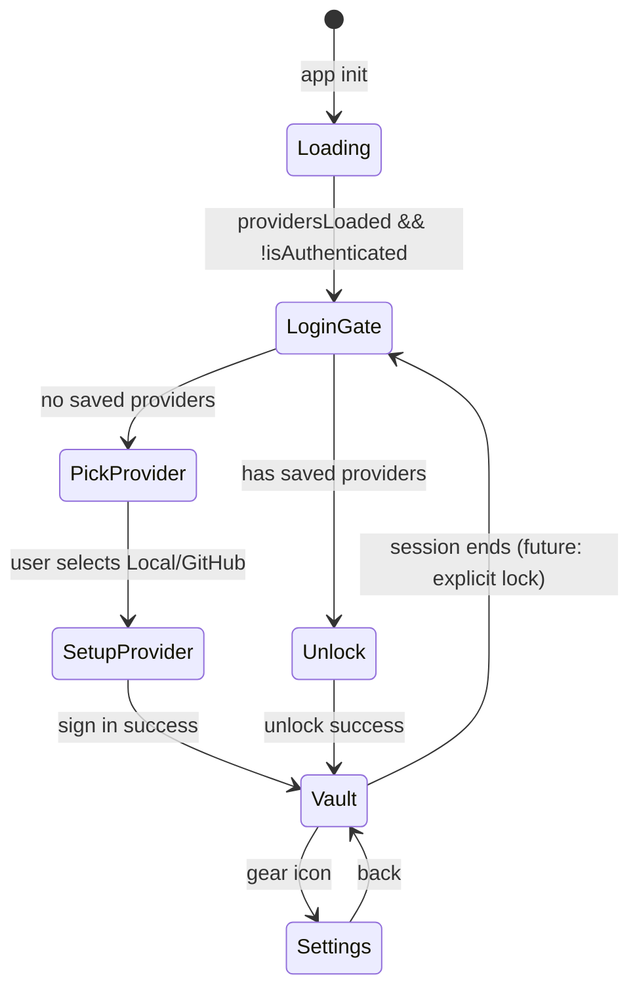

# Auth Providers & Login UX

This document describes how Nook persists storage provider credentials, the login-first UI model, and the roadmap for multi-provider vault replication.

**Related:** [ARCHITECTURE.md](../ARCHITECTURE.md) §4, [password-manager.md](../product-specs/password-manager.md) §2A.

---

## 1. Goals

- **Login-first UX:** Auth/storage is not the main app surface. Users see a login gate when the vault is locked; the secret vault is the primary experience after unlock.
- **Remember credentials:** GitHub PAT and provider choice persist in IndexedDB after first successful sign-in — no repeated token prompts.
- **Multi-provider ready:** Data model supports multiple saved providers per browser; future work adds vault file replication across them with consistency.
- **Separation of concerns:** Provider credentials (PAT) are UI/session config. Vault encryption keys remain in the vault file and device identity in `nook_db`.

---

## 2. IndexedDB layout (`nook_auth`)

| Key | Value |
|-----|-------|
| `providers` | `{ providers: StorageProvider[], activeProviderId: string \| null }` |

```typescript
interface StorageProvider {
  id: string
  type: 'local' | 'github'
  label: string
  githubPat?: string   // GitHub only — stored after first sign-in
  createdAt: string    // ISO timestamp
}
```

**Migration:** On first load, legacy `localStorage` keys (`nook_storage_mode`, `nook_github_pat`) are imported into `nook_auth` and removed from `localStorage`.

---

## 3. UI states



| Component | When shown | Purpose |
|-----------|------------|---------|
| `LoginGate` | Vault locked | Provider picker and one-time GitHub PAT setup only |
| `JoinEnrollmentDialog` | Join needed | Send join request or transfer-key enrollment |
| `SecretVault` | Authenticated | Primary app — secrets CRUD |
| `AuthStorage` | Settings panel | Providers, reconnect, devices & access |

### Copy & affordances

- Title (no providers): **Choose where to store secrets**
- Title (saved providers): **Unlock your vault**
- Title (setup): **Connect to {provider}**
- No providers: explain zero-knowledge — nook encrypts locally; user connects and signs in to their storage provider so the encrypted vault lives on their account.
- Has providers: *Your provider is saved in this browser — unlock to decrypt and open your vault.*
- GitHub setup: *Sign in to GitHub so nook can read/write the encrypted vault file — plaintext secrets never leave this browser.*
- Provider picker uses compact list rows (not large cards) so many providers scale without wasting vertical space.
- Primary action on setup: **Connect** (not “Sign in to nook”).
- **Help** page (`HelpPage`) in header — architecture, multi-device security, join flow, vault file layout. Login gate shows `ProductIntro` callout with link.
- **Storage & devices** (settings): saved provider list, **Add provider**, switch active provider + **Reconnect vault**.
- Device enrollment, join approvals, and transfer keys: **Storage & devices** and the **Join this vault** dialog — not on the login screen.

---

## 4. VaultState integration

`VaultState` loads providers on `init()`, applies `activeProvider` credentials to `storageMode` / `githubPat` before WASM calls, and calls `ensureProviderSaved()` after successful connect/enroll/join.

WASM still receives `(storageMode, githubPat)` per call — no change to the Rust bridge. Provider persistence is entirely a web-layer concern.

---

## 5. Future: multi-provider replication

Planned capabilities (not yet implemented):

1. **Multiple active backends:** User authenticates to several providers (e.g. GitHub + local + future S3/IPFS).
2. **Single logical vault:** One `nook-vault.yaml` content model; writes propagate to all enrolled providers.
3. **Consistency:** Content-hash or version vector on the vault file; background sync resolves conflicts (last-write-wins initially, then CRDT or explicit merge UI).
4. **Provider-scoped credentials:** Each `StorageProvider` carries its own auth material; unlock may require all providers reachable or a quorum.

Design constraints for current implementation:

- `providers[]` is an array, not a singleton — adding providers does not replace existing entries.
- `activeProviderId` selects which backend `connect()` uses today; multi-write will extend this to a provider set.
- Periodic `sync_vault_from_storage` already polls the active backend; multi-provider sync will fan out reads and reconcile.

---

## 6. Security notes

- GitHub PAT in IndexedDB is **storage convenience**, not vault encryption. Compromise of browser storage exposes GitHub repo access, not plaintext secrets (still encrypted in vault file).
- Device identity and encrypted vault blob remain in separate IDB database (`nook_db`).
- E2E tests clear both `nook_db` and `nook_auth` on reset.
