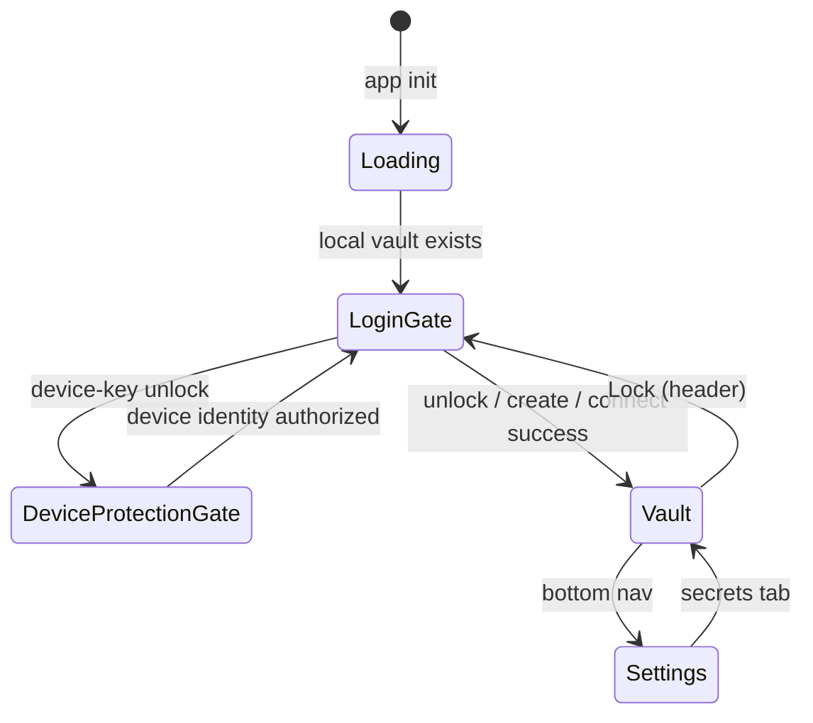

# Auth Providers, Sync, and Login UX

How Nook persists **sync provider** credentials, the **login gate**, and how that relates to **vaults** (not the same thing).

> **Canonical model:** [unified-vault.md](unified-vault.md), [vault-session-and-lock.md](vault-session-and-lock.md). Sync providers are **replica targets** for the active vault (`store_id`), not separate vaults.

**Related:** [ARCHITECTURE.md](../ARCHITECTURE.md) §4, [password-manager.md](../product-specs/password-manager.md) §2A.

---

## 1. Goals

- **Login when locked:** Primary app is the secret vault after unlock; **Lock** clears the session and returns to the login gate.
- **Remember sync credentials:** GitHub PAT and provider labels persist in IndexedDB — no repeated token prompts.
- **Many providers, one vault:** Multiple sync providers replicate the **same** `store_id`; see [vault-session-and-lock.md](vault-session-and-lock.md) §4.
- **Separation of concerns:** Provider tokens are storage convenience. Vault keys live in the encrypted YAML; device identity lives in `nook_db`.

---

## 2. IndexedDB layout (`nook_auth`)

| Key | Value |
|-----|-------|
| `providers` | `{ providers: StorageProvider[], activeVaultStoreId?: string }` |

The persisted object is a structured-clone JS object (not a JSON string). Its wire shape is owned by `nook-core` (`AuthProvidersSnapshotData` / `StorageProviderData`, `camelCase`); the TS `StorageProvider` interface mirrors it:

```typescript
interface StorageProvider {
  id: string
  type: 'local' | 'github' | 'oauth-file' | 'local-folder'
  label: string
  githubPat?: string   // GitHub only — sealed at rest
  githubRepo?: string  // GitHub only — repo name (default `nook`)
  oauthFile?: OAuthFileConfig  // Drive/iCloud — accessToken/refreshToken sealed at rest
  localFolder?: LocalFolderConfig  // Browser File System Access directory handle metadata
  storeId?: string     // Logical secret store (`store_{token}`) — see secret-store-identity.md
  lastSyncedVersion?: number
  lastSyncedAt?: string
  lastSyncRevision?: string
  createdAt: string    // ISO timestamp
}
```


**Persistence + crypto live in Rust/WASM.** `nook_auth` I/O, credential sealing, snapshot shaping, and the legacy `localStorage` migration all run in `nook-wasm`/`nook-core`; [`auth-providers.ts`](../../nook-app/nook-web/src/lib/auth-providers.ts) is a thin shim that owns only the TS **type declarations**, i18n presentation helpers (`localizeProviderLabel`, `maskGithubPat`, `providerStorageDetail` — coupled to the web `t()` catalog), and wasm-wrapper functions. Ownership split:

| Concern | Home |
|---------|------|
| Snapshot model + pure transforms (`normalize`, `migrate_provider_fields`, `ensure_local_provider_row`, `find_duplicate_sync_provider`, legacy-seed) | `nook-app/nook-core/src/sync_provider_store.rs` (Rust-tested) |
| `nook_auth` IndexedDB I/O (rexie), device-key seal/unseal, `localStorage` read/clear, full load pipeline | `nook-app/nook-wasm/src/storage/auth_providers.rs` |
| wasm bindings (`loadAuthProviders`, `saveAuthProviders`, `deleteAuthProvidersDb`, `normalizeAuthSnapshot`, `findDuplicateSyncProvider`, `ensureLocalProviderRow`) | `nook-app/nook-wasm/src/lib.rs` |
| Type declarations, i18n presentation, wasm wrappers | `nook-app/nook-web/src/lib/auth-providers.ts` |

**Credentials are sealed at rest with the device key.** Secret fields — `githubPat`, `oauthFile.accessToken`, `oauthFile.refreshToken` — are sealed inside `save_auth_providers` and unsealed inside the `load_auth_providers` pipeline. Non-secret fields (labels, repo, timestamps) stay plaintext. Crypto never lives in TypeScript (see [rules.md §1](../rules.md)).

**Device key = existing device identity.** No new key is minted for provider storage. The wasm layer reuses this browser's **age X25519 device identity** (`device_id` / `device_identity_wrapped` in the `nook_db` `vault` store — the same identity that unwraps `auth:` envelopes). The identity must first be authorized with the saved passkey's WebAuthn PRF result, or with the local PIN fallback on PRF-missing platforms. Sealing encrypts the credential to the device's own public key (age self-recipient, `DeviceIdentity::seal_utf8`); unsealing decrypts with the in-memory device secret (`DeviceIdentity::open_utf8`). Sealed values are age-armored ciphertext (they contain `BEGIN AGE ENCRYPTED FILE`, which distinguishes sealed from plaintext credential fields).

**Migration:** On first load, legacy `localStorage` keys (`nook_storage_mode`, `nook_github_pat`) are imported into `nook_auth` and removed from `localStorage`. Existing **plaintext** provider rows (pre-encryption, or those seeded directly in e2e) are read transparently and re-saved in sealed form on the next load (`had_plaintext` upgrade path).

**Provider switch:** Changing the active saved provider calls `resetVaultSession` in wasm and clears login password-entry preview state so backup-password lists always reflect the remote vault for that provider — never a prior provider's in-memory session.

**Local-folder provider availability:** Local backup uses the browser File
System Access directory API (`showDirectoryPicker`) and persisted structured
clone directory handles. The provider picker must gate this option with
`isLocalFolderBackupSupported()` and show it as unavailable when the browser
cannot grant writable folder access; do not let unsupported browsers enter setup
and surface the lower-level WASM/database error.

---

## 3. UI states



| Component | When shown | Purpose |
|-----------|------------|---------|
| `DeviceProtectionGate` | Device-key unlock selected while identity is locked, or identity needs migration | Create/authorize passkey, or PIN fallback when PRF is unavailable, before loading device-sealed data |
| `LoginGate` | Vault locked | Get started chooser, unlock local cache, connect sync provider, enrollment |
| `SecretVault` | Authenticated | Primary app — secrets CRUD |
| `AuthStorage` | Settings → Sync providers | Manage replica targets for **current** vault |
| Header **Lock vault** | Authenticated | `VaultState.lockVault()` — clear session |

### Lock

See [vault-session-and-lock.md](vault-session-and-lock.md). **Lock** is **not** “delete vault” — it clears the WASM typed session database, the in-memory device identity, and sensitive Svelte state. The normal vault login gate remains visible; choosing device keys opens the passkey/PIN gate, while a backup password can unlock the local vault without opening it.

**Test ids:** `header-lock-vault-btn`, `login-create-device-vault-btn`, `login-connect-storage-btn`, `unlock-vault-btn`, `add-provider-btn`, `remove-provider-{id}`.

### Login gate (current)

| Local vault? | Primary UI |
|--------------|------------|
| No | **Get started** — create local vault (device keys) or connect cloud storage |
| Yes | Unlock with device keys and/or backup password |

Legacy login wizard docs (connection × authorization accordion) are superseded by the unified login gate; see git history before Phase 8 if needed.

---

## 4. VaultState integration

`VaultState` discovers local vaults on `init()` without unsealing the device
identity. Only after device-key authorization puts the identity in WASM memory
does it load providers, apply `activeProvider` credentials to `storageMode` /
`githubPat`, and call `ensureProviderSaved()` after successful
connect/enroll/join. Backup-password unlock may hydrate the local vault session
without those provider steps; sealed-provider sync remains paused.

WASM still receives `(storageMode, githubPat)` per call. Provider persistence
and shaping live in `nook-wasm`/`nook-core`; the web layer maps snapshots onto
`VaultState`.

---

## 5. Sync replication (implemented)

Event-log sync is in `nook-app/nook-core/src`. UI uses the local
`vault:{store_id}` projection cache and fans events out to sync providers in
`nook_auth`.

| Capability | Status |
|------------|--------|
| Multiple sync providers per vault | Done — fan-out after local save |
| Single `store_id` across replicas | Enforced — mismatch errors |
| `vault_version` reconciliation | Done |
| Multi-vault picker on one browser | Planned — see [vault-session-and-lock.md](vault-session-and-lock.md) §3 |

**Do not confuse:** adding a sync provider **replicates** the active vault; opening a **different** vault requires Lock and connect/import flow (future vault picker).

---

## 6. Security notes

- Provider credentials (GitHub PAT, OAuth access/refresh tokens) are **sealed with the device's age X25519 identity** (in Rust/WASM) before hitting IndexedDB — never stored as plaintext. A raw `nook_auth` dump exposes age-armored ciphertext, not tokens.
- The device secret is itself wrapped at rest in `nook_db.device_identity_wrapped` with AES-256-GCM. The preferred wrapping key is derived in Rust/WASM from a WebAuthn PRF result with HKDF-SHA256. On PRF-missing platforms, a versioned PIN fallback uses PBKDF2-SHA256 parameters authenticated in the wrapped record. Neither PRF output, PIN, nor derived key is persisted.
- This protects passive copies of both IndexedDB databases. Code already executing in the page after authorization can use the in-memory identity; code before authorization can request a user-verifying passkey ceremony. Passkey protection is therefore not a substitute for XSS prevention.
- GitHub PAT in IndexedDB is **storage convenience**, not vault encryption. Compromise exposes GitHub repo access, not plaintext vault secrets (still independently encrypted in the vault file).
- Reusing the existing device identity means no extra key material and no new key-management surface; the same identity already gates vault-key envelopes.
- Device identity and encrypted vault blob remain in a separate IDB database (`nook_db`); provider rows live in `nook_auth`. E2E tests clear both on reset.

## 7. OAuth origins and PR previews

Browser OAuth providers are origin-bound. Nook's Google Drive flow uses Google
Identity Services in the browser; the current Google web client is configured
for `http://localhost:5173`, `https://nokey.sh`, and
`https://dev.nokey.sh`. Nook's CloudKit JS token is configured for
`https://nokey.sh` and `https://dev.nokey.sh`.

Google/Auth Platform branding should use `https://nokey.sh/` as the public app
home page. The root path is the crawlable product and branding page; the vault
application lives at `/app/`. Do not user-agent fork the root path for
Googlebot; a bot-only version is cloaking-prone and makes OAuth review behavior
differ from real user behavior. `/about.html` remains a compatibility alias
whose canonical URL is the root page, so it should not be listed separately in
the sitemap. Legal branding links should use the static
`https://nokey.sh/privacy.html` and `https://nokey.sh/terms.html` documents so
GitHub Pages can serve them directly without relying on the SPA router.
`robots.txt` should allow the public root/legal pages and assets while
disallowing `/app/` and private utility routes.

PR previews deploy to Cloudflare Pages aliases such as
`https://pr-191.nook-1n8.pages.dev/`. The browser origin is the exact
scheme/host/port tuple, for example `https://pr-191.nook-1n8.pages.dev`.
Google's Authorized JavaScript origins must be exact origins: they cannot
include paths, query strings, fragments, or wildcard characters. A single PR
origin can be added manually for a one-off test, but the PR pattern cannot be
represented as `https://pr-*.nook-1n8.pages.dev`, and origin-sprawl should not be
treated as a durable preview strategy. Apple CloudKit API tokens have the same
practical constraint when allowed origins are restricted to specific domains.

Current fallback: [`oauth-origin.ts`](../../nook-app/nook-web/src/lib/oauth-origin.ts)
detects Nook PR preview hosts (`pr-<number>.nook-1n8.pages.dev`) and disables
Google Drive / iCloud sign-in with a clear message. Reviewers can still test
local, local-folder, and GitHub providers on PR previews. Google Drive browser
OAuth should be tested on `https://nokey.sh`, `https://dev.nokey.sh`, or local
dev until preview hosting uses a registered stable origin. If a stable
Cloudflare origin such as
`https://nook-1n8.pages.dev` or `https://preview.nokey.sh` becomes the preview
entry point, add that exact origin both in Google Cloud Console and in
`oauth-origin.ts`; adding `https://nook-1n8.pages.dev` does not authorize
subdomains like `https://pr-191.nook-1n8.pages.dev`.

For CloudKit JS diagnostics, a `421` response from `/public/users/caller`
usually means CloudKit issued the unauthenticated web-auth challenge; it is not
by itself proof that the API token or origin is wrong. The failure signal is
whether the real Apple-controlled sign-in click produces a `ckWebAuthToken`
through CloudKit's token store, cookie, or session storage. Nook logs the native
click path, control shape, sanitized redirect metadata, and token-storage
presence under the `icloud-oauth` scope; debug from those entries before
rewriting the provider flow.

When reproducing production auth from the shell, include the browser origin:

```sh
curl -H 'Origin: https://nokey.sh' \
  'https://api.apple-cloudkit.com/database/1/iCloud.metasecret.project.com/production/public/users/current?ckAPIToken=...'
```

Without the `Origin` header, Apple may report `AUTHENTICATION_FAILED` even when
the same token is valid for the registered web origin. With the registered
origin, unauthenticated production requests should return
`AUTHENTICATION_REQUIRED` plus a `redirectURL`. If CloudKit JS wraps that
challenge as `UNKNOWN_ERROR` after the real Apple click, Nook falls back to the
Web Services challenge, opens the returned Apple sign-in URL, and listens for
the `ckWebAuthToken` postMessage. Brave can open CloudKit JS's Apple window and
the direct fallback window at the same time, so Brave uses the direct Web
Services challenge as its primary sign-in path instead of forwarding the native
CloudKit button click.

Preferred future options:

| Option | Summary | Trade-off |
|--------|---------|-----------|
| Stable preview origin | Serve previews from one registered origin such as `https://nook-1n8.pages.dev/pr-191/` or `https://preview.nokey.sh/pr-191/` via Worker/path routing. | Best reviewer UX; requires Cloudflare routing/base-path work and careful static asset paths. |
| Preview OAuth client | Create a separate Google OAuth client for a small set of fixed staging origins. | Good for staging; still does not solve per-PR subdomains. |
| Backend/redirect broker | Move to an authorization-code flow with PKCE and a fixed redirect/broker origin. | More secure and flexible, but adds server or Worker state and a larger auth surface. |
| Manual one-off origin | Add the exact PR origin in Google Cloud Console for a specific review. | Useful for urgent manual testing; not automatable or scalable as the normal PR flow. |
