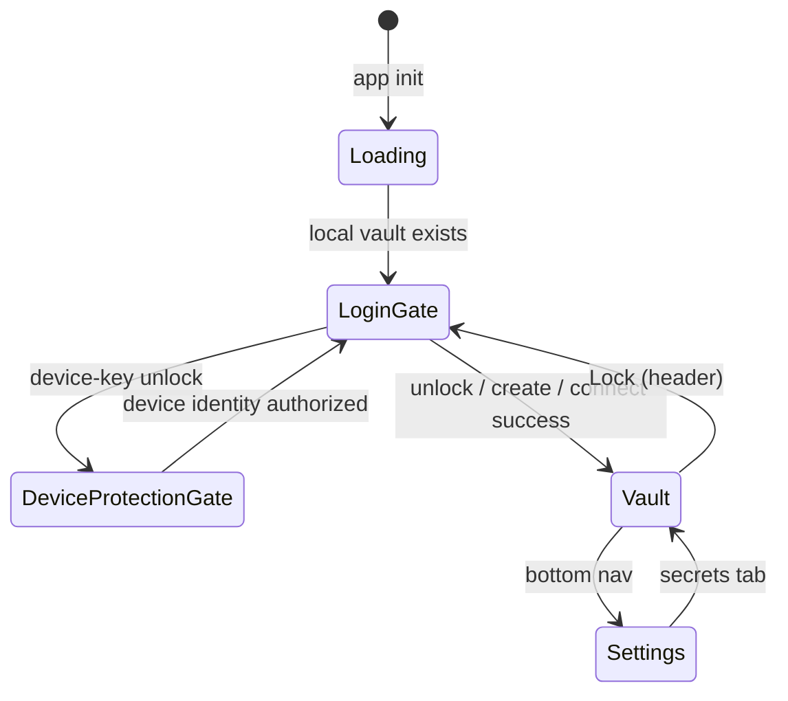

# Auth Providers, Sync, and Login UX

How Nook persists **sync provider** credentials, the **login gate**, and how that
relates to **vaults** (not the same thing).

> **Canonical model:** [unified-vault.md](unified-vault.md),
> [vault-session-and-lock.md](vault-session-and-lock.md). Sync providers are
> **replica targets** for the active vault (`store_id`), not separate vaults.
> Provider **event-log sync** mechanics live in
> [vault-event-log.md](vault-event-log.md); this doc owns credentials, sealing,
> login UX, and OAuth origin constraints.

**Related:** [ARCHITECTURE.md](../ARCHITECTURE.md) §4,
[password-manager.md](../product-specs/password-manager.md) §2A,
[secret-store-identity.md](secret-store-identity.md).

---

## 1. Goals

- **Login when locked:** Primary app is the secret vault after unlock; **Lock**
  clears the session and returns to the login gate.
- **Remember sync credentials:** GitHub PAT and provider labels persist in
  IndexedDB — no repeated token prompts.
- **Many providers, one vault:** Multiple sync providers replicate the **same**
  `store_id`; see [vault-session-and-lock.md](vault-session-and-lock.md) §4.
- **Separation of concerns:** Provider tokens are storage convenience. Vault keys
  live in the encrypted YAML; device identity lives in `nook_db`.

---

## 2. IndexedDB layout (`nook_auth`)

| Piece | Value |
|-------|-------|
| Database | `nook_auth` |
| Object store | `auth` |
| Key | `providers` |
| Value | `{ providers: StorageProvider[], activeVaultStoreId?: string }` |

The persisted object is a structured-clone JS object (not a JSON string). Its
wire shape is owned by Rust (`AuthProvidersSnapshot` / `StorageProvider` /
`OAuthFileConfig` / `LocalFolderConfig` in
[`sync_provider_store.rs`](../../nook-app/nook-core/src/sync/sync_provider_store.rs)),
exported to TypeScript via Tsify/`$app-wasm` as camelCase. The web layer
**re-exports** those types; it does **not** hand-author mirror interfaces.

### Wire fields (`StorageProvider`, camelCase)

| Field | Notes |
|-------|-------|
| `id`, `type`, `label`, `createdAt` | `type`: `local` \| `github` \| `oauth-file` \| `local-folder` |
| `githubPat?`, `githubRepo?` | GitHub only — PAT sealed at rest |
| `oauthFile?` | Drive/iCloud block — see below |
| `localFolder?` | File System Access directory handle metadata (`directoryName?`, `handleId?`) |
| `storeId?` | Logical secret store (`store_{token}`) — see [secret-store-identity.md](secret-store-identity.md) |
| `lastSyncedVersion?`, `lastSyncedAt?`, `lastSyncRevision?`, `lastCommonContentHash?` | Sync bookkeeping |

### Wire fields (`oauthFile`)

| Field | Notes |
|-------|-------|
| `preset` | `google-drive` \| `icloud` |
| `accessToken`, `refreshToken?` | Sealed at rest |
| `expiresAt?`, `fileId?`, `fileName?`, `accountEmail?` | Non-secret metadata |
| `driveMode?`, `folderId?` | Google Drive private/shared; absent legacy rows migrate |
| `iCloudMode?`, `iCloudShareTarget?` | iCloud private/shared; share target is credential-free routing |

### Ownership

**Persistence + credential crypto live in Rust/WASM** (still current — not a
legacy note). Snapshot shaping and sealing are unit-tested in core; IndexedDB I/O
and the load pipeline live in wasm; the web shim is adapters + i18n only.

| Concern | Home |
|---------|------|
| Snapshot model + pure transforms (`normalize`, `migrate_provider_fields`, `ensure_local_provider_row`, `find_duplicate_sync_provider`, legacy-seed) | `nook-app/nook-core/src/sync/sync_provider_store.rs` |
| Seal/open credential fields with device identity | `nook-app/nook-core/src/sync/sync_provider_credentials.rs` |
| `nook_auth` IndexedDB I/O (rexie), load pipeline, legacy `localStorage` read/clear | `nook-app/nook-wasm/src/storage/auth_providers.rs` |
| Manager APIs (`loadAuthProviders`, `loadAuthProvidersWithLocalRow`, `saveAuthProviders`) | `NookVaultManager` methods in `nook-app/nook-wasm/src/lib.rs` |
| Free helpers (`deleteAuthProvidersDb`, `findDuplicateSyncProvider`, `ensureLocalProviderRow`, `sealAuthProvidersForDevicePublicKey`, mode binders) | wasm bindings + thin TS wrappers |
| Enrollment typestates (`TypedEnrollmentProvider`, personal vs shared) | `nook-app/nook-auth2/src/auth/enrollment.rs` (re-exported via `nook-core`) |
| Type re-exports, i18n presentation, wasm wrappers | [`auth-providers.ts`](../../nook-app/nook-web/nook-web-shared/src/vault-app/lib/auth-providers.ts) |
| Vault wiring (`ensureProviderSaved`, active-provider mapping) | `vault.svelte.ts` + `vault/providers.ts` under `nook-web-shared` |

**Credentials are sealed at rest with the device key.** Secret fields —
`githubPat`, `oauthFile.accessToken`, `oauthFile.refreshToken` — are sealed
inside `save_auth_providers` / `seal_provider_credentials` and unsealed inside
the `load_auth_providers` pipeline. Non-secret fields (labels, repo, timestamps)
stay plaintext. Crypto never lives in TypeScript (see [rules.md §1](../rules.md)).

**Device key = existing device identity.** No new key is minted for provider
storage. The wasm layer reuses this browser's **age X25519 device identity**
(`device_id` / `device_identity_wrapped` in the `nook_db` `vault` store — the same
identity that unwraps `auth:` envelopes). The identity must first be authorized
with the saved passkey's WebAuthn PRF result, or with the local PIN fallback on
PRF-missing platforms. Sealing encrypts the credential to the device's own public
key (age self-recipient, `DeviceIdentity::seal_utf8`); unsealing decrypts with
the in-memory device secret (`DeviceIdentity::open_utf8`). Sealed values are
age-armored ciphertext (they contain `BEGIN AGE ENCRYPTED FILE`, which
distinguishes sealed from plaintext credential fields).

**Extension pairing:** `sealAuthProvidersForDevicePublicKey` can seal a snapshot
for another device's public key without writing IndexedDB (used when staging
credentials for the browser extension).

**Migration:** On first load, legacy `localStorage` keys (`nook_storage_mode`,
`nook_github_pat`) are imported into `nook_auth` and removed from `localStorage`.
Existing **plaintext** provider rows are rejected rather than loaded into the
application. This fail-closed boundary prevents an unsealed credential from
remaining usable or being mistaken for trusted encrypted state; users must
re-enter the provider credential so the normal save path persists it sealed.

**Provider switch:** Changing the active saved provider calls `resetVaultSession`
in wasm and clears login password-entry preview state so backup-password lists
always reflect the remote vault for that provider — never a prior provider's
in-memory session.

### Google Drive modes

Provider setup offers `private` and `shared` independently of vault replication
or membership. Private mode requests `drive.appdata` and stores events below the
hidden `appDataFolder`. Shared mode requests `drive.file` for app-created writes
plus `drive.readonly` because Drive authorizes `drive.file` per user and
collaborators must read folders and event files created by another account. It
creates or verifies a visible My Drive folder and stores its stable `folderId`;
writes remain limited to app-created files below that selected folder. Each
collaborator saves a separate OAuth token for their own Google account. Switching
modes clears the scope-bound token and target in Rust before the user signs in
again; it never reuses an app-data token for a shared folder or vice versa.

**Shared-folder grant outcomes:** After Rust validates a shared Google Drive
grant request, WASM attempts `files.create` (folder) and `permissions.create`
(writer for the joiner email) with the owner's token. Outcomes are
`SharedStorageGrantOutcome::{Granted, ManualGrantRequired, Unsupported}`.
Success returns `Granted` with the stable `storageTargetId` (`folderId`). When
the owner token is missing, the token lacks `drive.file`, or Drive rejects the
create/share call, WASM returns `ManualGrantRequired` with
`architecture_modes.shared_grant_manual_instructions`. The UI then shows those
manual share steps; if folder create succeeded but share failed, the outcome may
still carry `storageTargetId` so enrollment can bind the existing folder without
creating a replacement. Personal / private providers keep using `drive.appdata`
and never enter this grant path.

### Shared-provider onboarding

The selected provider target determines the handoff. A shared Google Drive row
persists its stable `folderId`; enrollment codes carry that folder id and never
the owner's OAuth access or refresh token, even when the vault's legacy/default
`replication_type` is `personal`. The joining browser signs into its own Google
account and saves its own token. The owner may grant that account access to the
already-persisted folder, but onboarding must not create a replacement folder or
transfer owner credentials.

The decrypted enrollment payload exposes the Rust-owned `OnboardingType`; the
joiner dispatches on `PersonalCredentialTransfer` versus `SharedProviderGrant`.
Rust models those as sealed typestates in `nook-auth2`:
`TypedEnrollmentProvider<PersonalCredentialTransfer>` can contain local, GitHub,
or credential-bearing OAuth data, while
`TypedEnrollmentProvider<SharedProviderGrant>` can contain only a Google Drive
folder grant or iCloud share target. The encrypted wire payload records the
onboarding type beside its correspondingly typed provider data. A shared wire tag
paired with the legacy OAuth shape fails deserialization, and legacy OAuth codes
are classified as personal only. Shared-target types have no PAT, OAuth
access-token, or refresh-token fields or constructors, so the credential-free
rule is enforced by Rust construction and deserialization rather than a
TypeScript convention or a late runtime branch.

### iCloud modes

Private mode preserves the legacy default private CloudKit database behavior.
Shared mode creates a custom private record zone and a shareable root record. The
owner accesses that hierarchy through the private database; after accepting the
share, each participant accesses it through their shared database. Every event
record is parented to the shared root. The saved `iCloudShareTarget` contains
only the stable short GUID, zone owner/name, root record name, and
owner/participant routing role. Enrollment copies that target, never the owner's
CloudKit web-auth token; the recipient signs into Apple and accepts the share
with their own account before sync.

### Local-folder provider availability

Local backup uses the browser File System Access directory API
(`showDirectoryPicker`) and persisted structured-clone directory handles. The
provider picker must gate this option with `isLocalFolderBackupSupported()` and
show it as unavailable when the browser cannot grant writable folder access; do
not let unsupported browsers enter setup and surface the lower-level
WASM/database error.

---

## 3. UI states


```mermaid
stateDiagram-v2
  [*] --> Loading: app init
  Loading --> LoginGate: local vault exists
  LoginGate --> DeviceProtectionGate: device-key unlock
  DeviceProtectionGate --> LoginGate: device identity authorized
  LoginGate --> Vault: unlock / create / connect success
  Vault --> LoginGate: Lock (header)
  Vault --> Settings: bottom nav
  Settings --> Vault: secrets tab
```

Shared components live under
`nook-app/nook-web/nook-web-shared/src/vault-app/lib/components/`.

| Component | When shown | Purpose |
|-----------|------------|---------|
| `DeviceProtectionGate` | Device-key unlock selected while identity is locked, or identity needs migration | Create/authorize passkey, or PIN fallback when PRF is unavailable, before loading device-sealed data |
| `LoginGate` | Vault locked | Get started chooser, unlock local cache, connect sync provider, enrollment |
| `SecretVault` | Authenticated | Primary app — secrets CRUD |
| `AuthStorage` | Settings → Sync providers | Manage replica targets for **current** vault |
| Header **Lock vault** | Authenticated | `VaultState.lockVault()` — clear session |

### Lock

See [vault-session-and-lock.md](vault-session-and-lock.md). **Lock** is **not**
“delete vault” — it clears the WASM typed session database, the in-memory device
identity, and sensitive Svelte state. The normal vault login gate remains
visible; choosing device keys starts passkey authorization directly, while PIN
input, passkey recovery, and failed/cancelled attempts use the device-protection
gate. A backup password can unlock the local vault without opening it.

**Test ids:** `header-lock-vault-btn`, `login-create-device-vault-btn`,
`login-connect-storage-btn`, `unlock-vault-btn`, `add-provider-btn`,
`remove-provider-{id}`.

### Login gate (current)

| Local vault? | Primary UI |
|--------------|------------|
| No | **Get started** — create local vault (device keys) or connect cloud storage |
| Yes | Unlock with device keys and/or backup password |

Legacy login wizard docs (connection × authorization accordion) are superseded
by the unified login gate; see git history before Phase 8 if needed.

---

## 4. VaultState integration

`VaultState` discovers local vaults on `init()` without unsealing the device
identity. Only after device-key authorization puts the identity in WASM memory
does it load providers, apply `activeProvider` credentials to `storageMode` /
`githubPat`, and call `ensureProviderSaved()` after successful
connect/enroll/join. Backup-password unlock may hydrate the local vault session
without those provider steps; sealed-provider sync remains paused.

WASM still receives `(storageMode, githubPat)` per call for the active connect
path. Provider persistence and shaping live in `nook-wasm`/`nook-core`; the web
layer maps snapshots onto `VaultState` via `manager.loadAuthProviders()` /
`manager.saveAuthProviders()` (wrapped by `auth-providers.ts`).

---

## 5. Sync replication (status)

Event-log sync is the live provider path — see
[vault-event-log.md](vault-event-log.md). UI uses the local `vault:{store_id}`
projection cache and fans events out to sync providers listed in `nook_auth`
(`fanOutSyncToProviders`).

| Capability | Status |
|------------|--------|
| Multiple sync providers per vault | Done — fan-out after local save |
| Single `store_id` across replicas | Enforced — `StoreIdMismatch` in `sync/vault_sync.rs` |
| Event-log causal sync | Done — [vault-event-log.md](vault-event-log.md) |
| Multi-vault on one browser profile | Partial — e2e coverage in `nook-web-app/e2e/multi-vault.spec.ts`; full picker UX still evolving ([vault-session-and-lock.md](vault-session-and-lock.md) §3) |

**Do not confuse:** adding a sync provider **replicates** the active vault;
opening a **different** vault requires Lock and connect/import flow (or the
multi-vault picker when available).

Whole-blob `reconcileVaultBlobs` / scalar `vault_version` reconciliation is
historical context in [unified-vault.md](unified-vault.md), not the primary
provider sync path.

---

## 6. Security notes

- Provider credentials (GitHub PAT, OAuth access/refresh tokens) are **sealed with
  the device's age X25519 identity** (in Rust/WASM) before hitting IndexedDB —
  never stored as plaintext. A raw `nook_auth` dump exposes age-armored
  ciphertext, not tokens.
- The device secret is itself wrapped at rest in `nook_db.device_identity_wrapped`
  with AES-256-GCM. The preferred wrapping key is derived in Rust/WASM from a
  WebAuthn PRF result with HKDF-SHA256. On PRF-missing platforms, a versioned PIN
  fallback uses PBKDF2-SHA256 parameters authenticated in the wrapped record.
  Neither PRF output, PIN, nor derived key is persisted.
- This protects passive copies of both IndexedDB databases. Code already executing
  in the page after authorization can use the in-memory identity; code before
  authorization can request a user-verifying passkey ceremony. Passkey protection
  is therefore not a substitute for XSS prevention.
- GitHub PAT in IndexedDB is **storage convenience**, not vault encryption.
  Compromise exposes GitHub repo access, not plaintext vault secrets (still
  independently encrypted in the vault file).
- Reusing the existing device identity means no extra key material and no new
  key-management surface; the same identity already gates vault-key envelopes.
- Device identity and encrypted vault blob remain in a separate IDB database
  (`nook_db`); provider rows live in `nook_auth`. E2E tests clear both on reset.

## 7. OAuth origins and PR previews

Browser OAuth providers are origin-bound. Nook's Google Drive flow uses Google
Identity Services in the browser; the current Google web client is configured
for `https://localhost:5173`, `https://localhost:5175`,
`http://localhost:5173`, `https://simple.nokey.sh`,
`https://sentinel.nokey.sh`, `https://simple.dev.nokey.sh`, and
`https://sentinel.dev.nokey.sh`. Nook's CloudKit JS token must likewise
register the two interactive localhost origins, the two production vault
origins, and the two stable development vault origins. `https://nokey.sh` and
`https://dev.nokey.sh` are public product sites, not vault or provider-callback
origins.

The interactive development origins are `https://localhost:5173` and the
multi-worktree fallback `https://localhost:5175`; they must be registered
explicitly in both provider consoles. `task web:dev` creates a trusted local
certificate through the repository's pinned `mkcert` Docker image. Loopback HTTP
remains an internal Playwright transport only and does not represent the
provider-enabled manual development environment.

Google/Auth Platform branding should use `https://nokey.sh/` as the public app
home page. The root path is the crawlable product and branding page; the vault
applications live at `https://simple.nokey.sh` and
`https://sentinel.nokey.sh`. Do not user-agent fork the root path for
Googlebot; a bot-only version is cloaking-prone and makes OAuth review behavior
differ from real user behavior. `/about.html` remains a compatibility alias
whose canonical URL is the root page, so it should not be listed separately in
the sitemap. Legal branding links should use the static
`https://nokey.sh/privacy.html` and `https://nokey.sh/terms.html` documents so
GitHub Pages can serve them directly without relying on the SPA router.
`robots.txt` should allow the public root/legal pages and assets while
disallowing private utility routes. Both vault applications emit `robots.txt`
with `Disallow: /`.

PR previews deploy an internal unified harness plus isolated Cloudflare Pages
branch aliases: `pr-191.nokey-sh.pages.dev`,
`pr-191.nokey-simple.pages.dev`, and `pr-191.nokey-sentinel.pages.dev`. The
browser origin is the exact scheme/host/port tuple.
Google's Authorized JavaScript origins must be exact origins: they cannot
include paths, query strings, fragments, or wildcard characters. A single PR
origin can be added manually for a one-off test, but the PR pattern cannot be
represented as `https://pr-*.nokey-simple.pages.dev`, and origin-sprawl should not be
treated as a durable preview strategy. Apple CloudKit API tokens have the same
practical constraint when allowed origins are restricted to specific domains.

Current fallback: [`oauth-origin.ts`](../../nook-app/nook-web/nook-web-shared/src/vault-app/lib/oauth-origin.ts)
detects both the internal harness and isolated Nook PR aliases and disables
Google Drive / iCloud sign-in with a clear message. Reviewers can still test
local, local-folder, and GitHub providers on PR previews. Google Drive browser
OAuth should be tested on `https://simple.nokey.sh`,
`https://sentinel.nokey.sh`, the matching `*.dev.nokey.sh` vault origin, or
local dev. Per-PR aliases intentionally never receive provider credentials.

Vault CSP (`security-headers.ts` → Cloudflare `_headers`) must keep
`script-src` allowances for `https://accounts.google.com/gsi/client` and
`https://cdn.apple-cloudkit.com`, plus GIS `frame-src` /
`https://accounts.google.com/gsi/`. A CSP that only allows `'self'` scripts
surfaces as **Failed to load Google Identity Services** (or CloudKit JS) before
any OAuth client-id / origin check runs — that is an app header bug, not a
Google Cloud Console misconfiguration.

For CloudKit JS diagnostics, a `421` response from `/public/users/caller`
usually means CloudKit issued the unauthenticated web-auth challenge; it is not
by itself proof that the API token or origin is wrong. The failure signal is
whether the real Apple-controlled sign-in click produces a `ckWebAuthToken`
through CloudKit's token store, cookie, or session storage. Nook logs the native
click path, control shape, sanitized redirect metadata, and token-storage
presence under the `icloud-oauth` scope; debug from those entries before
rewriting the provider flow.

When reproducing production auth from the shell, include the browser origin:

```sh
curl -H 'Origin: https://simple.nokey.sh' \
  'https://api.apple-cloudkit.com/database/1/iCloud.metasecret.project.com/production/public/users/current?ckAPIToken=...'
```

Without the `Origin` header, Apple may report `AUTHENTICATION_FAILED` even when
the same token is valid for the registered web origin. With the registered
origin, unauthenticated production requests should return
`AUTHENTICATION_REQUIRED` plus a `redirectURL`. If CloudKit JS wraps that
challenge as `UNKNOWN_ERROR` after the real Apple click, Nook falls back to the
Web Services challenge, opens the returned Apple sign-in URL, and listens for
the `ckWebAuthToken` postMessage. Brave can open CloudKit JS's Apple window and
the direct fallback window at the same time, so Brave uses the direct Web
Services challenge as its primary sign-in path instead of forwarding the native
CloudKit button click.

Alternative provider-preview options:

| Option | Summary | Trade-off |
|--------|---------|-----------|
| Stable preview origin | Serve previews from one registered origin such as `https://nook-1n8.pages.dev/pr-191/` or `https://preview.nokey.sh/pr-191/` via Worker/path routing. | Best reviewer UX; requires Cloudflare routing/base-path work and careful static asset paths. |
| Preview OAuth client | Create a separate Google OAuth client for a small set of fixed staging origins. | Good for staging; still does not solve per-PR subdomains. |
| Backend/redirect broker | Move to an authorization-code flow with PKCE and a fixed redirect/broker origin. | More secure and flexible, but adds server or Worker state and a larger auth surface. |
| Manual one-off origin | Add the exact PR origin in Google Cloud Console for a specific review. | Useful for urgent manual testing; not automatable or scalable as the normal PR flow. |
