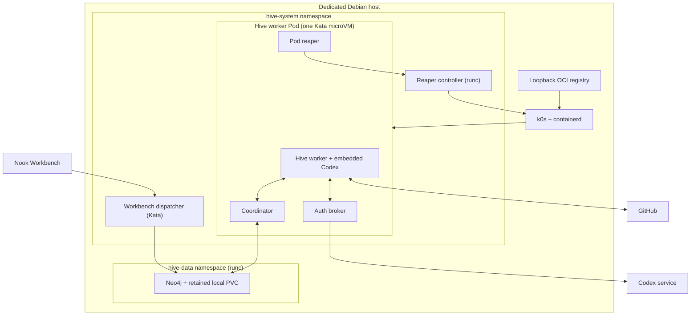
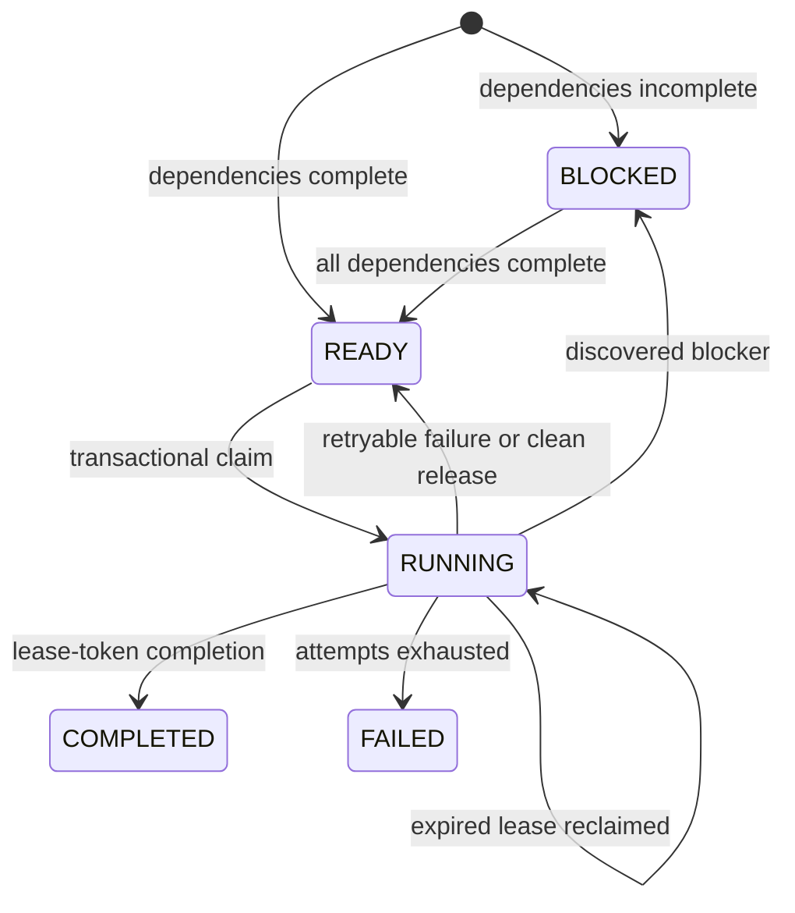

# Hive Isolated Agent Platform

Status: Implemented in the repository; deployment and live-state verification
are performed through the infrastructure Taskfile.

Hive is Nook's self-hosted, stateful AI-agent platform. It runs on the dedicated
Linux machine addressed by the default infrastructure target
`debian@ssh-ovh-borg-1.bynull.link`. k0s manages the Kubernetes cluster,
containerd starts Kata Containers microVMs, and Neo4j persists the task graph,
leases, attempts, results, and dependency artifacts.

The platform is stateful; workers are deliberately not. Each worker Pod handles
at most one task, exits, and is replaced by a clean Kata-backed Pod. A logical
Main-repair task nevertheless survives Pod replacement and owns delivery until
its reviewed pull request is squash-merged, the resulting Main revision is
green, and the Workbench incident is completed.

## 1. Architectural boundaries

Hive separates four responsibilities:

1. **Kubernetes schedules isolated execution.** k0s maintains the worker pool
   and Kata supplies the guest-kernel boundary.
2. **Neo4j coordinates durable work.** It is the only task queue, DAG, lease
   store, attempt history, and artifact store.
3. **Embedded Codex performs repository work.** Hive uses the in-process Codex
   core API; it does not spawn a Codex CLI process or parse CLI JSONL. Every
   worker turn explicitly selects `gpt-5.6-terra` with `low` reasoning effort,
   the
   non-UI representation of Codex Light.
4. **Codex agents are trusted operators.** Main-repair agents receive a scoped
   GitHub credential and use standard `git` and `gh` workflows directly. Hive
   must not introduce a custom publication broker, filesystem mailbox, signed
   request protocol, or similar layer solely to protect GitHub credentials from
   Codex. Kata isolation and disposable workspaces remain operational
   containment and lifecycle tools, not a statement that the agent is hostile.

Hive does not add NATS, Redis, PostgreSQL, RabbitMQ, KubeVirt, or a
Kata-specific application orchestrator. Redis used by Hive CI is only an
optional remote `sccache` compiler-output cache; it is not runtime coordination
or durable Hive state.

## 2. Deployment topology



The initial cluster is deliberately single-node. Neo4j runs with the normal
container runtime because it is a persistent infrastructure service. The
dispatcher and every task worker use `kata-dragonball`. Dragonball is the
Rust-based VMM built into Kata runtime-rs; it provides the full CRI and
virtio-fs behavior required by Hive with lower startup and memory overhead than
QEMU. The authoritative
version pins for k0s, Helm, Kata, Neo4j, and the Hive image are in the
[`infra/Taskfile.yml`](../../infra/Taskfile.yml) composition root and its
reachable [`infra/tasks/`](../../infra/tasks/) domain modules; manifests live
under [`infra/k0s/`](../../infra/k0s/).

Before applying a new worker/coordinator, dispatcher, or observer revision, the
deployment task scales all three graph-client Deployments to zero and verifies
their Pods are gone. Their manifests also use the Kubernetes `Recreate`
strategy. A graph-schema rollout therefore drains every older binary globally
before any new revision can migrate and serve the retained graph; temporary
control-plane unavailability is preferred to mixed schema semantics.

## 3. Components and ownership

| Component | Runs where | Owns | Must not own |
| --- | --- | --- | --- |
| Main failure handoff | GitHub Actions | Converts every actionable unsuccessful trusted `Main` run into one Workbench incident keyed by failed SHA, including browser E2E and UI-demo failures | Agent execution, raw failure logs, deployment |
| Workbench dispatcher | One Kata Pod | Polls public-safe `status: ready`, `automation: hive` incidents, binds the referenced run to the exact Nook Main push SHA, and idempotently enqueues unresolved failures | GitHub publication token, Codex auth |
| Neo4j | `hive-data`, runc, retained PVC | Task DAG, readiness, claims, leases, agents, attempts, results, artifacts, schema migrations | Codex or repository execution |
| Control Center observer | Dedicated runc Pod | Read-only, localized task/worker projection and the static operator dashboard | Task mutation, Codex auth, GitHub credentials, or raw agent output |
| Coordinator | Worker Kata Pod | Neo4j credential and a typed Unix-socket task-store protocol | Raw-query access for the worker |
| Worker | Worker Kata Pod | Claim loop, workspace, heartbeat, embedded Codex thread, scoped GitHub credential, standard GitHub delivery, terminal result, dependency patch integration | Raw Neo4j access or Kubernetes administrative credentials |
| Auth broker | Worker Kata Pod | Codex credential source, refresh, and one established token channel | Repository execution or GitHub publication |
| Pod reaper | Worker Kata Pod | Requests whole-Pod replacement with an opaque one-purpose credential | Kubernetes API or auth persistence |
| Lifecycle controller | Dedicated runc Pod | Validates Hive Pod identity, deletes only labeled Hive Pods, and reconciles the live Neo4j endpoint into worker and dispatcher egress policies | Codex auth or task execution |
| Kubernetes Deployment | k0s | Four ready worker Pods and clean replacement | Durable task semantics |

The warm-pool size is four. Each Pod is a security and lifecycle unit, not four
independent long-lived worker processes sharing one filesystem.

## 4. Task and graph model

The graph contains:

```text
(:Task)-[:DEPENDS_ON]->(:Task)
(:Agent)-[:EXECUTED]->(:Attempt)-[:FOR_TASK]->(:Task)
(:Attempt)-[:PRODUCED]->(:Artifact)
(:TaskActivity)-[:FOR_TASK]->(:Task)
```

Task definitions include a full 40-character `source_commit`. Every task in one
dependency DAG must target the same source revision. Hive graph schema
migrations are explicit and versioned; a binary refuses a graph newer than it
supports. Schema 5 introduces the persisted `CANCELLING` state and its
Pod-termination acknowledgement contract. Schema 6 adds semantic task activity
with a per-task bound of 200 events. Activity contains localized message keys,
timestamps, categories, and bounded operational detail; it never stores raw
model reasoning, command output, prompts, credentials, or repository secrets.
New tasks also persist typed trigger provenance (`manual-cli`,
`github-main-failure`, or `agent-dependency`) at enqueue time; the observer
localizes that durable value and labels pre-migration tasks as unknown instead
of guessing their source from task kind.

### Stored readiness invariant

- `BLOCKED` means at least one direct dependency is not `COMPLETED`.
- `READY` means every direct dependency is `COMPLETED`.
- Completion promotes newly unblocked tasks in the same write transaction.
- Claiming always revalidates dependency state, so stale stored readiness cannot
  authorize execution.



Claiming is a Neo4j write transaction. It obtains a write conflict through
`claim_lock`, revalidates task status, dependencies, attempt limits, and lease
expiry, then creates a unique attempt and lease token. Heartbeat and completion
must present the current token. A late worker cannot overwrite a replacement
attempt.

Production workers use a one-hour renewable lease, a one-minute heartbeat, a
six-hour task timeout, and bounded idle polling with jitter. The lease window
must cover long repository checks even if the embedded agent briefly delays
the renewal task; accepted renewals remain visible in worker logs. Rollout
interruption releases the task and decrements the consumed attempt before the
Pod exits.

### Blocking dependencies

Codex may return a typed blocker instead of pretending the parent task is
complete. Hive then:

1. idempotently creates or reuses the higher-priority blocker;
2. adds a `DEPENDS_ON` edge;
3. records the blocked attempt;
4. releases the parent's retry consumption; and
5. makes the parent `READY` immediately if the reused blocker was already
   complete, otherwise `BLOCKED`.

When the blocker completes, its Git patch becomes a dependency artifact. A
replacement worker verifies the artifact digest, applies it to the same pinned
revision, commits a dependency baseline, and gives the parent task both the
dependency summary and resulting source. Resumed publication branches still
receive dependency artifacts added after the branch was first created.

A blocker may retire as obsolete without resolving its named prerequisite only
when every active transitive non-blocker consumer is a Main-repair task and
every one of those repairs is already squash-merged with a successful
containing Main run. Intermediate blocker nodes belong to the same prerequisite
chain and are not independent consumers. Claiming snapshots the complete sorted
owner set; completion transactionally rechecks that exact set and refuses
retirement if a Main repair or any non-Main consumer was attached while the
blocker was running. Before completion, the worker independently runs the full
deterministic branch, merged-PR, squash-merge, ancestry, and successful
containing-Main proof for every owning repair. It intentionally does not require
the owner's later review, deployment, or Workbench completion steps, because
those remain part of the owning task's terminal delivery verifier and may wait
on this blocker. Prompt compliance alone cannot retire a live prerequisite. A
refused retirement releases the lease and retry consumption so another worker
can re-evaluate the updated ownership. The
schema-8 terminal result marks this exceptional path explicitly with
`obsolete: true`, and Hive persists that marker on both the task and attempt.
If a future task discovers or directly depends on the same stable blocker ID,
Hive transactionally rearms the dependency subtree only when that requested
root is itself obsolete. Both direct enqueue and discovered-blocker attachment
create the owner edge and take a write lock on that root before re-reading and
rearming it, so a concurrent retirement cannot leave the new consumer treating
it as satisfied. Rearming preserves the monotonic attempt number and extends
the maximum by three attempts, then derives each task's state from its direct
dependencies; a normally completed root remains satisfied even if historical
obsolete descendants are still attached.
Normal completion, including a real patch produced while owners change,
bypasses the retirement-only guard and persists normally. The shared-owner,
mixed-owner, late-owner, future-owner, and genuine-completion race cases are
behavior-tested in
`agentic-ai/minds/hive/tests/neo4j_store.rs` and its focused `rearm.rs`
integration capability.

### Durable results

Terminal summaries are bounded to 64 KiB. Authored changes are stored as a
bounded binary Git patch of at most 1 MiB, with a SHA-256 digest, in the same
transaction as attempt completion. These graph artifacts are suitable for
dependency handoff; large logs and build artifacts remain outside the current
prototype.

## 5. Worker execution lifecycle

```mermaid
sequenceDiagram
  autonumber
  participant K as Kubernetes
  participant W as Worker
  participant C as Coordinator
  participant N as Neo4j
  participant A as Auth broker
  participant X as Embedded Codex
  participant G as GitHub

  K->>W: Start clean Kata-backed Pod
  W->>C: Claim one task
  C->>N: Transactional claim + attempt + lease
  N-->>W: Pinned task and dependency context
  W->>W: Fetch pinned Git object and apply dependency artifacts
  W->>A: Establish short-lived Codex auth channel
  W->>X: Start one in-process thread
  loop While the task runs
    W->>C: Heartbeat current lease token
    X->>G: Standard git and gh delivery operations
    X-->>W: Progress and structured result
    W->>W: Append typed validation execution event
  end
  W->>C: Complete, block, fail, or release
  C->>N: Commit terminal state
  W->>W: Write terminal lifecycle marker
  K->>K: Reaper deletes Pod; Deployment replaces it
```

The worker creates a sentinel with create-once semantics before claiming. If
the worker container restarts in the same Pod, it refuses to claim again and
the reaper deletes the Pod. This preserves the one-task-per-microVM invariant.
While idle, the worker validates its already-established auth channel before
every claim attempt. A restarted or failed auth sidecar therefore removes
readiness and triggers whole-Pod replacement before any task attempt is
consumed.
The task lifecycle has a six-hour bound so diagnosis, implementation, review,
merge, and resulting Main verification remain one durable unit of work.

Repository checkout starts from the task's full pinned Git object ID, not a
moving branch. A Main repair may resume a durable Hive publication branch only
after proving that the pinned revision is its ancestor.

## 6. Main failure to completed repair

Main uses a single concurrency group with `cancel-in-progress: false`. The
active run finishes, including cache publication, while GitHub coalesces a
burst of later pushes to the newest pending revision.

An actionable unsuccessful completed Main run follows this path:

```mermaid
flowchart LR
  failed["Failed Main run"] --> handoff["Trusted failure handoff"]
  handoff --> incident["Workbench incident keyed by failed SHA"]
  incident --> dispatcher["Token-free dispatcher"]
  dispatcher --> task["Neo4j main-repair task"]
  task --> diagnose["Diagnose and implement"]
  diagnose --> pr["Normal PR + ci:full-e2e"]
  pr --> review["Exact-head checks and all review surfaces"]
  review --> merge["Serialized squash merge"]
  merge --> main["Resulting Main verification"]
  main --> worklog["Workbench issue + worklog completion"]
  worklog --> complete["Neo4j task COMPLETED"]
```



Every failed browser E2E, UI-demo, native, WASM, build, deployment, mixed, or
unknown Main attempt follows the repair path above. A later failed rerun
restores the incident to `ready`, clears prior completion evidence, and creates
a new task generation keyed by workflow run and attempt. If an earlier
generation is still active, the dispatcher cancels it before enqueueing the new
generation so the next worker receives the latest failed-job evidence without
creating competing repairs. The dispatcher aborts that reconciliation cycle
after requesting cancellation. The running worker then stops its Codex
execution and atomically acknowledges termination in Neo4j. In parallel, the
dispatcher asks the credential-gated lifecycle controller to delete the exact
worker Pod recorded for every cancelling root or exclusive blocker. The
controller validates the worker label and waits for Kubernetes to confirm
deletion before the dispatcher finalizes cancellation. This provides durable recovery when a worker crashes
before acknowledging. The old generation and its cancelling descendants remain
active until that proof, so no replacement can become claimable merely because
time elapsed. Reconciliation of the
already-current run/attempt generation is idempotent and never cancels it.
Cancellation also cancels blockers exclusive to the superseded delivery;
shared blockers remain available to other live dependents. Publication
branches, plans, and worklogs are generation-specific while the incident path
remains keyed by source SHA. Completed or failed generations and their
publication history remain immutable.

The token-free dispatcher maintains a shallow public Git checkout of Workbench
and reconciles only when its revision changes, rather than repeatedly spending
GitHub Contents API requests on unchanged incidents. It remembers already
reconciled incident filenames for the life of the Pod. Before enqueueing, the
dispatcher fetches the referenced workflow run once and requires repository
`meta-secret/nook`, workflow `Main`, push event, branch
`main`, and the incident's exact source SHA. Run IDs and attempts are ordered
across the complete incident history, so an older workflow run cannot
supersede newer evidence. A later successful rerun marks an existing incident
retired; the same Pod-termination barrier stops any active repair before the
revision becomes a no-op. A success observed before any failure handoff writes
a completed tombstone so delayed older failures remain stale. Retirement
cancels only the current active generation; completed and failed generations
remain immutable. Kubernetes Pod API calls use bounded request timeouts.

One logical Hive task owns the entire repair. Opening a PR is intermediate
state, not completion. The task must:

1. diagnose from retained workflow evidence;
2. implement and run repository operations through Taskfiles;
3. publish a deterministic repair branch and PR;
4. apply the `ci:full-e2e` label;
5. inspect exact-head repository checks, inline threads, review bodies, and
   top-level PR comments;
6. reply to each actionable item and resolve its thread after the reply exists;
7. prove the PR head contains current `main`;
8. acquire the short-lived `hive-merge-lock` Git ref and squash-merge the exact
   verified head;
9. verify the resulting Main run; and
10. complete the Workbench incident, linked plan, and worklog.

An incident remains the durable desired-state signal, while Neo4j owns actual
execution state and attempt history. Operators inspect that state with
`task infra:hive:queue:status`, which includes the latest and previous attempt
outcomes so replacement-Pod failures remain diagnosable. A failed Main-repair
is not automatically rearmed on every dispatcher poll: after repairing the
platform, the explicit
`task infra:hive:queue:retry HIVE_TASK_ID=...` transition preserves prior
attempts and adds one bounded three-attempt budget per deployed Hive image. It
atomically rearms obsolete dependency roots and then failed members from leaves
toward the Main repair. It write-locks the reachable graph before inspecting
retirement state and holds those locks through owner reactivation, recomputes
readiness from the revived graph, refuses an active task, and cannot repeat a
recovery for the same image digest.

### GitHub delivery recovery

The base branch is deterministic: `codex/hive-<task-id>`. If a prior repair PR
is closed or merged but the durable task still requires work, the agent creates
`-g2`, `-g3`, and later generations instead of trying to reuse a closed PR.
Replacement Pods inspect GitHub for the latest generation and merged commit,
then resume Main verification without creating a duplicate PR.

The GitHub token is mounted into the Main-repair worker and exposed to Codex
through the conventional `GH_TOKEN` environment contract. A single shared,
repository-scoped token is acceptable; per-agent or short-lived tokens may be
used when operationally convenient, but are not required as an additional
security boundary. Repository permissions remain the authorization boundary.

Codex uses standard `git` and `gh` commands for branch publication, pull-request
creation and inspection, targeted replies, thread resolution, exact-head
squash merge, Main verification, and Workbench updates. It must traverse all
relevant check, review, comment, and thread pages and continue to follow the
repository's normal readiness rules. Because the sealed guest intentionally has
no Docker socket, it runs the existing TypeScript readiness audit through
`task hive:guest:pr:ready PR=<number>` instead of the Docker-backed host wrapper.
Hive must prefer these established tools over a custom typed publication API.

The agent is trusted with both the credential and the task checkout. Hive does
not need a broker-owned private checkout, request signing, mailbox correlation,
or defenses against the agent substituting its own publication requests.
Ordinary protections against accidental secret disclosure still apply:
credentials remain in Kubernetes Secrets or process environment, never in
repository files, logs, Workbench records, or pull-request content.

## 7. Isolation and credential design

### Kata boundary

Every dispatcher and worker Pod selects `kata-dragonball`. There is no
fallback to `runc`. The host, KVM support, runtime class, and guest-kernel
identity are verified by infrastructure tasks before Hive deploys.

The worker container alone uses the pinned, node-local
`nook/hive-bubblewrap.json` seccomp profile because rootless Bubblewrap must
create and populate its mount namespace inside the guest. `Localhost` keeps the
Pod compatible with the namespace's Restricted admission policy. Dragonball
remains the outer syscall and kernel boundary; the worker still runs as a
non-root user with every capability dropped, privilege escalation disabled,
and a read-only root filesystem. The profile denies unknown syscalls and derives
its ordinary allowlist from Moby's pinned `seccomp/v0.2.1` default profile,
adding only the namespace and mount calls required by Bubblewrap; privileged
kernel APIs such as `bpf` and `perf_event_open` remain denied. Credential and
lifecycle sidecars retain `RuntimeDefault`. The Taskfile installs the profile
beneath k0s's kubelet seccomp root and configures runtime-rs to pass Kubernetes
seccomp profiles into the Dragonball guest before applying Hive.

Restricted Kubernetes Pods mask sensitive paths in their inherited `/proc`,
which prevents an unprivileged nested sandbox from mounting a second procfs.
Hive therefore routes embedded Codex commands through a tiny wrapper that
selects Codex's explicit `--no-proc` mode. User, PID, mount, and restricted
network namespaces remain active; only the redundant fresh procfs mount is
omitted. Deployment verification launches the same no-fresh-proc Bubblewrap
shape inside a live worker, verifies that the guest applied seccomp, and rejects
the rollout if either boundary is unavailable.

Worker Pods have no hostPath volume and never mount the host repository, host
`CODEX_HOME`, or host Docker socket. They contain no privileged containers and
run no Docker daemon. The worker image carries the pinned Rust, Bun, Node, and
Task tools required by the repository. When `task format` detects the sealed
guest marker it selects the native `hive:guest:format` Taskfile path, operating
only on that task's disposable checkout. The image also carries npm so
`hive:guest:pr:ready` can install and run the repository's existing read-only
TypeScript PR audit without Docker.

### Credential ownership

| Credential | Mounted into | Exposed to worker/Codex |
| --- | --- | --- |
| Neo4j password and private CA trust | Coordinator; dispatcher has its own bounded database access | No password or raw graph connection |
| Codex `auth.json` | Auth broker only | Short-lived tokens on one pre-established private channel |
| Repository-scoped GitHub token | Main-repair worker | Yes, as `GH_TOKEN` for standard `git` and `gh` operations |
| Reaper controller credential | Pod reaper, Workbench dispatcher, and dedicated controller only | No |
| Kubernetes auth-refresh token | Auth broker only | No |

The Pod disables automatic service-account token mounting. Its service account
can patch only the Codex-auth Secret, and that projected token is mounted only
by the auth broker. The reaper has no Kubernetes token: it calls a dedicated
controller with an opaque credential. The controller has a distinct workload
identity restricted to `get`/`delete` labeled Hive Pods, reading only the
Neo4j Service and Endpoints, and patching only the worker and dispatcher egress
NetworkPolicies plus the observer egress NetworkPolicy used by the read-only
Control Center.
It continuously reconciles the post-DNAT Neo4j Pod address, so an automatic
StatefulSet or kubelet replacement cannot leave workers or the dispatcher
pinned to a stale endpoint. While Neo4j is unready, it removes the stale Pod
address and retains only the stable Service address. Resource-version
preconditions and bounded
conflict retries prevent reconciliation from overwriting a concurrent policy
change. The controller reloads both its projected Kubernetes token and the
opaque reaper credential for every request, so normal token projection and
Secret rotation do not require a controller restart.

Embedded Codex validation commands produce typed, secret-sanitized JSONL events
outside the repository checkout. Hive records their category, timestamps,
duration, outcome, and bounded command identity in the immutable Workbench
statistics record.

The same typed event stream feeds the bounded `TaskActivity` projection used by
the Control Center. Its network-facing HTTP container has no graph credential;
it can request only the overview or one task detail from a private Unix-socket
coordinator sidecar. The credential-bearing sidecar reads only current workers,
at most 200 tasks, and at most 100 recent activity entries for each task in a
response. Task detail uses a direct task lookup, so completed work remains
inspectable after it leaves the overview window.

Completion, failure, release, blocker discovery, and heartbeat mutations are
lease-token guarded. Blocker discovery additionally requires an unexpired
lease, preventing a stale worker from changing dependencies after replacement
has become eligible to claim the task.

Secrets are encrypted at rest by the k0s API server with a host-generated
AES-GCM encryption provider. Neo4j recovery material is authenticated and
encrypted under that host-held key. Secret checksums are placed in the Pod
template so credential rotation replaces the warm pool.

### Network boundary

Both Hive namespaces default-deny ingress and egress. Workers and the dispatcher
may use:

- cluster DNS;
- TLS Bolt to Neo4j on port 7687;
- external TCP 443 for Codex, GitHub, and HTTPS repository access; and
- external TCP 22 for task-authorized Git/SSH operations.

Only Hive worker Pods may reach the Kubernetes API service and its post-DNAT
endpoint, for the auth-persistence sidecar. The token-free Workbench dispatcher
has no API-server route. The dedicated lifecycle controller has a separate
API-server policy for its narrow Pod-deletion and Neo4j-endpoint reconciliation
identity. k0s binds that post-DNAT endpoint to the stable host loopback address
`10.201.0.1`; policy permits only `10.201.0.1/32` on port `6443`, avoiding a
bootstrap dependency on discovering an endpoint through an already-stale
allowlist.

Private, loopback, link-local, multicast, and cluster address ranges are
excluded from general external egress. Neo4j Bolt and HTTP are never exposed on
the machine's public address. The Control Center is cluster-private and
credential-free; operators reach it only through the repository-owned SSH
port-forward:

```text
task infra:hive:dashboard
```

## 8. Persistence and recovery

The stateful boundary is:

- Neo4j data on the retained `hive-local-retain` persistent volume;
- graph schema migrations and all task/attempt state;
- bounded dependency patches stored in Neo4j;
- deterministic GitHub branches and pull requests for Main delivery;
- Workbench incidents, plans, and worklogs; and
- encrypted Kubernetes Secrets plus the authenticated recovery bundle.

The disposable boundary is:

- repository checkout;
- Codex home and process state;
- temporary files and Unix sockets; and
- the Kata guest itself.

Failure recovery is therefore explicit:

- **Worker crash:** the lease expires and another Pod claims a new attempt.
- **Stale worker:** heartbeat and completion fail because its lease token no
  longer matches.
- **Rollout/SIGTERM:** the worker releases the task without consuming retry
  budget.
- **Publication bind failure:** the claim is released without consuming an
  attempt.
- **Pod restart:** the create-once sentinel prevents reuse; the reaper deletes
  the Pod.
- **Closed prior PR:** the next publication branch generation is created.
- **Merged repair followed by red Main:** the task recovers the merge state and
  opens a new generation for the follow-up repair.
- **Neo4j restart:** the PVC, transactions, and leases preserve graph state.

## 9. Build verification and cache model

The repository-owned `Hive` workflow is a valuable deployment-independent
verification gate. It runs when Hive, its infrastructure, or its contract tests
change. It does not deploy the cluster.

The Dockerfile follows Nook's cargo-chef boundary:

1. plan the dependency recipe;
2. cook stable debug/test and release dependencies;
3. materialize the real test and Clippy dependency graphs in independent
   BuildKit stages so they run in parallel;
4. copy authored source onto the matching warm graph;
5. run format/Clippy and behavior tests; and
6. publish both already-verified BuildKit graphs only from `main`.

Pull requests restore the `nook-hive-linux-amd64-v1` GitHub Actions BuildKit
scope read-only. Only Main publishes it after both Hive checks and Neo4j-backed
behavior tests pass. Redis compiler hits avoid recompilation, while the parallel
BuildKit stages also remove Cargo metadata and linking work from the serial
critical path.

Trusted same-repository Hive runs also use the remote TLS Redis compiler cache:

```text
rediss://redis-ovh-borg-1.bynull.link:6380
key prefix: nook-hive
credential: NOOK_CACHE_REDIS_PASSWORD
```

Redis `sccache` and GHA BuildKit are separate layers:

- Redis stores Rust compiler outputs.
- GHA stores BuildKit layers and dependency/source graph snapshots.
- Neither is a correctness dependency.
- `task infra:redis:credential:sync` writes the ignored, mode-`0600`
  `.nook/cache/redis-password` file. Hive build/check/test tasks use that path
  by default, while an explicit `SCCACHE_REDIS_PASSWORD_FILE` still overrides
  it in CI.
- Forks and local runs without either credential file compile normally and
  report the missing cache credential.
- The Redis credential is mounted as a BuildKit secret or read-only runtime
  secret and is never copied into an image or cache layer.
- The Redis credential is not needed by the Hive worker. Worker tasks publish
  changes and rely on repository-owned GitHub verification, where the same
  Redis cache is attached by the workflow.

## 10. Taskfile operations

All automated lifecycle, mutation, CI, SSH, Kubernetes, and deployment
operations go through the root Taskfile command surface. After
`task infra:kubernetes:console:install`, an authenticated operator may use the
installed `kubectl`, Helm, and k9s clients directly over SSH for interactive
inspection. Persistent platform changes still belong in Taskfile operations,
not ad hoc shell scripts.

The SSH-user kubeconfig stores no reusable credential. Its exec provider crosses
the operator's existing passwordless sudo boundary to a root-owned helper,
which mints a 15-minute token for the dedicated cluster operator identity.

Repository verification:

```text
task hive:format
task hive:check
task hive:test
task hive:build
task hive:image
task infra:k0s:manifests:check
```

Remote platform lifecycle:

```text
task infra:kvm:verify
task infra:kubernetes:console:install
task infra:kubernetes:tools:status
task infra:k0s:install
task infra:k0s:status
task infra:k0s:diagnose
task infra:services:diagnose
task infra:services:repair-network
task infra:kata:install
task infra:kata:diagnose
task infra:kata:verify
task infra:neo4j:deploy
task infra:hive:deploy
task infra:deploy
```

`task infra:deploy` is the complete entrypoint: it deploys the private
infrastructure services, syncs the repository-owned k0s configuration, installs
and verifies k0s/Kata, deploys persistent Neo4j, builds and publishes the exact
Hive image to the loopback registry, synchronizes credentials, deploys the warm
pool, and verifies Pod replacement.

The encryption-provider file remains `root:root 0600`; a read-only POSIX ACL
grants the dedicated `kube-apiserver` OS user access without granting ownership
or write authority. If the API server cannot start,
`task infra:k0s:diagnose` emits bounded service, listener, permission, ACL, and
journal evidence without reading secret contents.

The host firewall keeps its default-drop input and forward policies. k0s adds
only persisted rules for traffic sourced from the cluster Pod CIDR
`10.244.0.0/16` arriving on the kube-router `kube-bridge`: local control-plane access on TCP
`6443`/`8132`, kubelet access on `10250`, and Pod egress. Kube-router
masquerades traffic leaving the cluster so CoreDNS and intentionally allowlisted
worker egress receive replies through the node. These rules do not expose any
control-plane port on the public interface. The installer uses a temporary
owned rule while k0s starts and restores the previous live and persisted
firewall state if installation errors, exits, or receives a termination
signal. The rollback transaction flushes and recreates both managed host chains
from a complete ordered snapshot, preserving unrelated rule positions. It
records the existing CNI state before restarting k0s, so a controller rewrite
cannot hide an `ipMasq` migration; migrations automatically replace existing
Hive, dispatcher, and lifecycle-controller Pod sandboxes. The API server's
stable loopback address is `10.201.0.1`, and the worker egress template uses its
exact `/32` rather than a deployment-time endpoint lookup. The
`nook-k0s-api-address.service` systemd unit assigns the `/32` before k0s starts
and is enabled across reboots; installation verifies both unit state and the
live `lo` address.

Credential synchronization requires explicit local file inputs:

```text
HIVE_CODEX_AUTH_FILE=/absolute/path/to/auth.json
HIVE_GITHUB_TOKEN_FILE=/absolute/path/to/token
```

Copying these credentials into encrypted Kubernetes Secrets is a
security-sensitive deployment action and requires immediate user confirmation
before `task infra:deploy` or `task infra:hive:deploy` is invoked.

Destructive k0s uninstall requires `K0S_UNINSTALL_FORCE=1` and preserves
encrypted Neo4j recovery material by default. It removes the owned live k0s
firewall rules, persisted fragment, and nftables include without reloading the
global ruleset.

## 11. Source map

| Concern | Source of truth |
| --- | --- |
| Rust platform implementation | [`agentic-ai/minds/hive/src/`](../../agentic-ai/minds/hive/src/) |
| Worker image and cache stages | [`agentic-ai/minds/hive/Dockerfile`](../../agentic-ai/minds/hive/Dockerfile) |
| Hive developer commands | [`agentic-ai/minds/hive/Taskfile.yml`](../../agentic-ai/minds/hive/Taskfile.yml) |
| Infrastructure command composition | [`infra/Taskfile.yml`](../../infra/Taskfile.yml) |
| Infrastructure operations and pins | [`infra/tasks/`](../../infra/tasks/) |
| k0s, Kata, Neo4j, and Hive manifests | [`infra/k0s/`](../../infra/k0s/) |
| Main failure handoff | [`.github/workflows/main-failure-handoff.yml`](../../.github/workflows/main-failure-handoff.yml) |
| Hive verification workflow | [`.github/workflows/hive.yml`](../../.github/workflows/hive.yml) |
| Main coalescing and delivery | [`.github/workflows/main.yml`](../../.github/workflows/main.yml) |
| Workbench issue contract | [`workflows/issues.md`](../workflows/issues.md) |
| Pull-request ownership contract | [`workflows/pull-requests.md`](../workflows/pull-requests.md) |
