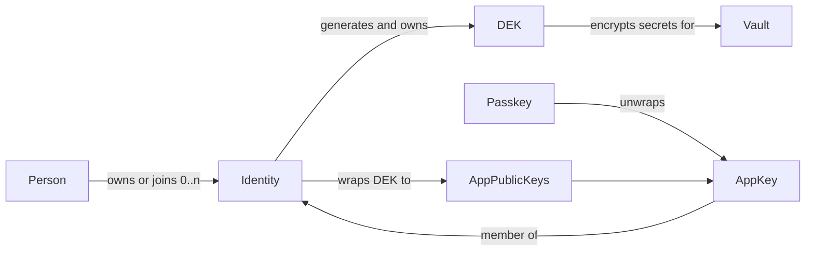

# Identity, App Keys, Passkeys, and Vault DEKs

## Relationships

- [Auth Providers, Sync, and Login UX](auth-providers.md)
  - Defines provider credential persistence, login UX, and provider transport boundaries.
  - Read before changing the related architecture or security boundary.
- [Vault Event Log](vault-event-log.md)
  - Defines immutable vault events, ordering, concurrency, and provider synchronization.
  - Read before changing the related architecture or security boundary.
- [Vault Session, Lock, and Multi-Vault Model](vault-session-and-lock.md)
  - Defines vault sessions, unlock, lock semantics, and multi-vault state.
  - Read before changing the related architecture or security boundary.
- [Browser Extension Product Spec](../product-specs/browser-extension.md)
  - Defines the companion extension boundary, approval, authentication surfaces, and storage rules.
  - Read when this document touches the related product behavior or user flow.
- [Devices & access](../product-specs/devices-and-access.md)
  - Defines identity, device protection evidence, onboarding, and verified vault grants.
  - Read when this document touches the related product behavior or user flow.

## Document map

- [Overview](#overview)
  - States the architecture decision, current status, and identity-first direction.
  - Read before changing identity, vault, device, or passkey ownership.
- [Normative vocabulary](#normative-vocabulary)
  - Separates people, identities, passkeys, app keys, vaults, providers, and devices.
  - Read when naming domain entities or defining their authority.
- [Domain map](#domain-map)
  - Shows ownership and authorization relationships among identity-domain entities.
  - Read when tracing which entity creates, wraps, grants, or stores a key.
- [Identity domain](#identity-domain)
  - Defines identity records, app installations, and local evidence boundaries.
  - Read when implementing identity discovery, enrollment, or device labeling.
  - [Local directory phase](#local-directory-phase)
    - Documents the current browser-local identity directory and migration boundary.
    - Read when changing local identity persistence or reconciliation.
- [DEK ownership](#dek-ownership)
  - Assigns vault DEK creation and grant authority to identities.
  - Read when changing vault creation, membership, or key wrapping.
- [Vault domain](#vault-domain)
  - Defines vault content as subordinate to identity-owned authorization.
  - Read when changing vault metadata, grants, providers, or projections.
- [Passkey locality](#passkey-locality)
  - Keeps passkey portability claims within browser-reported evidence.
  - Read when presenting or persisting passkey and device facts.
- [Onboarding](#onboarding)
  - Sequences identity selection before vault creation and provider setup.
  - Read when changing onboarding or first-vault flows.
- [Browser extension boundary](#browser-extension-boundary)
  - Treats the extension as an installation with its own app identity and key.
  - Read when pairing, authorizing, or labeling extension access.
- [Invariants](#invariants)
  - Collects the non-negotiable identity, key, and evidence constraints.
  - Read before accepting an architecture or migration design.
- [Related records](#related-records)
  - Routes to product and architecture records that refine this model.
  - Read when work crosses identity, access, extension, or vault-event boundaries.

## Overview

**Status:** Architecture decision in implementation.
The local identity directory and identity-owned DEKs are implemented.
Replicated identity control remains an active delivery target.

Nook distinguishes a person, identities, passkeys, app keys, sync providers,
and vaults. None of these names are interchangeable.

## Normative vocabulary

| Term | Meaning |
|---|---|
| **Person / user** | The human operator. One person may own or join multiple identities. |
| **Identity** | Logical authorization subject. It possesses passkeys and therefore app keys. It owns per-vault DEKs. |
| **Passkey / device key** | WebAuthn credential or PIN/passphrase fallback that protects a local app key. |
| **App key** | Installation-local asymmetric key for Simple, Sentinel, or the web extension. Replaces the former `DeviceIdentity` name. |
| **`app_id`** | Stable id for one app-key installation. Replaces the former `device_id` / `DeviceId` name. |
| **Installation** | Browser-origin or extension storage context that holds one app private key. |
| **Sync-provider mount** | Replication transport for an identity control log or vault event log. Not authority. |
| **Vault** | Encrypted secret event log addressed by `store_id`. It cannot exist without an authorizing identity. |

Historical name `DeviceIdentity` means app key.
Historical name `device_id` means `app_id`.
Do not introduce those old names in new APIs.

## Domain map

## Identity domain

An identity is a logical account.
A person may keep separate identities for personal, work, family, or recovery
contexts.

An identity must have at least one passkey or PIN/passphrase protector before
it may create a vault.
That protector unwraps a local app key.
The app public key is a member of the identity.

The identity control log owns:

- a stable identity id and label;
- passkey credential records;
- app public keys (`app_id`, X25519 encryption public key, Ed25519 signing
  public key, status);
- per-vault DEK records: vault `store_id` plus envelopes of that vault DEK to
  each active app public key;
- recovery and control events;
- zero or more sync-provider mounts for the control log.

Private app keys never enter the replicated identity record.

### Local directory phase

The browser stores the local directory under `identity_directory_v1`.
The directory contains:

- zero or more `IdentityRecord` values;
- an explicit `Empty` or `Selected(identity_id)` state; and
- app IDs retired by destructive local recovery.

Older versions allowed one app key to appear in several identities.
Load migrates those records in the existing IndexedDB transaction.
It merges every identity connected by a shared app key.
The selected identity survives when it belongs to that group.
An identity referenced by `pending_simple_genesis_v1` takes precedence over
the selection so a resumable genesis marker cannot become orphaned.
When the marker is staged, the same transaction normalizes its base and
candidate directory snapshots before rewriting the live directory.
Cleanup repeats that snapshot migration when either the live directory or the
staged base contains legacy duplicate ownership. Duplicate ownership introduced
only by the candidate remains invalid and is rejected.
Every later directory update repeats this marker-aware migration within its
write transaction. Authenticated handoff and staged genesis cleanup preserve the
pending identity inside their transactions. A concurrent pre-upgrade writer
cannot absorb the pending identity between preflight migration and mutation.
All distinct members and vault DEK grants survive the merge.
The normalized directory is rewritten before unique app-key ownership is
enforced.
A valid directory without duplicate app-key ownership remains usable without
decoding a malformed or future pending-genesis marker.

Each identity member stores its X25519 encryption public key and Ed25519 event
signing public key. Older records decode a missing signing key as unavailable.
They cannot enter a new signed Simple-vault genesis roster until an authenticated
handoff or the local signer supplies that public key.

- **Directory concurrency:**
  - Apply every directory update in one IndexedDB read-write transaction.
  - Prevent concurrent tabs from overwriting identity creation, selection,
    membership, or DEK changes.
- **Fresh-vault extension adoption:**
  - Stage extension identity adoption through vault initialization.
  - Keep fresh-vault membership, signing keys, and per-vault DEK envelopes only
    in the resumable genesis marker until verified connect succeeds.
  - Compare the marker's base directory with the current directory during
    completion.
  - Publish the staged directory and matching signing seed, then remove the
    marker atomically.
  - Retain unrelated concurrent identity and selection changes through a typed
    three-way rebase.
  - Abort publication when the staged identity changed concurrently or app-key
    ownership overlaps another identity.
  - Retain a rejected marker so retry resumes the same candidate.
  - After a failed create, clear decrypted host state and stop background sync
    without rolling back event stores or active identity state.
- **Existing-vault import:**
  - Use a distinct pending handoff state.
  - During verified connect, synthesize the vault owner from active signed
    envelopes and verify the extension signing key against the active event
    roster.
  - If the authorized app key already belongs to an identity, add the imported
    vault grant to that identity rather than synthesizing a duplicate owner.
  - Reject the roster snapshot if its event index names a missing event or an
    invalid event ID.
  - Reject matching event rows absent from the index. This closes the
    pre-upgrade two-transaction writer window before authorization is trusted.
  - Parse every event row and require its computed event ID to match the index
    and row key before treating it as authorization evidence.
  - Reject a graph with pending events. A known revocation awaiting a missing
    parent must not leave an older approval usable for handoff.
  - Commit the member signer and adopted signing seed atomically.
  - Return the transactionally selected DEKs and install them in the live vault
    session before clearing the pending handoff.
  - Validate a staged candidate before both unchanged-base publication and
    three-way rebase publication.
- **Legacy-vault reconciliation:** Derive DEK recipients from the signed event
  graph's active approvals after revocations, not from stale encrypted auth
  rows.

Simple vault creation uses the following marker contract:

- Store `pending_simple_genesis_v1` in IndexedDB before any event-log state.
- Record `storeId`, `identityId`, `createdAt`, `eventState`, and `flow`.
  - `flow` is explicitly `ordinary` or `staged`.
  - The staged flow carries the base directory and inactive candidate directory
    with identity-owned DEK envelopes.
  - Writers also emit the legacy `stagedIdentity` projection for already-open
    tabs.
  - Reject conflicting current and legacy staged state.
- Resume the same store and identity binding after a reload.
- Remove the marker with a compare-and-delete transaction after verified
  connect completes.
  - An older tab cannot delete a newer genesis marker.
- Let the marker own the genesis timestamp and complete signed event lifecycle.
- Set `eventState` to `awaiting-event`, `legacy-event-pinned`, or
  `event-pinned`.
  - The current pinned variant owns the signed `eventYaml`, an app-key-sealed
    `signingSeedEnvelope`, and staged-member signer envelopes before the first
    event-log write.
  - Either authorized staged member can resume the exact signer and event after
    a reload.
- Decode legacy variants conservatively:
  - A marker without `createdAt` uses the Unix epoch timestamp.
  - A marker without `eventState` becomes `awaiting-event`.
  - A preceding top-level `eventYaml`, or an `event-pinned` state without seed
    material, becomes `legacy-event-pinned`.
  - Upgrade that state only after the durable seed matches the pinned event
    signer.
  - Apply the same signer check before sealing a legacy plaintext seed.

Destructive recovery clears identity ownership atomically while retaining a
fail-closed ledger of retired app IDs. Tabs quiesce before recovery. Separate
auth cleanup remains retryable after a partial failure. Identity DEK grants
store known epochs; legacy omissions require verified reconciliation. The v2
reconciliation marker preserves resumable progress across reloads.

The first directory read migrates `identity_record_v1` when present:

1. decode the singleton record;
2. write a valid directory with that record selected; and
3. delete the legacy key only after the directory write succeeds.

Pre-directory builds cannot read the new key.
Downgrading after migration is unsupported.
This local record is not the future replicated identity control log.

## DEK ownership

The identity generates each vault DEK.
The identity stores envelopes of that DEK to every current app public key.
The vault does not own a standalone DEK.
The vault cannot be created without an identity that already has:

1. at least one key; and
2. a generated DEK for that vault.

When an app key is added or removed, the identity re-wraps or drops DEK
envelopes.
The vault event log does not need a membership rewrite for that change.

Rejected model: vault stores identity-versioned DEK blobs that rewrite on every
key add.

Legacy vault `auth:` and `members:` rows remain a wire-compatibility boundary.
Loaders synthesize an identity and move DEK envelopes onto identity-held
records.

## Vault domain

A vault owns:

- `store_id`;
- secret ciphertext under the identity-supplied DEK;
- signed vault event log and projection;
- a reference to its authorizing identity.

A vault does not own the member roster as authority.
Passwords and other secret items remain vault content.

Unlock path:

1. Passkey or PIN unwraps the local app key.
2. The app key unwraps the identity-held DEK envelope for that vault.
3. The DEK decrypts vault secrets.

## Passkey locality

WebAuthn backup eligibility remains browser-reported evidence.
A synced passkey has provider availability, not one asserted laptop location.
A synced passkey may unlock an installation's wrapped app key.
It does not copy the app private key between installations.

Target shape: fresh random locally wrapped app key per installation.
Deterministic passkey-derived app keys remain a compatibility boundary and
must not define the target model.

## Onboarding

Creating a vault requires creating or selecting an identity first:

1. create identity;
2. enroll passkey or PIN and local app key;
3. identity generates vault DEK and wraps it to current app public keys;
4. create vault bound to that identity.

Adding another app key later updates identity DEK envelopes only.

## Browser extension boundary

The extension is another installation with its own `app_id` and app key.
It is not itself an identity.
It acts through a selected identity after the matching app key is enrolled.

## Invariants

- A vault cannot exist without at least one authorizing identity.
- A vault cannot hold a DEK by itself.
- Identity owns per-vault DEKs and member envelopes.
- Passkey protects app key; app key is a member of identity.
- `app_id` names an installation app key, not a person and not a vault.
- No provider credential grants identity membership or vault decryption.
- Portable identity, app-key, DEK, and vault policy belongs in Rust.
  Svelte renders typed state and coordinates browser ceremonies.

## Related records

- [devices-and-access.md](../product-specs/devices-and-access.md)
- [auth-providers.md](auth-providers.md)
- [vault-event-log.md](vault-event-log.md)
- [vault-session-and-lock.md](vault-session-and-lock.md)
- [browser-extension.md](../product-specs/browser-extension.md)
