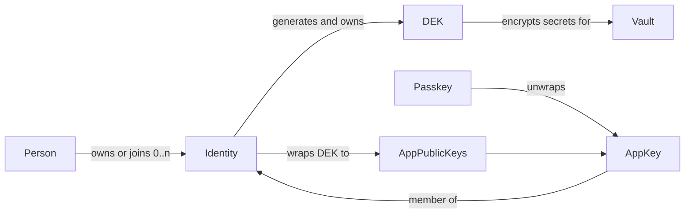

# Identity, App Keys, Passkeys, and Vault DEKs

**Status:** Architecture decision in implementation.
The local identity directory and identity-owned DEKs are implemented.
Replicated identity control remains an active delivery target.

Nook distinguishes a person, identities, passkeys, app keys, sync providers,
and vaults. None of these names are interchangeable.

## Normative vocabulary

| Term | Meaning |
|---|---|
| **Person / user** | The human operator. One person may own or join multiple identities. |
| **Identity** | Logical authorization subject. It possesses passkeys and therefore app keys. It owns per-vault DEKs. |
| **Passkey / device key** | WebAuthn credential or PIN/passphrase fallback that protects a local app key. |
| **App key** | Installation-local asymmetric key for Simple, Sentinel, or the web extension. Replaces the former `DeviceIdentity` name. |
| **`app_id`** | Stable id for one app-key installation. Replaces the former `device_id` / `DeviceId` name. |
| **Installation** | Browser-origin or extension storage context that holds one app private key. |
| **Sync-provider mount** | Replication transport for an identity control log or vault event log. Not authority. |
| **Vault** | Encrypted secret event log addressed by `store_id`. It cannot exist without an authorizing identity. |

Historical name `DeviceIdentity` means app key.
Historical name `device_id` means `app_id`.
Do not introduce those old names in new APIs.

## Domain map

## Identity domain

An identity is a logical account.
A person may keep separate identities for personal, work, family, or recovery
contexts.

An identity must have at least one passkey or PIN/passphrase protector before
it may create a vault.
That protector unwraps a local app key.
The app public key is a member of the identity.

The identity control log owns:

- a stable identity id and label;
- passkey credential records;
- app public keys (`app_id`, X25519 encryption public key, Ed25519 signing
  public key, status);
- per-vault DEK records: vault `store_id` plus envelopes of that vault DEK to
  each active app public key;
- recovery and control events;
- zero or more sync-provider mounts for the control log.

Private app keys never enter the replicated identity record.

### Local directory phase

The browser stores the local directory under `identity_directory_v1`.
The directory contains:

- zero or more `IdentityRecord` values; and
- an explicit `Empty` or `Selected(identity_id)` state.

Each identity member stores its X25519 encryption public key and Ed25519 event
signing public key. Older records decode a missing signing key as unavailable.
They cannot enter a new signed Simple-vault genesis roster until an authenticated
handoff or the local signer supplies that public key.

All directory updates use one IndexedDB read-write transaction.
Concurrent tabs must not overwrite identity creation, selection, membership,
or DEK changes.
Extension identity adoption remains reversible through vault initialization.
One IndexedDB transaction commits the member, its signing public key, its
authorized per-vault DEK envelopes, and any adopted signing seed. Fresh-vault
creation retains the exact prior directory, signer, and genesis-marker state
until verified genesis connect succeeds. A failed create restores that snapshot
atomically. It also clears decrypted host state and stops background sync.
Legacy-vault reconciliation derives DEK recipients from the signed event
graph's active approvals after revocations, not from stale encrypted auth rows.

Simple vault creation stores `pending_simple_genesis_v1` in IndexedDB.
Its JSON fields are `storeId`, `identityId`, `createdAt`, and `eventState`.
The app writes the marker before it creates the identity-owned DEK.
A reload resumes the same store and identity binding.
Verified connect completion removes the marker with a compare-and-delete
transaction.
An older tab cannot delete a newer genesis marker.
The marker owns the genesis timestamp and complete signed event lifecycle.
`eventState` is `awaiting-event`, `legacy-event-pinned`, or `event-pinned`.
The current pinned variant owns the signed `eventYaml` and an app-key-sealed
`signingSeedEnvelope` before the first event-log write. Competing tabs reuse one
signer and one event without persisting the signing seed in plaintext.
Legacy markers without `createdAt` use the Unix epoch timestamp. Markers without
`eventState` decode as `awaiting-event`. A preceding top-level `eventYaml`, or
an `event-pinned` state without seed material becomes `legacy-event-pinned`.
That state upgrades only after the durable seed matches the pinned event signer.
The same signer check applies before sealing a legacy plaintext seed.

The first directory read migrates `identity_record_v1` when present:

1. decode the singleton record;
2. write a valid directory with that record selected; and
3. delete the legacy key only after the directory write succeeds.

Pre-directory builds cannot read the new key.
Downgrading after migration is unsupported.
This local record is not the future replicated identity control log.

## DEK ownership

The identity generates each vault DEK.
The identity stores envelopes of that DEK to every current app public key.
The vault does not own a standalone DEK.
The vault cannot be created without an identity that already has:

1. at least one key; and
2. a generated DEK for that vault.

When an app key is added or removed, the identity re-wraps or drops DEK
envelopes.
The vault event log does not need a membership rewrite for that change.

Rejected model: vault stores identity-versioned DEK blobs that rewrite on every
key add.

Legacy vault `auth:` and `members:` rows remain a wire-compatibility boundary.
Loaders synthesize an identity and move DEK envelopes onto identity-held
records.

## Vault domain

A vault owns:

- `store_id`;
- secret ciphertext under the identity-supplied DEK;
- signed vault event log and projection;
- a reference to its authorizing identity.

A vault does not own the member roster as authority.
Passwords and other secret items remain vault content.

Unlock path:

1. Passkey or PIN unwraps the local app key.
2. The app key unwraps the identity-held DEK envelope for that vault.
3. The DEK decrypts vault secrets.

## Passkey locality

WebAuthn backup eligibility remains browser-reported evidence.
A synced passkey has provider availability, not one asserted laptop location.
A synced passkey may unlock an installation's wrapped app key.
It does not copy the app private key between installations.

Target shape: fresh random locally wrapped app key per installation.
Deterministic passkey-derived app keys remain a compatibility boundary and
must not define the target model.

## Onboarding

Creating a vault requires creating or selecting an identity first:

1. create identity;
2. enroll passkey or PIN and local app key;
3. identity generates vault DEK and wraps it to current app public keys;
4. create vault bound to that identity.

Adding another app key later updates identity DEK envelopes only.

## Browser extension boundary

The extension is another installation with its own `app_id` and app key.
It is not itself an identity.
It acts through a selected identity after the matching app key is enrolled.

## Invariants

- A vault cannot exist without at least one authorizing identity.
- A vault cannot hold a DEK by itself.
- Identity owns per-vault DEKs and member envelopes.
- Passkey protects app key; app key is a member of identity.
- `app_id` names an installation app key, not a person and not a vault.
- No provider credential grants identity membership or vault decryption.
- Portable identity, app-key, DEK, and vault policy belongs in Rust.
  Svelte renders typed state and coordinates browser ceremonies.

## Related records

- [devices-and-access.md](../product-specs/devices-and-access.md)
- [auth-providers.md](auth-providers.md)
- [vault-event-log.md](vault-event-log.md)
- [vault-session-and-lock.md](vault-session-and-lock.md)
- [browser-extension.md](../product-specs/browser-extension.md)
