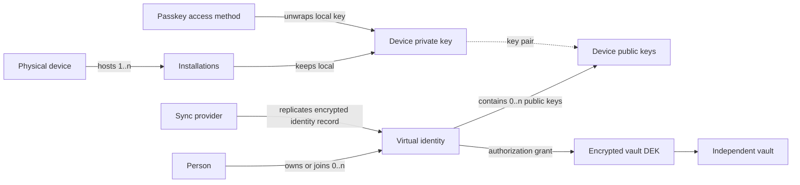

# Identity Accounts, Device Keys, and Vault Authorization

**Status:** Architecture decision; identity-control storage and migration are
not yet implemented.

Nook distinguishes a person, their virtual identities, physical devices,
cryptographic device keys, passkeys, sync providers, and vaults. None of these
names are interchangeable.

## Normative vocabulary

| Term | Meaning |
|---|---|
| **Person / user** | The human operator. One person may own or participate in multiple Nook identities. |
| **Identity** | A virtual account and durable authorization subject, analogous to an account or user profile. It may have zero or more keys. |
| **Physical device** | A hardware object such as a phone, laptop, or workstation. It is inventory, not a key and not a browser profile. |
| **Installation** | A Nook application, extension, or browser-origin storage context on a physical device. One physical device may have several installations. |
| **Device key** | A Nook-generated asymmetric key pair for one identity in one installation. Its private key stays in that installation; its public key is published in the identity record. |
| **Passkey** | A WebAuthn credential registered as an identity access method. It may be synced by a credential provider or bound to one authenticator. It is not a device key. |
| **Sync-provider mount** | A replication connection used to exchange an identity control log or vault event log. It is transport, not identity authority. |
| **Vault** | An independently encrypted event log and projection addressed by `store_id`. |

“Device” and “device key” MUST remain distinct in domain names and UI copy.
A device label or observed platform describes inventory; possession of the
corresponding private device key proves cryptographic authority.

## Domain map

The identity record relates public keys to one virtual account. It does not
copy device private keys between devices. Vault grants are downstream from the
identity and do not define the identity.

## Identity domain

An identity is a virtual account. A person may keep separate identities for
personal, work, family, project, pseudonymous, or recovery contexts. An
identity may be personal or collective, but “collective” changes membership
policy, not the meaning of identity.

An identity may have zero active device keys only while a separately enrolled
recovery authority remains able to authorize onboarding. A brand-new zero-key
setup is an unpersisted local draft, not a replicable identity.

The creation transaction atomically generates, before the identity record may be
persisted:

- the first installation's X25519 encryption key;
- Ed25519 signing key;
- initial policy epoch key; and
- recipient envelope.

No persisted control log is allowed to have neither an active device recipient
nor a recovery recipient.

The encrypted identity record/control log owns:

- a stable identity id and user-facing label;
- personal or collective membership and authority policy;
- registered device-key ids, X25519 encryption public keys, Ed25519 signing
  public keys, user-provided device labels, onboarding evidence, key status,
  and revocation history;
- registered passkey credential records and their association with local
  device-key protection;
- recovery relationships and identity-control events;
- zero or more sync-provider mounts for exchanging the encrypted record; and
- references to grants from independent vaults.

The control log uses a random 32-byte content-encryption key for each identity
policy epoch. Identity events are encrypted with domain-separated keys derived
from that epoch key. The epoch key is carried only in recipient envelopes
encrypted to the concrete X25519 public keys of active devices whose identity
role permits control-log access. Provider credentials and provider mounts are
never recipients.

Every control event is signed by its author's installation-specific Ed25519
signing key over the identity id, policy epoch, causal parents, and ciphertext.
That signing key is generated and enrolled beside, but is cryptographically
distinct from, the installation's X25519 encryption key. The policy binds both
public keys to the same installation, member, role, and status. Both private
keys use the same local protection boundary. Rotation atomically enrolls a new
pair. Revocation invalidates both public keys.

The current identity policy defines:

- which author roles may issue ordinary events; and
- which approval signatures or quorum are required for onboarding, role changes,
  recovery, and revocation.

A collective identity therefore uses multiple verifiable Ed25519 device
signatures to satisfy its threshold. It does not use an undocumented shared
signing secret.

A new installation bootstraps only through an invitation/onboarding ceremony
approved under the current policy. That ceremony adds the new public key and an
epoch-key envelope for it in one authorized transition. Downloading the
provider replica alone yields ciphertext and cannot establish membership.

Revocation:

- advances the policy epoch;
- creates a fresh control-log key; and
- publishes envelopes only for the remaining authorized device keys.

As with vault rotation, this provides forward revocation. Historical ciphertext
must be compacted or re-encrypted if the product promises removal of past access.

Only public key material, signed encrypted events, and recipient envelopes
replicate. Private X25519 and Ed25519 device keys and plaintext control-log
epoch keys remain local to an authorized installation.

## Physical devices and device keys

A physical device is hardware inventory; an installation is the local storage
context; a device key is cryptographic authority. One physical device may host
several installations, and each installation may hold different device keys
for different identities. An identity may also have multiple device keys
associated with one physical device during rotation or migration.

Target device-key lifecycle:

1. An installation generates a fresh random device key pair for a selected
   identity.
2. The private key is stored locally, encrypted by a local key-encryption key.
3. A passkey PRF result, PIN/passphrase, or supported hardware protector
   unwraps that local key-encryption key.
4. Onboarding publishes the device public key and relationship evidence into
   the identity control log through an identity sync-provider mount.
5. Revocation removes authority from that public key without deleting the
   physical-device inventory record or the identity.

The same laptop may therefore appear in several identities with distinct Nook
device keys. UI may show browser/application evidence inside the physical
device row, but it must not claim the browser profile is the physical hardware.
Losing one identity relationship does not redefine the laptop or the other
identities.

## Passkey locality and synced passkeys

WebAuthn defines two relevant credential classes:

- a **single-device credential** reports backup eligibility `BE=0`; and
- a **multi-device credential** reports `BE=1` and may report current backup
  state `BS=1`.

The authenticator determines backup eligibility when the credential is
created. A relying party cannot make an ordinary browser/platform passkey
local-only through `authenticatorAttachment`, `residentKey`, or discoverable
credential options.

Nook may observe `BE`/`BS` after a ceremony. It may offer an explicit policy
that rejects synced credentials. It cannot promise that the browser will create
a device-bound passkey.

Hardware security keys and authenticators that report `BE=0` are the reliable
user choice for a device-bound credential.

A synced passkey has provider-level availability, not one truthful physical
device location. Nook MUST NOT display it as “stored on this laptop.” It may
display:

- user-provided provider label;
- observed authenticator attachment, transports, backup eligibility, and
  backup state;
- whether the passkey was usable in the current ceremony; and
- which local device keys the identity record says it can protect.

Provider identity remains unknown unless the user labels it. WebAuthn cannot
enumerate a password manager's credential inventory.

The architecture does not need local-only passkeys to preserve device
boundaries. Every installation generates a different local device key. A synced
passkey only unlocks that installation's wrapped key. Synchronizing the passkey
does not synchronize the Nook device private key.

Current `standard` protection deterministically derives the age/device identity
from passkey PRF output. A synced passkey may reproduce that identity on another
installation. This mode is an existing compatibility/recovery boundary. It MUST
NOT define the target physical-device-key abstraction.

The target architecture uses a fresh random locally wrapped device key for every
installation. That matches the current high-security/local-wrapped shape. Any
migration must be explicit, versioned, rollback-aware, and behavior-tested.

Normative external references:

- [WebAuthn Level 3: credential backup state](https://www.w3.org/TR/webauthn-3/#sctn-credential-backup)
- [FIDO Alliance: synced and device-bound passkeys](https://fidoalliance.org/passkeys/)

## Identity sync providers

An identity has zero or more provider mounts. Providers exchange the encrypted
identity control log containing public device keys and relationship events.
They are how independent devices discover the same virtual identity record;
they are not members of the identity and do not grant authority by themselves.

Provider credentials remain local to an installation and are sealed with its
local device key. For shared provider targets, exchange only credential-free
target identifiers or provider-native sharing grants; each installation uses
its own provider credential.

Different identities owned by one person may use different providers. One
identity may also use multiple providers or stay local-only. The identity id
and key record remain stable when provider mounts change.

## Vault domain and authorization

A vault owns its stable `store_id`, independent DEK/key epochs, encrypted
secret records, signed event log, projection, conflicts, and vault-specific
grant policy. Passwords and other secret items remain vault content.

Identity and vault meet through an explicit, vault-owned authorization grant.
The grant contains:

- the vault id and key epoch;
- identity id and policy epoch;
- role/capability; and
- one recipient envelope for each active device public key that the vault has
  authorized for that identity.

Each envelope encrypts the vault epoch DEK to a concrete installation-specific
X25519 device public key. The identity policy decides which device keys are
eligible for a grant. An abstract “identity key,” collective label, or
sync-provider mount is never the cryptographic recipient.

A grant mutation is a signed vault event authorized by the vault's current
owner/member policy. The identity control log may reference that event. It
cannot mint vault access.

Adding a device to an identity does not automatically open existing vaults. An
authorized vault actor must refresh each applicable grant and add an envelope
for the new device key. Personal and collective identity policies may require
different approval or quorum evidence before that refresh. Decryption still
terminates at named device public keys.

Revoking one device:

- removes its recipient envelope; and
- advances the vault key epoch before subsequent writes.

Revoking the entire identity:

- removes every recipient envelope for that identity; and
- also advances the vault key epoch.

Remaining recipients receive new envelopes. Rotation prevents revoked keys from
decrypting future records. It cannot retract plaintext or old ciphertext already
obtained. A vault that promises historical revocation must compact or re-encrypt
retained records into the new epoch.

One identity may receive many vault grants. One vault may authorize many
identities. Removing a grant does not delete or redefine the virtual identity.

Current Nook storage encodes much of this relationship as per-device `auth:`
envelopes and vault member rows. That is the existing wire-compatibility
boundary, not the target ownership model.

## Onboarding

Onboarding adds a new public device key to an existing virtual identity:

1. select or create the intended identity;
2. generate and locally protect a new installation-specific device key;
3. verify approval under the identity's membership/recovery policy;
4. publish the new public key through an identity provider mount; and
5. independently discover or request applicable vault grants.

Creating a passkey, connecting a provider, and downloading a vault may appear
in one product flow, but none of those transport or protection steps alone
proves identity membership or vault authorization.

## Browser extension boundary

The Simple Vault companion has two user-facing responsibilities:

1. act through one selected Nook virtual identity when relating to a website;
   and
2. integrate vault-owned passwords and website passkeys after an applicable
   vault grant is active.

The extension is another installation that may hold identity-specific device
keys. It is not itself an identity and does not become another vault product.

## Invariants

- A person may have multiple identities.
- An identity may have zero or more device keys and passkey records.
- A physical device, installation, and device key are never the same domain
  object.
- A passkey and Nook device key are never the same domain object.
- A synced passkey has provider availability, not one asserted device location.
- Device private keys never enter identity sync records.
- No provider credential grants identity membership or vault decryption.
- No vault DEK becomes a general identity key.
- Portable identity, key, grant, vault, and replication policy belongs in
  Rust; Svelte renders typed state and coordinates browser ceremonies.

## Related records

- [devices-and-access.md](../product-specs/devices-and-access.md)
- [auth-providers.md](auth-providers.md)
- [vault-event-log.md](vault-event-log.md)
- [vault-session-and-lock.md](vault-session-and-lock.md)
- [browser-extension.md](../product-specs/browser-extension.md)
