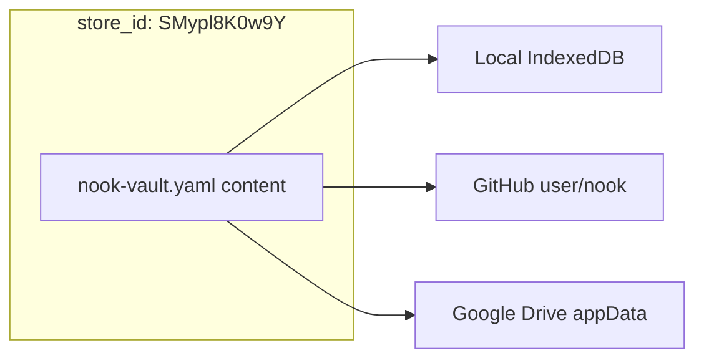

# Secret Store Identity

How Nook names and distinguishes **logical secret stores** (vault database files) from **storage providers** (where those files live).

**Related:** [auth-providers.md](auth-providers.md) §5, [password-manager.md](../product-specs/password-manager.md) §3.

---

## 1. Problem

A user may connect several **storage providers** (local IndexedDB, GitHub repo A, GitHub repo B, Google Drive, …). Each provider holds an encrypted vault file (today usually `nook-vault.yaml`).

Future work replicates **one logical database** across multiple providers. To do that safely we must answer:

- Is the file on provider A the **same** secret store as on provider B?
- Or are they **independent** vaults that happen to use the same app?

Provider credentials and file paths alone are not enough: the same user might point two GitHub repos at different vaults, or mirror one vault to local + cloud.

---

## 2. `store_id` — logical secret store name

Every vault YAML carries a top-level **`store_id`**: a compact random id, same alphabet and length as secret ids (`generate_id()` — 11 chars, base64url, e.g. `SMypl8K0w9Y`).

```yaml
store_id: SMypl8K0w9Y
unlock:
  type: keys
secrets:
  - id: github.com
    ...
```

| Layer | Identifier | Scope | Example |
|-------|------------|-------|---------|
| **Secret store** | `store_id` | One logical encrypted database | `SMypl8K0w9Y` |
| **Storage provider** | `StorageProvider.id` | Saved connection in `nook_auth` | UUID in IndexedDB |
| **Vault file path** | Provider config | Physical blob location | `nook-vault.yaml` in `user/nook` |

**Rules**

1. **Genesis:** assigned on first persist of a new vault (Rust `generate_id()`).
2. **Replication (future):** every replica of the same store must carry the **same** `store_id`; sync compares `store_id` before merging content.
3. **Legacy vaults:** files written before `store_id` exist omit the field; the next save backfills a new id (one-time migration per file).
4. **Provider binding:** `StorageProvider.storeId` in `nook_auth` mirrors the vault's `store_id` after connect so the UI can group replicas and warn on mismatches.

**Not the same as**

- `StorageProvider.id` — browser-local row id for PAT/repo settings.
- Secret `id` — item label key inside the store (`github.com`, `SMypl8K0w9Y`, …).
- `device_id` — 16-hex UI fingerprint derived from a device public key.

---

## 3. Multi-provider replication (planned)



1. User enrolls multiple providers with the **same** `store_id` (manual today; guided UX later).
2. Writes fan out to all enrolled providers; reads reconcile by content hash / version (see [auth-providers.md](auth-providers.md) §5).
3. Connecting to a provider whose file has a **different** `store_id` than expected is a hard error — prevents accidental overwrite of unrelated vaults.

Physical filenames may stay `nook-vault.yaml` per backend; **`store_id` inside the file** is the source of truth for logical identity.

---

## 4. `pk_id` vs short ids

Auth rows in YAML use **`pk_id`**: full SHA-256 of the device X25519 public key (64 hex chars).

```yaml
auth:
  - pk_id: 1f9ed892ca49f063bca6cb0d023abd9057aeef6a32e275bc399e5f1412609439
    secrets_key: |
      -----BEGIN AGE ENCRYPTED FILE-----
      ...
```

| Id | Length | Derivation | Role |
|----|--------|------------|------|
| `store_id` | 11 | Random (`generate_id`) | Name a logical secret store |
| Secret `id` | varies / often 11 | Random or user label | Name an item inside the store |
| `device_id` | 16 hex | Truncated hash of public key | UI, joins, IndexedDB |
| `pk_id` | 64 hex | Full SHA-256(public key) | Auth row key, member roster |

**Should `pk_id` be shortened?** Not without a migration:

- `pk_id` is **deterministic** from the public key — no lookup table, no collision handling.
- Shortening to secret-style ids would require storing `{ short_id → public_key }` in the vault and rewriting every `auth:` / `members:` reference.
- **`device_id` already covers display** (16 hex); keep `pk_id` as the stable cryptographic primary key until a deliberate roster refactor is scheduled.

If we ever add short auth ids, treat it as a breaking on-disk migration — not a cosmetic change.

---

## 5. Implementation status

| Piece | Status |
|-------|--------|
| `store_id` in vault YAML | Implemented — read/write in `nook-core`, session in `NookVaultManager` |
| `StorageProvider.storeId` | Implemented — set on `ensureProviderSaved()` |
| Replication / mismatch guards | Planned |
| Per-store filename (`nook-{store_id}.yaml`) | Optional future; not required for identity |
