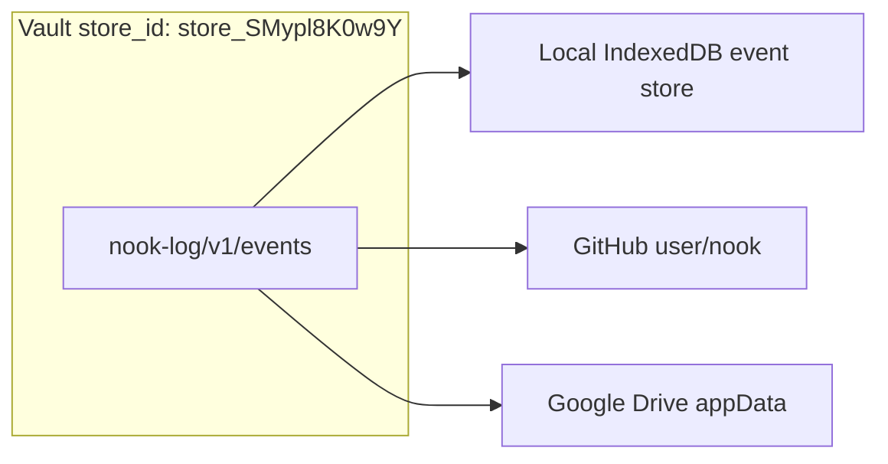

# Secret Store Identity

How Nook names and distinguishes **logical secret stores** (vault database files) from **storage providers** (where those files live).

**Related:** [auth-providers.md](auth-providers.md) §5, [password-manager.md](../product-specs/password-manager.md) §3.

---

## 1. Problem

A user may connect several **storage providers** (local IndexedDB, GitHub repo A, GitHub repo B, Google Drive, …). Each provider holds immutable encrypted event files under `nook-log/v1/events/`.

Future work replicates **one logical database** across multiple providers. To do that safely we must answer:

- Is the file on provider A the **same** secret store as on provider B?
- Or are they **independent** vaults that happen to use the same app?

Provider credentials and file paths alone are not enough: the same user might point two GitHub repos at different vaults, or mirror one vault to local + cloud.

---

## 2. Prefixed on-disk ids

Nook uses **typed string prefixes** so ids are self-describing in YAML and logs:

| Prefix | YAML field | Meaning | Example |
|--------|------------|---------|---------|
| `store_` | `store_id` | Logical secret store (whole vault database) | `store_SMypl8K0w9Y` |
| `secret_` | `secrets[].id` | User secret item (generated ids) | `secret_k9Qx2mNp4Rt` |
| `key_` | `auth[].pk_id`, `members[].pk_id` | Device auth key (SHA-256 of X25519 public key) | `key_1f9ed892…2609439` |

Random suffix tokens use `generate_id()` — 11 chars, base64url. Auth keys append the full 64-hex digest after `key_`.

```yaml
store_id: store_SMypl8K0w9Y
secrets:
  - id: secret_k9Qx2mNp4Rt
    type: api-key
    data: |
      -----BEGIN AGE ENCRYPTED FILE-----
      ...
auth:
  - pk_id: key_1f9ed892ca49f063bca6cb0d023abd9057aeef6a32e275bc399e5f1412609439
    secrets_key: |
      -----BEGIN AGE ENCRYPTED FILE-----
      ...
```

**Legacy (still loads):** bare 11-char `store_id`, human secret labels (`github.com`), bare 64-hex `pk_id`. Next save normalizes to prefixed form where applicable.

| Layer | Identifier | Scope | Example |
|-------|------------|-------|---------|
| **Secret store** | `store_id` | One logical encrypted database | `store_SMypl8K0w9Y` |
| **Storage provider** | `StorageProvider.id` | Saved connection in `nook_auth` | compact id (no vault prefix) |
| **Event log path** | Provider config | Physical event location | `nook-log/v1/events/{digest}.yaml` in `user/nook` |

**Rules**

1. **Genesis:** `store_{token}` assigned on first persist (`generate_store_id()`).
2. **New secrets:** UI/WASM use `secret_{token}` via `generate_secret_id()`; e2e may still use human labels.
3. **Auth rows:** `pk_id` is always `key_{sha256_hex}` on write.
4. **Replication (future):** same `store_id` on every provider replica; mismatch → hard error.
5. **Provider binding:** `StorageProvider.storeId` mirrors vault `store_id` after connect.

---

## 3. Multi-provider replication (one vault)

> **Architecture:** [unified-vault.md](unified-vault.md) — local cache + sync replicas; [vault-session-and-lock.md](vault-session-and-lock.md) — vault vs provider.



Many **sync providers**, one **`store_id`** per active vault. Provider files are immutable event records; **`store_id` + causal event heads** drive reconciliation.

**Multiple vaults:** a user may have unrelated vaults (different `store_id`) on different providers or, in future, multiple caches in one browser. Replication never crosses `store_id` boundaries.

---

## 4. `key_{digest}` vs shortening `pk_id`

The **64-hex digest is kept** — only the **`key_` prefix** is added for type clarity. We do **not** shorten the digest to 11 chars:

- Digest is **deterministic** from the public key.
- Shortening would require `{ short_id → public_key }` lookup and rewriting all `auth:` / `members:` rows.
- **`device_id`** (16 hex) remains the short UI fingerprint.

---

## 5. Implementation status

| Piece | Status |
|-------|--------|
| Prefixed `store_id` / `secret_` / `key_` in vault YAML | Implemented |
| `StorageProvider.storeId` | Implemented |
| Legacy unprefixed read + normalize on write | Implemented |
| Replication / mismatch guards | Planned (sync logic in `vault_sync.rs`) |
| Event-log causal heads | Implemented |

Implementation: `nook-core/src/vault_ids.rs`.
