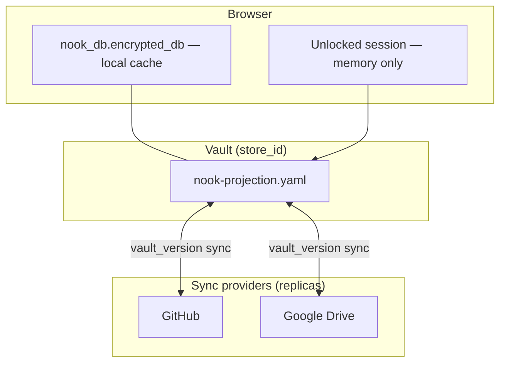
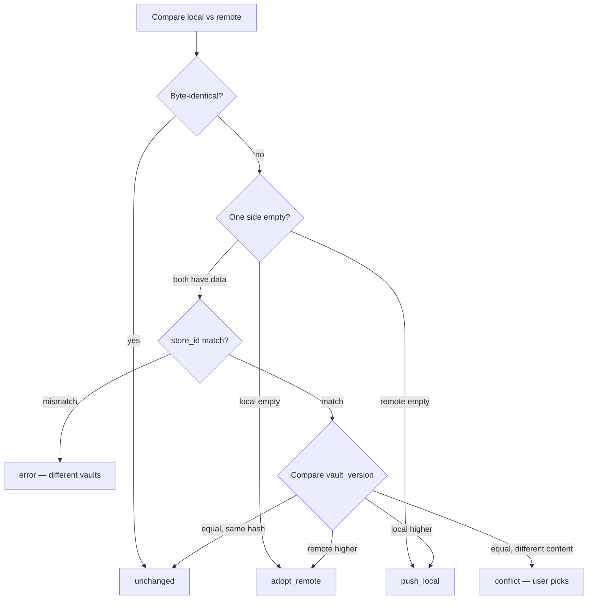
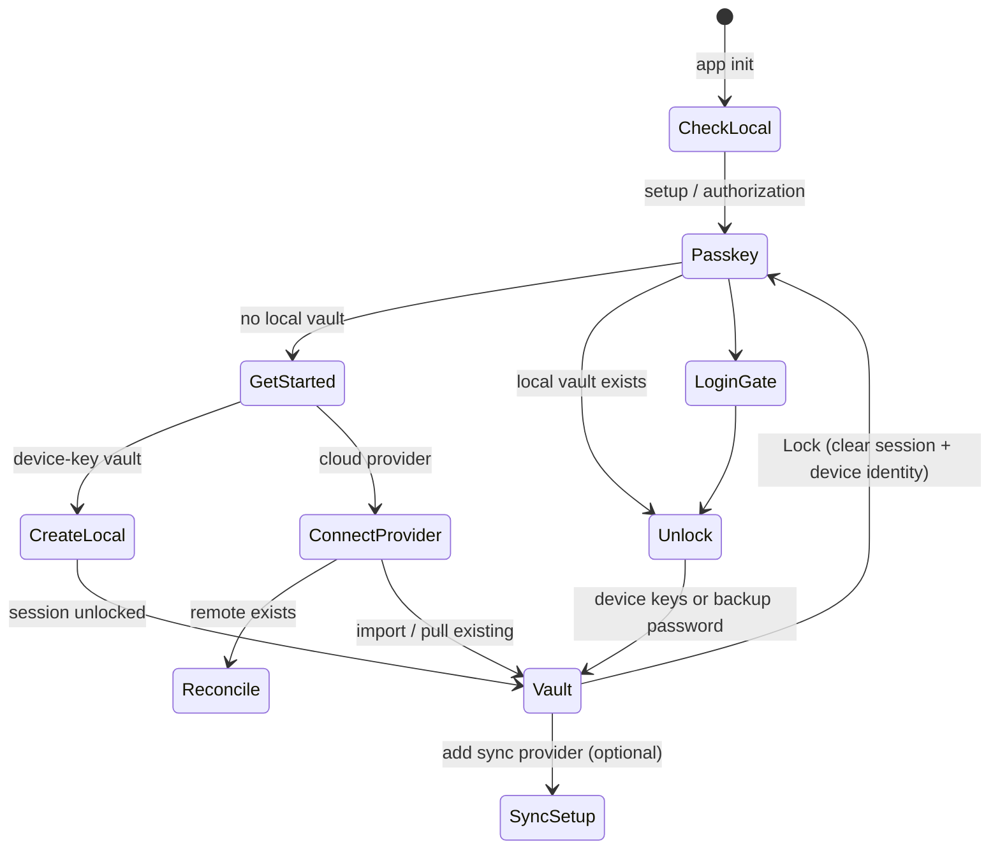

# Unified Vault Architecture

**Superseded for provider sync:** event-log vaults use immutable YAML events
under `nook-log/v1/events/`; see [vault-event-log.md](vault-event-log.md).
The scalar `vault_version` model below is retained as historical context for
local projection and migration behavior.

This document defines Nook's architecture: **vaults** (logical encrypted databases), **sync providers** (replica targets), local-first storage, and version-based reconciliation.

**Related:** [auth-providers.md](auth-providers.md), [vault-session-and-lock.md](vault-session-and-lock.md), [secret-store-identity.md](secret-store-identity.md), [ARCHITECTURE.md](../ARCHITECTURE.md) §4, [exec-plans/unified-vault-ui-rollout.md](../exec-plans/unified-vault-ui-rollout.md).

---

## 1. Problem with the old model

Previously each saved **storage provider** could point at a **separate vault file**. Login treated provider choice as vault selection — duplicate databases, confusion when switching GitHub repos, and provider-scoped sync.

---

## 2. Target model



| Concept | Old | New |
|---------|-----|-----|
| **Vault** | Implicit per provider | Explicit logical DB (`store_id`); user may have **many vaults** over time ([vault-session-and-lock.md](vault-session-and-lock.md)) |
| **Primary copy** | Whichever provider is active | Local IndexedDB (`nook_db.encrypted_db`) for the **active** vault |
| **Unlock** | Provider-first wizard | Login gate: unlock local cache or connect provider to fetch a vault |
| **Sync providers** | Vault selectors | **Replica targets** for the current vault — many providers, one `store_id` |
| **Lock** | N/A | Clear decrypted session; encrypted vault + providers remain |
| **Conflict handling** | Last poll wins | Explicit user choice on version tie |

**Today:** one active vault per browser profile. **Target:** vault picker after lock for users with multiple `store_id`s on the same device.

---

## 3. Local-first storage

### IndexedDB layout (`nook_db`)

| Key | Value | Notes |
|-----|-------|-------|
| `encrypted_db` | UTF-8 vault YAML | **Authoritative local copy** — always present after first setup |
| `device_identity_wrapped` | Versioned AES-256-GCM ciphertext + WebAuthn PRF or PIN metadata | Never synced; legacy `device_identity_secret` is deleted after migration |
| `device_id` | Short fingerprint | UI only |

The local vault is created on first setup and persists regardless of which sync providers are connected.

### IndexedDB layout (`nook_auth`) — sync providers only

| Key | Value |
|-----|-------|
| `sync_providers` | `{ providers: SyncProvider[], enabled: string[] }` |

```typescript
interface SyncProvider {
  id: string
  type: 'github' | 'oauth-file'
  label: string
  githubPat?: string
  githubRepo?: string
  oauthFile?: OAuthFileConfig
  /** Last known remote vault_version after successful sync */
  lastSyncedVersion?: number
  createdAt: string
}
```

Provider credentials are **sync convenience**, not vault encryption. The master password and vault keys stay in the vault file.

---

## 4. Vault versioning

Every vault YAML carries a monotonic counter:

```yaml
vault_version: 42
store_id: store_SMypl8K0w9Y
secrets:
  - id: secret_k9Qx2mNp4Rt
    ...
```

| Rule | Behaviour |
|------|-----------|
| **Genesis** | `vault_version: 1` on first persist |
| **Every save** | Increment before write |
| **Legacy vaults** | Missing field → treat as `0`; next save normalizes to `1+` |

Implementation: `nook-app/nook-core/src/vault_format.rs` (`read_vault_version`), `nook-app/nook-core/src/vault_sync.rs`.

---

## 5. Sync reconciliation

When comparing local vs remote vault blobs (`compare_vault_sync`):



| Action | Meaning | Automatic? |
|--------|---------|------------|
| `unchanged` | Nothing to do | Yes |
| `adopt_remote` | Overwrite local with remote | Yes |
| `push_local` | Overwrite remote with local | Yes |
| `conflict` | Same version, diverged content | **No** — show resolution UI |

**Conflict UI** offers exactly two choices:

1. **Keep local** — push local copy to remote (bumps version).
2. **Keep remote** — replace local with remote copy.

No automatic merge of secret records at this stage.

WASM export: `compareVaultSync(local, remote)` for compare-only; `reconcileVaultBlobs(local, remote, revision)` returns post-reconcile blobs and action label.

---

## 6. Connect / unlock / lock flow



1. **Authorize the passkey** on init, then load the local cache. The vault may
   auto-unlock if device keys suffice and no sync friction remains.
2. **First visit:** login chooser — create a Simple vault locally, start a
   provider-free Nexus genesis ceremony, **or** connect a sync provider to
   import an existing vault. See [nexus-genesis.md](nexus-genesis.md).
3. **Lock** (`VaultState.lockVault`) clears in-memory secrets and the device
   identity; user returns through the passkey gate ([vault-session-and-lock.md](vault-session-and-lock.md)).
4. **After unlock**, sync providers in Settings replicate the **current** vault (`store_id`).

Device-key multi-device flows (`auth:`, `joins:`, `members:`) continue alongside optional backup passwords.

---

## 7. Migration from current model

| Current state | Migration |
|---------------|-----------|
| User with one local provider | No change — already local-first |
| User with GitHub-only provider | On upgrade: copy remote vault into `encrypted_db`, switch to local-first reads |
| User with multiple providers (different vaults) | Prompt: pick one vault to keep as canonical; others become disconnected |
| Missing `vault_version` | Backfill on next save |

Migration runs once on `VaultState.init()` when detecting legacy provider-as-vault model.

---

## 8. Security notes

- Master password never leaves the browser; used only to unwrap vault keys in WASM.
- Sync provider tokens (GitHub PAT, OAuth) remain in `nook_auth` — compromise exposes encrypted blob access, not plaintext.
- `store_id` mismatch between local and remote is a hard error — prevents accidental cross-vault overwrite.
- Conflict resolution is explicit — Nook never silently merges diverged vaults.

---

## 9. Fan-out sync on mutation

After any local vault save (secret CRUD, join approve/deny, device roster change — phased rollout), the web layer pushes to **all connected sync providers**:

1. Read authoritative blob from `nook_db.encrypted_db` (`readLocalVaultYaml`).
2. For each non-local provider in `nook_auth`: `reconcileVaultBlobs` → push/adopt/conflict.
3. Background fan-out is **quiet** (no per-provider toast spam); status bar shows `Syncing to {provider}…`.

Background **pull** (sync timer, `PendingJoinsBanner` refresh) reconciles every sync provider into the local vault, then `hydrateMultiDeviceState()` reads pending `joins:` from the unlocked session.

Manual **Sync all** in the status bar runs the same reconcile loop with user-visible toasts.

### In-memory sync tests

`MemoryVaultStore` in `nook-app/nook-core/src/vault_sync_store.rs` is a HashMap-friendly stand-in for local IndexedDB and remote providers. `reconcile_vault_stores` and `fan_out_sync` apply the same actions as the web layer after I/O. Integration coverage lives in `nook-app/nook-core/tests/vault_sync_workflow.rs` (no browser required).

---

## 10. Implementation status

| Piece | Status |
|-------|--------|
| `vault_version` in YAML read/write | Done (#61) |
| `compare_vault_sync` in `nook-core` | Done (#61) |
| In-memory sync replication tests (`vault_sync_store`) | Done |
| `compareVaultSync` WASM export | Done (#61) |
| `reconcileVaultBlobs` WASM export (apply in core) | Done |
| Version increment on save | Done (#61) |
| Local-first login gate | Done (#71, Phase 1) |
| Sync providers in Settings | Done (#72, Phase 2) |
| Session-independent sync I/O (`sync_io.rs`) | Done (#72) |
| Conflict resolution UI | Done (#73, Phase 3) |
| Fan-out sync after secret CRUD | Done (#74, Phase 4) |
| Local-first status bar | Done (#74, Phase 4) |
| Onboard / enrollment QR (local-first) | Done (#75, Phase 5) |
| Help page rewrite | Done (#76, Phase 6) |
| Join sync propagation | Done (#77, Phase 7) |
| Legacy multi-vault migration | Done (#78, Phase 8) |

UI rollout details: [exec-plans/unified-vault-ui-rollout.md](../exec-plans/unified-vault-ui-rollout.md).
