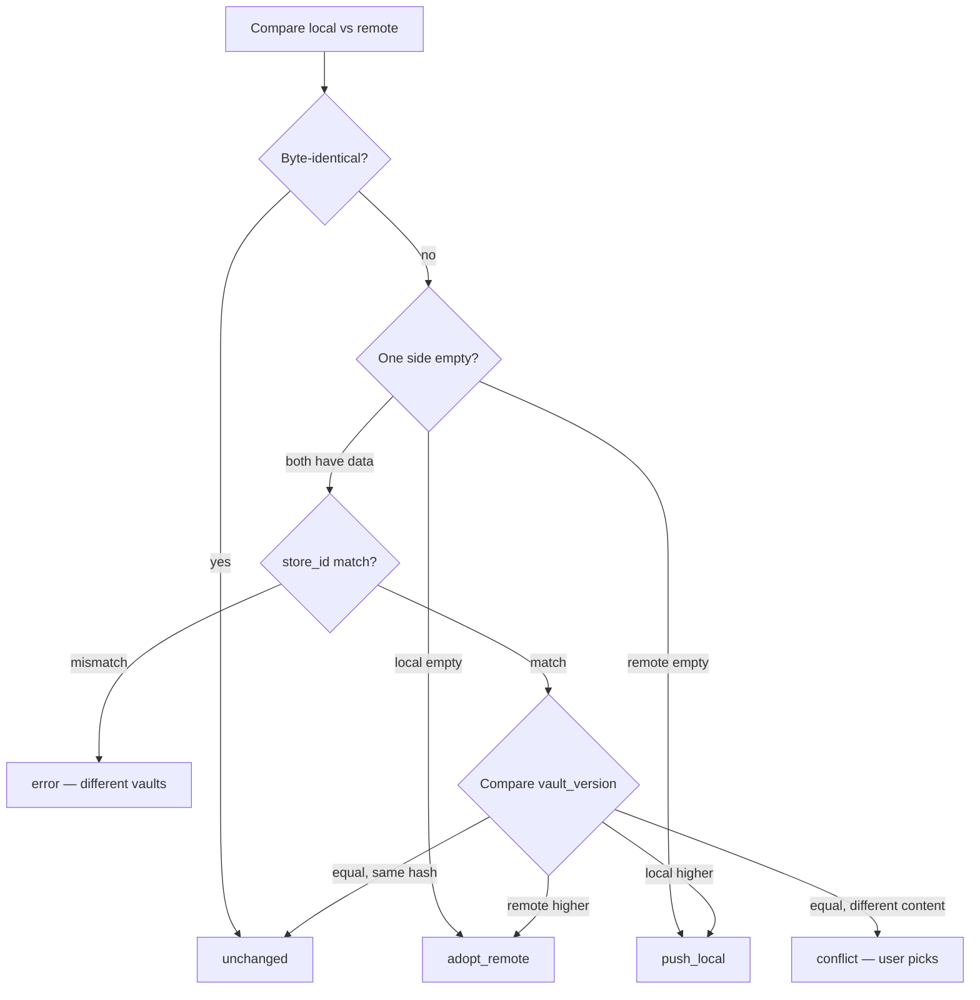
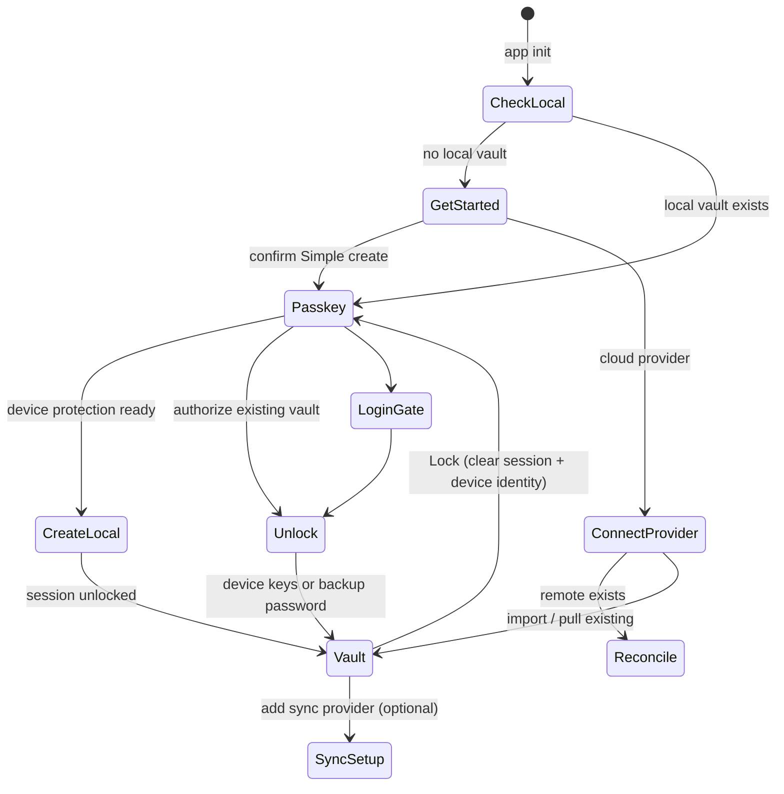

# Unified Vault Architecture

## Relationships

- [Nook System Architecture Specification](../ARCHITECTURE.md)
  - Defines system-wide component ownership and dependency boundaries.
  - Read before changing a durable cross-component interface.
- [Unified Vault — UI Rollout Plan](../exec-plans/unified-vault-ui-rollout.md)
  - Records the implementation phases and historical delivery status.
  - Read when tracing how this architecture reached the product.
- [Auth Providers, Sync, and Login UX](auth-providers.md)
  - Defines provider storage, login, and onboarding behavior.
  - Read when changing authentication or provider connection flows.
- [Identity, App Keys, Passkeys, and Vault DEKs](identity-vault-architecture.md)
  - Separates identity, app-key, and vault-encryption responsibilities.
  - Read when the design touches keys, authentication, or vault access.
- [Secret Store Identity](secret-store-identity.md)
  - Defines stable provider and secret-store identity across sessions.
  - Read when the design handles provider labels or store identifiers.
- [Sentinel Genesis and Reverse Onboarding](sentinel-genesis.md)
  - Defines reverse onboarding and Sentinel recovery policy.
  - Read when the design changes recovery or device bootstrap.
- [Vault Event Log](vault-event-log.md)
  - Defines durable vault events, ordering, and concurrency behavior.
  - Read when the design changes persistence or synchronization.
- [Vault Session, Lock, and Multi-Vault Model](vault-session-and-lock.md)
  - Defines unlock sessions, lock semantics, and multi-vault state.
  - Read when the design affects in-memory vault access.

## Document map

- [Overview](#overview)
  - Superseded for provider sync: event-log vaults use immutable YAML events under nook-log/v1/events/.
  - Read before changing or relying on Overview.
- [1. Problem with the old model](#1-problem-with-the-old-model)
  - Previously each saved storage provider could point at a separate vault file.
  - Read before changing or relying on Problem with the old model.
- [2. Target model](#2-target-model)
  - Summarizes the structured entries, ownership, and status for Target model.
  - Read before changing or relying on Target model.
- [3. Local-first storage](#3-local-first-storage)
  - Defines the concrete responsibilities and constraints for 3. Local-first storage.
  - Read before changing or relying on Local-first storage.
  - [IndexedDB layout (nook_db)](#indexeddb-layout-nook_db)
    - Summarizes the structured entries, ownership, and status for IndexedDB layout (nookdb).
    - Read before changing or relying on IndexedDB layout (nookdb).
  - [IndexedDB layout (nook_auth) — sync providers only](#indexeddb-layout-nook_auth--sync-providers-only)
    - Canonical layout and field list: auth-providers.md §2.
    - Read before changing the IndexedDB layout (nookauth) — sync providers only flow or state transitions.
- [4. Vault versioning](#4-vault-versioning)
  - Every vault YAML carries a monotonic.
  - Read before changing or relying on Vault versioning.
- [5. Sync reconciliation](#5-sync-reconciliation)
  - When comparing local vs remote vault blobs.
  - Read before changing the Sync reconciliation flow or state transitions.
- [6. Connect / unlock / lock flow](#6-connect--unlock--lock-flow)
  - Empty device: show Landing → Sentinel create (path first; naming inside the chosen setup) before passkey.
  - Read before changing the Connect / unlock / lock flow flow or state transitions.
- [7. Security notes](#7-security-notes)
  - Master password never leaves the browser; used only to unwrap vault keys in WASM. Sync provider tokens (GitHub PAT, OAuth) remain.
  - Read before changing or relying on Security notes.
- [9. Fan-out sync on mutation](#9-fan-out-sync-on-mutation)
  - After any local vault save (secret CRUD, join approve/deny, device roster change — phased rollout), the web layer pushes to all.
  - Read before changing the Fan-out sync on mutation flow or state transitions.
  - [In-memory sync tests](#in-memory-sync-tests)
    - MemoryVaultStore in nook-app/nook-platform/nook-core/src/sync/vault_sync_store.rs is a HashMap-friendly stand-in for local.
    - Use before declaring In-memory sync tests complete.
- [10. Implementation status](#10-implementation-status)
  - Summarizes the structured entries, ownership, and status for Implementation status.
  - Read when assessing which parts remain active or historical.

## Overview

- **Provider-sync status:** Superseded. Event-log vaults use immutable YAML
  events under `nook-log/v1/events/`. See
  [vault-event-log.md](vault-event-log.md).
- **Historical scope:** Retain the scalar `vault_version` model as context for
  local projection and migration behavior.
  - This document defines the historical local-first **vault** and provider
    replica model.
- **Current ownership:** Identity, independent vault DEK, authorization grant,
  onboarding, and provider-mount ownership is defined in
  [identity-vault-architecture.md](identity-vault-architecture.md).

**Related:** [auth-providers.md](auth-providers.md), [vault-session-and-lock.md](vault-session-and-lock.md), [secret-store-identity.md](secret-store-identity.md), [ARCHITECTURE.md](../ARCHITECTURE.md) §4, [exec-plans/unified-vault-ui-rollout.md](../exec-plans/unified-vault-ui-rollout.md).

---

## 1. Problem with the old model

Previously each saved **storage provider** could point at a **separate vault file**. Login treated provider choice as vault selection — duplicate databases, confusion when switching GitHub repos, and provider-scoped sync.

---

## 2. Target model

```mermaid
flowchart TB
  subgraph vault["Vault (store_id)"]
    V[nook-projection.yaml]
  end
  subgraph local["Browser"]
    L[nook_db vault:{store_id} — local cache]
    S[Unlocked session — memory only]
  end
  subgraph sync["Replication providers (neutral transports)"]
    G[GitHub]
    D[Google Drive]
  end
  L --- V
  V <-->|"vault_version sync"| G
  V <-->|"vault_version sync"| D
  S --> V
```

| Concept | Old | New |
|---------|-----|-----|
| **Vault** | Implicit per provider | Explicit logical DB (`store_id`); user may have **many vaults** over time ([vault-session-and-lock.md](vault-session-and-lock.md)) |
| **Primary copy** | Immutable provider event log | Local IndexedDB (`vault:{store_id}`) projection cache for the active vault |
| **Unlock** | Provider-first wizard | Login gate: unlock local cache or connect provider to fetch a vault |
| **Sync providers** | Vault selectors | **Mounted replica targets** supplied to vault sync — many providers, one `store_id`; identity control logs may mount providers independently |
| **Lock** | N/A | Clear decrypted session; encrypted vault + providers remain |
| **Conflict handling** | Last poll wins | Explicit user choice on version tie |

**Today:** one active vault per browser profile. **Target:** vault picker after lock for users with multiple `store_id`s on the same device.

---

## 3. Local-first storage

### IndexedDB layout (`nook_db`)

| Key | Value | Notes |
|-----|-------|-------|
| `vault:{store_id}` | UTF-8 vault YAML | Derived local projection cache |
| `device_identity_wrapped` | Versioned AES-256-GCM ciphertext + WebAuthn PRF or PIN metadata | Never synced; legacy `device_identity_secret` is deleted after migration |
| `device_id` | Short fingerprint | UI only |

The local vault is created on first setup and persists regardless of which sync providers are connected.

### IndexedDB layout (`nook_auth`) — sync providers only

Canonical layout and field list: [auth-providers.md](auth-providers.md) §2.

| Piece | Value |
|-------|-------|
| Database / store / key | `nook_auth` / `auth` / `providers` |
| Value | `{ providers: StorageProvider[], activeVaultStoreId?: string }` |

Types are Rust/Tsify (`StorageProvider`, `OAuthFileConfig`, …), not a separate
hand-authored TypeScript interface. Provider credentials are **sync
convenience**, not vault encryption. The master password and vault keys stay in
the vault file.

---

## 4. Vault versioning

Every vault YAML carries a monotonic counter:

```yaml
vault_version: 42
store_id: store_SMypl8K0w9Y
secrets:
  - id: secret_k9Qx2mNp4Rt
    ...
```

| Rule | Behaviour |
|------|-----------|
| **Genesis** | `vault_version: 1` on first persist |
| **Every save** | Increment before write |

Implementation: `nook-app/nook-platform/nook-core/src/vault/vault_format.rs` (`read_vault_version`), `nook-app/nook-platform/nook-core/src/sync/vault_sync.rs`.

---

## 5. Sync reconciliation

When comparing local vs remote vault blobs (`compare_vault_sync`):


```mermaid
flowchart TD
  A[Compare local vs remote] --> B{Byte-identical?}
  B -->|yes| U[unchanged]
  B -->|no| C{One side empty?}
  C -->|local empty| R[adopt_remote]
  C -->|remote empty| P[push_local]
  C -->|both have data| D{store_id match?}
  D -->|mismatch| E[error — different vaults]
  D -->|match| F{Compare vault_version}
  F -->|remote higher| R
  F -->|local higher| P
  F -->|equal, different content| X[conflict — user picks]
  F -->|equal, same hash| U
```

| Action | Meaning | Automatic? |
|--------|---------|------------|
| `unchanged` | Nothing to do | Yes |
| `adopt_remote` | Overwrite local with remote | Yes |
| `push_local` | Overwrite remote with local | Yes |
| `conflict` | Same version, diverged content | **No** — show resolution UI |

**Conflict UI** offers exactly two choices:

1. **Keep local** — push local copy to remote (bumps version).
2. **Keep remote** — replace local with remote copy.

No automatic merge of secret records at this stage.

WASM export: `compare_vault_sync(local, remote)` for compare-only. Whole-blob
reconciliation is retained only as historical context; current replication
uses the event-log path.

---

## 6. Connect / unlock / lock flow


```mermaid
stateDiagram-v2
  [*] --> CheckLocal: app init
  CheckLocal --> GetStarted: no local vault
  CheckLocal --> Passkey: local vault exists
  GetStarted --> Passkey: confirm Simple create
  Passkey --> CreateLocal: device protection ready
  Passkey --> Unlock: authorize existing vault
  GetStarted --> ConnectProvider: cloud provider
  CreateLocal --> Vault: session unlocked
  ConnectProvider --> Reconcile: remote exists
  ConnectProvider --> Vault: import / pull existing
  Unlock --> Vault: device keys or backup password
  Vault --> Passkey: Lock (clear session + device identity)
  Passkey --> LoginGate
  LoginGate --> Unlock
  Vault --> SyncSetup: add sync provider (optional)
```

1. **Empty device:** show Landing → Sentinel create (path first; naming inside
   the chosen setup) **before**
   passkey. Passkey/device protection runs when the user confirms Simple create,
   or first when unlocking an existing local vault. Then load the local cache.
   **Exception:** opening `#enroll=` on an empty browser is join/onboarding for
   an existing vault — skip create landing, require device protection, then show
   Finish device onboarding (vault password).
2. **First visit / GetStarted:** after the public site selects Simple or
   Sentinel, the isolated app presents **Create a new vault** and **Open an
   existing vault** as sibling intents. Creation either creates a Simple vault
   locally (after deferred passkey) or starts Sentinel genesis without storage
   until the vault is atomically created. Opening connects a sync provider to
   import an existing vault of the app's fixed type. See
   [sentinel-genesis.md](sentinel-genesis.md).
3. **Lock** (`VaultState.lockVault`) clears in-memory secrets and the device
   identity; user returns through the passkey gate ([vault-session-and-lock.md](vault-session-and-lock.md)).
4. **After unlock**, sync providers in Settings replicate the **current** vault (`store_id`).

Device-key multi-device flows (`auth:`, `joins:`, `members:`) continue alongside optional backup passwords.

---

## 7. Security notes

- Master password never leaves the browser; used only to unwrap vault keys in WASM.
- Sync provider tokens (GitHub PAT, OAuth) remain in `nook_auth` — compromise exposes encrypted blob access, not plaintext.
- `store_id` mismatch between local and remote is a hard error — prevents accidental cross-vault overwrite.
- Conflict resolution is explicit — Nook never silently merges diverged vaults.

---

## 9. Fan-out sync on mutation

After any local vault save (secret CRUD, join approve/deny, device roster change — phased rollout), the web layer pushes to **all connected sync providers**:

1. Read the local projection cache from `vault:{store_id}` (`read_local_vault_yaml`).
2. For each non-local provider in `nook_auth`: fan out via the live event-log path
   (`fanOutSyncToProviders` in `nook-web-shared` → core/wasm sync). Whole-blob
   reconciliation is retained only as historical/local-projection context; see
   [vault-event-log.md](vault-event-log.md).
3. Background fan-out is **quiet** (no per-provider toast spam); status bar shows `Syncing to {provider}…`.

Background **pull** (sync timer, `PendingJoinsBanner` refresh) reconciles every sync provider into the local vault, then `hydrateMultiDeviceState()` reads pending `joins:` from the unlocked session.

Manual **Sync all** in the status bar runs the same sync loop with user-visible toasts.

### In-memory sync tests

`MemoryVaultStore` in `nook-app/nook-platform/nook-core/src/sync/vault_sync_store.rs` is a HashMap-friendly stand-in for local IndexedDB and remote providers. `reconcile_vault_stores` and `fan_out_sync` apply the same actions as the web layer after I/O. Integration coverage lives in `nook-app/nook-platform/nook-core/tests/vault_sync_workflow.rs` (no browser required).

---

## 10. Implementation status

| Piece | Status |
|-------|--------|
| `vault_version` in YAML read/write | Done (#61) |
| `compare_vault_sync` in `nook-core` | Done (#61) |
| In-memory sync replication tests (`vault_sync_store`) | Done |
| `compare_vault_sync` WASM export | Done (#61) |
| Historical whole-blob reconciliation (apply in core) | Superseded by event-log replication |
| Version increment on save | Done (#61) |
| Local-first login gate | Done (#71, Phase 1) |
| Sync providers in Settings | Done (#72, Phase 2) |
| Session-independent sync I/O (`sync_io.rs`) | Done (#72) |
| Conflict resolution UI | Done (#73, Phase 3) |
| Fan-out sync after secret CRUD | Done (#74, Phase 4) |
| Local-first status bar | Done (#74, Phase 4) |
| Onboard / enrollment QR (local-first) | Done (#75, Phase 5) |
| Help page rewrite | Done (#76, Phase 6) |
| Join sync propagation | Done (#77, Phase 7) |

UI rollout details: [exec-plans/unified-vault-ui-rollout.md](../exec-plans/unified-vault-ui-rollout.md).
