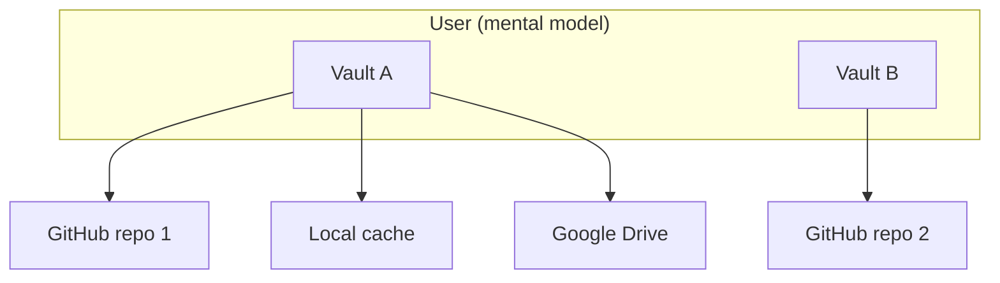

# Vault Session, Lock, and Multi-Vault Model

How Nook thinks about **vaults**, **sync providers**, **in-memory sessions**, and the **Lock** action.

**Related:** [unified-vault.md](unified-vault.md), [secret-store-identity.md](secret-store-identity.md), [auth-providers.md](auth-providers.md), [ARCHITECTURE.md](../ARCHITECTURE.md) §4.

---

## 1. Core concepts

| Concept | What it is | Persists when locked? |
|---------|------------|------------------------|
| **Vault** | One logical encrypted database identified by `store_id` in YAML | Yes — encrypted blob on disk |
| **Local vault cache** | Authoritative copies in `nook_db` as `vault:{store_id}` blobs + registry | Yes |
| **Sync provider** | Saved connection (GitHub PAT, Drive OAuth, …) in `nook_auth` | Yes — credentials only |
| **Device identity** | Passkey-wrapped X25519 key in `nook_db.device_identity_wrapped` | Ciphertext persists; plaintext does not |
| **Unlocked session** | WASM typed `Database` + Svelte `secrets[]` in memory | **No** — cleared on Lock |
| **Lock** | End session; return to login gate | N/A |

**Rules**

1. A **vault** is one `store_id` — one encrypted YAML file with its own secrets, devices, and version counter.
2. A vault may **replicate to many sync providers** — each provider holds a copy of the same `store_id` blob; `vault_version` reconciles divergence ([unified-vault.md](unified-vault.md) §5).
3. A user may **own many vaults** over time (work vs personal, migrated stores, etc.). Each vault is independent: different `store_id`, different unlock material, different provider set.
4. **Lock** does not delete vaults or providers — it drops both the decrypted vault session and plaintext device identity from memory.

---

## 2. Lock semantics

**User action:** Header **Lock vault** (`header-lock-vault-btn`) while authenticated.

**Implementation:** `VaultState.lockVault()` → `setVaultSessionLocked(true)` + `clearUnlockedSession()`:

| Cleared (memory) | Kept (disk) |
|------------------|-------------|
| `isAuthenticated`, `secrets[]` | `nook_db` vault blobs + registry |
| WASM typed `Database` via `resetVaultSession()` | `nook_db.device_identity_wrapped` |
| WASM device identity via `lockDeviceIdentity()` | WebAuthn credential in the platform authenticator |
| Pending joins / roster UI cache | `nook_auth` sync provider list + tokens |
| Settings / help panels | Password entries inside encrypted YAML |

**Refresh:** `sessionStorage` flag `nook_vault_session_locked` blocks `shouldAutoUnlock()` until the user unlocks again (`markVaultUnlocked()` clears the flag). Device-key vaults still auto-unlock on reload when the user did **not** lock.

After lock, the app first shows **`DeviceProtectionGate`**. Successful passkey
authorization restores the identity in WASM memory, then the app shows
**`LoginGate`**:

- **Multiple local vaults** → vault picker (`login-vault-picker`); unlock chosen vault.
- **Single local vault** → unlock with device keys and/or backup password.
- **No local vault yet** → create on device or connect a sync provider to pull an existing vault.

Lock is the safe “step away from this browser” action — analogous to logging out of a password manager while keeping the encrypted database file.

---

## 3. Multiple vaults on one browser (#120)

| Surface | Behavior |
|---------|----------|
| Local cache | Multiple `vault:{store_id}` blobs + `vault_registry` in `nook_db` |
| Login gate | Vault picker when >1 vault: open / create new / import from provider |
| Sync providers | Scoped to active vault `store_id`; full list in `nook_auth` |
| Lock / switch | Clears session; vault chooser when multiple vaults exist |
| `store_id` mismatch | **Import as new vault** in sync conflict dialog |

Legacy `encrypted_db` migrates to `vault:{store_id}` on first load. Code: `nook-app/nook-wasm/src/storage/indexed_db.rs`, `LoginVaultPicker.svelte`.

---

## 4. Sync providers ≠ separate vaults

| User intent | Correct action |
|-------------|----------------|
| **Create a vault** | Login → **Create vault** (starts in this browser) |
| **Replicate this vault** | Settings → Sync providers → Add GitHub / Drive |
| **Open a vault from elsewhere** | Login → **Connect sync provider** or **Import as new vault** |

If remote `store_id` ≠ active local `store_id`, sync reconciliation offers **import as new vault** or keep one copy — Nook refuses to merge unrelated databases ([unified-vault.md](unified-vault.md) §5).

---

## 5. UI surfaces

| Surface | Purpose |
|---------|---------|
| **Header Lock / Switch vault** | End session; switch vault when multiple exist |
| **Login gate chooser** | Vault picker, create local vault, or connect sync provider |
| **Settings → Sync providers** | Manage replica targets for the **active** vault only |

**Test ids:** `header-lock-vault-btn`, `header-switch-vault-btn`, `login-vault-picker`, `login-vault-option`, `login-create-additional-vault-btn`, `sync-conflict-import-new-vault-btn`, `unlock-vault-btn`, `login-create-device-vault-btn`, `login-connect-storage-btn`, `add-provider-btn`.

---

## 6. Security notes

- Lock must clear WASM session state — never rely on hiding UI alone.
- The wrapped device key and encrypted blobs remain after lock; the plaintext device identity is zeroized and requires passkey authorization again.
- Sync provider tokens in `nook_auth` remain after lock — they are storage credentials, not vault keys.
