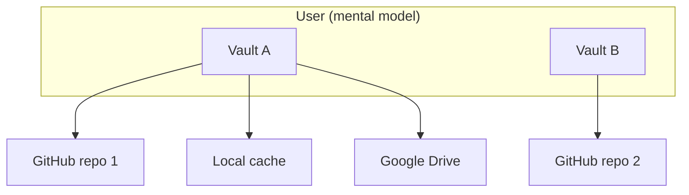

# Vault Session, Lock, and Multi-Vault Model

How Nook thinks about **vaults**, **sync providers**, **in-memory sessions**, the **Lock** action, and deleting a browser's local working copy.

**Related:** [unified-vault.md](unified-vault.md), [secret-store-identity.md](secret-store-identity.md), [auth-providers.md](auth-providers.md), [ARCHITECTURE.md](../ARCHITECTURE.md) §4.

---

## 1. Core concepts

| Concept | What it is | Persists when locked? |
|---------|------------|------------------------|
| **Vault** | One logical encrypted database identified by `store_id` in YAML | Yes — encrypted blob on disk |
| **Local vault cache** | Authoritative copies in `nook_db` as `vault:{store_id}` blobs + registry | Yes |
| **Sync provider** | Saved connection (GitHub PAT, Drive OAuth, …) in `nook_auth` | Yes — credentials only |
| **Device identity** | Passkey-PRF or PIN-wrapped X25519 key in `nook_db.device_identity_wrapped` | Ciphertext persists; plaintext does not |
| **Unlocked session** | Vault keys + encrypted records in WASM; metadata page plus explicitly revealed records in Svelte | **No** — cleared on Lock |
| **Sentinel genesis draft** | Pre-vault policy and verified participant public keys | Not a vault or unlocked session; persistence policy is a separate decision |
| **Lock** | End session; return to login gate | N/A |

`nook-auth2` owns the portable security/key-access primitives behind these rows:
device identities, `auth:` envelopes, `password_entries`, member roster
encryption, passkey-PRF/PIN wrapping, and vault key resolution. Sync
providers remain separate replica credentials and do not define how a vault is
unlocked.

**Rules**

1. A **vault** is one `store_id` — one encrypted YAML file with its own secrets, devices, and version counter.
2. A vault may **replicate to many sync providers** — each provider holds a copy of the same `store_id` blob; `vault_version` reconciles divergence ([unified-vault.md](unified-vault.md) §5).
3. A Sentinel genesis draft is not registered as a vault and cannot be selected,
   imported, opened, or synchronized before atomic genesis completes.
4. A user may **own many vaults** over time (work vs personal, migrated stores, etc.). Each vault is independent: different `store_id`, different unlock material, different provider set.
5. **Lock** does not delete vaults or providers — it drops vault keys, the
   current metadata page, any explicitly revealed records, and plaintext device
   identity from memory.
6. **Settings → Delete local vault data** is the destructive browser reset. It
   first locks other open Nook tabs, zeroizes their WASM sessions, clears their
   tab-scoped storage, and waits for their storage work to drain. The reset
   fails closed when safe cross-tab coordination is unavailable or a tab does
   not acknowledge. It then zeroizes the active WASM session; independently clears every object store in
   `nook_db`, `nook_auth`, `nook_file_sync`, and `nook_logs`; clears Web
   Storage, Cache Storage, and accessible site cookies; and returns to the
   landing page. Cleanup continues after individual store failures and reports
   the aggregate error from a locked state. It never deletes remote sync
   replicas or platform-authenticator passkeys.

---

## 2. Lock semantics

**User action:** Header **Lock vault** (`header-lock-vault-btn`) while authenticated.

**Implementation:** `VaultState.lockVault()` → `setVaultSessionLocked(true)` + `clearUnlockedSession()`:

| Cleared (memory) | Kept (disk) |
|------------------|-------------|
| `isAuthenticated`, current metadata page, revealed records | `nook_db` vault blobs + registry |
| WASM vault keys + `VaultCrypto` via `resetVaultSession()` | `nook_db.device_identity_wrapped` |
| WASM device identity via `lockDeviceIdentity()` | WebAuthn credential in the platform authenticator, or PIN fallback for PRF-missing platforms |
| Pending joins / roster UI cache | `nook_auth` sync provider list + tokens |
| Settings / help panels | Password entries inside encrypted YAML |

**Refresh:** `sessionStorage` flag `nook_vault_session_locked` blocks `shouldAutoUnlock()` until the user unlocks again (`markVaultUnlocked()` clears the flag). Device-key vaults still auto-unlock on reload when the user did **not** lock.

**Unlock ordering:** Device-key unlock runs `loadProviders()` (and related
provider hydrate) before `markVaultUnlocked()`. Fan-out after local save uses
`syncProviders`; unlocking that path earlier lets a fast edit push with an
empty provider list and leave the remote event log stale. Backup-password
unlock is the exception: it may open the local vault while the device identity
and its sealed provider credentials remain locked, and remote fan-out stays
disabled until device authorization.

After lock, the app stays in **`LoginGate`** without opening a passkey prompt.
When the user explicitly chooses **This device's keys**, a stored passkey wrapper
starts browser passkey authorization directly from that click. Successful
authorization restores the identity in WASM memory and continues that same
vault-unlock action automatically. `DeviceProtectionGate` in
`PasskeyAuthOverlay` remains the interactive surface for PIN input, missing
identity/passkey recovery, and failed or cancelled passkey attempts. **Backup
password** is an alternative vault-key credential and must open the local vault
directly without presenting the passkey/PIN form.

The gate presents itself as **Device setup — Step 1 of 2**, not as vault login.
Its copy explains that it prepares or unlocks the browser's protected device
identity and that vault selection, creation, or import follows in the next step.
Device protection mode is chosen only here; vault creation reuses the persisted
device choice and must not render another device-protection selector.

When no local passkey-protected device record exists, `DeviceProtectionGate`
shows new-passkey setup as the primary form and a small **Use existing passkey**
alternative. That alternative launches discoverable-passkey recovery immediately;
it must not open a second confirmation widget. When `device_identity_wrapped`
already identifies passkey protection, the gate is a retry/recovery surface
after a failed or cancelled direct authorization; it shows authorization only
and never renders passkey creation.

When the gate is embedded in `PasskeyAuthOverlay`, the overlay owns the single
visible border, radius, and elevation. The embedded gate stays flat so the setup
surface does not read as a card nested inside another card.
Browsers do not expose a general API for enumerating whether an RP already has a
discoverable passkey, so the missing-record state must retain the explicit existing-
passkey recovery action.

- **Multiple local vaults** → vault picker (`login-vault-picker`); unlock chosen vault.
- **Single local vault** → unlock with device keys and/or backup password.
- Backup-password summaries are read from the encrypted local vault before
  device authorization, so Lock must not hide the password choice. Selecting a
  backup password unwraps the vault keys directly; it does not unlock the
  wrapped device identity or its sealed sync-provider credentials.
- **No local vault yet** → create on device or connect a sync provider to pull an existing vault. Choosing Simple creates locally; choosing Sentinel starts the pre-vault reverse-onboarding ceremony in [sentinel-genesis.md](sentinel-genesis.md).

Existing-vault import must recover an authorized device identity before it
attempts `connect`. The provider preflight may discover the remote `store_id`
from signed encrypted events without decrypting the vault. Simple Vault uses
that identifier to ask an already-paired extension for its memory-only identity;
a locked extension owns and displays its unlock window. Only when no paired
extension is available does the website present its own passkey/PIN device gate.
Discovery is a bounded busy operation, and a missing `store_id` rejects an empty
or incorrect provider before device authorization. The discovered identifier
remains staged: it must not replace the active local vault until that exact
provider vault connects successfully.
The flow must never call provider connect first and surface the internal
`authorization_required` error to the user.

The login vault surface presents **Open existing**, **Create new**, and **Import**
as mutually exclusive workflows rather than consecutive sections. With local
vaults, Open existing is the default: choose a vault first, then authorize its
unlock. Create and Import replace the open/unlock controls while selected.

Lock is the safe “step away from this browser” action — analogous to logging out of a password manager while keeping the encrypted database file.

### Extension device session

The browser extension has a separate, revocable device identity. After its
passkey or PIN authorization, an offscreen extension document keeps that
identity in WASM memory for a fixed 15-minute session so reopening the toolbar
popup does not repeat the ceremony. It never persists the decrypted identity,
PIN, or passkey PRF output to `chrome.storage`; expiry or browser shutdown
zeroizes the manager and requires authorization again.

Simple Vault silently checks a paired extension every three seconds while both
the site and extension identity are locked. Automatic discovery must never open
an authentication surface. When the user explicitly chooses **Unlock**, a
paired locked extension opens its own authorization window; the website waits
for the extension's memory-only identity handoff and must not fall through to a
second website passkey ceremony. Site-to-extension requests have a bounded
five-second response deadline so a suspended or broken runtime cannot leave the
website unlock action pending forever.

---

## 3. Multiple vaults on one browser (#120)

| Surface | Behavior |
|---------|----------|
| Local cache | Multiple `vault:{store_id}` blobs + `vault_registry` in `nook_db` |
| Login gate | Vault picker when >1 vault: open / create new / import from provider |
| Sync providers | Scoped to active vault `store_id`; full list in `nook_auth` |
| Lock / switch | Clears session; vault chooser when multiple vaults exist |
| `store_id` mismatch | **Import as new vault** in sync conflict dialog |

Vault projection caches use `vault:{store_id}`. Code: `nook-app/nook-wasm/src/storage/indexed_db.rs`, `LoginVaultPicker.svelte`.

---

## 4. Sync providers ≠ separate vaults

| User intent | Correct action |
|-------------|----------------|
| **Create a vault** | Login → **Create vault** (starts in this browser) |
| **Create a Sentinel vault** | Login → **Create vault** → Sentinel policy and reverse onboarding; no provider until atomic genesis is complete |
| **Replicate this vault** | Settings → Sync providers → Add GitHub / Drive |
| **Open a vault from elsewhere** | Login → **Connect sync provider** or **Import as new vault** |
| **Local folder contains multiple vault logs** | Choose a dedicated folder for one vault; Nook shows the detected `store_id`s and refuses to sync until the provider path is unambiguous |

If remote `store_id` ≠ active local `store_id`, sync reconciliation offers **import as new vault** or keep one copy — Nook refuses to merge unrelated databases ([unified-vault.md](unified-vault.md) §5).

---

## 5. UI surfaces

| Surface | Purpose |
|---------|---------|
| **Header Lock / Switch vault** | End session; switch vault when multiple exist |
| **Login gate chooser** | Vault picker, create local vault, or connect sync provider |
| **Settings → Sync providers** | Manage replica targets for the **active** vault only |
| **Settings → Delete local vault data** | Remove every Nook vault and credential persisted by this browser; remote replicas remain |

**Test ids:** `header-lock-vault-btn`, `header-switch-vault-btn`, `login-vault-picker`, `login-vault-option`, `login-create-additional-vault-btn`, `sync-conflict-import-new-vault-btn`, `unlock-vault-btn`, `login-create-device-vault-btn`, `login-connect-storage-btn`, `add-provider-btn`.

---

## 6. Security notes

- Lock must clear WASM session state — never rely on hiding UI alone.
- The unlocked WASM session retains encrypted record payloads, not a plaintext
  `Database`. Local `secret_search_v2:{store_id}:{bucket}` records store
  independently encrypted list/search fields (site, username/account, titles,
  issuer, expiry, masked card/file metadata, and ids/types). Plaintext catalog
  rows exist only in unlocked WASM memory. The catalog never contains
  passwords, API keys, note bodies, seeds, full card numbers, OTP seeds,
  passkey private keys, backup codes, or file contents. Existing vaults build it
  once; later reconciliation decrypts only new, changed, or invalid rows and
  re-encrypts only affected ID-derived buckets. Search scans authenticated
  pre-normalized catalog text and does not decrypt vault records. Reveal and
  secret copy decrypt exactly one full record;
  hide, action completion, page/search replacement, and lock free it.
- The wrapped device key and encrypted blobs remain after lock; the plaintext device identity is zeroized and requires passkey or PIN authorization again depending on the stored wrapper.
- Sync provider tokens in `nook_auth` remain after lock — they are storage credentials, not vault keys.
- Vault authentication/authorization belongs to `nook-auth2`; sync provider replication belongs to `nook-core`/`nook-wasm` sync and storage adapters.
- Sentinel provider access never replaces participant quorum. Possessing a remote replica without `T` valid participant contributions must not produce an unlocked session.
