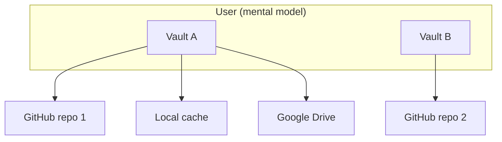

# Vault Session, Lock, and Multi-Vault Model

How Nook thinks about **vaults**, **sync providers**, **in-memory sessions**, and the **Lock** action.

**Related:** [unified-vault.md](unified-vault.md), [secret-store-identity.md](secret-store-identity.md), [auth-providers.md](auth-providers.md), [ARCHITECTURE.md](../ARCHITECTURE.md) §4.

---

## 1. Core concepts

| Concept | What it is | Persists when locked? |
|---------|------------|------------------------|
| **Vault** | One logical encrypted database identified by `store_id` in YAML | Yes — encrypted blob on disk |
| **Local vault cache** | Authoritative copy in `nook_db.encrypted_db` (UTF-8 YAML) | Yes |
| **Sync provider** | Saved connection (GitHub PAT, Drive OAuth, …) in `nook_auth` | Yes — credentials only |
| **Device identity** | X25519 key in `nook_db.device_identity_secret` | Yes |
| **Unlocked session** | WASM `decrypted_jsonl` + Svelte `secrets[]` in memory | **No** — cleared on Lock |
| **Lock** | End session; return to login gate | N/A |

**Rules**

1. A **vault** is one `store_id` — one encrypted YAML file with its own secrets, devices, and version counter.
2. A vault may **replicate to many sync providers** — each provider holds a copy of the same `store_id` blob; `vault_version` reconciles divergence ([unified-vault.md](unified-vault.md) §5).
3. A user may **own many vaults** over time (work vs personal, migrated stores, etc.). Each vault is independent: different `store_id`, different unlock material, different provider set.
4. **Lock** does not delete vaults or providers — it only drops the decrypted session so plaintext secrets leave memory.

---

## 2. Lock semantics

**User action:** Header **Lock vault** (`header-lock-vault-btn`) while authenticated.

**Implementation:** `VaultState.lockVault()` → `setVaultSessionLocked(true)` + `clearUnlockedSession()`:

| Cleared (memory) | Kept (disk) |
|------------------|-------------|
| `isAuthenticated`, `secrets[]` | `nook_db.encrypted_db` |
| WASM `decrypted_jsonl` via `resetVaultSession()` | `nook_db.device_identity_secret` |
| Pending joins / roster UI cache | `nook_auth` sync provider list + tokens |
| Settings / help panels | Password entries inside encrypted YAML |

**Refresh:** `sessionStorage` flag `nook_vault_session_locked` blocks `shouldAutoUnlock()` until the user unlocks again (`markVaultUnlocked()` clears the flag). Device-key vaults still auto-unlock on reload when the user did **not** lock.

After lock, the app shows **`LoginGate`**:

- **Local vault on device** → unlock with device keys and/or backup password.
- **No local vault yet** → create on device or connect a sync provider to pull an existing vault.
- **Multiple sync providers** → connect via provider flow; reconciliation uses `store_id` + `vault_version`.

Lock is the safe “step away from this browser” action — analogous to logging out of a password manager while keeping the encrypted database file.

---

## 3. Current vs target: multiple vaults on one browser

| | **Today** | **Target** |
|---|-----------|------------|
| Local cache | One `encrypted_db` row per browser profile | Vault picker: user selects which vault is active |
| Login gate | One local vault detected + optional cloud connect | Explicit vault list: open existing / create new / import from provider |
| Sync providers | Many providers → replicas of **one** active `store_id` | Providers scoped per vault; mismatch on `store_id` rejected |
| Lock | Clears session for the active vault | Same — user returns to vault chooser |

Today’s unified-vault rollout assumes **one active vault per browser profile**. Multi-vault UX (switch vault without wiping IDB) is a follow-on; the data model (`store_id`, provider `storeId`) already supports it.

---

## 4. Sync providers ≠ separate vaults

| User intent | Correct action |
|-------------|----------------|
| **Create a vault** | Login → **Create vault** (starts in this browser) |
| **Replicate this vault** | Settings → Sync providers → Add GitHub / Drive |
| **Open a vault from elsewhere** | Login → **Connect sync provider** |

If remote `store_id` ≠ local `store_id`, sync reconciliation **errors** — Nook refuses to merge unrelated databases ([unified-vault.md](unified-vault.md) §5).

---

## 5. UI surfaces

| Surface | Purpose |
|---------|---------|
| **Header Lock** | Primary lock control when vault is unlocked |
| **Login gate chooser** | After lock — create local vault or connect sync provider |
| **Settings → Sync providers** | Manage replica targets for the **current** vault only |

**Test ids:** `header-lock-vault-btn`, `unlock-vault-btn`, `login-create-device-vault-btn`, `login-connect-storage-btn`, `add-provider-btn`.

---

## 6. Security notes

- Lock must clear WASM session state — never rely on hiding UI alone.
- Device keys and encrypted blobs remain after lock; physical access to an unlocked browser is the threat model Lock addresses.
- Sync provider tokens in `nook_auth` remain after lock — they are storage credentials, not vault keys.
