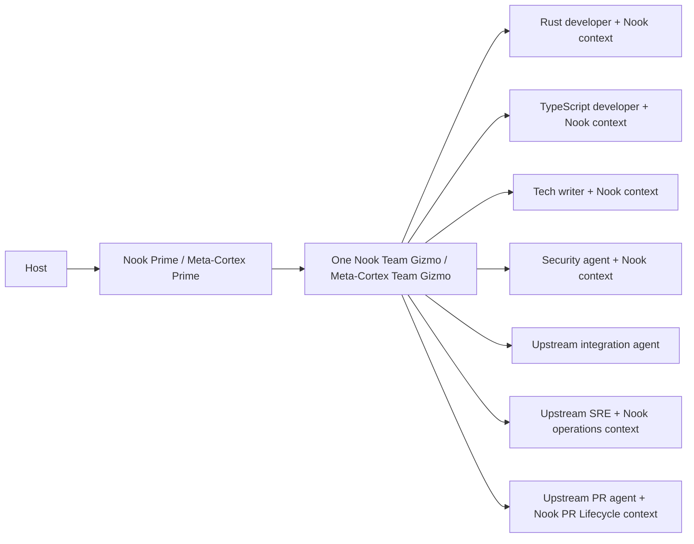
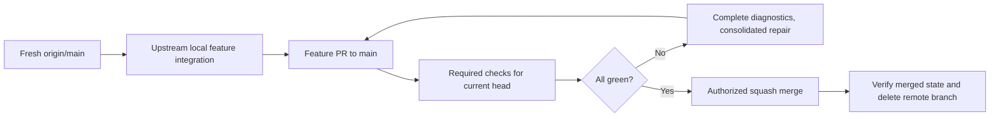

# Nook Delivery Model

## Coordination

The active host launches Nook's wrapper of Meta-Cortex Prime. Prime launches
one Team Gizmo. It selects agents from upstream catalogs with Nook project scope.
A Feature Gizmo is Prime acting as feature owner, not another coordinator layer.

**Prohibited:** start an AI Gizmo, a Web Gizmo, and an SRE Gizmo for one feature.

**Preferred:** one Team Gizmo sequences those bounded assignments and returns
combined evidence to Prime. Project-only roles remain until upstream covers them.

## Delivery

Follow the [feature-delivery contract](dev-delivery.md) for exact Nook stages.
For authorized full delivery, Prime starts a feature from freshly fetched main.
Workers operate in assigned scopes. The upstream integration agent merges their
branches into the feature branch and validates the combined result. PR Lifecycle
publishes only the canonical feature branch under Prime's authority.

**Prohibited:** report a pushed branch or green subset of checks as full delivery.

**Preferred:** report merged-state and cleanup evidence, or the explicit
intermediate result requested by the user. No-check migration work stops at edits.
