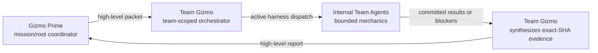
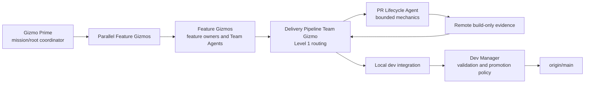
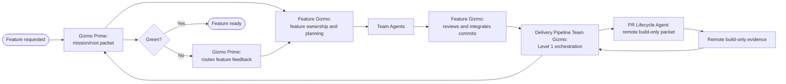
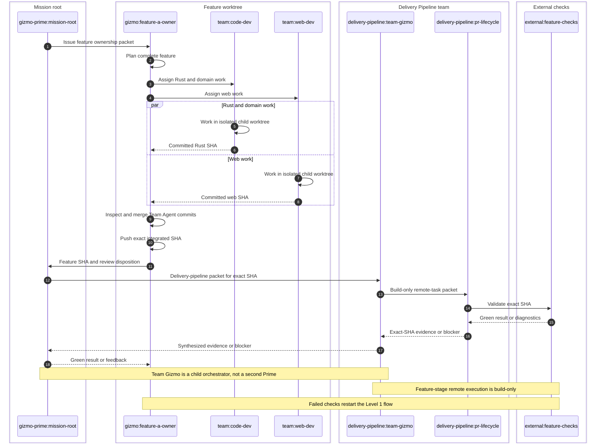
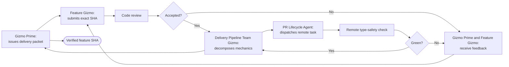
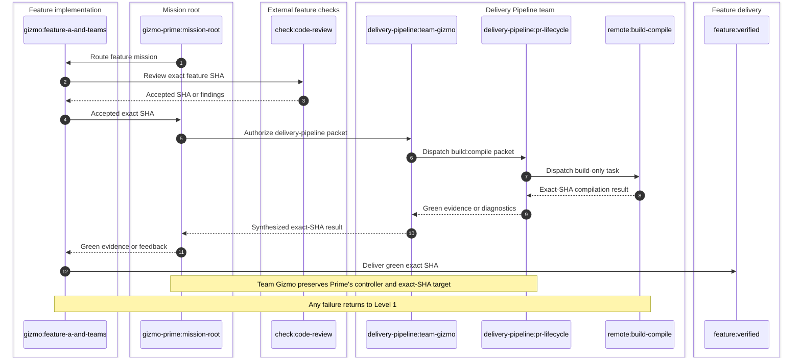
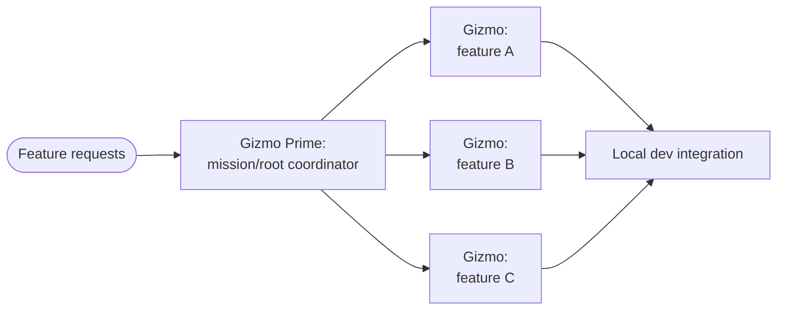
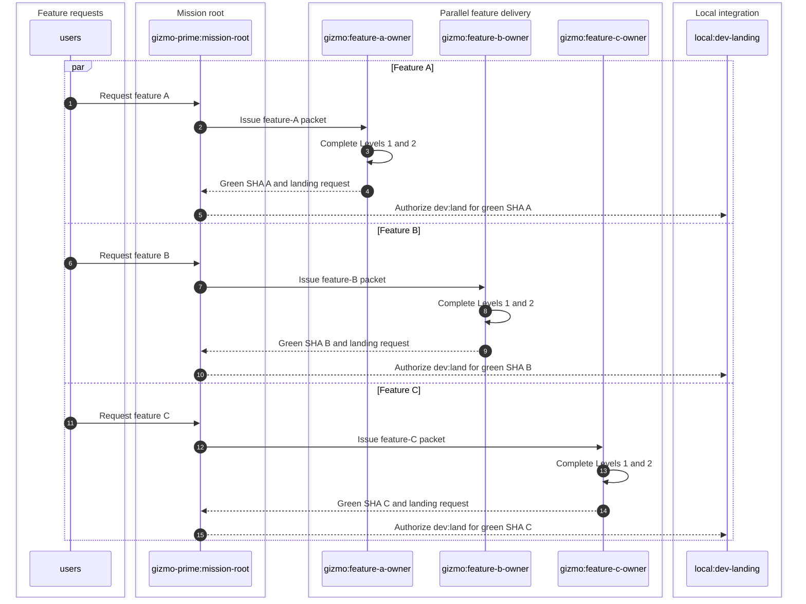
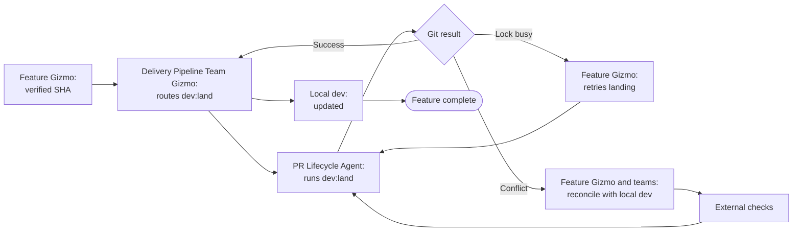
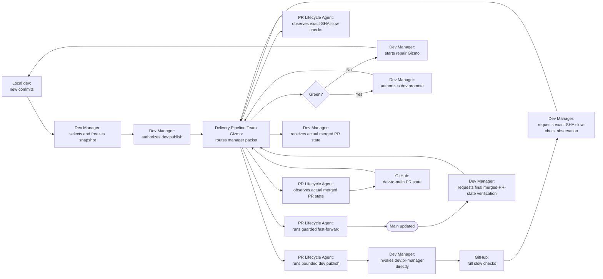

# Multiagent Delivery Visual Model

## Status and authority

This document is the mandatory first read and primary end-to-end explanation
for multiagent delivery. Every Feature Gizmo, Team Gizmo, Team Agent, reviewer,
PR Lifecycle Agent, Dev Manager, and repair Gizmo reads it completely before
acting in the workflow.

These diagrams define stage ownership, boundaries, feedback loops, and
exact-SHA handoffs. After identifying the current level and role, follow the
canonical [dev delivery contract](dev-delivery.md) for detailed authorization,
evidence, and failure rules when a diagram omits an operational edge case.

Flowcharts show lifecycle and retry behavior. Sequence diagrams show component
communication without duplicating every retry. At each higher level, the
previous level becomes one component.

## Mandatory Gizmo invocation gate

Every implementation or delivery run must begin with an invocation of Gizmo
Prime. Gizmo Prime is the mission/root coordinator. It must issue each team's
high-level packet through the active Gizmo harness, and the receiving Team
Gizmo must dispatch the required bounded internal Team Agents through that
harness before any worker-executable implementation, repair, review,
validation, external check, GitHub operation, local landing, dev validation,
or main-promotion work proceeds. Delegation is mandatory even when the work
appears small or its file scopes are disjoint.

If Gizmo Prime, a required Team Gizmo, or the Team Agent harness is missing or
unavailable, the run is failed closed. Stop all implementation, validation,
GitHub, and landing work and report the blocker. Direct execution by a
non-Gizmo root, including an ordinary Codex task, thread, cloud task, or
external agent, is not a fallback and cannot substitute for the Prime-to-Team
Gizmo dispatch chain.

## Hierarchy and reporting

Gizmo Prime is the mission/root coordinator. Every team has one Team Gizmo
that reports upward to Prime. A Team Gizmo receives a high-level packet,
decomposes only its team's mechanics, dispatches internal Team Agents through
the active harness, synthesizes exact-SHA evidence and blockers, and reports a
high-level result to Prime. Team Gizmo is not a second Prime and never decides
functional ownership, readiness, promotion, or final delivery.



The canonical teams and internal agents are:

- **AI**
  - Team Gizmo: `teams/ai/gizmo/`
  - Team Agents: `loom-specialist`, `cortex-specialist`
- **Development Core**
  - Team Gizmo: `teams/dev-core/gizmo/`
  - Team Agents: `rust-core-developer`, `rust-auth2-developer`
- **Security**
  - Team Gizmo: `teams/security/gizmo/`
  - Team Agents: `cryptography-specialist`, `security-review-specialist`
- **SRE**
  - Team Gizmo: `teams/sre/gizmo/`
  - Team Agents: `provisioning`, `cloud-native`
- **Web Development**
  - Team Gizmo: `teams/web-dev/gizmo/`
  - Team Agents: `typescript-specialist`, `svelte-specialist`
- **Delivery Pipeline**
  - Team Gizmo: `teams/delivery-pipeline/gizmo/`
  - Team Agents: `dev-manager`, `pr-lifecycle`

Gizmo Prime creates or reuses a compatible Team Gizmo before dispatch. Every
Team Gizmo uses `gpt-5.6-sol` with `low` reasoning and owns one team worktree.
Each leaf Team Agent uses `gpt-5.6-luna` with `xhigh` reasoning and receives a
separate issued child worktree. Disjoint specialists may run in parallel. The
Team Gizmo integrates their committed results into its team feature branch and
reports one synthesized exact-SHA result or blocker to Gizmo Prime. The Delivery Pipeline Team Gizmo handles
Level 1 delivery-pipeline orchestration, commit handoffs, and remote
build-only task packets. Its `pr-lifecycle` agent handles only packetized
external GitHub, PR, check, review, status, and bounded dev mechanics.

## Delivery overview



## Level 1: Feature Gizmo, Team Gizmo, and Team Agents

Gizmo Prime owns the mission/root delivery decision. The Feature Gizmo remains
the feature owner for planning, functional delegation, review, team-commit
integration, and feedback routing. Each team's Team Gizmo handles only its
team's delivery mechanics, including commit-level handoffs and remote
build-only task packets. Internal Team Agents work in isolated child
worktrees. Code review and remote type safety appear here as one external-check
boundary.

### Flow



### Component communication



## Level 2: Remote task under Delivery Pipeline

This level expands `external:feature-checks` through Delivery Pipeline Team
Gizmo and its `pr-lifecycle` agent. Review and remote compilation are separate
checks internally, but they return one exact-SHA verdict through Team Gizmo to
Gizmo Prime and the Feature Gizmo. The remote task is build-only: it does not
run tests, coverage, e2e, or preflight.

### Flow



### Component communication



## Level 3: Parallel feature development

Every feature has an independent Feature Gizmo, feature branch, worktree, Team
Agents, and external-check loop. Gizmo Prime routes each feature and its team
packets. No feature PR or global feature scheduler coordinates them.

### Flow



### Component communication



## Level 4: Local dev integration ownership boundary

Git is the coordination layer. Gizmo Prime remains the mission/root owner and
each Feature Gizmo owns its completed feature and landing request. Delivery
Pipeline Team Gizmo routes the bounded `dev:land` packet to its `pr-lifecycle`
agent, which executes the ordinary merge under the serialized local
integration task. There is no feature PR and no publication of `dev` here.

### Flow



### Component communication

```mermaid
sequenceDiagram
    autonumber

    box Parallel Feature Gizmos
        participant A as gizmo:feature-a
        participant B as gizmo:feature-b
    end

    box Mission root
        participant Prime as gizmo-prime:mission-root
    end

    box Serialized local integration
        participant Pipeline as delivery-pipeline:team-gizmo
        participant Steward as delivery-pipeline:pr-lifecycle
        participant Git as task:dev-land
        participant Dev as branch:local-dev
    end

    box Dev lifecycle
        participant Manager as agent:dev-manager
    end

    par Independent landing requests
        A-->>Prime: Request landing for green SHA A
    and
        B-->>Prime: Request landing for green SHA B
    end

    Prime->>Pipeline: Authorize dev:land for green SHA A
    Pipeline->>Steward: Dispatch bounded dev:land packet
    Steward->>Git: Merge SHA A under integration lock
    Git->>Dev: Advance local dev
    Git-->>Steward: Feature SHA and resulting dev SHA
    Steward-->>Pipeline: Landing evidence
    Pipeline-->>Prime: Synthesized landing evidence
    Prime-->>A: Landing result

    Prime->>Pipeline: Authorize dev:land for green SHA B
    Pipeline->>Steward: Dispatch bounded dev:land packet
    Steward->>Git: Merge SHA B under integration lock
    Git->>Dev: Advance local dev
    Git-->>Steward: Feature SHA and resulting dev SHA
    Steward-->>Pipeline: Landing evidence
    Pipeline-->>Prime: Synthesized landing evidence
    Prime-->>B: Landing result

    Dev-->>Manager: New local dev snapshot available

    Note over Prime,Steward: Feature Gizmo owns the request; Delivery Pipeline owns mechanics
    Note over A,Git: Lock retries and conflict repair follow the Level 4 flow
```

## Level 5: Dev validation and main promotion ownership boundary

The manually started Dev Manager is the sole policy owner of dev snapshots,
dev publication, slow validation, repair delegation, readiness, promotion,
and manager-only `dev:pr-manager`. Delivery Pipeline Team Gizmo routes
manager-authorized mechanics to its `pr-lifecycle` agent through the active
harness. Every GitHub check and PR-state observation returns through
`pr-lifecycle` and Team Gizmo before the Dev Manager receives its evidence. Team
Gizmo and Team Agents never create or update PRs, decide policy verdicts, or
replace the active harness. Local `dev` may continue receiving features while
the published `origin/dev` SHA remains frozen for its validation cycle.

### Flow



### Component communication

```mermaid
sequenceDiagram
    autonumber

    box Local feature integration
        participant Dev as branch:local-dev
    end

    box Dev management
        participant Manager as agent:dev-manager
        participant Repair as gizmo:repair-dev
    end

    box Authorized mechanics
        participant Pipeline as delivery-pipeline:team-gizmo
        participant Steward as delivery-pipeline:pr-lifecycle
    end

    box GitHub validation and promotion
        participant OriginDev as origin:dev
        participant PR as PR:dev-to-main
        participant PRManager as command:dev:pr-manager
        participant CI as full:slow-checks
        participant Main as origin:main
    end

    Dev-->>Manager: Committed local dev snapshot available
    Manager->>Pipeline: Authorize manager-only dev:publish for selected SHA
    Pipeline->>Steward: Dispatch bounded publication packet
    Steward->>OriginDev: Publish selected SHA
    OriginDev-->>Steward: Frozen origin/dev SHA
    Steward-->>Pipeline: Exact-SHA publication evidence
    Pipeline-->>Manager: Frozen SHA and blocker/evidence
    Manager->>PRManager: Invoke manager-only dev:pr-manager directly
    PRManager->>PR: Create or update the single dev-to-main PR
    PR->>CI: Run full slow checks for captured dev SHA
    Manager->>Pipeline: Authorize exact-SHA slow-check observation
    Pipeline->>Steward: Dispatch observation packet through active harness
    Steward->>CI: Observe exact-SHA slow-check result
    CI-->>Steward: Exact-SHA check evidence or blocker
    Steward-->>Pipeline: Exact-SHA check evidence or blocker
    Pipeline-->>Manager: Exact-SHA slow-check evidence or blocker

    Manager->>Repair: On failure, repair current local dev
    Repair->>Dev: Land repair through Levels 1 through 4

    Manager->>Pipeline: Authorize guarded dev:promote after approval
    Pipeline->>Steward: Dispatch frozen-SHA promotion packet
    Steward->>Main: Fast-forward exact tested SHA
    Main-->>Steward: Confirm remote main equality
    Steward-->>Pipeline: Exact ref-equality promotion evidence
    Pipeline-->>Manager: Promotion mechanics evidence
    Manager->>Pipeline: Authorize final actual merged-PR-state verification
    Pipeline->>Steward: Dispatch PR-state observation packet through active harness
    Steward->>PR: Observe actual merged PR state
    PR-->>Steward: Actual merged PR state
    Steward-->>Pipeline: Actual merged-PR-state evidence
    Pipeline-->>Manager: Actual merged-PR-state evidence

    Note over Dev,OriginDev: Local dev may advance while origin/dev is frozen
    Note over Manager,PRManager: Only the Dev Manager invokes manager-only dev:pr-manager; Team Gizmo and PR Lifecycle Agent never create or update the PR or decide policy verdicts
    Note over Pipeline,Main: No PR merge substitute; squash, rebase, force-push, and promotion merge commits are prohibited
```

## Delivery invariants

- Gizmo Prime is the mission/root coordinator. Every team reports through its
  Team Gizmo, which decomposes only team mechanics and returns exact-SHA
  evidence or blockers to Prime.
- Delivery Pipeline is the operational team for CI, PR lifecycle, dev
  publication, workflow execution, local landing, evidence, and guarded
  promotion. Its Team Gizmo routes `pr-lifecycle` packets.
- Team Gizmos and Team Agents never create or update pull requests, decide
  functional ownership, readiness, promotion, or final delivery, or replace
  the active harness.
- A Feature Gizmo exits Level 1 only with resolved required review findings and
  green remote compilation evidence for the exact final feature SHA.
- Feature-stage remote execution is build-only. Full tests belong only to the
  Dev Manager's dev-to-main PR.
- Team Agents mutate isolated child worktrees and return committed iterations.
- PR Lifecycle Agent performs only packetized external GitHub, PR, check,
  review, status, and bounded dev mechanics under Team Gizmo and controller
  authorization.
- Feature Gizmos never publish `dev` or `main`.
- Feature Gizmos, Team Gizmos, and Team Agents never create or update pull
  requests.
- `dev:land` serializes shared local-dev mutations and never creates a feature
  PR.
- `dev:pr-manager` is the sole pull-request creation/update path and operates
  only on the manager-selected `origin/dev` snapshot.
- The Dev Manager freezes each published `origin/dev` SHA for its validation
  cycle while newer features may continue landing locally.
- Promotion fast-forwards `main` to the exact fully validated dev SHA.
- Squash, rebase, force-push, and promotion merge commits are prohibited.
