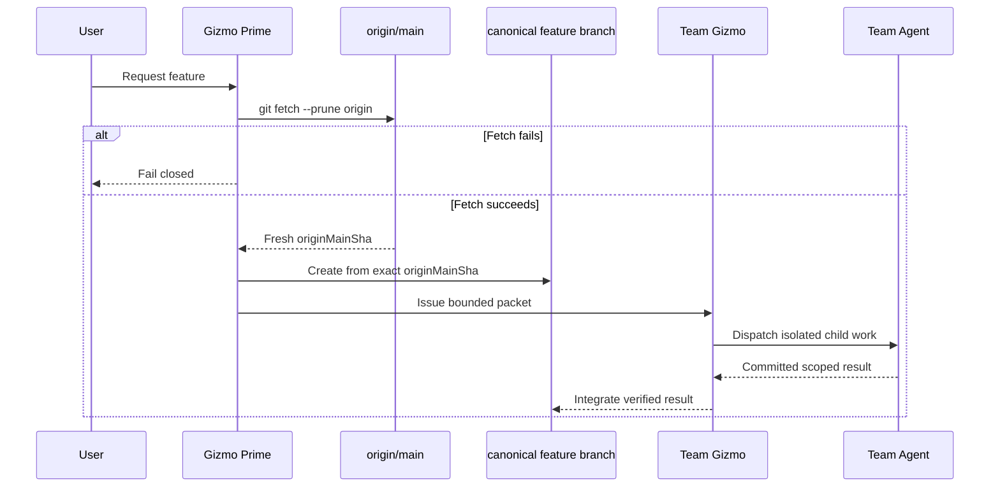
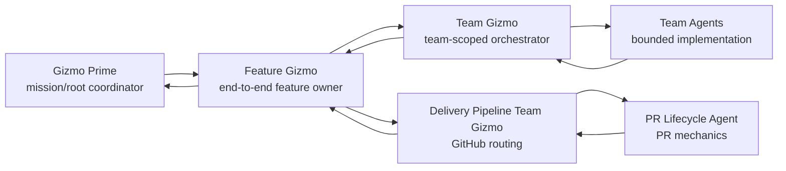
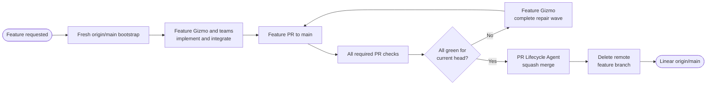
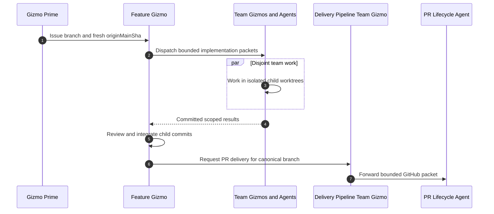
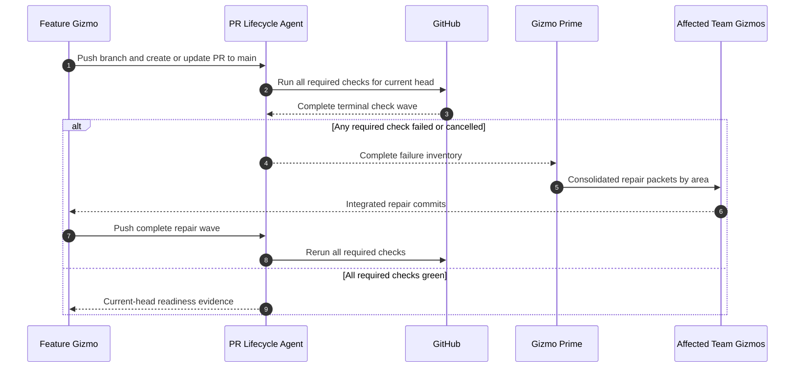
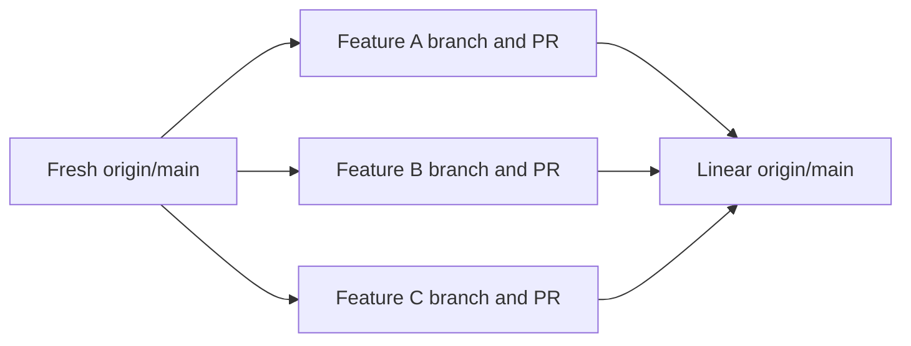

# Multiagent Delivery Visual Model

## Status and authority

This document is the mandatory first read for implementation and delivery.
Every Feature Gizmo, Team Gizmo, Team Agent, reviewer, PR Lifecycle Agent, and
repair Gizmo reads it completely before acting.

These diagrams define ownership, feedback loops, and branch handoffs. Follow
the canonical [feature pull-request delivery contract](dev-delivery.md) for
detailed authorization, evidence, and failure rules.

## Mandatory Gizmo invocation gate

Every implementation or delivery run begins under Gizmo Prime. Prime issues
each high-level team packet through the active harness. Each receiving Team
Gizmo dispatches bounded internal Team Agents before worker-executable work.

If a required Gizmo or harness is unavailable, the run fails closed. An
ordinary task, thread, or external agent is not a fallback.

## Fresh-main bootstrap

Before planning, delegation, worktree creation, or edits, Prime runs
`git fetch --prune origin`. A failure stops the run. Prime resolves the exact
fetched `origin/main` commit as `originMainSha`. Every new canonical feature
branch and feature worktree starts from that exact commit.

There is no delivery `dev` branch. A local or remote `dev`, an older main
observation, or another branch is not a valid feature base. The canonical
feature branch name is workflow authority. Delivery re-fetches before review,
PR mutation, check observation, or merge. A branch advance invalidates evidence
bound to the older head.



## Hierarchy



The canonical teams and internal agents are:

- **AI:** `loom-specialist` and `cortex-specialist`.
- **Development Core:** `rust-core-developer` and `rust-auth2-developer`.
- **Security:** `cryptography-specialist` and
  `security-review-specialist`.
- **SRE:** `provisioning`, `cloud-native`, and
  `docker-cache-specialist` when activated.
- **Web Development:** `typescript-specialist` and `svelte-specialist`.
- **Delivery Pipeline:** `pr-lifecycle`.

Gizmo Prime creates or reuses a compatible Team Gizmo. Each Team Gizmo owns one
team worktree. Each leaf receives a separate issued child worktree. Disjoint
specialists may run in parallel. Team Gizmos integrate committed child results
into the canonical feature branch.

## Dynamic harness capacity

### Required actions

- Attempt every dependency-ready disjoint Team Gizmo concurrently.
- Within a Team Gizmo, attempt every dependency-ready disjoint Team Agent
  concurrently.
- Treat temporary admission refusal as backpressure.
- Retry queued work when the harness reports released capacity.

### Prohibited actions

- Do not encode a fixed numeric concurrency cap.
- Do not pre-budget a dispatch wave against a numeric limit.

## End-to-end delivery

The same Feature Gizmo owns implementation, repair, readiness, and merge.
Delivery Pipeline supplies bounded GitHub mechanics. There is no handoff to a
separate manager after feature development.



## Feature implementation

Prime authorizes one canonical feature branch. Team Gizmos and Team Agents keep
temporary branches private. The Feature Gizmo reviews and integrates their
commits, then requests pull-request delivery for the same canonical branch.



## Pull-request validation and repair

Every required PR check runs on the current feature head. Reviews and approvals
are optional. Known correctness or security findings still require repair.

On a failed wave, PR Lifecycle collects every failed or cancelled required job.
Prime groups the complete inventory by team and competence area. The Feature
Gizmo integrates one coherent repair wave before the branch is pushed again.



## Merge and cleanup

The owning Feature Gizmo may merge its own pull request. Missing reviews or
approvals do not block it. PR Lifecycle performs the authorized GitHub action
after every required check is green for the unchanged current head.

```mermaid
sequenceDiagram
    autonumber
    participant Feature as Feature Gizmo
    participant PR as PR Lifecycle Agent
    participant GitHub
    participant Main as origin/main
    participant Branch as remote feature branch

    Feature->>PR: Authorize squash merge
    PR->>GitHub: Re-fetch PR, main, head, and required checks
    alt Main or feature head changed
        PR-->>Feature: Evidence invalidated; update and rerun checks
    else Current head fully green
        PR->>GitHub: Squash merge PR into main
        GitHub->>Main: Create one linear squash commit
        GitHub-->>PR: Actual merged PR state
        PR->>Branch: Delete remote feature branch
        PR-->>Feature: Merge and cleanup evidence
    end
```

## Parallel features

Each feature has an independent branch, worktree, Feature Gizmo, Team Agent
tree, pull request, validation loop, and squash merge.



If `main` advances before a feature merges, that feature updates from the fresh
main frontier and reruns invalidated checks. Features never coordinate through
an integration branch.

## Delivery invariants

- `main` is the only permanent delivery branch.
- Every feature starts from freshly fetched `origin/main`.
- Every feature uses one canonical short-lived feature branch and one PR to
  `main`.
- The canonical branch name is workflow authority. SHAs are evidence.
- The owning Feature Gizmo carries the full cycle through merge and cleanup.
- PR Lifecycle Agent owns bounded GitHub mechanics under Feature Gizmo
  authority.
- Every required PR check must be green for the unchanged current head.
- Optional review or approval absence never blocks delivery.
- The Feature Gizmo may merge its own pull request.
- Squash merge is canonical and keeps `main` linear.
- Merge commits on `main` are prohibited.
- GitHub must delete the remote feature branch after merge. PR Lifecycle
  verifies cleanup.
- A failed check wave is repaired from a complete terminal inventory.
- Completion requires actual merged PR state, the squash result on
  `origin/main`, and remote feature-branch deletion.
