# Multiagent Delivery Visual Model

## Status and authority

This document is the mandatory first read and primary end-to-end explanation
for multiagent delivery. Every Feature Gizmo, Team Agent, reviewer, PR Steward,
Dev Manager, and repair Gizmo reads it completely before acting in the
workflow.

These diagrams define stage ownership, boundaries, feedback loops, and
exact-SHA handoffs. After identifying the current level and role, follow the
canonical [dev delivery contract](dev-delivery.md) for detailed authorization,
evidence, and failure rules when a diagram omits an operational edge case.

Flowcharts show lifecycle and retry behavior. Sequence diagrams show component
communication without duplicating every retry. At each higher level, the
previous level becomes one component.

## Mandatory Gizmo invocation gate

Every implementation or delivery run must begin with an invocation of Gizmo
Prime. Gizmo Prime must dispatch the required bounded Team Agents through the
active Gizmo harness before any worker-executable implementation, repair,
review, validation, external check, GitHub operation, local landing, dev
validation, or main-promotion work proceeds. Delegation is mandatory even when
the work appears small or its file scopes are disjoint.

If Gizmo Prime or the Team Agent harness is missing or unavailable, the run is
failed closed. Stop all implementation, validation, GitHub, and landing work
and report the blocker. Direct execution by a non-Gizmo root, including an
ordinary Codex task, thread, cloud task, or external agent, is not a fallback
and cannot substitute for Gizmo dispatch.

## Delivery overview

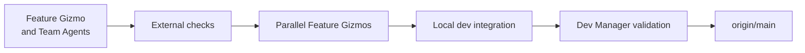

## Level 1: Feature Gizmo and Team Agents

The Feature Gizmo owns planning, delegation, review, team-commit integration,
and feedback routing. Team Agents work in isolated child worktrees. Code review
and remote type safety appear here as one external-check boundary.

### Flow

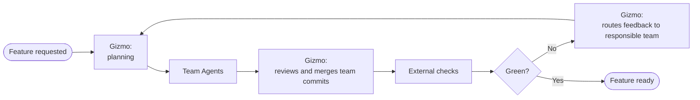

### Component communication

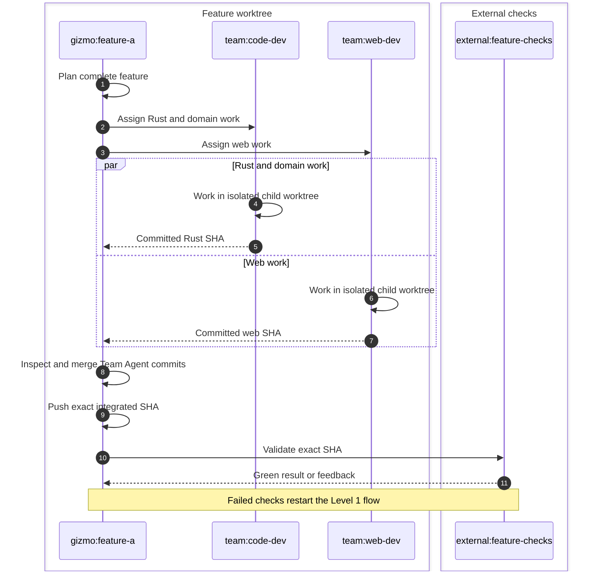

## Level 2: External feature checks

This level expands `external:feature-checks`. Review and remote compilation are
separate checks internally, but they return one exact-SHA verdict to the Feature
Gizmo. The remote task is build-only: it does not run tests, coverage, e2e, or
preflight.

### Flow

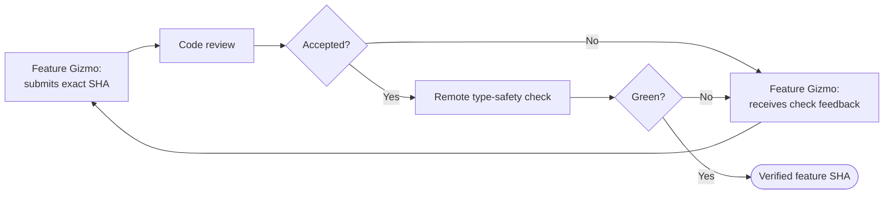

### Component communication

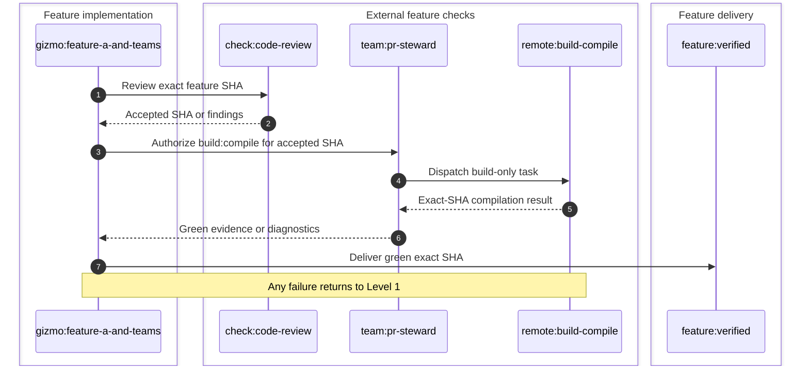

## Level 3: Parallel feature development

Every feature has an independent Gizmo, feature branch, worktree, Team Agents,
and external-check loop. No feature PR or global feature scheduler coordinates
them.

### Flow

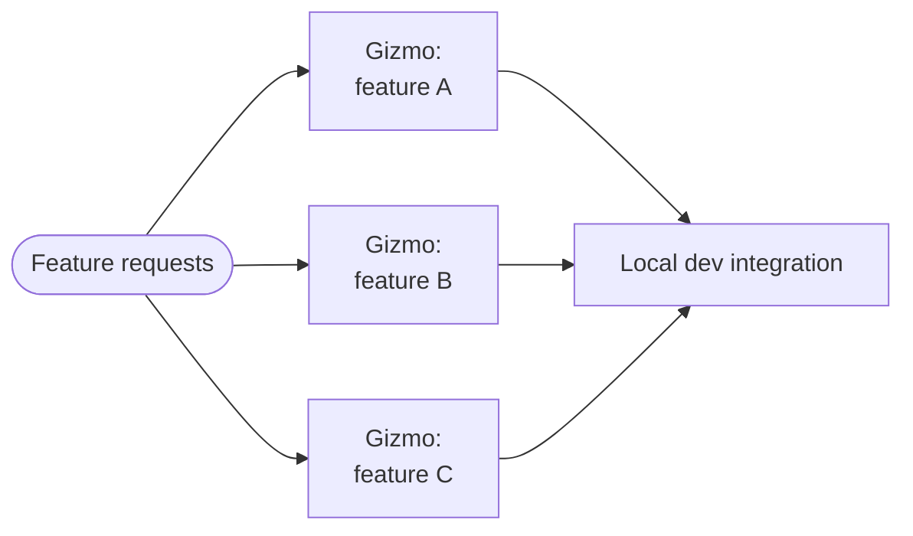

### Component communication

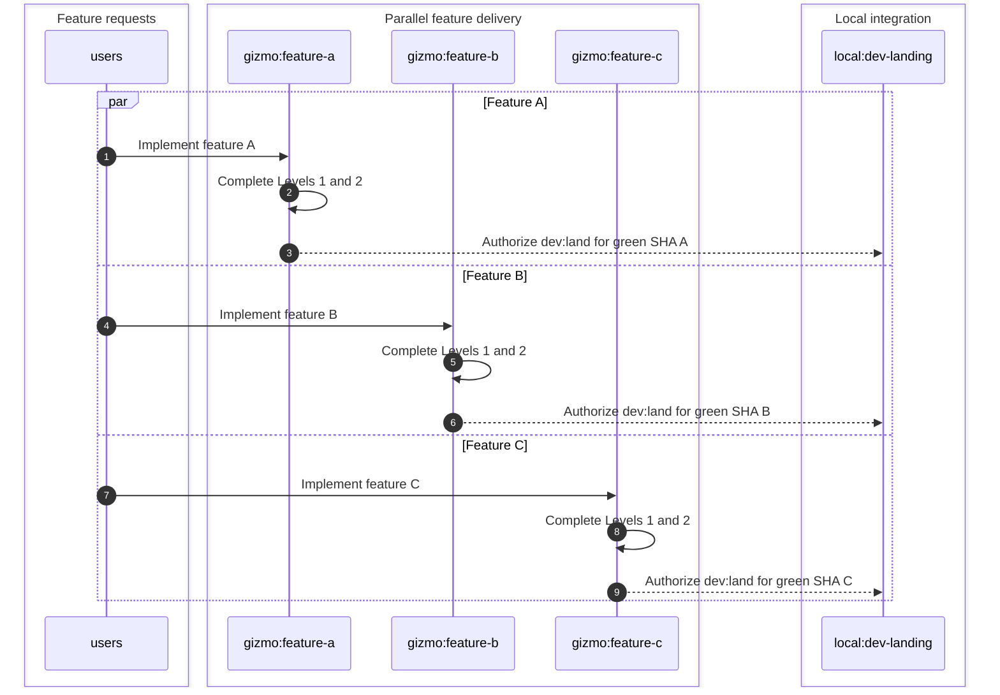

## Level 4: Local dev integration

Git is the coordination layer. Each Feature Gizmo authorizes its own bounded
`dev:land`; PR Steward executes the ordinary merge under the serialized local
integration task. There is no feature PR and no publication of `dev` here.

### Flow

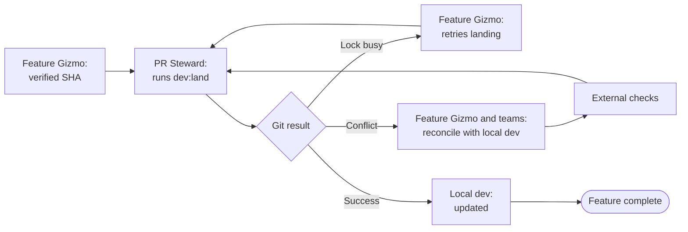

### Component communication

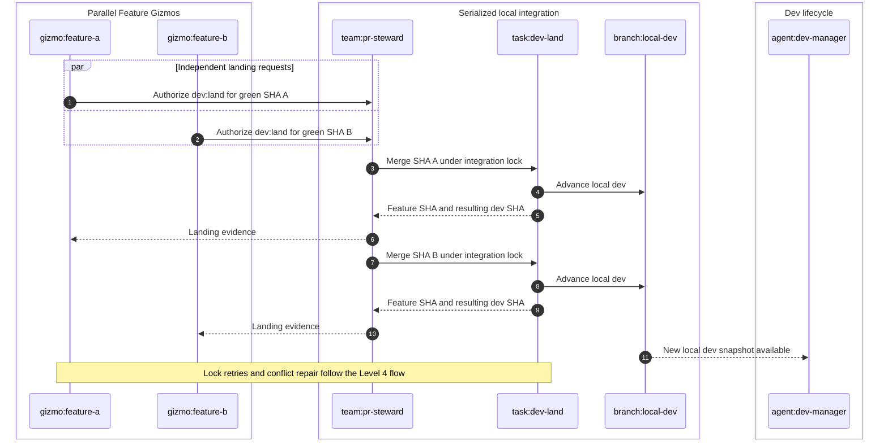

## Level 5: Dev validation and main promotion

The manually started Dev Manager is the sole owner of dev publication, slow
validation, repair delegation, readiness, and promotion. PR Steward performs
only manager-authorized mechanics. Local `dev` may continue receiving features
while the published `origin/dev` SHA remains frozen for its validation cycle.

### Flow

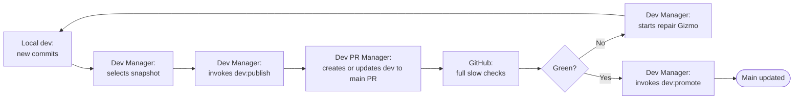

### Component communication

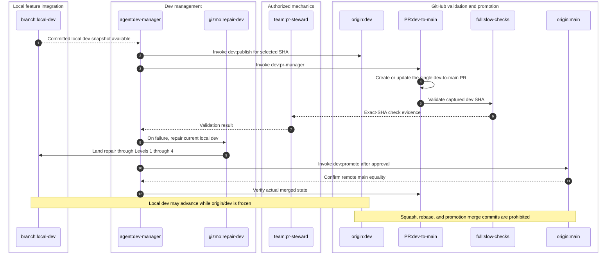

## Delivery invariants

- A Feature Gizmo exits Level 1 only with resolved required review findings and
  green remote compilation evidence for the exact final feature SHA.
- Feature-stage remote execution is build-only. Full tests belong only to the
  Dev Manager's dev-to-main PR.
- Team Agents mutate isolated child worktrees and return committed iterations.
- Feature Gizmos never publish `dev` or `main`.
- Feature Gizmos and Team Agents never create or update pull requests.
- `dev:land` serializes shared local-dev mutations and never creates a feature
  PR.
- `dev:pr-manager` is the sole pull-request creation/update path and operates
  only on the manager-selected `origin/dev` snapshot.
- The Dev Manager freezes each published `origin/dev` SHA for its validation
  cycle while newer features may continue landing locally.
- Promotion fast-forwards `main` to the exact fully validated dev SHA.
- Squash, rebase, force-push, and promotion merge commits are prohibited.
