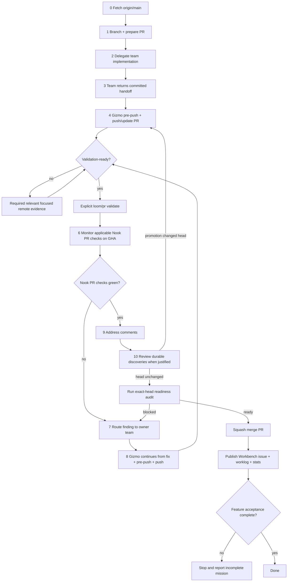

# Pull Request Workflow

## Overview

- Use this checklist for every change that lands on `main`.
- Gizmo follows [mission delivery](mission-delivery.md) and the detailed
  [agent pipeline](#agent-pipeline) below.
  - Do not stop at push.
- Apply this workflow only to the current task's owned feature and focused
  issues.
- Another active task's branch and pull request are read-only without an explicit
  handoff.

Without an explicit handoff, do not:

- push to it;
- reply to its reviews;
- resolve its reviews;
- close or reopen it;
- change its labels;
- trigger its checks;
- merge it.

Full ownership policy:
[agent-feature-ownership.md](../dynamic-skills/agent-feature-ownership.md).

## PR-first agent contract

For implementation tasks, Gizmo's default job is to land an integrated PR with
Nook's applicable GitHub Actions PR test checks green. Team subagents make the
implementation edits.

### Dispatch meaning

When this document says Gizmo **dispatches work to a team**, `dispatch` means
Gizmo admission-authorizes the bounded task record and submits its contract to
the active harness. The harness creates and runs the worker attempt. This
definition does not change GitHub Actions or Hive workflow-dispatch terminology.

Before establishing a PR path, apply the
[major architectural initiative rule](../../teams/ai/dynamic-skills/self-improvement.md#user-authority-for-major-architectural-initiatives).
Stop at analysis and proposals when a major direction comes from agent
reasoning rather than an explicit user-selected implementation request.
Lifecycle records and an agent-authored plan do not grant that authority.

Start by confirming feature ownership and establishing the PR path. Keep that
ownership until merge or a concrete blocked handoff:

1. **Prepare the PR path first:**
   - Fetch `origin/main`.
   - Estimate the authored changed lines.
   - Define the module boundary.
   - Confirm the complete PR can stay within the 2,000-line creation limit.
   - Create the first feature branch.
   - Define the first PR's title, body, and scope.
   - Create ignored `.cortex/.session/` memory only when temporary notes
     materially help the work.
2. **Implement functionality** — dispatch the requested code, documentation,
   and test changes to the responsible teams. Continue only from verified commit
   handoffs. Focused build and test feedback runs through the configured
   GitHub Actions runner.
3. **Prepare a coherent commit:**
   - Run `task loom:pre-push`.
   - Team workers own formatter mutations in their allowed source or Cortex
     files and return fresh formatted commits.
   - Gizmo may commit parent-owned delivery state.
   - Exactly two trusted GitHub Actions publishers are narrow exceptions:
     `agent-implement.yml` and `rust-dependency-updates.yml` through
     `task ci-agent:fix` with
     `CI_AGENT_FIX_PROFILE=rust-dependency-update`.
4. **Promptly push and create or update the PR.** Do not add another local
   product or review gate.
5. **Request review and validate on GitHub Actions:**
   - If the pushed head is not validation-ready, immediately dispatch at least
     one relevant focused `task remote TASK_NAME=<name>` job.
   - When the coherent head is validation-ready, immediately run one
     complete-validation command without requiring a focused task first:
     `task pr:validate PR=<number>` or
     `task loom:pr-land CONFIG=<pr-land-validate-request.yaml>`.
   - It dispatches every required hosted check before any GitHub review wait.
   - It then requests one idempotent exact-head Codex review without waiting.
   - Hosted validation and exact-head review proceed concurrently.
   - The eye reaction is liveness evidence only. It never settles review.
   - After checks and review settle, inspect both result sets.
   - Batch current review findings and failed checks into one repair iteration.
   - A head or base change invalidates both evidence sets. Dispatch validation
     and request review again for the replacement state.
   - Three automated finding batches open the circuit breaker. Perform a
     comprehensive stabilization pass, resolve its batch, and set
     `REVIEW_CIRCUIT_BREAKER_ACKNOWLEDGED=1` on the next validation run.
   - Codex is the sole automatic review provider. Do not activate Cursor
     Bugbot.
   - Do not request Claude, CodeRabbit, or other optional reviewers.
   - Inspect the path-applicable `PR / Verify and preview` and `Web research / Build and deploy research catalog` workflows.
   - Do **not** run a required local `task check` / `task ci:pr`.
6. **Fix Nook's failed PR workflow.** Inspect CI and app logs. Dispatch the
   finding to its responsible team. Continue from the verified fix commit, run
   pre-push hygiene, and push the complete fix. Validate the replacement head.
7. **Promote durable discoveries when justified.** Apply the canonical
   [self-improvement review](../../teams/ai/dynamic-skills/self-improvement.md#self-improvement-review)
   when the work revealed a durable lesson or Cortex defect. No promotion is
   required when no candidate qualifies. If a promotion changes the head,
   repeat complete hosted validation.
8. **Merge automatically when ready.** Require a current branch, green
   repository-owned checks, resolved actionable comments, every required team
   and security verdict, and the exact-head readiness audit. Then squash-merge
   without separate permission.

## Pull request size and modularity

### Size boundary

- An implementation pull request may be created with no more than **2,000
  authored changed lines**.
- This is the maximum planned and initial-delivery size.
- Estimate before implementation.
- Re-estimate when design changes or the diff grows unexpectedly.
- Recalculate the actual authored diff after each logical domain change and
  before every commit or push.

Count additions and deletions against the intended base for:

- authored source;
- tests;
- documentation;
- configuration;
- scripts and workflow code.

- During implementation, use `git diff --numstat <base>` for tracked
  working-tree changes.
- Count untracked authored files separately.
- After commit, use `git diff --numstat <base>...HEAD`.

Report these separately because they do not represent authored functionality:

- generated files;
- lockfiles;
- snapshots;
- vendored sources;
- binary artifacts;
- pure renames with no content change.

- Do not exclude tests or delete-heavy refactors from the authored estimate.
- Do not pad, compress, or mechanically reorganize code to fit the number.
- If the planned implementation would exceed 2,000 lines, stop before creating
  the PR and report that the scope or design does not fit the PR contract.
- Do not split, stack, or rebuild pull requests to evade the ceiling.
- Do not open a successor PR as an automatic size-recovery action.

### Review-growth stop

Review fixes may grow an existing PR beyond 2,000 authored changed lines.
This exception exists only to address GitHub review comments on the same PR.
Every other change blocks immediately when the PR exceeds 2,000 lines.

- Continued implementation, CI repair, conflict resolution, and security repair
  do not receive the review-growth exception by themselves.
- A required non-review change that would cross 2,000 lines is a blocked
  terminal path for the current mission.
- Report the required change and current size without implementing or pushing
  that growth.

- Run `task loom:pre-push PR=<number>` before committing or pushing every
  review-fix batch.
- The pre-push gate verifies the current PR and measures the authored diff.
- A value above 2,000 without verified review-fix context fails closed.
- Continue to preserve tests, documentation, security boundaries, and complete
  behavior while addressing review comments.
- Do not remove required work or compress code merely to reduce the count.
- Do not split, stack, rebuild, or replace the PR because review fixes grew it.
- Stop all implementation and review-fix work immediately when the authored
  diff reaches or exceeds **3,000 changed lines**.
- Do not push another code change after the stop condition is observed.
- Preserve the current branch, PR, review threads, checks, and Workbench state
  for inspection.

The stopped mission ends with a report to the user. The report must include:

- the PR number, exact head, base, and current authored changed-line count;
- the requested outcome and the implementation approach taken;
- a chronological summary of the work completed and still incomplete;
- why the PR grew uncontrollably, with measured growth by review-fix batch when
  that evidence is available;
- the total number of Codex review comments created on GitHub for the PR;
- the comments grouped by finding type;
- the count and disposition of comments in each group;
- an explicit conclusion about whether every comment belonged to one group;
- which comments or groups the agent failed to address;
- the observed or plausible reasons each failed fix did not settle the review;
- checks, review state, and other evidence relevant to the failure; and
- a clear statement that the agent did not complete the mission.

Do not include hidden reasoning, prompts, secrets, credentials, private data,
or raw logs in the report. Distinguish observed causes from possible causes.

### Adaptive Gizmo cardinality

- One feature uses one PR and one feature-slice Gizmo.
- Gizmo Prime does not add records because the PR approaches or exceeds a line
  limit.
- Team Agent count never determines PR or Gizmo count. Do not fragment a small
  feature merely because multiple teams or agents contribute to it.
- Gizmo Prime alone owns exact-head readiness, squash merge, and Workbench
  lifecycle.

### Required plan

The Workbench task plan must state:

- Gizmo Prime as the mission controller;
- the current feature-slice Gizmo ID;
- the estimated authored changed lines;
- the files, packages, modules, or layers expected to change;
- the public or cross-module interfaces involved;
- confirmation that the one PR estimate is at most 2,000 lines;
- the current PR scope and acceptance evidence;
- the required PR sequence mode fixed to `One PR`;
- exactly one PR-slice row with predecessor `None` for Workbench compatibility;
- one declared Gizmo ID on every ownership unit;
- permission for multiple Team Agent units to map to that same Gizmo ID;
- a superseding immutable plan when scope or the estimate materially changes.

A plan bound to a trusted focused-issue `gizmo_id` must declare one PR, one
slice, and that same ID on the current slice and every ownership unit.

An estimate is a design tool.

It is not a promise of exact line count.

### Module-focused PR

Keep one cohesive module, package, layer, or architectural responsibility in
the pull request.

Apply SOLID principles as concrete review questions:

- Does the slice have one clear reason to change?
- Does new behavior extend a focused abstraction instead of adding conditionals
  across unrelated modules?
- Can a narrower interface replace a broad dependency?
- Do higher-level policies depend on stable abstractions?
- Are internal details hidden behind the owning module?

- Public interfaces should change less often than internal implementations.
- Design the narrow boundary before dependent slices begin.
- Do not expose speculative APIs without a planned consumer.

Each slice must be:

- coherent on its own;
- safe to merge;
- covered at the owning boundary;
- compatible with the previous merged slice;
- small enough for focused review and repair.

- The PR may prepare an interface or migrate one module before the complete
  user flow exists.
  - Its acceptance criteria must still be independently observable.

## ⛔ SQUASH MERGE ONLY

- **Allowed squash merge methods:**
  - GitHub UI: **Squash and merge**
  - CLI: `gh pr merge <n> --squash`
  - Linear git history: exactly one squash commit per PR on `main`
- **Forbidden merge methods:**
  - Merge commits (`gh pr merge --merge`)
  - Rebase merges (`gh pr merge --rebase`)
  - Fast-forward merges that retain branch commit history on `main`

`main` must stay linear: **one squash commit per PR**. Feature branches can have many commits; that history is discarded at merge time.

If you merge a PR for the user, **confirm squash** before completing the merge. Merging any other way is a process violation.

## Agent pipeline

Defined by [mission delivery](mission-delivery.md). End-to-end flow for Gizmo
and its team subagents:



### 0. Fetch and branch

Fetch before branching so the feature branch starts from current `origin/main`:

```bash
git fetch origin main
git checkout -b <branch-name> origin/main
```

Never commit directly on `main`.

### 1. Prepare the PR path

1. Complete the size and modularity plan above.
2. Decide the branch name and the PR's scope, title, and body.
3. Organize work around getting that PR green and merged.
4. Open the PR after the first coherent commit when useful.

### 2. Implement

Gizmo dispatches the bounded slice described by the task plan: it
admission-authorizes that task record and submits the bounded contract to the
active harness, which creates and runs the attempt. The responsible team
implements it and preserves its owning interfaces and acceptance evidence.

When temporary notes materially help, capture meaningful discoveries and
evidence in `.cortex/.session/`. Any session file remains provisional and
untracked.

### 3. Push an exact remote-executable commit

#### Trusted automated publisher exceptions

Two trusted GitHub Actions publishers bypass the ordinary direct-commit
sequence:

- `agent-implement.yml`; and
- `rust-dependency-updates.yml` through `task ci-agent:fix` with
  `CI_AGENT_FIX_PROFILE=rust-dependency-update`.

Their bounded editors have no independent Git or external delivery authority.
See the root
[team worker contract](../../AGENTS.md#team-worker-contract) for the exact
publication, isolation, and head-verification rules. Gizmo continues either
returned head and owns review, validation, readiness, and merge.

Prepare an exact remote commit:

1. Make the implementation coherent.
2. Continue from the teams' formatted commits.
3. Run pre-push hygiene.
4. Promptly push and open or update the PR.

This exposes the source to focused remote tasks but does not start complete
validation.

- Never require `task check`, a full test suite, build, e2e, container product
  validation, advisory review, or a duplicate hosted-check mirror as a local
  gate.
- Always run `task loom:pre-push` before push.
- If hygiene mutates team-owned source or Cortex content, return the diff to
  that team for a fresh formatted commit. Continue from it and rerun hygiene.
- Gizmo may commit parent-owned delivery state.
- Push only when the branch is coherent enough to validate.

```bash
task loom:pre-push
git commit
git push -u origin HEAD
gh pr create --title "…" --body "…"
```

See [pre-push hygiene](../../teams/sre/dynamic-skills/pre-push-hygiene.md).

- If the pushed head is not validation-ready, dispatch at least one relevant
  focused remote task immediately.
- When the head is validation-ready, trigger complete validation immediately.
  Focused remote tasks are not a prerequisite.
  - Never wait for GitHub review before hosted validation dispatch.
  - Dispatch every required check first.
  - Request one idempotent exact-head Codex review without waiting.
  - Use the hosted validation window to collect that review.
- After checks and review settle, address current review findings and failed
  checks as one coherent batch.
- Validate and review every replacement head again.
- Do not defer the review request until after checks finish.
  - Codex is the only automatic provider. Do not activate Cursor Bugbot.
  - See [Code review](code-review.md).

Three automated finding batches open the review circuit breaker. Complete a
comprehensive local stabilization pass and resolve the coherent batch instead
of requesting another Cloud review immediately.

### 5. Hosted iteration and explicit validation

**GitHub Actions is the normal build/test path.** `remote.yml` runs allowlisted
focused tasks on the configured ARC scale set, with `ubuntu-latest` as its
fallback. It always targets an exact pushed branch head. `pr.yml` remains the
GitHub Actions merge-validation pipeline and runs only when an agent explicitly
applies a validation label through `task pr:validate`. Its trusted daemon-free
Rust jobs may use ARC; its remaining jobs stay hosted.

```text
initial implement → task loom:pre-push → commit → push/create PR
review fix → task loom:pre-push PR=<number> → commit → push/update PR
→ focused remote evidence when not ready or immediate complete validation
→ concurrent exact-head Codex review → combined repair batch
```

**Required local action** before the initial branch push:

```bash
task loom:pre-push
```

Before every review-fix re-push, run `task loom:pre-push PR=<number>` so the
exception above 2,000 lines remains bound to verified GitHub feedback.
Do not add broad local builds, tests, e2e, container product gates, advisory
review, or duplicate hosted-check mirrors.

Focused hosted commands (never merge gates):

```bash
task remote TASK_NAME=web:build
task remote TASK_NAME=web:e2e
task remote TASK_NAME=rust:ci
```

Complete validation:

```bash
task pr:validate PR=<number>
# Main-fix PR:
task pr:validate PR=<number> FULL_E2E=1
```

- **Before every push**
  - Command: `task loom:pre-push`
  - Purpose: Only required local product action; applies formatting and UI demo contract
- **Focused build/test feedback**
  - Command: `task remote TASK_NAMES=<a>,<b>`
  - Purpose: Required immediate evidence when the pushed head is not
    validation-ready; reuse one hosted worker for selected tasks
- **Final validation boundary**
  - Command: `task loom:pr-land CONFIG=<pr-land-validate-request.yaml>` or `task pr:validate PR=<number>`
  - Purpose: Start the complete exact-head PR gate
- **After complete CI failure**
  - Command: Fix → `task loom:pre-push` → commit → push → trigger validation again
  - Purpose: Pushing alone does not start `pr.yml`; every replacement head
    needs fresh exact-head remote evidence

See [CI pipeline](../../teams/sre/workflows/ci-pipeline.md#local-vs-remote-ci)
and [GitHub Actions validation](../../teams/sre/dynamic-skills/github-actions-only-validation.md).

- Follow [workflow concurrency policy](../../teams/sre/workflows/ci-pipeline.md#workflow-concurrency-policy)
  for cancellation.
- Explicit validation cancels only an older labeled run for the same PR.
  - Unrelated PRs keep independent required checks.
- Every cancellable live-provider job keeps external-resource cleanup in a
  separate `if: always()` step.
  - An interrupted test must not leak provider state.

### 5.1. Main-fix browser validation

Normal PR CI omits browser e2e. A PR fixing a failure observed on `main` must trigger the `ci:full-e2e` validation path, which runs the Main-equivalent local-provider and extension browser suites before merge:

```bash
task pr:validate PR=<number> FULL_E2E=1
```

Agents do not run full e2e locally. Use the remote catalog for focused browser feedback and the explicit Main-fix gate for merge validation.

### 6. Monitor only Nook's applicable PR test checks until green

`pr.yml` runs native Rust and WASM independently. Trusted same-repository native
Rust may use the configured ARC scale set. WASM and fork PR jobs remain hosted.

**Producer and consumer split:**

- After clippy/build, the WASM producer uploads only the small generated package.
- Parallel browser-free preview validation can begin while required Node tests continue.
- Preview deployment remains blocked until the producer succeeds.
- Optional browser-e2e consumers wait for that fully verified producer.
- No consumer recompiles Rust.

**Preview and coverage:**

- Preview deploys the internal harness plus isolated native Pages aliases for site, Simple, and Sentinel without waiting for native coverage.
- A separate native-dependent coverage job downloads the current run's Rust artifact directly.
- When a base comparison is required, it resolves an exact-commit trusted Main artifact.
- It never cold-builds the base revision.
- The isolated site alias is recorded as the successful `github-pages` deployment for ruleset enforcement.

**Main-fix browser jobs:**

- PRs labeled `ci:full-e2e` additionally run two deterministic web shards and one independent extension job on separate hosted runners.
- Each builds the Chromium image from verified WASM.
- The stable web join fails unless both shards succeed and does not rebuild the browser image merely to publish a low-reuse exact-head cache.
- The overall `PR` workflow cannot succeed until both web shards, the join, and extension e2e succeed.

**Do not stop after opening the PR.** Wait only for applicable repository-owned workflows:

- `PR`
- `Web research` when `.github/workflows/web-research.yml` or `nook-app/nook-web/nook-web-research/**` changes

- Keep monitoring inside the active delivery task with bounded direct waits.
- Never create a Codex scheduled task, automation, heartbeat, reminder, or
  recurring follow-up to continue PR monitoring later.
- The agent may plan its polling cadence and next delivery action. Keep that
  plan inside the active task; do not persist it as Codex scheduling state.
- "Merge when ready" is a terminal delivery instruction. Test the PR, monitor
  its exact-head checks and actionable review state, and merge it as soon as
  readiness succeeds.
- Never use an all-check watcher that can remain blocked on external services.
- If neither repository workflow applies to the changed paths, there is no
  remote check to wait for.

```bash
task pr:preflight PR=<number>
```

- Use `task loom:pr-land CONFIG=<pr-land-ready-request.yaml>` or
  `task pr:ready` for read-only exact-head readiness.
  - The command never merges by itself.
  - Success tells Gizmo to squash-merge immediately.
- Codex review is not a readiness requirement.
  - Its bounded pre-validation lane must not deadlock delivery.
  - Do not request Claude, CodeRabbit, or other optional external reviews.
- Repository-owned checks and exact-head deployment remain required when
  applicable.
- Before merge, always verify the branch against latest `origin/main` even when
  all visible checks are green.
- If a green PR cannot merge, first suspect a stale branch after `main`
  advanced.

GitHub may surface that stale-branch state as:

- an "Update branch" requirement
- `mergeStateStatus: BLOCKED`
- a missing active check because the green run belongs to an older base

Before chasing other branch-policy explanations:

1. Fetch `main`.
2. Compare divergence.
3. Update the PR branch when stale.

```bash
git fetch origin main
git rev-list --left-right --count HEAD...origin/main
gh pr view <number> --json mergeStateStatus,baseRefOid,headRefOid,statusCheckRollup
```

If the branch is behind `origin/main`:

1. Merge the base branch into the PR branch.
2. Push the new head.
3. Explicitly validate applicable workflows.
4. Do not merge until freshness passes.

```bash
git merge origin/main --no-edit
git push origin HEAD
task pr:validate PR=<number>
task pr:ready PR=<number>
```

### 6.1. Address review comments

- Handle all actionable feedback already present, regardless of author.
  - Follow [Code review comments](../dynamic-skills/code-review-comments.md).
- Measure the authored diff before and after each review-fix batch.
- Apply the [review-growth stop](#review-growth-stop) immediately at 3,000
  authored changed lines.
- Before resolving a conversation, leave an agent-authored reply with the fix,
  validation, or no-change rationale.
  - Do not resolve silently.
- Inspect submitted review bodies, inline threads, and PR comments:

```bash
gh pr view <pr-number> --comments
head_sha="$(gh pr view <pr-number> --json headRefOid --jq .headRefOid)"
gh api repos/meta-secret/nook/pulls/<pr-number>/reviews \
  --jq ".[] | {user: .user.login, state, body, html_url, commit_id, current_head: (.commit_id == \"$head_sha\")}"
```

- Inspect submitted-review bodies from every head and disposition every
  actionable finding.
  - A substantive body without inline comments blocks readiness.
  - When a review has inline comments, retain its body as audit context and use
    unresolved-thread state as the deterministic readiness authority.
  - Use `isOutdated` and current code to decide the appropriate response to an
    older inline finding; outdated does not make an unresolved thread optional.
- Use the review-thread GraphQL query from the review-comments skill to inspect
  unresolved inline conversations.
- Reply only where a real thread or comment supports a targeted reply.
- Track unthreaded submitted-review items in the checklist and handoff instead
  of creating comment spam.
- Resolve all actionable threads and re-query immediately before merge.
- Do not request another review after repository checks finish.
  - Codex is the sole automatic review provider. Do not activate Cursor Bugbot.
  - Do not request Claude, CodeRabbit, or other optional reviewers.
  - See [Code review](code-review.md).

### 7. Fix loop on failure

Investigation order: **test output** → **static analysis** → **app logs** (most important after the first two). See [logging](../../shared/references/logging.md#debugging-troubleshooting-and-ci-verification).

Static analysis includes Knip unused findings and jscpd clone/duplicate
findings. Route those problems to the responsible team. Do not silence the
gate. See [quality](../../teams/sre/workflows/quality.md#fix-check-findings--not-silence-them).

1. Read the failed job log: `gh run view <run-id> --log-failed`
2. For **e2e / web failures**, read persisted app logs before changing code.
   Use the Playwright `nook-app-logs.json` attachment. Local sources include
   `fetchAppLogs(page)`, `/app-logs`, and `dumpNookLogs(page)`.
3. Dispatch the root cause to its responsible team.
4. Continue from the verified fix commit and run `task loom:pre-push`. Return any
   team-owned formatter diff for a fresh team commit. Continue from it, rerun
   hygiene, and promptly push the completed fix.
5. Run Loom/Task validation and return to monitoring Nook's complete exact-head
   PR checks. If the pushed fix is not validation-ready, dispatch at least one
   relevant focused `task remote` job first.
6. Complete validation dispatches before any GitHub review wait. Exact-head
   review runs during hosted checks. Batch review findings and failed checks
   after both settle. No other review service is activated.

If the failure was obviously fmt-only, `task loom:pre-push` is the only local
proof required before re-push. Every replacement head still requires refreshed
remote `pr.yml` evidence.

### 8. Merge and finish

When the work revealed a durable lesson or Cortex defect, apply
[Agent self-improvement](../../teams/ai/dynamic-skills/self-improvement.md#self-improvement-review).
No promotion is required when no candidate qualifies. Integrate any justified
clean committed promotion before final readiness. If promotion changes the
head, repeat complete hosted validation.

Merge only when all readiness conditions pass:

- Nook's applicable repository-owned PR test checks are green.
- The branch is current with `origin/main`.
- All actionable comments are resolved.
- Gizmo's final delivery verdict is ready for the exact head.
- Every required team verdict is satisfied.
- Every required security verdict is satisfied.
- Gizmo has not overridden a required blocking verdict.
- `task loom:pr-land CONFIG=<pr-land-ready-request.yaml>` or `task pr:ready`
  succeeds.

```bash
gh pr merge <number> --squash
```

The successful squash merge completes implementation delivery. Do not wait for, monitor, or live-verify the resulting Main run unless the user explicitly requested deployment/live verification or assigned a Main failure.

Default-branch health outside the target PR is not part of PR delivery.

- Consult `origin/main` only for branch creation, base comparison, and required
  freshness updates.
- Do not turn an unrelated Main failure into diagnosis or implementation work.
- A Main failure does not authorize expanding the PR or creating a second task.
- Report a proven inherited blocker without taking ownership of it. Continue
  only when repository-owned state changes or the user explicitly changes the
  task boundary.

After merge, `main.yml` independently runs full local-provider and extension **e2e**.

**Main failure incidents (Hive):**

- Every actionable unsuccessful Main run creates one `automation: hive` Workbench incident keyed by failed SHA.
- This includes `Web e2e`, `UI demos`, and `Extension e2e`.
- Each run attempt creates a run-and-attempt-keyed delivery generation whose plan/worklog are generation-specific.
- A later failed rerun supersedes and cancels an active delivery before the new generation is enqueued.
- The dispatcher retries only after a poll interval longer than the worker heartbeat.
- The durable barrier is the worker's Neo4j acknowledgement that the stale Codex execution stopped.
- The old generation remains `CANCELLING` until worker acknowledgement or confirmed deletion of its recorded Kubernetes Pod, including cancelling exclusive blockers.
- Reconciliation of the current generation is idempotent.
- Successful reruns retire existing incidents and stop active delivery.
- The isolated Hive dispatcher enqueues actionable incidents once.
- One logical task owns diagnosis, a normal exact-head PR, actionable review resolution, squash merge, and verification of the resulting Main run.
- An explicitly dispatched `agent-implement.yml` worker does not claim Hive
  incidents.
- Credentialed sync-live checks are available only through explicit manual validation.

### 9. Post-merge Workbench context and statistics

Every normal Gizmo-owned PR continues through a Workbench publication after
merge. Follow [issues](issues.md) and
[agent statistics](agent-statistics.md):

- Update the associated issue.
- Add the agent worklog.
- Create `stats/ai-agent/<source-pr-number>.yaml`.
- Include all local validation and repository workflow executions/retriggers plus merge attempts and elapsed time.
- Record the repository test inventory on the merged head.
- Compare with recent comparable records and assess waste.

Publish these records directly to `meta-secret/nook-workbench` `main`.

Do not:

- create a bookkeeping Nook branch or PR
- wait for post-merge Main
- include a Main run merely because the implementation PR triggered one

If the comparison identifies actionable performance regression or workflow waste, create a separate normal Nook build-performance PR and take it through the full pipeline.

Completed Main attempts independently commit one automated `stats/main-build/<run-id>-attempt-<attempt>.yaml` record to Workbench after the workflow finishes. Because no Nook ref changes, publication cannot recurse. See [main build statistics](../../teams/sre/workflows/main-build-statistics.md).

### 10. Task completion report

- Every turn that finishes a user-assigned task ends with a short completion
  report that includes duration.
- **When:** after merged delivery, delivered answer, or explicit handoff.
  - Do not wait for post-merge Main unless live verification was requested.
  - For a multi-step monitor/fix/merge cycle, report once at the end.
- **Measurement:** wall-clock time from first implementation or investigation
  through the final message.
  - Include CI wait time that the agent monitored.

**Format** — add a `## Duration` line (or equivalent) in the final reply:

```markdown
## Duration

12m 34s (started 2026-06-28T20:15:00Z, finished 2026-06-28T20:27:34Z)
```

Rules:

- Use a human-readable duration (`Xm Ys`, or `Xh Ym` when over an hour).
- Include UTC ISO timestamps for start and finish when you can infer them; otherwise duration alone is acceptable.
- If the task was blocked waiting on the user, exclude idle wait time and note `active time: …` vs `elapsed: …`.
- For question-only turns with no implementation, a duration line is optional.

**Docker:** Never kill the Docker daemon — only stop containers (`docker stop`). See [Docker container harness](../../teams/sre/dynamic-skills/docker-container-harness.md).

## Standard flow (summary)

See [mission delivery](mission-delivery.md) for the delivery procedure.

1. Fetch `origin/main` and branch from it.
2. Dispatch the focused change to the responsible team.
3. Run `task loom:pre-push`.
4. Route team-owned formatter mutations back for fresh formatted commits.
5. Promptly push and open or update the PR without another local gate.
6. If the pushed head is not validation-ready, immediately dispatch at least
   one relevant focused `task remote` job.
7. Immediately run Loom or Task validation when the head is validation-ready.
8. It dispatches hosted checks before requesting exact-head Codex review.
9. Review runs during hosted validation. Batch its findings with failed checks
   after both settle.
10. Keep Codex as the sole automatic provider. Do not activate Cursor Bugbot,
    Claude, CodeRabbit, or other optional reviews.
11. Address and resolve actionable comments.
12. Before final readiness, promote durable discoveries only when the
    self-improvement review finds an evidence-backed candidate. Repeat hosted
    validation if promotion changes the head.
13. On failure, dispatch the issue to its responsible team.
14. Promptly push the verified fix commit, then obtain fresh exact-head
    validation for the replacement head.
15. Squash-merge after the exact-head readiness audit succeeds.
16. Publish the Workbench completion records.
17. Report task duration.

## CLI reference

```bash
# Open PR
gh pr create --title "…" --body "…"

# Merge (ONLY this form)
gh pr merge <number> --squash
```

See also [mission delivery](mission-delivery.md).
