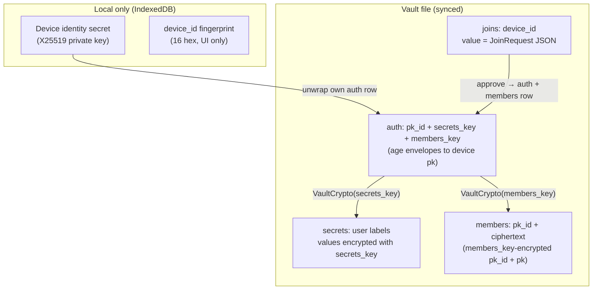

# Multi-Device Decentralized Auth Specification

Nook vaults use **`secrets_key`** to encrypt user secrets and **`members_key`** to encrypt member catalog entries. **Per-device X25519 identities** distribute both keys across devices via the `auth:` section. The vault file (`nook-vault.yaml`) is the source of truth.

**Related:** [ARCHITECTURE.md](../ARCHITECTURE.md) §4 (storage table), §3 (connect flow).

---

## 1. Goals

- **Multi-device E2E:** Any enrolled device can decrypt the same vault file from GitHub or local storage.
- **Zero-knowledge preserved:** Plaintext secrets and device private keys never leave the browser unencrypted.
- **Decentralized enrollment:** New devices join via records stored in the vault — no central account server.
- **Self-documenting vault keys:** On-disk field names describe what each key protects (`secrets_key`, `members_key`) — no acronym soup.

---

## 2. Key hierarchy



| Key | Purpose | Stored where |
|---|---|---|
| **secrets_key** | Symmetric key — encrypts all secret *values* in `secrets:` | Per-device age envelope in `auth.secrets_key` |
| **members_key** | Symmetric key — encrypts each `{pk_id, pk}` entry in `members:` | Per-device age envelope in `auth.members_key` |
| **Device identity** | X25519 keypair — unwraps this device's auth envelopes | IndexedDB only |
| **pk_id** | SHA256(public key), 64 hex | `auth:` row id and `members:` row id |

Both keys are generated together on genesis (`generate_vault_keys()`).

---

## 3. Vault file layout

| YAML section | Record shape | Meaning |
|---|---|---|
| `secrets:` | `key` + `value` | User passwords (`value` encrypted with `secrets_key`) |
| `auth:` | `pk_id` + `secrets_key` + `members_key` | Per-device age envelopes |
| `joins:` | `key` + `value` | Pending join (`key` = device_id) |
| `members:` | `pk_id` + `ciphertext` | One row per member; `members_key`-encrypted `{pk_id, pk}` |

### Example

```yaml
secrets:
- key: github.com
  value: |
    -----BEGIN AGE ENCRYPTED FILE-----
    ...

auth:
- pk_id: 7f3a9c2e1b8d4f6a8e0c3d5b2a1f9e4c7b6d8a0f2e1c3b5a7d9f0e2c4b6a8d0e2
  secrets_key: |
    -----BEGIN AGE ENCRYPTED FILE-----
    ...
  members_key: |
    -----BEGIN AGE ENCRYPTED FILE-----
    ...

joins:
- key: 26aa720ff5b4429c
  value: '{"device_id":"26aa720ff5b4429c","public_key":"age1...","requested_at":"2026-06-21T12:00:00Z"}'

members:
- pk_id: 7f3a9c2e1b8d4f6a...
  ciphertext: |
    -----BEGIN AGE ENCRYPTED FILE-----
    # plaintext JSON: {"pk_id":"7f3a...","pk":"age1..."}
    -----END AGE ENCRYPTED FILE-----
```

---

## 4. Design decisions

### 4.1 Explicit key names (not DEK/MEK/CEK…)

Field names mirror vault sections: **`secrets_key`** protects `secrets:`, **`members_key`** protects `members:`. Adding a future key (e.g. `messages_key`) follows the same pattern without new acronyms.

### 4.2 Auth `pk_id` = SHA256(public key)

Raw public keys are not stored in `auth:` — only SHA256(pk) as `pk_id`.

### 4.3 Join approval distributes both keys

The approver encrypts **both** `secrets_key` and `members_key` to the joiner's public key (from the pending join row), then adds a `members:` row for the joiner.

### 4.4 Shared members_key roster

Each `members:` row is one member, encrypted with the shared `members_key`. Any enrolled device can decrypt all rows after unwrapping `members_key` from its auth row.

---

## 5. Core API (`multi_device.rs`)

| Function | Role |
|---|---|
| `generate_vault_keys()` | Create `secrets_key` + `members_key` |
| `resolve_secrets_key()` / `resolve_members_key()` | Unwrap keys for current device |
| `approve_join_request(secrets_key, members_key, …)` | Auth row + members row for joiner |
| `ensure_self_in_roster()` | Self-heal missing members row on connect |

Rust retains `resolve_dek()` / `resolve_dec()` as thin aliases for `resolve_secrets_key()`.

---

## 6. Phase status

| Phase | Scope | Status |
|---|---|---|
| 5 | `secrets_key` + `members_key` auth, members roster | Done |
| 6 | OOB key transfer UX (copy from enrolled device) | Planned |
| 7 | Device-to-device messaging channel | Planned |

---

## 7. Optional password envelope (cross-link)

Devices may attach a **password envelope** to the vault — a second
unwrap path for the same `secrets_key` + `members_key`, gated by a
user-supplied password instead of (or in addition to) a per-device
X25519 identity. The envelope is the foundation of the one-step QR
join flow that bypasses `joins:` and approval altogether.

See [password-envelope.md](password-envelope.md) for the full spec,
threat model, and phase plan. Keys remain the default; the password
envelope is opt-in per vault.
