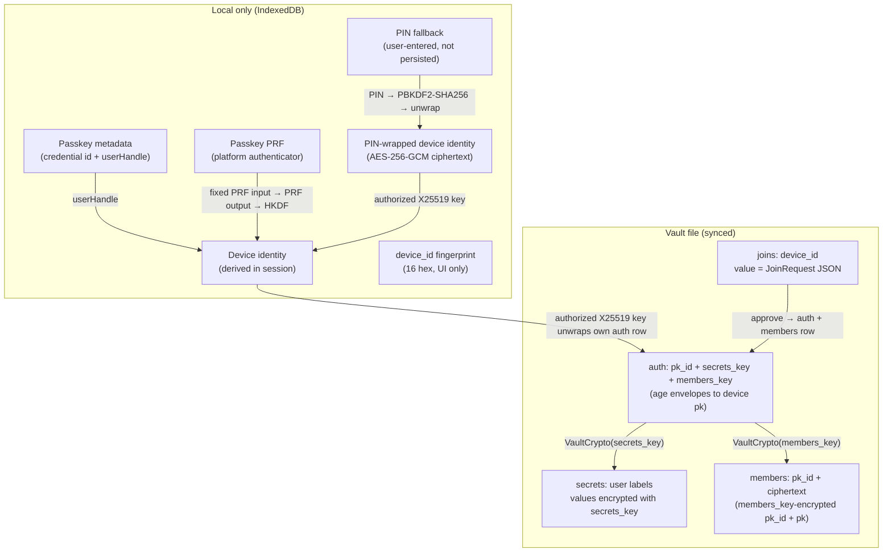

# Multi-Device Decentralized Auth Specification

Nook vaults use **`secrets_key`** to encrypt user secrets and **`members_key`** to encrypt member catalog entries. **Per-device X25519 identities** distribute both keys across devices via event-sourced auth metadata. The immutable event log (`nook-log/v1/events/`) is the provider source of truth; `nook-projection.yaml` is only the local projection/import format.

**Related:** [ARCHITECTURE.md](../ARCHITECTURE.md) §2 (`nook-auth2` boundary), §4 (storage table), §3 (connect flow), [slip39-recovery.md](slip39-recovery.md) (fixed 2-of-3 device quorum recovery).

---

## 1. Goals

- **Multi-device E2E:** Any enrolled device can decrypt the same vault file from GitHub or local storage.
- **Zero-knowledge preserved:** Plaintext secrets and device private keys never leave the browser unencrypted.
- **Decentralized enrollment:** New devices join via records stored in the vault — no central account server.
- **Self-documenting vault keys:** On-disk field names describe what each key protects (`secrets_key`, `members_key`) — no acronym soup.

---

## 2. Key hierarchy



| Key | Purpose | Stored where |
|---|---|---|
| **secrets_key** | Symmetric key — encrypts all secret *values* in `secrets:` | Per-device age envelope in `auth.secrets_key` |
| **members_key** | Symmetric key — encrypts each `{pk_id, pk}` entry in `members:` | Per-device age envelope in `auth.members_key` |
| **Device identity** | X25519 keypair — unwraps this device's auth envelopes | For passkey mode, derived in-session from WebAuthn PRF output + `userHandle`; for PIN fallback, AES-256-GCM ciphertext in IndexedDB |
| **Passkey PRF** | Produces the secret input used by HKDF to derive the device identity | Browser/platform authenticator; never persisted by Nook |
| **Passkey metadata** | Credential id, `userHandle`, and deterministic PRF input needed to re-prompt the passkey | IndexedDB `device_identity_wrapped`; no age secret ciphertext in passkey mode |
| **PIN fallback** | Local fallback secret for platforms that do not return WebAuthn PRF | User-entered at setup/unlock; never persisted by Nook |
| **pk_id** | SHA256(public key), 64 hex | `auth:` row id and `members:` row id |

Both keys are generated together on genesis (`generate_vault_keys()`).

For Sentinel genesis, the owner shares a `#sentinel-request=` invitation URL
containing only the signed public ceremony request. A participant opens that
URL on the device being enrolled, explicitly connects its locally protected
device identity, and returns a `#sentinel-response=` URL containing the signed,
session-bound public-key response. Rust validates and normalizes both URL
payloads; TypeScript only transports them and drives the browser UI. No vault is
persisted until every configured participant response has been verified and
the ceremony can be finalized atomically.

### 2.1 Local device-key protection

Before any provider credential or device-key operation, the browser runs
WebAuthn with required user verification and the PRF extension. Rust/WASM builds
the `navigator.credentials.create/get` option payloads with
`1Password/passkey-rs` `passkey-types`, including PRF extension inputs.
TypeScript owns only the browser platform call itself and extraction of the
returned PRF extension result; it passes the 32-byte PRF output to WASM. Rust
uses a versioned fixed PRF input for passkey mode, then derives the X25519 age
identity from the PRF output and the passkey `userHandle` with HKDF-SHA256. Nook
never stores a password or encryption key in WebAuthn `user.id`; the
`userHandle` is a non-secret account binding and HKDF salt.

Issue #201 proved the current browser boundary for `1Password/passkey-rs`:
`passkey-client` can run a WebAuthn client when Rust also owns an
`Authenticator`/`CredentialStore`, and its PRF support is useful for request
types. It cannot invoke the browser/OS platform passkey provider because
browsers expose that provider only through `navigator.credentials`. Nook must
therefore keep a thin TypeScript bridge for the real platform ceremony while
keeping option construction, wrapping, unwrapping, persistence, validation, and
zeroization in Rust/WASM/core.

For Rust tests and local tooling, Nook has an in-memory mock passkey
authenticator in `nook-auth2` behind the `mock-passkey` feature and normal unit
test builds. It stores resident credentials, requires an explicit
approval/denial for registration and assertion, scopes lookup by RP id, and
returns deterministic PRF output for the stored passkey. This emulator is only
a portable test/dev provider; production browser passkeys still enter through
`navigator.credentials`.

The passkey material workflow is Rust-owned: registration PRF fallback,
assertion request reconstruction, recovery metadata reconstruction, and unlock
device-id verification live in `nook-auth2` and are unit-tested with the mock
authenticator. `nook-wasm` should only adapt browser ceremonies and IndexedDB
I/O around those core helpers.

Passkey-backed Local Mode is deterministic: choosing the same discoverable Nook
passkey returns the same `userHandle`, and evaluating the PRF with Nook's fixed
domain-separated input returns the material needed to derive the same device
identity. This lets a user clear Nook's IndexedDB metadata, choose the existing
passkey again, and recover the same `device_id` without creating duplicate
`nokey.sh / Nook device` passkeys. The persisted passkey record stores only
prompting metadata (`credentialId`, `userHandle`, `prfInput`, `kdf`) and no
encrypted age secret.

Existing plaintext `device_identity_secret` records are migrated in place:
WASM replaces them with deterministic passkey metadata or a PIN-wrapped record,
then deletes the legacy plaintext. When WebAuthn PRF is unavailable, Nook offers
a local PIN-derived wrapping mode instead of returning to plaintext storage. PIN
mode uses a versioned `device_identity_wrapped` record with PBKDF2-SHA256
parameters authenticated by AES-256-GCM metadata. It protects passive
browser-storage copies from immediate plaintext key disclosure, but weak PINs
have offline guessing risk if an attacker copies IndexedDB. Forgetting the PIN
requires a destructive local identity reset; encrypted local vault blobs are
preserved, but saved sync credentials are removed because they were sealed to
the old identity.

### 2.2 Browser and authenticator support (2026-07-03)

PRF support is a property of the complete browser + OS + authenticator path,
not merely the presence of `PublicKeyCredential`. Nook therefore treats the
actual extension result as authoritative:

- Chromium implements WebAuthn PRF, but support still depends on the selected
  passkey provider, OS API, or CTAP2 authenticator.
- Safari added WebAuthn PRF in Safari 18 / iOS 18 / macOS 15.
- Firefox has PRF implementations on major desktop platforms, with documented
  platform/authenticator gaps (notably some macOS external-security-key paths).
- WebViews and mobile passkey providers vary. Nook does not maintain a
  user-agent allowlist.

At registration Nook prefers `getClientExtensionResults().prf.enabled ===
true`; at authorization it requires a 32-byte `prf.results.first` for PRF-backed
records. A missing WebAuthn API/provider method or a completed ceremony without
the required PRF result switches first-time setup to the PIN fallback and never
falls back to plaintext. Ceremony exceptions remain explicit because names such
as `NotSupportedError` and `NotAllowedError` cover ambiguous option,
authenticator, cancellation, and timeout failures. Origin/configuration errors
such as an invalid RP ID likewise remain explicit rather than silently
weakening device protection.
Returning browsers inspect the persisted
`device_identity_wrapped` version to choose passkey or PIN authorization without
user-agent guesses; browsers with no local passkey metadata can use the
discoverable passkey chooser to rebuild the deterministic passkey record.

References: [WebAuthn PRF specification](https://www.w3.org/TR/webauthn-3/#prf-extension),
[Chromium intent to ship](https://groups.google.com/a/chromium.org/g/blink-dev/c/iTNOgLwD2bI),
[Safari 18 release notes](https://webkit.org/blog/15865/webkit-features-in-safari-18-0/),
[Mozilla PRF tracking](https://bugzilla.mozilla.org/show_bug.cgi?id=1863819).

---

## 3. Vault file layout

| YAML section | Record shape | Meaning |
|---|---|---|
| `secrets:` | `key` + `value` | User passwords (`value` encrypted with `secrets_key`) |
| `auth:` | `pk_id` + `secrets_key` + `members_key` | Per-device age envelopes |
| `joins:` | `key` + `value` | Pending join (`key` = device_id) |
| `members:` | `pk_id` + `ciphertext` | One row per member; `members_key`-encrypted `{pk_id, pk, label?, enrolled_at?}` |

### Example

```yaml
secrets:
- key: github.com
  value: |
    -----BEGIN AGE ENCRYPTED FILE-----
    ...

auth:
- pk_id: 7f3a9c2e1b8d4f6a8e0c3d5b2a1f9e4c7b6d8a0f2e1c3b5a7d9f0e2c4b6a8d0e2
  secrets_key: |
    -----BEGIN AGE ENCRYPTED FILE-----
    ...
  members_key: |
    -----BEGIN AGE ENCRYPTED FILE-----
    ...

joins:
- key: 26aa720ff5b4429c
  value: '{"device_id":"26aa720ff5b4429c","public_key":"age1...","requested_at":"2026-06-21T12:00:00Z"}'

members:
- pk_id: 7f3a9c2e1b8d4f6a...
  ciphertext: |
    -----BEGIN AGE ENCRYPTED FILE-----
    # plaintext JSON: {"pk_id":"7f3a...","pk":"age1...","label":"Work laptop","enrolled_at":"2026-06-21T12:00:00Z"}
    -----END AGE ENCRYPTED FILE-----
```

---

## 4. Design decisions

### 4.1 Explicit key names (not DEK/MEK/CEK…)

Field names mirror vault sections: **`secrets_key`** protects `secrets:`, **`members_key`** protects `members:`. Adding a future key (e.g. `messages_key`) follows the same pattern without new acronyms.

### 4.2 Auth `pk_id` = SHA256(public key)

Raw public keys are not stored in `auth:` — only SHA256(pk) as `pk_id`.

### 4.3 Join approval distributes both keys

The approver encrypts **both** `secrets_key` and `members_key` to the joiner's public key (from the pending join row), then adds a `members:` row for the joiner.

### 4.4 Shared members_key roster

Each `members:` row is one member, encrypted with the shared `members_key`. Any enrolled device can decrypt all rows after unwrapping `members_key` from its auth row.

### 4.5 Device labels and revocation

Member rows may include an optional user-facing `label`. Labels are encrypted inside
the `members:` row, not stored in plaintext. Any enrolled device can rename any
member because all enrolled devices can unwrap `members_key`.

Revoking a member removes both:

- the member's `auth:` envelope, so that device can no longer unwrap
  `secrets_key` / `members_key`
- the matching encrypted `members:` roster row

Revoking the last enrolled device is blocked with: **Add another device or a
vault password before removing this one.** Revoking the current browser is
allowed only when at least one other enrolled device remains; after the write
succeeds, the current browser locks and must be re-enrolled or unlocked by
another valid path.

---

## 5. Auth API (`nook-auth2/src/auth/multi_device.rs`)

`nook-auth2` is the source of truth for these portable key-access primitives.
`nook-core` re-exports them for compatibility and adds event-log adapters where
core event types are required.

| Function | Role |
|---|---|
| `generate_vault_keys()` | Create `secrets_key` + `members_key` |
| `resolve_secrets_key()` / `resolve_members_key()` | Unwrap keys for current device |
| `approve_join_request(secrets_key, members_key, …)` | Auth row + members row for joiner |
| `ensure_self_in_roster()` | Self-heal missing members row on connect |
| `rename_vault_member(records, members_key, auth_id, label)` | Update an encrypted roster label |
| `revoke_vault_member(records, members_key, auth_id)` | Remove a member's `auth:` and `members:` rows |
| `deny_join_request(records, device_id)` | Drop a pending `joins:` row |

Rust retains `resolve_dek()` / `resolve_dec()` as thin aliases for `resolve_secrets_key()`.

---

## 6. Phase status

| Phase | Scope | Status |
|---|---|---|
| 5 | `secrets_key` + `members_key` auth, members roster | Done |
| 6 | Fixed 2-of-3 SLIP-0039 recovery via session-only QR exchange | Designed (#260); implementation split across #261-#265 |
| 7 | Device-to-device messaging channel | Planned |

---

## 7. Backup password unlock (cross-link)

Device keys remain the primary access path. Labelled backup password entries
coexist with `auth:` rows and wrap the same `secrets_key` + `members_key`, so a
lost browser can recover without weakening the device roster model. A device
that unlocks with a backup password self-enrols by writing its own `auth:` and
`members:` rows. See [password-envelope.md](password-envelope.md) for the full
spec and threat model.
