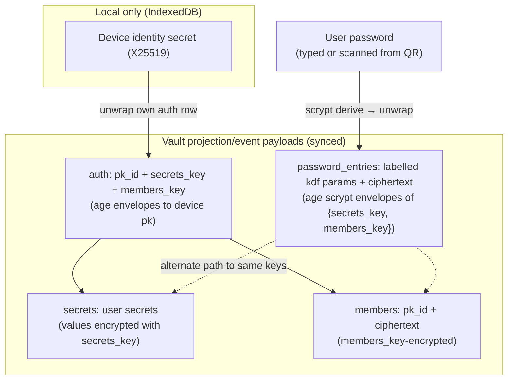

# Password Unlock & QR-Based Device Join

Current vaults keep **device-key auth as the baseline unlock path**:

- `VaultUnlock::Keys` — per-device X25519 envelopes in the `auth:` section
  plus the join/approve flow. This remains the default and can coexist with
  labelled backup password entries.
- `password_entries` — zero or more scrypt-wrapped envelopes of
  `{secrets_key, members_key}`. These provide backup unlock and QR/device
  enrolment without replacing device-key auth.
- `VaultUnlock::Password { envelope }` — legacy password-only vaults remain
  readable, but new backup passwords are written through `password_entries`
  alongside `auth:`.

Future modes (hardware token, social recovery, …) plug in through the same
unlock/credential model without changing encrypted secret payloads.

Password entries are the foundation of the one-step QR enrolment flow: an
enrolled device emits a QR containing `{auth_provider_creds, password}`; a new
device scans, decrypts the vault, adds itself to the members roster, and is
immediately a first-class member — no approval round-trip.

**Related:**
[decentralized-auth.md](decentralized-auth.md) §2 (key hierarchy),
[auth-providers.md](../design-docs/auth-providers.md) §3 (UI states),
[ARCHITECTURE.md](../ARCHITECTURE.md) §4 (storage table).

---

## 1. Goals

- **Device-key auth remains first-class.** New password backups augment
  `auth:` instead of replacing it; existing device-key unlock and approval
  flows continue to work.
- **Password unlock is reusable.** A `password_entries` item can unlock after
  sign-out, authorize QR enrolment, and sync changes across browsers using the
  same labelled credential.
- **One-step join** — a new device with the QR payload self-enrols
  without a second device confirming. No `joins:` row, no
  `JoinEnrollmentDialog`, no "approve on other device" hop.
- **No plaintext DEK exposure** — the QR carries a password, not the raw
  `secrets_key` / `members_key`. The shared secret is human-rotatable.
- **Reversible** — owner can remove password entries at any time to fall back
  to keys-only unlock for already enrolled devices.
- **Zero new trust assumptions** — password derivation runs entirely in
  the browser (Wasm); the password is never sent to any provider.

---

## 2. Key hierarchy (extended)



The password envelope and the per-device auth envelopes wrap **the same**
`secrets_key` + `members_key`. Either path yields identical keys; the
ciphertext under `secrets:` and `members:` is unchanged.

---

## 3. Vault file additions

Current device-key vaults keep `unlock:` omitted and add backup passwords as
top-level `password_entries`:

```yaml
# Keys mode (default) — `unlock:` omitted; device keys live in auth:
auth:
  - pk_id: device_public_key_id
    secrets_key: |
      -----BEGIN AGE ENCRYPTED FILE-----
      ...
    members_key: |
      -----BEGIN AGE ENCRYPTED FILE-----
      ...

password_entries:
  - id: password_entry_primary
    label: Recovery password
    version: 1
    kdf: scrypt
    work_factor: 18
    ciphertext: |
      -----BEGIN AGE ENCRYPTED FILE-----
      # plaintext JSON: {"secrets_key":"<32B base64>","members_key":"<32B base64>"}
      -----END AGE ENCRYPTED FILE-----
```

- **Hybrid storage.** Device-key vaults may contain both `auth:` and
  `password_entries`; the entries are alternate wraps for the same current
  vault keys.
- **Legacy migration.** Vaults written before `password_entries` may carry a
  top-level `password_envelope:` field or `unlock.type == password`. The
  deserialiser maps those values to password unlock entries where possible;
  the next write emits the current schema.
- Uses the **same `age` crate already in `nook-core`** —
  `age::scrypt::Recipient` for encryption and `age::scrypt::Identity` for
  decryption (see `nook-core/src/vault_crypto.rs`). No new crypto
  dependency, no separate scrypt crate, fully `wasm32-unknown-unknown`
  compatible. The salt and work factor are embedded in the age header,
  so the `kdf` / `work_factor` YAML hints are redundant — kept only for
  tooling/visibility.
- **Work factor differs from the existing per-record encryption.**
  `VaultCrypto` uses `log_n = 15` because its passphrase is a 128-bit
  random hex string (no brute-force surface). The password envelope's
  passphrase is human-chosen, so it must use age's default ~1 s target
  (`log_n ≈ 18`) via `Recipient::set_work_factor(18)` — _do not_ reuse
  the `PROGRAMMATIC_SCRYPT_LOG_N` constant here.
- Plaintext under the envelope is a compact JSON object — never the full
  vault, never any user secret values.

### Credential effects

| Operation                   | Effect                                                                                                                |
| --------------------------- | --------------------------------------------------------------------------------------------------------------------- |
| Add password entry          | Appends a labelled `password_entries` item; keeps `auth:`, `joins:`, and the current device-key unlock path.          |
| Rotate password entry       | Starts a new key epoch, rewraps live vault keys for remaining credentials, and updates the selected entry.            |
| Remove password entry       | Starts a new key epoch and removes that password's future access while preserving enrolled devices.                   |
| Legacy password-only unlock | Reads the old envelope, writes/refreshes this device's `auth:` row, and imports the current state into the event log. |

### Existing sections

`secrets:`, `members:`, `auth:`, and `joins:` keep their schemas. Backup
passwords are additive credentials; approval-based joins remain available as
the fallback for vaults without a suitable password entry.

---

## 4. Flows

### 4.1 Add backup password

```
[Svelte] → VaultState.addVaultPassword(label, password)
         → NookVaultManager.addVaultPassword(label, password)
              → resolve current secrets_key + members_key
              → derive scrypt recipient(password)
              → age-encrypt {secrets_key, members_key}
              → append PasswordAdded event
              → persist projection + queue provider outbox
```

Precondition: the device is already unlocked and enrolled. Postcondition:
device-key unlock still works, and the new labelled password can unlock or
enrol another device.

`setVaultPassword(password)` remains as a compatibility wrapper that creates a
default-labelled entry.

### 4.2 Rotate or remove backup password

```
[Svelte] → updateVaultPasswordEntry/removeVaultPasswordEntry
         → NookVaultManager.rotate_security_epoch(...)
              → fresh secrets_key + members_key
              → re-encrypt live secrets
              → rewrap auth/member/password credentials for remaining access
              → append epoch checkpoint event
```

Rotation/removal is an event-log security operation. Old password material may
still decrypt historical data it was authorized to see, but it cannot decrypt
future epoch checkpoints/events.

### 4.3 QR-based device join

QR payload (JSON, then base64url, then a single-frame QR/link):

```json
{
  "v": 1,
  "provider": {
    "type": "github",
    "pat": "<token>",
    "repo": "user/nook-vault"
  },
  "password_entry_id": "password_entry_primary",
  "password": "<password>",
  "issued_at": "2026-06-23T07:00:00Z"
}
```

The payload carries provider credentials plus the selected backup password, not
raw vault keys. A joining device saves provider credentials, calls
`connectWithPassword(mode, creds, entry_id, password)`, unwraps the entry,
generates its own device identity/signing key, writes its `auth:`/`members:`
rows, imports/appends through the event log, and opens the vault.

No `joins:` row is created. No approval is needed. The new device is
immediately a first-class member.

### 4.4 Password unlock without QR

On the login screen a user may pick a labelled backup password and type it
directly:

```
[Svelte] LoginGate
        → VaultState.unlockWithPassword(entry_id, password)
        → NookVaultManager.connectWithPassword(provider_creds, entry_id, password)
```

On an already-enrolled device the call refreshes this device's auth row from
the password-resolved keys when needed. On a new device it follows the same
self-enrolment path as QR.

---

## 5. Security model

### 5.1 Threat coverage

| Threat                                                 | Mitigation                                                                                                                                                        |
| ------------------------------------------------------ | ----------------------------------------------------------------------------------------------------------------------------------------------------------------- |
| QR captured in transit (screen photo, MITM screenshot) | Rotate/remove the selected password entry; old codes stop unwrapping future epoch keys. Provider PAT scope is user-controlled and can be revoked at the provider. |
| Weak password brute force on leaked vault data         | Scrypt work factor >=18 (age default, around 1s on a laptop). UI blocks empty/typo entries and encourages generated passwords.                                    |
| Stolen vault file alone                                | `secrets:` ciphertext remains bound to `secrets_key`; password entries add a brute-force path gated by scrypt cost.                                               |
| Compromise of one device                               | Device revocation and password removal are event-log security operations that rotate future epoch keys.                                                           |
| Password reuse across services                         | UI warns and recommends generating a random password.                                                                                                             |

### 5.2 Non-goals

- Password is not per-secret access control. It unlocks the whole vault.
- No server-side password verification — the only check is whether the
  scrypt-derived key decrypts the selected entry.
- Historical access cannot be retroactively erased from a device/password that
  legitimately held old epoch keys.

### 5.3 Required UI guardrails

- Adding a password warns that anyone with that password and provider
  credentials can read the vault.
- Issuing an enrolment code requires re-typing the selected password, verified
  locally against the entry before QR/link rendering.
- Security conflicts from concurrent epoch rotations fail closed for local
  edits until the event projection converges or is explicitly recovered.

---

## 6. Core API (`nook-core`)

| Item                                                                                 | Role                                                        |
| ------------------------------------------------------------------------------------ | ----------------------------------------------------------- |
| `PasswordUnlockEntry`                                                                | Labelled backup credential stored in `password_entries`.    |
| `attach_password_envelope(keys, password) -> PasswordEnvelope`                       | Build the scrypt/age envelope for current vault keys.       |
| `resolve_keys_from_entry(entry, password) -> VaultKeys`                              | Unwrap a selected entry for password unlock/enrolment.      |
| `verify_password_entry(entry, password) -> bool`                                     | Side-effect-free password check.                            |
| `serialize_stored_yaml_with_unlock_and_name(records, unlock, password_entries, ...)` | Writes hybrid `auth:` + `password_entries` projection YAML. |
| `read_vault_password_entries(yaml)`                                                  | Reads current entries and legacy password-envelope fields.  |
| `VaultOperation::{PasswordAdded, PasswordRotated, PasswordRemoved}`                  | Event-log operations for password credential changes.       |

All scrypt work happens in `nook-core` (pure Rust, Wasm-compatible).

---

## 7. WASM bridge additions (`nook-wasm`)

| Method                                                          | Role                                                                |
| --------------------------------------------------------------- | ------------------------------------------------------------------- |
| `vaultUnlockMode() -> "keys"`                                   | Device keys remain the primary mode; password entries are additive. |
| `listVaultPasswordEntries()` / `fetchVaultPasswordEntries(...)` | Surface labelled password choices to login/settings/onboarding.     |
| `addVaultPassword(label, password)`                             | Add a new backup password entry.                                    |
| `updateVaultPasswordEntry(entry_id, password)`                  | Rotate one entry and start a new key epoch.                         |
| `removeVaultPasswordEntry(entry_id)`                            | Remove one entry and start a new key epoch.                         |
| `verifyVaultPassword(entry_id, password)`                       | Local password check for QR issuance and login UX.                  |
| `connectWithPassword(mode, creds, entry_id, password)`          | Self-enrol/unlock via a selected password entry.                    |

---

## 8. Phase plan

| Phase | Scope                                                                     | Status |
| ----- | ------------------------------------------------------------------------- | ------ |
| P0    | Spec, design review, threat model sign-off                                | Done   |
| P1    | `nook-core`: envelope format, hybrid YAML serde, unit tests               | Done   |
| P2    | `nook-wasm`: add/update/remove/list/verify/connect password entry APIs    | Done   |
| P3    | `nook-web`: labelled vault passwords for settings, onboarding, and login  | Done   |
| P4    | Authenticated **Onboard** page, QR/link issuer, paste-to-enrol login flow | Done   |
| P5    | E2E tests: QR/deep-link enrolment across browser contexts                 | Done   |

Authenticated UI contract: the bottom nav exposes **Onboard** between **Vault**
and **Settings**. It is a standalone page with provider and password-entry
selectors plus one primary **Onboard Device** button. The user re-types the
selected password before generating the QR/link. The QR payload contains
provider credentials and the selected password, not raw vault keys.

---

## 9. Open questions

- **KDF choice — settled.** Scrypt via the existing `age` crate
  (`age::scrypt::{Recipient, Identity}`) is the only option that keeps us
  inside a single audited crypto dependency and stays Wasm-compatible.
- **Work factor tuning:** target around 1s on a 2024 mid-tier laptop. The
  work factor is stored per entry so future hardware can be retuned without
  client lockout.
- **Multi-provider QR payloads.** Today a code carries one provider's
  credentials. Future: emit every active provider the issuer has, so the
  joining device adopts the full provider set in one step (foundation for the
  multi-provider replication phase in [auth-providers.md](../design-docs/auth-providers.md) §5).
