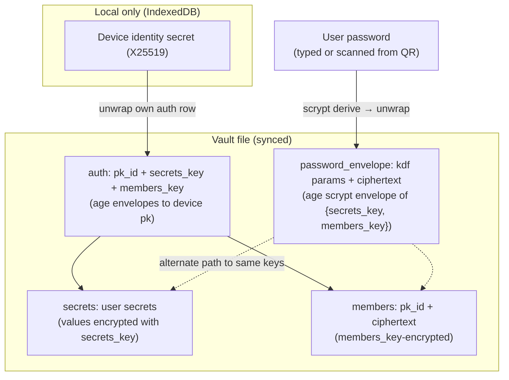

# Password Unlock & QR-Based Device Join

A vault selects **exactly one** unlock method via the `VaultUnlock` enum:

- `VaultUnlock::Keys` — per-device X25519 envelopes in the `auth:` section
  plus the join/approve flow. The historical default.
- `VaultUnlock::Password { envelope }` — a single scrypt-wrapped envelope of
  `{secrets_key, members_key}`. Any device that knows the password can
  self-enrol; no per-device auth rows exist.

Future modes (hardware token, social recovery, …) plug in as new variants
without touching the storage layout.

Password mode is the foundation of the one-step QR enrolment flow: an
enrolled device emits a QR containing `{auth_provider_creds, password}`;
a new device scans, decrypts the vault, adds itself to the members
roster, and is immediately a first-class member — no approval round-trip.

**Related:**
[decentralized-auth.md](decentralized-auth.md) §2 (key hierarchy),
[auth-providers.md](../design-docs/auth-providers.md) §3 (UI states),
[ARCHITECTURE.md](../ARCHITECTURE.md) §4 (storage table).

---

## 1. Goals

- **Unlock mode is a first-class, mutually-exclusive choice.** The vault
  picks one variant of `VaultUnlock` and that variant alone governs how
  the vault keys are unwrapped. No half-states, no "both at once".
- **Password unlock is reusable.** Once a vault is in password mode, the
  password is the unlock primitive everywhere: first-time join, re-unlock
  after sign-out, syncing changes across browsers — same single
  credential.
- **One-step join** — a new device with the QR payload self-enrols
  without a second device confirming. No `joins:` row, no
  `JoinEnrollmentDialog`, no "approve on other device" hop.
- **No plaintext DEK exposure** — the QR carries a password, not the raw
  `secrets_key` / `members_key`. The shared secret is human-rotatable.
- **Reversible** — owner can remove the password envelope at any time to
  fall back to keys-only mode.
- **Zero new trust assumptions** — password derivation runs entirely in
  the browser (Wasm); the password is never sent to any provider.

---

## 2. Key hierarchy (extended)



The password envelope and the per-device auth envelopes wrap **the same**
`secrets_key` + `members_key`. Either path yields identical keys; the
ciphertext under `secrets:` and `members:` is unchanged.

---

## 3. Vault file additions

A new top-level YAML section names the active unlock mode using a tagged
union:

```yaml
# Keys mode (historical default)
unlock:
  type: keys

# Password mode (mutex with keys: no auth: section, no joins: section)
unlock:
  type: password
  envelope:
    version: 1
    kdf: scrypt
    work_factor: 18
    ciphertext: |
      -----BEGIN AGE ENCRYPTED FILE-----
      # plaintext JSON: {"secrets_key":"<32B base64>","members_key":"<32B base64>"}
      -----END AGE ENCRYPTED FILE-----
```

- **Strict mutex.** The serialiser refuses to emit `auth:` or `joins:`
  rows when `unlock.type == password`, and vice versa: `unlock.envelope`
  is only present in password mode.
- **Legacy migration.** Vaults written before the enum carry a top-level
  `password_envelope:` field. The deserialiser maps that onto
  `VaultUnlock::Password` on read; the next write emits the new schema
  and drops the legacy field.
- Uses the **same `age` crate already in `nook-core`** —
  `age::scrypt::Recipient` for encryption and `age::scrypt::Identity` for
  decryption (see `nook-core/src/vault_crypto.rs`). No new crypto
  dependency, no separate scrypt crate, fully `wasm32-unknown-unknown`
  compatible. The salt and work factor are embedded in the age header,
  so the `kdf` / `work_factor` YAML hints are redundant — kept only for
  tooling/visibility.
- **Work factor differs from the existing per-record encryption.**
  `VaultCrypto` uses `log_n = 15` because its passphrase is a 128-bit
  random hex string (no brute-force surface). The password envelope's
  passphrase is human-chosen, so it must use age's default ~1 s target
  (`log_n ≈ 18`) via `Recipient::set_work_factor(18)` — *do not* reuse
  the `PROGRAMMATIC_SCRYPT_LOG_N` constant here.
- Plaintext under the envelope is a compact JSON object — never the full
  vault, never any user secret values.

### Mode-switch effects

| From → To | Effect |
|---|---|
| Keys → Password | All `auth:` rows are dropped; pending `joins:` are dropped; envelope is added; `members:` roster is preserved. Every device must now unlock with the password. |
| Password → Keys | Envelope is dropped; a fresh `auth:` row is written for **this** device only. Other devices must re-enrol via the standard join/approve flow. |

### Existing sections

`secrets:` and `members:` keep their schemas in both modes. `auth:` and
`joins:` exist **only** in keys mode (see
[decentralized-auth.md](decentralized-auth.md) §3).

---

## 4. Flows

### 4.1 Set password (existing member)

```
[Svelte] → VaultState.setVaultPassword(password)
         → NookVaultManager.set_password(password)
              → resolve_secrets_key() + resolve_members_key() from auth row
              → derive scrypt recipient(password)
              → age-encrypt {secrets_key, members_key} → password_envelope
              → write vault to storage
```

Preconditions: device is already enrolled (has its own `auth:` row).
Postcondition: `password_envelope:` present; any device with the password
can now self-enroll.

### 4.2 Rotate password

Same as 4.1 — re-encrypt the same `secrets_key` + `members_key` with a new
password. The underlying DEK / MEK are **not** rotated by a password change.
Full key rotation is a separate operation (out of scope for this spec).

### 4.3 Remove password envelope

```
[Svelte] → VaultState.removeVaultPassword()
         → NookVaultManager.remove_password()
              → drop password_envelope section
              → write vault
```

Vault returns to keys-only mode.

### 4.4 QR-based device join (the headline use case)

QR payload (JSON, then base64url, then a single-frame QR):

```json
{
  "v": 1,
  "provider": {
    "type": "github",
    "pat": "<token>",
    "repo": "user/nook-vault"
  },
  "password": "<password>"
}
```

The payload **carries the storage provider's credentials** (e.g. GitHub
PAT and repo) so the joining device needs zero manual configuration —
no token to copy, no repo URL to retype. A vault stored locally
(IndexedDB) issues `{ "type": "local" }` and the joining device just
materialises a fresh local vault unlocked with the password.

Payloads do **not** carry an expiration: the vault password is the
long-lived credential and is the source of truth for revocation. If a
QR is suspected leaked, rotate the password — old codes stop
decrypting the envelope and are useless.

New device flow:

```
[Svelte] scan QR → parse + validate expires_at
        → save provider credentials in nook_auth (active provider)
        → NookVaultManager.connect_with_password(provider, password)
              → fetch vault file via provider creds
              → derive scrypt identity(password)
              → unwrap password_envelope → {secrets_key, members_key}
              → generate this-device X25519 keypair (IndexedDB)
              → encrypt secrets_key + members_key to own pk → new auth row
              → encrypt {pk_id, pk} with members_key → new members row
              → write vault back via provider
              → VaultCrypto::new(secrets_key) → decrypt session
```

No `joins:` row is created. No approval is needed. The new device is
immediately a first-class member.

### 4.5 Password-only unlock (no QR)

A user who already trusts a device may type the password directly on any
device — fresh or already-enrolled. UX path on the login screen:

```
[Svelte] LoginGate → "Unlock with vault password instead"
        → user picks (or has) an active provider and types the password
        → VaultState.unlockWithPassword(password)
              → NookVaultManager.connectWithPassword(provider_creds, password)
```

The password unlock is a **first-class login method**, not just a
one-time bootstrap. On an already-enrolled device the call re-writes
this device's own auth row from the password-resolved keys (no-op for
correctly-enrolled devices); on an unknown device it self-enrols
identically to the QR flow.

---

## 5. Security model

### 5.1 Threat coverage

| Threat | Mitigation |
|---|---|
| QR captured in transit (screen photo, MITM screenshot) | The user rotates the password — old codes stop decrypting the envelope. Provider PAT scope is user-controlled and can be revoked at GitHub. |
| Weak password brute force on a leaked vault file | Scrypt work factor ≥18 (age default ≈ 1s on a laptop). UI enforces a minimum entropy floor (12 chars). |
| Stolen vault file alone | Same as today — `secrets:` ciphertext is bound to `secrets_key`; password envelope adds a brute-force path that is gated by scrypt cost. |
| Compromise of one device | That device's `auth:` row can be removed by any other enrolled device (future revocation work); password can be rotated independently. |
| Password reuse across services | UI warns and recommends generating a random password; password manager irony noted in copy. |

### 5.2 Non-goals

- Password is **not** a recovery mechanism for a vault whose `auth:` rows
  are all lost. If the password envelope is absent and no device retains
  its identity, the vault is unrecoverable — same as today.
- Password is **not** a per-secret access control. It unlocks the entire
  vault, identical to the existing keys.
- No server-side password verification — the only check is "does the
  scrypt-derived key decrypt the envelope".

### 5.3 Required UI guardrails

- Setting a password shows a clear warning: *"Anyone with the password
  and your storage provider credentials can read the entire vault."*
- Issuing an enrollment code requires re-typing the vault password,
  which is verified locally against the envelope before the payload is
  ever rendered. This guards against an unattended-device drive-by.
- Rotating the password invalidates **every** outstanding enrollment
  code in one operation. This is the primary revocation primitive — no
  per-code TTL is needed.

---

## 6. Core API (`nook-core`)

| Item | Role |
|---|---|
| `enum VaultUnlock { Keys, Password { envelope } }` | The single source of truth for which unlock variant the vault is in. Serialised as a YAML tagged union (`type: keys` / `type: password`). |
| `attach_password_envelope(keys, password) -> PasswordEnvelope` | Build the envelope from already-resolved `secrets_key` + `members_key`. |
| `resolve_keys_from_password(envelope, password) -> VaultKeys` | Inverse of attach; used during password unlock and QR enrolment. |
| `verify_password(envelope, password) -> bool` | Side-effect-free password check (does not expose the unwrapped keys). |
| `serialize_stored_yaml_with_unlock(records, unlock) -> String` | Mutex-enforcing serialiser: drops `auth:` / `joins:` in password mode. |
| `deserialize_stored_yaml_with_unlock(yaml) -> (records, VaultUnlock)` | Reads the modern schema; auto-migrates legacy `password_envelope:` top-level fields. |
| `read_vault_unlock(yaml) -> VaultUnlock` | Cheap helper for "is this vault password-mode?" without unwinding records. |

All scrypt work happens in `nook-core` (pure Rust, Wasm-compatible).

---

## 7. WASM bridge additions (`nook-wasm`)

| Method | Role |
|---|---|
| `vaultUnlockMode() -> "keys" \| "password"` | Mode tag for UI routing. |
| `setVaultPassword(password)` | Switch the vault to password mode: build the envelope from the active session keys, drop every `auth:` row and pending `joins:`, save. |
| `removeVaultPassword()` | Switch back to keys mode: write this device's own `auth:` row from session keys, drop the envelope, save. |
| `verifyVaultPassword(password) -> bool` | Local password check; returns false in keys mode. |
| `connectWithPassword(mode, creds, password)` | Self-enrolment via password: fetch, unwrap envelope, add this device to `members:`, save. Errors in keys mode. |

The keys-mode `connect()` short-circuits with a clear error when the
vault is in password mode (and `assess_vault_connect()` returns
`"password_required"` so the UI can offer the password-unlock affordance
proactively).

---

## 8. Phase plan

| Phase | Scope | Status |
|---|---|---|
| P0 | Spec, design review, threat model sign-off | Done |
| P1 | `nook-core`: envelope format (`password_envelope.rs`), YAML serde round-trip, unit tests | Done |
| P2 | `nook-wasm`: `setVaultPassword` / `removeVaultPassword` / `hasPasswordEnvelope` / `verifyVaultPassword` / `connectWithPassword` | Done |
| P3 | `nook-web`: `VaultPasswordCard` (set / rotate / remove) in **Vault info** settings | Done |
| P4 | `nook-web`: enrollment-code issuer with QR + paste-to-enroll on `LoginGate`. (Live camera scanning deferred — paste/scan-via-phone path covers desktop browsers without camera APIs.) | Done |
| P5 | E2E tests: QR round-trip across two browser contexts | Planned |

The approval-based join (`joins:` + `JoinEnrollmentDialog`) remains
available as the fallback for vaults that opt out of the password envelope.

---

## 9. Open questions

- **KDF choice — settled.** Scrypt via the existing `age` crate
  (`age::scrypt::{Recipient, Identity}`) is the only option that keeps us
  inside a single audited crypto dependency and stays Wasm-compatible
  (same primitive `vault_crypto.rs` uses today). Argon2id would require
  a new crate and a non-age envelope format, which is out of scope.
- **Work factor tuning:** target ~1 s on a 2024 mid-tier laptop. Make it
  a per-vault stored field so future hardware can be re-tuned without
  client lockout.
- **QR size budget:** with PAT (~40 chars) + repo + password + metadata,
  payload should fit in a single frame at error correction level Q.
  Confirm during P4.
- **Multi-provider QR payloads.** Today a code carries one provider's
  credentials. Future: emit a payload containing every active provider
  the issuer has, so the joining device adopts the full provider set in
  one step (foundation for the multi-provider replication phase in
  [auth-providers.md](../design-docs/auth-providers.md) §5).

