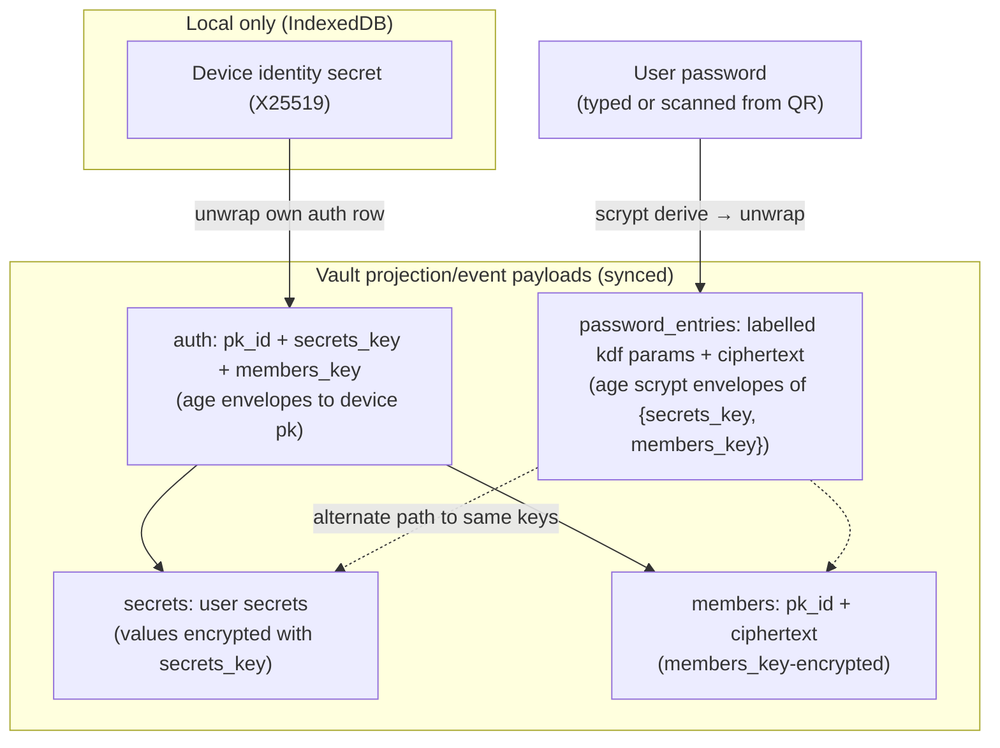

# Password Unlock & QR-Based Device Join

## Relationships

- [Nook System Architecture Specification](../ARCHITECTURE.md)
  - Defines system-wide package ownership, dependency flow, storage, and execution boundaries.
  - Read before changing a durable cross-component boundary.
- [Auth Providers, Sync, and Login UX](../design-docs/auth-providers.md)
  - Defines provider credential persistence, login UX, and provider transport boundaries.
  - Read before changing the related architecture or security boundary.
- [Multi-Device Decentralized Auth Specification](decentralized-auth.md)
  - Defines multi-device keys, enrollment, approval, revocation, and vault authorization.
  - Read when this document touches the related product behavior or user flow.
- [SLIP-0039 Device Quorum Recovery](slip39-recovery.md)
  - Defines fixed-quorum device recovery and its session-only QR exchange.
  - Read when this document touches the related product behavior or user flow.
- [Nook Coding Rules & Golden Principles](../rules.md)
  - Defines the repository-wide implementation, testing, tooling, and delivery constraints.
  - Apply throughout implementation and review.

## Document map

- [Overview](#overview)
  - Establishes device-key unlock as the baseline and backup passwords as additional envelopes.
  - Read before changing vault unlock or credential storage.
- [1. Goals](#1-goals)
  - Defines recoverability, compatibility, and auditability goals for backup passwords.
  - Read when evaluating a password-envelope design or implementation.
- [2. Key hierarchy (extended)](#2-key-hierarchy-extended)
  - Defines how device and password credentials wrap vault key material.
  - Read before changing KDF, wrapping, key epochs, or credential authority.
- [3. Vault file additions](#3-vault-file-additions)
  - Adds `password_entries` while preserving the existing device-key vault schema.
  - Read before changing the persisted vault format or migration behavior.
  - [Envelope migration](#envelope-migration)
    - Defines the event-log migration from legacy password-only metadata.
    - Read before changing password-envelope schema compatibility.
  - [Credential effects](#credential-effects)
    - Defines the key-rotation effects of adding, rotating, and removing a password.
    - Read before implementing credential mutation.
  - [Existing sections](#existing-sections)
    - Preserves the schemas of `secrets`, `members`, `auth`, and `joins`.
    - Read when assessing compatibility with existing vault files.
- [4. Flows](#4-flows)
  - Collects backup-password lifecycle, device-join, and direct-unlock flows.
  - Read before changing credential UX or state transitions.
  - [4.1 Add backup password](#41-add-backup-password)
    - Sequences password derivation, wrapping, epoch rotation, and persistence.
    - Read when implementing password enrollment.
  - [4.2 Rotate or remove backup password](#42-rotate-or-remove-backup-password)
    - Defines credential replacement and removal with mandatory key rotation.
    - Read when implementing password maintenance or revocation.
  - [4.3 QR-based device join](#43-qr-based-device-join)
    - Defines the invitation payload and proof sequence for adding a device.
    - Read when changing QR pairing or join authorization.
  - [4.4 Password unlock without QR](#44-password-unlock-without-qr)
    - Defines provider-based vault discovery and direct backup-password unlock.
    - Read when implementing recovery without an existing device.
- [5. Security model](#5-security-model)
  - Defines the threat boundary, exclusions, and mandatory user guardrails.
  - Read before approving security or UX changes to password access.
  - [5.1 Threat coverage](#51-threat-coverage)
    - Maps credential theft, offline guessing, replay, and revocation threats to controls.
    - Read when reviewing cryptographic or authorization coverage.
  - [5.2 Non-goals](#52-non-goals)
    - Excludes per-secret access control and server-side password recovery.
    - Read when deciding whether a proposed capability belongs here.
  - [5.3 Required UI guardrails](#53-required-ui-guardrails)
    - Requires explicit warnings, confirmation, labels, and recovery guidance.
    - Read before implementing password-access UI.
- [6. Auth API (nook-auth2)](#6-auth-api-nook-auth2)
  - Assigns password-entry validation and key access to `nook-auth2`.
  - Read before changing the Rust authentication API.
- [7. WASM bridge additions (nook-wasm)](#7-wasm-bridge-additions-nook-wasm)
  - Defines typed WASM operations for password and device-join flows.
  - Read before exposing authentication behavior to the web layer.
- [8. Phase plan](#8-phase-plan)
  - Sequences specification, Rust domain work, WASM bindings, UI, and hardening.
  - Read when assessing delivery status or planning the next slice.
- [9. Open questions](#9-open-questions)
  - Records settled decisions for KDF, limits, rotation, and invitation expiry.
  - Read before reopening a password-envelope design choice.

## Overview

Current vaults keep **device-key auth as the baseline unlock path**:

- `VaultUnlock::Keys` — per-device X25519 envelopes in the `auth:` section
  plus the join/approve flow. This remains the default and can coexist with
  labelled backup password entries.
- `password_entries` — zero or more scrypt-wrapped envelopes of
  `{secrets_key, members_key}`. These provide backup unlock and QR/device
  enrolment without replacing device-key auth.

Future modes (hardware token, SLIP-0039 device quorum recovery, …) plug in
through the same unlock/credential model without changing encrypted secret
payloads. See [slip39-recovery.md](slip39-recovery.md) for the fixed 2-of-3
device recovery design.

Password entries are the foundation of the one-step QR enrolment flow.
An enrolled device emits a QR containing `{auth_provider_creds, password}`.
A new device scans the QR.
It decrypts the vault.
It adds itself to the members roster.
It is immediately a first-class member.
There is no approval round-trip.

**Related:**
[decentralized-auth.md](decentralized-auth.md) §2 (key hierarchy),
[auth-providers.md](../design-docs/auth-providers.md) §3 (UI states),
[ARCHITECTURE.md](../ARCHITECTURE.md) §4 (storage table).

---

## 1. Goals

- **Device-key auth remains first-class.** New password backups augment
  `auth:` instead of replacing it; existing device-key unlock and approval
  flows continue to work.
- **Password unlock is reusable.** A `password_entries` item can unlock after
  sign-out, authorize QR enrolment, and sync changes across browsers using the
  same labelled credential.
- **One-step join** — a new device with the QR payload self-enrols
  without a second device confirming. No `joins:` row, no
  `JoinEnrollmentDialog`, no "approve on other device" hop.
- **No plaintext DEK exposure** — the QR carries a password, not the raw
  `secrets_key` / `members_key`. The shared secret is human-rotatable.
- **Reversible** — owner can remove password entries at any time to fall back
  to keys-only unlock for already enrolled devices.
- **Zero new trust assumptions** — password derivation runs entirely in
  the browser (Wasm); the password is never sent to any provider.

---

## 2. Key hierarchy (extended)


```mermaid
flowchart TB
  subgraph local["Local only (IndexedDB)"]
    DI["Device identity secret (X25519)"]
  end

  subgraph vault_file["Vault projection/event payloads (synced)"]
    AUTH["auth: pk_id + secrets_key + members_key<br/>(age envelopes to device pk)"]
    PWENV["password_entries: labelled kdf params + ciphertext<br/>(age scrypt envelopes of {secrets_key, members_key})"]
    SEC["secrets: user secrets<br/>(values encrypted with secrets_key)"]
    MEM["members: pk_id + ciphertext<br/>(members_key-encrypted)"]
  end

  PASS["User password<br/>(typed or scanned from QR)"]

  DI -->|"unwrap own auth row"| AUTH
  PASS -->|"scrypt derive → unwrap"| PWENV
  AUTH --> SEC
  AUTH --> MEM
  PWENV -.->|"alternate path to same keys"| SEC
  PWENV -.-> MEM
```

The password envelope and the per-device auth envelopes wrap **the same**
`secrets_key` + `members_key`. Either path yields identical keys; the
ciphertext under `secrets:` and `members:` is unchanged.

---

## 3. Vault file additions

Current device-key vaults keep `unlock:` omitted and add backup passwords as
top-level `password_entries`:

```yaml
# Keys mode (default) — `unlock:` omitted; device keys live in auth:
auth:
  - pk_id: device_public_key_id
    secrets_key: |
      -----BEGIN AGE ENCRYPTED FILE-----
      ...
    members_key: |
      -----BEGIN AGE ENCRYPTED FILE-----
      ...

password_entries:
  - id: password_entry_primary
    label: Recovery password
    version: 2
    kdf: scrypt
    work_factor: 18
    recipient: age1...
    ciphertext: |
      -----BEGIN AGE ENCRYPTED FILE-----
      # password-wrapped X25519 credential identity
      -----END AGE ENCRYPTED FILE-----
    wrapped_keys: |
      -----BEGIN AGE ENCRYPTED FILE-----
      # vault keys encrypted to recipient
      -----END AGE ENCRYPTED FILE-----
```

- **Hybrid storage.** Device-key vaults may contain both `auth:` and
  `password_entries`; the entries are alternate wraps for the same current
  vault keys.
- Uses the **same `age` crate already in `nook-core`**.
  - Scrypt protects a per-credential X25519 identity.
  - `wrapped_keys` encrypts the current vault keys to that identity's public
    recipient.
  - Epoch rotation can replace `wrapped_keys` without knowing the password.
  - No new crypto dependency.
  - No separate scrypt crate.
  - Fully `wasm32-unknown-unknown` compatible.
  - The salt and work factor are embedded in the age header.
  - The `kdf` / `work_factor` YAML hints are redundant — kept only for
    tooling/visibility.
- **Work factor differs from the existing per-record encryption.**
  - `VaultCrypto` uses `log_n = 15` because its passphrase is a 128-bit
    random hex string (no brute-force surface).
  - The password envelope's passphrase is human-chosen.
  - It must use age's default ~1 s target (`log_n ≈ 18`) via
    `Recipient::set_work_factor(18)`.
  - _Do not_ reuse the `PROGRAMMATIC_SCRYPT_LOG_N` constant here.
- Plaintext under `wrapped_keys` is a compact vault-key JSON object. It never
  contains the full vault or user secret values.

### Envelope migration

- Version 1 remains readable but cannot be rewrapped without its password.
- New and rotated entries use version 2.
- Updating a version-1 entry first writes a sequential, non-epoch
  `PasswordEnvelopeUpgraded` event with the current vault keys.
- Each surviving version-1 entry is upgraded independently while the vault is
  unlocked with that entry's password.
- Rotation remains unavailable while any surviving version-1 entry remains.
- A later password update or removal rotates the epoch only after every
  surviving entry is version 2.
- Checkpoints replace entries with version-2 envelopes for the new keys.

### Credential effects

| Operation             | Effect                                                                                                       |
| --------------------- | ------------------------------------------------------------------------------------------------------------ |
| Add password entry    | Appends a labelled `password_entries` item; keeps `auth:`, `joins:`, and the current device-key unlock path. |
| Rotate password entry | Starts a new key epoch, rewraps live vault keys for remaining credentials, and updates the selected entry.   |
| Remove password entry | Starts a new key epoch and removes that password's future access while preserving enrolled devices.          |

### Existing sections

`secrets:`, `members:`, `auth:`, and `joins:` keep their schemas. Backup
passwords are additive credentials; approval-based joins remain available as
the fallback for vaults without a suitable password entry.

---

## 4. Flows

### 4.1 Add backup password

```
[Svelte] → VaultState.addVaultPassword(label, password)
         → NookVaultManager.add_vault_password(label, password)
              → resolve current secrets_key + members_key
              → derive scrypt recipient(password)
              → age-encrypt {secrets_key, members_key}
              → append PasswordAdded event
              → persist projection + queue provider outbox
```

Precondition: the device is already unlocked and enrolled. Postcondition:
device-key unlock still works, and the new labelled password can unlock or
enrol another device.

`set_vault_password(password)` remains as a compatibility wrapper that creates a
default-labelled entry.

Legacy version-1 password entries cannot be rewrapped across a key epoch. An
unlocked vault upgrades them one at a time with
`PasswordEnvelopeUpgraded`. That operation preserves the current vault keys.
After every retained entry is version 2, later password updates and removals
use the security-epoch rotation path below.

### 4.2 Rotate or remove backup password

```
[Svelte] → updateVaultPasswordEntry/removeVaultPasswordEntry
         → NookVaultManager.rotate_security_epoch(...)
              → fresh secrets_key + members_key
              → re-encrypt live secrets
              → rewrap auth/member/password credentials for remaining access
              → append epoch checkpoint event
```

Rotation/removal is an event-log security operation. Old password material may
still decrypt historical data it was authorized to see, but it cannot decrypt
future epoch checkpoints/events.

### 4.3 QR-based device join

QR payload (JSON, then base64url, then a single-frame QR/link):

```json
{
  "v": 1,
  "provider": {
    "type": "github",
    "pat": "<token>",
    "repo": "user/nook-vault"
  },
  "password_entry_id": "password_entry_primary",
  "password": "<password>",
  "issued_at": "2026-06-23T07:00:00Z"
}
```

The payload carries provider credentials plus the selected backup password.
It does not carry raw vault keys.
A joining device saves provider credentials.
It calls `connect_with_password(mode, creds, entry_id, password)`.
It unwraps the entry.
It generates its own device identity/signing key.
It writes its `auth:`/`members:` rows.
It imports/appends through the event log.
It opens the vault.

No `joins:` row is created. No approval is needed. The new device is
immediately a first-class member.

### 4.4 Password unlock without QR

On the login screen a user may pick a labelled backup password and type it
directly:

```
[Svelte] LoginGate
        → VaultState.unlockWithPassword(entry_id, password)
        → NookVaultManager.connect_with_password(provider_creds, entry_id, password)
```

On an already-enrolled device the call refreshes this device's auth row from
the password-resolved keys when needed. On a new device it follows the same
self-enrolment path as QR.

---

## 5. Security model

### 5.1 Threat coverage

| Threat                                                 | Mitigation                                                                                                                                                        |
| ------------------------------------------------------ | ----------------------------------------------------------------------------------------------------------------------------------------------------------------- |
| QR captured in transit (screen photo, MITM screenshot) | Rotate or remove the selected password entry. Old codes stop unwrapping future epoch keys. Provider PAT scope is user-controlled. The user can revoke it at the provider. |
| Weak password brute force on leaked vault data         | Scrypt work factor >=18 (age default, around 1s on a laptop). UI blocks empty/typo entries. UI encourages generated passwords.                                    |
| Stolen vault file alone                                | `secrets:` ciphertext remains bound to `secrets_key`; password entries add a brute-force path gated by scrypt cost.                                               |
| Compromise of one device                               | Device revocation and password removal are event-log security operations that rotate future epoch keys.                                                           |
| Password reuse across services                         | UI warns and recommends generating a random password.                                                                                                             |

### 5.2 Non-goals

- Password is not per-secret access control. It unlocks the whole vault.
- No server-side password verification — the only check is whether the
  scrypt-derived key decrypts the selected entry.
- Historical access cannot be retroactively erased from a device/password that
  legitimately held old epoch keys.

### 5.3 Required UI guardrails

- Adding a password warns that anyone with that password and provider
  credentials can read the vault.
- Issuing an enrolment code requires re-typing the selected password, verified
  locally against the entry before QR/link rendering.
- Security conflicts from concurrent epoch rotations fail closed for local
  edits until the event projection converges or is explicitly recovered.
- Any old-frontier mutation concurrent with an epoch rotation also fails
  closed.

---

## 6. Auth API (`nook-auth2`)

`nook-auth2` owns password entries and other vault key-access mechanisms. The
same APIs are re-exported through `nook-core` for existing callers, while sync
provider credentials remain outside the auth crate.

| Item                                                                                 | Role                                                        |
| ------------------------------------------------------------------------------------ | ----------------------------------------------------------- |
| `PasswordUnlockEntry`                                                                | Labelled backup credential stored in `password_entries`.    |
| `attach_password_envelope(keys, password) -> PasswordEnvelope`                       | Build the scrypt/age envelope for current vault keys.       |
| `resolve_keys_from_entry(entry, password) -> VaultKeys`                              | Unwrap a selected entry for password unlock/enrolment.      |
| `verify_password_entry(entry, password) -> bool`                                     | Side-effect-free password check.                            |
| `serialize_stored_yaml_with_unlock_and_name(records, unlock, password_entries, ...)` | Writes hybrid `auth:` + `password_entries` projection YAML. |
| `read_vault_password_entries(yaml)`                                                  | Reads current labelled password entries.                    |
| `VaultOperation::{PasswordAdded, PasswordRotated, PasswordRemoved}`                  | Event-log operations for password credential changes.       |

All scrypt work happens in portable Rust (`nook-auth2`, Wasm-compatible).

---

## 7. WASM bridge additions (`nook-wasm`)

| Method                                                          | Role                                                                |
| --------------------------------------------------------------- | ------------------------------------------------------------------- |
| `list_vault_password_entries()` / `fetch_vault_password_entries(...)` | Surface labelled password choices to login/settings/onboarding. |
| `add_vault_password(label, password)`                           | Add a new backup password entry.                                    |
| `update_vault_password_entry(entry_id, password)`               | Rotate one entry and start a new key epoch.                         |
| `remove_vault_password_entry(entry_id)`                         | Remove one entry and start a new key epoch.                         |
| `verify_vault_password(entry_id, password)`                     | Local password check for QR issuance and login UX.                  |
| `connect_with_password(mode, creds, entry_id, password)`        | Self-enrol/unlock via a selected password entry.                    |

There is no separate client unlock-mode flag: device keys remain primary and
the presence of `password_entries` determines whether additive password
recovery is available.

---

## 8. Phase plan

| Phase | Scope                                                                     | Status |
| ----- | ------------------------------------------------------------------------- | ------ |
| P0    | Spec, design review, threat model sign-off                                | Done   |
| P1    | `nook-core`: envelope format, hybrid YAML serde, unit tests               | Done   |
| P2    | `nook-wasm`: add/update/remove/list/verify/connect password entry APIs    | Done   |
| P3    | `nook-web`: labelled vault passwords for settings, onboarding, and login  | Done   |
| P4    | Authenticated **Onboard** page, QR/link issuer, paste-to-enrol login flow | Done   |
| P5    | E2E tests: QR/deep-link enrolment across browser contexts                 | Done   |

Authenticated UI contract: the bottom nav exposes **Onboard** between **Vault**
and **Settings**. It is a standalone page with provider and password-entry
selectors plus one primary **Onboard Device** button. The user re-types the
selected password before generating the QR/link. The QR payload contains
provider credentials and the selected password, not raw vault keys.

---

## 9. Open questions

- **KDF choice — settled.** Scrypt via the existing `age` crate
  (`age::scrypt::{Recipient, Identity}`) is the only option that keeps us
  inside a single audited crypto dependency and stays Wasm-compatible.
- **Work factor tuning:** target around 1s on a 2024 mid-tier laptop. The
  work factor is stored per entry so future hardware can be retuned without
  client lockout.
- **Multi-provider QR payloads.** Today a code carries one provider's
  credentials. Future: emit every active provider the issuer has, so the
  joining device adopts the full provider set in one step (foundation for the
  multi-provider replication phase in [auth-providers.md](../design-docs/auth-providers.md) §5).
