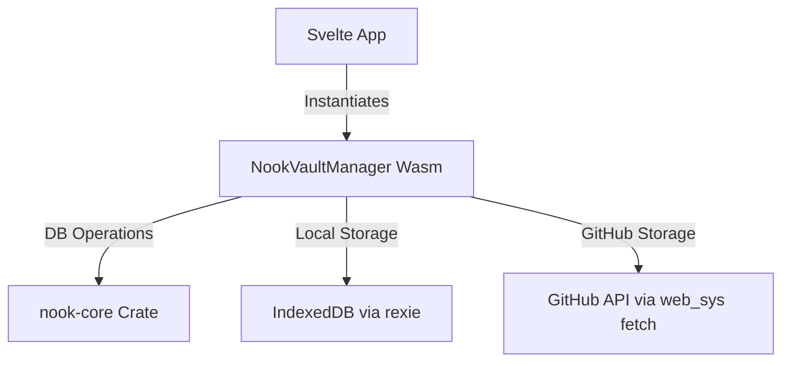

# Nook Password Manager Specification

Specification for Nook's Zero-Knowledge Password and Secret Manager.

## 1. Overview
The Nook Password Manager allows users to securely encrypt, decrypt, and manage key-value secrets in a browser. 

## 2. Core Features
- **Zero-Knowledge Encryption:** All cryptographic work occurs in pure Rust compiled to WebAssembly. Passphrases never leave the client's memory.
- **Unified Auth & Storage Providers:** Authenticate once with a storage target (Local Mock or GitHub) and use it as the secure storage database destination.
- **IndexedDB Storage (Local Mock):** Utilizes IndexedDB (`rexie` crate) to save the encrypted database hex string locally within the browser.
- **GitHub Repo Storage:** Connects via a Personal Access Token (PAT) to commit and push the encrypted database to a private repo.
- **Rage/Age Compatibility:** Employs the `age` format (via scrypt and x25519) to guard data. Databases are saved as a JSONL (JSON Lines) log.
- **Password Generator:** Integrated utility allowing generation of cryptographically secure random passwords based on user constraints.

## 3. Technical Design



### Database Representation
The database is represented logically as a JSONL log of secret records:
```json
{"key":"service1","value":"password123"}
{"key":"service2","value":"securepass"}
```
Wasm decrypts this payload into memory, processes mutations (inserts/deletions), alphabetizes records, and encrypts it back before syncing.
