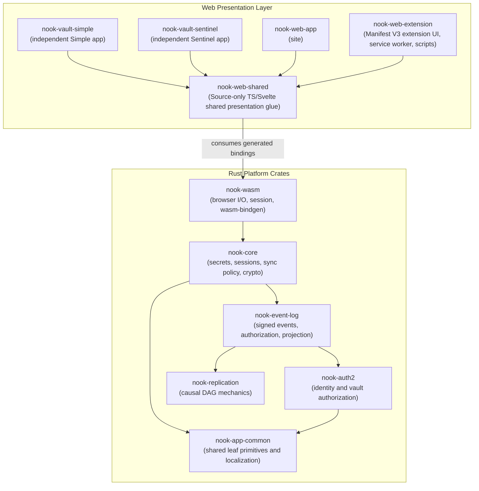
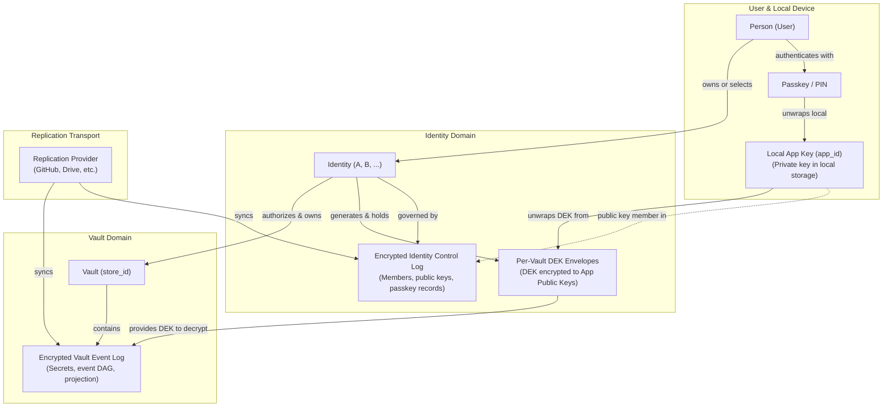

# Nook System Architecture Specification

## Overview

This document provides a comprehensive guide to Nook's architecture, package boundaries, data flows, and development environments. It serves as the primary technical context map for both human developers and autonomous AI coding agents.

---

## 1. Monorepo Structure & Dependency flow

- **Dependency direction:** Nook is a modular monorepo with strict
  uni-directional dependency flow.
- **Application scope:** App code lives under `nook-app/`.
  - It contains the Rust platform crates under `nook-platform/`.
  - It contains the WASM bridge, web app, and browser-extension package.
  - It contains Docker definitions for the split Rust/WASM and web images.
- **Architectural effects:** This layout prevents architectural drift.
  - It keeps concerns separated.
  - It isolates WebAssembly bindings from core domain code.

- **Subsystems at repository root:**
  - `infra`: infrastructure composition root, cluster definitions, persistent services, and deployment operations.
  - `nook-app`: application product code, Rust domain/platform workspace, WASM bridge, and web frontends.
  - `agentic-ai`: agent tooling, deterministic Cortex runner (Loom), CI agent, and isolated worker environments.
  - `preflight`: standalone repository invariant verification tests.
- **Dynamic exploration:** Detailed internal directory structures are dynamic.
  Agents must investigate directory trees directly using exploration tools rather
  than relying on static documentation trees.

### Dependency Enforcements

1. **No Circular Dependencies:** `nook-core` must not depend on `nook-wasm` or `nook-web`. `nook-wasm` must not depend on `nook-web`.
2. **Platform Portability:** `nook-app-common`, `nook-auth2`, `nook-replication`, `nook-event-log`, and `nook-core` compile on native and `wasm32-unknown-unknown`.

- No browser APIs in these crates.
- Simple domain DTOs/enums may carry `wasm-bindgen` annotations so web callers use the same typed core models.

### Security-domain model

Nook separates identity management from encrypted vault storage:

- **Identity:** An identity is a logical account.
  - It possesses passkeys and therefore app keys.
  - It owns each vault DEK.
  - One person may use multiple identities.
- **Browser application:** A browser application holds a local identity keyring.
  - Each local identity owns one independently protected app private key
    (`app_id`).
  - A browser application may retain multiple wrapped app keys.
  - Passkeys or PINs protect app keys.
  - The browser extension is a separate application with its own app key.
  - Identity records replicate app public keys and passkey credential records.
  - Private app keys remain local.
- **Vault:** A vault owns its `store_id`, secret ciphertext, signed event log,
  and projection.
  - It cannot exist without an authorizing identity.
  - It cannot hold a DEK by itself.
  - Passwords are vault content.
- **Provider:** A provider is a caller-supplied replication adapter.
  - It is never an identity or unlock factor.
  - Its credentials stay sealed to a local app key.

The normative model is in
[identity-vault-architecture.md](../../teams/security/architecture/identity-vault-architecture.md).

---

## 2. Package Responsibilities & Layers

Nook is structured into three architectural tiers: portable Rust platform crates, a typed WebAssembly bridge, and isolated web presentation packages.

Detailed package design, module breakdowns, and service boundaries live in
[architecture/packages.md](packages.md).

### Rust Platform Tier

- **`nook-app-common` (Shared Leaf Primitives):** Owns localization catalogs, translation behavior, and leaf primitives shared across portable crates.
- **`nook-auth2` (Identity & Authorization):** Owns logical identities, app-key derivation, passkey PRF wrapping, and per-vault DEK authorization envelopes.
- **`nook-replication` (Replication Mechanics):** Owns causal DAG index calculations, topological event ordering, and provider-agnostic replica repair.
- **`nook-event-log` (Signed Vault History):** Owns content-addressed event encoding, Ed25519 signatures, authorization graphs, and encrypted projection state.
- **`nook-core` (Application Domain Core):** Owns vault application services, sync reconciliation, crypto operations, search indexing, and domain workflows.

### WebAssembly Bridge Tier

- **`nook-wasm` (The Bridge Layer):** Exposes typed Rust domain services to the browser, manages in-memory sessions, and conducts storage I/O (IndexedDB and HTTP REST) without implementing business logic.

### Web Presentation Tier

- **`nook-vault-simple` (Simple Vault):** Origin-isolated single-user vault application hosted on `simple.nokey.sh` with extension pairing support.
- **`nook-vault-sentinel` (Sentinel Vault):** Origin-isolated multisig/threshold vault application hosted on `sentinel.nokey.sh` with strict protocol isolation.
- **`nook-web-app` (Marketing & Test Site):** Public landing page on `nokey.sh` and local/e2e test harness.
- **`nook-web-shared` (Shared Presentation):** Source-only TypeScript utilities, Svelte 5 UI components, and the shared compiled WASM artifact.
- **`nook-web-extension` (Browser Companion):** Manifest V3 browser companion paired with Simple Vault for in-page credential integration.
- **`nook-web-research` (UI Experiments):** Disposable Svelte 5 catalog for isolated visual experiments without production coupling.

---

## 3. Core Data Flows & Execution Model

Nook operates on three primary data flows: multi-device vault unlock, incremental local-first mutation, and blind-indexed search.

### Multi-Device Vault Unlock & Hydration

1. **Device Identity Unlock:** The client performs a WebAuthn PRF ceremony or local credential check to unwrap the local private app key into ephemeral memory.
2. **Authorization Key Retrieval:** The unlocked device key retrieves the vault Data Encryption Key (DEK) and membership keys from the authorization envelope.
3. **Session Hydration:** The in-memory domain database decrypts stored secret records into typed session state.
4. **Sync Reconciliation:** The client reconciles local projection heads against remote replication provider event logs.

### Incremental Mutation & Sync

1. **Domain Validation:** The client submits a proposed record change to domain services in `nook-core`.
2. **Selective Encryption:** Domain cryptography encrypts only the modified secret payload into armored age ciphertext without re-encrypting unchanged records.
3. **Signed Causal Event:** An immutable Ed25519-signed event is appended to the local causal DAG and cached in local projection storage.
4. **Asynchronous Outbox Dispatch:** New events are staged in an outbox and asynchronously published to configured replication providers.

### Blind-Indexed Search

1. **Partitioned Buckets:** Metadata search indexes are partitioned into age-encrypted buckets derived from opaque record IDs.
2. **Selective Decryption:** When a query executes, only relevant authenticated search buckets are decrypted into ephemeral memory.
3. **In-Memory Matching:** Search evaluations run across normalized in-memory text without exposing or decrypting full secret records.

---

## 4. Storage & Cryptographic Specs

| Layer                            | Format                                        | Location                                         |
| -------------------------------- | --------------------------------------------- | ------------------------------------------------ |
| Session (plaintext user secrets) | Typed `Database` records                      | WASM memory only                                 |
| On-disk user secrets             | YAML `secrets:` list                          | Values encrypted with `secrets_key`              |
| Local search catalog             | Age-encrypted `SecretListItem` buckets        | IndexedDB `secret_search_v2:{store_id}:{bucket}` |
| Logical secret store             | YAML `store_id`                               | `store_{token}` across replicas                  |
| Vault revision                   | Event-log causal heads                        | Live sync is the event log                       |
| Active unlock mode               | YAML `unlock:` tagged union                   | Omitted when device keys are the default         |
| Vault authorization envelopes    | YAML `auth:` list                             | Per-device encrypted key envelopes               |
| Vault member catalog             | YAML `members:` list                          | `members_key`-encrypted relationship data        |
| Vault-coupled joins              | YAML `joins:` list                            | Transient device join wire                       |
| Local identity keyring           | Wrapped X25519 app keys and sealed signer seeds | IndexedDB `local_identity_keyring_v1`           |
| Identity directory               | Public membership and local selection          | IndexedDB `identity_directory_v1`               |
| Replication-provider connections | App-key-sealed JSON snapshots                   | IndexedDB `nook_auth` → app-scoped providers    |

Legacy `device_identity_wrapped` and singleton provider records are read only
during migration into the keyring and app-scoped provider storage.

Search catalog detail:

- Buckets are authenticated.
- Decryption stays in WASM memory only while unlocked.
- Bucket assignment derives from opaque secret ids.

Store identity detail: see
[secret-store-identity.md](../../teams/security/architecture/secret-store-identity.md).

Vault revision detail:

- Live sync uses the event log ([vault-event-log.md](../../teams/dev-core/design-docs/vault-event-log.md)).
- Legacy YAML `vault_version` is historical/local projection context ([unified-vault.md](../../teams/dev-core/design-docs/unified-vault.md)).

Unlock mode detail:

- Password-only vaults use `{type: password, …}`.
- Device-key vaults use `auth:` plus optional `password_entries`.
- See [password-envelope.md](../../teams/dev-core/product-specs/password-envelope.md).

Authorization and membership detail:

- Legacy `auth:` rows encode encrypted `secrets_key` and `members_key`.
- Target ownership: identity holds per-vault DEK envelopes to app public keys.
- Legacy `members:` rows use `pk_id` plus `members_key`-encrypted data.
- Identity membership and app public keys live in the identity control log.
- `joins:` remains transient join wire during migration.
- Vault create requires identity + key + identity-generated DEK first.

App key detail:

- Historical name was device identity / device key.
- Deterministic standard mode is compatibility state.
- Target model: fresh random installation-specific app key wrapped locally
  (`app_id`).
- Identity records sync only app public keys and passkey records.

Provider connections detail:

- Credentials are sealed to the local device.
  Related design specifications:

- [vault-session-and-lock.md](../../teams/security/architecture/vault-session-and-lock.md): Lock session vs persisted data boundaries.
- [decentralized-auth.md](../../teams/dev-core/product-specs/decentralized-auth.md): Join and approve flows.
- [auth-providers.md](../../teams/dev-core/design-docs/auth-providers.md): Login UX and sync-provider credential persistence.
- [vault-event-log.md](../../teams/dev-core/design-docs/vault-event-log.md): Provider event-log sync.
- [unified-vault.md](../../teams/dev-core/design-docs/unified-vault.md): Local-first vault architecture (scalar sync historical).
- [identity-vault-architecture.md](../../teams/security/architecture/identity-vault-architecture.md): Identity, onboarding, grant, and provider ownership.

YAML payload sections:

- `secrets`: user passwords and payload items encrypted with `secrets_key`.
- `auth`: per-device `secrets_key` and `members_key` envelopes.
- `joins`: transient join requests during migration.
- `members`: `members_key`-encrypted catalog entries.

- **Per-record age armor** for values; labels plaintext in YAML.
- **GitHub:** UTF-8 YAML file, base64 in API payloads (not hex blob).
- **IndexedDB `vault:{store_id}`:** UTF-8 YAML projection cache (not hex).

---

## 5. Boundary Error Propagation Model

- **Strongly Typed Domain Errors:** Fallible Rust domain services return structured, explicit error types rather than panics or generic string messages.
- **Bridge Error Translation:** The WebAssembly boundary translates domain errors into structured platform error values with stable error codes.
- **Fail-Closed Presentation:** Presentation tiers handle bridge errors through explicit reactive error states, ensuring failure modes never silently corrupt session state.

---

## 6. Testing Strategy

| Package                       | Tests                                              |
| ----------------------------- | -------------------------------------------------- |
| `preflight`                   | `task preflight`                                   |
| `nook-app-common`             | `task rust:coverage:check`                         |
| `nook-authenticator-domain`   | `task rust:coverage:check`                         |
| `nook-auth2`                  | `task rust:coverage:check`                         |
| `nook-replication`            | `task rust:coverage:check`                         |
| `nook-event-log`              | `task rust:coverage:check`                         |
| `nook-companion-core`         | `task rust:coverage:check`                         |
| `nook-core`                   | `task rust:coverage:check`                         |
| `nook-web/nook-web-app`       | Playwright e2e                                     |
| `nook-wasm`                   | `task ci:wasm:node-test` + manual browser tests    |
| `nook-web/nook-web-extension` | `task extension:check` + `task extension:test:e2e` |

`preflight` detail:

- Standalone Rust tests for whole-repository invariants.
- Covers Rust/WASM-to-TypeScript boundary mirrors.
- Covers authored TypeScript/Svelte absence semantics.
- Covers no-op forwarding wrappers, unchecked WASM type hints, and raw provider/auth `JsValue` DTO signatures.
- Runs before app setup in PR/main CI.

Portable Rust crate detail:

- `task rust:coverage:check` uses llvm-cov + nextest.
- Line coverage floor lives in `nook-app/nook-platform/nook-core/coverage-floor.json`.
- Fast path: `task rust:test`.

Web e2e detail:

- `task web:test:e2e` — main stub gate and explicit PR validation.
- `task web:test:e2e:pr` — fast manual subset.
- `task web:test:e2e:sync-live` — manual real-provider validation.
- See [workflows/ci-pipeline.md](../../teams/sre/workflows/ci-pipeline.md).

Extension detail:

- `task extension:check` — type/build validation.
- `task extension:test:e2e` — Chromium smoke from packaged `dist`.

Domain logic changes **must** add or update Rust tests before merge. **Line coverage must stay at or above 90%** (`task rust:coverage:check`).

Scenario coverage is bidirectional.

- Cortex product and architecture requirements are candidate scenarios, not
  mechanically generated tests.
- Portable policy belongs in Rust tests.
- Typed browser projections and storage behavior belong in WASM tests.
- Observable browser journeys belong in Playwright.
- Durable behavior discovered in strong tests must enrich the owning Cortex
  specification when it affects future product decisions.
- UI demos communicate behavior. They do not replace regression evidence.
- Every non-demo `nook-web-app` Playwright specification must appear exactly
  once in the shared gate manifest consumed by its repository-owned project.
- Playwright suites that use default discovery continue to execute every spec
  under their configured `testDir`.

---

## 7. The Engineering Harness

All development tasks and builds in Nook run containerized via a unified `Taskfile` surface and reproducible Docker BuildKit images.

- **Unified Command Surface:** Root `Taskfile.yml` includes domain-specific task modules (`nook-app/Taskfile.yml`, `infra/Taskfile.yml`, etc.) under deterministic namespaces (`rust:*`, `web:*`, `docker:*`, `ci:*`).
- **Sealed Reproducible Images:** Runtimes are isolated into sealed images (`nook-rust:local`, `nook-web:local`, `nook-rust-browser:local`) to eliminate machine dependency drift.
- **Split Image Lineages:** Rust compilation and Web packaging run in independent BuildKit lineages; only small generated artifacts (WASM packages, coverage reports) cross the host handoff boundary.
- **Distributed BuildKit & Compiler Caching:** Builds leverage Zot OCI registry layer caches (`registry.dev.nokey.sh`) and SeaweedFS S3-backed `sccache` (`sccache.dev.nokey.sh`) for fast remote and local warm builds.
- **Ephemeral Remote Execution:** Trusted Main jobs and selected focused tasks
  execute in disposable ordinary ARC Pods. The Docker CLI connects to the
  persistent rootless BuildKit shard on the same node. Runner Pods receive no
  Docker daemon, Podman service, DinD process, host runtime socket, host path,
  or Kata runtime. Untrusted and unsupported lanes retain ephemeral
  GitHub-hosted fallback capacity.

See [architecture/engineering-harness.md](../../teams/sre/architecture/engineering-harness.md) for the complete Taskfile hierarchy, Docker cache topology, builder driver configurations, and solve pipelines.

---

## 8. Hive isolated agent platform

- **Ownership boundaries:** Agent workflow policy, scheduling, deterministic
  tools, and durable execution remain separate.
  - Cortex Markdown owns semantic delegation contracts.
  - Loom owns deterministic tools and typed admission calculations.
  - Hive owns durable task state and isolated execution.
  - One delivery owner sequences accepted results and mutates shared lifecycle state.
Hive lives in `agentic-ai/minds/hive` and is deployed only through the
domain-owned Hive commands flattened into the `infra/Taskfile.yml` command
surface for the dedicated k0s host. It is a
stateful platform built from persistent Neo4j coordination and disposable
Kata-backed execution Pods:

- a token-free dispatcher reconciles trusted Main-failure Workbench incidents;
- Neo4j owns the DAG, readiness, claims, leases, attempts, results, and bounded
  Git-patch artifacts;
- Hive is intentionally paused with zero worker replicas while its
  single-incident and single-repair invariants are revalidated;
- when re-enabled, each `kata-dragonball` worker gives one task a separate
  guest kernel and one embedded Codex thread;
- Hive treats its Codex agents as trusted operators and gives Main-repair
  agents a repository-scoped GitHub credential for standard `git` and `gh`
  delivery; custom publication brokers or mailbox protocols must not be added
  solely to hide that credential from the agent;
- the coordinator and authentication services remain only where they provide
  durable coordination or Codex-session lifecycle behavior, not as a general
  distrust boundary around the agent;
- the worker image carries the native Rust, Bun, Node, and Task toolchain, so
  mandatory `task format` runs directly in the Kata guest without any Docker
  daemon or socket; and
- the task is not complete until its normal PR is checked, reviewed,
  squash-merged, its resulting Main state is green, and Workbench is updated.

See
[design-docs/hive-isolated-agent-platform.md](../../teams/sre/design-docs/hive-isolated-agent-platform.md)
for the complete component model, task lifecycle, trust boundaries, recovery
semantics, cache topology, and deployment command surface.
