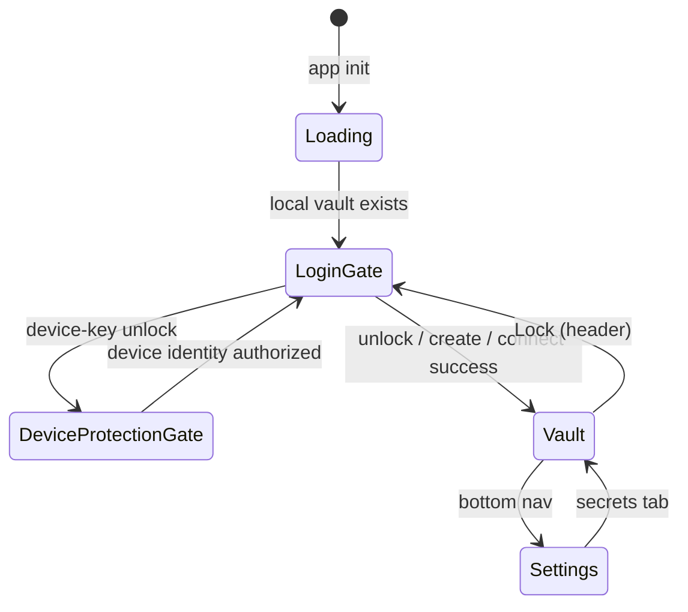

# Auth Providers, Sync, and Login UX

## Overview

How Nook persists **replication-provider** credentials, the **login gate**, and
how provider transports relate independently to identities and vaults.

> **Canonical model:**
> [identity-vault-architecture.md](identity-vault-architecture.md),
> [unified-vault.md](unified-vault.md), and
> [vault-session-and-lock.md](vault-session-and-lock.md). Providers are neutral
> **replication targets** mounted independently by identity control logs and
> vault event logs; they are not identities, vaults, or unlock factors.
> Provider **event-log sync** mechanics live in
> [vault-event-log.md](vault-event-log.md); this doc owns credentials, sealing,
> login UX, and OAuth origin constraints.

**Related:** [ARCHITECTURE.md](../../../shared/architecture/system.md) §4,
[password-manager.md](../product-specs/password-manager.md) §2A,
[secret-store-identity.md](secret-store-identity.md).

---

## 1. Goals

- **Login when locked:** Primary app is the secret vault after unlock; **Lock**
  clears the session and returns to the login gate.
- **Remember sync credentials:** GitHub PAT and provider labels persist in
  IndexedDB — no repeated token prompts.
- **Many mounts:** Multiple providers may replicate the same vault `store_id`;
  identities may separately use provider targets for encrypted identity-control
  events before any vault exists.
- **Separation of concerns:** Provider tokens are storage convenience. Vault keys
  remain vault authorization material; provider credentials are sealed locally
  to an installation-specific device key and never prove identity membership.

---

## 2. IndexedDB layout (`nook_auth`)

| Piece              | Value                                                           |
| ------------------ | --------------------------------------------------------------- |
| Database           | `nook_auth`                                                     |
| Object store       | `auth`                                                          |
| Identity key       | `providers:{app_id}`                                            |
| Rollback projection | `providers`                                                     |
| Value              | `{ providers: StorageProvider[], activeVaultStoreId?: string }` |
| Schema markers     | `providers-schema:{app_id}` and `providers-schema` (`1`)         |

The persisted object is a structured-clone JS object (not a JSON string). Rust
owns both contracts:

- semantic enums are used in memory and exported through Tsify/`$app-wasm`; and
- `legacy_storage.rs` projects them to the schema-1 string-or-absent wire shape.

Keeping schema 1 on disk is intentional rollback compatibility.

- The app-scoped row is authoritative for the current build.
- The singleton row remains readable by the prior deployed build.
- A sole local identity refreshes both rows in one `nook_auth` transaction.
- Equality with the app-scoped row proves ownership even when a projection has
  no credential ciphertext to open.
- Retiring an identity deletes the singleton row only when it still equals that
  identity's app-scoped row; a competing singleton remains untouched.
- Initial migration refreshes the rollback row after credentials are opened
  and resealed successfully.
- A competing singleton row is preserved and fails migration closed.

The web layer **re-exports** the semantic types. It does **not** hand-author
mirror interfaces.

Any future incompatible persisted shape must:

- increment `providers-schema`;
- ship an explicit forward migration; and
- retain either a backward projection or a separate rollback-readable key until
  the prior release is no longer a supported rollback target.

A domain-type refactor alone never authorizes a wire format change.

### Wire fields (`StorageProvider`, camelCase)

| Field                                                                                | Notes                                                                                             |
| ------------------------------------------------------------------------------------ | ------------------------------------------------------------------------------------------------- |
| `id`, `type`, `label`, `createdAt`                                                   | `type`: `local` \| `github` \| `oauth-file` \| `local-folder`                                     |
| `githubPat?`, `githubRepo?`                                                          | GitHub only — PAT sealed at rest                                                                  |
| `oauthFile?`                                                                         | Drive/iCloud block — see below                                                                    |
| `localFolder?`                                                                       | File System Access directory handle metadata (`directoryName?`, `handleId?`)                      |
| `storeId?`                                                                           | Logical secret store (`store_{token}`) — see [secret-store-identity.md](secret-store-identity.md) |
| `lastSyncedVersion?`, `lastSyncedAt?`, `lastSyncRevision?`, `lastCommonContentHash?` | Sync bookkeeping                                                                                  |

### Wire fields (`oauthFile`)

| Field                                                 | Notes                                                          |
| ----------------------------------------------------- | -------------------------------------------------------------- |
| `preset`                                              | `google-drive` \| `icloud`                                     |
| `accessToken`, `refreshToken?`                        | Sealed at rest                                                 |
| `expiresAt?`, `fileId?`, `fileName?`, `accountEmail?` | Non-secret metadata                                            |
| `driveMode?`, `folderId?`                             | Google Drive private/shared; absent legacy rows migrate        |
| `iCloudMode?`, `iCloudShareTarget?`                   | iCloud private/shared; share target is credential-free routing |

### Ownership

**Persistence + credential crypto live in Rust/WASM** (still current — not a
legacy note). Snapshot shaping and sealing are unit-tested in core; IndexedDB I/O
and the load pipeline live in wasm; the web shim is adapters + i18n only.

| Concern                                                                                                                                             | Home                                                                                               |
| --------------------------------------------------------------------------------------------------------------------------------------------------- | -------------------------------------------------------------------------------------------------- |
| Snapshot model + pure transforms (`normalize`, `migrate_provider_fields`, `ensure_local_provider_row`, `find_duplicate_sync_provider`, legacy-seed) | `nook-app/nook-platform/nook-core/src/sync/sync_provider_store/`                                   |
| Provider-save policy                                                                                                                                | `nook-app/nook-platform/nook-core/src/sync/sync_provider_store/save.rs`                            |
| Seal/open credential fields with device identity                                                                                                    | `nook-app/nook-platform/nook-core/src/sync/sync_provider_credentials.rs`                           |
| `nook_auth` IndexedDB I/O (rexie), load pipeline, legacy `localStorage` read/clear                                                                  | `nook-app/nook-platform/nook-wasm/src/storage/auth_providers.rs`                                   |
| Manager APIs (`load_auth_providers_snapshot`, `load_auth_providers_with_local_row`, `save_auth_providers_snapshot`)                                 | `NookVaultManager` methods in `nook-app/nook-platform/nook-wasm/src/vault_api.rs`                  |
| Delete the auth-provider database with `delete_auth_providers_db`                                                                                   | WASM binding + thin TypeScript wrapper                                                             |
| Find duplicate sync providers with `find_duplicate_sync_provider`                                                                                   | WASM binding + thin TypeScript wrapper                                                             |
| Ensure the local provider row with `ensure_local_provider_row`                                                                                      | WASM binding + thin TypeScript wrapper                                                             |
| Seal providers with `seal_auth_providers_for_device_public_key`                                                                                     | WASM binding + thin TypeScript wrapper                                                             |
| Bind provider storage modes                                                                                                                         | WASM bindings + thin TypeScript wrappers                                                           |
| Enrollment typestates (`TypedEnrollmentProvider`, personal vs shared)                                                                               | `nook-app/nook-platform/nook-auth2/src/auth/enrollment.rs` (re-exported via `nook-core`)           |
| Type re-exports, i18n presentation, wasm wrappers                                                                                                   | [`auth/providers.ts`](../../../../nook-app/nook-web/nook-web-shared/src/vault-app/lib/auth/providers.ts) |
| Browser persistence and Svelte state                                                                                                                | `vault/providers.svelte.ts` under `nook-web-shared`                                                |

The provider-save policy owns:

- provider construction;
- duplicate handling;
- vault scoping;
- local-provider row seeding; and
- OAuth configuration merging.

TypeScript owns browser integration:

- supplying generated IDs and timestamps;
- mapping typed failures to translated messages; and
- persisting the resulting snapshot.

- **Credential storage:** Seal secret fields at rest with the device key.
  - Secret fields are `githubPat`, `oauthFile.accessToken`, and
    `oauthFile.refreshToken`.
  - Seal them inside `save_auth_providers` / `seal_provider_credentials` and
    unseal them inside the `load_auth_providers` pipeline.
  - Keep non-secret labels, repositories, and timestamps plaintext.
  - Keep crypto out of TypeScript. See [architecture/packages.md](../../../shared/architecture/packages.md).
- **Current storage mapping:** Existing code names the device key a “device
  identity.” Do not mint another key for provider storage.
  - Reuse this browser's **age X25519 device key**: `device_id` /
    `device_identity_wrapped` in the `nook_db` `vault` store.
  - This is the same identity that unwraps `auth:` envelopes.
  - Authorize it first with the saved passkey's WebAuthn PRF result, or the local
    PIN fallback on PRF-missing platforms.
  - Seal to the device's public key with age self-recipient
    `DeviceIdentity::seal_utf8`.
  - Unseal with the in-memory device secret through
    `DeviceIdentity::open_utf8`.
  - Treat `BEGIN AGE ENCRYPTED FILE` armored values as sealed ciphertext,
    distinct from plaintext credential fields.
- **Extension pairing:** `seal_auth_providers_for_device_public_key` can seal a
  snapshot for another device's public key without writing IndexedDB.
  - Use it when staging credentials for the browser extension.
- **Migration:** On first load, import legacy `localStorage` keys
  `nook_storage_mode` and `nook_github_pat` into `nook_auth`, then remove them
  from `localStorage`.
  - Reject existing **plaintext** provider rows instead of loading them.
  - This fail-closed boundary prevents an unsealed credential from remaining
    usable or appearing to be trusted encrypted state.
  - Require users to re-enter the credential so the normal save path persists
    it sealed.
- **Provider switch:** Changing the active saved provider calls
  `reset_vault_session` in WASM and clears login password-entry preview state.
  - Backup-password lists must reflect the remote vault for that provider, never
    a previous provider's in-memory session.

### Google Drive modes

Provider setup offers `private` and `shared` independently of vault replication
or membership. Private mode requests `drive.appdata` and stores events below the
hidden `appDataFolder`. Shared mode requests `drive.file` for app-created writes
plus `drive.readonly` because Drive authorizes `drive.file` per user and
collaborators must read folders and event files created by another account. It
creates or verifies a visible My Drive folder and stores its stable `folderId`;
writes remain limited to app-created files below that selected folder. Each
collaborator saves a separate OAuth token for their own Google account. Switching
modes clears the scope-bound token and target in Rust before the user signs in
again; it never reuses an app-data token for a shared folder or vice versa.

**Shared-folder grant outcomes:** After Rust validates a shared Google Drive
grant request, WASM attempts `files.create` (folder) and `permissions.create`
(writer for the joiner email) with the owner's token. Outcomes are
`SharedStorageGrantOutcome::{Granted, ManualGrantRequired, Unsupported}`.
Success returns `Granted` with the stable `storageTargetId` (`folderId`). When
the owner token is missing, the token lacks `drive.file`, or Drive rejects the
create/share call, WASM returns `ManualGrantRequired` with
`architecture_modes.shared_grant_manual_instructions`. The UI then shows those
manual share steps; if folder create succeeded but share failed, the outcome may
still carry `storageTargetId` so enrollment can bind the existing folder without
creating a replacement. Personal / private providers keep using `drive.appdata`
and never enter this grant path.

### Shared-provider onboarding

This section documents the current vault-coupled enrollment wire.

In the target architecture:

- device/member onboarding first extends an identity; and
- a separate authorization step grants that identity access to a vault.

The same credential-free provider-target rule applies to both identity-control
and vault event-log replication. Migration of the existing wire requires an
explicit versioned design. This architecture decision does not silently
reinterpret old enrollment payloads.

**Provider target handoff**

- A shared Google Drive row persists its stable `folderId`.
- Enrollment codes carry that folder id.
- Enrollment codes never carry the owner's OAuth access or refresh token, even
  when the vault's legacy/default `replication_type` is `personal`.
- The joining browser signs into its own Google account and saves its own token.
- The owner may grant that account access to the already-persisted folder.
- Onboarding must not create a replacement folder or transfer owner credentials.

**Rust typestates**

The decrypted enrollment payload exposes the Rust-owned `OnboardingType`. The
joiner dispatches on `PersonalCredentialTransfer` versus `SharedProviderGrant`.

Rust models those as sealed typestates in `nook-auth2`:

- `TypedEnrollmentProvider<PersonalCredentialTransfer>` can contain local,
  GitHub, or credential-bearing OAuth data; and
- `TypedEnrollmentProvider<SharedProviderGrant>` can contain only a Google Drive
  folder grant or iCloud share target.

The encrypted wire payload records the onboarding type beside its correspondingly
typed provider data. A shared wire tag paired with the legacy OAuth shape fails
deserialization. Legacy OAuth codes are classified as personal only.

Shared-target types have no PAT, OAuth access-token, or refresh-token fields or
constructors. The credential-free rule is enforced by Rust construction and
deserialization rather than a TypeScript convention or a late runtime branch.

### iCloud modes

Private mode preserves the legacy default private CloudKit database behavior.
Shared mode creates a custom private record zone and a shareable root record. The
owner accesses that hierarchy through the private database; after accepting the
share, each participant accesses it through their shared database. Every event
record is parented to the shared root. The saved `iCloudShareTarget` contains
only the stable short GUID, zone owner/name, root record name, and
owner/participant routing role. Enrollment copies that target, never the owner's
CloudKit web-auth token; the recipient signs into Apple and accepts the share
with their own account before sync.

### Local-folder provider availability

Local backup uses the browser File System Access directory API
(`showDirectoryPicker`) and persisted structured-clone directory handles. The
provider picker must gate this option with `is_local_folder_backup_supported()` and
show it as unavailable when the browser cannot grant writable folder access; do
not let unsupported browsers enter setup and surface the lower-level
WASM/database error.

---

## 3. UI states



Shared components live under
`nook-app/nook-web/nook-web-shared/src/vault-app/lib/components/`.

| Component              | When shown                                                                       | Purpose                                                                                              |
| ---------------------- | -------------------------------------------------------------------------------- | ---------------------------------------------------------------------------------------------------- |
| `DeviceProtectionGate` | Device-key unlock selected while identity is locked, or identity needs migration | Create/authorize passkey, or PIN fallback when PRF is unavailable, before loading device-sealed data |
| `LoginGate`            | Vault locked                                                                     | Get started chooser, unlock local cache, connect sync provider, enrollment                           |
| `SecretVault`          | Authenticated                                                                    | Primary app — secrets CRUD                                                                           |
| `AuthStorage`          | Settings → Sync providers                                                        | Manage replica targets for **current** vault                                                         |
| Header **Lock vault**  | Authenticated                                                                    | `VaultState.lockVault()` — clear session                                                             |

### Lock

See [vault-session-and-lock.md](vault-session-and-lock.md). **Lock** is **not**
“delete vault” — it clears the WASM typed session database, the in-memory device
identity, and sensitive Svelte state. The normal vault login gate remains
visible; choosing device keys starts passkey authorization directly, while PIN
input, passkey recovery, and failed/cancelled attempts use the device-protection
gate. A backup password can unlock the local vault without opening it.

**Test ids:** `header-lock-vault-btn`, `login-create-device-vault-btn`,
`login-connect-storage-btn`, `unlock-vault-btn`, `add-provider-btn`,
`remove-provider-{id}`.

### Login gate (current)

| Local vault? | Primary UI                                                                  |
| ------------ | --------------------------------------------------------------------------- |
| No           | **Get started** — create local vault (device keys) or connect cloud storage |
| Yes          | Unlock with device keys and/or backup password                              |

Legacy login wizard docs (connection × authorization accordion) are superseded
by the unified login gate; see git history before Phase 8 if needed.

---

## 4. VaultState integration

`VaultState` discovers local vaults on `init()` without unsealing the device
identity. Only after device-key authorization puts the identity in WASM memory
does it load providers, apply `activeProvider` credentials to `storageMode` /
`githubPat`, and call `ensureProviderSaved()` after successful
connect/enroll/join. Backup-password unlock may hydrate the local vault session
without those provider steps; sealed-provider sync remains paused.

WASM still receives `(storageMode, githubPat)` per call for the active connect
path. Provider persistence and shaping live in `nook-wasm`/`nook-core`; the web
layer maps snapshots onto `VaultState` via
`manager.load_auth_providers_snapshot()` /
`manager.save_auth_providers_snapshot()` (wrapped by `auth/providers.ts`).

---

## 5. Sync replication (status)

Event-log sync is the live provider path — see
[vault-event-log.md](vault-event-log.md). UI uses the local `vault:{store_id}`
projection cache and fans events out to sync providers listed in `nook_auth`
(`fanOutSyncToProviders`).

| Capability                         | Status                                                                                                                                                      |
| ---------------------------------- | ----------------------------------------------------------------------------------------------------------------------------------------------------------- |
| Multiple sync providers per vault  | Done — fan-out after local save                                                                                                                             |
| Single `store_id` across replicas  | Enforced — `StoreIdMismatch` in `sync/vault_sync.rs`                                                                                                        |
| Event-log causal sync              | Done — [vault-event-log.md](vault-event-log.md)                                                                                                             |
| Multi-vault on one browser profile | Partial — e2e coverage in `nook-web-app/e2e/multi-vault.spec.ts`; full picker UX still evolving ([vault-session-and-lock.md](vault-session-and-lock.md) §3) |

**Do not confuse:** adding a sync provider **replicates** the active vault;
opening a **different** vault requires Lock and connect/import flow (or the
multi-vault picker when available).

Whole-blob reconciliation and scalar `vault_version` comparison are
historical context in [unified-vault.md](unified-vault.md), not the primary
provider sync path.

---

## 6. Security notes

- Provider credentials (GitHub PAT, OAuth access/refresh tokens) are **sealed with
  the device's age X25519 key** (in Rust/WASM) before hitting IndexedDB. They are
  never stored as plaintext. A raw `nook_auth` dump exposes age-armored
  ciphertext, not tokens.
- The device secret is itself wrapped at rest in `nook_db.device_identity_wrapped`
  with AES-256-GCM. The preferred wrapping key is derived in Rust/WASM from a
  WebAuthn PRF result with HKDF-SHA256. On PRF-missing platforms, a versioned PIN
  fallback uses PBKDF2-SHA256 parameters authenticated in the wrapped record.
  Neither PRF output, PIN, nor derived key is persisted.
- This protects passive copies of both IndexedDB databases. Code already executing
  in the page after authorization can use the in-memory identity. Code before
  authorization can request a user-verifying passkey ceremony. Passkey protection
  is therefore not a substitute for XSS prevention.
- GitHub PAT in IndexedDB is **storage convenience**, not vault encryption.
  Compromise exposes GitHub repo access, not plaintext vault secrets. Vault
  secrets remain independently encrypted in the vault file.
- Reusing the existing local device key means no extra key material and no new
  key-management surface. That key already gates current vault-key envelopes.
- The local device key and encrypted vault blob remain in a separate IDB database
  (`nook_db`). Provider rows live in `nook_auth`. E2E tests clear both on reset.

## 7. OAuth origins and PR previews

Browser OAuth providers are origin-bound.

- **Google Drive origins:** Nook uses Google Identity Services in the browser.
  Configure the current Google web client for:
  - `https://localhost:5173`
  - `https://localhost:5175`
  - `http://localhost:5173`
  - `https://simple.nokey.sh`
  - `https://sentinel.nokey.sh`
  - `https://simple.dev.nokey.sh`
  - `https://sentinel.dev.nokey.sh`
- **CloudKit origins:** Register these groups for the CloudKit JS token:
  - the two interactive localhost origins;
  - the two production vault origins; and
  - the two stable development vault origins.
  - Treat `https://nokey.sh` and `https://dev.nokey.sh` as public product sites,
    not vault or provider-callback origins.
- **Local development:** Register `https://localhost:5173` and the
  multi-worktree fallback `https://localhost:5175` explicitly in both provider
  consoles.
  - `task web:dev` creates a trusted local certificate through the repository's
    pinned `mkcert` Docker image.
  - It stores the certificate under `~/.nook/https/` so every worktree reuses the
    same CA.
  - Loopback HTTP remains an internal Playwright transport, not the
    provider-enabled manual development environment.
- **Branding and public pages:** Use `https://nokey.sh/` as the Google/Auth
  Platform public app home page.
  - The root path is the crawlable product and branding page.
  - Vault applications live at `https://simple.nokey.sh` and
    `https://sentinel.nokey.sh`.
  - Do not user-agent fork the root path for Googlebot. A bot-only version is
    cloaking-prone and makes OAuth review differ from real user behavior.
  - Keep `/about.html` as a compatibility alias whose canonical URL is the root
    page. Do not list it separately in the sitemap.
  - Use static `https://nokey.sh/privacy.html` and
    `https://nokey.sh/terms.html` legal documents so GitHub Pages can serve them
    without the SPA router.
  - Let `robots.txt` allow public root/legal pages and assets while disallowing
    private utility routes.
  - Both vault applications emit `robots.txt` with `Disallow: /`.
- **PR preview deployment:** Deploy both:
  - an internal unified harness; and
  - isolated Cloudflare Pages aliases such as `pr-191.nokey-sh.pages.dev`,
    `pr-191.nokey-simple.pages.dev`, and `pr-191.nokey-sentinel.pages.dev`.
  - Treat the browser origin as the exact scheme, host, and port tuple.
  - Google Authorized JavaScript origins cannot contain paths, queries,
    fragments, or wildcards.
  - One exact PR origin may be added manually for a one-off test.
  - The pattern cannot be represented as
    `https://pr-*.nokey-simple.pages.dev`; origin sprawl is not a durable
    preview strategy.
  - CloudKit API tokens have the same practical constraint when allowed origins
    are restricted to exact domains.
- **Current fallback:**
  [`auth/oauth-origin.ts`](../../../../nook-app/nook-web/nook-web-shared/src/vault-app/lib/auth/oauth-origin.ts)
  detects both the internal harness and isolated Nook PR aliases.
  - It disables Google Drive and iCloud sign-in with a clear message.
  - Reviewers may still test local, local-folder, and GitHub providers on PR
    previews.
  - Test Google Drive browser OAuth on `https://simple.nokey.sh`,
    `https://sentinel.nokey.sh`, the matching `*.dev.nokey.sh` vault origin, or
    local development.
  - Per-PR aliases intentionally never receive provider credentials.
- **CSP:** Vault CSP (`security-headers.ts` to Cloudflare `_headers`) must keep:
  - `https://accounts.google.com/gsi/client` in `script-src`;
  - `https://cdn.apple-cloudkit.com` in `script-src`; and
  - GIS `frame-src` / `https://accounts.google.com/gsi/` allowances.
  - A CSP that allows only `'self'` scripts fails before any OAuth client-ID or
    origin check. Treat **Failed to load Google Identity Services** or CloudKit
    JS as an app-header bug, not a provider-console misconfiguration.
- **CloudKit diagnostics:** A `421` response from `/public/users/caller` usually
  means CloudKit issued the unauthenticated web-auth challenge.
  - It does not by itself prove the API token or origin is wrong.
  - The failure signal is whether the real Apple-controlled sign-in click
    produces a `ckWebAuthToken` through CloudKit's token store, cookie, or
    session storage.
  - Nook logs the native click path, control shape, sanitized redirect metadata,
    and token-storage presence under `icloud-oauth`.
  - Debug from those entries before rewriting the provider flow.

When reproducing production auth from the shell, include the browser origin:

```sh
curl -H 'Origin: https://simple.nokey.sh' \
  'https://api.apple-cloudkit.com/database/1/iCloud.metasecret.project.com/production/public/users/current?ckAPIToken=...'
```

- **Shell reproduction result:**
  - Without `Origin`, Apple may report `AUTHENTICATION_FAILED` even when the
    token is valid for the registered web origin.
  - With the registered origin, an unauthenticated production request should
    return `AUTHENTICATION_REQUIRED` plus a `redirectURL`.
  - If CloudKit JS wraps that challenge as `UNKNOWN_ERROR` after the real Apple
    click, fall back to the Web Services challenge.
  - Open the returned Apple sign-in URL and listen for the `ckWebAuthToken`
    postMessage.
- **Brave popup behavior:** Brave can open CloudKit JS's Apple window and the
  direct fallback window at the same time.
  - A second `window.open` is often blocked and surfaces as immediate **iCloud
    sign-in failed** while the first Apple window remains open.
  - After a native CloudKit button click, wait for the token or postMessage from
    that existing window. Do not open another popup.
  - Use Brave's direct Web Services challenge as the primary path only for
    programmatic clicks that have not already opened Apple's window.

Alternative provider-preview options:

| Option                  | Summary                                                                                                                                               | Trade-off                                                                                    |
| ----------------------- | ----------------------------------------------------------------------------------------------------------------------------------------------------- | -------------------------------------------------------------------------------------------- |
| Stable preview origin   | Serve previews from one registered origin such as `https://nook-1n8.pages.dev/pr-191/` or `https://preview.nokey.sh/pr-191/` via Worker/path routing. | Best reviewer UX; requires Cloudflare routing/base-path work and careful static asset paths. |
| Preview OAuth client    | Create a separate Google OAuth client for a small set of fixed staging origins.                                                                       | Good for staging; still does not solve per-PR subdomains.                                    |
| Backend/redirect broker | Move to an authorization-code flow with PKCE and a fixed redirect/broker origin.                                                                      | More secure and flexible, but adds server or Worker state and a larger auth surface.         |
| Manual one-off origin   | Add the exact PR origin in Google Cloud Console for a specific review.                                                                                | Useful for urgent manual testing; not automatable or scalable as the normal PR flow.         |
