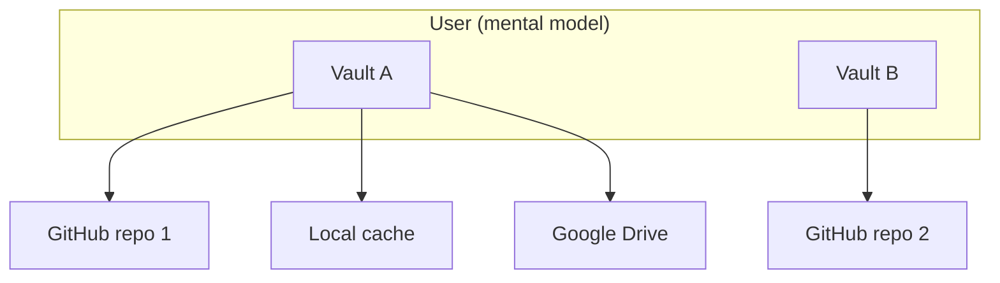

# Vault Session, Lock, and Multi-Vault Model

## Overview

How Nook thinks about **vaults**, **sync providers**, **in-memory sessions**, the **Lock** action, and deleting a browser's local working copy.

Status: Active session and lock guidance with compatibility storage examples.
Immutable signed events are authoritative. YAML and scalar `vault_version`
material are derived projection, interchange, or migration context. See
[Vault Event Log](../../dev-core/design-docs/vault-event-log.md).

**Related:** [unified-vault.md](../../dev-core/design-docs/unified-vault.md),
[secret-store-identity.md](secret-store-identity.md),
[auth-providers.md](../../dev-core/design-docs/auth-providers.md), and
[system architecture](../../../shared/architecture/system.md).

---

## 1. Core concepts

- **Vault**
  - **What it is:** One logical encrypted event store identified by `store_id`
  - **Persists when locked?:** Yes — signed encrypted events and derived projection
- **Local vault cache**
  - **What it is:** Derived local projection and event data for one `store_id`
  - **Persists when locked?:** Yes
- **Sync provider**
  - **What it is:** App-key-sealed connection state in IndexedDB
  - **Persists when locked?:** Yes — sealed credentials only
- **Local app key**
  - **What it is:** Identity-owned wrapped X25519 key in `local_identity_keyring_v1`
  - **Persists when locked?:** Ciphertext persists; plaintext does not
- **Unlocked session**
  - **What it is:** Vault keys + encrypted records in WASM; metadata page plus explicitly revealed records in Svelte
  - **Persists when locked?:** **No** — cleared on Lock
- **Sentinel genesis draft**
  - **What it is:** Pre-vault policy and verified participant public keys
  - **Persists when locked?:** Not a vault or unlocked session; persistence policy is a separate decision
- **Lock**
  - **What it is:** End session; return to login gate
  - **Persists when locked?:** N/A

`nook-auth2` owns the portable security and key-access primitives behind these
concepts:

- device identities;
- `auth:` envelopes;
- `password_entries`;
- member roster encryption;
- passkey-PRF/PIN wrapping; and
- vault key resolution.

Sync providers remain separate replica credentials. They do not define how a
vault is unlocked.

**Rules**

1. A **vault** is one `store_id` — one encrypted YAML file with its own secrets, devices, and version counter.
2. A vault may **replicate to many sync providers**. Each provider holds a copy
   of the same `store_id` blob. `vault_version` reconciles divergence. See
   [unified-vault.md](../../dev-core/design-docs/unified-vault.md).
3. A Sentinel genesis draft is not registered as a vault and cannot be selected,
   imported, opened, or synchronized before atomic genesis completes.
4. A user may **own many vaults** over time (work vs personal, migrated stores, etc.). Each vault is independent: different `store_id`, different unlock material, different provider set.
5. **Lock** does not delete vaults or providers — it drops vault keys, the
   current metadata page, any explicitly revealed records, and plaintext device
   identity from memory.
6. **Settings → Delete local vault data** is the destructive browser reset. It:

- first locks other open Nook tabs;
- zeroizes their WASM sessions;
- clears their tab-scoped storage; and
- waits for their storage work to drain.

The reset fails closed when safe cross-tab coordination is unavailable or a tab
does not acknowledge. It then:

- zeroizes the active WASM session;
- independently clears every object store in `nook_db`, `nook_auth`,
  `nook_file_sync`, and `nook_logs`;
- clears Web Storage, Cache Storage, and accessible site cookies; and
- returns to the landing page.

Cleanup continues after individual store failures. It reports the aggregate error
from a locked state.

It never deletes:

- remote sync replicas;
- platform-authenticator passkeys; or
- the separately isolated browser-extension origin.

If the same `store_id` is later reopened, its existing extension pairing is
discovered again.

---

## 2. Lock semantics

**User action:** Header **Lock vault** (`header-lock-vault-btn`) while authenticated.

**Implementation:** `VaultState.lockVault()` → `set_vault_session_locked(true)` + `clearUnlockedSession()`:

**Cleared from memory**

- `isAuthenticated`, current metadata page, revealed records
- WASM vault keys + `VaultCrypto` via `reset_vault_session()`
- WASM device identity via `lock_device_identity()`
- Pending joins / roster UI cache
- Settings / help panels

**Kept on disk**

- `nook_db` vault blobs + registry
- `nook_db.device_identity_wrapped`
- WebAuthn credential in the platform authenticator, or PIN fallback for PRF-missing platforms
- `nook_auth` sync provider list + tokens
- Password entries inside encrypted YAML

**Refresh:** `sessionStorage` flag `nook_vault_session_locked` blocks `shouldAutoUnlock()` until the user unlocks again (`markVaultUnlocked()` clears the flag). Device-key vaults still auto-unlock on reload when the user did **not** lock.

- **Unlock ordering:** Run `loadProviders({ ensureLocalRow: false })` before
  `markVaultUnlocked()` for device-key unlock.
  - Load only the persisted provider snapshot.
  - Do not create a local provider row during unlock.
  - Use `syncProviders` for fan-out after local save.
  - Unlocking that path earlier lets a fast edit push with an empty provider
    list and leave the remote event log stale.
  - Backup-password unlock is the exception. It may open the local vault while
    the device identity and sealed provider credentials remain locked.
  - Keep remote fan-out disabled until device authorization.
- **Post-lock action:** Keep the app in **`LoginGate`** without opening a passkey
  prompt.
  - When the user chooses **This device's keys**, start stored-passkey browser
    authorization directly from that click.
  - On success, restore identity in WASM memory and continue the same unlock
    action automatically.
  - Keep `DeviceProtectionGate` in `PasskeyAuthOverlay` as the interactive
    surface for PIN input, missing identity/passkey recovery, and failed or
    cancelled passkey attempts.
  - Treat **Backup password** as an alternative vault-key credential. Open the
    local vault directly without the passkey/PIN form.
- **Gate meaning:** Present **Device setup — Step 1 of 2**, not vault login.
  - Explain that it prepares or unlocks the browser's protected device identity.
  - Explain that vault selection, creation, or import follows.
  - Choose device protection mode only here.
  - Vault creation reuses that persisted choice and does not render another
    selector.
- **Missing local passkey record:** Show **Authenticate** as the primary action.
  - Launch discoverable-passkey recovery immediately without a second
    confirmation widget.
  - Keep passkey creation as an explicit secondary choice.
  - Hide device mode and label controls until the user chooses creation.
  - Never auto-create after failed or cancelled authentication. WebAuthn cannot
    reliably distinguish no matching passkey from cancellation, timeout, or
    authenticator refusal.
- **Known passkey wrapper:** When `device_identity_wrapped` identifies passkey
  protection, use the gate only for retry or recovery after failed direct
  authorization.
  - Show authorization only and never render passkey creation.
- **Visual ownership:** When embedded in `PasskeyAuthOverlay`, let the overlay
  own the only visible border, radius, and elevation.
  - Keep the embedded gate flat.
- **Browser limitation:** Browsers cannot generally enumerate whether an RP has
  a discoverable passkey.
  - Keep an explicit existing-passkey recovery action in the missing-record
    state.

- **Multiple local vaults** → vault picker (`login-vault-picker`); unlock chosen vault.
- **Single local vault** → unlock with device keys and/or backup password.
- Backup-password summaries are read from the encrypted local vault before
  device authorization, so Lock must not hide the password choice. Selecting a
  backup password unwraps the vault keys directly; it does not unlock the
  wrapped device identity or its sealed sync-provider credentials.
- **No local vault yet** → create on device or connect a sync provider to pull
  an existing vault. Choosing Simple creates locally. Choosing Sentinel starts
  the pre-vault reverse-onboarding ceremony in
  [sentinel-genesis.md](../../dev-core/design-docs/sentinel-genesis.md).

- **Existing-vault import:** Recover an authorized device identity before
  attempting `connect`.
- **Provider preflight:** Discover the remote `store_id` from signed encrypted
  events without decrypting the vault.
  - Simple Vault uses the identifier to ask a paired extension for its
    memory-only identity.
  - A locked extension owns and displays its unlock window.
  - Only when no paired extension is available may the website show its own
    passkey/PIN device gate.
  - Treat discovery as a bounded busy operation.
  - Reject an empty or incorrect provider when `store_id` is missing, before
    device authorization.
  - Keep the discovered identifier staged until that exact provider vault
    connects successfully.
- **Safe recovery metadata:** Project only these values from signed events:

- active device labels/IDs (matching the `device …` suffix written into Nook
  passkey display names);
- backup-password labels; and
- whether Sentinel quorum is required.

- **Staged credential continuity:** Device authorization may reload sealed
  provider state.
  - Keep the exact staged credentials or local-folder handle in memory.
  - Resume the staged import after successful authorization without asking the
    user to choose the provider again.
  - Never call provider connect first and expose internal
    `authorization_required` to the user.
- **Login workflow choice:** Present **Open existing**, **Create new**, and
  **Import** as mutually exclusive workflows.
  - With local vaults, default to Open existing: choose a vault, then authorize
    its unlock.
  - Create and Import replace open/unlock controls while selected.
- **Lock purpose:** Treat Lock as the safe “step away from this browser” action.
  It keeps the encrypted database file like password-manager logout.

### Extension device session

- **Session lifetime:** The extension has a separate, revocable device identity.
  - After passkey or PIN authorization, keep it in WASM memory in an offscreen
    document for 15 minutes.
  - Reopening the toolbar popup does not repeat the ceremony.
- **Persistence boundary:** Never persist decrypted identity, PIN, or passkey
  PRF output to `chrome.storage`.
  - Expiry or browser shutdown zeroizes the manager and requires authorization
    again.
- **Automatic discovery:** Simple Vault checks a paired extension every three
  seconds while both site and extension identity are locked.
  - Automatic discovery must never open an authentication surface.

When the user explicitly chooses **Unlock**:

- a paired locked extension opens its own authorization window;
- the website waits for the extension's memory-only identity handoff; and
- the website must not fall through to a second website passkey ceremony.

- **Response deadline:** Bound site-to-extension requests to five seconds.
  - A suspended or broken runtime cannot leave website unlock pending forever.

---

## 3. Multiple vaults on one browser (#120)

- **Local cache**
  - **Behavior:** Multiple `vault:{store_id}` blobs + `vault_registry` in `nook_db`
- **Login gate**
  - **Behavior:** Vault picker when >1 vault: open / create new / import from provider
- **Sync providers**
  - **Behavior:** Scoped to active vault `store_id`; full list in `nook_auth`
- **Lock / switch**
  - **Behavior:** Clears session; vault chooser when multiple vaults exist
- **`store_id` mismatch**
  - **Behavior:** **Import as new vault** in sync conflict dialog

Vault projection caches use `vault:{store_id}`. Code: `nook-app/nook-platform/nook-wasm/src/storage/indexed_db.rs`, `LoginVaultPicker.svelte`.

---

## 4. Sync providers ≠ separate vaults

- **Create a vault**
  - **Correct action:** Login → **Create vault** (starts in this browser)
- **Create a Sentinel vault**
  - **Correct action:** Login → **Create vault** → Sentinel policy and reverse onboarding; no provider until atomic genesis is complete
- **Replicate this vault**
  - **Correct action:** Settings → Sync providers → Add GitHub / Drive
- **Open a vault from elsewhere**
  - **Correct action:** Login → **Connect sync provider** or **Import as new vault**
- **Local folder contains multiple vault logs**
  - **Correct action:** Choose a dedicated folder for one vault; Nook shows the detected `store_id`s and refuses to sync until the provider path is unambiguous

If remote `store_id` differs from the active local `store_id`, sync
reconciliation offers **import as new vault** or keeping one copy. Nook refuses
to merge unrelated databases. See
[unified-vault.md](../../dev-core/design-docs/unified-vault.md).

---

## 5. UI surfaces

- **Header Lock / Switch vault**
  - **Purpose:** End session; switch vault when multiple exist
- **Login gate chooser**
  - **Purpose:** Vault picker, create local vault, or connect sync provider
- **Settings → Sync providers**
  - **Purpose:** Manage replica targets for the **active** vault only
- **Settings → Delete local vault data**
  - **Purpose:** Remove every Nook vault and credential persisted by this browser; remote replicas remain

**Test ids:** `header-lock-vault-btn`, `header-switch-vault-btn`, `login-vault-picker`, `login-vault-option`, `login-create-additional-vault-btn`, `sync-conflict-import-new-vault-btn`, `unlock-vault-btn`, `login-create-device-vault-btn`, `login-connect-storage-btn`, `add-provider-btn`.

---

## 6. Security notes

- Lock must clear WASM session state. Never rely on hiding UI alone.
- The unlocked WASM session retains encrypted record payloads, not a plaintext
  `Database`.
- Local `secret_search_v2:{store_id}:{bucket}` records store independently
  encrypted list/search fields. These include site, username/account, titles,
  issuer, expiry, masked card/file metadata, and ids/types.
- Plaintext catalog rows exist only in unlocked WASM memory.
- The catalog never contains passwords, API keys, note bodies, seeds, full card
  numbers, OTP seeds, passkey private keys, backup codes, or file contents.
- Existing vaults build the catalog once. Later reconciliation decrypts only new,
  changed, or invalid rows and re-encrypts only affected ID-derived buckets.
- Search scans authenticated pre-normalized catalog text. It does not decrypt vault
  records.
- Reveal and secret copy decrypt exactly one full record. Hide, action
  completion, page/search replacement, and lock free it.
- The wrapped device key and encrypted blobs remain after lock. The plaintext
  device identity is zeroized and requires passkey or PIN authorization again
  depending on the stored wrapper.
- Sync provider tokens in `nook_auth` remain after lock. They are storage
  credentials, not vault keys.
- Vault authentication/authorization belongs to `nook-auth2`. Sync provider
  replication belongs to `nook-core`/`nook-wasm` sync and storage adapters.
- Sentinel provider access never replaces participant quorum. Possessing a remote
  replica without `T` valid participant contributions must not produce an
  unlocked session.
