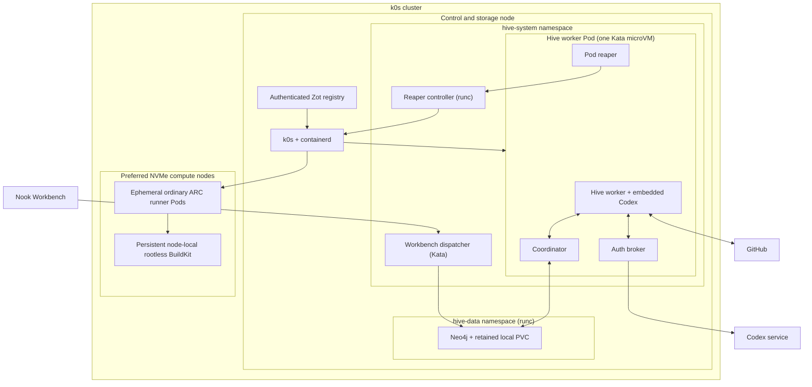
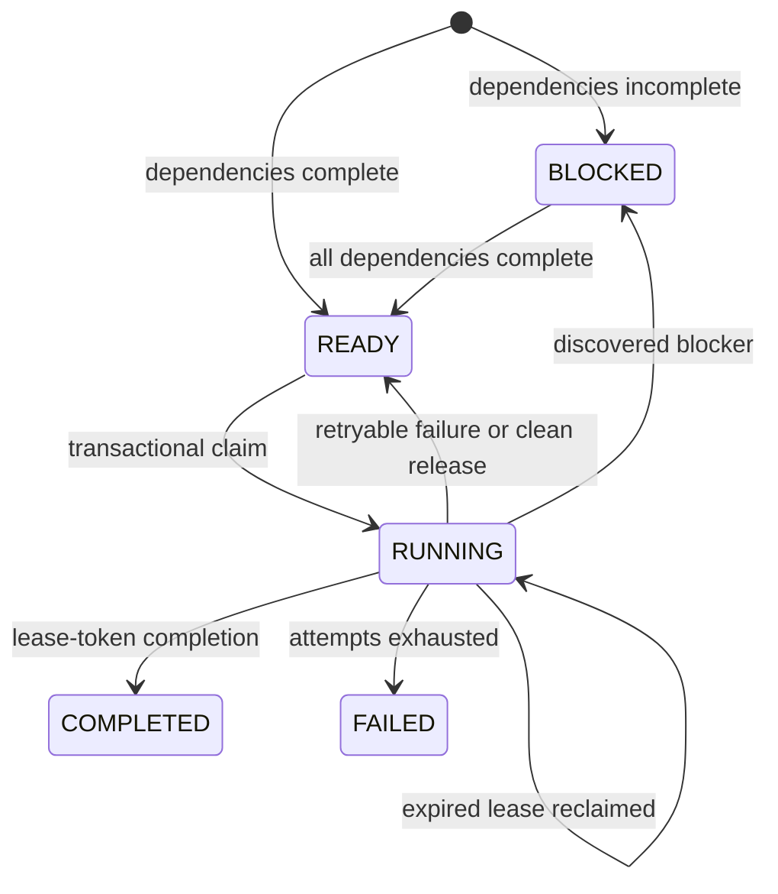

# Hive Isolated Agent Platform

## Overview

Status: Paused. Every Hive deployment declares zero replicas after duplicate
repair PRs were generated for one ARC cache incident. Re-enabling Hive requires
a verified single-incident and single-repair invariant.

Hive is Nook's self-hosted, stateful AI-agent platform. Its control and storage
services run on the dedicated Linux machine addressed by the default
infrastructure target `debian@ssh-ovh-borg-1.bynull.link`. Dedicated compute
nodes join the same k0s cluster through authenticated WireGuard transport.
containerd starts Kata Containers microVMs, and Neo4j persists the task graph,
leases, attempts, results, and dependency artifacts.

The platform is stateful; workers are deliberately not. Each worker Pod handles
at most one task, exits, and is replaced by a clean Kata-backed Pod. A logical
Main-repair task nevertheless survives Pod replacement and owns delivery until
its reviewed pull request is squash-merged, the resulting Main revision is
green, and the Workbench incident is completed.

## 1. Architectural boundaries

Hive separates four responsibilities:

1. **Kubernetes schedules isolated execution.** k0s maintains the worker pool
   and Kata supplies the guest-kernel boundary.
2. **Neo4j coordinates durable work.** It is the only task queue, DAG, lease
   store, attempt history, and artifact store.
3. **Embedded Codex performs repository work.** Hive uses the in-process Codex
   core API. It does not spawn a Codex CLI process or parse CLI JSONL. Every
   worker turn starts with `gpt-5.6-sol` at `medium` reasoning effort.
   If that run fails because Sol or usage quota is exhausted, Hive retries once
   with `gpt-5.3-codex-spark` at `xhigh` effort. One worker runs one Codex thread.
   Nested subagents are disabled. Future multi-agent graphs materialize each
   reached node as a separate Hive task and disposable Pod.
4. **Codex agents are trusted operators.** Main-repair agents receive a scoped
   GitHub credential and use standard `git` and `gh` workflows directly. Hive
   must not introduce a custom publication broker, filesystem mailbox, signed
   request protocol, or similar layer solely to protect GitHub credentials from
   Codex. Kata isolation and disposable workspaces remain operational
   containment and lifecycle tools. They are not a statement that the agent is
   hostile.

Hive does not add NATS, Redis, PostgreSQL, RabbitMQ, KubeVirt, or a
Kata-specific application orchestrator. SeaweedFS S3 used by Hive CI is only an
optional remote `sccache` compiler-output cache; it is not runtime coordination
or durable Hive state.

## 2. Deployment topology



The cluster separates durable control and storage from disposable build
compute. The control node is labeled
`nook.nokey.sh/node-role=control-storage`. Neo4j, Zot, Hive, ARC controllers,
and ARC listeners remain there. KS-6 and dedicated compute nodes may also be
qualified with `nook.nokey.sh/arc-build=true`; general and Hive ARC scale sets
select those nodes. They enforce a maximum hostname skew of five, then use the
primary, secondary, and overflow tiers to assign the extra slots. Container
CPU requests provide the aggregate capacity boundary across scale sets. Each
ARC build node owns one persistent BuildKit shard. Node and Pod traffic crosses
an authenticated WireGuard mesh on `10.202.0.0/24`. Each worker address has one
owner. Before
mutating a controller peer, deployment verifies that any persisted peer key
and Kubernetes `InternalIP` assignment identify that same worker. Address collisions fail
closed. The Kubernetes API retains its stable `10.201.0.1` address.

Neo4j runs with the normal container runtime because it is a persistent
infrastructure service. Task workers use `kata-dragonball`. The dispatcher uses
Kata QEMU because it does not share the worker sidecar socket and must avoid the
Dragonball network churn observed on KS-6. Dragonball is the Rust-based VMM
built into Kata runtime-rs. It provides the full CRI and virtio-fs behavior
required by Hive workers with lower startup and memory overhead than QEMU. The authoritative
version pins for k0s, Helm, Kata, Neo4j, and the Hive image are in the
[`infra/Taskfile.yml`](../../../../infra/Taskfile.yml) composition root and its
reachable [`infra/tasks/`](../../../../infra/tasks) domain modules; manifests live
under [`infra/k0s/`](../../../../infra/k0s).

Before applying a new worker/coordinator, dispatcher, or observer revision:

- The deployment task scales all three graph-client Deployments to zero.
- It verifies no running or pending graph-client Pod remains.
- Terminal `Succeeded`, `Failed`, and `Evicted` Pod records do not block the
  drain.
- Their manifests use the Kubernetes `Recreate` strategy.

A graph-schema rollout drains every older binary globally before any new revision
can migrate and serve the retained graph. Temporary control-plane unavailability
is preferred to mixed schema semantics.

The worker installs termination handling before its first claim. It finishes any
in-flight claim transaction before releasing a newly acquired lease. During Pod
shutdown, the coordinator remains available until the worker records its
terminal lifecycle marker or Kubernetes exhausts the Pod grace period. The
rollout cannot strand a `RUNNING` lease under a removed Pod.

After rollout, the deployment requires three consecutive samples with four
non-terminating workers whose Hive containers are ready. A disposable worker
may finish a task during verification. Its replacement must converge before
sandbox and lifecycle checks continue.

## 3. Components and ownership

| Component               | Runs where                      | Owns                                                                                                                                                                     | Must not own                                                       |
| ----------------------- | ------------------------------- | ------------------------------------------------------------------------------------------------------------------------------------------------------------------------ | ------------------------------------------------------------------ |
| Main failure handoff    | GitHub Actions                  | Converts every actionable unsuccessful trusted `Main` run into one Workbench incident keyed by failed SHA, including browser E2E and UI-demo failures                    | Agent execution, raw failure logs, deployment                      |
| Workbench dispatcher    | One Kata Pod                    | Polls public-safe `status: ready`, `automation: hive` incidents, binds the referenced run to the exact Nook Main push SHA, and idempotently enqueues unresolved failures | GitHub publication token, Codex auth                               |
| Neo4j                   | `hive-data`, runc, retained PVC | Task DAG, readiness, claims, leases, agents, attempts, results, artifacts, schema migrations                                                                             | Codex or repository execution                                      |
| Control Center observer | Dedicated runc Pod              | Read-only, localized task/worker projection and the static operator dashboard                                                                                            | Task mutation, Codex auth, GitHub credentials, or raw agent output |
| Coordinator             | Worker Kata Pod                 | Neo4j credential and a typed Unix-socket task-store protocol                                                                                                             | Raw-query access for the worker                                    |
| Worker                  | Worker Kata Pod                 | Claim loop, workspace, heartbeat, embedded Codex thread, scoped GitHub credential, standard GitHub delivery, terminal result, dependency patch delivery                  | Raw Neo4j access or Kubernetes administrative credentials          |
| Auth broker             | Worker Kata Pod                 | Codex credential source, refresh, and one established token channel                                                                                                      | Repository execution or GitHub publication                         |
| Pod reaper              | Worker Kata Pod                 | Requests whole-Pod replacement with an opaque one-purpose credential                                                                                                     | Kubernetes API or auth persistence                                 |
| Lifecycle controller    | Dedicated runc Pod              | Validates Hive Pod identity, deletes only labeled Hive Pods, and reconciles the live Neo4j endpoint into worker and dispatcher egress policies                           | Codex auth or task execution                                       |
| Kubernetes Deployment   | k0s                             | Four ready worker Pods and clean replacement                                                                                                                             | Durable task semantics                                             |

The warm-pool size is four. Each Pod is a security and lifecycle unit, not four
independent long-lived worker processes sharing one filesystem.

## 4. Task and graph model

The graph contains:

```text
(:Task)-[:DEPENDS_ON]->(:Task)
(:Task)-[:INCLUDES_ARTIFACT_FROM]->(:Task)
(:Agent)-[:EXECUTED]->(:Attempt)-[:FOR_TASK]->(:Task)
(:Attempt)-[:PRODUCED]->(:Artifact)
(:TaskActivity)-[:FOR_TASK]->(:Task)
```

Task definitions include a full 40-character `source_commit`. Every task in one
dependency DAG must target the same source revision. Hive graph schema
migrations are explicit and versioned; a binary refuses a graph newer than it
supports. Schema 5 introduces the persisted `CANCELLING` state and its
Pod-termination acknowledgement contract. Schema 6 adds semantic task activity
with a per-task bound of 200 events. Activity contains localized message keys,
timestamps, categories, and bounded operational detail; it never stores raw
model reasoning, command output, prompts, credentials, or repository secrets.
New tasks also persist typed trigger provenance (`manual-cli`,
`github-main-failure`, or `agent-dependency`) at enqueue time; the observer
localizes that durable value and labels pre-migration tasks as unknown instead
of guessing their source from task kind.

### Stored readiness invariant

- `BLOCKED` means at least one direct dependency is not `COMPLETED`.
- `READY` means every direct dependency is `COMPLETED`.
- Completion promotes newly unblocked tasks in the same write transaction.
- Claiming always revalidates dependency state, so stale stored readiness cannot
  authorize execution.



Claiming is a Neo4j write transaction. It obtains a write conflict through
`claim_lock`, revalidates task status, dependencies, attempt limits, and lease
expiry, then creates a unique attempt and lease token. Heartbeat and completion
must present the current token. A late worker cannot overwrite a replacement
attempt.

Production workers use a one-hour renewable lease, a one-minute heartbeat, a
six-hour task timeout, and bounded idle polling with jitter. The lease window
must cover long repository checks even if the embedded agent briefly delays
the renewal task; accepted renewals remain visible in worker logs. Rollout
interruption releases the task and decrements the consumed attempt before the
Pod exits.

### Blocking dependencies

Codex may return a typed blocker instead of pretending the parent task is
complete. Hive then:

1. idempotently creates or reuses the higher-priority blocker;
2. adds a `DEPENDS_ON` edge;
3. records the blocked attempt;
4. releases the parent's retry consumption; and
5. makes the parent `READY` immediately if the reused blocker was already
   complete, otherwise `BLOCKED`.

#### Dependency depth boundary

- Only a non-blocker task may create a dependency.
- A blocker task is a dependency leaf.
- It must use the authority and tools already supplied.
- A dependency leaf may return an explicit failed terminal result.
- Hive records that result as a failed attempt on the leaf.
- Hive does not create a child task.
- The bounded retry budget completes the leaf or fails its dependent chain.
- Schema migration 9 converts completed-child edges to artifact lineage.
- An active child keeps its scheduling edge until it reaches `COMPLETED`.
- Completion atomically converts that final edge and readies the parent leaf.
- Claims traverse that lineage in depth order so child patches apply first.
- Scheduling and rearm traversal ignore artifact-lineage edges.
- The leaf policy prevents active retained chains from growing while they drain.

When the blocker completes, its Git patch becomes a dependency artifact. A
replacement worker verifies the artifact digest, applies it to the same pinned
revision, commits a dependency baseline, and gives the parent task both the
dependency summary and resulting source. Resumed publication branches still
receive dependency artifacts added after the branch was first created.

A blocker may retire as obsolete without resolving its named prerequisite only
when all of the following hold:

- Every active transitive non-blocker consumer is a Main-repair task.
- Every one of those repairs is already squash-merged with a successful
  containing Main run.

**Claim and completion guards**

- Claiming snapshots the complete sorted owner set.
- Completion transactionally rechecks that exact set.
- Completion refuses retirement if a Main repair or any non-Main consumer was
  attached while the blocker was running.

Before completion, the worker independently runs the full deterministic proof
for every owning repair:

- branch state;
- merged PR;
- squash merge;
- ancestry; and
- successful containing Main run.

Exceptional retirement has bounded effects:

- It does not require the owner's later review, deployment, or Workbench
  completion steps.
  - Those remain part of the owning task's terminal delivery verifier and may
    wait on this blocker.
  - Prompt compliance alone cannot retire a live prerequisite.
- A refused retirement releases the lease and retry consumption so another
  worker can re-evaluate updated ownership.
- A successful schema-8 terminal result records `obsolete: true` on both the
  task and attempt.

**Rearming obsolete blockers**

If a future task discovers or directly depends on the same stable blocker ID,
Hive transactionally rearms the dependency subtree only when that requested root
is itself obsolete.

Both direct enqueue and discovered-blocker attachment:

- create the owner edge; and
- take a write lock on that root before re-reading and rearming it.

A concurrent retirement cannot leave the new consumer treating the blocker as
satisfied.

Rearming:

- preserves the monotonic attempt number;
- extends the maximum by three attempts; and
- derives each task's state from its direct dependencies.

Rearming preserves these completion boundaries:

- A normally completed root remains satisfied even if historical obsolete
  descendants are still attached.
- Normal completion, including a real patch produced while owners change,
  bypasses the retirement-only guard and persists normally.
- Shared-owner, mixed-owner, late-owner, future-owner, and genuine-completion
  races are behavior-tested in
  `agentic-ai/minds/hive/tests/neo4j_store.rs` and its focused `rearm.rs`
  integration capability.

### Durable results

Terminal summaries are bounded to 64 KiB. Authored changes are stored as a
bounded binary Git patch of at most 1 MiB, with a SHA-256 digest, in the same
transaction as attempt completion. These graph artifacts are suitable for
dependency handoff; large logs and build artifacts remain outside the current
prototype.

## 5. Worker execution lifecycle

```mermaid
sequenceDiagram
  autonumber
  participant K as Kubernetes
  participant W as Worker
  participant C as Coordinator
  participant N as Neo4j
  participant A as Auth broker
  participant X as Embedded Codex
  participant G as GitHub

  K->>W: Start clean Kata-backed Pod
  W->>C: Claim one task
  C->>N: Transactional claim + attempt + lease
  N-->>W: Pinned task and dependency context
  W->>W: Fetch pinned Git object and apply dependency artifacts
  W->>A: Establish short-lived Codex auth channel
  W->>X: Start one in-process thread
  loop While the task runs
    W->>C: Heartbeat current lease token
    X->>G: Standard git and gh delivery operations
    X-->>W: Progress and structured result
    W->>W: Append typed validation execution event
  end
  W->>C: Complete, block, fail, or release
  C->>N: Commit terminal state
  W->>W: Write terminal lifecycle marker
  K->>K: Reaper deletes Pod; Deployment replaces it
```

The worker creates a sentinel with create-once semantics before claiming. If
the worker container restarts in the same Pod, it refuses to claim again and
the reaper deletes the Pod. This preserves the one-task-per-microVM invariant.
While idle, the worker validates its already-established auth channel before
every claim attempt. A restarted or failed auth sidecar therefore removes
readiness and triggers whole-Pod replacement before any task attempt is
consumed.
The task lifecycle has a six-hour bound so diagnosis, implementation, review,
merge, and resulting Main verification remain one durable unit of work.

Repository checkout starts from the task's full pinned Git object ID, not a
moving branch. A Main repair may resume a durable Hive publication branch only
after proving that the pinned revision is its ancestor.

## 6. Main failure to completed repair

Main uses a single concurrency group with `cancel-in-progress: false`. The
active run finishes, including cache publication, while GitHub coalesces a
burst of later pushes to the newest pending revision.

An actionable unsuccessful completed Main run follows this path:

```mermaid
flowchart LR
  failed["Failed Main run"] --> handoff["Trusted failure handoff"]
  handoff --> incident["Workbench incident keyed by failed SHA"]
  incident --> dispatcher["Token-free dispatcher"]
  dispatcher --> task["Neo4j main-repair task"]
  task --> diagnose["Diagnose and implement"]
  diagnose --> pr["Normal PR + ci:full-e2e"]
  pr --> review["Exact-head checks and all review surfaces"]
  review --> merge["Serialized squash merge"]
  merge --> main["Resulting Main verification"]
  main --> worklog["Workbench issue + worklog completion"]
  worklog --> complete["Neo4j task COMPLETED"]
```



Every failed browser E2E, UI-demo, native, WASM, build, deployment, mixed, or
unknown Main attempt follows the repair path above.

A later failed rerun:

- restores the incident to `ready`;
- clears prior completion evidence; and
- creates a new task generation keyed by workflow run and attempt.

- **Earlier active generation:** The dispatcher cancels it before enqueueing the
  new generation.
  - The next worker receives the latest failed-job evidence without creating
    competing repairs.
- **Cancellation handshake:** The dispatcher aborts that reconciliation cycle
  after requesting cancellation. The running worker then:

  - stops its Codex execution; and
  - atomically acknowledges termination in Neo4j.

- **Pod deletion proof:** In parallel, the dispatcher asks the credential-gated
  lifecycle controller to delete the exact worker Pod recorded for every
  cancelling root or exclusive blocker.
  - The controller validates the worker label.
  - It waits for Kubernetes to confirm deletion before the dispatcher finalizes
    cancellation.
  - This provides durable recovery when a worker crashes before acknowledging.
- **Replacement barrier:** The old generation and its cancelling descendants
  remain active until deletion proof.
  - No replacement becomes claimable merely because time elapsed.
  - Reconciliation of the current run/attempt generation is idempotent and
    never cancels it.
- **Blocker scope:** Cancellation also cancels blockers exclusive to the
  superseded delivery. Shared blockers remain available to other live
  dependents.
- **Publication history:** Branches, plans, and worklogs are generation-specific.
  - The incident path remains keyed by source SHA.
  - Completed or failed generations and their publication history remain
    immutable.
- **Dispatcher reconciliation:** Maintain a shallow public Git checkout of
  Workbench and reconcile only when its revision changes.
  - Remember reconciled incident filenames for the life of the Pod.
  - Fetch the referenced workflow run once before enqueueing.
  - Require repository `meta-secret/nook`, workflow `Main`, push event, branch
    `main`, and the incident's exact source SHA.
  - Order run IDs and attempts across the complete incident history so older
    runs cannot supersede newer evidence.
  - A later successful rerun retires an existing incident only after the same
    Pod-termination barrier stops active repair.
  - A success observed before failure handoff writes a completed tombstone so
    delayed older failures remain stale.
  - Retirement cancels only the current active generation.
  - Use bounded timeouts for Kubernetes Pod API calls.

One logical Hive task owns the entire repair. Opening a PR is intermediate
state, not completion. The task must:

1. diagnose from retained workflow evidence;
2. implement and run repository operations through Taskfiles;
3. publish a deterministic repair branch and PR;
4. apply the `ci:full-e2e` label;
5. inspect exact-head repository checks, inline threads, review bodies, and
   top-level PR comments;
6. reply to each actionable item and resolve its thread after the reply exists;
7. prove the PR head contains current `main`;
8. acquire the short-lived `hive-merge-lock` Git ref and squash-merge the exact
   verified head;
9. verify the resulting Main run; and
10. complete the Workbench incident, linked plan, and worklog.

An incident remains the durable desired-state signal. Neo4j owns actual execution
state and attempt history.

Operators inspect that state with `task infra:hive:queue:status`. That command
includes the latest and previous attempt outcomes. Replacement-Pod failures
remain diagnosable.

A failed Main-repair is not automatically rearmed on every dispatcher poll.
After repairing the platform, the explicit
`task infra:hive:queue:retry HIVE_TASK_ID=...` transition:

- preserves prior attempts;
- guarantees at least three post-release attempts per reachable member without
  reducing a larger operator-granted budget;
- atomically rearms obsolete dependency roots, failed members, and historical
  blocked members from leaves toward the Main repair;
- leaves members whose prerequisites remain incomplete blocked with an
  operator-visible reason;
- makes dependency-free blocked leaves runnable;
- write-locks the reachable graph before inspecting retirement state;
- holds those locks through owner reactivation;
- recomputes readiness from the revived graph;
- refuses an active task; and
- cannot repeat a recovery for the same image digest.

Operators retire superseded or unsolvable work with
`task infra:hive:queue:cancel HIVE_TASK_ID=... HIVE_CANCEL_REASON=...`.
That command:

- cancels the named root and exclusive descendants;
- leaves shared blockers owned by another live root;
- marks idle members `CANCELLED` immediately; and
- marks a running member `CANCELLING` until the worker acknowledges.

### GitHub delivery recovery

- **Branch generations:** Use deterministic base branch
  `codex/hive-<task-id>`.
  - If a repair PR is closed or merged while durable work remains, create
    `-g2`, `-g3`, and later generations instead of reusing a closed PR.
  - Replacement Pods inspect GitHub for the latest generation and merged commit,
    then resume Main verification without a duplicate PR.
- **GitHub authorization:** Mount the GitHub token into the Main-repair worker
  and expose it through `GH_TOKEN`.
  - A shared repository-scoped token is acceptable.
  - Per-agent or short-lived tokens are optional operational choices, not an
    additional required security boundary.
  - Repository permissions remain the authorization boundary.
- **Publication tools:** Codex uses standard `git` and `gh` commands for branch
  publication, PR creation and inspection, replies, thread resolution,
  exact-head squash merge, Main verification, and Workbench updates.
  - Traverse every relevant check, review, comment, and thread page.
  - Follow the repository's normal readiness rules.
  - Because the sealed guest has no Docker socket, run
    `task hive:guest:pr:ready PR=<number>` instead of the Docker-backed host
    wrapper.
  - Prefer these established tools over a custom typed publication API.
- **Trust boundary:** The agent is trusted with both the credential and task
  checkout.
  - Hive does not need a broker-owned private checkout, request signing, mailbox
    correlation, or defenses against agent-substituted publication requests.
  - Credentials remain in Kubernetes Secrets or process environment, never in
    repository files, logs, Workbench records, or pull-request content.

## 7. Isolation and credential design

### Kata boundary

Every worker Pod selects `kata-dragonball`. The dispatcher selects Kata QEMU.
Neither workload falls back to `runc`. The host, KVM support, runtime class,
and guest-kernel identity are verified by infrastructure tasks before Hive
deploys.

The worker container alone uses the pinned, node-local
`nook/hive-bubblewrap.json` seccomp profile. Rootless Bubblewrap must create and
populate its mount namespace inside the guest. `Localhost` keeps the Pod
compatible with the namespace's Restricted admission policy.

Dragonball remains the outer syscall and kernel boundary. The worker still runs
as a non-root user with:

- every capability dropped;
- privilege escalation disabled; and
- a read-only root filesystem.

The profile:

- denies unknown syscalls;
- derives its ordinary allowlist from Moby's pinned `seccomp/v0.2.1` default
  profile; and
- adds only the namespace and mount calls required by Bubblewrap.

Privileged kernel APIs such as `bpf` and `perf_event_open` remain denied.
Credential and lifecycle sidecars retain `RuntimeDefault`. The Taskfile installs
the profile beneath k0s's kubelet seccomp root. It configures runtime-rs to pass
Kubernetes seccomp profiles into the Dragonball guest before applying Hive.

Restricted Kubernetes Pods mask sensitive paths in their inherited `/proc`.
That prevents an unprivileged nested sandbox from mounting a second procfs. Hive
therefore routes embedded Codex commands through a tiny wrapper that selects
Codex's explicit `--no-proc` mode. User, PID, mount, and restricted network
namespaces remain active. Only the redundant fresh procfs mount is omitted.

Deployment verification:

- launches the same no-fresh-proc Bubblewrap shape inside a live worker;
- verifies that the guest applied seccomp; and
- rejects the rollout if either boundary is unavailable.

### ARC trusted-build boundary

The dedicated [ARC Persistent BuildKit Runner Platform](arc-kata-runner-platform.md)
owns disposable runner Pods, compute placement, persistent node-local BuildKit
state, cache distribution, and ARC credential boundaries.

### Credential ownership

- **Neo4j password and private CA trust:** Mount into the coordinator.
  - Give the dispatcher its own bounded database access.
  - Do not expose the password or raw graph connection to workers or Codex.
- **Codex `auth.json`:** Mount into the auth broker only.
  - Expose only short-lived tokens on one pre-established private channel.
- **Repository-scoped GitHub token:** Mount into the Main-repair worker.
  - Expose it as `GH_TOKEN` for standard `git` and `gh` operations.
- **ARC GitHub token:** Follow the credential ownership and rotation contract
  in [ARC Persistent BuildKit Runner Platform](arc-kata-runner-platform.md#credential-ownership).
  - Never mount it into an ephemeral runner Pod.
- **Reaper controller credential:** Mount into the Pod reaper, Workbench
  dispatcher, and dedicated controller only.
  - Do not expose it to workers or Codex.
- **Kubernetes auth-refresh token:** Mount into the auth broker only.
  - Do not expose it to workers or Codex.

- **Service-account tokens:** Disable automatic mounting.
  - The service account may patch only the Codex-auth Secret.
  - Mount that projected token only in the auth broker.
  - The reaper has no Kubernetes token and calls a dedicated controller with an
    opaque credential.
- **Lifecycle-controller identity:** Restrict it to `get` and `delete` for
  labeled Hive Pods, reads of the Neo4j Service and Endpoints, and patches of
  the worker, dispatcher, and read-only observer egress NetworkPolicies.
  - Continuously reconcile the post-DNAT Neo4j Pod address.
  - While Neo4j is unready, remove its stale Pod address and retain only the
    stable Service address.
  - Use resource-version preconditions and bounded conflict retries.
  - Reload the projected Kubernetes token and opaque reaper credential for each
    request so rotation does not require restart.
- **Validation activity:** Embedded Codex commands emit typed,
  secret-sanitized JSONL outside the repository checkout.
  - Record category, timestamps, duration, outcome, and bounded command identity
    in the immutable Workbench statistics record.
- **Control Center projection:** Feed the same typed stream into bounded
  `TaskActivity` records.
  - Give the network-facing HTTP container no graph credential.
  - Permit only overview or one-task detail requests through a private
    Unix-socket coordinator sidecar.
  - Limit the credential-bearing sidecar to current workers, 200 tasks, and 100
    recent activity entries per task in a response.
  - Use direct task lookup so completed work remains inspectable after leaving
    the overview window.
- **Lease guards:** Guard completion, failure, release, blocker discovery, and
  heartbeat mutations with the lease token.
  - Blocker discovery also requires an unexpired lease.
- **Encryption at rest:** Use the k0s API server's host-generated AES-GCM
  provider.
  - Authenticate and encrypt Neo4j recovery material under that host-held key.
  - Put Secret checksums in the Pod template so rotation replaces the warm pool.

### Network boundary

Both Hive namespaces default-deny ingress and egress. Workers and the dispatcher
may use:

- cluster DNS;
- TLS Bolt to Neo4j on port 7687;
- external TCP 443 for Codex, GitHub, and HTTPS repository access; and
- external TCP 22 for task-authorized Git/SSH operations.

Only Hive worker Pods may reach the Kubernetes API service and its post-DNAT
endpoint, for the auth-persistence sidecar. The token-free Workbench dispatcher
has no API-server route. The dedicated lifecycle controller has a separate
API-server policy for its narrow Pod-deletion and Neo4j-endpoint reconciliation
identity. k0s binds that post-DNAT endpoint to the stable host loopback address
`10.201.0.1`; policy permits only `10.201.0.1/32` on port `6443`, avoiding a
bootstrap dependency on discovering an endpoint through an already-stale
allowlist.

Private, loopback, link-local, multicast, and cluster address ranges are
excluded from general external egress. Neo4j Bolt and HTTP are never exposed on
the machine's public address. The Control Center is cluster-private and
credential-free; operators reach it only through the repository-owned SSH
port-forward:

```text
task infra:hive:dashboard
```

## 8. Persistence and recovery

The stateful boundary is:

- Neo4j data on the retained `hive-local-retain` persistent volume;
- graph schema migrations and all task/attempt state;
- bounded dependency patches stored in Neo4j;
- deterministic GitHub branches and pull requests for Main delivery;
- Workbench incidents, plans, and worklogs; and
- encrypted Kubernetes Secrets plus the authenticated recovery bundle.

The disposable boundary is:

- repository checkout;
- Codex home and process state;
- temporary files and Unix sockets; and
- the Kata guest itself.

Failure recovery is therefore explicit:

- **Worker crash:** the lease expires and another Pod claims a new attempt.
- **Stale worker:** heartbeat and completion fail because its lease token no
  longer matches.
- **Rollout/SIGTERM:** the worker releases the task without consuming retry
  budget.
- **Publication bind failure:** the claim is released without consuming an
  attempt.
- **Pod restart:** the create-once sentinel prevents reuse; the reaper deletes
  the Pod.
- **Closed prior PR:** the next publication branch generation is created.
- **Merged repair followed by red Main:** the task recovers the merge state and
  opens a new generation for the follow-up repair.
- **Neo4j restart:** the PVC, transactions, and leases preserve graph state.

## 9. Build verification and cache model

The repository-owned `Hive` workflow is a valuable deployment-independent
verification gate. It runs when Hive, its infrastructure, or its contract tests
change. It does not deploy the cluster.

The Dockerfile follows Nook's cargo-chef boundary:

1. plan the dependency recipe;
2. cook stable debug/test and release dependencies;
3. materialize the real test and Clippy dependency graphs in independent
   BuildKit stages so they run in parallel;
4. copy authored source onto the matching warm graph;
5. run format/Clippy and behavior tests; and
6. publish both already-verified BuildKit graphs only from `main`.

Each parallel Cargo branch uses two build jobs. Together, the test and Clippy
branches consume the runner's four-CPU BuildKit envelope without launching
eight competing compiler processes. BuildKit requests 4 GiB and may burst to
6 GiB for rustc and linker peaks.

Pull requests restore the `nook-hive-linux-amd64-v2` GitHub Actions BuildKit
scope read-only. After the BuildKit verification target succeeds, an internal
pull request may publish only a quarantined exact-head cache under
`remote-buildcache`. Only Main publishes the shared scope, after both Hive
checks and Neo4j-backed behavior tests pass. SeaweedFS S3 compiler hits avoid
recompilation, while the parallel BuildKit stages also remove Cargo metadata
and linking work from the serial critical path.

Trusted same-repository Hive runs also use the remote SeaweedFS S3 compiler
cache:

```text
https://sccache.dev.nokey.sh
bucket: nook-sccache
key prefix: nook-hive
credentials: NOOK_SCCACHE_ACCESS_KEY / NOOK_SCCACHE_SECRET_KEY
```

SeaweedFS S3 `sccache` and registry BuildKit are separate layers:

- SeaweedFS stores Rust compiler outputs.
- Registry BuildKit stores layers and dependency/source graph snapshots.
- Neither is a correctness dependency.
- `task infra:sccache:credential:sync` writes the ignored, mode-`0600`
  `~/.nook/cache/sccache-access-key` and `sccache-secret-key` files (never into
  the repo checkout). Hive build/check/test tasks use those paths by default,
  while explicit `SCCACHE_S3_*_KEY_FILE` overrides still apply in CI.
- Local runs without either credential file fail closed unless
  `SCCACHE_OPTIONAL=1`. Secret-free hosted jobs set that escape and compile
  without sccache.
- The S3 credentials are mounted as BuildKit secrets or read-only runtime
  secrets and are never copied into an image or cache layer.
- The S3 credentials are not needed by the Hive worker. Worker tasks publish
  changes and rely on repository-owned GitHub verification, where the same
  SeaweedFS cache is attached by the workflow.

ARC runners reach `registry.dev.nokey.sh` on the k0s TLS ingress path. Buildx
imports authenticated Zot refs when the selected node-local shard is cold.
Later jobs on that node reuse the persistent BuildKit state. Hive keeps its
independent exact-head registry lineage. Main producers retain dependency order
and publish shared refs only after verification.

## 10. Taskfile operations

All automated lifecycle, mutation, CI, SSH, Kubernetes, and deployment
operations go through the root Taskfile command surface. After
`task infra:kubernetes:console:install`, an authenticated operator may use the
installed `kubectl`, Helm, and k9s clients directly over SSH for interactive
inspection. Persistent platform changes still belong in Taskfile operations,
not ad hoc shell scripts.

The SSH-user kubeconfig stores no reusable credential. Its exec provider crosses
the operator's existing passwordless sudo boundary to a root-owned helper,
which mints a 15-minute token for the dedicated cluster operator identity.

Repository verification:

```text
task hive:format
task hive:check
task hive:test
task hive:build
task hive:image
task infra:k0s:manifests:check
```

Remote platform lifecycle:

```text
task infra:kvm:verify
task infra:kubernetes:console:install
task infra:kubernetes:tools:status
task infra:k0s:install
task infra:k0s:status
task infra:k0s:diagnose
task infra:services:diagnose
task infra:services:repair-network
task infra:kata:install
task infra:kata:diagnose
task infra:kata:verify
task infra:arc:render:check
task infra:arc:deploy
task infra:arc:status
task infra:arc:diagnose
task infra:arc:activate
task infra:arc:fallback
task infra:arc:smoke
task infra:neo4j:deploy
task infra:hive:deploy
task infra:deploy
```

- **Complete deployment:** `task infra:deploy` performs the complete private
  platform rollout.
  - It syncs repository-owned k0s configuration.
  - It installs and verifies k0s and Kata.
  - It deploys ARC, disposable regular runner Pods, and three persistent
    rootless BuildKit shards.
  - It deploys Neo4j and preserves cluster-rotated credentials.
  - It publishes the exact Hive image, deploys the warm pool, and verifies Pod
    replacement.
- **Encryption-provider permissions:** Keep the file `root:root 0600`.
  - Grant the dedicated `kube-apiserver` user read-only access through a POSIX
    ACL without ownership or write authority.
  - If the API server cannot start, use `task infra:k0s:diagnose` for bounded
    service, listener, permission, ACL, and journal evidence without secret
    contents.
- **Host firewall:** Keep default-drop input and forward policies. Add only
  persisted k0s rules for cluster Pod CIDR `10.244.0.0/16` traffic arriving on
  `kube-bridge`:

- local control-plane access on TCP `6443`/`8132`;
- kubelet access on `10250`; and
- Pod egress.

  - Kube-router masquerades cluster egress.
  - CoreDNS and allowlisted worker egress receive replies through the node.
  - Do not expose a control-plane port on the public interface.

- **Installer rollback:** Use a temporary owned rule while k0s starts.
  - Restore previous live and persisted firewall state on error, exit, or
    termination.
  - Flush and recreate both managed host chains from a complete ordered
    snapshot while preserving unrelated rule positions.
- **CNI migration:** Record existing CNI state before restarting k0s.
  - A controller rewrite cannot hide an `ipMasq` migration.
  - Replace existing Hive, dispatcher, and lifecycle-controller Pod sandboxes
    automatically during migration.
- **Stable API address:** Use `10.201.0.1` and its exact `/32` in the worker
  egress template instead of deployment-time endpoint lookup.

The `nook-k0s-api-address.service` systemd unit:

- assigns the `/32` before k0s starts; and
- is enabled across reboots.

Installation verifies both unit state and the live `lo` address.

Initial credential bootstrap requires explicit local file inputs:

```text
HIVE_CODEX_AUTH_FILE=/absolute/path/to/auth.json
HIVE_GITHUB_TOKEN_FILE=/absolute/path/to/token
```

Credential bootstrap follows these rules:

- Copying credentials into encrypted Kubernetes Secrets is security-sensitive
  and requires immediate user confirmation before the initial
  `task infra:deploy` or `task infra:hive:deploy`.
- Routine public-Zot image deployments preserve the existing
  `hive-codex-auth` Secret because Hive refreshes and persists it in-cluster.
- Replacing that Secret from a local bootstrap file is a separate explicit
  operation.
- Rotation, Hive deployment, and Neo4j TLS rotation share a remote mutation
  lock so infrastructure cannot recreate brokers between quiescence and Secret
  publication.
- Credential bytes stream from SSH stdin through remote validation directly
  into `kubectl apply` without regular-file staging.
- Bootstrap rechecks the cluster Secret after acquiring the lock and skips
  publication if another waiter already supplied it:

```sh
HIVE_CODEX_AUTH_FILE=/absolute/path/to/auth.json task infra:hive:auth:rotate
```

Never pass an older local Codex auth file to routine deployment as a rotation
substitute. The GitHub publication credential retains its existing explicit
file synchronization contract.

Destructive k0s uninstall requires `K0S_UNINSTALL_FORCE=1` and preserves
encrypted Neo4j recovery material by default. It removes the owned live k0s
firewall rules, persisted fragment, and nftables include without reloading the
global ruleset.
Worker admission rejects a mesh address or Kubernetes node name already owned
by a different node before controller mutation. Reconciliation replaces only
the comment-owned mesh rules in one checked nftables transaction. Docker and
unrelated dynamic firewall state remain live on both the controller and worker.
The ARC cache verifier binds every claimed runner name to host-observed CRI
metadata for that request lane's Pod UID before creating a promotion intent.
Every writable request lane is a host-created Btrfs subvolume with a 1 MiB
exclusive quota. Acceptance must reach the lane before an intent is installed,
and exclusive intent creation prevents retries from refreshing its deadline.

## 11. Source map

- **Rust platform implementation:**
  [`agentic-ai/minds/hive/src/`](../../../../agentic-ai/minds/hive/src)
- **Task dependencies and artifact lineage:**
  [`neo4j.rs`](../../../../agentic-ai/minds/hive/src/neo4j.rs) and
  [`migration.rs`](../../../../agentic-ai/minds/hive/src/neo4j/migration.rs)
- **Worker image and cache stages:**
  [`agentic-ai/minds/hive/Dockerfile`](../../../../agentic-ai/minds/hive/Dockerfile)
- **Hive developer commands:**
  [`agentic-ai/minds/hive/Taskfile.yml`](../../../../agentic-ai/minds/hive/Taskfile.yml)
- **Infrastructure command composition:**
  [`infra/Taskfile.yml`](../../../../infra/Taskfile.yml)
- **Infrastructure operations and pins:** [`infra/tasks/`](../../../../infra/tasks)
- **k0s, Kata, Neo4j, and Hive manifests:** [`infra/k0s/`](../../../../infra/k0s)
- **Main failure handoff:**
  [`.github/workflows/main-failure-handoff.yml`](../../../../.github/workflows/main-failure-handoff.yml)
- **Hive verification workflow:**
  [`.github/workflows/hive.yml`](../../../../.github/workflows/hive.yml)
- **Main coalescing and delivery:**
  [`.github/workflows/main.yml`](../../../../.github/workflows/main.yml)
- **Workbench issue contract:** [issues](../../../gizmo/workflows/issues.md)
- **Pull-request ownership contract:**
  [pull requests](../../../gizmo/workflows/pull-requests.md)
