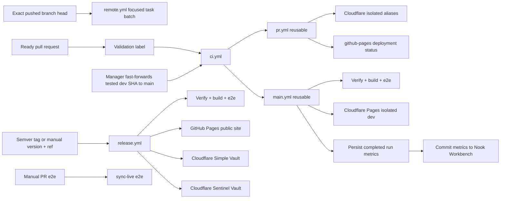

# CI / GitHub Actions Pipeline

## Agent delivery applicability

Follow the [dev delivery contract](../../../gizmo-prime/architecture/dev-delivery.md) for
feature compilation and the manually run dev manager's slow PR cycle.
Runtime workflow details below do not grant permission to run local tests or
feature-stage slow checks.

## Overview

System of record for how Nook validates changes in GitHub Actions. Agents must understand this split before changing workflows or e2e.

Agent worklogs and statistics live in `meta-secret/nook-workbench`, so they do
not create Nook branches, PRs, product validation, or recursive Main builds.
See [issues](../../../gizmo-prime/workflows/issues.md),
[agent statistics](../../../gizmo-prime/workflows/agent-statistics.md), and
[main-build-statistics.md](main-build-statistics.md).

## Central CI entrypoint

[`ci.yml`](../../../../.github/workflows/ci.yml) owns PR, Main, scheduled,
and manual ecosystem execution in one Actions run named `CI`.

- A secret-free classifier reads changed paths without executing source.
- Repository policy runs on PR changes and Main pushes.
- A validation label activates product checks for subsequent PR commits.
- The router reads current labels to avoid stale event ordering.
- Removing the validation label disables product checks on later pushes.
- Main product work retains its separate path selection.
- PR replacement and close events use native concurrency.
- Base-only edits and close events start no classifier or validation jobs.
- Main runs remain serialized to protect cache publication.
- Runner jobs have a ten-minute maximum. The three Rust ecosystem jobs use
  five minutes. Existing shorter limits remain in place.
- Privileged completion publishers remain separate trusted workflows.
- Manual remote execution and release workflows remain separate.

## Workflow map

### Workflow details

**`remote.yml`**

- One or more selected Taskfile commands on one configured ARC runner.
  Browser selections use the container scale set.
- Checkout, Docker setup, and cache connection happen once per batch.
- Selected tasks run sequentially and report individual results.
- Git-commit-scoped Zot writes (`-git-<sha>`), with Main used only while the
  exact scope is absent.
- Read-only SeaweedFS compiler-object access.
- No merge authorization.

**`pr.yml`**

- Web verification has a ten-minute job limit.
- Rust domain unit tests + coverage, no-opt WASM, web/unit tests, all three web builds.
- Shared Rust ecosystem gates via `rust-ecosystem-checks.yml`.
- Those ecosystem jobs run in parallel with native Rust, WASM, and verify.
- Deterministic tests, fuzz smoke, and Kani share one runner and run concurrently.
- Each check reports its result; any failure fails the shared job.
- PR native coverage owns replication unit tests with snapshot updates disabled.
- The deterministic check retains doctests and Loom.
- Other callers retain the full deterministic suite by default.
- Unlabeled pushes skip product validation.
- `ci:validate` or `ci:full-e2e` remains active across subsequent commits.
- Headless UI-demo execution is temporarily disabled.
- The UI-demo contract and focused spec requirement remain active.
- New UI-demo artifacts are not published.
- Internal harness plus isolated native Pages aliases.
- `github-pages` deployment status.
- `ci:full-e2e` additionally runs the Main-equivalent local-provider + extension browser suite.
- Keep independent long-running gates on separate ARC Pods.
- Combine jobs only when measured setup savings exceed lost parallelism.
- Cache health consumes deterministic JSON telemetry from all seven BuildKit
  producers and also records the terminal status of the exact-image UI demo,
  extension, and full-browser consumers. Skipped optional consumers are
  neutral. Each selected consumer publishes a start sentinel after its exact
  image launches. A later functional failure is diagnostic only; a missing
  sentinel on failure/cancellation identifies cache setup or timeout and
  activates the Docker Cache Specialist.
- Each ordinary PR publishes isolated immutable `-git-<head-sha>` cache refs. All seven
  producers, including ARC jobs, may update their own target ref after a
  successful solve, so a fresh shard and the next PR head restore the prior
  graph. Main remains read-only fallback and remote `build:compile` retains its
  immutable `-git-<sha>` proof identity.

**`repository-policy.yml`**

- Runs preflight and Loom policy for every pull request and Main push.
- Validates the checked-out tree without fetching or comparing a base SHA and
  without classifying changed paths.
- Delegates repository-owned commands to the repository-policy Task surfaces;
  the workflow retains only Actions setup and trust-boundary wiring.
- Verifies source architecture, formatting contracts, Loom formatting, lint,
  types, tests, Cortex structure, authored TypeScript state, and Loom API
  contracts.
- Trusted same-repository human PRs and Main use private ARC and BuildKit.
  Fork and Dependabot PRs use secret-free hosted checks.
- Remains separate from Main product orchestration.
- Enforces the authored source-file limit.
- Enforces Rust unit-test colocation.

**`web-research.yml`**

- Checks and builds the isolated research package.
- Deploys path-applicable PR previews and Main updates to Cloudflare Pages.
- Records the deployment and comments the PR preview URL.

**`pr-validation-handoff.yml`**

- Runs from trusted default-branch code.
- Publishes only completed CI runs with successful opted-in product verification.
- Verifies the successful source run and required jobs.
- Validates native/WASM artifact shapes, attaches provenance.
- Publishes exact-input handoffs that later PRs may trust.

**`linear-ui-demo.yml`**

- Runs from the trusted default branch.
- Uses an independent publisher group. Central CI owns close cancellation.
- Keeps artifact publication disabled.
- Keeps the retained publisher implementation available for later re-enable.
- Completes or cancels matching Linear issues created before publication was
  disabled.

**`main.yml`**

- Owns merged-head ecosystem cache seeding and statistics.
- Native Rust, WASM, and browser-free web verification use the configured ARC scale set.
- Each lane serially exports its already-solved local BuildKit graph after validation.
- Local-provider web e2e and extension e2e consume verified WASM on separate
  runners.
- Each browser E2E solve is read-only.
- Headless UI-demo execution and new artifact publication are temporarily
  disabled.
- Deploys to `dev.nokey.sh` and `*.dev.nokey.sh` after required verification.

**`main-build-stats.yml`**

- Collects run/job/step timing and conclusions.
- Commits one `stats/main-build/**` record directly to Nook Workbench.

**`release.yml`**

- Restores scoped BuildKit caches, pins an immutable tag, verify/e2e.
- Deploys `nokey.sh` plus independent `simple.nokey.sh` and `sentinel.nokey.sh` artifacts.
- Publishes GitHub Release.

**`rust-dependency-updates.yml`**

- Audits every direct dependency in each Rust root.
- The roots are `nook-app/nook-platform/`, its fuzz workspace, and `preflight/`.
- Uploads an artifact when outdated direct dependencies need manual triage.

**`e2e-pr.yml`**

- Debug e2e on a PR branch (`e2e-pr` / `e2e` / `sync-live`).



## Workflow concurrency policy

Cancellation is scoped to work that a newer run actually supersedes:

- PR validation uses `pr-<number>`. A push makes earlier exact-head evidence
  stale. Native concurrency cancels the older active run on synchronization
  or a base-ref edit. Product validation stays label-gated.
- Unrelated labels and non-base edits use isolated concurrency groups.
- Rust specialist PR execution shares the central CI run.
- Web research shares central CI cancellation.
- Central event registration is independent of changed-path classification.
- Separate PRs continue to receive independent required checks.
- Do not replace this with a global PR group, which would cancel other contributors' required checks on push.
- Main is serialized: an active run completes to protect its cache writers, while the single pending slot coalesces bursts to the newest merged revision.

### Concurrency scopes

- **Central CI (`ci.yml`)**
  - Scope: `main`, `dev-pr`, `pr-<number>`, or an event-specific run group.
  - Cancel active run: No; `cancel-in-progress: false` preserves every active
    validation run and its evidence.
  - Reason: Validation and cache-publication evidence remains available even
    when a newer event targets the same logical source.
- **Remote task (`remote.yml`)**
  - Scope: ref, selected task, and dispatch nonce.
  - Cancel active run: No.
  - Reason: Selected task batches complete sequentially without interrupting
    their prepared BuildKit state.
- **Manual PR e2e (`e2e-pr.yml`)**
  - Scope: PR number and suite.
  - Cancel active run: Yes.
  - Reason: A repeated run of the same explicitly selected suite supersedes its
    older debug build.
- **Web research (`web-research.yml`)**
  - Scope: workflow-triggered preview or branch execution.
  - Cancel active run: Workflow-owned; untrusted validation remains isolated
    from trusted ARC work.
- **Stateful publishers (`dev-pr-manager.yml`, `release.yml`, and
  `pr-validation-handoff.yml`)**
  - Scope: publisher-specific group or source run identity.
  - Cancel active run: No.
  - Reason: Do not interrupt PR promotion, release deployment, or evidence
    handoff state.

## Production release strategy

Production releases use immutable semantic-version tags. The tag records the
exact source commit; the GitHub Release records that the tagged build passed the
production gate and was deployed atomically as the public `nokey.sh` site plus
the `simple.nokey.sh` and `sentinel.nokey.sh` vault applications.

Preferred release flow:

1. Open **Actions → Release production → Run workflow** on the default branch.
2. Enter the new semantic version (`1.2.0`; a leading `v` is optional) and the
   branch, tag, or commit to release (`main` by default).
3. The requested source passes the main-equivalent production gate. For a new
   manual release, the workflow creates `v1.2.0` only after that gate succeeds;
   existing tags are verified against the requested commit and never moved.
4. The tagged source is deployed to GitHub Pages and writes its version and
   commit to `nokey.sh/release.json`.
5. Only after deployment succeeds does the workflow publish the GitHub Release.

Pushing a `v*.*.*` tag manually is also supported and enters the same validation
and deployment path. A rerun is idempotent when the version and source commit are
unchanged. If a deployment fails, keep the tag and rerun it after fixing the
workflow or infrastructure; the absence of a GitHub Release shows that the tag
has not completed production release. Rollbacks use a new patch version targeting
the last compatible commit, never a moved or reused tag.

The workflow does not rewrite Cargo or package manifest versions. The deployment
version is the immutable tag, avoiding a CI-generated source mutation that would
make the deployed artifact differ from its tagged commit.

## Provider selection (`NOOK_E2E_SYNC_PROVIDER`)

The **same sync spec files** run against different backends. CI swaps providers by setting one environment variable per job:

- **`NOOK_E2E_SYNC_PROVIDER`**
  - Supported values: `file`, `local`, `google-drive`, `github`, `icloud`
  - Default value: `file`

Registry and factories live in `nook-app/nook-web/nook-web-app/e2e/sync-provider.ts`:

- **`createSyncTarget()`** — isolated e2e remote (reads provider from env)
- **`connectSyncGenesisDevice()` / `connectSyncVault()`** — provider-aware connect
- **`live/sync.smoke.spec.ts`** — explicit real-provider smoke
- **`live/google-drive-shared-grant.smoke.spec.ts`** — opt-in real Drive
  shared-folder create + `permissions.create` (+ optional joiner verify);
  skips unless `NOOK_GOOGLE_E2E_ACCESS_TOKEN` and `NOOK_GOOGLE_E2E_JOINER_EMAIL`
  are set. Distinct from private `drive.appdata` sync smoke.
- **`local` is a legacy alias for `file`** in e2e; new tests should use
  `file` when they need the default local file-backed provider explicitly.

**Main and release CI (`e2e`):** default to the `file` provider. The e2e remote stores
event files in a real temp directory while Playwright serves the oauth-file HTTP
calls, so default sync tests exercise local file-backed replication without
external API quota.

**Manual (`sync-live`):** dispatch `e2e-pr.yml` with the `sync-live` suite.
The workflow defaults `NOOK_E2E_SYNC_PROVIDER` to `github`; local runs may
select another configured provider explicitly.

Live credentials per provider:

- **`github`**
  - Credential: `NOOK_GITHUB_PAT`
- **`google-drive`**
  - Credential: `NOOK_GOOGLE_E2E_ACCESS_TOKEN` (private sync smoke, when wired)

Shared-folder grant live smoke environment (issue #289; not the private sync matrix row):

- **`NOOK_GOOGLE_E2E_ACCESS_TOKEN`**
  - Purpose: Owner token with `drive.file`
- **`NOOK_GOOGLE_E2E_JOINER_EMAIL`**
  - Purpose: Email granted writer on the folder
- **`NOOK_GOOGLE_E2E_JOINER_ACCESS_TOKEN`**
  - Purpose: Optional joiner token to verify access under that folder ID

No-live-provider mode uses Playwright route handlers (`sync-stub.ts`,
`drive-stub.ts`, `file-sync-stub.ts`) — no API quota. For the default `file`
provider, those handlers read and write real event files under a temp directory.

## Runner placement

Trusted same-repository PR native Rust plus Rust ecosystem jobs and Main build
producers use the configured ARC scale set. Focused `preflight`,
`rust:ci`, and `arc:runtime` selections use the same scale set. Trusted
Trusted browser runtime jobs use `nook-k0s-container`. ARC's Kubernetes
lifecycle hooks create a regular job Pod from the exact image built by the
general scale set. Fork and Dependabot pull requests retain GitHub-hosted
isolation. The typed placement inventory prohibits every other hosted route.
ARC scales single-use Pods instead of queueing work on one persistent Docker
host.
Main's portable WASM cache writer/proof uses the general ARC scale set.

**Zot cache policy:**

- Cold or cross-node delivery builds restore distinct private Zot BuildKit cache refs.
- Main ARC producers publish shared Zot refs after verification. Persistent
  node-local BuildKit shards accelerate repeated solves.
- Every registry exporter in the shared Rust/WASM Bake family forces zstd
  compression. Cache scope generations rotate together when that format
  changes, so a new writer never imports mixed-compression metadata from the
  retired generation.
- Trusted PR jobs that publish registry cache write only immutable git-commit scopes
  and cannot replace Main.
- Trusted ARC PR verification reuses the persistent BuildKit shard on its node
  and publishes the completed graph to its immutable head lane.
- Exact-SHA handoffs retain commit-scoped registry identity.
- Native, WASM, and web ARC producers perform a post-verification cache-only
  solve against the same persistent shard to publish their already-completed
  graph. The solve must remain cached; it must not repeat validation commands.
- A cold PR scope restores trusted Main or a dependency-fingerprint scope.
- Setup restores the current immutable head when present, otherwise the nearest
  available cache from a bounded first-parent window, then Main/cold fallback.
- BuildKit merges cache importers; list order is not fallback precedence.
- Immutable head lanes plus bounded ancestor discovery own cross-head and repeat-run acceleration without
  mutable global branch refs.
- WASM consumers read the verified dependency ref instead of competing with the larger native dependency lineage.
- Main ARC prepares native dependency/source and WASM source targets as cache-only outputs.
- The verified Main ARC solve owns the WASM dependency exporter.
- Only a `push` event on `refs/heads/main` may write the shared scopes.
- Release, agent, and manual workflows are read-only unless they use an
  explicitly isolated git-commit publisher.
- Cache-publishing PR jobs and Remote jobs write
  git-commit refs. Both use Main only while their isolated scope is absent and
  cannot replace shared Main manifests.
- The legacy registered `nook` runner is not used.

**Focused remote jobs:**

- `preflight`, `rust:ci`, and `arc:runtime` may use disposable ordinary Pods in
  on its selected node.
- `arc:runtime` proves a remote BuildKit result can be exported without a
  Docker daemon, Podman, DinD, or host socket.
- Runtime-backed selectors build a run-scoped image on the general ARC set.
  They then execute their internal daemonless task inside an ordinary Pod
  created by `nook-k0s-container` hooks.
- No cluster Pod hosts or controls Docker, Podman, DinD, or another nested
  runtime. BuildKit is build-only. Browser tasks run Playwright directly inside
  the selected Pod image.
- These selectors are `web:build`, `web:e2e`, `extension:e2e`, `check`,
  `ci:pr`, and `ci:pr:e2e`.
- Each runtime-backed selector must be dispatched alone. Mixed batches are
  rejected before repository commands execute.
  tasks use the container scale set.
- Common Rust test and web/extension check image targets remain available to
  local workflows.
- Their Docker-backed task selectors are not exposed through ARC until a direct
  ordinary-Pod implementation exists.
- Complete trusted PR, Main, manual, agent, and release graphs run on ARC.

**BuildKit cache propagation:**

- Cache records imported by a named target are local to that target's solve.
- They do not propagate through a named build context into an outer source leaf.
- Importing exact and Main together can select Main's parent and orphan an exact
  source leaf, even when the exact importer is listed first.
- An exact-only importer replays the leaf across both linked and internal parents.
- Product dependency and source stages therefore live together in
  `nook-app/nook-platform/docker/rust/product.Dockerfile`.
- Product source Bake targets must not override those internal stages with
  `target:` contexts.
- Standalone dependency restore and publisher targets use the same Dockerfile.
- `nook-app/nook-platform/docker/rust/docker-bake.hcl` owns the Rust Zot
  cache scopes and the direct WASM consumer import.
- `nook-app/nook-web/docker/web.docker-bake.hcl` owns final web/e2e image
  cache scopes.
- `nook-app/nook-web/docker/toolchain.docker-bake.hcl` owns the web-deps
  cache scope.
- `preflight/docker-bake.hcl` owns the preflight Zot cache scope.
- Loadable `nook-web*` tags live in
  `nook-app/nook-web/nook-web-app/docker-bake.hcl`.
- Loadable `nook-rust*` tags live in the platform core/wasm bake files.
- `nook-app/docker-bake.hcl` stays thin: shared GHA/registry/sccache
  variables, `_sccache`, and cross-lineage prepare groups.
- Main publishes the portable WASM dependency fingerprint from its verified ARC solve.
- Repository invariants in `preflight/tests/sccache_s3.rs` and `preflight/tests/vault_app_isolation.rs` enforce the topology and proof.

**Exact-input handoffs:**

- Split native and WASM producers restore small validated handoffs by exact input hash.
- Keys cover Rust sources and manifests, toolchain and Docker definitions, Task entry points, Docker setup, and the PR workflow itself.
- PR workflows upload only same-run artifacts.
- After the entire run succeeds, default-branch-only `pr-validation-handoff.yml`:
  - verifies the source workflow and all required jobs;
  - recreates the validated base/head merge tree;
  - validates artifact shapes, adds provenance;
  - republishes immutable trusted artifacts.
- The current attempt must contain a successful consumer.
- Each producer must succeed in the current attempt when scheduled.
- A failed-job rerun that omits an already-successful producer may reuse that producer job and run-stable artifact from an earlier attempt.
- Promotion requires the immutable PR snapshot attached to the completed workflow-run event.
- There is no post-merge or manual fallback to mutable PR metadata.
- A later PR skips a producer only after resolving an exact artifact by ID and verifying that its successful workflow run used this trusted default-branch promotion workflow.
- PR-writable caches never bypass required validation.
- Repository invariant preflight still runs on every PR head.
- On a native producer miss, preflight must finish before the native application Docker solve begins.
- `Web verification` declares `needs` on the WASM build producer.
- It downloads the run-stable WASM artifact directly after that job succeeds.
- The disabled `Headless UI demo` job retains its WASM producer dependency.
- Its implementation remains available for later re-enable.
- `Verify and preview` waits for Native Rust, web verification, and WASM Node tests.
- It retains the UI-demo job in `needs` so the skipped result remains visible.
- A disabled or non-required skip is permitted.
- An enabled, required UI-demo failure blocks preview and readiness.
- That keeps the merge-gate check red when Native fails.
- Preview deploys from a host dist handoff with pinned wrangler.
- No consumer polls GitHub for a sibling producer.
- Changed inputs must execute and complete the full workflow before a new handoff can be promoted.
- If promotion cannot prove its provenance, consumers treat the artifact as a miss and run the producers.
- The required-job budget is four to five minutes for exact handoff hits and ordinary source-changing PRs.
- Measure it from the first required job start through the last required job completion.
- Report GitHub-hosted runner queue time separately.

The web dependency stage runs `bun install --frozen-lockfile` directly in its
Dockerfile layer. It has no host or BuildKit daemon cache mount; the frozen
lockfile and immutable Docker layer are the cache and reproducibility boundary.

PR web solves normally use browser-free `web-base`. Explicitly requested
browser e2e builds `web-e2e-base` with Debian's
`chromium` and `ffmpeg` packages. Playwright uses `/usr/bin/chromium`.
Its revisioned recording path links to `/usr/bin/ffmpeg`. Do not install its
bundled Chromium and headless-shell payload. That payload creates a roughly
1.3 GB image layer on cold runners, or about 432 MB compressed.
The preparation solve runs once. The small final web-image solve retries once
after the known immediate BuildKit frontend/Dockerfile-load flake, without
repeating the multi-minute Rust/WASM and dependency graph.
The ARC S3 health probe is a separate uncached solve. It retries once only when
the Dockerfile frontend vertex itself reports a transient authorization TLS
timeout. Later build vertices and genuine S3 health failures fail closed.

### Browser validation for Main-fix PRs

PRs that fix a failure observed on `main` must carry the `ci:full-e2e` label.

- **Label effect:** Adds two `Full browser e2e shard (N/2)` jobs, the stable `Full browser e2e (main fix)` join, and selects the full suite in the existing `Extension e2e` job.
- **WASM artifact sharing:**
  - A dedicated producer verifies WASM once and uploads only its generated package.
  - Preview and both browser jobs download that artifact instead of recompiling Rust.
- **Parallel browser jobs:**
  - Two web shards run deterministic halves of every fully-parallel local-provider and split-app Playwright project.
  - Extension e2e runs independently in a third Kubernetes job Pod.
  - Browser commands execute directly inside the exact-source image built by
    the verified PR web job.
- **Isolated PR cache policy:**
  - PR browser producers publish only isolated immutable-head cache refs.
  - Each consumer uses the run-scoped browser image produced from that head.
  - An available PR ref is imported alone.
  - A missing PR ref falls back to the browser-image seed owned by trusted Main.
  - Neither web shard nor its join writes a competing browser cache.
  - Trusted Main remains the reusable browser-image seed.
  - The disabled UI-demo publisher retains its exact-run image implementation
    for later re-enable.
- **Readiness requirement:**
  - Adding or removing the label retriggers PR Actions for the current head.
  - A labeled PR cannot be ready while this job is queued, failing, or cancelled.
- **Extension e2e environment:**
  - Extension e2e starts an automatically selected Xvfb display.
  - It waits for readiness and prevents resets between Playwright retries.
  - It uses one Kubernetes job Pod so persistent-context smoke does not compete with headed Chromium tests.

### Runner allocation

- **`pr.yml`, `main.yml`, `release.yml`**
    and Dependabot code alone uses GitHub-hosted isolation.
  - Purpose: Elastic delivery with persistent node-local BuildKit and private Zot recovery.
  - Runner: ARC for trusted sources; GitHub-hosted only for untrusted sources.
  - Purpose: Independent architecture and package verification
- **`e2e-pr.yml`, `web-research.yml`**
  - Runner: general ARC plus container ARC for Playwright
  - Purpose: Manual and research work scales independently

## Why local-provider e2e vs sync-live

Real provider API calls are slow and brittle at CI scale. Nook therefore:

1. **`e2e` project** — IndexedDB flows plus sync-provider specs through isolated e2e remotes. One Playwright process, fully parallel, one preview server.
2. **`stable` project** — IndexedDB-only specs for fast manual/debug runs. It starts at 3 workers.
3. **`unstable` project** — local provider/sync specs. It runs separately at 2 workers so their shared preview-server and WASM pressure stays bounded.
4. **`sync-live` project** — Specs under `e2e/live/` hit the **real provider API** using `NOOK_GITHUB_PAT`. Minimal smoke; explicit manual runs only.

When adding Google Drive or other sync providers, add local e2e remote specs to
the `e2e` list and thin live smoke specs to `e2e/live/`.

## Parallelism and isolation

Do **not** set `workers` in `playwright.config.ts` — use Playwright defaults locally and override with `--workers=N` when you want more parallelism than the default. Spec files that need ordering use `test.describe.configure({ mode: 'serial' })` within the file only.

`sync-live` keeps `fullyParallel: false` because CI assigns one `NOOK_GITHUB_E2E_REPO` per container; parallel live files would share that remote. The local `stable` and `unstable` groups use `fullyParallel: true`, but run in separate invocations with 3 and 2 workers respectively.

## Rust dependency updates

[`rust-dependency-updates.yml`](../../../../.github/workflows/rust-dependency-updates.yml)
runs weekly and can be started manually. It runs pinned `cargo-outdated`
tooling with `--workspace --root-deps-only` in every Rust root and uploads an
artifact when direct dependencies are outdated. Updates are handled manually.

**One web server per Playwright process is enough.** CI serves static `dist/` via `vite preview`; workers share that HTTP endpoint. Isolation is at the browser layer:

- Each test gets a fresh browser context → separate IndexedDB / `localStorage`.
- Local e2e sync uses `page.route()` with a unique remote id per suite — no shared remote state.
- The Nook server is stateless; vault data never lives on the server in e2e.

Do **not** spin up multiple Nook servers for parallel e2e unless debugging port conflicts locally with `reuseExistingServer`.

## PR UI demo videos

UI demo rules:

- PR and Main headless UI-demo execution is temporarily disabled.
- New Actions and Linear demo artifacts are not published.
- Demo implementations remain retained for later re-enable.
- The UI-demo contract and focused demo-spec requirements remain active.
- PR readiness observes the UI-demo result through the preview dependency.
- It permits a disabled or non-required skip.
- It rejects an enabled, required demo failure.
- Browser E2E remains a separate validation authority.

- UI-facing changes under web apps, shared vault UI, or extension browser
  surfaces must add or update a focused
  `nook-web-app/e2e/demos/*.demo.spec.ts`.
- The PR contract rejects a UI change without a changed demo.
- Only changed demo specs run.
  - They run serially with one worker.
  - PR CI avoids the cost of the full browser suite.

**After integration, Gizmo runs the contract on the host before the first
push** (and after any later UI edit) so Verify does not discover a missing demo:

```bash
git fetch origin main
.github/scripts/ui-demo-contract.sh "$(git rev-parse origin/main)"
```

The manager's slow PR stage runs this contract. Local feature formatting stays
bounded — see
[pre-push-hygiene.md](../dynamic-skills/pre-push-hygiene.md).

When re-enabled, the `ui-demo` Playwright project runs Chromium headlessly at
1280x720. It records WebM video. The pull-request demo job starts beside web
verification.

- The demo job starts after the WASM handoff is ready.
- Its browser-image solve is read-only.
- The verified web producer publishes the browser graph to the isolated
  immutable head scope before Playwright consumers start.
- Demo-only waits may hold meaningful before and after states for review.
  - Ordinary regression specs remain full-speed.
- CI retains the Actions result for 90 days.
- After successful recording, CI uploads the 10 largest WebMs to Linear's
  private file storage.
  - One deterministic `nook-ui` issue owns all recordings for a GitHub PR.
  - One idempotent comment represents each head SHA.
  - The PR comment links the Actions fallback and Linear archive.
  - Merge completes the issue; close without merge cancels it.
  - Linear publication is best-effort and cannot invalidate Playwright
    assertions or block the product gate.

- When re-enabled, Main runs the complete UI-demo project.
  - It retains every WebM in the 90-day Actions artifact.
  - It adds only the 10 largest recordings to the associated Linear issue.
  - It leaves the issue in Done.

- Active Linear close cleanup requires the repository Actions secret
  `LINEAR_API_KEY`.
- The retained publisher requires the same secret when re-enabled.
- The unmerged `pull_request` workflow never receives that secret.
- It never loads secret-consuming code from the PR checkout.
- Never put the secret in workflow YAML, logs, comments, artifacts, or agent
  statistics.

The local Linear MCP OAuth connection is useful for interactive issue
management. It is separate from this unattended CI credential. Use
`task ui:demo` from the repository root or `cargo ui-demo` from `nook-app/` to
reproduce a recording locally.

Playwright DOM/state assertions decide pass or failure. Humans and multimodal AI
agents may review the video as supporting evidence, but visual AI review is
advisory: timing, animation, font rendering, and compression can make frame-only
judgments flaky. A future AI reviewer should consume the video plus assertion
results and traces, and must not receive real vault secrets.

The Playwright project catalog and command grouping live in
[Browser Validation](browser-validation.md).

## Task commands

Product checks run remotely in the dev manager's slow PR cycle. Feature
feedback requires a separate build-only capability. The root
`Taskfile.yml` is the repo entrypoint; app commands are included through
`nook-app/Taskfile.yml`, with
cross-package app tasks in `nook-app/ci/Taskfile.yml`, Docker tasks in
`nook-app/nook-platform/docker/Taskfile.yml`, and web-family tasks in
`nook-app/nook-web/Taskfile.yml` and package Taskfiles under
`nook-web-extension/` / `nook-platform/`:

```bash
# Feature-local feedback: scoped rustfmt and bounded TS diagnostics only

# Optional local mirrors (humans / deep debug — not agent merge gates)
task check                          # format, clippy, unit tests, wasm-bindgen tests, web build (dev/no-opt wasm)
WASM_BUILD_MODE=dev task ci:pr       # prepare → no-opt WASM → verify ‖ build (no browser e2e)
task ci:pr:e2e                       # full local-provider web e2e + extension e2e

# E2e projects
task web:test:e2e                   # full local-provider e2e (main gate; optional local debug)
task web:test:e2e:pr                # fast e2e-pr subset (manual/debug only)

# WASM tests
task wasm:test                      # wasm-bindgen smoke tests in Node (PR/main gate)
task wasm:test:browser              # browser-only wasm tests (manual/debug)

# Single spec — preferred during optional fix/debug (E2E_SPEC paths relative to nook-app/nook-web/)
E2E_SPEC=e2e/connect.spec.ts task web:test:e2e:file

# Main CI equivalent
task ci:main:e2e                    # one container, full e2e project

# Manual live GitHub (needs NOOK_GITHUB_PAT in env or .env.test.local)
task web:test:e2e:sync-live

# Legacy aliases
task web:test:e2e:github            # → sync-live
```

## Rust package coverage

`nook-app/nook-platform/nook-core/coverage-floor.json` is the exhaustive package
registry. Every testable first-party package has an independent hosted failure
decision; fuzz harnesses and vendored sources require an explicit exclusion.
PR #1319 staged companion WASM at 18, authenticator-domain at 87, and
`nook-wasm` at 51 percent. The current registry raises
authenticator-domain to 90 percent.

**Image build:**

- Source-sensitive layers are ordered by Rust dependency edge.
- Leaf and foundation crates are copied in dependency order. This includes
  `nook-app-common`, `nook-authenticator-domain`, `nook-auth2`,
  `nook-replication`, `nook-event-log`, and `nook-companion-core`. Each is
  linted and coverage-tested before `nook-core`.
- The `nook-core` coverage run uses `--no-clean`.
- A report for each portable package enforces its registry floor; the combined
  report is artifact-only and cannot mask a package failure. Artifacts are
  written to `/opt/nook/coverage/nook-core` in the image.
- The WASM lane gates companion separately, executes Chromium without cache
  credentials, and combines native and browser profiles for one `nook-wasm` report.
- The rust-dylint lane independently covers `nook_domain_api` at 90 percent.
- Preflight enforces its own floor from the canonical repository source root.
- Coverage-floor updates require complete independent hosted package results;
  the portable aggregate diagnostic is not an update authority.

**PR CI split:**

- PR CI uses independent native Rust and WASM producers.
- Native Rust runs the portable Rust nextest/coverage branch and uploads its small coverage handoff.
- The WASM build producer runs clippy/build once and uploads the generated package under a run-stable artifact name.
- `WASM Node tests` depends on that build job and finishes the producer gate.
- `Web verification` depends on the build job and downloads the package with `actions/download-artifact`.
- It can run browser-free web validation while Node tests continue.
- It exports host dist trees for preview deploy.
- The disabled `Headless UI demo` job retains its WASM build dependency and
  changed-spec implementation.
- `Verify and preview` waits for Native Rust, web verification, and WASM Node tests.
- It also retains the UI-demo job in `needs` for observable skip handling.
- A disabled or non-required skip is permitted.
- An enabled, required demo failure blocks preview.
- Optional web and extension e2e consumers start after the exact-source browser image is ready.
- Node verification runs concurrently and remains mandatory for preview and readiness.
- One Extension e2e job selects the full suite when requested, otherwise the focused authentication regression.
- Preview requires the extension result when either full or authentication coverage is required.
- A separate `Rust coverage report` job declares `needs: rust`, downloads the native handoff directly, and performs reporting without occupying or delaying the preview runner.

**Rerun and artifact rules:**

- `needs` reuses a successful producer omitted from a failed-job-only rerun.
- Consumers download the exact-head run artifact after that producer edge is satisfied.
- Do not serialize the **PR** producers or move Rust coverage into preview: a cold Rust cache must not dominate the PR web critical path.
- Coverage reporting must depend on the native producer instead of starting from the preview job.

**Main serialization:**

- Main serializes native, WASM, and web producer lanes so they advance one
  verified default-branch lineage.
- ARC jobs reuse the persistent BuildKit content store on their selected node.
- Verified Main ARC jobs publish portable source, tool, and WASM dependency refs.
- Zot exports provide cold-node recovery.
- `task docker:extract:coverage` remains a copy-only path that invokes neither BuildKit nor Rust tests.
- It also serves workflows that already have a sealed `nook-web:local` image, including main's commit-keyed coverage artifact.
- `task setup` gets those files into the slim web image through the same temporary host artifact directory as generated WASM.
- It does not copy them directly from the multi-GB Rust builder snapshot.

**Main artifact handoff:**

- After Main's native lane succeeds, `main.yml` uploads those four files plus a manifest as `nook-core-auth-coverage-<commit SHA>`.
- PR lookup trusts that commit-keyed artifact as soon as it exists, even while later Main jobs are still running or after an unrelated later job fails.
- It authenticates the workflow, push event, default branch, and exact SHA before use.
- A PR with changed Rust coverage inputs downloads and validates that artifact instead of rebuilding the base app image.
- If the artifact is missing or invalid, the report reuses the floor-validated current coverage as its comparison and emits a warning.
- It never launches a second cold Docker coverage build.
- PRs without Rust/Cargo/source changes — including changes only to coverage reporting plumbing — also reuse current coverage because the measured source is unchanged.

**Coverage input detection:**

- Compares the merge-base diff between the pull request event's explicit base and head SHAs.
- Must not compare the base to the checked-out synthetic merge; Main can advance after the event snapshot.
- Must not use a two-dot snapshot diff; a behind-base branch would then count Main-only changes as pull request changes.

## Agent host vs GitHub-hosted execution

**Trusted delivery CI uses isolated ARC with persistent BuildKit layers.**

- Trusted same-repository PR native Rust plus Rust ecosystem jobs and Main build
  producers run in disposable ARC Pods.
- Fork and Dependabot pull requests run on fresh `ubuntu-latest` VMs. Trusted
  container workloads use the dedicated `nook-k0s-container` scale set.
- On ARC, the shared setup creates a `remote` Buildx builder connected to the
  persistent rootless BuildKit shard on the selected node.
- Browser runtime jobs use a two-stage Kubernetes path. `nook-k0s` builds and
  pushes the exact-source image. ARC lifecycle hooks then create an ordinary
  job Pod from that immutable run tag on `nook-k0s-container`.
- Main publishes the verified WASM artifact, completes Node verification, and
  exports the cache from that producer's job-scoped graph. The export step may
  report its failure without failing the producer so verified artifact
  consumers can continue. A separate lightweight job converts that recorded
  outcome into a visible failing cache-publication gate. It performs no
  checkout, BuildKit setup, or second source solve. Web and prepared-Pod
  browser consumers depend on the verified artifact rather than this gate.
  The portable proof and development deployment remain gated by successful
  cache publication.
- Main's portable WASM cache writer uses an ARC solve. Static
  contracts require the release, clippy, and test dependency vertices in its
  exact Dockerfile lineage. Zot then proves child manifest digest/size plus
  every declared blob's size and SHA-256 by streaming it completely. The
  separate Bake+Zot simulation proves clean-builder import behavior. Main does
  not create an ephemeral BuildKit daemon merely to repeat that simulation.
- Cold nodes restore separate Zot scopes for stable and source-sensitive
  Rust/WASM layers, web dependencies, browser-free web, and e2e web. ARC jobs
  reuse their node-local persistent BuildKit shard.
- Neither placement uses GitHub Actions cache storage for BuildKit layers.
- PR CI assigns native Rust to one runner and WASM to another.
- The small generated WASM package feeds parallel browser-free preview validation as soon as clippy/build finishes.
- Required Node tests continue on the producer; preview deployment is blocked until that producer succeeds.
- PR browser-e2e consumers wait for the browser image producer.
- Required Node verification remains a separate preview and readiness gate.
- Native Rust separately uploads the coverage handoff consumed by the small Rust-dependent reporting job.
- The preview job never waits for native coverage.
- It runs without browser e2e. Trusted sources deploy Cloudflare previews and
  record a successful `github-pages` deployment status for the PR head SHA.
- Fork and Dependabot validation remains secret-free. It never attempts a
  credentialed preview deployment.
- A `ci:full-e2e` PR also runs the parallel artifact-backed web and extension browser jobs.
- The preview deploy reuses that prepared sealed image and must not declare another `setup` dependency.
- PR coverage always checks the current portable Rust artifact against the floor.
- Changed Rust/Cargo/source inputs reuse the exact base commit's trusted Main artifact when available.
- Missing or unchanged base coverage reuses the current artifact for comparison without another Docker solve.
- Use remote CI as the **sole PR product validation gate**.

**Gizmo remote commands:**

- Ordinary Team Agents format every changed file in their allowed scope and
  return coherent exact committed handoffs. They do not push, dispatch remote
  work, or operate external PR/check state.
- Feature Gizmos request repeatable remote build-only evidence.
- The build-only command contract must be integrated before feature acceptance.
- Only the dev manager's dev-to-main cycle uses the full slow PR workflow.
- Preserve the existing e2e opt-ins and security-required focused checks.
- Focused tasks are optional for that head and never replace complete
  validation.
- Humans may run `task pr:review-local` as an advisory local Codex review. It
  does not dispatch hosted review and never gates validation or readiness.
- Ordinary pushes do not start `pr.yml`.
- Every later push requires another explicit validation before readiness.
- Every actionable comment already present must be addressed and resolved.
- Claude, CodeRabbit, Cursor Bugbot, and other optional services are not
  requested or awaited.

**Ephemeral but cache-aware delivery jobs:**

- Trusted same-repository PR jobs, Main, releases, and manual jobs use ARC.
- Main verifies each lane and publishes portable source, tool, and WASM dependency refs.
- Cold ARC nodes use the same portable Zot contract.
- Empty `cache-from=` and `cache-to=` overrides are prohibited across Taskfiles and scripts.
- Protected default-branch Zot refs remain available to every node and hosted
  job. ARC jobs reuse a warm local shard before registry transfer.
- Same-repository PR jobs authenticate with the Remote registry identity; Zot ACLs deny that identity write access to `nook/buildcache/**`.
- PR Bake exporters write only immutable head refs under `nook/remote-buildcache/**`.
- Docker setup probes each full-graph PR ref separately.
- The selected immutable head or nearest first-parent ref is imported alone.
  Missing candidates use dependency fingerprints and trusted Main.
- Fork pull requests receive no registry credentials.
- Secret absence is the complete private-registry boundary: those jobs skip
  Zot login, BuildKit-image preload, registry probes, imports, and exports and
  use the local cold BuildKit path.
- Native coverage and WASM source-sensitive layers have separate Zot refs in addition to the manifest-only dependency refs, so non-Rust pushes do not repeat unchanged Cargo compilation.

**SeaweedFS sccache:**

- Trusted Main Rust/WASM producers and explicitly dispatched same-repository Remote tasks use authenticated SeaweedFS S3 `sccache`.
- Compiler vertices receive the bucket-scoped build identity only through stable optional BuildKit secret IDs.
- Secret contents do not participate in Docker cache checksums, so secret-free solves can still restore Main's exported vertices.
- Release, browser-only, and arbitrary-ref workflows do not receive those credentials.
- Fork pull requests also stay secret-free.
- SeaweedFS remains an optimization and never a correctness input.
- Each workflow run and retry loads its sealed web and e2e results under run-scoped Docker image tags; concurrent jobs must never replace one another's runtime image between build and deploy.
- `task sccache:ensure` fails closed when credential files are missing or SeaweedFS is unhealthy, so a local misconfiguration cannot silently cold-compile.
- Secret-free fork jobs set `SCCACHE_OPTIONAL=1` through `nook-cache-connect`; the wrapper then bypasses sccache without replacing cargo-chef or changing build correctness.

**Deploy and release:**

- Main deploys `dist/site`, Simple, and Sentinel independently to `dev.nokey.sh`,
  `simple.dev.nokey.sh`, and `sentinel.dev.nokey.sh` from the verified handoff.
- Deployment uses pinned host-native Wrangler with Node. It does not require a
  Docker runtime or a second image solve.
- The combined `dist` tree is reserved for the internal PR/local/e2e harness; `/site/`, `/simple/`, and `/sentinel/` are not routes on the public development landing origin.
- `release.yml` runs the main-equivalent gate, deploys an immutable semantic-version tag to GitHub Pages for the public `nokey.sh` site and to independent Cloudflare Pages projects for Simple and Sentinel, then verifies app identity, security headers, exact commit, and extension-route presence/absence before publishing the GitHub Release.

**Zot registry policy:**

- Delivery BuildKit caches use authenticated `type=registry` refs on `registry.dev.nokey.sh` (Zot behind Traefik HTTPS + htpasswd), not GitHub Actions cache storage.
- Local Task Bake restores git-commit remote-buildcache scopes when remote registry credentials exist.
- Explicit local build tasks may upload source-free Rust/WASM dependency stages
  to unique candidate tags. The shared formatter never reads or writes those
  caches.
- The Main-defined Remote workflow completely downloads each
  candidate.
- It uploads and downloads a hosted-normalized tag before atomically assigning
  the stable content-fingerprint tag in the same OCI repository.
- PR jobs import only the verified stable tag, never a local candidate.
- The sealed web source stage changes the parent of `COPY . .` for every commit.
  A Main final-image cache therefore cannot substitute a stale source snapshot.
- Main and release jobs import neither candidate nor stable formatter tags.
- Hosted promotion independently fingerprints the exact committed source SHA.
- Gizmo still dispatches build, test, proof, and validation tasks remotely.
  Local execution remains available only for explicit rare-case debugging.
- Commit-scoped local publish requires a clean worktree. Dirty builds remain
  local and cannot poison the committed PR scope.
- The formatter dependency candidate is the exception because its targets
  contain no authored source.
- It still skips upload whenever the Dockerfile, Bake graph, publisher,
  promotion workflow, or guard is dirty.
- A failed candidate upload or hosted validation leaves the prior stable tag
  unchanged and PR jobs fall back to Main.
- Opt out with `NOOK_REGISTRY_CACHE=0`.
- Cache restoration is an optimization: an unavailable cache falls back to a correct cold build.
- Main ARC producers publish shared Zot cache manifests after lane verification.
- Explicit Remote tasks import a present git-commit ref alone.
- If that scope is absent, they seed it from source-free dependencies and Main.
- They export only Remote refs.
- The Remote credential can update only `nook/remote-buildcache/**`. It has read-only access to Zot's public mirror repositories, including Main's `nook/buildcache/**` path and mirrored tool images used to bootstrap hosted BuildKit.
- Same-repository Remote tasks use that registry identity for git-commit
  exporters under `nook/remote-buildcache/**`.
- General ARC pull requests remain registry-read-only and reuse Main plus
- Release and label-gated browser e2e jobs remain BuildKit-read-only.
- Fork pull requests do not receive credentials.
- There is no host `:5000` listener and no `kubectl port-forward` for the registry.

**Main deploy verification:**

- `main.yml` attaches and upserts the three custom domains.
- It points the landing and both vault domains at their projects' `development` branch aliases so the main-channel build cannot replace a production deployment.
- It verifies landing-only routing, app identity markers, security headers, and the Simple/Sentinel extension boundary.
- It records one `development` deployment whose primary URL is `https://dev.nokey.sh/` and whose payload contains all three origins.
- Before live probes, the workflow purges the affected URLs so a cached fallback cannot survive a deployment switch.
- Extension metadata, ZIP, and checksum verification adds an attempt-specific exact-commit query to every mutable artifact URL and retries convergence on PR, main, and release.
- This prevents a fresh metadata response from being paired with an older edge-cached archive that reused the same channel filename.
