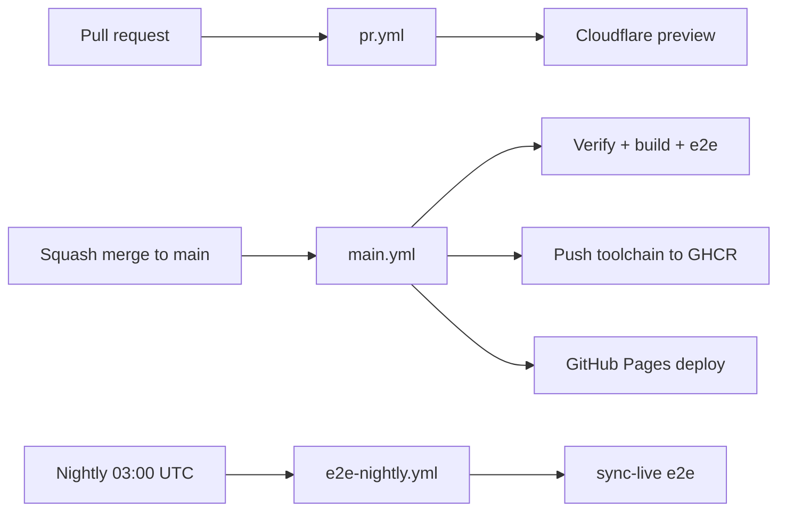

# CI / GitHub Actions Pipeline

System of record for how Nook validates changes in GitHub Actions. Agents must understand this split before changing workflows or e2e.

## Workflow map

| Workflow                                                     | Trigger                 | What runs                                                                 | GitHub PAT                                |
| ------------------------------------------------------------ | ----------------------- | ------------------------------------------------------------------------- | ----------------------------------------- |
| [`pr.yml`](../../.github/workflows/pr.yml)                   | PR open/sync            | Format, verify, web build, Cloudflare preview                             | No                                        |
| [`main.yml`](../../.github/workflows/main.yml)               | Push to `main`          | Verify, build, **full stub e2e**, Pages deploy, push toolchain            | No                                        |
| [`e2e-nightly.yml`](../../.github/workflows/e2e-nightly.yml) | Cron 03:00 UTC + manual | **Live sync provider e2e** (real GitHub API today); **ci-fix** on failure | Yes (`NOOK_GITHUB_PAT`, `CURSOR_API_KEY`) |
| [`e2e-pr.yml`](../../.github/workflows/e2e-pr.yml)           | Manual                  | Debug e2e on a PR branch (`e2e-pr` / `e2e` / `sync-live`)                 | Only for `sync-live`                      |



## Provider selection (`NOOK_E2E_SYNC_PROVIDER`)

The **same sync spec files** run against different backends. CI swaps providers by setting one env var per job:

| Env                      | Values                   | Default  |
| ------------------------ | ------------------------ | -------- |
| `NOOK_E2E_SYNC_PROVIDER` | `file`, `local`, `google-drive`, `github` | `file` |

Registry and factories live in `nook-web/e2e/sync-provider.ts`:

- **`createSyncTarget()`** — isolated stub remote (reads provider from env)
- **`connectSyncGenesisDevice()` / `connectSyncVault()`** — provider-aware connect
- **`live/sync.smoke.spec.ts`** — one nightly smoke per matrix row
- **`local` is a legacy alias for `file`** in stub e2e; new tests should use
  `file` when they need the default local file-backed provider explicitly.

**Main CI (`e2e`):** defaults to the `file` stub provider. The stub stores
remote event files in a real temp directory while Playwright serves the
oauth-file HTTP calls, so default sync tests exercise local file-backed
replication without external API quota.

**Nightly (`sync-live`):** matrix in `e2e-nightly.yml`:

```yaml
strategy:
  matrix:
    provider: [github] # add google-drive when secret exists
env:
  NOOK_E2E_SYNC_PROVIDER: ${{ matrix.provider }}
```

Live credentials per provider:

| Provider       | Secret / env                                              |
| -------------- | --------------------------------------------------------- |
| `github`       | `NOOK_GITHUB_PAT`                                         |
| `google-drive` | `NOOK_GOOGLE_E2E_ACCESS_TOKEN` (when live smoke is wired) |

Stub mode uses in-memory route mocks (`sync-stub.ts`, `drive-stub.ts`) — no API quota.

## Why stub e2e vs sync-live

Real provider API calls are slow and brittle at CI scale. Nook therefore:

1. **`e2e` project** — all stub-backed specs (IndexedDB flows + sync via `page.route()` mocks). One Playwright process, fully parallel, one preview server.
2. **`e2e-pr` project** — subset of `e2e` (IndexedDB-only specs) for fast manual/debug runs.
3. **`sync-live` project** — Specs under `e2e/live/` hit the **real provider API** using `NOOK_GITHUB_PAT`. Minimal smoke; nightly + manual only.

When adding Google Drive or other sync providers, add stub-backed specs to the `e2e` list and thin live smoke specs to `e2e/live/`.

## Parallelism and isolation

Do **not** set `workers` in `playwright.config.ts` — use Playwright defaults locally and override with `--workers=N` when you want more parallelism than the default. Spec files that need ordering use `test.describe.configure({ mode: 'serial' })` within the file only.

`sync-live` keeps `fullyParallel: false` because CI assigns one `NOOK_GITHUB_E2E_REPO` per container; parallel live files would share that remote. Stub projects (`e2e`, `e2e-pr`) use `fullyParallel: true`.

**One web server per Playwright process is enough.** CI serves static `dist/` via `vite preview`; workers share that HTTP endpoint. Isolation is at the browser layer:

- Each test gets a fresh browser context → separate IndexedDB / `localStorage`.
- Stub sync uses `page.route()` with a unique fake repo per suite — no shared remote state.
- The Nook server is stateless; vault data never lives on the server in e2e.

Do **not** spin up multiple Nook servers for parallel stub e2e unless debugging port conflicts locally with `reuseExistingServer`.

## Playwright projects

Defined in `nook-web/playwright.config.ts`:

| Project     | Specs                                          | CI                            |
| ----------- | ---------------------------------------------- | ----------------------------- |
| `e2e`       | All stub-backed specs (IndexedDB + sync stubs) | pr.yml, main, e2e-pr (manual) |
| `e2e-pr`    | IndexedDB-only subset                          | e2e-pr (manual/debug)         |
| `sync-live` | `e2e/live/**/*.spec.ts`                        | e2e-nightly, e2e-pr (manual)  |

Legacy script aliases: `test:e2e:local` → `e2e-pr`, `test:e2e:sync-stub` → `e2e`.

## Task commands (Docker)

All commands run containerized via `Taskfile.yml`:

```bash
# Minimum before every agent push
task check                          # format, clippy, unit tests, web build

# Full PR CI mirror — before opening PR; mandatory after any remote CI failure
task ci:pr                          # prepare → verify ‖ build → full stub e2e

# E2e projects
task web:test:e2e                   # full stub e2e (PR/main gate)
task web:test:e2e:pr                # fast e2e-pr subset (manual/debug only)

# Single spec — preferred during fix/debug (E2E_SPEC paths relative to nook-web/)
E2E_SPEC=e2e/connect.spec.ts task web:test:e2e:file

# Main CI equivalent
task ci:main:e2e                    # one container, full e2e project

# Nightly / live GitHub (needs NOOK_GITHUB_PAT in env or .env.test.local)
task web:test:e2e:sync-live
task ci:nightly:e2e                 # prepare + build + sync-live

# Legacy aliases
task web:test:e2e:github            # → sync-live
```

## Local vs remote CI

**Remote (GitHub Actions) is cold and heavy.** Every run starts on a fresh `ubuntu-latest` runner: pull the toolchain Docker image from GHCR, build wasm/web from scratch, run the full prepared test set. PR workflow runs **`task ci:pr`** (verify, web build, full stub e2e, Cloudflare preview — no toolchain image push). Main pushes the commit-tagged toolchain image after green verify. Expect several minutes per PR run plus queue time. Use remote CI as the **PR validation gate** — not as the primary place to discover fmt/clippy/unit/e2e failures.

**Local Docker is warm and fast.** Toolchain images are **cached** on the developer machine. The same Task gates (`task check`, `task ci:pr`, e2e) finish much faster locally. **Prefer local runs** to check tests, fix issues, and iterate. Push only when local gates pass and the change is ready.

**E2e debug — one spec at a time.** During a fix/debug session, do not re-run the full e2e suite after every change. Run individual specs for fast feedback:

```bash
E2E_SPEC=e2e/connect.spec.ts task web:test:e2e:file
```

After targeted fixes pass, run the relevant project or full PR mirror once before pushing.

**Agent efficiency rules:**

1. **Before push / opening a PR** — `task check` minimum; add `task web:test:e2e` or `task ci:pr` when web/vault/sync flows change. Use `E2E_SPEC=… task web:test:e2e:file` while debugging a specific e2e failure.
2. **Push when locally ready** — do not push hoping remote CI will catch issues that local Docker would find in seconds.
3. **After any remote CI failure** — read test output and static-analysis errors,
   then **persisted app logs** (see below), fix locally (prefer single-spec e2e
   while iterating), run `task ci:pr` until green, then push again.

### CI verification — always check app logs

After tests and static analysis (`task check`, clippy, Playwright report), **app
logs are the most important remaining signal.** They record vault session
lifecycle, sync, and WASM events that neither linters nor DOM assertions expose.

- **Remote e2e failure:** read Playwright attachment `nook-app-logs.json` from
  the CI artifact/report before changing code. The attachment is created for
  every e2e result; failures also print the same entries to test output.
- **Local repro:** `E2E_SPEC=… task web:test:e2e:file`, then `fetchAppLogs(page)`
  or open `/app-logs?minLevel=debug&limit=1000`.
- **Human inspection:** `/logs` in the running app.

Full reference: [logging.md § Debugging, troubleshooting, and CI verification](../references/logging.md#debugging-troubleshooting-and-ci-verification).

Local `task ci:pr` is still much faster on a warm cached toolchain image than a cold remote run. See [pull-requests.md § Local checks](pull-requests.md#2-local-checks-before-every-push) and [coding-bro.md](coding-bro.md).

E2e serves **production `dist/`** on CI (`vite preview`) with `VITE_VAULT_SYNC_INTERVAL_MS=1000` for fast background sync. Main saves prod dist before e2e and restores after (`web:e2e:restore-prod-dist`).

## Secrets and env

| Secret / env                                        | Used by                                                                                                                                                             |
| --------------------------------------------------- | ------------------------------------------------------------------------------------------------------------------------------------------------------------------- |
| `NOOK_GITHUB_PAT`                                   | sync-live e2e **and** ci-fix PR/push (repo scope; PRs must be opened as a user, not `GITHUB_TOKEN`, so `pr.yml` runs and auto-merge is not blocked on bot approval) |
| `NOOK_GITHUB_E2E_REPO`                              | CI sets per run for live suites (one repo per container)                                                                                                            |
| `CLOUD_FLARE_PAGES_TOKEN`, `CLOUD_FLARE_ACCOUNT_ID` | PR preview deploy                                                                                                                                                   |
| `GITHUB_TOKEN`                                      | Toolchain GHCR, PR comments, nook-core coverage comment                                                                                                             |
| `CURSOR_API_KEY`                                    | ci-fix agent (main.yml, e2e-nightly.yml)                                                                                                                            |

Local live e2e: copy `nook-web/.env.test.local.example` → `.env.test.local` with your PAT.

## CI agent (`ci-fix` job)

Both [`main.yml`](../../.github/workflows/main.yml) and [`e2e-nightly.yml`](../../.github/workflows/e2e-nightly.yml) run a **`ci-fix`** job on failure: Cursor SDK agent → fix branch → PR → wait for checks → squash merge. Nightly uses `.github/prompts/ci-fix-nightly-agent.md` and `CI_FIX_LABEL=nightly e2e`; main uses the default main-CI prompt.

**Why `NOOK_GITHUB_PAT` (not `GITHUB_TOKEN`)?** GitHub does not fire `pull_request` workflows for PRs opened with the default Actions token (`github-actions[bot]`). Those PRs also sit behind branch protection as bot-authored and need a manual approval you cannot self-grant. The ci-fix job checks out and pushes with `NOOK_GITHUB_PAT` so the fix PR is attributed to the PAT owner, `pr.yml` runs, and squash merge can proceed without a manual approve step (assuming the PAT owner can merge per branch rules).

Required secrets for ci-fix: `CURSOR_API_KEY`, `NOOK_GITHUB_PAT` (classic PAT with `repo` scope, or fine-grained with contents + pull requests write on this repo).

The `ci-fix` job runs **`task setup`** (bake the sealed nook-web image, reusing the GHCR toolchain base as cache) **before** `task ci-agent:fix`. Without this, Docker tasks would have no `nook-web:local` image to run. `nook-docker-setup` sets `NOOK_ENV=ci` and `TOOLCHAIN_REGISTRY`; `setup` builds and loads `nook-web:local`.

Optional env: `CI_AGENT_PROMPT_FILE` (agent instructions), `CI_FIX_LABEL` (PR title/body label).

### Logging

The `task ci-agent:fix` step (`agentic-ai/ci-agent/`) emits **log4j-style** lines so GitHub Actions logs are easy to scan:

```
2026-06-29 20:14:32,879 INFO  [ci-agent/agent-wait] Agent still running (20m 0s)
2026-06-29 20:14:32,879 INFO  [ci-agent/run-agent] Running Cursor SDK agent (run 123, …)
2026-06-29 20:14:33,102 INFO  [ci-agent/cursor] shell grep waitForPendingJoin
2026-06-29 20:14:33,450 INFO  [ci-agent/cursor/agent] agent output
    The agent's streamed reply is indented under the header.
2026-06-29 20:14:34,120 INFO  [ci-agent/cursor/shell] output
    | task: ci:verify:parallel
    | error: test failed
2026-06-29 20:14:35,001 INFO  [ci-agent/cursor] --- stdout ---
2026-06-29 20:14:35,001 INFO  [ci-agent/cursor] shell exit 1
```

| Field     | Meaning                                                                                                                |
| --------- | ---------------------------------------------------------------------------------------------------------------------- |
| Timestamp | UTC, `yyyy-MM-dd HH:mm:ss,SSS`                                                                                         |
| Level     | `TRACE` / `DEBUG` / `INFO` / `WARN` / `ERROR`                                                                          |
| Component | `ci-agent/<module>` — e.g. `fix`, `run-agent`, `agent-wait`, `git`, `github`, `cursor`, `cursor/agent`, `cursor/shell` |

Set `CI_AGENT_LOG_LEVEL=DEBUG` in the job env to include step/turn traces (`step started`, `turn ended`). Tool starts, shell output, and command results are always logged at **INFO**. Heartbeat interval: `CI_AGENT_HEARTBEAT_MS` (default 60s). Timeout: `CI_AGENT_TIMEOUT_MS` (default 90m).

The ci-agent entrypoint calls `process.exit` after `runCiFix()` completes. Without an explicit exit, the Cursor SDK local executor can leave child processes and open handles that keep the Node event loop alive and the `ci-fix` job running long after the agent merges its PR.

## Agent checklist when touching CI or e2e

1. **Do not** move real GitHub API tests back into `main.yml` — extend stub coverage instead.
2. **Do** add new sync-provider integration tests to the `e2e` spec list first; add a small live smoke under `e2e/live/` if the provider has a real backend.
3. **Do** run `task ci:pr` (or `task web:test:e2e` for full stub suite) before merge when changing web vault/sync flows.
4. **Do** update this doc and [`pull-requests.md`](pull-requests.md) when workflow behavior changes.
5. PR CI and main both run full stub **e2e**; nightly runs **sync-live**.

See also: [ARCHITECTURE.md §7](../ARCHITECTURE.md#7-the-engineering-harness), [pull-requests.md](pull-requests.md).
