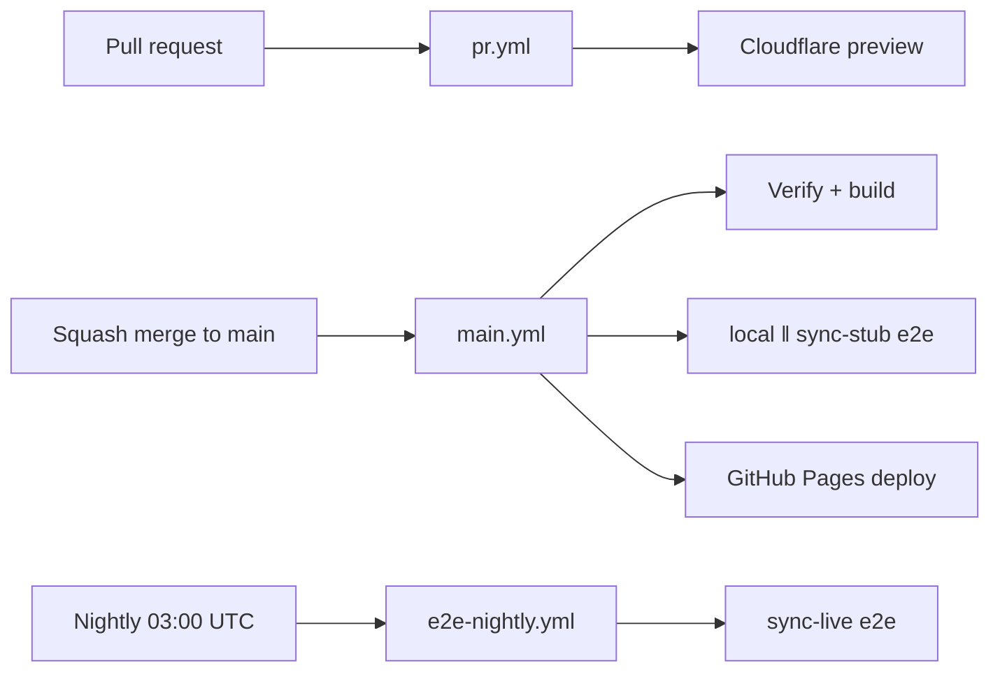

# CI / GitHub Actions Pipeline

System of record for how Nook validates changes in GitHub Actions. Agents must understand this split before changing workflows or e2e.

## Workflow map

| Workflow | Trigger | What runs | GitHub PAT |
|----------|---------|-----------|------------|
| [`pr.yml`](../../.github/workflows/pr.yml) | PR open/sync | Format, verify, web build, Cloudflare preview | No |
| [`main.yml`](../../.github/workflows/main.yml) | Push to `main` | Verify, build, **local + sync-stub e2e**, Pages deploy, push toolchain | No |
| [`e2e-nightly.yml`](../../.github/workflows/e2e-nightly.yml) | Cron 03:00 UTC + manual | **Live sync provider e2e** (real GitHub API today) | Yes (`NOOK_GITHUB_PAT`) |
| [`e2e-pr.yml`](../../.github/workflows/e2e-pr.yml) | Manual | Debug e2e on a PR branch (local / sync-stub / sync-live) | Only for `sync-live` |



## Provider selection (`NOOK_E2E_SYNC_PROVIDER`)

The **same sync spec files** run against different backends. CI swaps providers by setting one env var per job:

| Env | Values | Default |
|-----|--------|---------|
| `NOOK_E2E_SYNC_PROVIDER` | `github`, `google-drive` | `github` |

Registry and factories live in `nook-web/e2e/sync-provider.ts`:

- **`createSyncTarget()`** — isolated stub remote (reads provider from env)
- **`connectSyncGenesisDevice()` / `connectSyncVault()`** — provider-aware connect
- **`live/sync.smoke.spec.ts`** — one nightly smoke per matrix row

**Main CI (`sync-stub`):** defaults to `github`; add a parallel job with `NOOK_E2E_SYNC_PROVIDER=google-drive` when Drive UI connect is wired.

**Nightly (`sync-live`):** matrix in `e2e-nightly.yml`:

```yaml
strategy:
  matrix:
    provider: [github]  # add google-drive when secret exists
env:
  NOOK_E2E_SYNC_PROVIDER: ${{ matrix.provider }}
```

Live credentials per provider:

| Provider | Secret / env |
|----------|----------------|
| `github` | `NOOK_GITHUB_PAT` |
| `google-drive` | `NOOK_GOOGLE_E2E_ACCESS_TOKEN` (when live smoke is wired) |

Stub mode uses in-memory route mocks (`sync-stub.ts`, `drive-stub.ts`) — no API quota.

## Why sync-stub vs sync-live

GitHub REST API calls are slow and brittle at CI scale. Nook therefore:

1. **`sync-stub` project** — Playwright `page.route()` intercepts `api.github.com` with an **in-memory vault stub** (`e2e/sync-stub.ts`, `createLocalE2eGithubVaultStub`). Each suite gets a unique fake repo name; no API calls, no cleanup, unlimited parallelism as tests grow.
2. **`sync-live` project** — Specs under `e2e/live/` hit the **real GitHub API** using `NOOK_GITHUB_PAT`. Minimal smoke coverage; runs **once per day** on the schedule (and manually via workflow dispatch).

When adding Google Drive or other sync providers, add stub-backed specs to `sync-stub` and thin live smoke specs to `e2e/live/`.

## Parallelism and isolation

Do **not** set `workers` in `playwright.config.ts` — use Playwright defaults locally and override with `--workers=N` when you want more parallelism than the default. Spec files that need ordering use `test.describe.configure({ mode: 'serial' })` within the file only.

`sync-live` keeps `fullyParallel: false` because CI assigns one `NOOK_GITHUB_E2E_REPO` per container; parallel live files would share that remote. Stub projects (`local`, `sync-stub`) use `fullyParallel: true`.

**One web server per Playwright process is enough.** CI serves static `dist/` via `vite preview`; workers share that HTTP endpoint. Isolation is at the browser layer:

- Each test gets a fresh browser context → separate IndexedDB / `localStorage`.
- Stub sync uses `page.route()` with a unique fake repo per suite — no shared remote state.
- The Nook server is stateless; vault data never lives on the server in e2e.

Do **not** spin up multiple Nook servers for parallel stub e2e unless debugging port conflicts locally with `reuseExistingServer`.

## Playwright projects

Defined in `nook-web/playwright.config.ts`:

| Project | Specs | CI |
|---------|-------|-----|
| `local` | IndexedDB-only flows (vault CRUD, login, legal, …) | main, e2e-pr |
| `sync-stub` | Sync provider flows via route stubs (`sync-vault`, multi-device, fan-out, …) | main, e2e-pr |
| `sync-live` | `e2e/live/**/*.spec.ts` | e2e-nightly, e2e-pr (manual) |

## Task commands (Docker)

All commands run containerized via `Taskfile.yml`:

```bash
# Minimum before every agent push
task check                          # format, clippy, unit tests, web build

# Full PR CI mirror (~3–4 min) — before opening PR; mandatory after any remote CI failure
task ci:pr                          # prepare → verify ‖ build → local Playwright e2e

# Subsets
task web:test:e2e:local             # local project only
task web:test:e2e:sync-stub         # stub sync (no PAT)

# Main CI equivalent
task ci:main:e2e:parallel           # local ‖ sync-stub in parallel containers

# Nightly / live GitHub (needs NOOK_GITHUB_PAT in env or .env.test.local)
task web:test:e2e:sync-live
task ci:nightly:e2e                 # prepare + build + sync-live

# Legacy aliases
task web:test:e2e:github            # → sync-live
```

## Local vs remote CI

PR GitHub Actions runs `task ci:pr:publish` (toolchain build, verify, web build, e2e, GHCR push, Cloudflare preview). A single run often takes **5+ minutes** plus queue time. Failing remotely on Prettier, `cargo fmt`, clippy, or a unit test burns that full cycle for a fix that local Docker would catch in seconds.

**Agent efficiency rule:**

1. **Before every push** — at least `task check` (format check, lint, unit tests, build).
2. **Before opening a PR** — `task ci:pr` (matches PR gates including local Playwright e2e).
3. **After any remote CI failure** — `task ci:pr` before the next push; do not retry remote CI hoping for a different result.

Local `task ci:pr` completes in roughly **3–4 minutes** on a warm toolchain image and avoids repeated remote failures for the same trivial issue. See [pull-requests.md § Local checks](pull-requests.md#2-local-checks-before-every-push).

E2e serves **production `dist/`** on CI (`vite preview`) with `VITE_VAULT_SYNC_INTERVAL_MS=1000` for fast background sync. Main saves prod dist before e2e and restores after (`web:e2e:restore-prod-dist`).

## Secrets and env

| Secret / env | Used by |
|--------------|---------|
| `NOOK_GITHUB_PAT` | sync-live only (repo scope + delete_repo for cleanup) |
| `NOOK_GITHUB_E2E_REPO` | CI sets per run for live suites (one repo per container) |
| `CLOUD_FLARE_PAGES_TOKEN`, `CLOUD_FLARE_ACCOUNT_ID` | PR preview deploy |
| `GITHUB_TOKEN` | Toolchain GHCR, PR comments |

Local live e2e: copy `nook-web/.env.test.local.example` → `.env.test.local` with your PAT.

## Agent checklist when touching CI or e2e

1. **Do not** move real GitHub API tests back into `main.yml` — extend stub coverage instead.
2. **Do** add new sync-provider integration tests to `sync-stub` first; add a small live smoke under `e2e/live/` if the provider has a real backend.
3. **Do** run `task ci:pr` (or `task web:test:e2e:sync-stub` / `local` for narrower checks) before merge when changing web vault/sync flows.
4. **Do** update this doc and [`pull-requests.md`](pull-requests.md) when workflow behavior changes.
5. PR CI stays fast: no e2e on `pr.yml`. Main carries stub e2e; nightly carries live.

See also: [ARCHITECTURE.md §7](../ARCHITECTURE.md#7-the-engineering-harness), [pull-requests.md](pull-requests.md).
