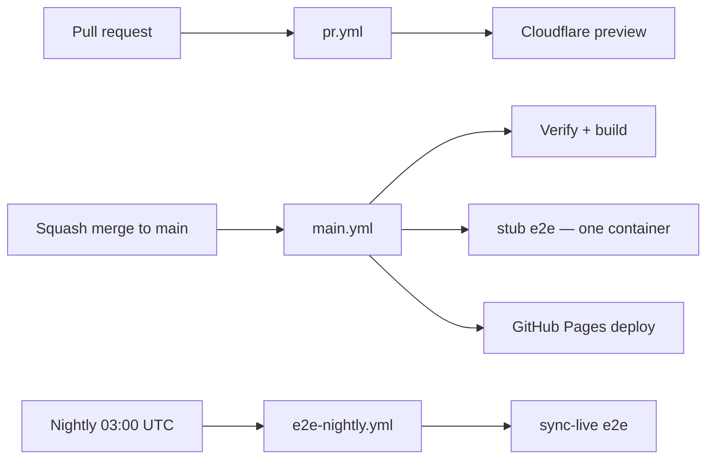

# CI / GitHub Actions Pipeline

System of record for how Nook validates changes in GitHub Actions. Agents must understand this split before changing workflows or e2e.

## Workflow map

| Workflow | Trigger | What runs | GitHub PAT |
|----------|---------|-----------|------------|
| [`pr.yml`](../../.github/workflows/pr.yml) | PR open/sync | Format, verify, web build, Cloudflare preview | No |
| [`main.yml`](../../.github/workflows/main.yml) | Push to `main` | Verify, build, **full stub e2e**, Pages deploy, push toolchain | No |
| [`e2e-nightly.yml`](../../.github/workflows/e2e-nightly.yml) | Cron 03:00 UTC + manual | **Live sync provider e2e** (real GitHub API today) | Yes (`NOOK_GITHUB_PAT`) |
| [`e2e-pr.yml`](../../.github/workflows/e2e-pr.yml) | Manual | Debug e2e on a PR branch (`e2e-pr` / `e2e` / `sync-live`) | Only for `sync-live` |



## Provider selection (`NOOK_E2E_SYNC_PROVIDER`)

The **same sync spec files** run against different backends. CI swaps providers by setting one env var per job:

| Env | Values | Default |
|-----|--------|---------|
| `NOOK_E2E_SYNC_PROVIDER` | `github`, `google-drive` | `github` |

Registry and factories live in `nook-web/e2e/sync-provider.ts`:

- **`createSyncTarget()`** — isolated stub remote (reads provider from env)
- **`connectSyncGenesisDevice()` / `connectSyncVault()`** — provider-aware connect
- **`live/sync.smoke.spec.ts`** — one nightly smoke per matrix row

**Main CI (`e2e`):** defaults to `github` stub provider; add a matrix row with `NOOK_E2E_SYNC_PROVIDER=google-drive` when Drive UI connect is wired.

**Nightly (`sync-live`):** matrix in `e2e-nightly.yml`:

```yaml
strategy:
  matrix:
    provider: [github]  # add google-drive when secret exists
env:
  NOOK_E2E_SYNC_PROVIDER: ${{ matrix.provider }}
```

Live credentials per provider:

| Provider | Secret / env |
|----------|----------------|
| `github` | `NOOK_GITHUB_PAT` |
| `google-drive` | `NOOK_GOOGLE_E2E_ACCESS_TOKEN` (when live smoke is wired) |

Stub mode uses in-memory route mocks (`sync-stub.ts`, `drive-stub.ts`) — no API quota.

## Why stub e2e vs sync-live

Real provider API calls are slow and brittle at CI scale. Nook therefore:

1. **`e2e` project** — all stub-backed specs (IndexedDB flows + sync via `page.route()` mocks). One Playwright process, fully parallel, one preview server.
2. **`e2e-pr` project** — subset of `e2e` (IndexedDB-only specs) for fast PR CI (~1 min).
3. **`sync-live` project** — Specs under `e2e/live/` hit the **real provider API** using `NOOK_GITHUB_PAT`. Minimal smoke; nightly + manual only.

When adding Google Drive or other sync providers, add stub-backed specs to the `e2e` list and thin live smoke specs to `e2e/live/`.

## Parallelism and isolation

Do **not** set `workers` in `playwright.config.ts` — use Playwright defaults locally and override with `--workers=N` when you want more parallelism than the default. Spec files that need ordering use `test.describe.configure({ mode: 'serial' })` within the file only.

`sync-live` keeps `fullyParallel: false` because CI assigns one `NOOK_GITHUB_E2E_REPO` per container; parallel live files would share that remote. Stub projects (`e2e`, `e2e-pr`) use `fullyParallel: true`.

**One web server per Playwright process is enough.** CI serves static `dist/` via `vite preview`; workers share that HTTP endpoint. Isolation is at the browser layer:

- Each test gets a fresh browser context → separate IndexedDB / `localStorage`.
- Stub sync uses `page.route()` with a unique fake repo per suite — no shared remote state.
- The Nook server is stateless; vault data never lives on the server in e2e.

Do **not** spin up multiple Nook servers for parallel stub e2e unless debugging port conflicts locally with `reuseExistingServer`.

## Playwright projects

Defined in `nook-web/playwright.config.ts`:

| Project | Specs | CI |
|---------|-------|-----|
| `e2e` | All stub-backed specs (IndexedDB + sync stubs) | main, e2e-pr (manual) |
| `e2e-pr` | IndexedDB-only subset (~1 min) | pr.yml |
| `sync-live` | `e2e/live/**/*.spec.ts` | e2e-nightly, e2e-pr (manual) |

Legacy script aliases: `test:e2e:local` → `e2e-pr`, `test:e2e:sync-stub` → `e2e`.

## Task commands (Docker)

All commands run containerized via `Taskfile.yml`:

```bash
# Minimum before every agent push
task check                          # format, clippy, unit tests, web build

# Full PR CI mirror (~3–4 min) — before opening PR; mandatory after any remote CI failure
task ci:pr                          # prepare → verify ‖ build → e2e-pr

# Subsets
task web:test:e2e:pr                # e2e-pr only (PR gate)
task web:test:e2e                   # full stub e2e (main gate)

# Main CI equivalent
task ci:main:e2e                    # one container, full e2e project

# Nightly / live GitHub (needs NOOK_GITHUB_PAT in env or .env.test.local)
task web:test:e2e:sync-live
task ci:nightly:e2e                 # prepare + build + sync-live

# Legacy aliases
task web:test:e2e:github            # → sync-live
```

## Local vs remote CI

PR GitHub Actions runs `task ci:pr:publish` (toolchain build, verify, web build, e2e, GHCR push, Cloudflare preview). A single run often takes **5+ minutes** plus queue time. Failing remotely on Prettier, `cargo fmt`, clippy, or a unit test burns that full cycle for a fix that local Docker would catch in seconds.

**Agent efficiency rule:**

1. **Before every push** — at least `task check` (format check, lint, unit tests, build).
2. **Before opening a PR** — `task ci:pr` (matches PR gates including e2e-pr).
3. **After any remote CI failure** — `task ci:pr` before the next push; do not retry remote CI hoping for a different result.

Local `task ci:pr` completes in roughly **3–4 minutes** on a warm toolchain image and avoids repeated remote failures for the same trivial issue. See [pull-requests.md § Local checks](pull-requests.md#2-local-checks-before-every-push).

E2e serves **production `dist/`** on CI (`vite preview`) with `VITE_VAULT_SYNC_INTERVAL_MS=1000` for fast background sync. Main saves prod dist before e2e and restores after (`web:e2e:restore-prod-dist`).

## Secrets and env

| Secret / env | Used by |
|--------------|---------|
| `NOOK_GITHUB_PAT` | sync-live only (repo scope + delete_repo for cleanup) |
| `NOOK_GITHUB_E2E_REPO` | CI sets per run for live suites (one repo per container) |
| `CLOUD_FLARE_PAGES_TOKEN`, `CLOUD_FLARE_ACCOUNT_ID` | PR preview deploy |
| `GITHUB_TOKEN` | Toolchain GHCR, PR comments |

Local live e2e: copy `nook-web/.env.test.local.example` → `.env.test.local` with your PAT.

## CI agent logging (`ci-fix` job)

The `task ci-agent:fix` step (`agentic-ai/ci-agent/`) emits **log4j-style** lines so GitHub Actions logs are easy to scan:

```
2026-06-29 20:14:32,879 INFO  [ci-agent/agent-wait] Agent still running (20m 0s)
2026-06-29 20:14:32,879 INFO  [ci-agent/run-agent] Running Cursor SDK agent (run 123, …)
2026-06-29 20:14:33,102 INFO  [ci-agent/cursor] shell grep waitForPendingJoin
2026-06-29 20:14:33,450 INFO  [ci-agent/cursor/agent] agent output
    The agent's streamed reply is indented under the header.
2026-06-29 20:14:34,120 INFO  [ci-agent/cursor/shell] output
    | task: ci:verify:parallel
    | error: test failed
2026-06-29 20:14:35,001 INFO  [ci-agent/cursor] --- stdout ---
2026-06-29 20:14:35,001 INFO  [ci-agent/cursor] shell exit 1
```

| Field | Meaning |
|-------|---------|
| Timestamp | UTC, `yyyy-MM-dd HH:mm:ss,SSS` |
| Level | `TRACE` / `DEBUG` / `INFO` / `WARN` / `ERROR` |
| Component | `ci-agent/<module>` — e.g. `fix`, `run-agent`, `agent-wait`, `git`, `github`, `cursor`, `cursor/agent`, `cursor/shell` |

Set `CI_AGENT_LOG_LEVEL=DEBUG` in the job env to include step/turn traces (`step started`, `turn ended`). Tool starts, shell output, and command results are always logged at **INFO**. Heartbeat interval: `CI_AGENT_HEARTBEAT_MS` (default 60s). Timeout: `CI_AGENT_TIMEOUT_MS` (default 90m).

## Agent checklist when touching CI or e2e

1. **Do not** move real GitHub API tests back into `main.yml` — extend stub coverage instead.
2. **Do** add new sync-provider integration tests to the `e2e` spec list first; add a small live smoke under `e2e/live/` if the provider has a real backend.
3. **Do** run `task ci:pr` (or `task web:test:e2e` for full stub suite) before merge when changing web vault/sync flows.
4. **Do** update this doc and [`pull-requests.md`](pull-requests.md) when workflow behavior changes.
5. PR CI runs fast **e2e-pr** only; main runs full **e2e**; nightly runs **sync-live**.

See also: [ARCHITECTURE.md §7](../ARCHITECTURE.md#7-the-engineering-harness), [pull-requests.md](pull-requests.md).
