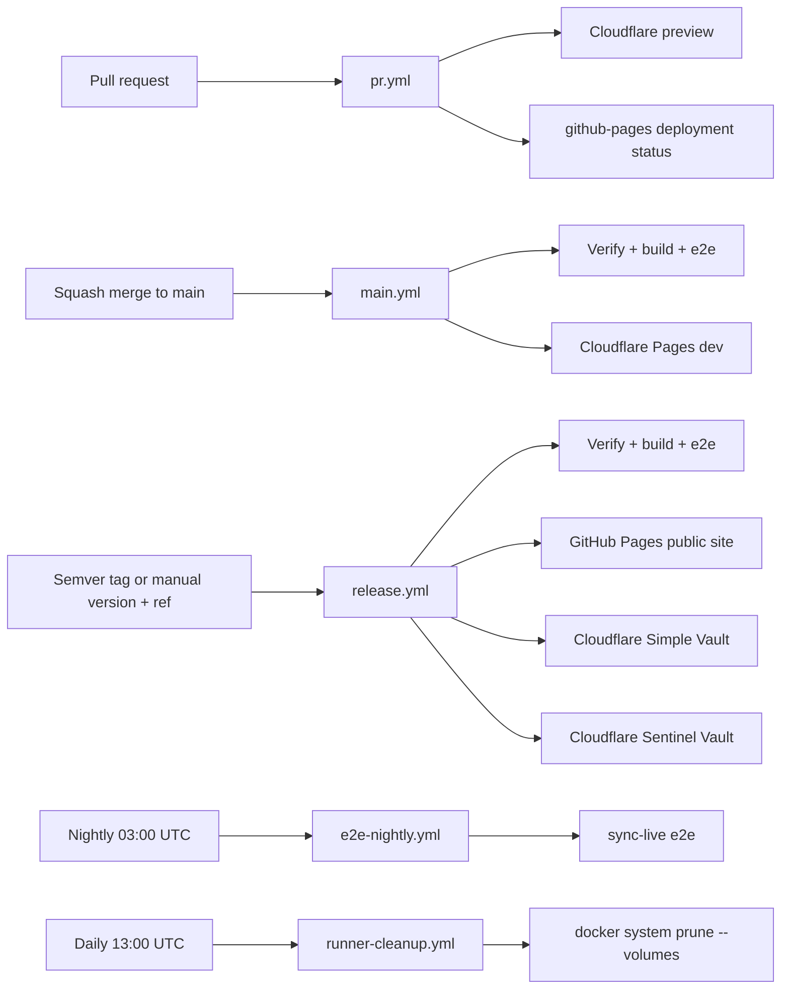

# CI / GitHub Actions Pipeline

System of record for how Nook validates changes in GitHub Actions. Agents must understand this split before changing workflows or e2e.

## Workflow map

| Workflow                                                     | Trigger                 | What runs                                                                 | GitHub PAT                                |
| ------------------------------------------------------------ | ----------------------- | ------------------------------------------------------------------------- | ----------------------------------------- |
| [`pr.yml`](../../.github/workflows/pr.yml)                   | PR open/sync            | **Rust domain unit tests + coverage**, no-opt capability-specific WASM, web/unit tests, all three web builds, Cloudflare preview with `/simple/` + `/sentinel/`, `github-pages` deployment status | No                                        |
| [`main.yml`](../../.github/workflows/main.yml)               | Push to `main`          | On persistent `nook`: verify, wasm-bindgen tests, all web builds, **full local-provider + split-app isolation e2e**, Cloudflare Pages deploy to development `dev.nokey.sh` | No |
| [`release.yml`](../../.github/workflows/release.yml)         | Semver tag `v*.*.*` or manual version + ref | On persistent `nook`: pin an immutable tag, verify/e2e, deploy `nokey.sh` plus independent `simple.nokey.sh` and `sentinel.nokey.sh` artifacts, publish GitHub Release | No |
| [`e2e-nightly.yml`](../../.github/workflows/e2e-nightly.yml) | Cron 03:00 UTC + manual | **Live sync provider e2e** (real GitHub API today); **ci-fix** on failure | Yes (`NOOK_GITHUB_PAT`, `CURSOR_API_KEY`) |
| [`agent-implement.yml`](../../.github/workflows/agent-implement.yml) | Issue labeled `ai-agent`, or manual prompt | Cursor SDK implement → PR → wait only for applicable repository-owned PR checks → final existing-feedback audit → **squash merge** or manual handoff (GitHub-hosted `ubuntu-latest`, not self-hosted `nook`) | Yes (`NOOK_GITHUB_PAT`, `CURSOR_API_KEY`) |
| [`e2e-pr.yml`](../../.github/workflows/e2e-pr.yml)           | Manual                  | Debug e2e on a PR branch (`e2e-pr` / `e2e` / `sync-live`)                 | Only for `sync-live`                      |
| [`runner-cleanup.yml`](../../.github/workflows/runner-cleanup.yml) | Cron 13:00 UTC + manual | Prune unused Docker data and anonymous volumes on the self-hosted Nook runners (`runs-on: nook` only) | No                                        |



## Production release strategy

Production releases use immutable semantic-version tags. The tag records the
exact source commit; the GitHub Release records that the tagged build passed the
production gate and was deployed atomically as the public `nokey.sh` site plus
the `simple.nokey.sh` and `sentinel.nokey.sh` vault applications.

Preferred release flow:

1. Open **Actions → Release production → Run workflow** on the default branch.
2. Enter the new semantic version (`1.2.0`; a leading `v` is optional) and the
   branch, tag, or commit to release (`main` by default).
3. The requested source passes the main-equivalent production gate. For a new
   manual release, the workflow creates `v1.2.0` only after that gate succeeds;
   existing tags are verified against the requested commit and never moved.
4. The tagged source is deployed to GitHub Pages and writes its version and
   commit to `nokey.sh/release.json`.
5. Only after deployment succeeds does the workflow publish the GitHub Release.

Pushing a `v*.*.*` tag manually is also supported and enters the same validation
and deployment path. A rerun is idempotent when the version and source commit are
unchanged. If a deployment fails, keep the tag and rerun it after fixing the
workflow or infrastructure; the absence of a GitHub Release shows that the tag
has not completed production release. Rollbacks use a new patch version targeting
the last compatible commit, never a moved or reused tag.

The workflow does not rewrite Cargo or package manifest versions. The deployment
version is the immutable tag, avoiding a CI-generated source mutation that would
make the deployed artifact differ from its tagged commit.

## Provider selection (`NOOK_E2E_SYNC_PROVIDER`)

The **same sync spec files** run against different backends. CI swaps providers by setting one env var per job:

| Env                      | Values                   | Default  |
| ------------------------ | ------------------------ | -------- |
| `NOOK_E2E_SYNC_PROVIDER` | `file`, `local`, `google-drive`, `github` | `file` |

Registry and factories live in `nook-app/nook-web/e2e/sync-provider.ts`:

- **`createSyncTarget()`** — isolated e2e remote (reads provider from env)
- **`connectSyncGenesisDevice()` / `connectSyncVault()`** — provider-aware connect
- **`live/sync.smoke.spec.ts`** — one nightly smoke per matrix row
- **`local` is a legacy alias for `file`** in e2e; new tests should use
  `file` when they need the default local file-backed provider explicitly.

**Main and release CI (`e2e`):** default to the `file` provider. The e2e remote stores
event files in a real temp directory while Playwright serves the oauth-file HTTP
calls, so default sync tests exercise local file-backed replication without
external API quota.

**Nightly (`sync-live`):** matrix in `e2e-nightly.yml`:

```yaml
strategy:
  matrix:
    provider: [github] # add google-drive when secret exists
env:
  NOOK_E2E_SYNC_PROVIDER: ${{ matrix.provider }}
```

Live credentials per provider:

| Provider       | Secret / env                                              |
| -------------- | --------------------------------------------------------- |
| `github`       | `NOOK_GITHUB_PAT`                                         |
| `google-drive` | `NOOK_GOOGLE_E2E_ACCESS_TOKEN` (when live smoke is wired) |

No-live-provider mode uses Playwright route handlers (`sync-stub.ts`,
`drive-stub.ts`, `file-sync-stub.ts`) — no API quota. For the default `file`
provider, those handlers read and write real event files under a temp directory.

## Runner placement

Runner placement separates delivery validation from long-running background
work. The `pr.yml` verify/preview gate, main delivery, and production release use
the self-hosted `nook` pool so they can reuse warm Docker/BuildKit state. AI
implement/fix/smoke jobs use GitHub-hosted `ubuntu-latest`, where their six-hour
background work cannot exhaust or block the Nook machine. Other scheduled,
manual e2e, and research jobs also remain GitHub-hosted.

The web dependency stage runs `bun install --frozen-lockfile` directly in its
Dockerfile layer. It has no host or BuildKit daemon cache mount; the frozen
lockfile and immutable Docker layer are the cache and reproducibility boundary.

PR web solves use browser-free `web-base`. Main, nightly, and explicitly
requested browser e2e use a separate `web-e2e-base` with Debian's single
`chromium` package. Playwright is pointed at `/usr/bin/chromium`; do not install
its bundled Chromium + headless-shell payload, which creates a roughly 1.3 GB
image layer (about 432 MB compressed) on cold runners.
The PR setup solve runs once; it does not wrap multi-minute BuildKit failures in
a whole-build retry loop.

| Workflow | `runs-on` | Why |
| --- | --- | --- |
| `pr.yml` | `nook` | Fast, cache-warm verification and preview for developer-critical PRs |
| `agent-implement.yml`, `ci-agent-smoke.yml`, `e2e-nightly.yml` `ci-fix` | `ubuntu-latest` | Isolate long-running background AI work from the Nook machine |
| `main.yml` `ci`, `release.yml` | `nook` | Reuse the warm Docker/BuildKit state across PR, post-merge delivery, and release instead of downloading the multi-GB Rust/browser lineages into fresh VMs |
| `e2e-pr.yml`, `e2e-nightly.yml` `sync-live`, `web-research.yml` | `ubuntu-latest` | Isolate scheduled, manual, and research work from the delivery runner |
| `runner-cleanup.yml` | `nook` | Maintain the self-hosted Docker cache and disk |

## Why local-provider e2e vs sync-live

Real provider API calls are slow and brittle at CI scale. Nook therefore:

1. **`e2e` project** — IndexedDB flows plus sync-provider specs through isolated e2e remotes. One Playwright process, fully parallel, one preview server.
2. **`e2e-pr` project** — subset of `e2e` (IndexedDB-only specs) for fast manual/debug runs.
3. **`sync-live` project** — Specs under `e2e/live/` hit the **real provider API** using `NOOK_GITHUB_PAT`. Minimal smoke; nightly + manual only.

When adding Google Drive or other sync providers, add local e2e remote specs to
the `e2e` list and thin live smoke specs to `e2e/live/`.

## Parallelism and isolation

Do **not** set `workers` in `playwright.config.ts` — use Playwright defaults locally and override with `--workers=N` when you want more parallelism than the default. Spec files that need ordering use `test.describe.configure({ mode: 'serial' })` within the file only.

`sync-live` keeps `fullyParallel: false` because CI assigns one `NOOK_GITHUB_E2E_REPO` per container; parallel live files would share that remote. Local e2e projects (`e2e`, `e2e-pr`) use `fullyParallel: true`.

**One web server per Playwright process is enough.** CI serves static `dist/` via `vite preview`; workers share that HTTP endpoint. Isolation is at the browser layer:

- Each test gets a fresh browser context → separate IndexedDB / `localStorage`.
- Local e2e sync uses `page.route()` with a unique remote id per suite — no shared remote state.
- The Nook server is stateless; vault data never lives on the server in e2e.

Do **not** spin up multiple Nook servers for parallel e2e unless debugging port conflicts locally with `reuseExistingServer`.

## Playwright projects

Defined in `nook-app/nook-web/playwright.config.ts`:

| Project     | Specs                                          | CI                            |
| ----------- | ---------------------------------------------- | ----------------------------- |
| `e2e`       | All local-provider specs (IndexedDB + sync remotes) | main, e2e-pr (manual)         |
| `e2e-pr`    | IndexedDB-only subset                          | e2e-pr (manual/debug)         |
| `sync-live` | `e2e/live/**/*.spec.ts`                        | e2e-nightly, e2e-pr (manual)  |

Legacy script aliases: `test:e2e:local` → `e2e-pr`, `test:e2e:sync-stub` → `e2e`.

## Task commands (Docker)

All commands run containerized via Taskfile. The root `Taskfile.yml` is the repo entrypoint; app commands are included through `nook-app/Taskfile.yml`, with cross-package app tasks in `nook-app/.task/`, Docker tasks in `nook-app/docker/Taskfile.yml`, and web-family tasks in `nook-app/nook-web/Taskfile.yml` plus `nook-app/nook-web/.task/`:

```bash
# Minimum local final gate after final-validation push
task check                          # format, clippy, unit tests, wasm-bindgen tests, web build (dev/no-opt wasm)

# Full PR CI mirror — parallel local gate; mandatory before merge/handoff after broad remote failure
WASM_BUILD_MODE=dev task ci:pr       # prepare → no-opt WASM → verify ‖ build (no browser e2e)

# Explicit full browser validation for high-risk PRs
task ci:pr:e2e                       # full local-provider web e2e + extension e2e

# E2e projects
task web:test:e2e                   # full local-provider e2e (main gate; explicit on PRs)
task web:test:e2e:pr                # fast e2e-pr subset (manual/debug only)

# WASM tests
task wasm:test                      # wasm-bindgen smoke tests in Node (PR/main gate)
task wasm:test:browser              # browser-only wasm tests (manual/debug)

# Single spec — preferred during fix/debug (E2E_SPEC paths relative to nook-app/nook-web/)
E2E_SPEC=e2e/connect.spec.ts task web:test:e2e:file

# Main CI equivalent
task ci:main:e2e                    # one container, full e2e project

# Nightly / live GitHub (needs NOOK_GITHUB_PAT in env or .env.test.local)
task web:test:e2e:sync-live
task ci:nightly:e2e                 # prepare + build + sync-live

# Legacy aliases
task web:test:e2e:github            # → sync-live
```

## nook-core + nook-auth2 coverage export

The `nook-core + nook-auth2` coverage gate runs during the Docker image build in
`nook-app/nook-core/Dockerfile` (`builder-debug`). The source-sensitive layers are
ordered by Rust dependency edge: `nook-auth2` is copied, linted, and coverage-tested
before `nook-core`; the `nook-core` coverage run uses `--no-clean` and the final
`cargo llvm-cov report -p nook-core -p nook-auth2` enforces the committed floor
and writes reusable artifacts to `/opt/nook/coverage/nook-core` in the image.

PR CI uses one explicitly named **Rust/WASM tests, Svelte checks, JS unit tests**
step. Its single Bake graph runs the `nook-core + nook-auth2` nextest/coverage
branch, the WASM test/build branch, and web dependency preparation in parallel.
Do not split Rust into an earlier coverage solve: that serializes the critical
path and makes a cold Rust cache dominate the whole PR. After verification,
`task docker:extract:coverage` copies `summary.txt`, `summary.json`, `lcov.info`,
and `coverage-floor.json` from the already-built image to `coverage/current`.
That extraction invokes neither BuildKit nor Rust tests.

`task docker:extract:coverage` remains the copy-only path for workflows that
already have a sealed `nook-web:local` image, including main's commit-keyed
coverage artifact. `task setup` gets those files into the slim web image through
the same temporary host artifact directory as generated WASM; it does not copy
them directly from the multi-GB Rust builder snapshot.

After a successful main gate, `main.yml` uploads those four files plus a manifest
as `nook-core-auth-coverage-<commit SHA>`. A PR with changed Rust coverage inputs
downloads and validates the artifact for its exact base SHA instead of rebuilding
the base app image. If the artifact is missing or invalid, the PR runs
`task docker:coverage:export` against the base source; that Bake target stops at
`builder-debug` and exports only the coverage payload, never the WASM/web stages or
the multi-GB app image. PRs without Rust/Cargo/source changes—including changes
only to coverage build/export plumbing—reuse the floor-validated current coverage
as the base comparison because the measured source is unchanged.

## Local vs remote CI

**Remote PR CI is cache-warm and latency-sensitive.** The PR workflow runs on the
self-hosted `nook` pool and reuses its Docker/BuildKit cache. `task ci:pr` runs
the standalone Rust **repository preflight** before app setup, then one parallel
Rust/WASM and web solve (no-opt WASM, Rust/WASM/web unit tests, verify, web build,
no browser e2e, Cloudflare preview,
and a successful `github-pages` deployment status for the PR head SHA). The preview deploy reuses that prepared sealed image and
must not declare another `setup` dependency. PR coverage always checks the current
`nook-core + nook-auth2` artifact against the floor; changed Rust/Cargo/source
inputs reuse the exact base commit's main artifact (with a coverage-only build
fallback), while unchanged source reuses the current artifact as the base
comparison. Use
remote CI as the **PR validation gate** — not as the primary
place to discover fmt/clippy/unit/e2e failures.

Applicable repository-owned PR checks are the only remote checks an agent may
wait for: `PR / Verify and preview`, plus `Web research / Build and deploy
research catalog` when web-research paths change.
External reviews and checks (Codex, Claude, Cursor, CodeRabbit, or any other
service) are never requested, polled, or awaited. Existing actionable comments
must still be addressed, but no external status may delay merge or handoff.

**Delivery jobs are cache-warm.** PR verification, main, and release use the
persistent self-hosted `nook` runner, so the Rust target and other local BuildKit
layers survive the PR -> main -> release chain instead of being downloaded again.
Scheduled/manual e2e, research, and every AI-agent job remain on isolated
GitHub-hosted runners. They build cold and never import registry cache snapshots.
Main deploys only the `nook-web-app/dist/site` landing artifact to the active
Cloudflare Pages development channel at `dev.nokey.sh`, from the same prepared
image and without a second setup. The combined `dist` tree is reserved for PR
previews and local/e2e use; `/site/`, `/simple/`, and `/sentinel/` are not public
development routes.
`release.yml` runs the main-equivalent gate,
deploys an immutable semantic-version tag to GitHub Pages for the public
`nokey.sh` site and to independent Cloudflare Pages projects for Simple and
Sentinel, then verifies app identity, security headers, exact commit, and
extension-route presence/absence before publishing the GitHub Release.

No delivery workflow logs into GHCR for BuildKit, imports a registry cache
manifest, or publishes cache layers. The persistent `nook` runners reuse only
their local BuildKit content store across the PR → main → release chain. This is
an explicit reliability boundary: cache restoration must never block validation
on a remote blob or registry session. The `task ci:main` gate builds the same
landing artifact and production canonical URLs used by `nokey.sh`; the dev host
is a delivery channel, not a second SEO origin. `main.yml` deploys only the
landing subdirectory, ensures the Cloudflare Pages custom domain exists,
verifies the preconfigured Cloudflare DNS CNAME, confirms that `/` serves the
landing page while `/site/` returns `404`, and records a `development`
deployment status whose URL is `https://dev.nokey.sh/`.

**Local Docker is warm and fast.** Rust/WASM and web image lineages are cached independently on the developer machine. The same Task gates (`task check`, `task ci:pr`, e2e) finish much faster locally. **Prefer local runs** to check tests, fix issues, and iterate. Once the current iteration is coherent and checkable, commit and push/open/update the PR before any required final local gate, then run local validation while remote CI runs. Never serialize a full local gate before the push.

**E2e debug — one spec at a time.** During a fix/debug session, do not re-run the full e2e suite after every change. Run individual specs for fast feedback:

```bash
E2E_SPEC=e2e/connect.spec.ts task web:test:e2e:file
```

After targeted fixes pass and the iteration is ready for final validation, push/open/update the PR, then run the relevant project or full PR mirror while remote CI runs.

**Agent efficiency rules:**

1. **Before long final local checks** — push/open/update the PR once the iteration is functionally complete so remote CI can start.
2. **Parallel local gate** — run `task check` minimum and `task ci:pr` for the exact PR mirror; add `task web:test:e2e` or `task ci:pr:e2e` when web/vault/sync flows change. Use `E2E_SPEC=… task web:test:e2e:file` while debugging a specific e2e failure.
3. **After any remote CI failure** — read test output and static-analysis errors,
   then **persisted app logs** (see below), fix locally (prefer single-spec e2e
   while iterating), push the completed fix, then run the required local gate
   while remote CI refreshes.

## Runner cleanup

[`runner-cleanup.yml`](../../.github/workflows/runner-cleanup.yml) runs daily on
the self-hosted `nook` runner label and can also be triggered manually. It runs
`docker system prune --all --force --volumes` to reclaim unused containers,
networks, build cache, tagged and dangling images, and anonymous volumes without
touching the Docker daemon itself. `--all` is required because the default prune
only removes dangling images while `docker system df` includes tagged images
that no container uses in its reclaimable estimate. That estimate can exceed
the image-store total because shared image layers are counted for each image; it
is not a physical-byte reclamation guarantee.

### CI verification — always check app logs

After tests and static analysis (`task check`, clippy, Playwright report), **app
logs are the most important remaining signal.** They record vault session
lifecycle, sync, and WASM events that neither linters nor DOM assertions expose.

- **Remote e2e failure:** read Playwright attachment `nook-app-logs.json` from
  the CI artifact/report before changing code. The attachment is created for
  every e2e result; failures also print the same entries to test output.
- **Local repro:** `E2E_SPEC=… task web:test:e2e:file`, then `fetchAppLogs(page)`
  or open `/app-logs?minLevel=debug&limit=1000`.
- **Human inspection:** `/logs` in the running app.

Full reference: [logging.md § Debugging, troubleshooting, and CI verification](../references/logging.md#debugging-troubleshooting-and-ci-verification).

Local `task ci:pr` is still much faster with warm Rust/WASM and web caches than a cold remote run. See [pull-requests.md § Local checks](pull-requests.md#4-local-checks) and [coding-bro.md](coding-bro.md).

E2e serves **production `dist/`** on CI (`vite preview`) with `VITE_VAULT_SYNC_INTERVAL_MS=1000` for fast background sync. Main saves prod dist before e2e and restores after (`web:e2e:restore-prod-dist`).

## Secrets and env

| Secret / env                                        | Used by                                                                                                                                                             |
| --------------------------------------------------- | ------------------------------------------------------------------------------------------------------------------------------------------------------------------- |
| `NOOK_GITHUB_PAT`                                   | sync-live e2e, nightly ci-fix PR/push, and agent-implement PR/push (repo scope; PRs must be opened as a user, not `GITHUB_TOKEN`, so `pr.yml` runs and auto-merge is not blocked on bot approval) |
| `NOOK_GITHUB_E2E_REPO`                              | CI sets per run for live suites (one repo per container)                                                                                                            |
| `CLOUD_FLARE_PAGES_TOKEN`, `CLOUD_FLARE_ACCOUNT_ID` | PR preview deploy; PR CI then records that preview as a successful `github-pages` GitHub deployment for ruleset enforcement                                         |
| `GITHUB_TOKEN`                                      | PR comments, deployment records, nook-core + nook-auth2 coverage comment                                                                                             |
| `CURSOR_API_KEY`                                    | nightly ci-fix agent (`e2e-nightly.yml`) and `agent-implement.yml`                                                                                                 |

Local live e2e: copy `nook-app/nook-web/.env.test.local.example` → `.env.test.local` with your PAT.

## Google Cloud operations

The local Codex machine has Google Cloud CLI 575.0.0 installed at
`/Users/bynull/google-cloud-sdk/bin/gcloud`. It is authenticated as
`bynull@meta-secret.org` with active project `nook-500604` (`name: nook`,
`projectNumber: 327685619872`). New interactive shells should resolve `gcloud`
from `.zshrc`; non-interactive agent commands may use the full binary path.

Use this CLI for Nook Google Cloud project inspection and safe operational
changes. OAuth browser-origin changes still require the Google Auth Platform
client configuration to contain exact origins; do not commit client secrets, and
do not assume per-PR Cloudflare preview hosts can be covered by wildcards. See
[auth-providers.md §7](../design-docs/auth-providers.md#7-oauth-origins-and-pr-previews).

## CI agent (`ci-fix` / `ci-agent:implement`)

[`e2e-nightly.yml`](../../.github/workflows/e2e-nightly.yml) runs a **`ci-fix`** job on failure: Cursor SDK agent → fix branch → PR → wait only for applicable repository-owned PR checks → final existing-feedback audit → squash merge or manual handoff when feedback remains. Main-branch failures never start an AI agent automatically and remain visible for manual handling. Nightly uses `.github/prompts/ci-fix-nightly-agent.md` and `CI_FIX_LABEL=nightly e2e`. [`agent-implement.yml`](../../.github/workflows/agent-implement.yml) uses the same harness via **`task ci-agent:implement`** for labeled issues / manual prompts (see below).

**Why `NOOK_GITHUB_PAT` (not `GITHUB_TOKEN`)?** GitHub does not fire `pull_request` workflows for PRs opened with the default Actions token (`github-actions[bot]`). Those PRs also sit behind branch protection as bot-authored and need a manual approval you cannot self-grant. The ci-fix job checks out and pushes with `NOOK_GITHUB_PAT` so the fix PR is attributed to the PAT owner, `pr.yml` runs, and squash merge can proceed without a manual approve step (assuming the PAT owner can merge per branch rules).

Required secrets for ci-fix: `CURSOR_API_KEY`, `NOOK_GITHUB_PAT` (classic PAT with `repo` scope, or fine-grained with contents + pull requests write on this repo).

The `ci-fix` / `ci-agent:implement` jobs run **`task setup`** (bake sealed `nook-web:local`) then **`task ci-agent:fix`** / **`task ci-agent:implement`**, which build and run the **`nook-ci-agent:local`** image. That container includes both the Docker CLI and the Buildx CLI plugin because repository Task targets use `docker buildx bake`. It uses **`docker run --init`**, bind-mounts the checkout, and mounts **`/var/run/docker.sock`** so the agent can spawn sibling containers on the host Docker daemon (not Docker-in-Docker).

**Runner placement:** nightly `ci-fix` and `agent-implement.yml` run on GitHub-hosted **`ubuntu-latest`** so agent work does not share the self-hosted Nook machine with other CI. Host Node is not required for these jobs.

After the agent finishes, ci-agent **awaits** `agent[Symbol.asyncDispose]()` (not fire-and-forget `close()`), then calls `process.exit` (and best-effort SIGKILL of direct child PIDs) so orphaned SDK children cannot keep the container alive.

Optional env: `CI_AGENT_PROMPT_FILE` (agent instructions), `CI_FIX_LABEL` (PR title/body label), `DOCKER_SOCK` (default `/var/run/docker.sock`).

### Logging

The `task ci-agent:fix` step (`agentic-ai/ci-agent/`) emits **log4j-style** lines so GitHub Actions logs are easy to scan:

```
2026-06-29 20:14:32,879 INFO  [ci-agent/agent-wait] Agent still running (20m 0s)
2026-06-29 20:14:32,879 INFO  [ci-agent/run-agent] Running Cursor SDK agent (run 123, …)
2026-06-29 20:14:33,102 INFO  [ci-agent/cursor] shell grep waitForPendingJoin
2026-06-29 20:14:33,450 INFO  [ci-agent/cursor/agent] agent output
    The agent's streamed reply is indented under the header.
2026-06-29 20:14:34,120 INFO  [ci-agent/cursor/shell] output
    | task: ci:verify:parallel
    | error: test failed
2026-06-29 20:14:35,001 INFO  [ci-agent/cursor] --- stdout ---
2026-06-29 20:14:35,001 INFO  [ci-agent/cursor] shell exit 1
```

| Field     | Meaning                                                                                                                |
| --------- | ---------------------------------------------------------------------------------------------------------------------- |
| Timestamp | UTC, `yyyy-MM-dd HH:mm:ss,SSS`                                                                                         |
| Level     | `TRACE` / `DEBUG` / `INFO` / `WARN` / `ERROR`                                                                          |
| Component | `ci-agent/<module>` — e.g. `fix`, `run-agent`, `agent-wait`, `git`, `github`, `cursor`, `cursor/agent`, `cursor/shell` |

Set `CI_AGENT_LOG_LEVEL=DEBUG` in the job env to include step/turn traces (`step started`, `turn ended`). Tool starts, shell output, and command results are always logged at **INFO**. Heartbeat interval: `CI_AGENT_HEARTBEAT_MS` (default 60s). The harness's local/default agent timeout is 90m, but every production Actions agent job explicitly sets `CI_AGENT_TIMEOUT_MS=21600000` and `timeout-minutes: 360`, matching GitHub's six-hour hosted-runner ceiling so the harness does not interrupt the agent earlier. The six-hour job limit covers setup, the agent run, PR creation, and Nook PR-check polling together, so GitHub remains the ultimate cutoff. PR check wait timeout: `CI_FIX_CHECKS_TIMEOUT_MS` (default 45m) — `waitForPrChecks` derives applicable repository-owned checks from changed paths, filters exact GitHub Actions check names on the current head SHA, and never includes external checks.

The ci-agent entrypoint calls `process.exit` after `runCiFix()` completes. Without an explicit exit, the Cursor SDK local executor can leave child processes and open handles that keep the Node event loop alive and the `ci-fix` job running long after the agent merges its PR.

Smoke coverage: [`.github/workflows/ci-agent-smoke.yml`](../../.github/workflows/ci-agent-smoke.yml) runs unit tests plus an `exitCiAgent` open-handle check on `ubuntu-latest` when an issue is labeled `ci-agent-smoke` (or via `workflow_dispatch`).

## Agent implement (`ai-agent` label / manual prompt)

[`agent-implement.yml`](../../.github/workflows/agent-implement.yml) runs the same Cursor SDK harness (`task ci-agent:implement`) for intentional implementation work — not CI failure recovery.

| Trigger | When it runs |
| ------- | ------------ |
| `issues: [labeled]` | Only when the label being assigned is exactly **`ai-agent`** (not on issue open, not when other labels are added) |
| `workflow_dispatch` | Always, using the required `prompt` input |

Opt-in only: create milestones/epics/sub-issues first, then assign `ai-agent` to the focused issue you want executed. Opening an issue (even with labels pre-selected) does not start the job unless GitHub emits a `labeled` event for `ai-agent`. The workflow does **not** auto-create the label — maintainers create it once (`gh label create ai-agent` or the GitHub UI).

Loop: `task setup` → **`task ci-agent:implement`** (nook-ci-agent container + docker.sock) → push branch → open PR → comment on the issue with the PR URL (issue runs) → wait only for applicable repository-owned PR checks → perform one final audit of feedback already present → **squash merge** when clear or stop for manual feedback handling → optional merged comment. The audit never waits for new feedback or a re-review. Same secrets as ci-fix: `CURSOR_API_KEY`, `NOOK_GITHUB_PAT`. Prompt: [`.github/prompts/agent-implement.md`](../../.github/prompts/agent-implement.md).

## Agent checklist when touching CI or e2e

1. **Do not** move real GitHub API tests back into `main.yml` — extend stub coverage instead.
2. **Do** add new sync-provider integration tests to the `e2e` spec list first; add a small live smoke under `e2e/live/` if the provider has a real backend.
3. **Do** run `task ci:pr` plus `task web:test:e2e` or `task ci:pr:e2e` before merge when changing web vault/sync flows.
4. **Do** update this doc and [`pull-requests.md`](pull-requests.md) when workflow behavior changes.
5. PR CI runs Rust/WASM/JS unit tests, Svelte/type checks, lint, formatting, and builds; it omits **only browser e2e**. Main runs full local-provider and extension **e2e** and leaves failures for manual handling; nightly runs **sync-live** and invokes `ci-fix` on failure.
6. **Never** add Dockerfile `RUN --mount=type=cache`; dependency installs must use normal image layers. The repository-root Rust suite invoked by `task preflight` rejects violations before app setup.

See also: [ARCHITECTURE.md §7](../ARCHITECTURE.md#7-the-engineering-harness), [pull-requests.md](pull-requests.md).
<!-- agent-implement docker smoke -->
