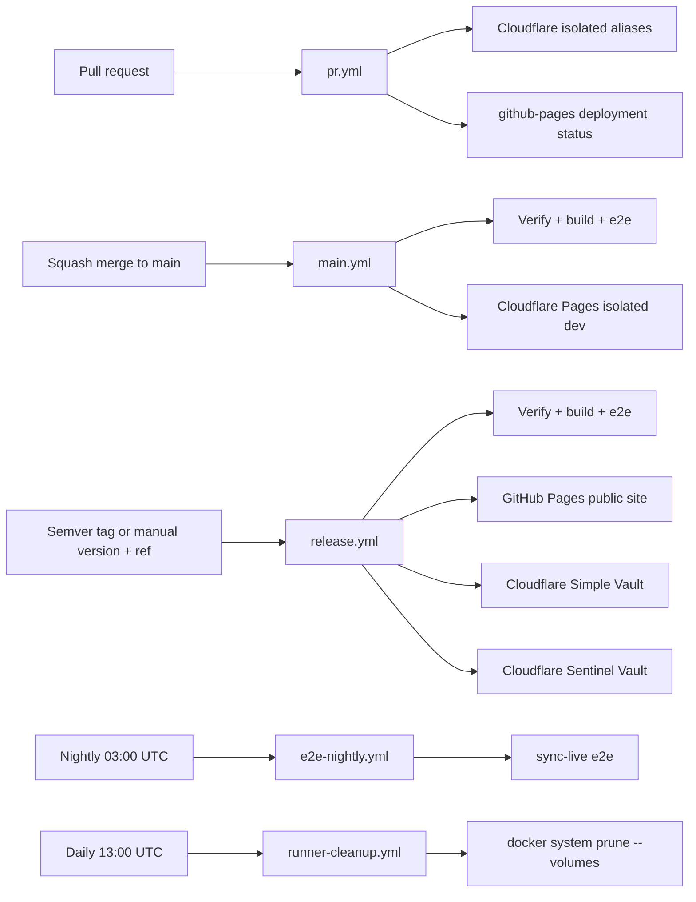

# CI / GitHub Actions Pipeline

System of record for how Nook validates changes in GitHub Actions. Agents must understand this split before changing workflows or e2e.

The PR and main product pipelines ignore `.stats/**`. A verified one-file
`.stats/ai-agent/<source-pr-number>.yaml` PR follows the immediate squash-merge
exception in [agent-statistics.md](agent-statistics.md); it must not consume the
product validation pipeline or trigger the main pipeline after merge.

## Workflow map

| Workflow                                                                             | Trigger                                     | What runs                                                                                                                                                                                                                                        | GitHub PAT                                |
| ------------------------------------------------------------------------------------ | ------------------------------------------- | ------------------------------------------------------------------------------------------------------------------------------------------------------------------------------------------------------------------------------------------------ | ----------------------------------------- |
| [`pr.yml`](../../.github/workflows/pr.yml)                                           | PR open/sync/label                          | **Rust domain unit tests + coverage**, no-opt WASM, web/unit tests, all three web builds, changed headless UI demo specs + video artifact when UI changes, internal harness plus isolated native Pages aliases, `github-pages` deployment status; `ci:full-e2e` additionally runs the Main-equivalent local-provider + extension browser suite | No                                        |
| [`main.yml`](../../.github/workflows/main.yml)                                       | Push to `main`                              | On `ubuntu-latest`: restore/refresh scoped BuildKit caches, verify, wasm-bindgen tests, all web builds, **full local-provider + split-app isolation e2e**, isolated Pages deploys to `dev.nokey.sh` and both `*.dev.nokey.sh` vault origins      | No                                        |
| [`release.yml`](../../.github/workflows/release.yml)                                 | Semver tag `v*.*.*` or manual version + ref | On `ubuntu-latest`: restore scoped BuildKit caches, pin an immutable tag, verify/e2e, deploy `nokey.sh` plus independent `simple.nokey.sh` and `sentinel.nokey.sh` artifacts, publish GitHub Release                                             | No                                        |
| [`e2e-nightly.yml`](../../.github/workflows/e2e-nightly.yml)                         | Cron 03:00 UTC + manual                     | **Live sync provider e2e** (real GitHub API today); **ci-fix** on failure                                                                                                                                                                        | Yes (`NOOK_GITHUB_PAT`, `CURSOR_API_KEY`) |
| [`rust-dependency-updates.yml`](../../.github/workflows/rust-dependency-updates.yml) | Weekly Monday 09:00 UTC + manual            | Audits every direct dependency in `nook-app/` and `preflight/`; when an update exists, an AI agent updates all outdated Rust dependencies, runs the full deterministic suite, then opens a PR for explicit review                                | Yes (`NOOK_GITHUB_PAT`, `CURSOR_API_KEY`) |
| [`agent-implement.yml`](../../.github/workflows/agent-implement.yml)                 | Issue labeled `ai-agent`, or manual prompt  | Cursor SDK implement → PR opened and handed to the standard readiness-and-squash-merge lifecycle → workflow job exits                                                                                                                            | Yes (`NOOK_GITHUB_PAT`, `CURSOR_API_KEY`) |
| [`e2e-pr.yml`](../../.github/workflows/e2e-pr.yml)                                   | Manual                                      | Debug e2e on a PR branch (`e2e-pr` / `e2e` / `sync-live`)                                                                                                                                                                                        | Only for `sync-live`                      |
| [`runner-cleanup.yml`](../../.github/workflows/runner-cleanup.yml)                   | Cron 13:00 UTC + manual                     | Prune unused Docker data and anonymous volumes on the self-hosted Nook runners (`runs-on: nook` only)                                                                                                                                            | No                                        |



## Workflow concurrency policy

Cancellation is scoped to work that a newer run actually supersedes. In
particular, PR validation uses `pr-<number>`: a new commit cancels the older run
for that PR, while separate PRs continue to receive independent required checks.
Do not replace this with one global PR group; that would leave older PRs with a
cancelled required check whenever another contributor pushes.

| Workflow           | Concurrency scope                    | Cancel active run? | Reason                                                                           |
| ------------------ | ------------------------------------ | ------------------ | -------------------------------------------------------------------------------- |
| PR                 | PR number                            | Yes                | Only the newest commit on the same PR needs validation                           |
| Main               | `main`                               | Yes                | A newer main deployment supersedes the older development deployment              |
| Manual PR e2e      | PR number + suite                    | Yes                | A repeated run of the same suite supersedes its older debug build                |
| Web research       | PR number or ref                     | Yes                | Keep only the newest build for the same preview or branch                        |
| Nightly live sync  | Provider job                         | Yes                | Replace a superseded live-sync build without interrupting an active `ci-fix` job |
| CI agent smoke     | Global smoke group                   | Yes                | Only the newest smoke result matters                                             |
| Agent implement    | Issue number; manual runs are unique | No                 | It may already have pushed a branch or opened a PR                               |
| Production release | Global production release group      | No                 | Serialize stateful publication without interrupting a deploy                     |
| Runner cleanup     | Global cleanup group                 | No                 | Let an active Docker prune finish safely                                         |

## Production release strategy

Production releases use immutable semantic-version tags. The tag records the
exact source commit; the GitHub Release records that the tagged build passed the
production gate and was deployed atomically as the public `nokey.sh` site plus
the `simple.nokey.sh` and `sentinel.nokey.sh` vault applications.

Preferred release flow:

1. Open **Actions → Release production → Run workflow** on the default branch.
2. Enter the new semantic version (`1.2.0`; a leading `v` is optional) and the
   branch, tag, or commit to release (`main` by default).
3. The requested source passes the main-equivalent production gate. For a new
   manual release, the workflow creates `v1.2.0` only after that gate succeeds;
   existing tags are verified against the requested commit and never moved.
4. The tagged source is deployed to GitHub Pages and writes its version and
   commit to `nokey.sh/release.json`.
5. Only after deployment succeeds does the workflow publish the GitHub Release.

Pushing a `v*.*.*` tag manually is also supported and enters the same validation
and deployment path. A rerun is idempotent when the version and source commit are
unchanged. If a deployment fails, keep the tag and rerun it after fixing the
workflow or infrastructure; the absence of a GitHub Release shows that the tag
has not completed production release. Rollbacks use a new patch version targeting
the last compatible commit, never a moved or reused tag.

The workflow does not rewrite Cargo or package manifest versions. The deployment
version is the immutable tag, avoiding a CI-generated source mutation that would
make the deployed artifact differ from its tagged commit.

## Provider selection (`NOOK_E2E_SYNC_PROVIDER`)

The **same sync spec files** run against different backends. CI swaps providers by setting one env var per job:

| Env                      | Values                                    | Default |
| ------------------------ | ----------------------------------------- | ------- |
| `NOOK_E2E_SYNC_PROVIDER` | `file`, `local`, `google-drive`, `github` | `file`  |

Registry and factories live in `nook-app/nook-web/e2e/sync-provider.ts`:

- **`createSyncTarget()`** — isolated e2e remote (reads provider from env)
- **`connectSyncGenesisDevice()` / `connectSyncVault()`** — provider-aware connect
- **`live/sync.smoke.spec.ts`** — one nightly smoke per matrix row
- **`live/google-drive-shared-grant.smoke.spec.ts`** — opt-in real Drive
  shared-folder create + `permissions.create` (+ optional joiner verify);
  skips unless `NOOK_GOOGLE_E2E_ACCESS_TOKEN` and `NOOK_GOOGLE_E2E_JOINER_EMAIL`
  are set. Distinct from private `drive.appdata` sync smoke.
- **`local` is a legacy alias for `file`** in e2e; new tests should use
  `file` when they need the default local file-backed provider explicitly.

**Main and release CI (`e2e`):** default to the `file` provider. The e2e remote stores
event files in a real temp directory while Playwright serves the oauth-file HTTP
calls, so default sync tests exercise local file-backed replication without
external API quota.

**Nightly (`sync-live`):** matrix in `e2e-nightly.yml`:

```yaml
strategy:
  matrix:
    provider: [github] # add google-drive when secret exists
env:
  NOOK_E2E_SYNC_PROVIDER: ${{ matrix.provider }}
```

Live credentials per provider:

| Provider       | Secret / env                                              |
| -------------- | --------------------------------------------------------- |
| `github`       | `NOOK_GITHUB_PAT`                                         |
| `google-drive` | `NOOK_GOOGLE_E2E_ACCESS_TOKEN` (private sync smoke, when wired) |

Shared-folder grant live smoke (issue #289; not the private sync matrix row):

| Env | Purpose |
| --- | --- |
| `NOOK_GOOGLE_E2E_ACCESS_TOKEN` | Owner token with `drive.file` |
| `NOOK_GOOGLE_E2E_JOINER_EMAIL` | Email granted writer on the folder |
| `NOOK_GOOGLE_E2E_JOINER_ACCESS_TOKEN` | Optional joiner token to verify access under that folder id |

No-live-provider mode uses Playwright route handlers (`sync-stub.ts`,
`drive-stub.ts`, `file-sync-stub.ts`) — no API quota. For the default `file`
provider, those handlers read and write real event files under a temp directory.

## Runner placement

PR, main, release, AI, scheduled, manual e2e, and research jobs use
GitHub-hosted `ubuntu-latest`, so concurrent work scales across the repository's
hosted-runner allowance instead of queueing on one Docker host. Delivery builds
restore distinct GitHub Actions BuildKit cache scopes; main refreshes the
default-branch scopes that new PRs may access. The self-hosted `nook` label is
reserved for runner cleanup while that machine remains registered.

The web dependency stage runs `bun install --frozen-lockfile` directly in its
Dockerfile layer. It has no host or BuildKit daemon cache mount; the frozen
lockfile and immutable Docker layer are the cache and reproducibility boundary.

PR web solves normally use browser-free `web-base`. UI-changing PRs, main,
nightly, and explicitly requested browser e2e also build `web-e2e-base` with Debian's
`chromium` and `ffmpeg` packages. Playwright is pointed at `/usr/bin/chromium`,
and its revisioned recording path links to `/usr/bin/ffmpeg`; do not install
its bundled Chromium + headless-shell payload, which creates a roughly 1.3 GB
image layer (about 432 MB compressed) on cold runners.
The preparation solve runs once. The small final web-image solve retries once
after the known immediate BuildKit frontend/Dockerfile-load flake, without
repeating the multi-minute Rust/WASM and dependency graph.

PRs that fix a failure observed on `main` must carry the `ci:full-e2e` label.
That label adds the `Full browser e2e (main fix)` job to the ordinary PR
workflow and runs `task ci:pr:e2e`, including the full deterministic
local-provider, split-app isolation, and extension suites before merge. The task
uses the same bounded BuildKit health/recovery wrapper as Main. Adding
or removing the label retriggers PR Actions for the current head. Because the
readiness audit already requires the exact-head `PR` workflow to succeed, a
labeled PR cannot be ready while this job is queued, red, or cancelled.
Extension e2e starts an automatically selected Xvfb display, waits for readiness,
and keeps it from resetting between Playwright retries.

| Workflow                                                                | `runs-on`       | Why                                                            |
| ----------------------------------------------------------------------- | --------------- | -------------------------------------------------------------- |
| `pr.yml`, `main.yml`, `release.yml`                                     | `ubuntu-latest` | Elastic delivery capacity with main-seeded GHA BuildKit caches |
| `agent-implement.yml`, `ci-agent-smoke.yml`, `e2e-nightly.yml` `ci-fix` | `ubuntu-latest` | Long-running background AI work scales independently           |
| `e2e-pr.yml`, `e2e-nightly.yml` `sync-live`, `web-research.yml`         | `ubuntu-latest` | Scheduled, manual, and research work scales independently      |
| `runner-cleanup.yml`                                                    | `nook`          | Maintain the registered self-hosted Docker host and disk       |

The runner-cleanup workflow runs its age-filtered system prune separately from
its unused-volume prune: Docker does not support its `until` filter together
with `docker system prune --volumes`.

## Why local-provider e2e vs sync-live

Real provider API calls are slow and brittle at CI scale. Nook therefore:

1. **`e2e` project** — IndexedDB flows plus sync-provider specs through isolated e2e remotes. One Playwright process, fully parallel, one preview server.
2. **`stable` project** — IndexedDB-only specs for fast manual/debug runs. It starts at 6 workers.
3. **`unstable` project** — local provider/sync specs. It runs separately at 4 workers so their shared preview-server and WASM pressure stays bounded.
4. **`sync-live` project** — Specs under `e2e/live/` hit the **real provider API** using `NOOK_GITHUB_PAT`. Minimal smoke; nightly + manual only.

When adding Google Drive or other sync providers, add local e2e remote specs to
the `e2e` list and thin live smoke specs to `e2e/live/`.

## Parallelism and isolation

Do **not** set `workers` in `playwright.config.ts` — use Playwright defaults locally and override with `--workers=N` when you want more parallelism than the default. Spec files that need ordering use `test.describe.configure({ mode: 'serial' })` within the file only.

`sync-live` keeps `fullyParallel: false` because CI assigns one `NOOK_GITHUB_E2E_REPO` per container; parallel live files would share that remote. The local `stable` and `unstable` groups use `fullyParallel: true`, but run in separate invocations with 6 and 4 workers respectively.

## Rust dependency updates

[`rust-dependency-updates.yml`](../../.github/workflows/rust-dependency-updates.yml)
runs weekly and can be started manually. It installs the pinned
`cargo-outdated` orchestration tool and runs it with `--workspace
--root-deps-only` in both Rust roots: `nook-app/` and `preflight/`. Therefore
the audit covers every direct library declared in their `Cargo.toml` manifests,
not merely the current lockfile's transitive graph.

If either audit reports a newer release, the workflow starts the existing
isolated CI agent on `ubuntu-latest`. The agent updates **all** outdated direct
Rust dependencies, makes compatibility fixes, commits lockfile updates, opens a
PR, and runs this required full deterministic validation before the CI-agent
harness opens the PR:

```bash
WASM_BUILD_MODE=prod task ci:pr:e2e VITE_BASE=/ VITE_VAULT_SYNC_INTERVAL_MS=1000
```

`ci:pr:e2e` includes repository preflight, Rust coverage/unit tests, WASM checks,
web checks/unit tests/builds, the complete local-provider Playwright suite, and
extension e2e. Credentialed real-provider `sync-live` e2e remains a separate
nightly validation because it creates disposable external-provider state and
requires provider secrets. The agent opens a PR after local validation. No
workflow merges it blindly from a check event; a task-owning agent must run the
standard readiness audit and squash-merge when it succeeds.

**One web server per Playwright process is enough.** CI serves static `dist/` via `vite preview`; workers share that HTTP endpoint. Isolation is at the browser layer:

- Each test gets a fresh browser context → separate IndexedDB / `localStorage`.
- Local e2e sync uses `page.route()` with a unique remote id per suite — no shared remote state.
- The Nook server is stateless; vault data never lives on the server in e2e.

Do **not** spin up multiple Nook servers for parallel e2e unless debugging port conflicts locally with `reuseExistingServer`.

## PR UI demo videos

UI-facing changes under the web apps, shared vault UI, or extension browser
surfaces must add or update a focused spec under
`nook-web-app/e2e/demos/*.demo.spec.ts`. The PR contract script rejects a UI
change without a changed demo. Only those changed demo specs run, serially with
one worker, so PR CI does not inherit the cost of the full browser suite.

**Run the contract on the host before the first push** (and after any later UI
edit) so Verify does not discover a missing demo:

```bash
git fetch origin main
.github/scripts/ui-demo-contract.sh "$(git rev-parse origin/main)"
```

Combine with unconditional `task format` — see
[pre-push-hygiene.md](../dynamic-skills/pre-push-hygiene.md).

The `ui-demo` Playwright project runs Chromium headlessly at 1280x720 and always
records WebM video. Demo-only waits are allowed to hold meaningful before/after
states long enough for a reviewer to understand them; ordinary regression specs
must remain full-speed. CI uploads the result for 90 days and maintains a PR
comment linking to the artifact. Use `task ui:demo` from the repository root or
`cargo ui-demo` from `nook-app/` to reproduce it locally.

Playwright DOM/state assertions decide pass or failure. Humans and multimodal AI
agents may review the video as supporting evidence, but visual AI review is
advisory: timing, animation, font rendering, and compression can make frame-only
judgments flaky. A future AI reviewer should consume the video plus assertion
results and traces, and must not receive real vault secrets.

## Playwright projects

Defined in `nook-app/nook-web/playwright.config.ts`:

| Project     | Specs                                     | CI                           |
| ----------- | ----------------------------------------- | ---------------------------- |
| `stable`    | IndexedDB-only specs (6 workers)          | main, e2e-pr (manual/debug)  |
| `unstable`  | Local-provider and sync specs (4 workers) | main, e2e-pr (manual)        |
| `sync-live` | `e2e/live/**/*.spec.ts`                   | e2e-nightly, e2e-pr (manual) |
| `ui-demo`   | `e2e/demos/**/*.demo.spec.ts`             | UI-changing PRs (1 worker)   |

The `test:e2e` script runs `stable` then `unstable`; `test:e2e:local` runs `stable`, and `test:e2e:sync-stub` runs both groups.

## Task commands (Docker)

All commands run containerized via Taskfile. The root `Taskfile.yml` is the repo entrypoint; app commands are included through `nook-app/Taskfile.yml`, with cross-package app tasks in `nook-app/.task/`, Docker tasks in `nook-app/docker/Taskfile.yml`, and web-family tasks in `nook-app/nook-web/Taskfile.yml` plus `nook-app/nook-web/.task/`:

```bash
# Agent-required local action before every push
task format                         # host-applied format only

# Optional local mirrors (humans / deep debug — not agent merge gates)
task check                          # format, clippy, unit tests, wasm-bindgen tests, web build (dev/no-opt wasm)
WASM_BUILD_MODE=dev task ci:pr       # prepare → no-opt WASM → verify ‖ build (no browser e2e)
task ci:pr:e2e                       # full local-provider web e2e + extension e2e

# E2e projects
task web:test:e2e                   # full local-provider e2e (main gate; optional local debug)
task web:test:e2e:pr                # fast e2e-pr subset (manual/debug only)

# WASM tests
task wasm:test                      # wasm-bindgen smoke tests in Node (PR/main gate)
task wasm:test:browser              # browser-only wasm tests (manual/debug)

# Single spec — preferred during optional fix/debug (E2E_SPEC paths relative to nook-app/nook-web/)
E2E_SPEC=e2e/connect.spec.ts task web:test:e2e:file

# Main CI equivalent
task ci:main:e2e                    # one container, full e2e project

# Nightly / live GitHub (needs NOOK_GITHUB_PAT in env or .env.test.local)
task web:test:e2e:sync-live
task ci:nightly:e2e                 # prepare + build + sync-live

# Legacy aliases
task web:test:e2e:github            # → sync-live
```

## nook-core + nook-auth2 coverage export

The `nook-core + nook-auth2` coverage gate runs during the Docker image build in
`nook-app/nook-core/Dockerfile` (`builder-debug`). The source-sensitive layers are
ordered by Rust dependency edge: `nook-auth2` is copied, linted, and coverage-tested
before `nook-core`; the `nook-core` coverage run uses `--no-clean` and the final
`cargo llvm-cov report -p nook-core -p nook-auth2` enforces the committed floor
and writes reusable artifacts to `/opt/nook/coverage/nook-core` in the image.

PR CI uses one explicitly named **Rust/WASM tests, Svelte checks, JS unit tests**
step. Its single Bake graph runs the `nook-core + nook-auth2` nextest/coverage
branch, the WASM test/build branch, and web dependency preparation in parallel.
Do not split Rust into an earlier coverage solve: that serializes the critical
path and makes a cold Rust cache dominate the whole PR. After verification,
`task docker:extract:coverage` copies `summary.txt`, `summary.json`, `lcov.info`,
and `coverage-floor.json` from the already-built image to `coverage/current`.
That extraction invokes neither BuildKit nor Rust tests.

`task docker:extract:coverage` remains the copy-only path for workflows that
already have a sealed `nook-web:local` image, including main's commit-keyed
coverage artifact. `task setup` gets those files into the slim web image through
the same temporary host artifact directory as generated WASM; it does not copy
them directly from the multi-GB Rust builder snapshot.

After a successful main gate, `main.yml` uploads those four files plus a manifest
as `nook-core-auth-coverage-<commit SHA>`. A PR with changed Rust coverage inputs
downloads and validates the artifact for its exact base SHA instead of rebuilding
the base app image. If the artifact is missing or invalid, the PR runs
`task docker:coverage:export` against the base source; that Bake target stops at
`builder-debug` and exports only the coverage payload, never the WASM/web stages or
the multi-GB app image. PRs without Rust/Cargo/source changes—including changes
only to coverage build/export plumbing—reuse the floor-validated current coverage
as the base comparison because the measured source is unchanged.

## Local vs remote CI

**Delivery CI uses GitHub-hosted runners with remote BuildKit layers.** PR,
main, and release run on fresh `ubuntu-latest` VMs. The shared Docker setup
creates a `docker-container` builder, exposes GitHub's cache-service runtime,
and enables separate v2 scopes for stable Rust dependencies, web dependencies,
browser-free web, and e2e web. PR CI assigns native Rust to one runner and keeps
WASM plus web verification/build on a second runner. Generated WASM stays local
to that second runner; native Rust uploads only the small coverage handoff,
which is downloaded after the web build for reporting. The combined job runs
without browser e2e, deploys the Cloudflare previews, and records a successful
`github-pages` deployment status for the PR head SHA. A `ci:full-e2e` PR also
runs the separate Main-equivalent browser job. The preview deploy reuses that prepared sealed image and
must not declare another `setup` dependency. PR coverage always checks the current
`nook-core + nook-auth2` artifact against the floor; changed Rust/Cargo/source
inputs reuse the exact base commit's main artifact (with a coverage-only build
fallback), while unchanged source reuses the current artifact as the base
comparison. Use remote CI as the **sole PR product validation gate**.

Agents wait only for the applicable repository-owned PR checks (`PR / Verify and
preview`, plus `Web research / Build and deploy research catalog` when its paths
change). Every actionable comment already present must be addressed and
resolved. Codex, Claude, Cursor, CodeRabbit, and other optional external
services are never requested or awaited when no feedback is present.
The local ci-agent image tag is derived from the worktree path, preventing
parallel worktrees from replacing each other's review/readiness binaries.

**Delivery jobs are ephemeral but cache-aware.** PR verification, main, and
release use GitHub-hosted runners. Main exports the default-branch cache that
new PRs can restore under GitHub's cache visibility rules; a PR also updates its
branch cache for later pushes. Separate scopes prevent parallel image lineages
from overwriting one another.
Each workflow run and retry loads its sealed web and e2e results under run-scoped
Docker image tags; concurrent jobs must never replace one another's runtime
image between build and deploy.
`task setup` also ensures a Docker-host-only Redis-backed `sccache` service is
running. On an ephemeral hosted VM it starts empty; restored BuildKit layers are
the cross-run cache. It does not replace cargo-chef or change the build result
when empty. Linux publishes Redis only on the Docker
bridge gateway; Docker Desktop publishes only on host loopback. A shared
resolver passes the concrete Docker-host IPv4 address to both Bake and runtime
containers, independent of the selected BuildKit driver.
Scheduled/manual e2e, research, and every AI-agent job also use isolated
GitHub-hosted runners and may restore the same scoped BuildKit layers.
Main deploys `dist/site`, Simple, and Sentinel independently to
`dev.nokey.sh`, `simple.dev.nokey.sh`, and `sentinel.dev.nokey.sh` from the same
prepared image and without a second setup. The combined `dist` tree is reserved
for the internal PR/local/e2e harness; `/site/`, `/simple/`, and `/sentinel/`
are not routes on the public development landing origin.
`release.yml` runs the main-equivalent gate,
deploys an immutable semantic-version tag to GitHub Pages for the public
`nokey.sh` site and to independent Cloudflare Pages projects for Simple and
Sentinel, then verifies app identity, security headers, exact commit, and
extension-route presence/absence before publishing the GitHub Release.

No delivery workflow logs into GHCR for BuildKit or imports a registry cache
manifest. Docker layers use GitHub's Actions cache backend; local builds use
only their local BuildKit content store. Cache restoration is an optimization:
an unavailable cache falls back to a correct cold build. `main.yml` attaches and upserts the three
custom domains, points the landing and both vault domains at their projects'
`development` branch aliases so the main-channel build cannot replace a
production deployment, and verifies landing-only routing, app identity markers,
security headers, and the Simple/Sentinel extension boundary. It records one
`development` deployment whose primary URL is `https://dev.nokey.sh/` and whose
payload contains all
three origins. Before live probes, the workflow purges the affected URLs so a
cached fallback cannot survive a deployment switch.
Extension metadata, ZIP, and checksum verification adds an attempt-specific
exact-commit query to every mutable artifact URL and retries convergence on PR,
main, and release. This prevents a fresh metadata response from being paired
with an older edge-cached archive that reused the same channel filename.

**The GitHub Actions PR workflow is the sole product validation pipeline.** Its
checks validate the exact pushed PR head, so a coherent ready change must be
formatted with `task format`, committed, and pushed immediately to trigger or
refresh `pr.yml`. Do not delay that push for a local product gate, benchmark,
PR metadata update, or other follow-up work.

**Local Docker is optional debug tooling.** Rust/WASM and web image lineages can
stay warm on a developer machine, and Task mirrors (`task check`, `task ci:pr`,
e2e) remain available for humans and focused reproduction. Agents must **not**
require those commands for merge or handoff. After pushing, monitor remote CI.
Never serialize a full local product gate before or after the push as a
workflow requirement.

**E2e debug — one spec at a time (optional).** During a fix/debug session, do
not re-run the full e2e suite after every change. If you choose a local repro,
run individual specs:

```bash
E2E_SPEC=e2e/connect.spec.ts task web:test:e2e:file
```

After targeted fixes, `task format`, push/open/update the PR, and let remote CI
validate.

**Agent efficiency rules:**

1. **Before product validation** — `task format` (+ UI demo contract when UI),
   then push/open/update the PR once the iteration is functionally complete so
   remote CI can start.
2. **No required local product gate** — do not run `task check` / `task ci:pr`
   as a merge requirement. Optional `E2E_SPEC=… task web:test:e2e:file` is
   allowed while debugging a specific e2e failure.
3. **After any remote CI failure** — read test output and static-analysis errors,
   then **persisted app logs** (see below), fix, `task format`, push the
   completed fix, then wait for remote CI to refresh. Do not require a local
   `task ci:pr` mirror before merge.

## Runner cleanup

[`runner-cleanup.yml`](../../.github/workflows/runner-cleanup.yml) runs daily on
the self-hosted `nook` runner label and can also be triggered manually. It runs
`docker system prune --all --force --volumes` to reclaim unused containers,
networks, build cache, tagged and dangling images, and anonymous volumes without
touching the Docker daemon itself. `--all` is required because the default prune
only removes dangling images while `docker system df` includes tagged images
that no container uses in its reclaimable estimate. That estimate can exceed
the image-store total because shared image layers are counted for each image; it
is not a physical-byte reclamation guarantee.
The running `nook-sccache-redis` service and its attached AOF volume are retained
by that prune. Redis bounds itself with `SCCACHE_REDIS_MAXMEMORY` (8 GiB by
default) and `allkeys-lru`, so compiler-cache growth is controlled independently
of BuildKit cleanup.

### CI verification — always check app logs

After tests and static analysis (`task check`, clippy, Playwright report), **app
logs are the most important remaining signal.** They record vault session
lifecycle, sync, and WASM events that neither linters nor DOM assertions expose.

- **Remote e2e failure:** read Playwright attachment `nook-app-logs.json` from
  the CI artifact/report before changing code. The attachment is created for
  every e2e result; failures also print the same entries to test output.
- **Local repro:** `E2E_SPEC=… task web:test:e2e:file`, then `fetchAppLogs(page)`
  or open `/app-logs?minLevel=debug&limit=1000`.
- **Human inspection:** `/logs` in the running app.

Full reference: [logging.md § Debugging, troubleshooting, and CI verification](../references/logging.md#debugging-troubleshooting-and-ci-verification).

Local `task ci:pr` remains available as an optional warm-cache debug mirror.
See [pull-requests.md § Validation](pull-requests.md#5-validation-github-actions-only)
and [coding-bro.md](coding-bro.md).

E2e serves **production `dist/`** on CI (`vite preview`) with `VITE_VAULT_SYNC_INTERVAL_MS=1000` for fast background sync. Main saves prod dist before e2e and restores after (`web:e2e:restore-prod-dist`).

## Secrets and env

| Secret / env                                        | Used by                                                                                                                                                                                                                                                                                                                                               |
| --------------------------------------------------- | ----------------------------------------------------------------------------------------------------------------------------------------------------------------------------------------------------------------------------------------------------------------------------------------------------------------------------------------------------- |
| `NOOK_GITHUB_PAT`                                   | sync-live e2e, nightly ci-fix PR/push, and agent-implement PR/push (repo scope; PR creation must act as a user so normal workflows fire)                                                                                                                                                                                                              |
| `NOOK_GITHUB_E2E_REPO`                              | CI sets per run for live suites (one repo per container)                                                                                                                                                                                                                                                                                              |
| `CLOUD_FLARE_PAGES_TOKEN`, `CLOUD_FLARE_ACCOUNT_ID` | PR preview deploy and main development deploy/domain verification. The token requires account `Cloudflare Pages: Edit` plus `nokey.sh` zone `Zone: Read`, `DNS: Read`, and `Cache Purge`; main purges stale development routes before live verification. PR CI records its preview as a successful `github-pages` deployment for ruleset enforcement. |
| `GITHUB_TOKEN`                                      | PR comments, deployment records, nook-core + nook-auth2 coverage comment                                                                                                                                                                                                                                                                              |
| `CURSOR_API_KEY`                                    | nightly ci-fix agent (`e2e-nightly.yml`) and `agent-implement.yml`                                                                                                                                                                                                                                                                                    |

Local live e2e: copy `nook-app/nook-web/.env.test.local.example` → `.env.test.local` with your PAT.

## Google Cloud operations

The local Codex machine has Google Cloud CLI 575.0.0 installed at
`/Users/bynull/google-cloud-sdk/bin/gcloud`. It is authenticated as
`bynull@meta-secret.org` with active project `nook-500604` (`name: nook`,
`projectNumber: 327685619872`). New interactive shells should resolve `gcloud`
from `.zshrc`; non-interactive agent commands may use the full binary path.

Use this CLI for Nook Google Cloud project inspection and safe operational
changes. OAuth browser-origin changes still require the Google Auth Platform
client configuration to contain exact origins; do not commit client secrets, and
do not assume per-PR Cloudflare preview hosts can be covered by wildcards. See
[auth-providers.md §7](../design-docs/auth-providers.md#7-oauth-origins-and-pr-previews).

## CI agent (`ci-fix` / `ci-agent:implement`)

[`e2e-nightly.yml`](../../.github/workflows/e2e-nightly.yml) runs a **`ci-fix`** job on failure: Cursor SDK agent → fix branch → PR opened → workflow job exits. No workflow merges the PR blindly from a check event; any task-owning agent that continues it follows the standard readiness-and-squash-merge contract. Main-branch failures remain visible for manual handling. Nightly uses `.github/prompts/ci-fix-nightly-agent.md` and `CI_FIX_LABEL=nightly e2e`. [`agent-implement.yml`](../../.github/workflows/agent-implement.yml) uses the same harness via **`task ci-agent:implement`** for labeled issues / manual prompts (see below).

**Why `NOOK_GITHUB_PAT` (not `GITHUB_TOKEN`)?** GitHub does not fire `pull_request` workflows for PRs opened with the default Actions token (`github-actions[bot]`). The ci-fix job checks out and pushes with `NOOK_GITHUB_PAT` so the fix PR is attributed to the PAT owner and `pr.yml` runs. Merge still requires the standard exact-head readiness audit.

Required secrets for ci-fix: `CURSOR_API_KEY`, `NOOK_GITHUB_PAT` (classic PAT with `repo` scope, or fine-grained with contents + pull requests write on this repo).

The `ci-fix` / `ci-agent:implement` jobs run **`task setup`** (bake sealed `nook-web:local`) then **`task ci-agent:fix`** / **`task ci-agent:implement`**, which build and run the **`nook-ci-agent:local`** image. That container includes both the Docker CLI and the Buildx CLI plugin because repository Task targets use `docker buildx bake`. It uses **`docker run --init`**, bind-mounts the checkout, and mounts **`/var/run/docker.sock`** so the agent can spawn sibling containers on the host Docker daemon (not Docker-in-Docker).

**Runner placement:** nightly `ci-fix` and `agent-implement.yml` run on GitHub-hosted **`ubuntu-latest`**, like delivery CI, so concurrent work scales across hosted capacity. Host Node is not required for these jobs.

After the agent finishes, ci-agent **awaits** `agent[Symbol.asyncDispose]()` (not fire-and-forget `close()`), then calls `process.exit` (and best-effort SIGKILL of direct child PIDs) so orphaned SDK children cannot keep the container alive.

Optional env: `CI_AGENT_PROMPT_FILE` (agent instructions), `CI_FIX_LABEL` (PR title/body label), `DOCKER_SOCK` (default `/var/run/docker.sock`).

### Logging

The `task ci-agent:fix` step (`agentic-ai/ci-agent/`) emits **log4j-style** lines so GitHub Actions logs are easy to scan:

```
2026-06-29 20:14:32,879 INFO  [ci-agent/agent-wait] Agent still running (20m 0s)
2026-06-29 20:14:32,879 INFO  [ci-agent/run-agent] Running Cursor SDK agent (run 123, …)
2026-06-29 20:14:33,102 INFO  [ci-agent/cursor] shell grep waitForPendingJoin
2026-06-29 20:14:33,450 INFO  [ci-agent/cursor/agent] agent output
    The agent's streamed reply is indented under the header.
2026-06-29 20:14:34,120 INFO  [ci-agent/cursor/shell] output
    | task: ci:verify:parallel
    | error: test failed
2026-06-29 20:14:35,001 INFO  [ci-agent/cursor] --- stdout ---
2026-06-29 20:14:35,001 INFO  [ci-agent/cursor] shell exit 1
```

| Field     | Meaning                                                                                                                |
| --------- | ---------------------------------------------------------------------------------------------------------------------- |
| Timestamp | UTC, `yyyy-MM-dd HH:mm:ss,SSS`                                                                                         |
| Level     | `TRACE` / `DEBUG` / `INFO` / `WARN` / `ERROR`                                                                          |
| Component | `ci-agent/<module>` — e.g. `fix`, `run-agent`, `agent-wait`, `git`, `github`, `cursor`, `cursor/agent`, `cursor/shell` |

Set `CI_AGENT_LOG_LEVEL=DEBUG` in the job env to include step/turn traces (`step started`, `turn ended`). Tool starts, shell output, and command results are always logged at **INFO**. Heartbeat interval: `CI_AGENT_HEARTBEAT_MS` (default 60s). The harness's local/default agent timeout is 90m, but every production Actions agent job explicitly sets `CI_AGENT_TIMEOUT_MS=21600000` and `timeout-minutes: 360`, matching GitHub's six-hour hosted-runner ceiling so the harness does not interrupt the agent earlier. The six-hour job limit covers setup, the agent run, and PR creation; the job exits after opening the PR. `task pr:preflight` and `task pr:ready` are read-only audits. No hosted continuation or CLI command merges based on their result.

The ci-agent entrypoint calls `process.exit` after `runCiFix()` completes. Without an explicit exit, the Cursor SDK local executor can leave child processes and open handles that keep the Node event loop alive after the agent opens its PR.

Smoke coverage: [`.github/workflows/ci-agent-smoke.yml`](../../.github/workflows/ci-agent-smoke.yml) runs unit tests plus an `exitCiAgent` open-handle check on `ubuntu-latest` when an issue is labeled `ci-agent-smoke` (or via `workflow_dispatch`).

## Agent implement (`ai-agent` label / manual prompt)

[`agent-implement.yml`](../../.github/workflows/agent-implement.yml) runs the same Cursor SDK harness (`task ci-agent:implement`) for intentional implementation work — not CI failure recovery.

| Trigger             | When it runs                                                                                                      |
| ------------------- | ----------------------------------------------------------------------------------------------------------------- |
| `issues: [labeled]` | Only when the label being assigned is exactly **`ai-agent`** (not on issue open, not when other labels are added) |
| `workflow_dispatch` | Always, using the required `prompt` input                                                                         |

Opt-in only: create milestones/epics/sub-issues first, then assign `ai-agent` to the focused issue you want executed. Opening an issue (even with labels pre-selected) does not start the job unless GitHub emits a `labeled` event for `ai-agent`. The workflow does **not** auto-create the label — maintainers create it once (`gh label create ai-agent` or the GitHub UI).

Loop: `task setup` → **`task ci-agent:implement`** (nook-ci-agent container + docker.sock) → push branch → open a PR → comment on the issue with the PR URL (issue runs) → exit the workflow job. The PR then follows the standard agent-owned failure/comment/conflict loop, exact-head readiness audit, and squash merge. Same secrets as ci-fix: `CURSOR_API_KEY`, `NOOK_GITHUB_PAT`. Prompt: [`.github/prompts/agent-implement.md`](../../.github/prompts/agent-implement.md).

## Agent checklist when touching CI or e2e

1. **Do not** move real GitHub API tests back into `main.yml` — extend stub coverage instead.
2. **Do** add new sync-provider integration tests to the `e2e` spec list first; add a small live smoke under `e2e/live/` if the provider has a real backend.
3. **Do** push after `task format` and let GitHub Actions own product validation; optional local `task ci:pr` / e2e is debug-only, never a merge gate.
4. **Do** update this doc and [`pull-requests.md`](pull-requests.md) when workflow behavior changes.
5. PR CI runs Rust/WASM/JS unit tests, Svelte/type checks, lint, formatting, and builds. UI-changing PRs additionally record only their changed headless demo specs. PRs repairing a Main failure carry `ci:full-e2e` and run the Main-equivalent deterministic browser suites before merge; Main runs the same local-provider and extension **e2e** and leaves failures for manual handling. Nightly runs **sync-live** and invokes `ci-fix` on failure.
6. **Never** add Dockerfile `RUN --mount=type=cache`; dependency installs must use normal image layers. The repository-root Rust suite invoked by `task preflight` rejects violations before app setup.

See also: [ARCHITECTURE.md §7](../ARCHITECTURE.md#7-the-engineering-harness), [pull-requests.md](pull-requests.md).

<!-- agent-implement docker smoke -->
