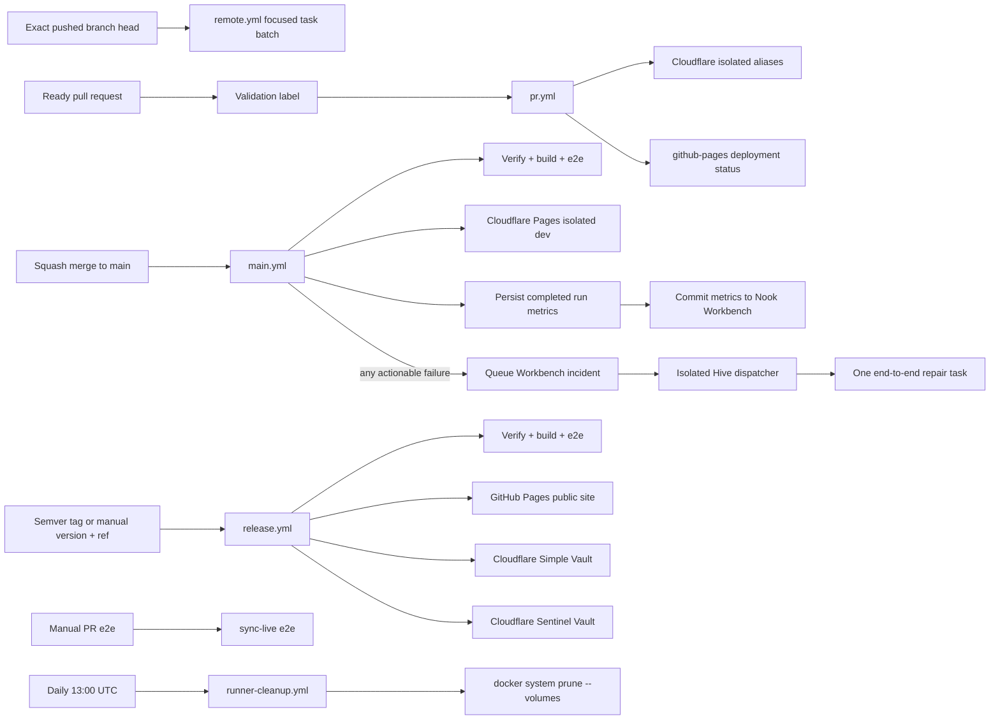

# CI / GitHub Actions Pipeline

System of record for how Nook validates changes in GitHub Actions. Agents must understand this split before changing workflows or e2e.

Agent worklogs and statistics live in `meta-secret/nook-workbench`, so they do
not create Nook branches, PRs, product validation, or recursive Main builds.
See [issues.md](issues.md), [agent-statistics.md](agent-statistics.md), and
[main-build-statistics.md](main-build-statistics.md).

## Workflow map

| Workflow | Trigger | What runs | GitHub PAT |
| --- | --- | --- | --- |
| [`remote.yml`](../../.github/workflows/remote.yml) | Manual allowlisted task dispatch | Focused command batch; no merge authorization | No |
| [`pr.yml`](../../.github/workflows/pr.yml) | Explicit `ci:validate` / `ci:full-e2e` label | Exact-head PR gate, including Rust ecosystem jobs | No |
| [`loom.yml`](../../.github/workflows/loom.yml) | Path-filtered PR and Main changes | Loom TypeScript, authored-state, and single-parameter verification | No |
| [`source-architecture.yml`](../../.github/workflows/source-architecture.yml) | Every opened, synchronized, or reopened PR | Source-size and Rust unit-test-colocation enforcement | No |
| [`web-research.yml`](../../.github/workflows/web-research.yml) | Path-filtered PR/Main changes or manual dispatch | Research check, build, Cloudflare deploy, and PR preview | No |
| [`rust-ecosystem.yml`](../../.github/workflows/rust-ecosystem.yml) | Schedule, path-filtered main push, manual | Non-PR Rust ecosystem entry points | No |
| [`pr-validation-handoff.yml`](../../.github/workflows/pr-validation-handoff.yml) | Successful same-repository PR workflow | Promote trusted PR artifacts | No |
| [`linear-ui-demo.yml`](../../.github/workflows/linear-ui-demo.yml) | Successful PR workflow / PR close | Publish PR demo WebMs to Linear | No |
| [`main.yml`](../../.github/workflows/main.yml) | Push to `main` | Main verify, e2e, dev deploy | No |
| [`main-build-stats.yml`](../../.github/workflows/main-build-stats.yml) | Completed `Main` attempt | Commit Main build stats to Workbench | Yes (`NOOK_GITHUB_PAT`) |
| [`main-failure-handoff.yml`](../../.github/workflows/main-failure-handoff.yml) | Failed `Main` attempt | Create Hive Workbench incident | Yes (`NOOK_GITHUB_PAT`) |
| [`hive.yml`](../../.github/workflows/hive.yml) | Hive/infra PR changes and Main pushes | Hive format/Clippy/tests | No |
| [`release.yml`](../../.github/workflows/release.yml) | Semver tag `v*.*.*` or manual version + ref | Production verify, deploy, release | No |
| [`rust-dependency-updates.yml`](../../.github/workflows/rust-dependency-updates.yml) | Weekly Monday 09:00 UTC + manual | Audit and AI-update Rust deps | Yes (`NOOK_GITHUB_PAT`, `CURSOR_API_KEY`) |
| [`agent-implement.yml`](../../.github/workflows/agent-implement.yml) | Scheduled ready-Workbench scan or manual dispatch | Claim Workbench issue → implement → PR | Yes (`NOOK_GITHUB_PAT`, `CURSOR_API_KEY`) |
| [`ci-agent-smoke.yml`](../../.github/workflows/ci-agent-smoke.yml) | Manual | ci-agent unit tests and open-handle exit smoke | No |
| [`e2e-pr.yml`](../../.github/workflows/e2e-pr.yml) | Manual | Debug e2e on a PR branch | Only for `sync-live` |
| [`runner-cleanup.yml`](../../.github/workflows/runner-cleanup.yml) | Cron 13:00 UTC + manual | Docker prune on self-hosted `nook` runner | No |

### Workflow details

**`remote.yml`**

- One or more selected Taskfile commands on one GitHub-hosted runner.
- Checkout, Docker setup, and cache connection happen once per batch.
- Selected tasks run sequentially and report individual results.
- Git-commit-scoped Zot writes (`-git-<sha>`), with Main used only while the
  exact scope is absent.
- Read-only SeaweedFS compiler-object access.
- No merge authorization.

**`pr.yml`**

- Rust domain unit tests + coverage, no-opt WASM, web/unit tests, all three web builds.
- Shared Rust ecosystem gates via `rust-ecosystem-checks.yml`.
- Those ecosystem jobs run in parallel with native Rust, WASM, and verify.
- Ordinary pushes do not start this workflow.
- Only `ci:validate` / `ci:full-e2e` label events start it.
- Changed headless UI demo specs run beside web verification when UI changes.
- Those demos retain a 90-day artifact.
- Internal harness plus isolated native Pages aliases.
- `github-pages` deployment status.
- `ci:full-e2e` additionally runs the Main-equivalent local-provider + extension browser suite.
- Keep independent long-running gates on separate hosted runners.
- Combine jobs only when measured setup savings exceed lost parallelism.

**`loom.yml`**

- Runs when Loom, its Task wrapper, or related preflight sources change.
- Verifies Loom formatting, lint, types, and tests.
- Enforces authored TypeScript state and Loom API contracts.

**`source-architecture.yml`**

- Runs on every opened, synchronized, or reopened pull request.
- Enforces the authored source-file limit.
- Enforces Rust unit-test colocation.

**`web-research.yml`**

- Checks and builds the isolated research package.
- Deploys path-applicable PR previews and Main updates to Cloudflare Pages.
- Records the deployment and comments the PR preview URL.

**`rust-ecosystem.yml`**

- Thin entry points outside the product PR pipeline.
- Weekly schedule, path-filtered main push, and `workflow_dispatch`.
- Labeled `agentic-ai/minds/**` PRs only, because `pr.yml` ignores `agentic-ai/**`.
- Calls the same `rust-ecosystem-checks.yml` jobs as labeled product PRs.
- Ordinary PR pushes do not start it.

**`pr-validation-handoff.yml`**

- Runs from trusted default-branch code.
- Verifies the successful source run and required jobs.
- Validates native/WASM artifact shapes, attaches provenance.
- Publishes exact-input handoffs that later PRs may trust.

**`linear-ui-demo.yml`**

- Runs from the trusted default branch.
- Downloads the PR demo artifact.
- Publishes its 10 largest WebMs to Linear.
- Updates the PR comment and completes/cancels the matching Linear issue.

**`main.yml`**

- On `ubuntu-latest`: native Rust → WASM → browser-free web verify read-only.
- Each lane serially exports its already-solved local BuildKit graph after validation.
- Local-provider web e2e, extension e2e, and headless UI demos consume verified WASM on separate runners.
- Each browser solve is read-only.
- The successful UI-demo lane publishes the warm browser-image graph.
- 90-day artifact + 10 largest recordings on the merged PR's Linear issue.
- Deploy to `dev.nokey.sh` / `*.dev.nokey.sh` after web verify + web e2e.

**`main-build-stats.yml`**

- Collects run/job/step timing and conclusions.
- Commits one `stats/main-build/**` record directly to Nook Workbench.

**`main-failure-handoff.yml`**

- Creates or refreshes one ready automated Workbench incident per failed Main revision.
- Uses run metadata and failed job names only.
- Includes browser E2E and UI-demo failures.

**`hive.yml`**

- Installs, checks, and browser-tests the Hive Control Center.
- Runs pinned Docker format/Clippy and behavior tests against Neo4j.
- Checks k0s manifests and the Taskfile command surface.
- Main alone publishes the shared Hive dependency cache.

**`release.yml`**

- Restores scoped BuildKit caches, pins an immutable tag, verify/e2e.
- Deploys `nokey.sh` plus independent `simple.nokey.sh` and `sentinel.nokey.sh` artifacts.
- Publishes GitHub Release.

**`rust-dependency-updates.yml`**

- Audits every direct dependency in each Rust root.
- The roots are `nook-app/nook-platform/`, its fuzz workspace, `agentic-ai/minds/`, and `preflight/`.
- When an update exists, an AI agent updates all outdated Rust dependencies.
- Runs the full deterministic suite and opens a PR for explicit review.

**`agent-implement.yml`**

- Atomically claims one ready agent issue with an assigned Nook GitHub
  collaborator.
- Cursor SDK implement → PR opened → owner assigned and mentioned → Workbench
  progress/worklog published → workflow exits.

**`ci-agent-smoke.yml`**

- Runs the maintained npm-based ci-agent unit suite through Task.
- Proves that `exitCiAgent` terminates open handles.

**`e2e-pr.yml`**

- Debug e2e on a PR branch (`e2e-pr` / `e2e` / `sync-live`).

**`runner-cleanup.yml`**

- Prunes unused Docker data and anonymous volumes on self-hosted Nook runners (`runs-on: nook` only).


```mermaid
flowchart LR
  branch[Exact pushed branch head] --> remote_yml[remote.yml focused task batch]
  PR[Ready pull request] --> label[Validation label]
  label --> pr_yml[pr.yml]
  pr_yml --> preview[Cloudflare isolated aliases]
  pr_yml --> pr_deployment[github-pages deployment status]

  merge[Squash merge to main] --> main_yml[main.yml]
  main_yml --> main_verify[Verify + build + e2e]
  main_yml --> cf_dev[Cloudflare Pages isolated dev]
  main_yml --> main_stats[Persist completed run metrics]
  main_stats --> workbench_stats[Commit metrics to Nook Workbench]
  main_yml -->|any actionable failure| main_failure[Queue Workbench incident]
  main_failure --> hive_dispatcher[Isolated Hive dispatcher]
  hive_dispatcher --> hive_worker[One end-to-end repair task]

  release[Semver tag or manual version + ref] --> release_yml[release.yml]
  release_yml --> release_verify[Verify + build + e2e]
  release_yml --> pages[GitHub Pages public site]
  release_yml --> simple_cf[Cloudflare Simple Vault]
  release_yml --> sentinel_cf[Cloudflare Sentinel Vault]

  manual_e2e[Manual PR e2e] --> e2e_live[sync-live e2e]

  cleanup_cron[Daily 13:00 UTC] --> cleanup[runner-cleanup.yml]
  cleanup --> docker_prune["docker system prune --volumes"]
```

## Workflow concurrency policy

Cancellation is scoped to work that a newer run actually supersedes. In
particular, PR validation uses `pr-<number>`: a new commit cancels the older run
for that PR, while separate PRs continue to receive independent required checks.
Do not replace this with one global PR group; that would leave older PRs with a
cancelled required check whenever another contributor pushes. Main is the
exception: an active run completes so its serialized cache writers cannot be
interrupted, while the single pending slot is replaced by the newest merged
revision during a burst.

| Workflow           | Concurrency scope                    | Cancel active run? | Reason                                                                           |
| ------------------ | ------------------------------------ | ------------------ | -------------------------------------------------------------------------------- |
| PR                 | PR number                            | Yes                | Only the newest commit on the same PR needs validation                           |
| Main               | `main`                               | No; one pending    | Finish active cache publication and coalesce bursts to the newest pending revision |
| Main failure handoff | Failed Main head SHA               | No; one pending    | Serialize retries that update the same Workbench incident                         |
| Main build stats   | Main run ID + attempt                 | No                 | Every completed attempt is immutable evidence; separate runs never supersede it   |
| Manual PR e2e      | PR number + suite                    | Yes                | A repeated run of the same suite supersedes its older debug build                |
| Web research       | PR number or ref                     | Yes                | Keep only the newest build for the same preview or branch                        |
| CI agent smoke     | Global smoke group                   | Yes                | Only the newest smoke result matters                                             |
| Agent implement    | Issue number; manual runs are unique | No                 | It may already have pushed a branch or opened a PR                               |
| Production release | Global production release group      | No                 | Serialize stateful publication without interrupting a deploy                     |
| Runner cleanup     | Global cleanup group                 | No                 | Let an active Docker prune finish safely                                         |

## Production release strategy

Production releases use immutable semantic-version tags. The tag records the
exact source commit; the GitHub Release records that the tagged build passed the
production gate and was deployed atomically as the public `nokey.sh` site plus
the `simple.nokey.sh` and `sentinel.nokey.sh` vault applications.

Preferred release flow:

1. Open **Actions → Release production → Run workflow** on the default branch.
2. Enter the new semantic version (`1.2.0`; a leading `v` is optional) and the
   branch, tag, or commit to release (`main` by default).
3. The requested source passes the main-equivalent production gate. For a new
   manual release, the workflow creates `v1.2.0` only after that gate succeeds;
   existing tags are verified against the requested commit and never moved.
4. The tagged source is deployed to GitHub Pages and writes its version and
   commit to `nokey.sh/release.json`.
5. Only after deployment succeeds does the workflow publish the GitHub Release.

Pushing a `v*.*.*` tag manually is also supported and enters the same validation
and deployment path. A rerun is idempotent when the version and source commit are
unchanged. If a deployment fails, keep the tag and rerun it after fixing the
workflow or infrastructure; the absence of a GitHub Release shows that the tag
has not completed production release. Rollbacks use a new patch version targeting
the last compatible commit, never a moved or reused tag.

The workflow does not rewrite Cargo or package manifest versions. The deployment
version is the immutable tag, avoiding a CI-generated source mutation that would
make the deployed artifact differ from its tagged commit.

## Provider selection (`NOOK_E2E_SYNC_PROVIDER`)

The **same sync spec files** run against different backends. CI swaps providers by setting one env var per job:

| Env                      | Values                                    | Default |
| ------------------------ | ----------------------------------------- | ------- |
| `NOOK_E2E_SYNC_PROVIDER` | `file`, `local`, `google-drive`, `github` | `file`  |

Registry and factories live in `nook-app/nook-web/nook-web-app/e2e/sync-provider.ts`:

- **`createSyncTarget()`** — isolated e2e remote (reads provider from env)
- **`connectSyncGenesisDevice()` / `connectSyncVault()`** — provider-aware connect
- **`live/sync.smoke.spec.ts`** — explicit real-provider smoke
- **`live/google-drive-shared-grant.smoke.spec.ts`** — opt-in real Drive
  shared-folder create + `permissions.create` (+ optional joiner verify);
  skips unless `NOOK_GOOGLE_E2E_ACCESS_TOKEN` and `NOOK_GOOGLE_E2E_JOINER_EMAIL`
  are set. Distinct from private `drive.appdata` sync smoke.
- **`local` is a legacy alias for `file`** in e2e; new tests should use
  `file` when they need the default local file-backed provider explicitly.

**Main and release CI (`e2e`):** default to the `file` provider. The e2e remote stores
event files in a real temp directory while Playwright serves the oauth-file HTTP
calls, so default sync tests exercise local file-backed replication without
external API quota.

**Manual (`sync-live`):** dispatch `e2e-pr.yml` with the `sync-live` suite.
The workflow defaults `NOOK_E2E_SYNC_PROVIDER` to `github`; local runs may
select another configured provider explicitly.

Live credentials per provider:

| Provider       | Secret / env                                              |
| -------------- | --------------------------------------------------------- |
| `github`       | `NOOK_GITHUB_PAT`                                         |
| `google-drive` | `NOOK_GOOGLE_E2E_ACCESS_TOKEN` (private sync smoke, when wired) |

Shared-folder grant live smoke (issue #289; not the private sync matrix row):

| Env | Purpose |
| --- | --- |
| `NOOK_GOOGLE_E2E_ACCESS_TOKEN` | Owner token with `drive.file` |
| `NOOK_GOOGLE_E2E_JOINER_EMAIL` | Email granted writer on the folder |
| `NOOK_GOOGLE_E2E_JOINER_ACCESS_TOKEN` | Optional joiner token to verify access under that folder id |

No-live-provider mode uses Playwright route handlers (`sync-stub.ts`,
`drive-stub.ts`, `file-sync-stub.ts`) — no API quota. For the default `file`
provider, those handlers read and write real event files under a temp directory.

## Runner placement

PR, main, release, AI, scheduled, manual e2e, and research jobs use GitHub-hosted `ubuntu-latest`. Concurrent work scales across the repository's hosted-runner allowance instead of queueing on one Docker host.

**Zot cache policy:**

- Delivery builds restore distinct private Zot BuildKit cache refs.
- Main refreshes the default-branch scopes that new PRs may access.
- Every PR job writes only immutable git-commit scopes and cannot replace Main.
- A cold PR scope restores trusted Main or a dependency-fingerprint scope.
- Once an exact PR scope exists, setup imports that scope alone.
- BuildKit merges cache importers; list order is not fallback precedence.
- Exact-input handoffs own repeat-run acceleration without mutable branch refs.
- The WASM dependency target reads Main's dedicated, complete WASM dependency export instead of competing with the larger native dependency lineage.
- Main's preparation selects both dependency targets and the native source target as explicit cache-only outputs.
- Consuming them as named build contexts is not sufficient to run their dedicated exporters.
- Only a `push` event on `refs/heads/main` may write the shared scopes.
- Release, agent, and manual workflows are read-only unless they use an
  explicitly isolated git-commit publisher.
- PR and Remote jobs write git-commit refs, use Main only while their exact
  scope is absent, and cannot replace shared Main manifests.
- The self-hosted `nook` label is reserved for runner cleanup while that machine remains registered.

**Focused remote jobs:**

- `remote.yml` jobs retain the same hosted placement.
- Common Rust test and web/extension check routes use smaller source-sealed image targets.
- Their solve graphs stop before unrelated coverage, WASM-test, browser, full-verification, and production-build stages.
- These remote-only routes preserve the exact check command while reducing preparation work.
- Complete PR/Main/release graphs are unchanged.

**BuildKit cache propagation:**

- Cache records imported by a named target are local to that target's solve.
- They do not propagate through a named build context into an outer source leaf.
- Importing exact and Main together can select Main's parent and orphan an exact
  source leaf, even when the exact importer is listed first.
- An exact-only importer replays the leaf across both linked and internal parents.
- Product dependency and source stages therefore live together in
  `nook-app/nook-platform/docker/rust/product.Dockerfile`.
- Product source Bake targets must not override those internal stages with
  `target:` contexts.
- Standalone dependency restore and publisher targets use the same Dockerfile.
- `nook-app/nook-platform/docker/rust/docker-bake.hcl` owns the Rust Zot
  cache scopes and the direct WASM consumer import.
- `nook-app/nook-web/docker/web.docker-bake.hcl` owns final web/e2e image
  cache scopes.
- `nook-app/nook-web/docker/toolchain.docker-bake.hcl` owns the web-deps
  cache scope.
- `preflight/docker-bake.hcl` owns the preflight Zot cache scope.
- Loadable `nook-web*` tags live in
  `nook-app/nook-web/nook-web-app/docker-bake.hcl`.
- Loadable `nook-rust*` tags live in the platform core/wasm bake files.
- `nook-app/docker-bake.hcl` stays thin: shared GHA/registry/sccache
  variables, `_sccache`, and cross-lineage prepare groups.
- Main verifies the published WASM dependency fingerprint from a fresh BuildKit builder.
- Repository invariants in `preflight/tests/sccache_s3.rs` and `preflight/tests/vault_app_isolation.rs` enforce the topology and proof.

**Exact-input handoffs:**

- Split native and WASM producers restore small validated handoffs by exact input hash.
- Keys cover Rust sources and manifests, toolchain and Docker definitions, Task entry points, Docker setup, and the PR workflow itself.
- PR workflows upload only same-run artifacts.
- After the entire run succeeds, default-branch-only `pr-validation-handoff.yml`:
  - verifies the source workflow and all required jobs;
  - recreates the validated base/head merge tree;
  - validates artifact shapes, adds provenance;
  - republishes immutable trusted artifacts.
- The current attempt must contain a successful consumer.
- Each producer must succeed in the current attempt when scheduled.
- A failed-job rerun that omits an already-successful producer may reuse that producer job and run-stable artifact from an earlier attempt.
- Promotion requires the immutable PR snapshot attached to the completed workflow-run event.
- There is no post-merge or manual fallback to mutable PR metadata.
- A later PR skips a producer only after resolving an exact artifact by ID and verifying that its successful workflow run used this trusted default-branch promotion workflow.
- PR-writable caches never bypass required validation.
- Repository invariant preflight still runs on every PR head.
- On a native producer miss, preflight must finish before the native application Docker solve begins.
- `Web verification` declares `needs` on the WASM build producer.
- It downloads the run-stable WASM artifact directly after that job succeeds.
- `Headless UI demo` declares `needs` on the WASM build producer.
- Required demos therefore overlap browser-free web verification.
- `Verify and preview` waits for Native Rust, web verification, and WASM Node tests.
- It also waits for the UI demo job.
- That keeps the merge-gate check red when Native fails.
- Preview deploys from a host dist handoff with pinned wrangler.
- No consumer polls GitHub for a sibling producer.
- Changed inputs must execute and complete the full workflow before a new handoff can be promoted.
- If promotion cannot prove its provenance, consumers treat the artifact as a miss and run the producers.
- The required-job budget is four to five minutes for exact handoff hits and ordinary source-changing PRs.
- Measure it from the first required job start through the last required job completion.
- Report GitHub-hosted runner queue time separately.

The web dependency stage runs `bun install --frozen-lockfile` directly in its
Dockerfile layer. It has no host or BuildKit daemon cache mount; the frozen
lockfile and immutable Docker layer are the cache and reproducibility boundary.

PR web solves normally use browser-free `web-base`. UI-changing PRs, main,
and explicitly requested browser e2e also build `web-e2e-base` with Debian's
`chromium` and `ffmpeg` packages. Playwright is pointed at `/usr/bin/chromium`,
and its revisioned recording path links to `/usr/bin/ffmpeg`; do not install
its bundled Chromium + headless-shell payload, which creates a roughly 1.3 GB
image layer (about 432 MB compressed) on cold runners.
The preparation solve runs once. The small final web-image solve retries once
after the known immediate BuildKit frontend/Dockerfile-load flake, without
repeating the multi-minute Rust/WASM and dependency graph.

PRs that fix a failure observed on `main` must carry the `ci:full-e2e` label.
That label adds the `Full browser e2e (main fix)` and `Full extension e2e
(main fix)` jobs to the ordinary PR workflow. A dedicated producer verifies
WASM once and uploads only its generated package; preview and both browser jobs
download that artifact instead of recompiling Rust. The two browser jobs build
the Chromium image and run deterministic local-provider plus split-app tests
and extension e2e on separate hosted runners through
`task ci:pr:e2e:web:artifacts` and
`task ci:pr:e2e:extension:artifacts`. Both tasks use the same bounded BuildKit
health/recovery wrapper as Main. Pull-request browser consumers publish only
isolated exact-head cache refs. Each consumer probes its exact browser ref.
An available exact ref is imported alone. A missing exact ref falls back to
the browser-image seed owned by trusted Main. The web full-e2e job publishes
the verified exact-head browser graph after its assertions pass. The UI-demo
publisher is suppressed in that mode so the two jobs never write the same ref
concurrently. Adding
or removing the label retriggers PR Actions for the current head. Because the
readiness audit already requires the exact-head `PR` workflow to succeed, a
labeled PR cannot be ready while this job is queued, red, or cancelled.
Extension e2e starts an automatically selected Xvfb display, waits for readiness,
keeps it from resetting between Playwright retries, and uses one hosted worker
so the persistent-context smoke cannot compete with other headed Chromium tests.

| Workflow                                                                | `runs-on`       | Why                                                            |
| ----------------------------------------------------------------------- | --------------- | -------------------------------------------------------------- |
| `pr.yml`, `main.yml`, `release.yml`                                     | `ubuntu-latest` | Elastic delivery capacity with Main-seeded private Zot caches  |
| `loom.yml`, `source-architecture.yml`, `hive.yml`                       | `ubuntu-latest` | Independent architecture and package verification              |
| `agent-implement.yml`, `ci-agent-smoke.yml`                             | `ubuntu-latest` | Background implementation and bounded smoke work               |
| `e2e-pr.yml`, `web-research.yml`                                        | `ubuntu-latest` | Manual and research work scales independently                  |
| `runner-cleanup.yml`                                                    | `nook`          | Maintain the registered self-hosted Docker host and disk       |

The runner-cleanup workflow runs its age-filtered system prune separately from
its unused-volume prune: Docker does not support its `until` filter together
with `docker system prune --volumes`.

## Why local-provider e2e vs sync-live

Real provider API calls are slow and brittle at CI scale. Nook therefore:

1. **`e2e` project** — IndexedDB flows plus sync-provider specs through isolated e2e remotes. One Playwright process, fully parallel, one preview server.
2. **`stable` project** — IndexedDB-only specs for fast manual/debug runs. It starts at 3 workers.
3. **`unstable` project** — local provider/sync specs. It runs separately at 2 workers so their shared preview-server and WASM pressure stays bounded.
4. **`sync-live` project** — Specs under `e2e/live/` hit the **real provider API** using `NOOK_GITHUB_PAT`. Minimal smoke; explicit manual runs only.

When adding Google Drive or other sync providers, add local e2e remote specs to
the `e2e` list and thin live smoke specs to `e2e/live/`.

## Parallelism and isolation

Do **not** set `workers` in `playwright.config.ts` — use Playwright defaults locally and override with `--workers=N` when you want more parallelism than the default. Spec files that need ordering use `test.describe.configure({ mode: 'serial' })` within the file only.

`sync-live` keeps `fullyParallel: false` because CI assigns one `NOOK_GITHUB_E2E_REPO` per container; parallel live files would share that remote. The local `stable` and `unstable` groups use `fullyParallel: true`, but run in separate invocations with 3 and 2 workers respectively.

## Rust dependency updates

[`rust-dependency-updates.yml`](../../.github/workflows/rust-dependency-updates.yml)
runs weekly and can be started manually. It installs the pinned
`cargo-outdated` orchestration tool and runs it with `--workspace
--root-deps-only` in every Rust root. Those roots are:

- `nook-app/nook-platform/`;
- `nook-app/nook-platform/fuzz/`;
- `agentic-ai/minds/`;
- `preflight/`.

The audit covers every direct library declared in those `Cargo.toml` manifests.
It does not audit only the current lockfile's transitive graph.

If any audit reports a newer release, the workflow starts the existing
isolated CI agent on `ubuntu-latest`. The agent updates **all** outdated direct
Rust dependencies and makes compatibility fixes. It runs the required
validation before the CI-agent harness commits, pushes, and opens the PR:

```bash
WASM_BUILD_MODE=prod task ci:pr:e2e VITE_BASE=/ VITE_VAULT_SYNC_INTERVAL_MS=1000
task docker:ecosystem:fuzz FUZZ_SECONDS=20
task hive:verify
```

`ci:pr:e2e` validates the product path:

- repository preflight;
- Rust coverage and unit tests;
- WASM checks;
- web checks, unit tests, and builds;
- the complete local-provider Playwright suite;
- extension e2e.

The additional targets validate the separate fuzz workspace. They also compile,
lint, and test both Hive and Lace in the Minds workspace.

Credentialed real-provider `sync-live` e2e remains a separate manual validation.
It creates disposable external-provider state. It also requires provider
secrets.

No workflow merges the harness-owned PR from a check event. A task-owning agent
must run the standard readiness audit. The agent squash-merges when it succeeds.

**One web server per Playwright process is enough.** CI serves static `dist/` via `vite preview`; workers share that HTTP endpoint. Isolation is at the browser layer:

- Each test gets a fresh browser context → separate IndexedDB / `localStorage`.
- Local e2e sync uses `page.route()` with a unique remote id per suite — no shared remote state.
- The Nook server is stateless; vault data never lives on the server in e2e.

Do **not** spin up multiple Nook servers for parallel e2e unless debugging port conflicts locally with `reuseExistingServer`.

## PR UI demo videos

UI-facing changes under the web apps, shared vault UI, or extension browser
surfaces must add or update a focused spec under
`nook-web-app/e2e/demos/*.demo.spec.ts`. The PR contract script rejects a UI
change without a changed demo. Only those changed demo specs run, serially with
one worker, so PR CI does not inherit the cost of the full browser suite.

**Run the contract on the host before the first push** (and after any later UI
edit) so Verify does not discover a missing demo:

```bash
git fetch origin main
.github/scripts/ui-demo-contract.sh "$(git rev-parse origin/main)"
```

Combine with unconditional `task format` — see
[pre-push-hygiene.md](../dynamic-skills/pre-push-hygiene.md).

The `ui-demo` Playwright project runs Chromium headlessly at 1280x720.
It always records WebM video.
The pull-request demo job starts beside web verification.
It starts after the WASM handoff is ready.
Its browser-image solve is read-only.
After Playwright succeeds, a dedicated cache-only publisher exports the warm
graph to the isolated exact-head scope.
Demo-only waits are allowed to hold meaningful before/after
states long enough for a reviewer to understand them; ordinary regression specs
must remain full-speed. CI keeps the GitHub Actions result for 90 days and, after
a successful recording, uploads the 10 largest WebMs to Linear's private file storage. A
deterministic Linear issue in the `nook-ui` project owns all recordings for one
GitHub PR, with one idempotent comment per head SHA. The PR comment links both
the Actions fallback and the Linear archive. Merging completes that Linear issue;
closing without merge cancels it. Linear publication and lifecycle transitions
are best-effort so an external tracker outage does not invalidate authoritative
Playwright assertions or block the product gate.

Main runs the complete UI-demo project and retains every resulting WebM in its
90-day Actions artifact. It adds only the 10 largest recordings to the Linear
issue for the PR associated with that Main commit, then leaves the issue in
Done. This keeps the issue reviewable while preserving the full recording set.

The trusted post-workflow and Main workflow require the repository Actions
secret `LINEAR_API_KEY`; the unmerged `pull_request` workflow never receives it
or loads secret-consuming code from the PR checkout. Never put that value in
workflow YAML, logs, comments, artifacts, or agent statistics. The local Linear
MCP OAuth connection is useful for interactive issue management but is separate
from this unattended CI credential. Use `task ui:demo` from the repository root
or `cargo ui-demo` from `nook-app/` to reproduce a recording locally.

Playwright DOM/state assertions decide pass or failure. Humans and multimodal AI
agents may review the video as supporting evidence, but visual AI review is
advisory: timing, animation, font rendering, and compression can make frame-only
judgments flaky. A future AI reviewer should consume the video plus assertion
results and traces, and must not receive real vault secrets.

## Playwright projects

Defined in `nook-app/nook-web/playwright.config.ts`:

| Project     | Specs                                     | CI                           |
| ----------- | ----------------------------------------- | ---------------------------- |
| `stable`    | IndexedDB-only specs (3 workers)          | main, e2e-pr (manual/debug)  |
| `unstable`  | Local-provider and sync specs (2 workers) | main, e2e-pr (manual)        |
| `sync-live` | `e2e/live/**/*.spec.ts`                   | e2e-pr (manual)              |
| `ui-demo`   | `e2e/demos/**/*.demo.spec.ts`             | UI-changing PRs (1 worker)   |

The `test:e2e` script runs `stable` then `unstable`; `test:e2e:local` runs `stable`, and `test:e2e:sync-stub` runs both groups.

## Task commands (Docker)

All commands run containerized via Taskfile. The root `Taskfile.yml` is the repo entrypoint; app commands are included through `nook-app/Taskfile.yml`, with cross-package app tasks in `nook-app/ci/Taskfile.yml`, Docker tasks in `nook-app/nook-platform/docker/Taskfile.yml`, and web-family tasks in `nook-app/nook-web/Taskfile.yml` and package Taskfiles under `nook-web-extension/` / `nook-platform/`:

```bash
# Agent-required local action before every push
task format                         # host-applied format only

# Optional local mirrors (humans / deep debug — not agent merge gates)
task check                          # format, clippy, unit tests, wasm-bindgen tests, web build (dev/no-opt wasm)
WASM_BUILD_MODE=dev task ci:pr       # prepare → no-opt WASM → verify ‖ build (no browser e2e)
task ci:pr:e2e                       # full local-provider web e2e + extension e2e

# E2e projects
task web:test:e2e                   # full local-provider e2e (main gate; optional local debug)
task web:test:e2e:pr                # fast e2e-pr subset (manual/debug only)

# WASM tests
task wasm:test                      # wasm-bindgen smoke tests in Node (PR/main gate)
task wasm:test:browser              # browser-only wasm tests (manual/debug)

# Single spec — preferred during optional fix/debug (E2E_SPEC paths relative to nook-app/nook-web/)
E2E_SPEC=e2e/connect.spec.ts task web:test:e2e:file

# Main CI equivalent
task ci:main:e2e                    # one container, full e2e project

# Manual live GitHub (needs NOOK_GITHUB_PAT in env or .env.test.local)
task web:test:e2e:sync-live

# Legacy aliases
task web:test:e2e:github            # → sync-live
```

## Portable Rust crate coverage export

The portable Rust coverage gate runs during the `builder-debug` stage in
`nook-app/nook-platform/docker/rust/product.Dockerfile`. It covers
`nook-app-common`, `nook-authenticator-domain`, `nook-auth2`,
`nook-replication`, `nook-event-log`, `nook-companion-core`, and `nook-core`.

**Image build:**

- Source-sensitive layers are ordered by Rust dependency edge.
- Leaf and foundation crates are copied in dependency order. This includes
  `nook-app-common`, `nook-authenticator-domain`, `nook-auth2`,
  `nook-replication`, `nook-event-log`, and `nook-companion-core`. Each is
  linted and coverage-tested before `nook-core`.
- The `nook-core` coverage run uses `--no-clean`.
- The final report across all seven portable crates enforces the committed
  floor. It writes reusable artifacts to `/opt/nook/coverage/nook-core` in the
  image.

**PR CI split:**

- PR CI uses independent native Rust and WASM producers.
- Native Rust runs the portable Rust nextest/coverage branch and uploads its small coverage handoff.
- The WASM build producer runs clippy/build once and uploads the generated package under a run-stable artifact name.
- `WASM Node tests` depends on that build job and finishes the producer gate.
- `Web verification` depends on the build job and downloads the package with `actions/download-artifact`.
- It can run browser-free web validation while Node tests continue.
- It exports host dist trees for preview deploy.
- `Headless UI demo` also depends on the WASM build job.
- It runs changed demo specs in parallel with web verification.
- `Verify and preview` waits for Native Rust, web verification, and WASM Node tests.
- It also waits for the UI demo job.
- Optional web and extension e2e consumers need both WASM jobs and receive only a fully verified handoff.
- A separate `Rust coverage report` job declares `needs: rust`, downloads the native handoff directly, and performs reporting without occupying or delaying the preview runner.

**Rerun and artifact rules:**

- `needs` reuses a successful producer omitted from a failed-job-only rerun.
- Consumers download the exact-head run artifact after that producer edge is satisfied.
- Do not serialize the **PR** producers or move Rust coverage into preview: a cold Rust cache must not dominate the PR web critical path.
- Coverage reporting must depend on the native producer instead of starting from the preview job.

**Main serialization:**

- Main deliberately serializes its native, WASM, and web publisher lanes because they write the shared default-branch scopes.
- Each lane verifies read-only first and exports from the same warm builder afterward.
- `task docker:extract:coverage` remains a copy-only path that invokes neither BuildKit nor Rust tests.
- It also serves workflows that already have a sealed `nook-web:local` image, including main's commit-keyed coverage artifact.
- `task setup` gets those files into the slim web image through the same temporary host artifact directory as generated WASM.
- It does not copy them directly from the multi-GB Rust builder snapshot.

**Main artifact handoff:**

- After Main's native lane succeeds, `main.yml` uploads those four files plus a manifest as `nook-core-auth-coverage-<commit SHA>`.
- PR lookup trusts that commit-keyed artifact as soon as it exists, even while later Main jobs are still running or after an unrelated later job fails.
- It authenticates the workflow, push event, default branch, and exact SHA before use.
- A PR with changed Rust coverage inputs downloads and validates that artifact instead of rebuilding the base app image.
- If the artifact is missing or invalid, the report reuses the floor-validated current coverage as its comparison and emits a warning.
- It never launches a second cold Docker coverage build.
- PRs without Rust/Cargo/source changes — including changes only to coverage reporting plumbing — also reuse current coverage because the measured source is unchanged.

**Coverage input detection:**

- Compares the merge-base diff between the pull request event's explicit base and head SHAs.
- Must not compare the base to the checked-out synthetic merge; Main can advance after the event snapshot.
- Must not use a two-dot snapshot diff; a behind-base branch would then count Main-only changes as pull request changes.

## Agent host vs GitHub-hosted execution

**Delivery CI uses GitHub-hosted runners with remote BuildKit layers.**

- PR, main, and release run on fresh `ubuntu-latest` VMs.
- The shared Docker setup creates a `docker-container` builder and exposes GitHub's cache-service runtime.
- It enables separate v2 scopes for stable and source-sensitive Rust/WASM layers, web dependencies, browser-free web, and e2e web.
- PR CI assigns native Rust to one runner and WASM to another.
- The small generated WASM package feeds parallel browser-free preview validation as soon as clippy/build finishes.
- Required Node tests continue on the producer; preview deployment is blocked until that producer succeeds.
- Optional browser-e2e consumers wait for the fully verified producer.
- Native Rust separately uploads the coverage handoff consumed by the small Rust-dependent reporting job.
- The preview job never waits for native coverage.
- It runs without browser e2e, deploys the Cloudflare previews, and records a successful `github-pages` deployment status for the PR head SHA.
- A `ci:full-e2e` PR also runs the parallel artifact-backed web and extension browser jobs.
- The preview deploy reuses that prepared sealed image and must not declare another `setup` dependency.
- PR coverage always checks the current portable Rust artifact against the floor.
- Changed Rust/Cargo/source inputs reuse the exact base commit's trusted Main artifact when available.
- Missing or unchanged base coverage reuses the current artifact for comparison without another Docker solve.
- Use remote CI as the **sole PR product validation gate**.

**Agent remote commands:**

- Agents use `task remote TASK_NAME=<name>` for one focused command.
- Agents use `task remote TASK_NAMES=<a>,<b>` to reuse one job for a batch.
- When the branch is ready, they run `task pr:validate PR=<number>` (or `FULL_E2E=1`) and wait only for the applicable repository-owned exact-head PR checks.
- Ordinary pushes do not start `pr.yml`.
- Every later push requires another explicit validation before readiness.
- Every actionable comment already present must be addressed and resolved.
- Codex, Claude, Cursor, CodeRabbit, and other optional external services are never requested or awaited when no feedback is present.
- The local ci-agent image tag is derived from the worktree path, preventing parallel worktrees from replacing each other's review/readiness binaries.

**Ephemeral but cache-aware delivery jobs:**

- PR verification, main, and release use GitHub-hosted runners.
- Main verifies each native/WASM/web lane read-only, then serially exports its already-solved graph from the same job-scoped builder.
- WASM deps publish through `builder-wasm-deps-publish` with scoped `mode=max` refs.
- Main then verifies the fingerprint from a fresh builder.
- Empty `cache-from=` and `cache-to=` overrides are prohibited across Taskfiles and scripts.
- Main thereby exports protected default-branch refs that PR jobs restore from private Zot.
- Same-repository PR jobs authenticate with the Remote registry identity; Zot ACLs deny that identity write access to `nook/buildcache/**`.
- PR Bake exporters write only git-commit refs under `nook/remote-buildcache/**`.
- Hosted setup probes each full-graph exact ref separately.
- Existing exact refs are imported alone. Missing refs use dependency
  fingerprints and trusted Main.
- Fork pull requests receive no registry credentials.
- Native coverage and WASM source-sensitive layers have separate Zot refs in addition to the manifest-only dependency refs, so non-Rust pushes do not repeat unchanged Cargo compilation.

**SeaweedFS sccache:**

- Trusted Main Rust/WASM producers and explicitly dispatched same-repository Remote tasks use authenticated SeaweedFS S3 `sccache`.
- Compiler vertices receive the bucket-scoped build identity only through stable optional BuildKit secret IDs.
- Secret contents do not participate in Docker cache checksums, so secret-free solves can still restore Main's exported vertices.
- Same-repository PR Rust producers and Rust ecosystem Docker jobs mount SeaweedFS `sccache` with the Main build identity (matching Hive).
- Release, browser-only, and arbitrary-ref workflows do not receive those credentials.
- Fork pull requests also stay secret-free.
- SeaweedFS remains an optimization and never a correctness input.
- Each workflow run and retry loads its sealed web and e2e results under run-scoped Docker image tags; concurrent jobs must never replace one another's runtime image between build and deploy.
- `task sccache:ensure` fails closed when credential files are missing or SeaweedFS is unhealthy, so a local misconfiguration cannot silently cold-compile.
- Secret-free hosted jobs (forks, release, arbitrary-ref) set `SCCACHE_OPTIONAL=1` through `nook-cache-connect`; the wrapper then bypasses sccache without replacing cargo-chef or changing build correctness.

**Hive workflow cache:**

- Manual e2e, research, and every AI-agent job also use isolated GitHub-hosted runners and may restore the same scoped BuildKit layers.
- The path-filtered Hive workflow uses its own `nook-hive-linux-amd64-v1` scope.
- Its pinned cargo-chef planner/recipe/cook stages match the `nook-app` strategy, then warm real-lock test and Clippy profiles in independent BuildKit stages before authored sources are copied.
- The stages execute in parallel, so Cargo metadata and linking for the two verification graphs do not form one serial critical path.
- Pull requests restore Main's scope read-only; only Main exports both graphs, in a final step after check and behavior tests pass.
- Hive check and test tasks use the same job-scoped Buildx builder, so the behavior image reuses the dependency graph produced earlier in the run without allowing parallel PRs or failed validation to replace the trusted cache.
- Unlike the product delivery graph, trusted same-repository Hive runs also mount `NOOK_SCCACHE_ACCESS_KEY` / `NOOK_SCCACHE_SECRET_KEY` into compiler steps and use SeaweedFS S3 `sccache` with the isolated `nook-hive` key prefix.
- GitHub withholds those secrets from forked pull requests, and the shared wrapper then falls back to direct compilation.
- The credentials are BuildKit secrets or read-only runtime mounts, never image content.

**Deploy and release:**

- Main deploys `dist/site`, Simple, and Sentinel independently to `dev.nokey.sh`, `simple.dev.nokey.sh`, and `sentinel.dev.nokey.sh` from the same prepared image and without a second setup.
- The combined `dist` tree is reserved for the internal PR/local/e2e harness; `/site/`, `/simple/`, and `/sentinel/` are not routes on the public development landing origin.
- `release.yml` runs the main-equivalent gate, deploys an immutable semantic-version tag to GitHub Pages for the public `nokey.sh` site and to independent Cloudflare Pages projects for Simple and Sentinel, then verifies app identity, security headers, exact commit, and extension-route presence/absence before publishing the GitHub Release.

**Zot registry policy:**

- Delivery BuildKit caches use authenticated `type=registry` refs on `registry.dev.nokey.sh` (Zot behind Traefik HTTPS + htpasswd), not GitHub Actions cache storage.
- Local Task Bake restores git-commit remote-buildcache scopes when remote registry credentials exist.
- The sealed local formatter uploads source-free Rust/WASM dependency stages to
  unique candidate tags.
- The Main-defined allowlisted Remote workflow completely downloads each
  candidate.
- It uploads and downloads a hosted-normalized tag before atomically assigning
  the stable content-fingerprint tag in the same OCI repository.
- PR jobs import only the verified stable tag, never a local candidate.
- The sealed web source stage changes the parent of `COPY . .` for every commit.
  A Main final-image cache therefore cannot substitute a stale source snapshot.
- Main and release jobs import neither candidate nor stable formatter tags.
- Hosted promotion independently fingerprints the exact committed source SHA.
- Agents still run build, test, proof, and validation tasks remotely. Local
  execution remains available only for explicit rare-case debugging.
- Commit-scoped local publish requires a clean worktree. Dirty builds remain
  local and cannot poison the committed PR scope.
- The formatter dependency candidate is the exception because its targets
  contain no authored source.
- It still skips upload whenever the Dockerfile, Bake graph, publisher,
  promotion workflow, or guard is dirty.
- A failed candidate upload or hosted validation leaves the prior stable tag
  unchanged and PR jobs fall back to Main.
- Opt out with `NOOK_REGISTRY_CACHE=0`.
- Cache restoration is an optimization: an unavailable cache falls back to a correct cold build.
- Main publishes shared cache manifests after lane verification.
- Explicit Remote tasks import a present git-commit ref alone.
- If that scope is absent, they seed it from source-free dependencies and Main.
- They export only Remote refs.
- The Remote credential can update only `nook/remote-buildcache/**` and has read-only access to Main's `nook/buildcache/**` repository path.
- Same-repository pull requests use that same Remote registry identity for
  git-commit exporters under `nook/remote-buildcache/**`.
- Release and label-gated browser e2e jobs remain BuildKit-read-only.
- Fork pull requests do not receive credentials.
- Hive images also publish and pull through Zot.
- There is no host `:5000` listener and no `kubectl port-forward` for the registry.

**Main deploy verification:**

- `main.yml` attaches and upserts the three custom domains.
- It points the landing and both vault domains at their projects' `development` branch aliases so the main-channel build cannot replace a production deployment.
- It verifies landing-only routing, app identity markers, security headers, and the Simple/Sentinel extension boundary.
- It records one `development` deployment whose primary URL is `https://dev.nokey.sh/` and whose payload contains all three origins.
- Before live probes, the workflow purges the affected URLs so a cached fallback cannot survive a deployment switch.
- Extension metadata, ZIP, and checksum verification adds an attempt-specific exact-commit query to every mutable artifact URL and retries convergence on PR, main, and release.
- This prevents a fresh metadata response from being paired with an older edge-cached archive that reused the same channel filename.

**Agent execution rules:**

- GitHub Actions is both the agent build/test environment and the sole merge validation pipeline.
- A coherent experiment must be formatted, committed, and pushed before `task remote` dispatches it.
- Complete `pr.yml` validation starts only when `task pr:validate` toggles a validation label.
- Local Docker product execution is not the agent path.
- Agents do not run Task mirrors (`task check`, `task ci:pr`, builds, tests, or e2e) locally.
- Interactive development servers and browser sessions remain local when their persistent state is intrinsic to the investigation.

**Agent efficiency rules:**

1. **Before product validation** — run `task loom:pre-push`, then commit and
   push/open/update the PR so the exact head can run remotely.
2. **Focused hosted iteration** — batch useful allowlisted tasks when they need
   the same head. Use separate dispatches when parallel compute is worth another
   runner.
3. **After any remote CI failure** — read test output and static-analysis errors.
   Then read persisted app logs when applicable. Fix the problem, run
   `task loom:pre-push`, and push the completed fix. Use focused work for
   diagnosis. Repeat complete validation only when replacing a failed final
   gate.
4. **Complete gate only when ready** — run `task pr:validate`; a push never refreshes that gate automatically.

## Runner cleanup

[`runner-cleanup.yml`](../../.github/workflows/runner-cleanup.yml) runs daily on
the self-hosted `nook` runner label and can also be triggered manually. It runs
`docker system prune --all --force --volumes` to reclaim unused containers,
networks, build cache, tagged and dangling images, and anonymous volumes without
touching the Docker daemon itself. `--all` is required because the default prune
only removes dangling images while `docker system df` includes tagged images
that no container uses in its reclaimable estimate. That estimate can exceed
the image-store total because shared image layers are counted for each image; it
is not a physical-byte reclamation guarantee.
The compiler cache is remote and is unaffected by runner pruning. SeaweedFS S3
disk usage on Borg is controlled independently of BuildKit cleanup.

### CI verification — always check app logs

After tests and static analysis (`task check`, clippy, Playwright report), **app
logs are the most important remaining signal.** They record vault session
lifecycle, sync, and WASM events that neither linters nor DOM assertions expose.

- **Remote e2e failure:** read Playwright attachment `nook-app-logs.json` from
  the CI artifact/report before changing code. The attachment is created for
  every e2e result; failures also print the same entries to test output.
- **Human local repro:** `E2E_SPEC=… task web:test:e2e:file`, then
  `fetchAppLogs(page)` or open `/app-logs?minLevel=debug&limit=1000`. Agents use
  the hosted remote catalog.
- **Human inspection:** `/logs` in the running app.

Full reference: [logging.md § Debugging, troubleshooting, and CI verification](../references/logging.md#debugging-troubleshooting-and-ci-verification).

Local `task ci:pr` remains available as an optional warm-cache debug mirror.
See [pull-requests.md § Validation](pull-requests.md#5-hosted-iteration-and-explicit-validation)
and [coding-bro.md](coding-bro.md).

E2e serves **production `dist/`** on CI (`vite preview`) with `VITE_VAULT_SYNC_INTERVAL_MS=1000` for fast background sync. Main saves prod dist before e2e and restores after (`web:e2e:restore-prod-dist`).

## Secrets and env

| Secret / env | Used by |
| --- | --- |
| `NOOK_GITHUB_PAT` | sync-live e2e; agent-implement PR/push |
| `NOOK_GITHUB_E2E_REPO` | CI sets per run for live suites (one repo per container) |
| `CLOUD_FLARE_PAGES_TOKEN`, `CLOUD_FLARE_ACCOUNT_ID` | PR preview deploy; main development deploy/domain verification |
| `GITHUB_TOKEN` | PR comments, deployment records, portable Rust coverage comment |
| `CURSOR_API_KEY` | `agent-implement.yml` |

**`NOOK_GITHUB_PAT`**

- Repo scope required for sync-live e2e and agent-implement PR/push.
- PR creation must act as a user so normal workflows fire.

**Cloudflare credentials**

- Token requires account `Cloudflare Pages: Edit` plus `nokey.sh` zone `Zone: Read`, `DNS: Read`, and `Cache Purge`.
- Main purges stale development routes before live verification.
- PR CI records its preview as a successful `github-pages` deployment for ruleset enforcement.

Local live e2e: copy `nook-app/nook-web/.env.test.local.example` → `.env.test.local` with your PAT.

## Google Cloud operations

The local Codex machine has Google Cloud CLI 575.0.0 installed at
`/Users/bynull/google-cloud-sdk/bin/gcloud`. It is authenticated as
`bynull@meta-secret.org` with active project `nook-500604` (`name: nook`,
`projectNumber: 327685619872`). New interactive shells should resolve `gcloud`
from `.zshrc`; non-interactive agent commands may use the full binary path.

Use this CLI for Nook Google Cloud project inspection and safe operational
changes. OAuth browser-origin changes still require the Google Auth Platform
client configuration to contain exact origins; do not commit client secrets, and
do not assume per-PR Cloudflare preview hosts can be covered by wildcards. See
[auth-providers.md §7](../design-docs/auth-providers.md#7-oauth-origins-and-pr-previews).

## CI agent (dependency updates / implementation)

[`agent-implement.yml`](../../.github/workflows/agent-implement.yml) uses the CI-agent harness via **`task ci-agent:implement`** for ready Workbench issues or manual prompts (see below).

**Main failure handoff:**

- An unsuccessful Main run is handled separately by [`main-failure-handoff.yml`](../../.github/workflows/main-failure-handoff.yml).
- Trusted default-branch code writes a deduplicated `status: ready`, `automation: hive` Workbench incident without copying raw logs.
- The token-free k0s dispatcher reconciles it into Neo4j.
- One isolated logical task owns diagnosis through exact-head checks, review resolution, squash merge, and replacement Main verification.
- The scheduled implementation worker does not claim Hive incidents.
- Browser E2E and UI-demo failures enter the same durable repair queue as native, WASM, build, deployment, mixed, and unknown failures.

**Hive delivery generations:**

- Each rerun is recorded on the Workbench issue keyed by source SHA.
- Its publication branch, plan, and worklog are generation-specific.
- A later failed rerun supersedes and cancels an active delivery before its new generation is enqueued.
- The failed reconciliation retries only after a poll interval longer than the worker heartbeat.
- Elapsed time is not the termination barrier.
- The old generation remains `CANCELLING` until its worker durably acknowledges that Codex execution stopped or Kubernetes confirms deletion of the exact recorded worker Pod.
- Cancelling exclusive blocker Pods participate in the same barrier.
- Only then can the replacement become claimable.
- A successful rerun retires an existing incident and terminates any active delivery.
- Run IDs and attempts are ordered across the incident so older workflow runs are ignored.
- Reconciliation of the already-current generation is idempotent and never cancels it.
- Any mixed, unknown, native, WASM, build, deployment, or cancelled non-E2E job still queues Hive.

**Rust dependency updates:**

- The weekly Rust dependency workflow uses the same harness through **`task ci-agent:fix`** for its bounded update job.

**Why `NOOK_GITHUB_PAT` (not `GITHUB_TOKEN`)?** GitHub does not fire
`pull_request` workflows for PRs opened with the default Actions token
(`github-actions[bot]`). The implementation job checks out and pushes with
`NOOK_GITHUB_PAT` so the PR is attributed to the PAT owner and `pr.yml` runs.
Merge still requires the standard exact-head readiness audit.

Required secrets: `CURSOR_API_KEY`, `NOOK_GITHUB_PAT` (classic PAT with `repo`
scope, or fine-grained with contents + pull requests write on this repo).

The `ci-agent:implement` job runs **`task setup`** (bake sealed
`nook-web:local`) then **`task ci-agent:implement`**, which builds and runs the
**`nook-ci-agent:local`** image. That container includes both the Docker CLI and
the Buildx CLI plugin because repository Task targets use `docker buildx bake`.
It uses **`docker run --init`**, bind-mounts the checkout, and mounts
**`/var/run/docker.sock`** so the agent can spawn sibling containers on the
host Docker daemon (not Docker-in-Docker).

**Runner placement:** `agent-implement.yml` runs on GitHub-hosted
**`ubuntu-latest`**, like delivery CI, so concurrent work scales across hosted
capacity. Host Node is not required for this job.

After the agent finishes, ci-agent **awaits** `agent[Symbol.asyncDispose]()` (not fire-and-forget `close()`), then calls `process.exit` (and best-effort SIGKILL of direct child PIDs) so orphaned SDK children cannot keep the container alive.

Optional env: `CI_AGENT_PROMPT_FILE` (agent instructions), `CI_FIX_LABEL` (PR title/body label), `DOCKER_SOCK` (default `/var/run/docker.sock`).

### Logging

The `task ci-agent:fix` step (`agentic-ai/ci-agent/`) emits **log4j-style** lines so GitHub Actions logs are easy to scan:

```
2026-06-29 20:14:32,879 INFO  [ci-agent/agent-wait] Agent still running (20m 0s)
2026-06-29 20:14:32,879 INFO  [ci-agent/run-agent] Running Cursor SDK agent (run 123, …)
2026-06-29 20:14:33,102 INFO  [ci-agent/cursor] shell grep waitForPendingJoin
2026-06-29 20:14:33,450 INFO  [ci-agent/cursor/agent] agent output
    The agent's streamed reply is indented under the header.
2026-06-29 20:14:34,120 INFO  [ci-agent/cursor/shell] output
    | task: ci:verify:parallel
    | error: test failed
2026-06-29 20:14:35,001 INFO  [ci-agent/cursor] --- stdout ---
2026-06-29 20:14:35,001 INFO  [ci-agent/cursor] shell exit 1
```

| Field     | Meaning                                                                                                                |
| --------- | ---------------------------------------------------------------------------------------------------------------------- |
| Timestamp | UTC, `yyyy-MM-dd HH:mm:ss,SSS`                                                                                         |
| Level     | `TRACE` / `DEBUG` / `INFO` / `WARN` / `ERROR`                                                                          |
| Component | `ci-agent/<module>` — e.g. `fix`, `run-agent`, `agent-wait`, `git`, `github`, `cursor`, `cursor/agent`, `cursor/shell` |

Set `CI_AGENT_LOG_LEVEL=DEBUG` in the job env to include step/turn traces (`step started`, `turn ended`).

Tool starts, shell output, and command results are always logged at **INFO**.

Heartbeat interval: `CI_AGENT_HEARTBEAT_MS` (default 60s).

The harness's local/default agent timeout is 90 minutes.

`agent-implement.yml` sets:

- `timeout-minutes: 360` for the complete job;
- `CI_AGENT_TIMEOUT_MS=18000000` for a five-hour agent run.

The remaining hour covers setup and result publication.

The job exits after opening the PR and publishing its bounded handoff.

`task pr:preflight` and `task pr:ready` are read-only audits. No hosted continuation or CLI command merges based on their result.

The ci-agent entrypoint calls `process.exit` after `runCiFix()` completes. Without an explicit exit, the Cursor SDK local executor can leave child processes and open handles that keep the Node event loop alive after the agent opens its PR.

Smoke coverage: [`.github/workflows/ci-agent-smoke.yml`](../../.github/workflows/ci-agent-smoke.yml) runs unit tests plus an `exitCiAgent` open-handle check on `ubuntu-latest` through `workflow_dispatch`.

## Agent implement (Workbench issue / manual prompt)

[`agent-implement.yml`](../../.github/workflows/agent-implement.yml) runs the same Cursor SDK harness (`task ci-agent:implement`) for intentional implementation work — not CI failure recovery.

| Trigger | When it runs |
| --- | --- |
| `schedule` | Twice hourly; claims the first ready agent record with an assigned Nook GitHub collaborator |
| `workflow_dispatch.issue_path` | Claims that exact eligible Workbench issue |
| `workflow_dispatch.prompt` | Runs the explicit prompt without claiming an issue |

The workflow serializes claims. Eligibility requires `status: ready`,
`automation: agent`, and an owner who is a Nook GitHub collaborator with write
access. Scheduled scans skip ownerless records. The worker commits `status:
in_progress` before setup.

The workflow publishes a Workbench progress update and worklog whether
implementation opens a PR or blocks. Drafts, manually owned issues, and
historical imports cannot trigger it.

Loop: claim Workbench record → `task setup` → **`task ci-agent:implement`**
(nook-ci-agent container + docker.sock) → push branch → open a Nook PR →
assign and directly mention the continuing owner → publish Workbench
progress/worklog → exit. The assigned owner then follows the standard
failure/comment/conflict loop, exact-head readiness audit, squash merge, and
final Workbench completion update. Agent secrets:
`CURSOR_API_KEY`, `NOOK_GITHUB_PAT`. Prompt:
[`.github/prompts/agent-implement.md`](../../.github/prompts/agent-implement.md).

## Agent checklist when touching CI or e2e

1. **Do not** move real GitHub API tests back into `main.yml` — extend stub coverage instead.
2. **Do** add new sync-provider integration tests to the `e2e` spec list first; add a small live smoke under `e2e/live/` if the provider has a real backend.
3. **Do** format, commit, push, use focused `task remote` jobs, and explicitly
   trigger complete validation with `task pr:validate`; never run heavy agent
   product work locally.
4. **Do** update this doc and [`pull-requests.md`](pull-requests.md) when workflow behavior changes.
5. Explicitly labeled PR CI runs Rust/WASM/JS unit tests, Svelte/type checks, lint, formatting, and builds.
   - UI-changing PRs additionally record only their changed headless demo specs.
   - Main-fix validation uses `task pr:validate PR=<number> FULL_E2E=1` and runs the Main-equivalent deterministic browser suites before merge.
   - Main runs the same local-provider and extension **e2e**.
   - Every actionable unsuccessful Main run, including browser E2E and UI-demo failures, is reconciled through one `automation: hive` Workbench incident into an isolated task that owns the repair PR, review loop, squash merge, and replacement Main verification.
   - Credentialed **sync-live** checks are explicit manual runs.
6. **Never** add Dockerfile `RUN --mount=type=cache`; dependency installs must use normal image layers. The repository-root Rust suite invoked by `task preflight` rejects violations before app setup.

See also: [ARCHITECTURE.md §7](../ARCHITECTURE.md#7-the-engineering-harness), [pull-requests.md](pull-requests.md).

<!-- agent-implement docker smoke -->
