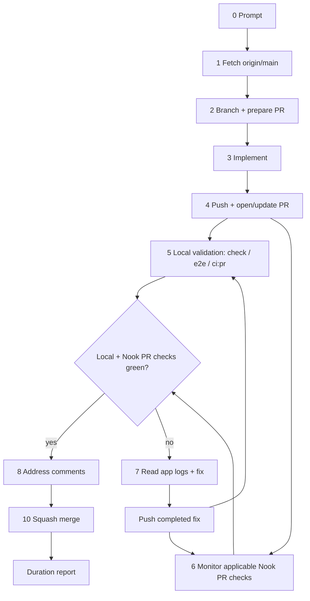

# Coding Bro — Default Agent Workflow

**System of record** for how every AI agent handles implementation tasks in this repository. The Cursor skill at [`.cursor/skills/coding-bro/SKILL.md`](../../.cursor/skills/coding-bro/SKILL.md) mirrors this doc for auto-invocation.

Use this pipeline for **every coding request** unless the user explicitly wants a read-only answer, review-only feedback, or a question with no code changes.

## PR-first mandate

AI agents must treat every implementation task as PR-bound from the start. The
first operational step is to establish the PR path: fetch `origin/main`, create
a feature branch, and plan the PR title/body/scope before editing. Open or
update the PR as soon as there is a coherent commit to show, then keep working
on that same PR branch.

Do not treat implementation as complete after local edits, a push, or a PR link.
The agent owns the loop through local validation, Nook's applicable
repository-owned PR test checks, fixes, re-pushes, comments already present,
conflict resolution, the exact-head readiness audit, and squash merge. A ready
PR must be merged without asking the user for separate authorization.

Default PR-first loop:

1. **Prepare the PR path** — fetch `origin/main`, create a feature branch, and
   decide whether this will be a draft or normal PR.
2. **Implement functionality** — make scoped changes on the feature branch with
   focused local checks while iterating.
3. **Push and create/update the PR** — once the branch has a coherent commit,
   push it and open the PR; subsequent fixes update the same PR.
4. **Preflight and validate** — run `task pr:preflight PR=<number>`, then inspect
   the path-applicable `PR / Verify and preview` and `Web research / Build and
   deploy research catalog` workflows while local validation runs.
5. **Fix Nook's red PR test checks until green** — inspect failed logs, check app
   logs for web/e2e failures, fix locally, and push the completed fix; the
   synchronize event re-evaluates the refreshed repository-owned check.
6. **Address comments already present** — reply to actionable human, Codex, and
   automated review comments with the fix, validation, or no-change rationale
   before resolving/considering them complete. Never wait for new feedback.
7. **Merge automatically when ready** — require `task pr:ready PR=<number>`, then
   squash-merge as soon as the branch is current, Nook's applicable
   repository-owned PR test checks are green, and actionable comments currently
   present are handled. Do not pause for a ready-PR handoff or separate merge
   permission.

## Testing strategy — parallel final validation

### ⛔ Push first; never serialize final validation

Once the current change is coherent and checkable, **do not run the required
local gate yet**. Commit and push/open or update the PR first. Immediately after
the push, start local validation and monitor applicable repository-owned PR
checks at the same time:

```text
WRONG: implement → task check / full tests / build → push → PR checks
RIGHT: implement → commit → push/update PR → local checks ‖ PR checks
```

This ordering applies to the first implementation and every review/CI fix.
Focused commands used to debug or make the commit coherent may run before the
push; required final gates, full suites, builds, e2e, and repeated post-fix
validation may not. If a local check fails after the push, fix it, commit and
push the complete fix immediately, then rerun local validation in parallel with
the refreshed PR workflow.

**PR GitHub Actions is elastic and developer-critical.** `pr.yml` runs on
GitHub-hosted `ubuntu-latest`. The Docker setup restores separate GitHub Actions
BuildKit cache scopes for Rust/WASM, web dependencies, and the final web image;
main refreshes the default-branch cache visible to new PRs, and follow-up pushes
reuse the PR branch cache. A failing fmt, clippy,
unit test, or e2e spec still burns a remote validation cycle, so do not use PR
CI as the primary debug loop.

**Local Docker is warm and fast.** The same Task commands reuse independently cached Rust/WASM and web image lineages on the developer machine. Local runs are **strongly preferred** for checking tests, fixing issues, and iterating.

When functionality for the current iteration is complete, **commit and push/open/update the PR before starting any required final local gate**, then immediately run the local gate while Nook's PR workflows start remotely. This is for final-validation parallelism, not half-finished work: do only focused development checks before the push, and do not merge until the latest branch has both passing local validation and green applicable repository-owned PR test checks.

**Debug e2e one spec at a time.** During a fix/debug session, do not re-run the full e2e suite after every change. Run individual specs for fast feedback:

```bash
E2E_SPEC=e2e/connect.spec.ts task web:test:e2e:file
# multiple files:
E2E_SPEC="e2e/connect.spec.ts e2e/login-unlock-flow.spec.ts" task web:test:e2e:file
```

After targeted fixes pass and the iteration is ready for final validation, push/open/update the PR, then run the PR mirror plus any relevant e2e project locally while remote CI runs (`task ci:pr`, `task web:test:e2e:pr`, or `task ci:pr:e2e`).

Default agent flow:

1. **Prepare the PR path first** — fetch `origin/main`, branch from it, and plan
   the PR title/scope before editing.
2. **Implement and iterate locally** — scoped checks as you go (`task check`, `task rust:test`, single-spec e2e via `E2E_SPEC=… task web:test:e2e:file`).
3. **Push and open/update the PR before long final local checks** — once the branch has a coherent commit, commit, push, and create/update the PR.
4. **Validate locally in parallel** — immediately run `task check` minimum and `task ci:pr` for the exact PR mirror; add `task web:test:e2e:pr` or `task ci:pr:e2e` when web/vault/sync flows change.
5. **Inspect Nook's applicable PR workflows** — inspect `PR / Verify and
   preview`, plus `Web research / Build and deploy research catalog` for
   web-research paths, while the local gate runs. Green status is necessary but
   the full readiness audit must also pass. See [code-review.md](code-review.md).
6. **On any local or Nook PR-test failure** — read **app logs** (`nook-app-logs.json` attachment,
   `fetchAppLogs`, or `/app-logs`) → fix locally (prefer single-spec e2e while
   debugging) → commit and push the completed fix → run local validation in
   parallel with the refreshed repository-owned PR test checks.
7. **Address actionable PR comments currently present** — reply with the fix,
   validation, or no-change rationale, and push any needed changes; GitHub
   events re-evaluate Nook's applicable PR test checks. Do not wait for another review cycle.
8. **Resolve conflicts and merge** — before merging, verify the PR branch is not
   stale against `origin/main`; update it and let the synchronize event
   re-evaluate Nook's applicable PR test checks if needed. After every push,
   re-run readiness, then squash-merge automatically when it passes.

Never merge until the latest pushed branch has green applicable repository-owned
PR test checks and has passed the required local gate for the change. External checks do
not affect readiness. After a Nook PR-test failure, the next push must be a
completed fix, not an exploratory checkpoint.

## Debug information — always check app logs

When investigating failures, use sources in order:

1. **Tests** — `task rust:test`, `task web:test`, e2e Playwright output.
2. **Static analysis** — `task check` (fmt, clippy, svelte-check, eslint).
3. **Persisted app logs** — **most important after 1–2.** Vault unlock, sync, WASM
   tracing, and console capture live in IndexedDB (`/app-logs`, `nook-app-logs.json`).

Do not guess from DOM or screenshots alone. See [logging.md § Debugging…](../references/logging.md#debugging-troubleshooting-and-ci-verification).

## How it works

0. **Prompt** — User gives a task description.
1. **Fetch repository** — Sync with remote before branching.
2. **Branch from `origin/main` and prepare the PR** — Never commit on `main`.
   Create a feature branch for the work and keep the PR title/body/scope in
   mind from the first implementation step.
3. **Implement** — Make the requested change. Follow [rules.md](../rules.md) and package boundaries in [ARCHITECTURE.md](../ARCHITECTURE.md).
   If part of the requested functionality is too large, risky, blocked, or out
   of scope, follow [issues.md](issues.md) before handoff: update or create the
   aggregate GitHub issue and focused sub-issues for the missing work.
4. **Push and open/update PR** — Commit and push as soon as the branch has a
   coherent implementation commit. If no PR exists, open it before starting the
   long local final gate so remote CI can run in parallel.
5. **Local validation + event-driven Nook PR checks** — Immediately run `task check`
   (or a scoped subset) and relevant e2e after arming Nook's event continuation. Prefer local
   Docker (cached images) for diagnosis and iteration; use remote CI as the
   clean-run gate. During debug, run specs one at a time with
   `E2E_SPEC=… task web:test:e2e:file`.
6. **Continue only on Nook's applicable PR events** — Evaluate `PR / Verify and
   preview`, plus `Web research / Build and deploy research catalog` when its
   paths change. Never request, poll, monitor, or
   wait for Codex, Claude, Cursor, CodeRabbit, or another external review, check,
   deployment, or service. Do not add a grace period for feedback.
   Before merging, fetch `origin/main` and verify
   GitHub does not mark the PR branch stale/out-of-date; if it is stale, merge
   `origin/main` into the PR branch and push; the synchronize event re-evaluates
   the refreshed Nook PR test checks.
7. **Fix loop on failure** — If local validation or Nook's PR test checks fail: read **app
   logs** (Playwright `nook-app-logs.json`, `fetchAppLogs`, or `/app-logs`) →
   fix → run targeted local checks while debugging → commit and push the
   completed fix → run the required local gate while monitoring refreshed CI.
8. **Address PR comments currently present** — Inspect human, Codex, and
   automated feedback that already exists; reply with the fix, validation, or
   no-change rationale, and push changes when needed; GitHub events re-evaluate
   Nook's applicable PR test checks. Never wait for new feedback or another review response.
9. **Repeat** — Return to step 7 until Nook's applicable PR test checks are green and the
    actionable comments currently present are handled.
10. **Squash merge** — run `gh pr merge <n> --squash` immediately after the
    readiness audit succeeds. Report task duration after the merge.



## Commands

### 1 — Fetch

```bash
git fetch origin main
```

### 2 — Branch

```bash
git checkout -b <branch-name> origin/main
```

Use a descriptive branch name (`feat/…`, `fix/…`, `chore/…`).

### 4–6 — Push, validate locally, and monitor remotely

**Why push before the long final gate:** GitHub Actions runners download Docker
images and run the full prepared test set from scratch every time. Locally, the
Rust/WASM and web lineages are **already cached** — the same gates finish much faster. Use
local Task commands for implementation/debug loops. Once the current iteration is
functionally complete, commit and push/open/update the PR, then run the local
final gate immediately while remote CI runs.

Never request or wait for Codex or another external reviewer. Automatic reviews
may produce useful comments, but their absence, pending state, or failure is not
a gate. Follow [code-review.md](code-review.md) for handling findings that
already exist.

**Minimum local final gate** (must finish before merge or handoff):

```bash
task format:check    # or task format after edits
task check           # fmt, lint, unit tests, web build
```

Scoped subsets when the touch surface is narrow:

```bash
task web:check && task web:test    # web-only
task rust:test                     # nook-core + nook-auth2 only
task extension:check:fast          # host-cached extension security/build checks
```

**E2e during fix/debug — one spec at a time.** Do not wait for the full suite while iterating. Run the failing or touched spec only:

```bash
E2E_SPEC=e2e/connect.spec.ts task web:test:e2e:file
E2E_SPEC=e2e/multi-device-local.spec.ts task web:test:e2e:file
```

After single-spec fixes pass and the iteration is functionally complete, push the
branch/PR and run the relevant project or full PR mirror while remote CI runs:

```bash
task web:test:e2e                # full local-provider e2e project
task ci:pr:e2e                   # explicit full web + extension e2e
task ci:pr                       # PR mirror without browser e2e; mandatory after a prior PR CI failure
```

```text
implement → fix → E2E_SPEC=… task web:test:e2e:file   (fast debug loop)
           → commit → push → gh pr create/update        (final-validation boundary)
           → task check / web:test:e2e / task ci:pr     (parallel with remote CI)
```

Add `task web:test:e2e` or `task ci:pr:e2e` to the parallel local gate when the
change touches vault sync, login/unlock, multi-step web flows, or Playwright
helpers. Skip e2e for isolated Rust-only or docs-only changes.

### 8 — Full local loop (after any remote CI failure)

**Mandatory after every red remote build before merge/handoff:**

```bash
gh run view <run-id> --log-failed   # CI job output
# For e2e failures: read nook-app-logs.json from the Playwright report, or locally:
# E2E_SPEC=e2e/<spec>.spec.ts task web:test:e2e:file  then fetchAppLogs / /app-logs
task ci:pr                          # full PR mirror (no browser e2e)
task pr:ready PR=<number>           # read-only exact-head readiness assertion
```

`task ci:pr` matches `pr.yml` gates (minus Cloudflare deploy) and intentionally excludes browser e2e. The automatic full browser gate is main-only (`task ci:main`).

E2e helpers when debugging web flows:

```bash
# One spec — preferred during fix/debug (fast feedback)
E2E_SPEC=e2e/connect.spec.ts task web:test:e2e:file

# Full stub e2e project — final local gate or after remote e2e failure
task web:test:e2e
# or, after task check already built wasm + dist:
task web:test:e2e:parallel
```

If the failure was obviously fmt/lint-only, `task format:check` plus the relevant
lint/test subset can prove the fix. For broader failures, use `task ci:pr` as
the local gate after pushing the completed fix, and do not merge or hand off
until the latest head has both local and remote green.

See [pull-requests.md § Local checks](pull-requests.md#5-local-checks) and [ci-pipeline.md § Local vs remote CI](ci-pipeline.md#local-vs-remote-ci).

### 5–7 — Push, open PR, monitor

Push once the current iteration is functionally complete and ready for final
validation. Then run the local gate immediately while monitoring remote CI.
Include scoped e2e or `task ci:pr:e2e` when the touch surface warrants it (see step
5).

```bash
git push -u origin HEAD
gh pr create --title "…" --body "…"
task pr:preflight PR=<number>
```

Before every merge attempt, verify the PR branch is current with the latest base
branch. Green applicable Nook PR test checks on an out-of-date branch are not enough: GitHub may
still block merge with an "Update branch" requirement, `mergeStateStatus:
BLOCKED`, or a stale required-check result until `main` has been merged into the
PR branch. When a green PR cannot merge, treat stale `main` as
the first thing to prove or fix before investigating other branch rules.

```bash
git fetch origin main
git rev-list --left-right --count HEAD...origin/main
gh pr view <number> --json mergeStateStatus,baseRefOid,headRefOid,statusCheckRollup
# If the branch is behind origin/main:
git merge origin/main --no-edit
git push origin HEAD
task pr:ready PR=<number>
```

### 11 — Merge

When Nook's applicable repository-owned PR test checks pass and `task pr:ready`
succeeds on the current head:

```bash
gh pr merge <number> --squash
```

Squash merge only. See [rules.md §6](../rules.md#6-git--pull-request-workflow).

## CI fix PRs (nightly failures only)

When [`e2e-nightly.yml`](../../.github/workflows/e2e-nightly.yml) fails, the **`ci-fix`** job runs the Cursor SDK agent and opens a fix PR for normal review. It never merges the PR automatically. Main-branch failures remain visible for manual handling. The nightly path uses the repository secret **`NOOK_GITHUB_PAT`** (your GitHub PAT), not the default `GITHUB_TOKEN`, so the PR is opened as you and `pr.yml` triggers. See [ci-pipeline.md § CI agent](ci-pipeline.md#ci-agent-ci-fix-job).

## Non-negotiables

- **Never push directly to `main`.** Branch → PR → squash merge.
- **Never stop after push.** Monitor Nook's applicable PR test checks through
  squash merge, fixing failures, comments, and conflicts along the way.
- **Prefer local Docker over remote CI for iteration** — cached images, faster feedback; push at the final-validation boundary, then run local validation while Nook's applicable PR test checks run.
- **During e2e debug, run one spec at a time** (`E2E_SPEC=… task web:test:e2e:file`) — do not re-run the full suite after every fix.
- **Use persisted app logs for e2e analysis** — read `nook-app-logs.json`, call
  `fetchAppLogs`, or open `/app-logs`; see [logging.md](../references/logging.md).
- **Never merge after a Nook PR-test failure without green local validation on the latest head** (`task ci:pr` for broad failures; a matching subset is enough for trivial fmt/lint).
- **Never merge on checks alone.** Require the exact-head `task pr:ready` audit;
  once it succeeds, the task-owning agent must squash-merge without asking
  again. Workflows do not blindly merge based on a check event.
- **Never wait for external reviews or checks.** Codex reviews are not required.
  Monitor only Nook's applicable repository-owned PR test checks; address actionable comments
  that already exist, then proceed without waiting for another service response.
- **Never kill the Docker daemon** — only stop containers. See [rules.md §5](../rules.md#docker-daemon--never-kill-it).
- **Never hide deferred scope** — if requested functionality is not fully
  implemented because it is large, risky, blocked, or out of scope, manage it in
  GitHub issues first. See [issues.md](issues.md).
- **Duration report** on every completed implementation task. See [pull-requests.md §9](pull-requests.md#9-task-completion-report).

## Related docs

- [pull-requests.md](pull-requests.md) — squash merge policy, detailed agent pipeline, CLI reference
- [issues.md](issues.md) — aggregate issue and sub-issue management for deferred scope
- [ci-pipeline.md](ci-pipeline.md) — GitHub Actions workflow map
- [monorepo.md](monorepo.md) — cross-package change checklist (runs inside step 3)
