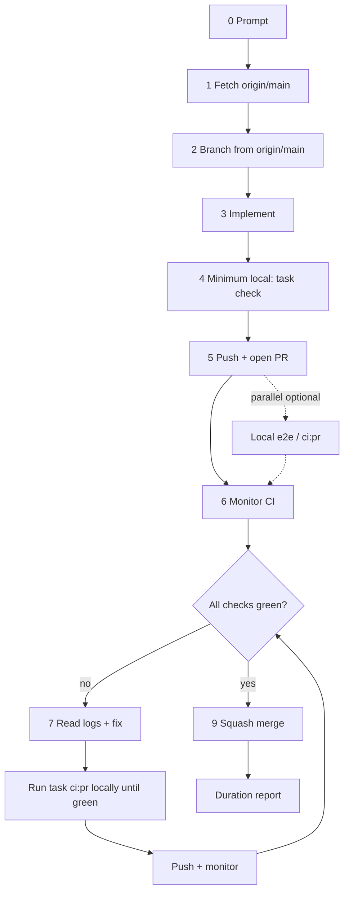

# Coding Bro — Default Agent Workflow

**System of record** for how every AI agent handles implementation tasks in this repository. The Cursor skill at [`.cursor/skills/coding-bro/SKILL.md`](../../.cursor/skills/coding-bro/SKILL.md) mirrors this doc for auto-invocation.

Use this pipeline for **every coding request** unless the user explicitly wants a read-only answer, review-only feedback, or a question with no code changes.

## Testing strategy (performance)

Remote PR CI often takes **5+ minutes** plus queue time. Full local `task ci:pr` takes ~3–4 minutes. The default strategy optimizes wall-clock time:

1. **First push** — run **minimum** local checks only (`task check` or a scoped subset). Push and open the PR without waiting for full PR CI locally.
2. **Monitor** — watch remote checks. Optionally start e2e or `task ci:pr` in parallel with the first push (non-blocking).
3. **On any remote failure** — read logs, fix, then run the **full** local PR mirror (`task ci:pr`). Re-run locally until green; only then push again.
4. **Repeat** — if the PR fails again, return to step 3 (full local loop before every retry push).
5. **Merge** — squash merge only when **every** remote check is green.

Never push twice in a row after a remote red build without a passing `task ci:pr` locally first.

## How it works

0. **Prompt** — User gives a task description.
1. **Fetch repository** — Sync with remote before branching.
2. **Branch from `origin/main`** — Never commit on `main`. Create a feature branch for the work.
3. **Implement** — Make the requested change. Follow [rules.md](../rules.md) and package boundaries in [ARCHITECTURE.md](../ARCHITECTURE.md).
4. **Minimum local checks** — Run `task check` (or a scoped subset) before the first push. Do **not** block on `task ci:pr` here — remote CI is the first full gate.
5. **Push and open PR** — Commit and push as soon as minimum checks pass. Open the PR immediately; optionally start e2e or `task ci:pr` in parallel (non-blocking).
6. **Monitor CI** — Watch remote checks until every required job finishes.
7. **Fix loop on failure** — If CI fails: read logs → fix → run `task ci:pr` locally → fix → re-run `task ci:pr` until green → commit → push → monitor again.
8. **Repeat** — Return to step 7 until every remote check is green.
9. **Squash merge and report** — `gh pr merge <n> --squash` when green; report task duration.



## Commands

### 1 — Fetch

```bash
git fetch origin main
```

### 2 — Branch

```bash
git checkout -b <branch-name> origin/main
```

Use a descriptive branch name (`feat/…`, `fix/…`, `chore/…`).

### 4 — Minimum local checks (before first push)

**Minimum before every push** (must finish before push):

```bash
task format:check    # or task format after edits
task check           # fmt, lint, unit tests, web build
```

Scoped subsets when the touch surface is narrow:

```bash
task web:check && task web:test    # web-only
task rust:test                     # nook-core only
```

**Push in parallel with long checks.** After minimum checks pass and changes are committed, push and open the PR **immediately**. Start e2e or full PR CI locally in the same turn if useful — do not block push on them. Remote CI (~3–4 min) and local e2e overlap; waiting for local e2e before push adds wall time with no benefit when PR CI will run the same gates anyway.

```text
commit → push → gh pr create     (as soon as task check / scoped subset is green)
     ‖
task web:test:e2e:pr             (optional, same turn, non-blocking)
task ci:pr                       (optional before push; mandatory after a prior CI failure)
```

Skip e2e before the first push unless debugging or the change is high-risk (vault sync, login/unlock, multi-step web flows).

### 7 — Full local loop (after any remote CI failure)

**Mandatory before every push that follows a red remote build:**

```bash
gh run view <run-id> --log-failed   # diagnose
task ci:pr                          # full PR mirror (~3–4 min)
# fix, re-run task ci:pr until green, then commit and push
gh pr checks <number> --watch
```

`task ci:pr` matches `pr.yml` gates (`task ci:pr:publish` minus toolchain push and Cloudflare deploy).

E2e helpers when debugging web flows:

```bash
task web:test:e2e:pr
# or, after task check already built wasm + dist:
task web:test:e2e:pr:parallel
```

If the failure was obviously fmt/lint-only, `task format:check` plus the relevant lint/test subset can unblock a quick fix — but **never push twice in a row** without escalating to `task ci:pr` after the first remote red build.

See [pull-requests.md § Local checks](pull-requests.md#2-local-checks-before-every-push) and [ci-pipeline.md § Local vs remote CI](ci-pipeline.md#local-vs-remote-ci).

### 5–6 — Push, open PR, monitor

Push as soon as minimum local checks pass — do not wait for e2e or full `task ci:pr` unless recovering from a prior CI failure.

```bash
git push -u origin HEAD
gh pr create --title "…" --body "…"
gh pr checks <number> --watch
```

### 9 — Merge

When all checks pass and the user asked to merge (or the task implies merge-on-green):

```bash
gh pr merge <number> --squash
```

Squash merge only. See [rules.md §6](../rules.md#6-git--pull-request-workflow).

## Non-negotiables

- **Never push directly to `main`.** Branch → PR → squash merge.
- **Never stop after push.** Monitor CI through merge or explicit handoff.
- **Never push after remote failure without a green `task ci:pr` locally** (unless the failure was trivial fmt/lint and you verified with the matching subset).
- **Never kill the Docker daemon** — only stop containers. See [rules.md §5](../rules.md#docker-daemon--never-kill-it).
- **Duration report** on every completed implementation task. See [pull-requests.md §8](pull-requests.md#8-task-completion-report).

## Related docs

- [pull-requests.md](pull-requests.md) — squash merge policy, detailed agent pipeline, CLI reference
- [ci-pipeline.md](ci-pipeline.md) — GitHub Actions workflow map
- [monorepo.md](monorepo.md) — cross-package change checklist (runs inside step 3)
