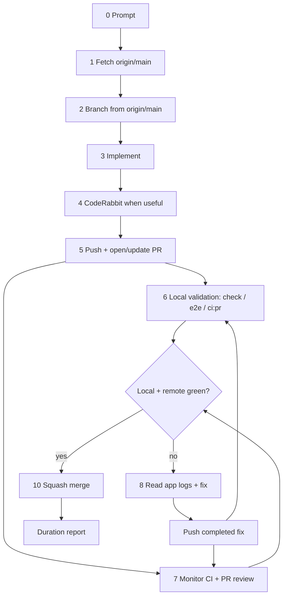

# Coding Bro — Default Agent Workflow

**System of record** for how every AI agent handles implementation tasks in this repository. The Cursor skill at [`.cursor/skills/coding-bro/SKILL.md`](../../.cursor/skills/coding-bro/SKILL.md) mirrors this doc for auto-invocation.

Use this pipeline for **every coding request** unless the user explicitly wants a read-only answer, review-only feedback, or a question with no code changes.

## Testing strategy — parallel final validation

**GitHub Actions is slow and cold.** Every run starts from scratch on a fresh runner: pull the toolchain Docker image, build wasm/web, run the full prepared test set (`task ci:pr` on PRs). Expect **5+ minutes** per run plus queue time. A failing fmt, clippy, unit test, or e2e spec burns that entire cycle — do not use remote CI as the primary debug loop.

**Local Docker is warm and fast.** The same Task commands run against **cached** toolchain images on the developer machine. Local runs are **strongly preferred** for checking tests, fixing issues, and iterating.

When functionality for the current iteration is complete, **commit and push/open/update the PR before starting the long final local gate**, then immediately run the local gate while GitHub Actions starts remotely. This is for final-validation parallelism, not half-finished work: do scoped local checks while implementing, push only when the iteration is ready for final validation, and do not merge until the latest branch has both passing local validation and green remote checks.

**Debug e2e one spec at a time.** During a fix/debug session, do not re-run the full e2e suite after every change. Run individual specs for fast feedback:

```bash
E2E_SPEC=e2e/connect.spec.ts task web:test:e2e:file
# multiple files:
E2E_SPEC="e2e/connect.spec.ts e2e/login-unlock-flow.spec.ts" task web:test:e2e:file
```

After targeted fixes pass and the iteration is ready for final validation, push/open/update the PR, then run the relevant project or full PR mirror locally while remote CI runs (`task web:test:e2e:pr`, `task ci:pr`).

Default agent flow:

1. **Implement and iterate locally** — scoped checks as you go (`task check`, `task rust:test`, single-spec e2e via `E2E_SPEC=… task web:test:e2e:file`).
2. **Run CodeRabbit when it adds signal** — for nontrivial agent-authored changes, run `coderabbit review --agent --type uncommitted`, fix valid `critical`/`major` findings, and re-run once after meaningful fixes. See [coderabbit.md](coderabbit.md).
3. **Push before long final local checks** — once the iteration is functionally complete, commit, push, and open/update the PR.
4. **Validate locally in parallel** — immediately run `task check` minimum; add `task web:test:e2e:pr` or `task ci:pr` when web/vault/sync flows change.
5. **Monitor remote CI and PR review in parallel** — watch checks on the PR while local validation runs; use CodeRabbit PR commands from [coderabbit.md](coderabbit.md) when a refreshed GitHub-side review is useful after new commits.
6. **On any local or remote failure** — read **app logs** (`nook-app-logs.json` attachment,
   `fetchAppLogs`, or `/app-logs`) → fix locally (prefer single-spec e2e while
   debugging) → commit and push the completed fix → run local validation in
   parallel with the refreshed remote checks.
7. **Merge** — before merging, verify the PR branch is not stale against
   `origin/main`; update it and re-watch CI if needed. Squash merge only when
   **every** remote check is green on the updated branch.

Never merge until the latest pushed branch is green remotely and has passed the
required local gate for the change. After a remote red build, the next push must
be a completed fix, not an exploratory checkpoint.

## Debug information — always check app logs

When investigating failures, use sources in order:

1. **Tests** — `task rust:test`, `task web:test`, e2e Playwright output.
2. **Static analysis** — `task check` (fmt, clippy, svelte-check, eslint).
3. **Persisted app logs** — **most important after 1–2.** Vault unlock, sync, WASM
   tracing, and console capture live in IndexedDB (`/app-logs`, `nook-app-logs.json`).

Do not guess from DOM or screenshots alone. See [logging.md § Debugging…](../references/logging.md#debugging-troubleshooting-and-ci-verification).

## How it works

0. **Prompt** — User gives a task description.
1. **Fetch repository** — Sync with remote before branching.
2. **Branch from `origin/main`** — Never commit on `main`. Create a feature branch for the work.
3. **Implement** — Make the requested change. Follow [rules.md](../rules.md) and package boundaries in [ARCHITECTURE.md](../ARCHITECTURE.md).
   If part of the requested functionality is too large, risky, blocked, or out
   of scope, follow [issues.md](issues.md) before handoff: update or create the
   aggregate GitHub issue and focused sub-issues for the missing work.
4. **CodeRabbit review when useful** — For nontrivial agent-authored code, run `coderabbit review --agent --type uncommitted` before final validation. Fix valid high-severity findings and do not let CodeRabbit override `.cortex`, tests, or repo architecture. See [coderabbit.md](coderabbit.md).
5. **Push and open/update PR** — Commit and push when the iteration is ready for
   final validation. If no PR exists, open it before starting the long local
   final gate so remote CI can run in parallel.
6. **Local validation + remote monitoring** — Immediately run `task check` (or a
   scoped subset) and relevant e2e while watching the PR checks. Prefer local
   Docker (cached images) for diagnosis and iteration; use remote CI as the
   clean-run gate. During debug, run specs one at a time with
   `E2E_SPEC=… task web:test:e2e:file`.
7. **Monitor CI and PR review** — Watch remote checks until every required job
   finishes. If an agent pushes new commits and CodeRabbit's GitHub-side review
   needs a refresh, post `@coderabbitai review` (focused) or `@coderabbitai full
   review` (large rewrite). Before merging, fetch `origin/main` and verify
   GitHub does not mark the PR branch stale/out-of-date; if it is stale, merge
   `origin/main` into the PR branch, push, and re-watch the refreshed
   checks/deployment gate.
8. **Fix loop on failure** — If local or remote validation fails: read **app
   logs** (Playwright `nook-app-logs.json`, `fetchAppLogs`, or `/app-logs`) →
   fix → run targeted local checks while debugging → commit and push the
   completed fix → run the required local gate while monitoring refreshed CI.
9. **Repeat** — Return to step 8 until every remote check is green.
10. **Squash merge and report** — `gh pr merge <n> --squash` when green; report task duration.



## Commands

### 1 — Fetch

```bash
git fetch origin main
```

### 2 — Branch

```bash
git checkout -b <branch-name> origin/main
```

Use a descriptive branch name (`feat/…`, `fix/…`, `chore/…`).

### 4 — CodeRabbit review (when useful)

CodeRabbit is a second-pass AI reviewer, not a required build gate. For
nontrivial code changes authored by an agent, run it before final validation:

```bash
coderabbit review --agent --type uncommitted
```

Fix valid `critical` and `major` findings, consider behaviorally meaningful
`minor` findings, then re-run once after substantial fixes. Skip it for trivial
docs/mechanical changes or when auth/rate limits block it; report that decision
in the handoff. Full rules: [coderabbit.md](coderabbit.md).

### 5–7 — Push, validate locally, and monitor remotely

**Why push before the long final gate:** GitHub Actions runners download Docker
images and run the full prepared test set from scratch every time. Locally,
toolchain images are **already cached** — the same gates finish much faster. Use
local Task commands for implementation/debug loops. Once the current iteration is
functionally complete, commit and push/open/update the PR, then run the local
final gate immediately while remote CI runs.

**Minimum local final gate** (must finish before merge or handoff):

```bash
task format:check    # or task format after edits
task check           # fmt, lint, unit tests, web build
```

Scoped subsets when the touch surface is narrow:

```bash
task web:check && task web:test    # web-only
task rust:test                     # nook-core + nook-auth only
```

**E2e during fix/debug — one spec at a time.** Do not wait for the full suite while iterating. Run the failing or touched spec only:

```bash
E2E_SPEC=e2e/connect.spec.ts task web:test:e2e:file
E2E_SPEC=e2e/multi-device-local.spec.ts task web:test:e2e:file
```

After single-spec fixes pass and the iteration is functionally complete, push the
branch/PR and run the relevant project or full PR mirror while remote CI runs:

```bash
task web:test:e2e                # full local-provider e2e project
task ci:pr                       # full PR mirror; mandatory after a prior CI failure
```

```text
implement → fix → E2E_SPEC=… task web:test:e2e:file   (fast debug loop)
           → commit → push → gh pr create/update        (final-validation boundary)
           → task check / web:test:e2e / task ci:pr     (parallel with remote CI)
```

Add `task web:test:e2e` or `task ci:pr` to the parallel local gate when the
change touches vault sync, login/unlock, multi-step web flows, or Playwright
helpers. Skip e2e for isolated Rust-only or docs-only changes.

### 8 — Full local loop (after any remote CI failure)

**Mandatory after every red remote build before merge/handoff:**

```bash
gh run view <run-id> --log-failed   # CI job output
# For e2e failures: read nook-app-logs.json from the Playwright report, or locally:
# E2E_SPEC=e2e/<spec>.spec.ts task web:test:e2e:file  then fetchAppLogs / /app-logs
task ci:pr                          # full PR mirror
# fix, push the completed fix, and run the local gate while CI refreshes
gh pr checks <number> --watch
```

`task ci:pr` matches `pr.yml` gates (minus Cloudflare deploy). Toolchain publish is main-only (`task ci:main:publish`).

E2e helpers when debugging web flows:

```bash
# One spec — preferred during fix/debug (fast feedback)
E2E_SPEC=e2e/connect.spec.ts task web:test:e2e:file

# Full stub e2e project — final local gate or after remote e2e failure
task web:test:e2e
# or, after task check already built wasm + dist:
task web:test:e2e:parallel
```

If the failure was obviously fmt/lint-only, `task format:check` plus the relevant
lint/test subset can prove the fix. For broader failures, use `task ci:pr` as
the local gate after pushing the completed fix, and do not merge or hand off
until the latest head has both local and remote green.

See [pull-requests.md § Local checks](pull-requests.md#4-local-checks) and [ci-pipeline.md § Local vs remote CI](ci-pipeline.md#local-vs-remote-ci).

### 5–7 — Push, open PR, monitor

Push once the current iteration is functionally complete and ready for final
validation. Then run the local gate immediately while monitoring remote CI.
Include scoped e2e or `task ci:pr` when the touch surface warrants it (see step
5).

```bash
git push -u origin HEAD
gh pr create --title "…" --body "…"
gh pr checks <number> --watch
```

Before merge, verify the PR branch is current with the base branch. A green
check set on an out-of-date branch is not enough: GitHub may still block merge
or required deployments until `main` has been merged into the PR branch.

```bash
git fetch origin main
git rev-list --left-right --count HEAD...origin/main
gh pr view <number> --json mergeStateStatus,baseRefOid,headRefOid,statusCheckRollup
# If the branch is behind origin/main:
git merge origin/main --no-edit
git push origin HEAD
gh pr checks <number> --watch
```

### 10 — Merge

When all checks pass and the user asked to merge (or the task implies merge-on-green):

```bash
gh pr merge <number> --squash
```

Squash merge only. See [rules.md §6](../rules.md#6-git--pull-request-workflow).

## CI auto-fix (main / nightly failures)

When [`main.yml`](../../.github/workflows/main.yml) or [`e2e-nightly.yml`](../../.github/workflows/e2e-nightly.yml) fails, the **`ci-fix`** job runs the Cursor SDK agent, opens a fix PR, waits for checks, and squash-merges. That path uses the repository secret **`NOOK_GITHUB_PAT`** (your GitHub PAT), not the default `GITHUB_TOKEN`, so the PR is opened as you — `pr.yml` triggers and you are not stuck approving a `github-actions[bot]` PR. See [ci-pipeline.md § CI agent](ci-pipeline.md#ci-agent-ci-fix-job).

## Non-negotiables

- **Never push directly to `main`.** Branch → PR → squash merge.
- **Never stop after push.** Monitor CI through merge or explicit handoff.
- **Prefer local Docker over remote CI for iteration** — cached images, faster feedback; push at the final-validation boundary, then run local and remote checks in parallel.
- **During e2e debug, run one spec at a time** (`E2E_SPEC=… task web:test:e2e:file`) — do not re-run the full suite after every fix.
- **Use persisted app logs for e2e analysis** — read `nook-app-logs.json`, call
  `fetchAppLogs`, or open `/app-logs`; see [logging.md](../references/logging.md).
- **Never merge after remote failure without green local validation on the latest head** (`task ci:pr` for broad failures; a matching subset is enough for trivial fmt/lint).
- **Never kill the Docker daemon** — only stop containers. See [rules.md §5](../rules.md#docker-daemon--never-kill-it).
- **Never hide deferred scope** — if requested functionality is not fully
  implemented because it is large, risky, blocked, or out of scope, manage it in
  GitHub issues first. See [issues.md](issues.md).
- **Duration report** on every completed implementation task. See [pull-requests.md §9](pull-requests.md#9-task-completion-report).

## Related docs

- [pull-requests.md](pull-requests.md) — squash merge policy, detailed agent pipeline, CLI reference
- [issues.md](issues.md) — aggregate issue and sub-issue management for deferred scope
- [ci-pipeline.md](ci-pipeline.md) — GitHub Actions workflow map
- [monorepo.md](monorepo.md) — cross-package change checklist (runs inside step 3)
