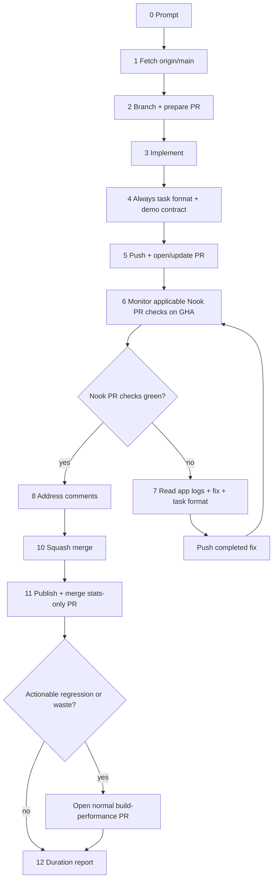

# Coding Bro — Default Agent Workflow

**System of record** for how every AI agent handles implementation tasks in this repository. The Cursor skill at [`.cursor/skills/coding-bro/SKILL.md`](../../.cursor/skills/coding-bro/SKILL.md) mirrors this doc for auto-invocation.

Use this pipeline for **every coding request** unless the user explicitly wants a read-only answer, review-only feedback, or a question with no code changes.

## PR-first mandate

AI agents must treat every implementation task as PR-bound from the start. The
first operational step is to establish the PR path: fetch `origin/main`, create
a feature branch, and plan the PR title/body/scope before editing. Open or
update the PR as soon as there is a coherent commit to show, then keep working
on that same PR branch.

Do not treat implementation as complete after local edits, a push, or a PR link.
The agent owns the loop through Nook's applicable repository-owned PR test
checks on **GitHub Actions**, fixes, re-pushes, comments already present,
conflict resolution, the exact-head readiness audit, and squash merge. A ready
PR must be merged without asking the user for separate authorization.

Default PR-first loop:

1. **Prepare the PR path** — fetch `origin/main`, create a feature branch, and
   decide whether this will be a draft or normal PR.
2. **Implement functionality** — make scoped changes on the feature branch.
3. **Push and create/update the PR** — once the branch has a coherent formatted
   commit, push it and open the PR; subsequent fixes update the same PR.
4. **Preflight and validate on GitHub Actions** — run
   `task pr:preflight PR=<number>`, then monitor the path-applicable
   `PR / Verify and preview` and `Web research / Build and deploy research
   catalog` workflows. PRs fixing a failure observed on `main` must have the
   `ci:full-e2e` label so the `PR` workflow also runs the Main-equivalent browser
   suite before merge. Do **not** run a required local `task check` / `task ci:pr`.
5. **Fix Nook's red PR test checks until green** — inspect failed logs, check app
   logs for web/e2e failures, fix, `task format`, and push the completed fix; the
   synchronize event re-evaluates the refreshed repository-owned check. This
   includes Knip unused findings, jscpd clone/duplicate findings, and every
   other mechanical gate — fix the code, do not silence the check.
6. **Settle existing review feedback** — inspect the current comments and
   reviews, reply to every actionable human or automated finding, and resolve
   each thread. Do not request or wait for optional reviewers.
7. **Merge automatically when ready** — require `task pr:ready PR=<number>`, then
   squash-merge as soon as the branch is current, Nook's applicable
   repository-owned PR test checks are green and all actionable comments are
   resolved. Do not pause for a ready-PR handoff or separate merge
   permission.

## Testing strategy — GitHub Actions only

### ⛔ Pre-push hygiene — always format (the only required local action)

Before every push, run host-applied formatting **unconditionally**. Do not skip
it for "tiny" edits. Sealed Docker images never write the host tree; only
`task format` applies the format diff to the files you will commit.

**`task format` is the only required local product action.** Do not run
`task check`, `task ci:pr`, full suites, builds, or e2e as a merge/handoff gate.
Those run exclusively on GitHub Actions.

```bash
task format          # sealed format + apply to host (always)
git add -u
# If UI / shared / extension src paths changed vs origin/main:
git fetch origin main
.github/scripts/ui-demo-contract.sh "$(git rev-parse origin/main)"
```

Never use `task extension:format` alone before push — it formats inside the
sealed image and discards the result. See
[pre-push-hygiene.md](../dynamic-skills/pre-push-hygiene.md).

### ⛔ Format, push, trust GitHub Actions

Once the current change is coherent and checkable, run pre-push hygiene, then
commit and push/open or update the PR. Immediately after the push, monitor
applicable repository-owned PR checks. Do **not** start a required local product
gate in parallel:

```text
WRONG: implement → task check / full tests / build → push → PR checks
WRONG: implement → push (unformatted / missing demo) → Verify fails → re-push
WRONG: implement → task format → push → task check ‖ PR checks   (local product gate forbidden)
RIGHT: implement → task format (+ ui-demo-contract when UI) → commit → push → GitHub Actions
```

This ordering applies to the first implementation and every review/CI fix.
Required pre-push hygiene (`task format`, and the UI demo contract when UI paths
change) always runs before the push. Optional focused commands used to debug or
make the commit coherent may also run before the push; required product gates,
full suites, builds, e2e, and repeated post-fix validation must run on GitHub
Actions after the push. If Actions fails, fix it, run `task format` again, commit
and push the complete fix immediately, then wait for the refreshed PR workflow.

**PR GitHub Actions is the sole product validation pipeline.** `pr.yml` runs on
GitHub-hosted `ubuntu-latest` and every result is bound to the pushed PR head.
Once a coherent change is ready, push immediately to trigger or refresh these
checks; do not postpone the push for a local product gate, benchmark, PR metadata
edit, or other optional follow-up. The Docker setup restores separate GitHub Actions
BuildKit cache scopes for Rust/WASM, web dependencies, and the final web image;
main refreshes the default-branch cache visible to new PRs, and follow-up pushes
reuse the PR branch cache. A failing fmt, clippy,
unit test, or e2e spec still burns a remote validation cycle, so unconditional
`task format` before push exists specifically to stop the most common avoidable
Verify failures.

**Local Task commands are optional debug tools only.** Agents may use scoped
commands (`task rust:test`, `E2E_SPEC=… task web:test:e2e:file`) while
investigating a red remote finding, but those runs are never a merge requirement
and must not delay the next completed-fix push. See
[github-actions-only-validation.md](../dynamic-skills/github-actions-only-validation.md).

**Debug e2e one spec at a time (optional).** During a fix/debug session, do not
re-run the full e2e suite after every change. If you choose a local repro, run
individual specs:

```bash
E2E_SPEC=e2e/connect.spec.ts task web:test:e2e:file
# multiple files:
E2E_SPEC="e2e/connect.spec.ts e2e/login-unlock-flow.spec.ts" task web:test:e2e:file
```

After targeted fixes, `task format`, push/open/update the PR, and let remote CI
be the validation gate. Do not require `task ci:pr` or full local e2e before
merge.

Default agent flow:

1. **Prepare the PR path first** — fetch `origin/main`, branch from it, and plan
   the PR title/scope before editing.
2. **Implement** — optional scoped debug commands only when useful.
3. **Pre-push hygiene** — always `task format` (host-applied); when UI paths
   change, pass `.github/scripts/ui-demo-contract.sh` against `origin/main`.
4. **Push and open/update the PR** — once the branch has a coherent formatted
   commit, commit, push, and create/update the PR.
5. **Validate on GitHub Actions** — monitor `PR / Verify and preview`, plus
   `Web research / Build and deploy research catalog` for web-research paths.
   Green status is necessary but the full readiness audit must also pass. See
   [code-review.md](code-review.md).
6. **On any Nook PR-test failure** — read **app logs** (`nook-app-logs.json`
   attachment, `fetchAppLogs`, or `/app-logs`) → fix → `task format` → commit
   and push the completed fix → monitor the refreshed repository-owned PR test
   checks. Optional single-spec local repro is allowed; required local product
   gates are not.
7. **Address actionable PR comments currently present** — reply with the fix,
   validation, or no-change rationale, and push any needed changes; GitHub
   events re-evaluate Nook's applicable PR test checks. Do not wait for another review cycle.
8. **Resolve conflicts and merge** — before merging, verify the PR branch is not
   stale against `origin/main`; update it and let the synchronize event
   re-evaluate Nook's applicable PR test checks if needed. After every push,
   re-run readiness, then squash-merge automatically when it passes.

Never merge until the latest pushed branch has green applicable repository-owned
PR test checks. External checks do not affect readiness. After a Nook PR-test
failure, the next push must be a completed fix, not an exploratory checkpoint.

## Debug information — always check app logs

When investigating failures, use sources in order:

1. **GitHub Actions / test output** — failed job logs, Playwright report,
   optional local `task rust:test` / single-spec e2e when reproducing.
2. **Static analysis findings from CI** — fmt, clippy, svelte-check, eslint, Knip
   unused, jscpd clones/duplicates, prettier (surfaced by `pr.yml` / Verify).
3. **Persisted app logs** — **most important after 1–2.** Vault unlock, sync, WASM
   tracing, and console capture live in IndexedDB (`/app-logs`, `nook-app-logs.json`).

Every failing finding in step 1–2 must be fixed in the same task (delete/wire
dead code, extract shared code for clones, correct types/lints/tests). Do not
raise Knip/jscpd thresholds or ignore authored sources to make the gate pass.
See [quality.md § Fix check findings](quality.md#fix-check-findings--not-silence-them).

Do not guess from DOM or screenshots alone. See [logging.md § Debugging…](../references/logging.md#debugging-troubleshooting-and-ci-verification).

## How it works

0. **Prompt** — User gives a task description.
1. **Fetch repository** — Sync with remote before branching.
2. **Branch from `origin/main` and prepare the PR** — Never commit on `main`.
   Create a feature branch for the work and keep the PR title/body/scope in
   mind from the first implementation step.
3. **Implement** — Make the requested change. Follow [rules.md](../rules.md) and package boundaries in [ARCHITECTURE.md](../ARCHITECTURE.md).
   If part of the requested functionality is too large, risky, blocked, or out
   of scope, follow [issues.md](issues.md) before handoff: update or create the
   aggregate GitHub issue and focused sub-issues for the missing work.
4. **Pre-push hygiene** — Always run `task format` (host-applied). When UI-facing
   paths change, pass the UI demo contract against `origin/main`. Stage the
   applied format diff before committing. Do not run a required local product gate.
5. **Push and open/update PR** — Commit and push as soon as the branch has a
   coherent formatted implementation commit. If no PR exists, open it so remote
   CI can start immediately.
6. **Event-driven Nook PR checks** — Monitor `PR / Verify and preview`, plus
   `Web research / Build and deploy research catalog` when its paths change.
   Inspect any feedback already present, but never request or wait for Codex,
   Claude, Cursor, CodeRabbit, or another optional external review/check/service.
   Before merging, fetch `origin/main` and verify GitHub does not mark the PR
   branch stale/out-of-date; if it is stale, merge `origin/main` into the PR
   branch and push; the synchronize event re-evaluates the refreshed Nook PR
   test checks.
7. **Fix loop on failure** — If Nook's PR test checks fail: read **app logs**
   (Playwright `nook-app-logs.json`, `fetchAppLogs`, or `/app-logs`) → fix →
   `task format` → optional targeted local repro while debugging → commit and
   push the completed fix → monitor refreshed CI. Do not require `task ci:pr`
   or `task check` before the next push or merge.
8. **Address and resolve PR comments** — Inspect human, Codex, and automated
   feedback; reply with the fix, validation, or no-change rationale, resolve the
   targeted thread, and push changes when needed.
9. **Repeat** — Return to step 7 until Nook's applicable PR checks are green and
    every actionable comment is resolved.
10. **Squash merge** — run `gh pr merge <n> --squash` immediately after the
    readiness audit succeeds.
11. **Publish and analyze statistics** — write
    `.stats/ai-agent/<n>.yaml`, compare it with one or two recent comparable PRs,
    publish it in a separate check-free stats-only PR, and squash-merge that PR
    immediately. Open a separate normal performance PR for actionable waste or
    regression. See [agent-statistics.md](agent-statistics.md).
12. **Finish** — report the task duration after the implementation and stats PRs
    are merged and any required performance PR is also landed.



## Commands

### 1 — Fetch

```bash
git fetch origin main
```

### 2 — Branch

```bash
git checkout -b <branch-name> origin/main
```

Use a descriptive branch name (`feat/…`, `fix/…`, `chore/…`).

### 4–6 — Format, push, and monitor remotely

**Why not a required local product gate:** GitHub Actions is the system of
record for lint, tests, coverage, builds, and e2e. Local Docker mirrors remain
available for optional debugging, but agents must not spend wall-clock on a
mandatory `task check` / `task ci:pr` loop. Format on the host, push, and let
`pr.yml` validate the exact head.

Inspect feedback already present after the final push. Do not request or wait
for external reviewers. Follow [code-review.md](code-review.md) for handling
every finding that already exists.

**Required local action** (before every push):

```bash
task format          # host-applied format — the only required local product action
git add -u
# When UI paths change:
#   .github/scripts/ui-demo-contract.sh "$(git rev-parse origin/main)"
```

`task format` itself belongs in **pre-push hygiene**. Run it again after every
fix before re-pushing. Do **not** require `task format:check`, `task check`, or
`task ci:pr` for merge or handoff.

Optional scoped debug commands (never merge gates):

```bash
task web:check && task web:test    # web-only debug
task rust:test                     # nook-core + nook-auth2 only
task extension:check:fast          # host-cached extension security/build checks
E2E_SPEC=e2e/connect.spec.ts task web:test:e2e:file
```

Optional full mirrors exist for humans and deep debugging; agents must not treat
them as required:

```bash
task ci:pr                       # PR mirror without browser e2e (optional debug)
task ci:pr:e2e                   # explicit full web + extension e2e (optional)
task web:test:e2e                # full local-provider e2e project (optional)
```

```text
implement → optional E2E_SPEC=… task web:test:e2e:file   (debug only)
           → task format (+ ui-demo-contract when UI)     (unconditional host apply)
           → commit → push → gh pr create/update          (final-validation boundary)
           → monitor GitHub Actions                       (sole product gate)
```

### 7 — Fix loop (after any remote CI failure)

**Mandatory after every red remote build before merge/handoff:**

```bash
gh run view <run-id> --log-failed   # CI job output
# For e2e failures: read nook-app-logs.json from the Playwright report, or optionally:
# E2E_SPEC=e2e/<spec>.spec.ts task web:test:e2e:file  then fetchAppLogs / /app-logs
task format                         # host-apply before the fix push
# commit + push completed fix
task pr:ready PR=<number>           # read-only exact-head readiness assertion
```

Do **not** require `task ci:pr` before merge. The remote `pr.yml` run is the
product gate. The automatic full browser gate is main-only (`task ci:main` /
`main.yml`).

See [pull-requests.md § Validation](pull-requests.md#5-validation-github-actions-only) and [ci-pipeline.md § Local vs remote CI](ci-pipeline.md#local-vs-remote-ci).

### 5–7 — Push, open PR, monitor

Push once the current iteration is functionally complete and formatted. Then
monitor remote CI. Do not start a required local product gate.

```bash
git push -u origin HEAD
gh pr create --title "…" --body "…"
task pr:preflight PR=<number>
```

Before every merge attempt, verify the PR branch is current with the latest base
branch. Green applicable Nook PR test checks on an out-of-date branch are not enough: GitHub may
still block merge with an "Update branch" requirement, `mergeStateStatus:
BLOCKED`, or a stale required-check result until `main` has been merged into the
PR branch. When a green PR cannot merge, treat stale `main` as
the first thing to prove or fix before investigating other branch rules.

```bash
git fetch origin main
git rev-list --left-right --count HEAD...origin/main
gh pr view <number> --json mergeStateStatus,baseRefOid,headRefOid,statusCheckRollup
# If the branch is behind origin/main:
git merge origin/main --no-edit
git push origin HEAD
task pr:ready PR=<number>
```

### 10 — Merge

When Nook's applicable repository-owned PR test checks are complete, every
actionable thread is resolved, and `task pr:ready` succeeds:

```bash
gh pr merge <number> --squash
```

Squash merge only. See [rules.md §6](../rules.md#6-git--pull-request-workflow).
The successful merge is the implementation delivery boundary. Do not wait for
or monitor the resulting Main workflow, development deployment, or live origins
unless the user explicitly requested deployment/live verification or assigned
a Main failure.

### 11 — Publish statistics

After the implementation PR merges, follow
[agent-statistics.md](agent-statistics.md). Create the YAML from current `main`,
include the repository test inventory (counts by type and absolute total) for
the merged head, compare it with one or two comparable prior records, publish
it as the only file in a stats-only PR, and squash-merge it immediately without
product checks, review, or `task pr:ready`. Stats-only PRs never generate
another stats record. Do not wait for post-merge Main before publishing the
record. Any performance fix belongs in a separate normal PR.

## CI fix PRs (nightly failures only)

When [`e2e-nightly.yml`](../../.github/workflows/e2e-nightly.yml) fails, the **`ci-fix`** job runs the Cursor SDK agent and opens a fix PR for normal review. It never merges the PR automatically. Main-branch failures remain visible for manual handling. The nightly path uses the repository secret **`NOOK_GITHUB_PAT`** (your GitHub PAT), not the default `GITHUB_TOKEN`, so the PR is opened as you and `pr.yml` triggers. See [ci-pipeline.md § CI agent](ci-pipeline.md#ci-agent-ci-fix-job).

## Non-negotiables

- **Never push directly to `main`.** Branch → PR → squash merge.
- **Always `task format` before every push** — host-applied, unconditional; never
  rely on sealed-only `task extension:format`. When UI paths change, pass the UI
  demo contract against `origin/main` before push. See
  [pre-push-hygiene.md](../dynamic-skills/pre-push-hygiene.md).
- **Never stop after push.** Monitor Nook's applicable PR test checks through
  squash merge, fixing failures, comments, and conflicts along the way.
- **GitHub Actions is the only product gate** — do not require `task check`,
  `task ci:pr`, full suites, builds, or e2e locally for merge/handoff. Optional
  local commands are debug-only. See
  [github-actions-only-validation.md](../dynamic-skills/github-actions-only-validation.md).
- **During optional e2e debug, run one spec at a time** (`E2E_SPEC=… task web:test:e2e:file`) — do not re-run the full suite after every fix.
- **Use persisted app logs for e2e analysis** — read `nook-app-logs.json`, call
  `fetchAppLogs`, or open `/app-logs`; see [logging.md](../references/logging.md).
- **Never merge after a Nook PR-test failure without a green Actions run on the latest head.**
- **Fix Knip, jscpd, and every other check finding** — unused code, clones/duplicates, lint, types, tests, coverage. Do not raise thresholds or ignore authored sources to silence a red gate. See [quality.md § Fix check findings](quality.md#fix-check-findings--not-silence-them).
- **Never merge on checks alone.** Require the exact-head `task pr:ready` audit;
  once it succeeds, the task-owning agent must squash-merge without asking
  again. Workflows do not blindly merge based on a check event.
- **Settle feedback already present before merge.** Address and resolve all
  actionable comments, then require `task pr:ready`. Never request or wait for
  optional external reviewers or checks.
- **Never kill the Docker daemon** — only stop containers. See [rules.md §5](../rules.md#docker-daemon--never-kill-it).
- **Never hide deferred scope** — if requested functionality is not fully
  implemented because it is large, risky, blocked, or out of scope, manage it in
  GitHub issues first. See [issues.md](issues.md).
- **Per-PR statistics after merge** — measure throughout the normal PR, then
  publish and analyze `.stats/ai-agent/<pr-number>.yaml` through a separate
  check-free stats-only PR. See [agent-statistics.md](agent-statistics.md).
- **Duration report** on every completed implementation task. See [pull-requests.md §10](pull-requests.md#10-task-completion-report).

## Related docs

- [pull-requests.md](pull-requests.md) — squash merge policy, detailed agent pipeline, CLI reference
- [pre-push-hygiene.md](../dynamic-skills/pre-push-hygiene.md) — unconditional host-applied format + UI demo contract
- [github-actions-only-validation.md](../dynamic-skills/github-actions-only-validation.md) — format locally; product gates on GHA only
- [issues.md](issues.md) — aggregate issue and sub-issue management for deferred scope
- [ci-pipeline.md](ci-pipeline.md) — GitHub Actions workflow map
- [agent-statistics.md](agent-statistics.md) — measurement schema, test inventory, comparison rules, waste analysis, and stats-only PR exception
- [monorepo.md](monorepo.md) — cross-package change checklist (runs inside step 3)
