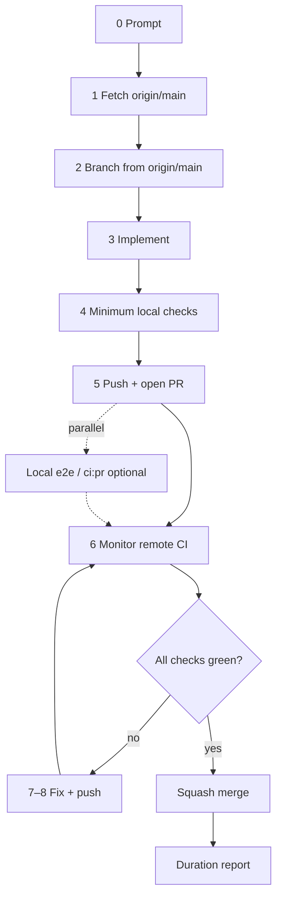

# Coding Bro — Default Agent Workflow

**System of record** for how every AI agent handles implementation tasks in this repository. The Cursor skill at [`.cursor/skills/coding-bro/SKILL.md`](../../.cursor/skills/coding-bro/SKILL.md) mirrors this doc for auto-invocation.

Use this pipeline for **every coding request** unless the user explicitly wants a read-only answer, review-only feedback, or a question with no code changes.

## How it works

0. **Prompt** — User gives a task description.
1. **Fetch repository** — Sync with remote before branching.
2. **Branch from `origin/main`** — Never commit on `main`. Create a feature branch for the work.
3. **Implement** — Make the requested change. Follow [rules.md](../rules.md) and package boundaries in [ARCHITECTURE.md](../ARCHITECTURE.md).
4. **Local checks** — Run fast checks before push (see below). Start **long** checks (e2e, full `task ci:pr`) in parallel with push when the diff is already committed.
5. **Push early** — Commit and `git push -u origin HEAD` as soon as minimum local checks pass. Do **not** wait for e2e or full `task ci:pr` to finish if those runs can overlap with remote CI.
6. **Open PR and monitor** — Create the PR immediately after push, then watch CI until every required check finishes. When all checks pass and merge is requested, **squash merge** (`gh pr merge <n> --squash`).
7. **Fix on failure** — If CI fails, read logs, fix root cause, run e2e locally if needed, commit, push.
8. **Push fixes** — Push updated commits to the same PR branch.
9. **Repeat** — Return to step 6 until every check is green and the PR is squash-merged.



## Commands

### 1 — Fetch

```bash
git fetch origin main
```

### 2 — Branch

```bash
git checkout -b <branch-name> origin/main
```

Use a descriptive branch name (`feat/…`, `fix/…`, `chore/…`).

### 4 — Local checks

**Minimum before every push** (must finish before push):

```bash
task format:check    # or task format after edits
task check           # fmt, lint, unit tests, web build
```

Scoped subsets when the touch surface is narrow:

```bash
task web:check && task web:test    # web-only
task rust:test                     # nook-core only
```

**Push in parallel with long checks.** After minimum checks pass and changes are committed, push and open the PR **immediately**. Start e2e or full PR CI locally in the same turn if useful — do not block push on them. Remote CI (~3–4 min) and local e2e overlap; waiting for local e2e before push adds wall time with no benefit when PR CI will run the same gates anyway.

```text
commit → push → gh pr create     (as soon as task check / scoped subset is green)
     ‖
task web:test:e2e:pr             (optional, same turn, non-blocking)
task ci:pr                       (optional before push only after a prior CI failure)
```

**Before opening the PR** when you want extra confidence (optional, non-blocking for push):

```bash
task ci:pr
```

**E2e when the change is big or complex** (run in parallel with push, not before it):

```bash
task web:test:e2e:pr
# or, after task check already built wasm + dist:
task web:test:e2e:pr:parallel
```

Skip e2e for isolated Rust-only or docs-only changes.

**After any remote CI failure** — run `task ci:pr` before pushing again (this one should finish before the fix push).

See [pull-requests.md § Local checks](pull-requests.md#2-local-checks-before-every-push) and [ci-pipeline.md § Local vs remote CI](ci-pipeline.md#local-vs-remote-ci).

### 5–6 — Push, open PR, monitor

Push as soon as minimum local checks pass — do not wait for e2e or full `task ci:pr` unless recovering from a prior CI failure.

```bash
git push -u origin HEAD
gh pr create --title "…" --body "…"
gh pr checks <number> --watch
```

### 7–8 — Fix loop

```bash
gh run view <run-id> --log-failed
task ci:pr
# fix, commit, push
gh pr checks <number> --watch
```

### 6 — Merge

When all checks pass and the user asked to merge (or the task implies merge-on-green):

```bash
gh pr merge <number> --squash
```

Squash merge only. See [rules.md §6](../rules.md#6-git--pull-request-workflow).

## Non-negotiables

- **Never push directly to `main`.** Branch → PR → squash merge.
- **Never stop after push.** Monitor CI through merge or explicit handoff.
- **Never kill the Docker daemon** — only stop containers. See [rules.md §5](../rules.md#docker-daemon--never-kill-it).
- **Duration report** on every completed implementation task. See [pull-requests.md §8](pull-requests.md#8-task-completion-report).

## Related docs

- [pull-requests.md](pull-requests.md) — squash merge policy, detailed agent pipeline, CLI reference
- [ci-pipeline.md](ci-pipeline.md) — GitHub Actions workflow map
- [monorepo.md](monorepo.md) — cross-package change checklist (runs inside step 3)
