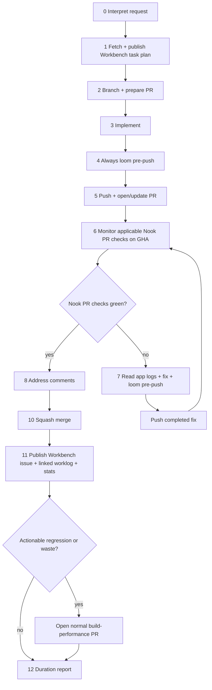

# Coding Bro — Default Agent Workflow

**System of record** for how every AI agent handles implementation tasks in this repository. The Cursor skill at [`.cursor/skills/coding-bro/SKILL.md`](../../.cursor/skills/coding-bro/SKILL.md) mirrors this doc for auto-invocation.

Use this pipeline for **every coding request** unless the user explicitly wants a read-only answer, review-only feedback, or a question with no code changes.

## PR-first mandate

AI agents must treat every implementation task as PR-bound from the start.

- Fetch `origin/main`.
- Synthesize the important request into a public-safe Workbench task plan and publish it before implementation edits.
- Estimate authored changed lines and identify the owning module or layer.
- Split work expected to exceed 5,000 authored changed lines into an ordered
  Workbench issue and PR sequence.
- Create a feature branch and plan the PR title/body/scope.
- Open or update the PR as soon as there is a coherent commit to show, then keep working on that same PR branch.

Do not treat implementation as complete after local edits, a push, or a PR link.

The agent owns the full loop on **GitHub Actions**:

- Nook's applicable repository-owned PR test checks
- fixes and re-pushes
- comments already present
- conflict resolution
- the exact-head readiness audit
- squash merge

A ready PR must merge without asking the user for separate authorization.

Default PR-first loop:

1. **Record the interpreted task:**
   - Fetch `origin/main`.
   - Write the important requirements in the agent's own words.
   - Estimate authored changed lines.
   - Identify module and interface boundaries.
   - Publish the public-safe start snapshot to Nook Workbench.
   - Never copy the raw prompt or chat transcript.
2. **Prepare the PR path** — if the feature is expected to exceed 5,000
   authored changed lines, publish an ordered issue and PR sequence. Create a
   feature branch for the first cohesive slice and decide whether its PR will
   be draft or normal.
3. **Implement functionality** — make the module-focused changes for the
   current slice. Re-estimate when the scope changes.
4. **Push and create/update the PR** — once the branch has a coherent formatted commit, push it and open the PR. Subsequent experimental commits update the same PR without starting the complete validation pipeline.
5. **Validate explicitly on hosted workers:**
   - Run allowlisted `task remote TASK_NAME=<name>` only for isolated diagnostics that finish sooner than complete validation.
   - Do not use focused tasks as a prerequisite for complete validation.
   - At the final boundary, run `task pr:preflight PR=<number>` and `task pr:validate PR=<number>`.
   - Monitor the path-applicable `PR / Verify and preview` and `Web research / Build and deploy research catalog` workflows.
   - PRs fixing a failure observed on `main` must trigger the Main-equivalent suite with `task pr:validate PR=<number> FULL_E2E=1`.
   - Do not run heavy local builds or tests.
6. **Fix Nook's red PR test checks until green:**
   - Inspect failed logs, check app logs for web/e2e failures, fix, `task format`, and push the completed fix.
   - This includes Knip unused findings, jscpd clone/duplicate findings, and every other mechanical gate.
   - Fix the code; do not silence the check.
   - Push the completed fix, then explicitly trigger complete validation again.
   - Use a focused remote task only when it shortens diagnosis of a known failure.
7. **Settle existing review feedback** — inspect the current comments and reviews, reply to every actionable human or automated finding, and resolve each thread. Do not request or wait for optional reviewers.
8. **Merge automatically when ready** — require `task pr:ready PR=<number>`, then squash-merge as soon as the branch is current, Nook's applicable repository-owned PR test checks are green and all actionable comments are resolved. Do not pause for a ready-PR handoff or separate merge permission.

## Testing strategy — GitHub Actions only

### ⛔ Pre-push hygiene — always format (the only required local action)

Before every push, run Loom pre-push **unconditionally**.

Do not skip it for "tiny" edits.

**`task loom:pre-push` is the only required local product action.**

Do not run `task check`, `task ci:pr`, full suites, builds, or e2e as a
merge/handoff gate. Those run exclusively on GitHub Actions.

```bash
task loom:pre-push
```

Never use `task extension:format` alone before push.

See [pre-push-hygiene.md](../dynamic-skills/pre-push-hygiene.md).

### ⛔ Format, push, execute on GitHub-hosted workers

Once the current change is coherent and checkable, run pre-push hygiene, then commit and push/open or update the PR. Ordinary pushes do not start complete PR validation. Request the complete exact-head workflow as soon as the branch is ready. Use a focused task only when it shortens diagnosis.

```text
WRONG: implement → local task check / full tests / build → push
WRONG: implement → push dirty/uncommitted source → remote task tests an older SHA
WRONG: implement → push → assume complete PR validation started automatically
RIGHT: implement → task loom:pre-push → commit → push
       → task loom:pr-land CONFIG=<pr-land-validate-request.yaml>
       → exact-head GitHub Actions
```

This ordering applies to the first implementation and every review/CI fix.

Required pre-push hygiene always runs before the push:

- `task format`
- the UI demo contract when UI paths change

Focused builds/tests run through `task remote` only after the exact commit is pushed.
Use them only when they isolate a known failure faster than complete validation.
Do not run a broad focused batch before complete validation.

If Actions fails:

1. fix the failure
2. run `task format` again
3. commit and push the complete fix
4. trigger the complete PR workflow again
5. dispatch a focused task only if a known failure needs faster isolation

**PR GitHub Actions is the sole merge validation pipeline.**

- `pr.yml` runs on GitHub-hosted `ubuntu-latest`.
- Every result is bound to the explicitly validated PR head.
- A push after validation makes the earlier result stale and does not start a replacement; the agent must run `task pr:validate` again.
- Delivery restores private Zot BuildKit cache scopes for Rust/WASM, web dependencies, and the final web image.
- Main refreshes the default-branch Zot lineage visible to new PRs.
- GitHub Actions cache storage is forbidden for BuildKit layers.
- A failing fmt, clippy, unit test, or e2e spec still burns a remote validation cycle, so unconditional `task format` before push exists specifically to stop the most common avoidable Verify failures.

**Focused Task commands run remotely.** Use `task remote:list` first. Use
`task remote TASK_NAME=<name>` for one task. Use
`task remote TASK_NAMES=<name>,<name>` to reuse one hosted job for a batch.
Interactive local servers remain appropriate when the investigation needs
retained local state. See [remote-execution.md](remote-execution.md).

Default agent flow:

1. **Record the interpreted task first** — fetch `origin/main`, then publish `plans/<feature>/<timestamp>-<task>.md` before implementation edits. Capture synthesized requirements, constraints, initial steps, and completion evidence; raw prompts and transcripts are forbidden.
2. **Prepare the PR path** — branch from `origin/main` and plan the PR title/scope.
3. **Implement** — use the focused hosted catalog when build/test feedback is useful.
4. **Pre-push hygiene** — always `task loom:pre-push`.
5. **Push and open/update the PR** — once the branch has a coherent formatted commit, commit, push, and create/update the PR.
6. **Validate on GitHub Actions:**
   - Dispatch focused `task remote` jobs as useful.
   - Run `task loom:pr-land CONFIG=<pr-land-validate-request.yaml>` (or `task pr:validate`) and monitor repository-owned PR checks.
   - Green status is necessary, but the full readiness audit must also pass.
   - See [code-review.md](code-review.md).
7. **On any Nook PR-test failure** — read **app logs** → fix → `task loom:pre-push` → commit and push the completed fix → optionally dispatch a focused remote task → explicitly trigger and monitor the refreshed complete PR checks.
8. **Address actionable PR comments currently present** — reply with the fix, validation, or no-change rationale, and push any needed changes; GitHub events re-evaluate Nook's applicable PR test checks. Do not wait for another review cycle.
9. **Resolve conflicts and merge** — before merging, verify the PR branch is not stale against `origin/main`; update and push it, then explicitly trigger Nook's complete PR validation for the replacement head. After every push, re-run validation and readiness, then squash-merge automatically when it passes.

Never merge until the latest pushed branch has green applicable repository-owned PR test checks. External checks do not affect readiness. After a Nook PR-test failure, the next push must be a completed fix, not an exploratory checkpoint.

## Debug information — always check app logs

When investigating failures, use sources in order:

1. **GitHub Actions / test output** — failed focused or complete remote job logs and the Playwright report.
2. **Static analysis findings from CI** — fmt, clippy, svelte-check, eslint, Knip unused, jscpd clones/duplicates, prettier (surfaced by `pr.yml` / Verify).
3. **Persisted app logs** — **most important after 1–2.** Vault unlock, sync, WASM tracing, and console capture live in IndexedDB (`/app-logs`, `nook-app-logs.json`).

Every failing finding in step 1–2 must be fixed in the same task (delete/wire dead code, extract shared code for clones, correct types/lints/tests). Do not raise Knip/jscpd thresholds or ignore authored sources to make the gate pass. See [quality.md § Fix check findings](quality.md#fix-check-findings--not-silence-them).

Do not guess from DOM or screenshots alone. See [logging.md § Debugging…](../references/logging.md#debugging-troubleshooting-and-ci-verification).

## How it works

0. **Interpret the request** — Identify the important requirements without copying the raw prompt or chat.
1. **Fetch and publish the task plan:**
   - Sync with remote.
   - Estimate authored changed lines.
   - Identify module and interface boundaries.
   - Publish the public-safe structured interpretation and execution plan to
     Workbench before implementation begins.
2. **Branch from `origin/main` and prepare the PR** — Never commit on `main`.
   Split work above the size boundary into an ordered Workbench issue sequence.
   Create a feature branch for the first slice. Keep its PR title, body, and
   scope in mind from the first implementation step.
3. **Implement** — Make the module-focused change. Follow [rules.md](../rules.md)
   and package boundaries in [ARCHITECTURE.md](../ARCHITECTURE.md). If work is
   risky, blocked, or outside the authorized scope, follow [issues.md](issues.md)
   before handoff:
   - update or create the Workbench feature;
   - add focused Markdown records for the missing work.
4. **Pre-push hygiene** — Always run `task loom:pre-push`. Do not run a required local product gate.
5. **Push and open/update PR** — Commit and push as soon as the branch has a coherent formatted implementation commit. If no PR exists, open it; pushes do not automatically start the complete validation workflow.
6. **Explicit Nook PR checks:**
   - Use `task remote` for focused feedback.
   - Run `task loom:pr-land CONFIG=<pr-land-validate-request.yaml>` at the complete validation boundary.
   - Monitor repository-owned PR checks.
   - Inspect any feedback already present.
   - Never request or wait for optional external reviewers.
   - Before merging, fetch `origin/main` and verify the PR branch is not stale.
   - If it is stale, merge `origin/main`, push, and explicitly validate the refreshed head.
7. **Fix loop on failure** — If Nook's PR test checks fail: read **app logs** → fix → `task loom:pre-push` → commit and push → optional focused `task remote` → explicitly re-validate.
8. **Address and resolve PR comments** — Inspect feedback; reply; resolve threads; push when needed.
9. **Repeat** — Return to step 7 until Nook's applicable PR checks are green and every actionable comment is resolved.
10. **Squash merge** — run `gh pr merge <n> --squash` immediately after `task loom:pr-land CONFIG=<pr-land-ready-request.yaml>` succeeds.
11. **Publish Workbench completion context and statistics:**
    - Update the associated Workbench issue.
    - Add the required worklog linked to the task plan.
    - Assemble and publish `stats/ai-agent/<n>.yaml` with Loom.
    - Do not create a Nook bookkeeping PR.
    - Open a separate normal performance PR for actionable waste or regression.
    - See [issues.md](issues.md) and [agent-statistics.md](agent-statistics.md).
12. **Finish** — report the task duration after the implementation PR and Workbench records are published and any required performance PR is landed.

When a feature has multiple planned slices, return to step 1 for the next ready
issue after each merge.

Start every next slice from current `origin/main`.

Finish only when the full feature acceptance criteria are complete.

See
[pull-requests.md § Pull request size and modularity](pull-requests.md#pull-request-size-and-modularity).


```mermaid
flowchart TD
  P[0 Interpret request] --> F[1 Fetch + publish Workbench task plan]
  F --> B[2 Branch + prepare PR]
  B --> I[3 Implement]
  I --> H[4 Always loom pre-push]
  H --> PU[5 Push + open/update PR]
  PU --> PR[6 Monitor applicable Nook PR checks on GHA]
  PR --> G{Nook PR checks green?}
  G -->|yes| C[8 Address comments]
  C --> M[10 Squash merge]
  G -->|no| FIX[7 Read app logs + fix + loom pre-push]
  FIX --> PUSH[Push completed fix]
  PUSH --> PR
  M --> S[11 Publish Workbench issue + linked worklog + stats]
  S --> W{Actionable regression or waste?}
  W -->|yes| BP[Open normal build-performance PR]
  W -->|no| D[12 Duration report]
  BP --> D
```

## Commands

### 1 — Fetch

```bash
git fetch origin main
```

### 2 — Branch

```bash
git checkout -b <branch-name> origin/main
```

Use a descriptive branch name (`feat/…`, `fix/…`, `chore/…`).

### 4–6 — Format, push, execute remotely, and validate explicitly

GitHub Actions is the agent execution environment for lint, tests, coverage,
builds, and e2e.

Format on the host with Loom, commit and push, use focused `task remote` jobs,
then explicitly validate when the exact head is ready.

Inspect feedback already present after the final push.

Do not request or wait for external reviewers.

Follow [code-review.md](code-review.md).

**Required local action** (before every push):

```bash
task loom:pre-push
```

Do **not** require `task check` or `task ci:pr` for merge or handoff.

Focused hosted commands (never merge gates):

```bash
task remote TASK_NAMES=web:check,web:test,extension:check
task remote TASK_NAME=rust:test
```

```text
implement → task loom:pre-push
           → commit → push → gh pr create/update
           → task loom:pr-land CONFIG=<pr-land-validate-request.yaml>
           → monitor exact-head GitHub Actions
```

### 7 — Fix loop (after any remote CI failure)

**Mandatory after every red remote build before merge/handoff:**

```bash
gh run view <run-id> --log-failed
# For e2e failures: read nook-app-logs.json from the Playwright report.
task loom:pre-push
# commit + push completed fix
task remote TASK_NAME=<focused-task> # optional hosted proof
task loom:pr-land CONFIG=<pr-land-validate-request.yaml>
task loom:pr-land CONFIG=<pr-land-ready-request.yaml>
```

Do not run `task ci:pr` locally. The explicitly triggered remote `pr.yml` run is the product gate.

See [pull-requests.md § Validation](pull-requests.md#5-hosted-iteration-and-explicit-validation) and [ci-pipeline.md § Local vs remote CI](ci-pipeline.md#local-vs-remote-ci).

### 5–7 — Push, open PR, monitor

Push once the current iteration is functionally complete and formatted. Then monitor remote CI. Do not start a required local product gate.

```bash
git push -u origin HEAD
gh pr create --title "…" --body "…"
task pr:preflight PR=<number>
```

Before every merge attempt, verify the PR branch is current with the latest base branch.

Green applicable Nook PR test checks on an out-of-date branch are not enough.

GitHub may still block merge with:

- an "Update branch" requirement
- `mergeStateStatus: BLOCKED`
- a stale required-check result until `main` has been merged into the PR branch

When a green PR cannot merge, treat stale `main` as the first thing to prove or fix before investigating other branch rules.

```bash
git fetch origin main
git rev-list --left-right --count HEAD...origin/main
gh pr view <number> --json mergeStateStatus,baseRefOid,headRefOid,statusCheckRollup
# If the branch is behind origin/main:
git merge origin/main --no-edit
git push origin HEAD
task pr:ready PR=<number>
```

### 10 — Merge

When Nook's applicable repository-owned PR test checks are complete, every actionable thread is resolved, and `task pr:ready` succeeds:

```bash
gh pr merge <number> --squash
```

Squash merge only. See [rules.md §6](../rules.md#6-git--pull-request-workflow). The successful merge is the implementation delivery boundary. Do not wait for or monitor the resulting Main workflow, development deployment, or live origins unless the user explicitly requested deployment/live verification or assigned a Main failure.

### 11 — Publish Workbench records

After the implementation PR merges, follow [issues.md](issues.md) and [agent-statistics.md](agent-statistics.md).

The task-start plan must already be published.

Update the associated issue and add a worklog linked to that plan. Summarize progress, implementation problems, decisions, validation, and remaining work.

Create the YAML from current Nook `main`:

- include the repository test inventory for the merged head
- compare it with comparable prior records
- publish it to `meta-secret/nook-workbench` as `stats/ai-agent/<pr>.yaml`

Do not wait for post-merge Main. Any performance fix belongs in a separate normal Nook PR.

## Non-negotiables

- **Never push directly to `main`.** Branch → PR → squash merge.
- **Always `task format` before every push** — host-applied, unconditional; never rely on sealed-only `task extension:format`. When UI paths change, pass the UI demo contract against `origin/main` before push. See [pre-push-hygiene.md](../dynamic-skills/pre-push-hygiene.md).
- **Never stop after push.** Explicitly trigger complete PR validation, then own failures, comments, conflicts, and readiness through squash merge. Use focused hosted tasks only to shorten diagnosis.
- **GitHub Actions is the only product gate and heavy execution surface** — do not run `task check`, `task ci:pr`, full suites, builds, or e2e on the agent machine. See [remote-execution.md](remote-execution.md).
- **Use persisted app logs for e2e analysis** — read `nook-app-logs.json`, call `fetchAppLogs`, or open `/app-logs`; see [logging.md](../references/logging.md).
- **Never merge after a Nook PR-test failure without a green Actions run on the latest head.**
- **Fix Knip, jscpd, and every other check finding** — unused code, clones/duplicates, lint, types, tests, coverage. Do not raise thresholds or ignore authored sources to silence a red gate. See [quality.md § Fix check findings](quality.md#fix-check-findings--not-silence-them).
- **Never merge on checks alone.** Require the exact-head `task pr:ready` audit; once it succeeds, the task-owning agent must squash-merge without asking again. Workflows do not blindly merge based on a check event.
- **Settle feedback already present before merge.** Address and resolve all actionable comments, then require `task pr:ready`. Never request or wait for optional external reviewers or checks.
- **Never kill the Docker daemon** — only stop containers. See [rules.md §5](../rules.md#docker-daemon--never-kill-it).
- **Never hide deferred scope** — if requested functionality is not fully implemented because it is large, risky, blocked, or out of scope, manage it in Workbench Markdown first. See [issues.md](issues.md).
- **Plan bounded PRs** — target no more than 5,000 authored changed lines per
  PR. Prefer one cohesive module, package, layer, or responsibility. Continue
  through every planned slice until the requested feature is complete. See
  [pull-requests.md](pull-requests.md#pull-request-size-and-modularity).
- **Workbench plan before implementation; summary and statistics after merge** — publish the public-safe task plan before edits, then publish the issue update, plan-linked worklog, and `stats/ai-agent/<pr-number>.yaml` directly to Workbench. See [issues.md](issues.md) and [agent-statistics.md](agent-statistics.md).
- **Duration report** on every completed implementation task. See [pull-requests.md §10](pull-requests.md#10-task-completion-report).

## Related docs

- [pull-requests.md](pull-requests.md) — squash merge policy, detailed agent pipeline, CLI reference
- [pre-push-hygiene.md](../dynamic-skills/pre-push-hygiene.md) — unconditional host-applied format + UI demo contract
- [github-actions-only-validation.md](../dynamic-skills/github-actions-only-validation.md) — format locally; product gates on GHA only
- [issues.md](issues.md) — Workbench issues, required task-start plans, and completion worklogs
- [ci-pipeline.md](ci-pipeline.md) — GitHub Actions workflow map
- [agent-statistics.md](agent-statistics.md) — measurement schema, test inventory, comparison rules, waste analysis, and Workbench publication
- [monorepo.md](monorepo.md) — cross-package change checklist (runs inside step 3)
