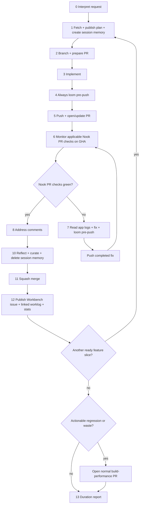

# Coding Bro — Default Agent Workflow

## Overview

**System of record** for how every AI agent handles implementation tasks in this repository. The Cursor skill at [`.cursor/skills/coding-bro/SKILL.md`](../../.cursor/skills/coding-bro/SKILL.md) mirrors this doc for auto-invocation.

Use this pipeline for **every coding request** unless the user explicitly wants a read-only answer, review-only feedback, or a question with no code changes.

Additional routing rules apply:

- Delegated work follows
  [`subagent-delegation.md`](subagent-delegation.md). Outside a compiled Loom
  graph, finalize every reached child attempt with
  `task loom:agent-delegation:record REQUEST=<request.json>` and consume its
  verified semantic view before continuing the parent workflow.
- Cross-module implementation also follows
  [`module-oriented-development.md`](module-oriented-development.md). Plan
  behavior top-down, freeze the external contracts, and implement accepted
  providers before their consumers.

## PR-first mandate

AI agents must treat every implementation task as PR-bound from the start.

- Fetch `origin/main`.
- Synthesize the important request into a public-safe Workbench task plan and publish it before implementation edits.
- Estimate authored changed lines and identify the owning module or layer.
- Split work expected to exceed 5,000 authored changed lines into an ordered
  Workbench issue and PR sequence.
- At 4,000 lines, stop and decide the semantic PR sequence before more scope is
  added.
- If work reaches the limit, follow the linked-successor preservation protocol
  in [pull-requests.md](pull-requests.md#pull-request-size-and-modularity).
- Never compress docs, remove tests, or delete completed behavior to optimize a
  PR's line count.
- Create a feature branch and plan the PR title/body/scope.
- Open or update the PR as soon as there is a coherent commit to show, then keep working on that same PR branch.

Do not treat implementation as complete after local edits, a push, or a PR link.

The agent owns the full loop on **GitHub Actions**:

- Nook's applicable repository-owned PR test checks
- fixes and re-pushes
- comments already present
- conflict resolution
- the exact-head readiness audit
- squash merge

A ready PR must merge without asking the user for separate authorization.

Default PR-first loop:

1. **Record the interpreted task:**
   - Fetch `origin/main`.
   - Write the important requirements in the agent's own words.
   - For user-facing features, item types, or UX flows, find and read the owning specification in [`.cortex/product-specs/`](../product-specs/) (see [`../dynamic-skills/product-spec-lifecycle.md`](../dynamic-skills/product-spec-lifecycle.md)).
   - Apply [subagent-delegation.md](subagent-delegation.md).
   - Record the delegation decision, processing identity, parent lineage,
     terminal barriers, and planned joins.
   - Require every reached agent to produce an attempt action stream and
     semantic Markdown view.
   - Aggregate child views before continuation, integration, or completion.
   - Estimate authored changed lines.
   - Identify module and interface boundaries.
   - Record the feature module DAG, named experts, provider-consumer contract
     edges, acceptance evidence, and bottom-up continuation order.
   - Invoke `internal_api_expert` for every changed module boundary.
   - Publish the public-safe start snapshot to Nook Workbench.
   - Create ignored session memory under `.cortex/.session/` for substantial
     work.
   - Never copy the raw prompt or chat transcript.
2. **Prepare the PR path** — if the feature may approach 5,000 authored changed
   lines, publish an ordered semantic issue and PR sequence. Map complete
   capabilities, tests, migrations, and documentation to each slice. Create a
   feature branch for the first cohesive slice and decide whether its PR will
   be draft or normal.
3. **Implement functionality:**
   - Implement the lowest ready provider API and its owning tests first.
   - Continue upward by writing each immediate consumer against the accepted
     provider contract.
   - Keep the module DAG separate from the agent hierarchy.
   - Reject hierarchy depths greater than three.
   - Capture meaningful discoveries and evidence in temporary session memory.
   - When implementation, chat dialogues, or debugging reveal new product requirements, rules, or edge cases, update the owning specification in [`.cortex/product-specs/`](../product-specs/) (or author a new specification) in the same PR.
   - Re-estimate when the scope changes.
4. **Prepare the coherent commit:**
   - Run `task loom:pre-push`.
   - Commit the formatted change.
   - Run advisory `task pr:review-local` before the first owner-authored push.
   - For a harness-created PR, the continuing owner runs local review after
     handoff instead.
5. **Push and create or update the PR:**
   - Push the coherent commit and open the PR.
   - Later coherent commits update the same PR.
   - A push does not start complete validation.
6. **Request review and validate through GitHub Actions:**
   - Use focused remote tasks while iterating.
   - At the final boundary, run `task pr:preflight PR=<number>` and
     `task pr:validate PR=<number>` once.
   - The command dispatches repository-owned checks immediately.
   - It then attempts one idempotent exact-head Cloud review request.
   - The request prefers Codex and falls back to Cursor Bugbot when Codex
     reports a usage limit.
   - Review-request failure does not block those checks.
   - Stop and fix every actionable finding.
   - If no feedback exists when checks finish, continue without waiting.
   - Do not request Claude, CodeRabbit, or other optional reviewers.
   - Run allowlisted `task remote TASK_NAME=<name>` only for isolated diagnostics that finish sooner than complete validation.
   - Do not use focused tasks as a prerequisite for complete validation.
   - Monitor the path-applicable `PR / Verify and preview` and `Web research / Build and deploy research catalog` workflows.
   - PRs fixing a failure observed on `main` must trigger the Main-equivalent suite with `task pr:validate PR=<number> FULL_E2E=1`.
   - Do not run heavy local builds or tests.
7. **Fix Nook's red PR test checks until green:**
   - Inspect failed logs and check app logs for web/e2e failures.
   - Fix the problem, run `task loom:pre-push`, and push the completed fix.
   - This includes Knip unused findings, jscpd clone/duplicate findings, and every other mechanical gate.
   - Fix the code; do not silence the check.
   - Push the completed fix, then explicitly trigger complete validation again.
   - Use a focused remote task only when it shortens diagnosis of a known failure.
8. **Reflect and curate before readiness:**
   - Complete the canonical
     [agent self-improvement](../dynamic-skills/self-improvement.md) contract.
9. **Merge automatically when ready:**
   - Require `task pr:ready PR=<number>`.
   - Require a current branch, green repository-owned PR checks, and no active
     actionable feedback.
   - Squash-merge without a separate ready-PR handoff or permission request.

## Testing strategy — GitHub Actions only

### ⛔ Pre-push hygiene — always format (the only required local action)

- Before every push, run Loom pre-push **unconditionally**.
  - Do not skip it for "tiny" edits.
- **`task loom:pre-push` is the only required local product action.**
- Do not run `task check`, `task ci:pr`, full suites, builds, or e2e as a
  merge or handoff gate.
  - Those run exclusively on GitHub Actions.

```bash
task loom:pre-push
```

Never use `task extension:format` alone before push.

See [pre-push-hygiene.md](../dynamic-skills/pre-push-hygiene.md).

### ⛔ Format, push, execute through GitHub Actions

Once the current change is coherent and checkable, run pre-push hygiene and
commit. Run local review before the first owner-authored push. Then push or
update the PR. Ordinary pushes do not start complete PR validation. Request the
complete exact-head workflow as soon as the branch is ready. Use a focused task
only when it shortens diagnosis.

```text
WRONG: implement → local task check / full tests / build → push
WRONG: implement → push dirty/uncommitted source → remote task tests an older SHA
WRONG: implement → push → assume complete PR validation started automatically
RIGHT first owner push: implement → task loom:pre-push → commit
       → task pr:review-local → push
       → task loom:pr-land CONFIG=<pr-land-validate-request.yaml>
       → exact-head GitHub Actions
RIGHT later fix: fix → task loom:pre-push → commit → push
       → task loom:pr-land CONFIG=<pr-land-validate-request.yaml>
       → exact-head GitHub Actions
```

Pre-push hygiene, commit, push, and validation ordering applies to the first
implementation and every review/CI fix. Local review runs only before the first
owner-authored push.

Required pre-push hygiene always runs before the push:

- host-applied formatting;
- the UI demo contract when UI paths change.

Both run through `task loom:pre-push`.

Focused builds/tests run through `task remote` only after the exact commit is pushed.
Use them only when they isolate a known failure faster than complete validation.
Do not run a broad focused batch before complete validation.

If Actions fails:

1. fix the failure
2. run `task loom:pre-push` again
3. commit and push the complete fix
4. trigger the complete PR workflow again
5. dispatch a focused task only if a known failure needs faster isolation

**PR GitHub Actions is the sole merge validation pipeline.**

- Trusted native Rust and Rust ecosystem jobs in `pr.yml` may use ARC; fork PRs
  and runtime-dependent jobs use GitHub-hosted `ubuntu-latest`.
- Every result is bound to the explicitly validated PR head.
- A push after validation makes the earlier result stale and does not start a replacement; the agent must run `task pr:validate` again.
- Delivery restores private Zot BuildKit cache scopes for Rust/WASM, web dependencies, and the final web image.
- Main ARC producers publish shared Zot refs after verification. Persistent
  node-local BuildKit shards accelerate repeated work without replacing Zot.
- GitHub Actions cache storage is forbidden for BuildKit layers.
- A failing fmt, clippy, unit test, or e2e spec still burns a remote validation cycle, so unconditional `task format` before push exists specifically to stop the most common avoidable Verify failures.

**Focused Task commands run remotely.** Use `task remote:list` first. Use
`task remote TASK_NAME=<name>` for one task. Use
`task remote TASK_NAMES=<name>,<name>` to reuse one configured remote job for a
batch.
Interactive local servers remain appropriate when the investigation needs
retained local state. See [remote-execution.md](remote-execution.md).

Default agent flow:

1. **Confirm ownership and record the interpreted task.**
   - Identify the assigned feature and focused issue set.
   - Treat every other active task as read-only.
   - Fetch `origin/main`.
   - Publish `plans/<feature>/<timestamp>-<task>.md` before implementation
     edits.
   - Create `.cortex/.session/<task>.md` for substantial work.
   - Capture synthesized requirements, constraints, initial steps, and
     completion evidence.
   - Do not copy raw prompts or transcripts.
2. **Prepare the PR path** — branch from `origin/main` and plan the PR title/scope.
3. **Implement** — use the focused remote catalog when build/test feedback is useful. Capture meaningful discoveries in session memory.
4. **Prepare the coherent commit:**
   - Always run `task loom:pre-push`.
   - Commit the formatted change.
   - Run `task pr:review-local` before the first owner-authored push.
   - For a harness-created PR, run local review after handoff instead.
5. **Push and open or update the PR.**
6. **Validate on GitHub Actions:**
   - Dispatch focused `task remote` jobs as useful.
   - Run `task loom:pr-land CONFIG=<pr-land-validate-request.yaml>`.
   - Loom dispatches repository-owned PR checks through `task pr:validate`.
   - It then attempts the non-blocking exact-head Cloud review request.
   - Codex is preferred. Cursor Bugbot is the usage-limit fallback.
   - Green status is necessary, but the full readiness audit must also pass.
   - See [code-review.md](code-review.md).
7. **On a Nook PR-test failure:**
   - Read CI and app logs.
   - Fix the failure and run `task loom:pre-push`.
   - Commit and push the complete fix.
   - Use focused remote diagnosis when useful.
   - Trigger and monitor refreshed complete PR checks.
8. **Address actionable PR comments:**
   - Reply with the fix, validation, or no-change rationale.
   - Push required changes.
   - Repeat complete validation for the replacement head.
9. **Reflect and curate:**
   - Complete the canonical
     [agent self-improvement](../dynamic-skills/self-improvement.md) contract.
10. **Resolve conflicts and merge:**
   - Verify the branch is current with `origin/main`.
   - Update and push it when stale.
   - Re-run complete validation and readiness after the push.
   - Squash-merge automatically when readiness passes.

Never merge until the latest pushed branch has green applicable repository-owned PR test checks. External checks do not affect readiness. After a Nook PR-test failure, the next push must be a completed fix, not an exploratory checkpoint.

## Debug information — always check app logs

When investigating failures, use sources in order:

1. **GitHub Actions / test output** — failed focused or complete remote job logs and the Playwright report.
2. **Static analysis findings from CI** — fmt, clippy, svelte-check, eslint, Knip unused, jscpd clones/duplicates, prettier (surfaced by `pr.yml` / Verify).
3. **Persisted app logs** — **most important after 1–2.** Vault unlock, sync, WASM tracing, and console capture live in IndexedDB (`/app-logs`, `nook-app-logs.json`).

Every failing finding in step 1–2 must be fixed in the same task (delete/wire dead code, extract shared code for clones, correct types/lints/tests). Do not raise Knip/jscpd thresholds or ignore authored sources to make the gate pass. See [quality.md § Fix check findings](quality.md#fix-check-findings--not-silence-them).

Do not guess from DOM or screenshots alone. See [logging.md § Debugging…](../references/logging.md#debugging-troubleshooting-and-ci-verification).

## How it works

0. **Interpret the request** — Identify the important requirements without copying the raw prompt or chat. Read the owning specification in [`.cortex/product-specs/`](../product-specs/) when product behavior or user flows are touched.
1. **Confirm ownership, fetch, and publish the task plan:**
   - Identify the assigned feature and focused issues.
   - Read the relevant product specification in `.cortex/product-specs/`.
   - Leave every other active task unchanged.
   - Sync with remote.
   - Estimate authored changed lines.
   - Identify module and interface boundaries.
   - Publish the public-safe structured interpretation and execution plan to
     Workbench before implementation begins.
   - Create ignored session memory for substantial work.
2. **Branch from `origin/main` and prepare the PR** — Never commit on `main`.
   Split work above the size boundary into an ordered Workbench issue sequence.
   Create a feature branch for the first slice. Keep its PR title, body, and
   scope in mind from the first implementation step.
3. **Implement** — Make the module-focused change. Follow dynamic skills in
   [dynamic-skills/](../dynamic-skills/) and package boundaries in
   [ARCHITECTURE.md](../ARCHITECTURE.md). Update relevant product specs in
   `.cortex/product-specs/` in the same PR when product behavior or constraints
   are refined. If work is risky, blocked, or outside the authorized scope,
   follow [issues.md](issues.md) before handoff:
   - update or create the Workbench feature;
   - add focused Markdown records for the missing work.
4. **Prepare the coherent commit:**
   - Run `task loom:pre-push`.
   - Commit the formatted implementation.
   - Run `task pr:review-local` before the first owner-authored push.
   - For a harness-created PR, run local review after handoff instead.
   - Do not run heavy product gates locally.
5. **Push and open or update the PR:**
   - Push the coherent implementation commit.
   - Open the PR when it does not exist.
   - Remember that a push does not start complete validation.
6. **Explicit Nook PR checks:**
   - Use `task remote` for focused feedback.
   - Run `task loom:pr-land CONFIG=<pr-land-validate-request.yaml>` at the
     complete validation boundary.
   - Loom dispatches validation before attempting the Cloud review request.
   - Monitor repository-owned PR checks.
   - Inspect any feedback already present.
   - Never wait for Codex or Cursor after repository-owned checks finish.
   - Never request Claude, CodeRabbit, or other optional external reviewers.
   - Before merging, fetch `origin/main` and verify the PR branch is not stale.
   - If it is stale, merge `origin/main`, push, and explicitly validate the refreshed head.
7. **Fix loop on failure** — If Nook's PR test checks fail: read **app logs** → fix → `task loom:pre-push` → commit and push → optional focused `task remote` → explicitly re-validate.
8. **Address and resolve PR comments:**
   - Inspect feedback.
   - Update code, tests, and product specifications when review comments refine product rules.
   - Reply to threads, resolve them, and push when needed.
9. **Repeat** — Return to step 7 until Nook's applicable PR checks are green and every actionable comment is resolved.
10. **Run the self-improvement review:**
    - Complete
      [Agent self-improvement](../dynamic-skills/self-improvement.md) before
      readiness.
11. **Squash merge** — run `gh pr merge <n> --squash` immediately after `task loom:pr-land CONFIG=<pr-land-ready-request.yaml>` succeeds.
12. **Publish Workbench completion context and statistics:**
    - Update the associated Workbench issue.
    - Add the required worklog linked to the task plan.
    - Assemble and publish `stats/ai-agent/<n>.yaml` with Loom.
    - Do not create a Nook bookkeeping PR.
    - Open a separate normal performance PR for actionable waste or regression.
    - See [issues.md](issues.md) and [agent-statistics.md](agent-statistics.md).
13. **Finish** — report the task duration after the implementation PR and Workbench records are published and any required performance PR is landed.

For a feature with multiple planned slices:

1. Return to step 1 for the next ready issue after each merge.
2. Start the next slice from current `origin/main`.
3. Finish only when the full feature acceptance criteria are complete.

See
[pull-requests.md § Pull request size and modularity](pull-requests.md#pull-request-size-and-modularity).

Ownership boundary: current task's owned feature and focused issue set.

- Keep every branch, PR, review, check, and merge action inside this boundary.
- Do not take over a related task because it has open comments or failing
  checks.
  - Require an explicit handoff first.
  - See [Agent feature ownership](../dynamic-skills/agent-feature-ownership.md).

For `agent-implement.yml` PRs, the `## Ownership` section records the handoff.

- Issue-backed runs name the Workbench issue owner.
- Prompt-backed runs name the required `continuing_owner` input.
- The owner must be a Nook GitHub collaborator with write access.
- The workflow assigns the PR to that owner.
- The workflow posts a direct mention before the bounded worker exits.
- Only the assigned owner may resume the monitor, fix, and merge loop.


```mermaid
flowchart TD
  P[0 Interpret request] --> F[1 Fetch + publish plan + create session memory]
  F --> B[2 Branch + prepare PR]
  B --> I[3 Implement]
  I --> H[4 Always loom pre-push]
  H --> PU[5 Push + open/update PR]
  PU --> PR[6 Monitor applicable Nook PR checks on GHA]
  PR --> G{Nook PR checks green?}
  G -->|yes| C[8 Address comments]
  C --> R[10 Reflect + curate + delete session memory]
  R --> M[11 Squash merge]
  G -->|no| FIX[7 Read app logs + fix + loom pre-push]
  FIX --> PUSH[Push completed fix]
  PUSH --> PR
  M --> S[12 Publish Workbench issue + linked worklog + stats]
  S --> N{Another ready feature slice?}
  N -->|yes| F
  N -->|no| W{Actionable regression or waste?}
  W -->|yes| BP[Open normal build-performance PR]
  W -->|no| D[13 Duration report]
  BP --> D
```

## Commands

### 1 — Fetch

```bash
git fetch origin main
```

### 2 — Branch

```bash
git checkout -b <branch-name> origin/main
```

Use a descriptive branch name (`feat/…`, `fix/…`, `chore/…`).

### 4–6 — Format, push, execute remotely, and validate explicitly

- GitHub Actions is the execution environment for lint, tests, coverage,
  builds, and e2e.
- Delivery sequence:
  1. Format on the host with Loom.
  2. Commit and push.
  3. Use focused `task remote` jobs when useful.
  4. Run `task pr:validate PR=<number>` when the exact head is ready.
- Review sequence:
  - Run `task pr:review-local` before the first owner-authored push.
  - For a harness-created PR, run it after handoff instead.
  - Complete validation requests exact-head Cloud review.
  - Fix actionable feedback that arrives while checks run.
  - If no feedback exists when checks finish, continue without waiting.
  - Do not request or wait for other external reviewers.

Follow [code-review.md](code-review.md).

**Required local action** (before every push):

```bash
task loom:pre-push
```

Do **not** require `task check` or `task ci:pr` for merge or handoff.

Focused hosted commands (never merge gates):

```bash
task remote TASK_NAMES=web:check,web:test,extension:check
task remote TASK_NAME=rust:test
```

```text
implement → task loom:pre-push
           → commit → task pr:review-local
           → push → gh pr create/update
           → task loom:pr-land CONFIG=<pr-land-validate-request.yaml>
           → monitor exact-head GitHub Actions
```

### 7 — Fix loop (after any remote CI failure)

**Mandatory after every red remote build before merge/handoff:**

```bash
gh run view <run-id> --log-failed
# For e2e failures: read nook-app-logs.json from the Playwright report.
task loom:pre-push
# commit + push completed fix
task remote TASK_NAME=<focused-task> # optional hosted proof
task loom:pr-land CONFIG=<pr-land-validate-request.yaml>
task loom:pr-land CONFIG=<pr-land-ready-request.yaml>
```

Do not run `task ci:pr` locally. The explicitly triggered remote `pr.yml` run is the product gate.

See [pull-requests.md § Validation](pull-requests.md#5-hosted-iteration-and-explicit-validation) and [ci-pipeline.md § Local vs remote CI](ci-pipeline.md#local-vs-remote-ci).

### 5–7 — Push, open PR, monitor

Push once the current iteration is functionally complete and formatted. Then monitor remote CI. Do not start a required local product gate.

```bash
git push -u origin HEAD
gh pr create --title "…" --body "…"
task pr:preflight PR=<number>
```

Before every merge attempt, verify the PR branch is current with the latest base branch.

Green applicable Nook PR test checks on an out-of-date branch are not enough.

GitHub may still block merge with:

- an "Update branch" requirement
- `mergeStateStatus: BLOCKED`
- a stale required-check result until `main` has been merged into the PR branch

When a green PR cannot merge, treat stale `main` as the first thing to prove or fix before investigating other branch rules.

```bash
git fetch origin main
git rev-list --left-right --count HEAD...origin/main
gh pr view <number> --json mergeStateStatus,baseRefOid,headRefOid,statusCheckRollup
# If the branch is behind origin/main:
git merge origin/main --no-edit
git push origin HEAD
task pr:ready PR=<number>
```

### 10 — Self-improvement review

Before final readiness:

Complete the full
[Agent self-improvement](../dynamic-skills/self-improvement.md) contract.

### 11 — Merge

When Nook's applicable repository-owned PR test checks are complete, every actionable thread is resolved, and `task pr:ready` succeeds:

```bash
gh pr merge <number> --squash
```

Squash merge only. See
[pull-requests.md](pull-requests.md#squash-merge-only---no-exceptions).

The successful merge is the implementation delivery boundary. Do not monitor
the resulting Main workflow or development deployment unless the user requested
it. Do not live-verify origins unless the user requested live verification or
assigned a Main failure.

### 12 — Publish Workbench records

After the implementation PR merges:

1. Follow [Issues](issues.md) and [Agent statistics](agent-statistics.md).
2. Confirm the task-start plan is already published.
3. Update the associated issue.
4. Add a worklog linked to the plan.
   - Summarize progress, implementation problems, decisions, validation, and
     remaining work.

Create the YAML from current Nook `main`:

- include the repository test inventory for the merged head
- compare it with comparable prior records
- publish it to `meta-secret/nook-workbench` as `stats/ai-agent/<pr>.yaml`

- Do not wait for post-merge Main.
- Put any performance fix in a separate normal Nook PR.

## Non-negotiables

- **Never push directly to `main`.** Branch → PR → squash merge.
- **Always `task loom:pre-push` before every push.** It host-applies formatting
  and checks the UI demo contract. Never rely on sealed-only
  `task extension:format`. See
  [pre-push-hygiene.md](../dynamic-skills/pre-push-hygiene.md).
- **Never stop after push.** Use focused remote tasks for experimental
  diagnosis. Trigger complete PR validation when the head is ready for the
  final gate. Then own failures, comments, conflicts, and readiness through
  squash merge.
- **GitHub Actions is the only product gate and heavy execution surface** — do not run `task check`, `task ci:pr`, full suites, builds, or e2e on the agent machine. See [remote-execution.md](remote-execution.md).
- **Use persisted app logs for e2e analysis** — read `nook-app-logs.json`, call `fetchAppLogs`, or open `/app-logs`; see [logging.md](../references/logging.md).
- **Never merge after a Nook PR-test failure without a green Actions run on the latest head.**
- **Fix Knip, jscpd, and every other check finding** — unused code, clones/duplicates, lint, types, tests, coverage. Do not raise thresholds or ignore authored sources to silence a red gate. See [quality.md § Fix check findings](quality.md#fix-check-findings--not-silence-them).
- **Never merge on checks alone.** Require the exact-head `task pr:ready` audit; once it succeeds, the task-owning agent must squash-merge without asking again. Workflows do not blindly merge based on a check event.
- **Request exact-head review without delaying complete validation.**
  - Run local review before the first owner-authored push.
  - For a harness-created PR, run it after handoff.
  - Dispatch complete validation and request Cloud review when the coherent head is ready.
  - Prefer Codex. Request Cursor Bugbot when Codex reports a usage limit.
  - Address and resolve actionable comments.
  - Require `task pr:ready` after repository-owned checks pass.
  - Never wait for Codex or Cursor after checks finish.
  - Do not request Claude, CodeRabbit, or other optional reviewers.
- **Never kill the Docker daemon** — only stop containers. See [docker-container-harness.md](../dynamic-skills/docker-container-harness.md).
- **Never hide deferred scope** — if requested functionality is not fully implemented because it is large, risky, blocked, or out of scope, manage it in Workbench Markdown first. See [issues.md](issues.md).
- **Plan bounded PRs** — target no more than 5,000 authored changed lines per
  PR. Prefer one cohesive module, package, layer, or responsibility. Continue
  through every planned slice until the requested feature is complete. See
  [pull-requests.md](pull-requests.md#pull-request-size-and-modularity).
- **Workbench plan before implementation; summary and statistics after merge** — publish the public-safe task plan before edits, then publish the issue update, plan-linked worklog, and `stats/ai-agent/<pr-number>.yaml` directly to Workbench. See [issues.md](issues.md) and [agent-statistics.md](agent-statistics.md).
- **Curated self-improvement before readiness** — complete
  [self-improvement.md](../dynamic-skills/self-improvement.md).
- **Duration report** on every completed implementation task. See [pull-requests.md §10](pull-requests.md#10-task-completion-report).

## Related docs

- [pull-requests.md](pull-requests.md) — squash merge policy, detailed agent pipeline, CLI reference
- [product-spec-lifecycle.md](../dynamic-skills/product-spec-lifecycle.md) — read specs before work; update specs on new knowledge from chat, tasks, or PR iterations
- [self-improvement.md](../dynamic-skills/self-improvement.md) — capture provisional discoveries, reflect, promote durable knowledge, and remove session memory
- [pre-push-hygiene.md](../dynamic-skills/pre-push-hygiene.md) — unconditional host-applied format + UI demo contract
- [github-actions-only-validation.md](../dynamic-skills/github-actions-only-validation.md) — format locally; product gates on GHA only
- [issues.md](issues.md) — Workbench issues, required task-start plans, and completion worklogs
- [ci-pipeline.md](ci-pipeline.md) — GitHub Actions workflow map
- [agent-statistics.md](agent-statistics.md) — measurement schema, test inventory, comparison rules, waste analysis, and Workbench publication
- [monorepo.md](monorepo.md) — cross-package change checklist (runs inside step 3)
