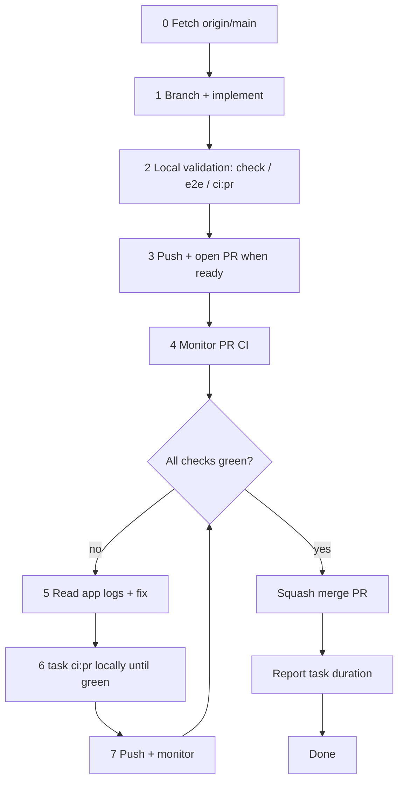

# Pull Request Workflow

Use this checklist for every change that lands on `main`. **AI agents must follow [coding-bro.md](coding-bro.md)** — the default implement-to-merge pipeline — and the detailed [agent pipeline](#agent-pipeline) below. Do not stop at push.

## ⛔ SQUASH MERGE ONLY

**Every PR merged into `main` MUST be squash-merged.**

| Allowed                         | Forbidden                                               |
| ------------------------------- | ------------------------------------------------------- |
| GitHub UI: **Squash and merge** | Create a merge commit                                   |
| CLI: `gh pr merge <n> --squash` | `gh pr merge --merge`                                   |
| One commit per PR on `main`     | `gh pr merge --rebase`                                  |
|                                 | Fast-forward that keeps branch commit history on `main` |

`main` must stay linear: **one squash commit per PR**. Feature branches can have many commits; that history is discarded at merge time.

If you merge a PR for the user, **confirm squash** before completing the merge. Merging any other way is a process violation.

## Agent pipeline

Named **coding bro** in [coding-bro.md](coding-bro.md). End-to-end flow for autonomous agents working on a task:



### 0. Fetch and branch

Fetch before branching so the feature branch starts from current `origin/main`:

```bash
git fetch origin main
git checkout -b <branch-name> origin/main
```

Never commit directly on `main`.

### 1. Implement

### 2. Local checks

**Remote CI is cold and heavy** — fresh runners pull Docker images and run the full prepared test set from scratch (**5+ minutes** plus queue). **Local Docker uses cached images** and is strongly preferred for checking tests, fixing issues, and iterating. Push only when local gates pass; remote CI validates a clean environment for the PR.

**Minimum before push / opening a PR:**

```bash
task format:check    # or task format after edits
task check           # format check, lint, coverage-gated tests, web build (Docker)
```

For scoped changes, faster subsets are acceptable when the touch surface is narrow:

```bash
task web:check && task web:test           # web-only
task rust:test                            # nook-core nextest only (no coverage gate)
task rust:coverage:check                  # nook-core tests + line coverage floor
```

**E2e debug — one spec at a time.** During a fix/debug session, run individual specs instead of the full suite:

```bash
E2E_SPEC=e2e/connect.spec.ts task web:test:e2e:file
```

**Full PR CI mirror** — run before push when web/vault flows change; **mandatory after any remote CI failure**, before the next push:

```bash
task ci:pr    # prepare → verify ‖ web build → full stub e2e
```

Run `task ci:pr` in a loop after a remote failure: fix, re-run until green, then commit and push. This matches what `pr.yml` runs (minus Cloudflare deploy).

| When                            | Command                                 | Why                                                        |
| ------------------------------- | --------------------------------------- | ---------------------------------------------------------- |
| While debugging e2e             | `E2E_SPEC=… task web:test:e2e:file`     | Fast feedback — one spec, not the full suite               |
| Before push / open PR           | `task check` (+ scoped e2e when needed) | Cached local Docker; **must finish before push**           |
| Web/vault/sync changes          | `task web:test:e2e` or `task ci:pr`     | Full stub e2e or PR mirror locally before push             |
| After **any** remote CI failure | `task ci:pr` until green                | Full PR gates locally; **must finish before the fix push** |

See [ci-pipeline.md § Local vs remote CI](ci-pipeline.md#local-vs-remote-ci).

### 3. Local e2e (debug and pre-push validation)

PR CI runs the full stub-backed **e2e** Playwright project. Use a single spec while debugging, then run the full project or `task ci:pr` before pushing changes that touch:

- vault sync, join, or enrollment flows
- login / unlock / password envelope UI
- multi-step web flows or Playwright helpers

**While debugging — one spec at a time** (do not wait for the full suite):

```bash
E2E_SPEC=e2e/connect.spec.ts task web:test:e2e:file
```

**Before push — full stub project or PR mirror:**

```bash
task web:test:e2e          # full stub e2e project in Docker
# or, after task check already built wasm + dist:
task web:test:e2e:parallel
```

Skip e2e for small, isolated Rust-only or docs-only changes.

### 4. Push and open a PR

Push only after local checks pass and the change is ready — include scoped e2e or `task ci:pr` when the touch surface warrants it.

```bash
git push -u origin HEAD
gh pr create --title "…" --body "…"
```

`pr.yml` runs `task ci:pr`: prepare → verify ‖ web build → **full stub e2e**, then deploys a Cloudflare preview. Toolchain publish runs on main only (`ci:main:publish`).

### 5. Monitor CI until green

**Do not stop after opening the PR.** Poll checks until every required job finishes:

```bash
gh pr checks <number> --watch          # blocks until done
# or poll manually:
gh pr view <number> --json statusCheckRollup -q '.statusCheckRollup[] | "\(.name): \(.state) \(.conclusion // "pending")"'
```

### 5.1. Address review comments

Actionable PR feedback is part of the PR gate, whether it comes from a human
reviewer, CodeRabbit, or another automated reviewer. Follow
[code-review-comments.md](../dynamic-skills/code-review-comments.md) for the full
checklist.

Agents must leave their own GitHub reply explaining the fix, validation, or
no-change rationale before resolving any PR comment or review conversation. Do
not resolve comments silently. CodeRabbit's automatic "addressed in commit ..."
text does not count as the agent's reply.

Inspect both CodeRabbit surfaces:

```bash
gh pr view <pr-number> --comments
gh api repos/meta-secret/nook/issues/<pr-number>/comments \
  --jq '.[] | select(.user.login == "coderabbitai") | {url, body}'
```

CodeRabbit can post actionable items in PR timeline/summary comments that are
not inline review threads, including "outside diff range comments", nitpicks,
and collapsed "actionable comments posted" sections. Expand and handle those
items too.

Use the GitHub review-thread GraphQL query from the agent's CodeRabbit workflow
to inspect unresolved inline conversations.

For each active, non-outdated PR review item:

1. Build a checklist item from the thread or summary item, including the
   file/line when available, finding, and any reviewer-provided AI-agent prompt
   when present.
2. Verify the finding against current code before editing.
3. Make the minimal correct fix, or document why the finding no longer applies.
4. Validate locally with the smallest relevant check, then broader checks when
   the touched surface warrants it.
5. Push the fix.
6. Leave a short GitHub reply that states what changed, what validation ran, or
   why no code change was needed. Reply on the review thread when one exists;
   otherwise reply on the PR timeline and reference the review item, URL, or
   CodeRabbit `cr-comment` id.
7. Resolve the GitHub conversation only after the reply is posted, and only when
   the item has a resolvable review thread.

Do not silently resolve review conversations or ignore actionable summary
comments. The PR history must show how each item was handled.
For CodeRabbit review summaries without resolvable threads, leave a PR timeline
comment that lists the summary items reviewed and their outcome before final
handoff.

### 6. Fix loop on failure

Investigation order: **test output** → **static analysis** → **app logs** (most
important after the first two). See
[logging.md § Debugging…](../references/logging.md#debugging-troubleshooting-and-ci-verification).

1. Read the failed job log: `gh run view <run-id> --log-failed`
2. For **e2e / web failures**, read persisted app logs before changing code:
   Playwright attachment `nook-app-logs.json`, local `fetchAppLogs(page)` /
   `/app-logs`, or `dumpNookLogs(page)`.
3. Fix the root cause.
4. **Run full local PR CI and repeat until green:** `task ci:pr` (not just `task check` — remote failure means the gap is likely e2e, web build, or a gate `check` skips).
5. Commit, push, return to step 5.

If the failure was obviously fmt/lint-only, `task format:check` + the relevant lint/test subset can unblock a quick fix — but **never push twice in a row** without escalating to `task ci:pr` after the first remote red build.

### 7. Merge and finish

When **all PR checks pass** and the user asked you to merge (or the task implies merge-on-green):

```bash
gh pr merge <number> --squash
```

After merge, `main.yml` runs full stub **e2e** Playwright. Nightly covers sync-live. The agent's job on the PR is complete once squash-merged.

### 8. Task completion report

Every agent turn that **finishes a user-assigned task** must end with a short **completion report** that includes **how long the work took**.

**When to report:** After the task is done — merged PR, delivered answer, or explicit handoff. Do not omit this on multi-step work that spans monitor/fix/merge cycles; report once at the very end.

**What to measure:** Wall-clock time from when you **started working on the user's request** (first implementation step or investigation for that assignment) until you send the final message. Include CI wait time if you monitored checks as part of the task.

**Format** — add a `## Duration` line (or equivalent) in the final reply:

```markdown
## Duration

12m 34s (started 2026-06-28T20:15:00Z, finished 2026-06-28T20:27:34Z)
```

Rules:

- Use a human-readable duration (`Xm Ys`, or `Xh Ym` when over an hour).
- Include UTC ISO timestamps for start and finish when you can infer them; otherwise duration alone is acceptable.
- If the task was blocked waiting on the user, exclude idle wait time and note `active time: …` vs `elapsed: …`.
- For question-only turns with no implementation, a duration line is optional.

**Docker:** Never kill the Docker daemon — only stop containers (`docker stop`). See [rules.md §5](../rules.md#docker-daemon--never-kill-it).

## Standard flow (summary)

See [coding-bro.md](coding-bro.md) for the numbered 0–9 checklist.

1. Fetch `origin/main`; branch from it.
2. Implement; run `task check` (or scoped subset) before the first push.
3. Push; open PR with summary and test plan.
4. Monitor CI until green.
5. On failure: fix → `task ci:pr` locally until green → push → monitor again.
6. **Squash merge** into `main` when every remote check is green.
7. Delete the branch (optional).
8. **Report task duration** in the final message (see [§ Task completion report](#8-task-completion-report)).

## CLI reference

```bash
# Open PR
gh pr create --title "…" --body "…"

# Merge (ONLY this form)
gh pr merge <number> --squash
```

See also [rules.md §6](../rules.md#6-git--pull-request-workflow).
