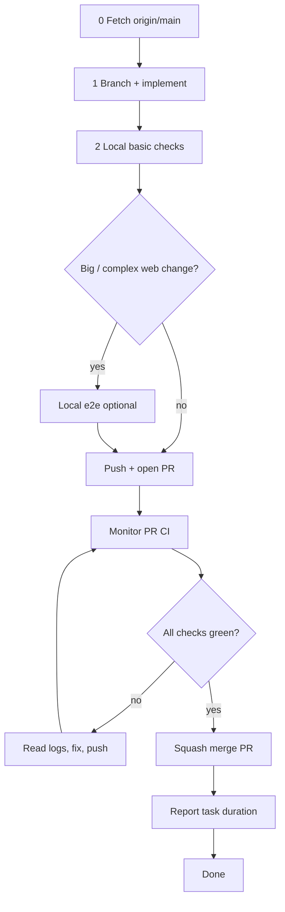

# Pull Request Workflow

Use this checklist for every change that lands on `main`. **AI agents must follow [coding-bro.md](coding-bro.md)** — the default implement-to-merge pipeline — and the detailed [agent pipeline](#agent-pipeline) below. Do not stop at push.

## ⛔ SQUASH MERGE ONLY

**Every PR merged into `main` MUST be squash-merged.**

| Allowed | Forbidden |
|--------|-----------|
| GitHub UI: **Squash and merge** | Create a merge commit |
| CLI: `gh pr merge <n> --squash` | `gh pr merge --merge` |
| One commit per PR on `main` | `gh pr merge --rebase` |
| | Fast-forward that keeps branch commit history on `main` |

`main` must stay linear: **one squash commit per PR**. Feature branches can have many commits; that history is discarded at merge time.

If you merge a PR for the user, **confirm squash** before completing the merge. Merging any other way is a process violation.

## Agent pipeline

Named **coding bro** in [coding-bro.md](coding-bro.md). End-to-end flow for autonomous agents working on a task:



### 0. Fetch and branch

Fetch before branching so the feature branch starts from current `origin/main`:

```bash
git fetch origin main
git checkout -b <branch-name> origin/main
```

Never commit directly on `main`.

### 1. Implement

### 2. Local checks (before every push)

Agents **must** run local checks and unit tests before pushing. Do not open a PR or push fixes on faith that remote CI will catch mistakes — that wastes a full GitHub Actions cycle (~5+ minutes plus queue time) for issues `cargo fmt`, Prettier, clippy, or vitest would catch in seconds.

**Minimum before push:**

```bash
task format:check    # or task format after edits
task check           # format check, lint, unit tests, web build (Docker)
```

For scoped changes, faster subsets are acceptable when the touch surface is narrow:

```bash
task web:check && task web:test    # web-only
task rust:test                     # nook-core only (still run fmt check)
```

**Full PR CI mirror** — run before opening a PR, and **mandatory before the next push after any remote CI failure**:

```bash
task ci:pr    # prepare → verify ‖ web build → e2e-pr (~3–4 min)
```

This matches what `pr.yml` runs (`task ci:pr:publish` minus toolchain push and Cloudflare deploy). One failed remote check is a clear signal: reproduce with `task ci:pr` locally, fix, then push again. That is faster than triggering another full CI run only to fail on formatting or a trivial lint error.

| When | Command | Why |
|------|---------|-----|
| Every push | `task check` (or scoped subset) | Catches fmt, lint, unit tests, build cheaply |
| Before opening PR | `task ci:pr` | Same gates as PR CI including e2e |
| After **any** CI failure | `task ci:pr` | Avoid repeated 5+ min remote failures for the same trivial issue |

See [ci-pipeline.md § Local vs remote CI](ci-pipeline.md#local-vs-remote-ci).

### 3. Local e2e (when the change is big or complex)

PR CI runs **e2e-pr** (~1 min, IndexedDB specs). Agents should still run e2e locally before opening a PR when the change touches:

- vault sync, join, or enrollment flows
- login / unlock / password envelope UI
- multi-step web flows or Playwright helpers

```bash
task web:test:e2e:pr       # fast e2e-pr project in Docker
# or, after task check already built wasm + dist:
task web:test:e2e:pr:parallel
```

Skip e2e-pr for small, isolated Rust-only or docs-only changes.

### 4. Push and open a PR

Push the branch and create a PR with summary and test plan:

```bash
git push -u origin HEAD
gh pr create --title "…" --body "…"
```

`pr.yml` runs `task ci:pr:publish`: prepare → verify ‖ web build → **e2e-pr** → toolchain push, then deploys a Cloudflare preview.

### 5. Monitor CI until green

**Do not stop after opening the PR.** Poll checks until every required job finishes:

```bash
gh pr checks <number> --watch          # blocks until done
# or poll manually:
gh pr view <number> --json statusCheckRollup -q '.statusCheckRollup[] | "\(.name): \(.state) \(.conclusion // "pending")"'
```

### 6. Fix loop on failure

1. Read the failed job log: `gh run view <run-id> --log-failed`
2. **Run full local PR CI before pushing again:** `task ci:pr` (not just `task check` — remote failure means the gap is likely e2e, web build, or a gate `check` skips).
3. Fix the root cause, commit, push.
4. Return to step 5.

If the failure was obviously fmt/lint-only, `task format:check` + the relevant lint/test subset is enough — but **never push twice in a row** without escalating to `task ci:pr` after the first remote red build.

### 7. Merge and finish

When **all PR checks pass** and the user asked you to merge (or the task implies merge-on-green):

```bash
gh pr merge <number> --squash
```

After merge, `main.yml` runs full stub **e2e** Playwright. Nightly covers sync-live. The agent's job on the PR is complete once squash-merged.

### 8. Task completion report

Every agent turn that **finishes a user-assigned task** must end with a short **completion report** that includes **how long the work took**.

**When to report:** After the task is done — merged PR, delivered answer, or explicit handoff. Do not omit this on multi-step work that spans monitor/fix/merge cycles; report once at the very end.

**What to measure:** Wall-clock time from when you **started working on the user's request** (first implementation step or investigation for that assignment) until you send the final message. Include CI wait time if you monitored checks as part of the task.

**Format** — add a `## Duration` line (or equivalent) in the final reply:

```markdown
## Duration
12m 34s (started 2026-06-28T20:15:00Z, finished 2026-06-28T20:27:34Z)
```

Rules:

- Use a human-readable duration (`Xm Ys`, or `Xh Ym` when over an hour).
- Include UTC ISO timestamps for start and finish when you can infer them; otherwise duration alone is acceptable.
- If the task was blocked waiting on the user, exclude idle wait time and note `active time: …` vs `elapsed: …`.
- For question-only turns with no implementation, a duration line is optional.

**Docker:** Never kill the Docker daemon — only stop containers (`docker stop`). See [rules.md §5](../rules.md#docker-daemon--never-kill-it).

## Standard flow (summary)

See [coding-bro.md](coding-bro.md) for the numbered 0–9 checklist.

1. Fetch `origin/main`; branch from it.
2. Implement; run `task check` (or scoped subset) before every push.
3. Run `task ci:pr` before opening the PR; run it again after any remote CI failure.
4. Push; open PR with summary and test plan.
5. Monitor CI until green (fix loop).
6. **Squash merge** into `main`.
7. Delete the branch (optional).
8. **Report task duration** in the final message (see [§ Task completion report](#8-task-completion-report)).

## CLI reference

```bash
# Open PR
gh pr create --title "…" --body "…"

# Merge (ONLY this form)
gh pr merge <number> --squash
```

See also [rules.md §6](../rules.md#6-git--pull-request-workflow).
