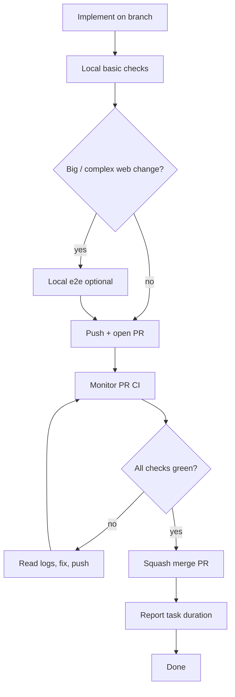

# Pull Request Workflow

Use this checklist for every change that lands on `main`. **AI agents must follow the full [agent pipeline](#agent-pipeline) below** — do not stop at push.

## ⛔ SQUASH MERGE ONLY

**Every PR merged into `main` MUST be squash-merged.**

| Allowed | Forbidden |
|--------|-----------|
| GitHub UI: **Squash and merge** | Create a merge commit |
| CLI: `gh pr merge <n> --squash` | `gh pr merge --merge` |
| One commit per PR on `main` | `gh pr merge --rebase` |
| | Fast-forward that keeps branch commit history on `main` |

`main` must stay linear: **one squash commit per PR**. Feature branches can have many commits; that history is discarded at merge time.

If you merge a PR for the user, **confirm squash** before completing the merge. Merging any other way is a process violation.

## Agent pipeline

End-to-end flow for autonomous agents working on a task:



### 1. Implement

Branch from `main` (never commit directly on `main`). Make the requested change.

### 2. Local basic checks (before opening a PR)

Run static analysis and unit tests inside Docker:

```bash
task format          # if you changed formatting
task check           # format check, lint, unit tests, build
```

For web-only changes, `task web:check` and `task web:test` are faster subsets.

### 3. Local e2e (when the change is big or complex)

PR CI runs **local Playwright e2e** (~1 min, IndexedDB specs, no GitHub API). Agents should still run e2e locally before opening a PR when the change touches:

- vault sync, join, or enrollment flows
- login / unlock / password envelope UI
- multi-step web flows or Playwright helpers

```bash
task web:test:e2e:local    # full local project in Docker
# or, after task check already built wasm + dist:
task web:test:e2e:local:parallel
```

Skip local e2e for small, isolated Rust-only or docs-only changes.

### 4. Push and open a PR

Push the branch and create a PR with summary and test plan:

```bash
git push -u origin HEAD
gh pr create --title "…" --body "…"
```

`pr.yml` runs `task ci:pr:publish`: prepare → verify ‖ web build → **local Playwright e2e** → toolchain push, then deploys a Cloudflare preview.

### 5. Monitor CI until green

**Do not stop after opening the PR.** Poll checks until every required job finishes:

```bash
gh pr checks <number> --watch          # blocks until done
# or poll manually:
gh pr view <number> --json statusCheckRollup -q '.statusCheckRollup[] | "\(.name): \(.state) \(.conclusion // "pending")"'
```

### 6. Fix loop on failure

1. Read the failed job log: `gh run view <run-id> --log-failed`
2. Reproduce locally when practical:
   - verify / lint / build → `task check`
   - PR local e2e failure → `task web:test:e2e:local`
3. Fix the root cause, commit, push.
4. Return to step 5.

### 7. Merge and finish

When **all PR checks pass** and the user asked you to merge (or the task implies merge-on-green):

```bash
gh pr merge <number> --squash
```

After merge, `main.yml` runs full CI including sync-stub Playwright e2e. Nightly covers sync-live. The agent's job on the PR is complete once squash-merged.

### 8. Task completion report

Every agent turn that **finishes a user-assigned task** must end with a short **completion report** that includes **how long the work took**.

**When to report:** After the task is done — merged PR, delivered answer, or explicit handoff. Do not omit this on multi-step work that spans monitor/fix/merge cycles; report once at the very end.

**What to measure:** Wall-clock time from when you **started working on the user's request** (first implementation step or investigation for that assignment) until you send the final message. Include CI wait time if you monitored checks as part of the task.

**Format** — add a `## Duration` line (or equivalent) in the final reply:

```markdown
## Duration
12m 34s (started 2026-06-28T20:15:00Z, finished 2026-06-28T20:27:34Z)
```

Rules:

- Use a human-readable duration (`Xm Ys`, or `Xh Ym` when over an hour).
- Include UTC ISO timestamps for start and finish when you can infer them; otherwise duration alone is acceptable.
- If the task was blocked waiting on the user, exclude idle wait time and note `active time: …` vs `elapsed: …`.
- For question-only turns with no implementation, a duration line is optional.

**Docker:** Never kill the Docker daemon — only stop containers (`docker stop`). See [rules.md §5](../rules.md#docker-daemon--never-kill-it).

## Standard flow (summary)

1. Branch from `main`.
2. Implement; run `task check` locally.
3. Run `task web:test:e2e:local` when the web change is big or complex.
4. Push; open PR with summary and test plan.
5. Monitor CI until green (fix loop).
6. **Squash merge** into `main`.
7. Delete the branch (optional).
8. **Report task duration** in the final message (see [§ Task completion report](#8-task-completion-report)).

## CLI reference

```bash
# Open PR
gh pr create --title "…" --body "…"

# Merge (ONLY this form)
gh pr merge <number> --squash
```

See also [rules.md §6](../rules.md#6-git--pull-request-workflow).
