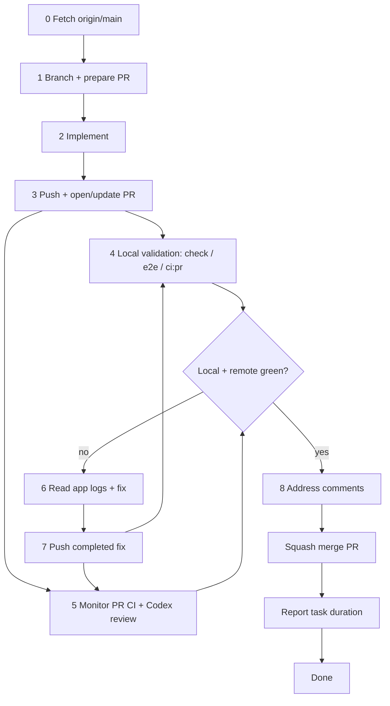

# Pull Request Workflow

Use this checklist for every change that lands on `main`. **AI agents must follow [coding-bro.md](coding-bro.md)** — the default implement-to-merge pipeline — and the detailed [agent pipeline](#agent-pipeline) below. Do not stop at push.

## PR-first agent contract

For implementation tasks, the agent's default job is not "make local edits"; it
is "land a reviewed, green PR." Start by establishing the PR path, then keep
ownership until merge or an explicit blocked handoff:

1. **Prepare the PR path first** — fetch `origin/main`, create a feature branch,
   and define the PR title/body/scope before coding.
2. **Implement functionality** — make the requested code/docs/tests changes on
   the feature branch with focused local checks while iterating.
3. **Push and create/update the PR** — push a coherent commit and open the PR;
   later fixes update that same PR.
4. **Monitor the PR** — watch GitHub Actions, required deployments, and review
   feedback until the PR is genuinely ready.
5. **Fix failed GitHub Actions** — inspect failed logs, consult app logs for
   web/e2e failures, fix locally, push the completed fix, and re-watch CI until
   green.
6. **Address comments** — reply to actionable human, Codex, and automated
   comments with the fix, validation, or no-change rationale, then push any
   needed changes and re-watch checks.
7. **Merge when ready and green** — after the branch is current with
   `origin/main`, all required checks/deployments are green, and comments are
   handled, squash-merge the PR when the user asked for merge-on-green.

## ⛔ SQUASH MERGE ONLY

**Every PR merged into `main` MUST be squash-merged.**

| Allowed                         | Forbidden                                               |
| ------------------------------- | ------------------------------------------------------- |
| GitHub UI: **Squash and merge** | Create a merge commit                                   |
| CLI: `gh pr merge <n> --squash` | `gh pr merge --merge`                                   |
| One commit per PR on `main`     | `gh pr merge --rebase`                                  |
|                                 | Fast-forward that keeps branch commit history on `main` |

`main` must stay linear: **one squash commit per PR**. Feature branches can have many commits; that history is discarded at merge time.

If you merge a PR for the user, **confirm squash** before completing the merge. Merging any other way is a process violation.

## Agent pipeline

Named **coding bro** in [coding-bro.md](coding-bro.md). End-to-end flow for autonomous agents working on a task:



### 0. Fetch and branch

Fetch before branching so the feature branch starts from current `origin/main`:

```bash
git fetch origin main
git checkout -b <branch-name> origin/main
```

Never commit directly on `main`.

### 1. Prepare the PR path

Before editing, decide the branch name and PR scope/title/body. The PR may be
opened after the first coherent commit, but the work should already be organized
around getting that PR green and merged.

### 2. Implement

### 3. Push at the final-validation boundary

When the branch has a coherent implementation commit, commit and push/open or
update the PR **before** starting the long final local gate. This lets remote CI
and local Docker validation run in the same wall-clock window. This is not a
license to push half-finished work: use scoped local checks while implementing,
and push only when the PR branch is ready for final validation.

```bash
git push -u origin HEAD
gh pr create --title "…" --body "…"
```

Codex automatically reviews PRs on open and every push. If automatic review does
not run or a one-off focused pass is needed, post `@codex review` once the branch
is coherent. See [code-review.md](code-review.md).

### 5. Local checks

**Remote CI is cold and heavy** — fresh runners pull Docker images and run the
full prepared test set from scratch (**5+ minutes** plus queue). **Local Docker
uses cached images** and is strongly preferred for checking tests, fixing issues,
and iterating. Once the iteration is ready for final validation, push first and
run the local gate immediately while remote CI runs. Remote CI validates a clean
environment for the PR; local Docker remains the primary diagnostic loop.

**Minimum local final gate before merge or handoff:**

```bash
task format:check    # or task format after edits
task check           # format check, lint, coverage-gated tests, web build (Docker)
```

For scoped changes, faster subsets are acceptable when the touch surface is narrow:

```bash
task web:check && task web:test           # web-only
task rust:test                            # nook-core + nook-auth2 nextest only (no coverage gate)
task rust:coverage:check                  # nook-core + nook-auth2 tests + line coverage floor
```

**E2e debug — one spec at a time.** During a fix/debug session, run individual specs instead of the full suite:

```bash
E2E_SPEC=e2e/connect.spec.ts task web:test:e2e:file
```

**Full PR CI mirror** — run in the parallel local gate; **mandatory before merge/handoff** after any broad remote PR CI failure:

```bash
task ci:pr    # prepare → verify ‖ web build (no browser e2e)
```

After a remote failure, fix the root cause, push the completed fix, and run
`task ci:pr` locally while the refreshed remote run executes. This matches what
`pr.yml` runs (minus Cloudflare deploy).

| When                            | Command                                 | Why                                                        |
| ------------------------------- | --------------------------------------- | ---------------------------------------------------------- |
| While debugging e2e             | `E2E_SPEC=… task web:test:e2e:file`     | Fast feedback — one spec, not the full suite               |
| Final validation boundary       | `git push` / `gh pr create`            | Start remote CI before long local checks                   |
| Normal final local gate         | `task check` (+ scoped e2e when needed) | Cached local Docker; runs in parallel with remote CI       |
| Web/vault/sync changes          | `task web:test:e2e` or `task ci:pr:e2e` | Explicit full local-provider or web + extension e2e        |
| After broad remote CI failure   | `task ci:pr`                           | Full PR gates locally before merge/handoff                 |

See [ci-pipeline.md § Local vs remote CI](ci-pipeline.md#local-vs-remote-ci).

### 5.1. Local e2e (debug and final validation)

PR CI intentionally omits browser e2e; `main.yml` is the automatic full-suite gate after merge. Use a single spec while debugging, then run the full project or `task ci:pr:e2e` explicitly before merge for changes that touch:

- vault sync, join, or enrollment flows
- login / unlock / password envelope UI
- multi-step web flows or Playwright helpers

**While debugging — one spec at a time** (do not wait for the full suite):

```bash
E2E_SPEC=e2e/connect.spec.ts task web:test:e2e:file
```

**Final local e2e gate — full local-provider project or web + extension wrapper:**

```bash
task web:test:e2e          # full local-provider e2e project in Docker
# or include extension e2e as well:
task ci:pr:e2e
```

Skip e2e for small, isolated Rust-only or docs-only changes.

### 6. Monitor CI and review until green

`pr.yml` runs `task ci:pr`: prepare → verify ‖ web build, with **no browser e2e**, then deploys a Cloudflare preview and records it as a successful `github-pages` deployment for ruleset enforcement. Toolchain publish and the automatic full browser e2e gate run on main only (`ci:main:publish`).

**Do not stop after opening the PR.** Poll checks until every required job finishes:

```bash
gh pr checks <number> --watch          # blocks until done
# or poll manually:
gh pr view <number> --json statusCheckRollup -q '.statusCheckRollup[] | "\(.name): \(.state) \(.conclusion // "pending")"'
```

Before treating a PR as mergeable, **always verify the branch against the latest
`origin/main`**. Do this every time, even when all visible checks are green. If a
green PR cannot merge, assume the first and most likely blocker is that `main`
advanced and the PR branch is stale. GitHub may surface that stale-branch state
as an "Update branch" requirement, `mergeStateStatus: BLOCKED`, or a missing
active `github-pages` deployment because the green run belongs to an older base.
Fetch `main`, compare divergence, and update the PR branch before chasing other
ruleset or deployment explanations:

```bash
git fetch origin main
git rev-list --left-right --count HEAD...origin/main
gh pr view <number> --json mergeStateStatus,baseRefOid,headRefOid,statusCheckRollup
```

If the branch is behind `origin/main`, merge the base branch into the PR branch,
push, then re-watch CI and deployment status from the new head SHA. Do not
attempt to merge, enable auto-merge, or diagnose deployment policy until this
freshness check passes:

```bash
git merge origin/main --no-edit
git push origin HEAD
gh pr checks <number> --watch
```

### 6.1. Address review comments

Actionable PR feedback is part of the PR gate, whether it comes from a human
reviewer, Codex, or another automated reviewer. Follow
[code-review-comments.md](../dynamic-skills/code-review-comments.md) for the full
checklist.

Agents must leave their own GitHub reply explaining the fix, validation, or
no-change rationale before resolving any PR comment or review conversation. Do
not resolve comments silently. Inspect submitted review bodies as well as inline
review threads and PR comments:

```bash
gh pr view <pr-number> --comments
head_sha="$(gh pr view <pr-number> --json headRefOid --jq .headRefOid)"
gh api repos/meta-secret/nook/pulls/<pr-number>/reviews \
  --jq ".[] | {user: .user.login, state, body, html_url, commit_id, current_head: (.commit_id == \"$head_sha\")}"
```

Treat actionable submitted-review bodies as current only when `current_head` is
`true`. Keep older review bodies as audit context, and use thread `isOutdated`
state plus the current code when deciding whether an older inline finding still
needs a reply.

Use the GitHub review-thread GraphQL query from the
[code-review-comments skill](../dynamic-skills/code-review-comments.md) to
inspect unresolved inline conversations. Reply only on actual review
threads/comments that support targeted replies. Track actionable submitted
review-body items without a threaded reply target in the checklist/final handoff
rather than creating comment spam. If automatic review does not run or a one-off
focused pass is needed, post one `@codex review`. See [code-review.md](code-review.md).

### 7. Fix loop on failure

Investigation order: **test output** → **static analysis** → **app logs** (most
important after the first two). See
[logging.md § Debugging…](../references/logging.md#debugging-troubleshooting-and-ci-verification).

1. Read the failed job log: `gh run view <run-id> --log-failed`
2. For **e2e / web failures**, read persisted app logs before changing code:
   Playwright attachment `nook-app-logs.json`, local `fetchAppLogs(page)` /
   `/app-logs`, or `dumpNookLogs(page)`.
3. Fix the root cause.
4. Push the completed fix so remote CI restarts.
5. **Run full local PR CI while remote CI runs:** `task ci:pr` (not just `task check` — a broad remote failure may be in the production web build or another gate `check` skips). For a browser failure from main/nightly or a high-risk web change, also run the matching e2e spec/project.
6. Return to step 5 and wait for both local and remote green.

If the failure was obviously fmt/lint-only, `task format:check` + the relevant
lint/test subset can prove the fix. For broader failures, use `task ci:pr` as
the local gate on the latest pushed head before merge or handoff.

### 8. Merge and finish

When **all PR checks pass**, the branch is current with `origin/main`, and the
user asked you to merge (or the task implies merge-on-green):

```bash
gh pr merge <number> --squash
```

After merge, `main.yml` runs full local-provider and extension **e2e**. Nightly covers sync-live. Failures in either workflow invoke the `ci-fix` AI worker, which opens a fix PR, waits for checks, and squash-merges the repair.

### 9. Task completion report

Every agent turn that **finishes a user-assigned task** must end with a short **completion report** that includes **how long the work took**.

**When to report:** After the task is done — merged PR, delivered answer, or explicit handoff. Do not omit this on multi-step work that spans monitor/fix/merge cycles; report once at the very end.

**What to measure:** Wall-clock time from when you **started working on the user's request** (first implementation step or investigation for that assignment) until you send the final message. Include CI wait time if you monitored checks as part of the task.

**Format** — add a `## Duration` line (or equivalent) in the final reply:

```markdown
## Duration

12m 34s (started 2026-06-28T20:15:00Z, finished 2026-06-28T20:27:34Z)
```

Rules:

- Use a human-readable duration (`Xm Ys`, or `Xh Ym` when over an hour).
- Include UTC ISO timestamps for start and finish when you can infer them; otherwise duration alone is acceptable.
- If the task was blocked waiting on the user, exclude idle wait time and note `active time: …` vs `elapsed: …`.
- For question-only turns with no implementation, a duration line is optional.

**Docker:** Never kill the Docker daemon — only stop containers (`docker stop`). See [rules.md §5](../rules.md#docker-daemon--never-kill-it).

## Standard flow (summary)

See [coding-bro.md](coding-bro.md) for the numbered 0–10 checklist.

1. Fetch `origin/main`; branch from it.
2. Implement and push/open/update the PR when the iteration is ready for final validation.
3. Confirm automatic Codex review ran on the latest push; request `@codex review` only when automatic review does not run or a one-off focus is needed.
4. Run `task check` (or scoped subset) while remote CI runs.
5. Monitor CI and PR review until green.
6. On failure: fix → push completed fix → run the required local gate while CI refreshes.
7. **Squash merge** into `main` when every remote check is green.
8. Delete the branch (optional).
9. **Report task duration** in the final message (see [§ Task completion report](#9-task-completion-report)).

## CLI reference

```bash
# Open PR
gh pr create --title "…" --body "…"

# Merge (ONLY this form)
gh pr merge <number> --squash
```

See also [rules.md §6](../rules.md#6-git--pull-request-workflow).
